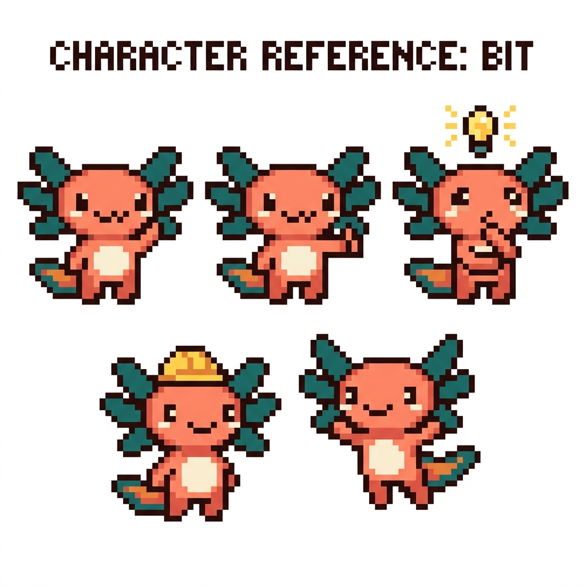

# Manuales de Aprendizaje — Aprende a Programar (con tus propios proyectos)

> Un curso completo, en español, pensado para alguien con conocimientos **limitados** de
> programación y redes, que quiere **dejar de depender del "vibe coding"** (pedirle a la IA
> que escriba el código sin entenderlo) y empezar a dar **órdenes precisas**.

Este manual no enseña con ejemplos abstractos: enseña con **tu propio código**, el que ya
existe en tus cuatro proyectos. Cada concepto técnico se explica desde cero, con la fórmula:

> **¿Qué significa?** → **¿Para qué sirve?** → **¿Dónde se usa en tu proyecto?** → **Ejemplo** → **Ejercicio**

---

## Conoce a Bit 🦎

<p align="center">
  
</p>

**Bit** es tu guía a lo largo del manual: un ajolote en *pixel art* (su nombre viene del
*bit*, la unidad mínima de información que verás en el Módulo 00). Aparece en cada capítulo
para acompañarte —pensando en las definiciones, con casco en las advertencias y celebrando
cuando terminas un módulo—. No es un experto que presume: **aprende contigo**.

---

## ¿Qué vas a aprender y de dónde sale cada cosa?

Tus proyectos forman una "escalera" que va de lo más fácil a lo más avanzado:

| Módulo | Tema | De qué proyecto tuyo sale |
|---|---|---|
| **00** | Fundamentos (cómo funciona la computadora, internet, la web, la terminal, Git) | Base para todo |
| **01** | **HTML** — la estructura de una página web | `tunal-digital` |
| **02** | **CSS** — colores, tipografías, diseño y "responsive" | `tunal-digital` |
| **03** | **JavaScript** — darle vida e interactividad a la página | `tunal-digital` |
| **04** | **Python** — un lenguaje para apps y lógica, con el framework Flet | `PolyPaw` |
| **05** | **TypeScript** — JavaScript "con seguridad" (tipos) | `RachaSimple` / `Faro` |
| **06** | **React** — construir interfaces con piezas reutilizables | `RachaSimple` / `Faro` |
| **07** | **Bases de datos y SQL** — guardar datos (Supabase / Postgres) | `RachaSimple` / `Faro` |
| **08** | **APIs, OAuth e IA** — conectar tu app con otros servicios | `Faro` / `tunal-digital` |
| **09** | **NAS y servidores** — tu servidor casero `polypaw-nas` | Tu Acer Nitro 5 |

> Los módulos **00 a 08** te enseñan a programar. El módulo **09** es aparte: trata de
> **servidores y redes**, partiendo de tu NAS real.

---

## ¿Cómo está organizado?

```
Manuales-de-aprendizaje/
├── README.md            ← estás aquí (portada e índice)
├── COMO-ESTUDIAR.md     ← léelo ANTES de empezar: método y cómo preparar tu computadora
├── modulos/             ← el contenido, un módulo por carpeta
│   └── NN-tema/
│       ├── README.md        ← índice del módulo
│       ├── 01-....md        ← capítulos numerados
│       ├── ejercicios/      ← retos para practicar
│       └── soluciones/      ← respuestas (no espíes antes de intentar 😉)
├── site/                ← la versión en HTML (para leer en el navegador, con imágenes)
│   ├── index.html
│   └── estilos.css
└── recursos/            ← imágenes y diagramas del manual
```

Cada módulo existe en **dos formatos**:
- **Markdown (`.md`)** dentro de `modulos/` — texto simple, ideal para leer en GitHub o el teléfono.
- **HTML** dentro de `site/` — más visual, con las ilustraciones, para abrir en el navegador.

---

## ¿Por dónde empiezo?

1. Lee **[COMO-ESTUDIAR.md](COMO-ESTUDIAR.md)**.
2. Haz el **Módulo 00 (Fundamentos)** completo, sin saltártelo.
3. Sigue el orden de los módulos. Cada uno asume que ya hiciste los anteriores.
4. **Haz los ejercicios.** Leer no es aprender; aprender es *hacer y equivocarse*.

> 💡 Por ahora puedes leer desde el teléfono. Los ejercicios prácticos los harás en tu
> computadora; cada módulo te dice exactamente qué instalar y cómo.

---

## Cómo se construyó este manual

Se generó con un equipo de agentes de IA especializados: investigación del tema y de tu
código, diseño pedagógico (expertos en **andragogía** —enseñanza para adultos— y en
programación), redacción didáctica, control de calidad, y un equipo de **arte** que creó las
ilustraciones con IA. Todo revisado para que **ningún término quede sin explicar**.
