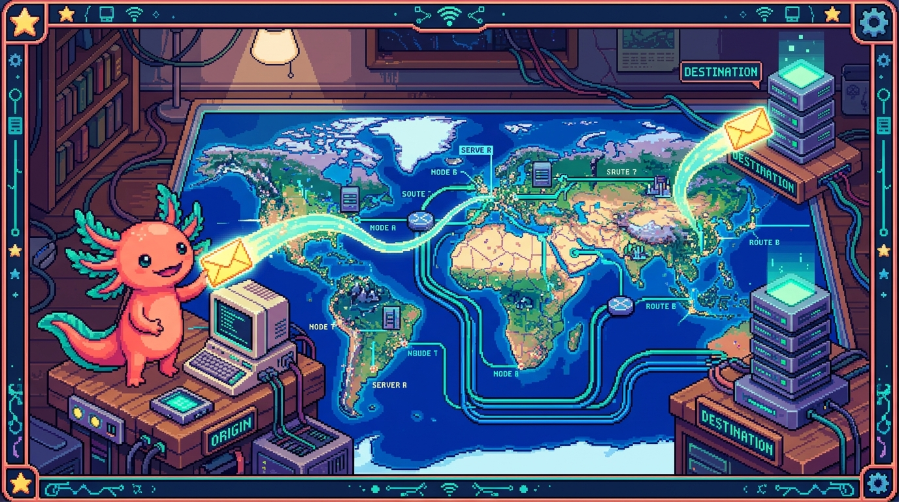

# Capítulo 03 — Internet y la web

  

> Tus cuatro proyectos viven en internet o se conectan a él. Aquí vas a entender, sin nada de
> magia, qué ocurre exactamente desde que escribes una dirección hasta que aparece una página
> en pantalla. Este capítulo es la base del módulo de NAS y redes (09) y de casi todo lo "web".

---

## 1. Internet no es lo mismo que "la web"

Mucha gente usa las dos palabras como si fueran lo mismo. No lo son.

> ### 🟦 ¿Qué significa? — *Internet*
> **Internet** es la **red física** que conecta millones de computadoras de todo el mundo con
> cables, fibra óptica, antenas y satélites. Es la "carretera". Por ella viaja de todo: correos,
> videollamadas, partidas de un juego, mensajes… **y también** páginas web.

> ### 🟦 ¿Qué significa? — *La web (World Wide Web)*
> La **web** es **uno de los servicios** que funcionan *sobre* internet: el de las páginas que
> ves en un navegador, enlazadas unas con otras. La web se mueve por internet como por una
> carretera, pero no es la carretera en sí. WhatsApp, por ejemplo, también usa internet y no por
> eso es "la web".

Para fijar la idea: internet es el **sistema de carreteras**; la web es **uno de los servicios**
que circulan por él, igual que el correo postal usa las carreteras sin *ser* la carretera.

---

## 2. El modelo cliente–servidor (la idea más importante del capítulo)

Casi todo en la web gira en torno a dos papeles: **cliente** y **servidor**.

> ### 🟦 ¿Qué significa? — *Cliente*
> El **cliente** es quien **pide** algo. En la web, el cliente de cada día es tu **navegador**
> (Chrome, Firefox…). Cuando abres una página, tu navegador *pide* esa página a alguien.

> ### 🟦 ¿Qué significa? — *Servidor*
> El **servidor** es la computadora (siempre encendida) que **recibe esa petición y responde**
> con lo que le pidieron: el texto, las imágenes, los datos.
> **¿Dónde se usa en tu proyecto?** Cuando alguien entra a `tunaldigital.com`, el servidor de
> **Cloudflare** le manda tu `index.html`, tu `styles.css` y tu `main.js`. Tu **NAS** `polypaw-nas`
> también es un servidor: responde cada vez que le pides archivos por Samba.

> ### 💡 Tip — Una misma computadora puede ser cliente y servidor
> Tu laptop es **cliente** cuando navega, pero se vuelve **servidor** en cuanto instalas algo que
> "sirva" cosas a otros (como tu Acer Nitro convertido en NAS). El papel no lo da el aparato, sino
> lo que está haciendo en ese momento.

El movimiento de fondo es siempre el mismo: **el cliente pide → el servidor responde**. A esa
pareja se le llama *petición y respuesta* (en inglés, *request* y *response*).

---

## 3. Direcciones: IP, dominios y DNS

Para que una carta llegue, hace falta una dirección. En internet ocurre exactamente igual.

> ### 🟦 ¿Qué significa? — *Dirección IP*
> Una **IP** (*Internet Protocol address*) es el **número que identifica** a cada dispositivo
> dentro de una red, por ejemplo `192.168.1.50` (en tu casa) o `172.67.12.34` (en internet).
> Gracias a ella, los datos saben a qué máquina tienen que ir.
> **¿Dónde se usa en tu proyecto?** Tu NAS tiene su propia IP dentro de tu red local, y por esa
> IP lo localizan los demás dispositivos de tu casa.

> ### 🟦 ¿Qué significa? — *Dominio*
> Un **dominio** es el **nombre fácil de recordar** que usamos en lugar del número IP, como
> `tunaldigital.com` o `google.com`. A las personas se nos quedan los nombres, no los números.

> ### 🟦 ¿Qué significa? — *DNS (sistema de nombres de dominio)*
> El **DNS** (*Domain Name System*) es la **"agenda de contactos" de internet**: traduce un
> dominio (el nombre) a su IP (el número). Cuando escribes `tunaldigital.com`, tu computadora le
> pregunta a un servidor DNS "¿cuál es la IP de esto?", y con la respuesta ya sabe a dónde ir.
> **¿Dónde se usa en tu proyecto?** **AdGuard Home**, que tienes instalado en tu NAS, es justo
> eso: un servidor DNS. Traduce nombres a IPs y, de paso, **bloquea** los dominios de anuncios
> (para ellos contesta "no existe"). Lo verás con calma en el módulo 09.

> ### 🟦 ¿Qué significa? — *Puerto*
> Si la IP es la dirección de un edificio, el **puerto** es **el número de apartamento**: un
> número que dice *qué servicio* dentro de esa máquina debe atender la petición. Las webs
> normales usan el puerto **80** (HTTP) o **443** (HTTPS); tu panel **Cockpit** usa el **9090**.
> Por eso lo abres como `https://polypaw-nas:9090`: la máquina más el apartamento.

---

## 4. HTTP y HTTPS: el idioma de la web

Para entenderse, cliente y servidor tienen que hablar el mismo idioma. En la web, ese idioma es
HTTP.

> ### 🟦 ¿Qué significa? — *HTTP*
> **HTTP** (*HyperText Transfer Protocol*, "protocolo de transferencia de hipertexto") son las
> **reglas** con las que el navegador pide y el servidor responde páginas y datos. Y un
> *protocolo* no es más que un conjunto de reglas acordadas para poder comunicarse.

> ### 🟦 ¿Qué significa? — *HTTPS y por qué la "s" importa*
> **HTTPS** es HTTP **seguro**: la "s" viene de *secure*. Cifra (codifica) la información para que
> nadie por el camino pueda leerla ni manipularla. Esa es la razón del **candado** 🔒 que ves en
> el navegador.
> **Regla práctica:** cualquier sitio que te pida datos (contraseñas, formularios) **tiene** que
> usar HTTPS. El sitio de Tunal Digital lo usa.

> ### 🟦 ¿Qué significa? — *Métodos HTTP (GET, POST…)*
> Cada petición HTTP lleva un **método** que indica *qué quieres hacer*:
> - **GET** → "dame" algo (leer una página o unos datos). Es el más habitual.
> - **POST** → "toma" estos datos (enviar un formulario, crear algo).
> - **PUT** → "actualiza" algo que ya existe.  **DELETE** → "borra" algo.
> **¿Dónde se usa en tu proyecto?** En Faro, `src/app/api/projects/` responde a GET (listar
> proyectos), POST (crear), PUT (editar) y DELETE (borrar). Lo verás en el módulo 08 (APIs).

> ### 🟦 ¿Qué significa? — *Código de estado HTTP*
> Cada respuesta trae un **número de estado** que resume cómo salió la cosa:
> - **200** → todo bien.
> - **404** → "no encontrado" (la página o el recurso no existe).
> - **403** → "prohibido" (no tienes permiso). *(Este error me salió justo cuando intenté entrar
>   a un repositorio fuera de mi alcance.)*
> - **500** → error del servidor.
> Tener estos cuatro en la cabeza te ahorra muchísimo tiempo cuando estés depurando.

---

## 5. Qué pasa, paso a paso, al abrir una página

Pongamos todas las piezas juntas. Cuando escribes `tunaldigital.com` y pulsas Enter:

1. **DNS:** tu computadora pregunta "¿cuál es la IP de `tunaldigital.com`?" y recibe, por
   ejemplo, `172.67.12.34`.
2. **Conexión:** tu navegador (el cliente) abre una conexión a esa IP, al puerto 443 (HTTPS).
3. **Petición:** el navegador envía una petición HTTP `GET /` ("dame la página principal").
4. **Respuesta:** el servidor contesta con estado `200` y el contenido: el archivo
   `index.html`.
5. **Lectura del HTML:** el navegador lee ese HTML y se da cuenta de que necesita más archivos
   (el `styles.css` para los colores, el `main.js` para la interactividad). Por cada uno lanza
   **otra** petición GET.
6. **Dibujado (render):** con el HTML (la estructura), el CSS (el aspecto) y el JavaScript (la
   lógica) ya en mano, el navegador **dibuja** la página en tu pantalla.

> ### 💡 Tip — Esto explica el orden de tus módulos
> Fíjate en lo que acaba de pasar: el navegador necesita **HTML + CSS + JavaScript**. Por eso el
> manual los enseña en ese orden (módulos 01, 02, 03): es exactamente como se arma una página.

---

## 6. Frontend y backend

Dos palabras que vas a oír todo el tiempo.

> ### 🟦 ¿Qué significa? — *Frontend (la parte de adelante)*
> El **frontend** es todo lo que sucede **en el navegador del usuario**: lo que se ve y se toca
> (HTML, CSS, JavaScript). "Front" = frente, la cara visible.

> ### 🟦 ¿Qué significa? — *Backend (la parte de atrás)*
> El **backend** es lo que sucede **en el servidor**, fuera de la vista: guardar datos, comprobar
> contraseñas, hablar con la base de datos, llamar a la IA. "Back" = atrás.
> **¿Dónde se usa en tu proyecto?** En Faro, las carpetas `src/components/` son frontend (lo que
> se ve); `src/app/api/` es backend (lo que se procesa en el servidor). Los **Cloudflare
> Workers** de tunal-digital también son backend.

---

## ✅ Checklist — ¿ya domino esto?

- [ ] Distingo **internet** (la red física) de **la web** (un servicio sobre ella).
- [ ] Explico el modelo **cliente–servidor** (pedir / responder).
- [ ] Sé qué son **IP**, **dominio**, **DNS** y **puerto**, y cómo se relacionan.
- [ ] Entiendo **HTTP/HTTPS**, los **métodos** (GET/POST…) y los **estados** (200/404/403/500).
- [ ] Puedo narrar, paso a paso, qué pasa al abrir una página.
- [ ] Diferencio **frontend** de **backend**.

---

## 🧪 Ejercicios

1. **La analogía de la carta.** Explica, con la analogía del correo postal, qué papel juegan
   la **IP**, el **dominio**, el **DNS** y el **puerto**.
2. **Lee estados.** ¿Qué significa cada uno y qué harías como programador? (a) 404 al cargar
   una imagen, (b) 403 al entrar a una página, (c) 500 al enviar un formulario.
3. **Frontend o backend.** Clasifica: el color de un botón; verificar una contraseña; el texto
   que ves; guardar un hábito en la base de datos; una animación al pasar el cursor.
4. 💻 **Ver una petición real.** En tu computadora, abre cualquier web, pulsa `F12` (Herramientas
   de desarrollador), pestaña **Network** (Red) y recarga. Verás la lista de peticiones.
   Anota: ¿cuántas hubo? ¿Ves alguna con estado 200? ¿Cuál fue la primera?
5. **Tu propio NAS.** Tu NAS usa el puerto 9090 para Cockpit. Si quisieras también servir una
   web normal desde él, ¿qué puerto usarías y por qué?

➡️ Siguiente: **[Capítulo 04 — La terminal](04-la-terminal.md)**.
