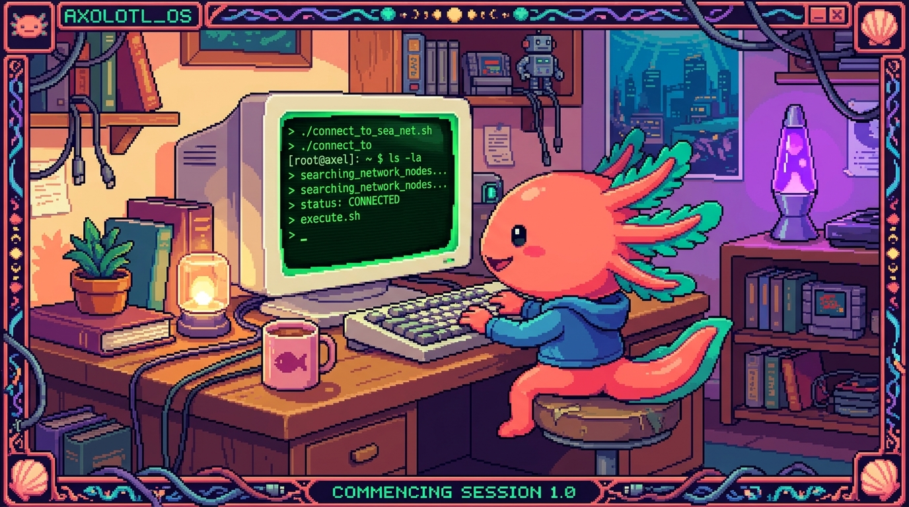

# Capítulo 04 — La terminal

<p align="center">
  
</p>


> La terminal intimida al principio (es esa pantalla negra que sale en las películas de
> "hackers"), pero la verdad es que resulta mucho **más simple** de lo que parece, y a la vez
> es de las herramientas que más rinden. La vas a usar para Git, para Python, para tu NAS y para
> casi todo lo demás. Vamos despacio, paso a paso.

---

## 1. ¿Qué es la terminal y por qué existe?

> ### 🟦 ¿Qué significa? — *Terminal (o línea de comandos)*
> La **terminal** es un programa donde **le das órdenes a la computadora escribiéndolas con el
> teclado**, en vez de hacer clics con el ratón. Escribes un **comando** (una orden), pulsas
> Enter, y la computadora lo ejecuta y te contesta con texto.
> También se le dice *línea de comandos*, *consola* o *CLI* (*Command-Line Interface*,
> "interfaz de línea de comandos").

> ### 🟦 ¿Qué significa? — *Interfaz gráfica (GUI) vs. CLI*
> La manera de siempre de usar una computadora —ventanas, íconos, ratón— se llama **GUI**
> (*Graphical User Interface*, "interfaz gráfica de usuario"). La terminal es justo lo
> contrario: solo texto (**CLI**). Las dos sirven para lo mismo, dar órdenes, pero cada una a
> su modo.

**¿Para qué usar texto teniendo ratón?** Por tres motivos que pesan:

1. **Precisión:** un comando hace *exactamente* una cosa, sin lugar a dudas.
2. **Velocidad y repetición:** en una sola línea haces lo que con el ratón te costaría 50 clics,
   y además puedes **automatizar** tareas (que se repitan solas).
3. **Servidores sin pantalla:** tu NAS no tiene monitor ni ratón conectados; se administra
   **por terminal** (así es como corre Ubuntu Server, de hecho). Sin terminal, no hay servidor.

> ### 🟦 ¿Qué significa? — *Shell*
> El **shell** ("caparazón") es el **programa que interpreta** lo que escribes en la terminal y
> se lo traslada al sistema. Piensa en la diferencia entre la *ventana* (la terminal) y el
> *cerebro* que entiende los comandos (el shell). Los más comunes son **bash** y **zsh** en
> Linux/macOS, y **PowerShell** en Windows. Por ahora no te líes con los nombres: quédate con
> que "shell" = el que entiende tus comandos.

---

## 2. Cómo abrir la terminal (en tu computadora)

- **Windows:** busca "PowerShell" o "Terminal" en el menú Inicio. (Si más adelante quieres
  practicar comandos al estilo Linux, puedes instalar "WSL", pero ahora mismo no hace falta.)
- **macOS:** abre "Terminal" (la encuentras en Aplicaciones → Utilidades, o búscala con
  Spotlight).
- **Linux / tu NAS:** aquí la terminal *es* la forma principal de trabajar. A tu NAS te
  conectarás de forma remota (eso lo verás en el módulo 09).

Al abrirla te aparecerá algo parecido a `usuario@maquina:~$` y un cursor parpadeando. Eso es el
**prompt**: la terminal te está diciendo "estoy lista, escribe una orden".

> ### 🟦 ¿Qué significa? — *Directorio de trabajo actual*
> La terminal siempre está "parada" dentro de **una carpeta** (un *directorio*). Esa es tu
> **ubicación actual**, y muchos comandos actúan sobre ella. El símbolo `~` significa "tu
> carpeta personal" (la de tu usuario).

---

## 3. Los comandos para sobrevivir (moverte y mirar)

Estos los usarás el 80% del tiempo. Cuando tengas tu computadora a mano, pruébalos en orden.

| Comando | Qué hace | Ejemplo |
|---|---|---|
| `pwd` | *Print Working Directory*: muestra **en qué carpeta estás** | `pwd` |
| `ls` | *List*: **lista** los archivos y carpetas de donde estás | `ls` |
| `cd` | *Change Directory*: **entra** a una carpeta | `cd Documentos` |
| `cd ..` | **sube** un nivel (a la carpeta de arriba) | `cd ..` |
| `mkdir` | *Make Directory*: **crea** una carpeta | `mkdir proyectos` |
| `touch` | **crea** un archivo vacío (Linux/macOS) | `touch notas.txt` |
| `cat` | muestra el **contenido** de un archivo | `cat notas.txt` |
| `cp` | *Copy*: **copia** un archivo | `cp notas.txt copia.txt` |
| `mv` | *Move*: **mueve** o **renombra** | `mv notas.txt diario.txt` |
| `rm` | *Remove*: **borra** un archivo | `rm copia.txt` |
| `clear` | **limpia** la pantalla | `clear` |

> ### ⚠️ Cuidado — `rm` no tiene papelera
> En la terminal, `rm` **borra de verdad**: no pasa por la papelera de reciclaje y no hay
> "deshacer". Ojo sobre todo con `rm -r`, que borra una carpeta entera con *todo* lo que tenga
> dentro. Antes de borrar nada, lanza un `ls` para confirmar que estás donde crees que estás.

> ### 🟦 ¿Qué significa? — *Argumento y opción (flag)*
> Un comando puede llevar extras:
> - Un **argumento** es *sobre qué* actúa: en `cd Documentos`, `Documentos` es el argumento.
> - Una **opción** o **flag** cambia *cómo* actúa, y casi siempre empieza con `-`: en `ls -l`,
>   la opción `-l` pide el listado "largo" (con detalles). En `rm -r`, la `-r` significa
>   "recursivo" (incluye subcarpetas).
> **¿Dónde lo viste ya?** En este manual aparecieron comandos como `git push -u origin ...`:
> ahí `-u` es una opción y `origin ...` son argumentos. Pronto le agarrarás el hilo del todo.

---

## 4. Anatomía de un comando

Casi todos los comandos siguen el mismo patrón:

```
nombre   [opciones]   [argumentos]
  │           │            │
  ls          -l        Documentos
"lista"   "en formato   "esta
          detallado"    carpeta"
```

Leído en español: *"lista, en formato detallado, la carpeta Documentos"*. En cuanto reconoces
este patrón, los comandos dejan de parecer jeroglíficos.

> ### 💡 Tip — La tecla Tab es tu mejor amiga
> Empieza a escribir el nombre de un archivo o carpeta y pulsa **Tab**: la terminal lo
> **autocompleta** por ti. Te ahorra tiempo y te quita errores de tipeo de encima. Si hay
> varias opciones posibles, pulsa Tab dos veces para verlas todas.

> ### 💡 Tip — Las flechas ↑ ↓ repiten comandos
> Pulsa la flecha **arriba** y traes de vuelta el comando anterior, listo para ejecutarlo otra
> vez o editarlo. No te pongas a reescribir comandos largos a mano: recíclalos.

---

## 5. Pedir ayuda y leer errores

Nadie se sabe de memoria todas las opciones, así que para casi cualquier comando tienes:

- `comando --help` → te da un resumen de cómo se usa. Ej.: `ls --help`.
- `man comando` → abre el *manual* completo (en Linux/macOS). Ej.: `man ls`. Para salir,
  pulsa `q`.

> ### 🟦 ¿Qué significa? — *Mensaje de error en terminal*
> Cuando algo sale mal, la terminal **te dice qué pasó**. Por ejemplo:
> `cd: no such file or directory: Documantos` quiere decir "no existe ninguna carpeta llamada
> *Documantos*" (escribiste mal el nombre). **Leer el error tal cual está escrito** resuelve la
> mayoría de los problemas: casi siempre es un nombre mal tecleado o que estás en la carpeta
> equivocada.

---

## 6. Por qué esto te acerca a tu NAS

Tu NAS `polypaw-nas` corre **Ubuntu Server**, que **no tiene escritorio**: se administra
escribiendo comandos. Cuando en el módulo 09 te conectes a él, harás cosas como estas:

```
cd /srv/nas        # entrar a la carpeta de datos del NAS
ls -l              # ver qué archivos hay, con permisos y tamaños
df -h              # ver cuánto espacio libre queda en los discos
```

Todo lo que aprendas aquí —moverte, listar, leer— es **exactamente** lo mismo que usarás para
administrar tu servidor. La terminal no es un tema suelto: es la llave que abre todo lo demás.

---

## ✅ Checklist — ¿ya domino esto?

- [ ] Sé qué es la **terminal** y la diferencia entre **GUI** y **CLI**.
- [ ] Entiendo qué es el **shell** y el **prompt**.
- [ ] Puedo **moverme** (`cd`, `pwd`, `ls`) y **manipular** archivos (`mkdir`, `cp`, `mv`, `rm`).
- [ ] Reconozco la **anatomía** de un comando (nombre + opciones + argumentos).
- [ ] Sé pedir **ayuda** (`--help`, `man`) y **leer un error**.
- [ ] Entiendo por qué la terminal es clave para administrar mi NAS.

---

## 🧪 Ejercicios

Los marcados con 💻 son para tu computadora; los demás puedes razonarlos desde el teléfono.

1. **Traduce a español.** ¿Qué hace cada comando? (a) `ls -l`, (b) `cd ..`, (c) `mkdir fotos`,
   (d) `rm notas.txt`.
2. **Anatomía.** En `cp informe.txt respaldo.txt`, señala: nombre del comando, argumentos y
   qué hace en palabras.
3. 💻 **Tu primer recorrido.** Abre la terminal y, en orden: `pwd`, `ls`, crea una carpeta
   `practica` con `mkdir practica`, entra con `cd practica`, crea un archivo (`touch hola.txt`
   en Linux/macOS) y confirma con `ls`. Anota qué mostró cada paso.
4. 💻 **Lee un error a propósito.** Escribe `cd carpeta_que_no_existe` y copia el mensaje de
   error. Explica con tus palabras qué te está diciendo.
5. **Seguridad.** Explica por qué `rm -r practica` es más peligroso que `rm hola.txt`.

➡️ Siguiente: **[Capítulo 05 — Git y GitHub](05-git-y-github.md)**.
