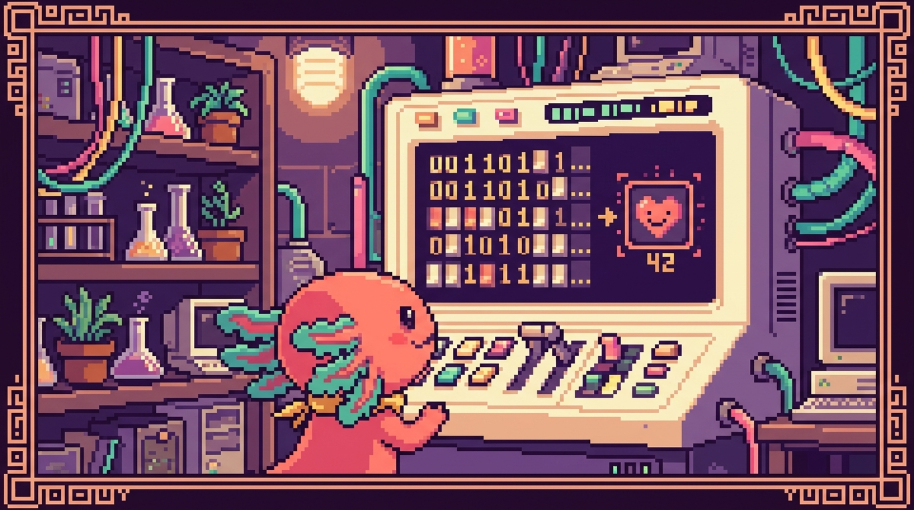

# Capítulo 06 — El sistema binario y hexadecimal

<p align="center">
  
</p>


> En este capítulo vamos a mirar cómo cuenta una computadora por dentro. Y no, no usa los diez dedos como tú y yo: por dentro solo distingue dos estados, encendido y apagado. Con eso tan simple arma **todo**: los números, las letras de este texto, las fotos de tu galería, los colores de tu sitio web. Cuando entiendes esto, símbolos raros como `#1B6B6B` que aparecen en tu CSS dejan de darte miedo, y te queda una intuición que vas a aprovechar el resto de tu vida programando. Bit, nuestro ajolote pixelado, viene contigo en el viaje; al fin y al cabo, él también está hecho de bits.

## 1. ¿Por qué una computadora solo cuenta con 0 y 1?

Piensa en el interruptor de luz de tu pared. Tiene dos posiciones y ya: encendido o apagado. No existe un "medio encendido" estable que se pueda medir bien. Una computadora es, en el fondo, millones (¡miles de millones!) de interruptores diminutos, y cada uno solo sabe estar en una de esas dos posiciones.

Como solo hay dos estados, los representamos con dos símbolos: **0** para apagado y **1** para encendido. Eso es absolutamente todo. No hay truco escondido: la computadora es una montaña enorme de interruptores, y programar es, si lo piensas, decidir cuáles se encienden y cuáles se apagan.

> ### 🟦 ¿Qué significa? — *Bit*
> Un **bit** es la pieza de información más pequeña que maneja una computadora: un único valor que solo puede ser **0** o **1** (apagado o encendido). El nombre sale del inglés *binary digit*, "dígito binario". Es el ladrillo mínimo con el que se levanta todo lo demás. Un bit solo, por sí mismo, dice bastante poco; la cosa se pone interesante cuando juntas muchos.

> ### 🟦 ¿Qué significa? — *Sistema binario*
> El **sistema binario** es contar usando solo dos símbolos: 0 y 1. Por eso decimos que es "base 2". Nosotros los humanos contamos en **decimal** ("base 10"), con diez símbolos: 0, 1, 2, 3, 4, 5, 6, 7, 8 y 9, seguramente porque tenemos diez dedos. La computadora cuenta en binario porque sus interruptores solo tienen dos posiciones.

> ### 💡 Tip — No te asustes con la palabra "base"
> "Base 10" no quiere decir nada raro: solo significa "usamos 10 símbolos distintos". "Base 2", "usamos 2 símbolos distintos". La forma de contar es la misma en los dos casos; lo único que cambia es cuántos símbolos tenemos antes de quedarnos sin ellos y vernos obligados a "llevar uno". Eso lo vemos en un momento.

## 2. Cómo contamos los humanos (para entender cómo cuenta la máquina)

Antes de meternos en el binario, fíjate en algo que haces sin pensar. Cuando cuentas en decimal y llegas al 9, te quedas sin símbolos. ¿Y qué haces entonces? Reinicias esa primera posición a 0 y pones un 1 a la izquierda: del **9** saltas al **10**. Vuelves a llenar hasta el **19** y entonces das el salto al **20**. Así hasta el **99**, y luego el **100**.

Lo importante es esto: cada posición vale diez veces más que la de su derecha. Tomemos el número **347**:

- el **7** está en las unidades (vale 7 × 1 = 7),
- el **4** está en las decenas (vale 4 × 10 = 40),
- el **3** está en las centenas (vale 3 × 100 = 300).

Y al sumar: 300 + 40 + 7 = 347. Lo hacías de niño sin pararte a pensar en la mecánica que había debajo.

El binario funciona **igualito**, con una sola diferencia: como solo hay dos símbolos, cada posición vale **el doble** que la de su derecha, en lugar de diez veces más.

## 3. Contar en binario, paso a paso

En binario solo tenemos 0 y 1. Empecemos a contar desde cero y mira lo que pasa cuando nos quedamos sin símbolos (cosa que ocurre enseguida, porque solo hay dos):

| Número decimal | En binario |
|---|---|
| 0 | 0 |
| 1 | 1 |
| 2 | 10 |
| 3 | 11 |
| 4 | 100 |
| 5 | 101 |
| 6 | 110 |
| 7 | 111 |
| 8 | 1000 |

¿Ves el patrón? Cuando llegamos al 1 y queremos sumar uno más, no hay ningún "2" al que recurrir, así que reiniciamos a 0 y llevamos uno a la izquierda: de `1` pasamos a `10` (que se lee "uno-cero", **no** "diez", y vale 2 en decimal). Es justo lo mismo que hacíamos al pasar de 9 a 10 en decimal, solo que aquí ocurre muchísimo más a menudo.

> ### 💡 Tip — Léelo dígito por dígito
> El binario `101` no se lee "ciento uno". Se lee "uno, cero, uno". Decir "ciento uno" es mezclar decimal con binario y solo consigues hacerte un lío. Pronuncia cada cifra por separado.

### El truco de las posiciones (potencias de 2)

Cada posición en binario tiene un valor fijo. Si empiezas por la derecha, van así: 1, 2, 4, 8, 16, 32, 64, 128... cada una es el doble de la anterior. Para saber cuánto vale un número binario, sumas los valores de las posiciones donde haya un **1**.

Veámoslo con `1101`:

```
Posición:    8   4   2   1
Bits:        1   1   0   1
```

Hay un 1 en la posición del 8, en la del 4 y en la del 1 (la del 2 tiene un 0, así que esa no suma). Sumamos: 8 + 4 + 0 + 1 = **13**. Y ya está: `1101` en binario es **13** en decimal.

> ### 🟦 ¿Qué significa? — *Byte*
> Un **byte** (se pronuncia "bait") es un grupo de **8 bits**. Con 8 bits puedes formar 256 combinaciones distintas (desde `00000000` hasta `11111111`, o sea del 0 al 255). El byte es la unidad práctica con la que se mide casi todo en computación: un carácter de texto, el tamaño de un archivo (kilobytes, megabytes, gigabytes) y, como vas a ver, cada componente de color. Cuando tu disco `polypaw-nas` marca "238 GB", está usando esta misma escala: la G es de giga y la B de bytes.

> ### 💡 Tip — De ahí salen los "256" y "255" que ves por todas partes
> Cuando te encuentres con números como 255, 256, 128, 1024 o 65535 en programación, casi siempre vienen de potencias de 2. No son caprichosos: marcan "hasta dónde llega" cierta cantidad de bits. 8 bits llegan a 255; 16 bits llegan a 65535. El día que reconozcas estos números de un vistazo, es señal de que ya empiezas a pensar como la máquina.

## 4. Cómo se guarda un número, una letra y un texto

Ya sabemos que un grupo de bits sirve para representar un número. ¿Pero cómo guarda la computadora una letra como la **A**, si lo único que conoce son ceros y unos?

La respuesta es un acuerdo: una **tabla** que dice "tal número representa tal carácter". El acuerdo más famoso de la historia se llama **ASCII**.

> ### 🟦 ¿Qué significa? — *ASCII*
> **ASCII** (se lee "aski") es una tabla nacida en los años 60 que le pone un número a cada carácter del inglés. Por ejemplo: la **A** mayúscula es el 65, la **B** es el 66, la **a** minúscula es el 97, el espacio es el 32 y el dígito **0** (como carácter de texto) es el 48. Como todos esos números caben en un byte, cada carácter ocupa exactamente un byte. Gracias a ASCII, computadoras distintas podían entenderse al intercambiar texto.

Así que la palabra **Bit** se guarda como tres números (66, 105, 116), y cada uno como un patrón de 8 bits encendidos y apagados. La pantalla, cuando lee el 66, sabe que toca dibujar una "B".

El problema de ASCII es que solo pensó en el inglés. No tiene **ñ**, ni **á**, ni emojis, ni nada del chino o del árabe. Por eso, más adelante, hubo que inventar algo más grande.

> ### 🟦 ¿Qué significa? — *Unicode (y UTF-8)*
> **Unicode** es una tabla gigante y moderna que le da un número único a **cada** carácter de **todos** los idiomas del mundo, más símbolos y emojis (¡el ajolote 🦎 incluido!). **UTF-8** es la manera más común de guardar esos caracteres en bytes, y tiene una ventaja enorme: es compatible con ASCII para las letras básicas. Gracias a esto, tu texto en español, con sus "ñ" y sus tildes, se ve igual en cualquier dispositivo del planeta.

> ### 🔎 En tu código
> En tu proyecto **tunal-digital**, el archivo `sitio-web/index.html` seguramente arranca con una línea parecida a `<meta charset="UTF-8">`. Esa etiqueta le avisa al navegador: "este texto está guardado en UTF-8, interprétalo así". Por ella, palabras como "diseño" o "información" salen bien y no convertidas en símbolos rotos (`dise�o`). Si algún día ves caracteres extraños en una web, casi siempre es un problema de codificación de caracteres.

> ### ⚠️ Cuidado — "Número" y "carácter" no son lo mismo
> El número **5** (la cantidad) y el carácter **"5"** (el símbolo que se imprime en pantalla) se guardan de forma distinta. La cantidad cinco es el binario `101`; el carácter "5" es, en ASCII, el número **53**. Por eso en programación a veces toca "convertir" un texto en número antes de hacer cuentas. En tu app **RachaSimple** (React + TypeScript), si lees `"7"` de un campo de texto y quieres sumarlo, primero tienes que pasarlo al número 7; si no, `"7" + 1` podría darte `"71"` en lugar de `8`. Lo verás con calma más adelante, cuando lleguemos a los tipos de datos.

## 5. Los colores también son números

Aquí es donde todo se conecta con lo que ya tocas en tus proyectos. Las pantallas arman cada color mezclando tres luces: **R**ojo, **V**erde y **A**zul (en inglés RGB: *Red, Green, Blue*). Imagínalo como tener tres focos de colores y poder subirles o bajarles la intensidad a cada uno.

> ### 🟦 ¿Qué significa? — *RGB*
> **RGB** son las iniciales en inglés de **R**ed, **G**reen, **B**lue (rojo, verde, azul). Es el modelo que usan las pantallas para formar cualquier color combinando esas tres luces. A cada una le das una intensidad de 0 a 255 (un byte). Por eso, en el fondo, un color son **tres números**. Es un modelo "aditivo": arrancas del negro (todo apagado) y vas sumando luz hasta llegar al blanco (todo a tope).

¿Cuánta intensidad puede tener cada foco? Un valor de **0 a 255**. ¿Y por qué precisamente 255? Porque cada componente usa **un byte** (8 bits), y ya vimos que un byte llega justo hasta 255. Todo encaja:

- Rojo a tope, verde y azul apagados → rojo puro: (255, 0, 0).
- Los tres apagados → negro: (0, 0, 0).
- Los tres a tope → blanco: (255, 255, 255).

Combinando las tres intensidades sacas alrededor de 16,7 millones de colores. Resumiendo: un color son solo **tres números**, y cada número es solo **un byte**.

## 6. El sistema hexadecimal: escribir bytes de forma corta

Escribir colores como (27, 107, 107) funciona, claro, pero los programadores querían algo más compacto y que encajara al milímetro con los bytes. Ahí aparece el **hexadecimal**.

> ### 🟦 ¿Qué significa? — *Sistema hexadecimal (hex)*
> El **sistema hexadecimal** es contar en "base 16": dieciséis símbolos. Como solo tenemos diez dígitos (0–9), se piden prestadas seis letras para los que faltan: **A=10, B=11, C=12, D=13, E=14, F=15**. Entonces, después del 9 viene A, luego B... hasta llegar a la F, y ahí se "lleva uno" (a la F le sigue 10, que en hex vale dieciséis). Sirve para escribir valores de bytes de forma corta y ordenada.

¿Por qué hexadecimal y no cualquier otra base? Por una coincidencia preciosa: **dos dígitos hexadecimales representan exactamente un byte** (un número de 0 a 255). Ni uno más, ni uno menos. Un dígito hex equivale a 4 bits, así que dos dígitos suman 8 bits = 1 byte. Por eso encaja con los colores como anillo al dedo.

Mira la correspondencia:

| Decimal | Hex |
|---|---|
| 0 | 0 |
| 9 | 9 |
| 10 | A |
| 15 | F |
| 16 | 10 |
| 255 | FF |

El valor más alto de un byte, 255, se escribe `FF` en hex (la F vale 15: 15×16 + 15 = 255). Y el más bajo, 0, es `00`. Compacto y predecible.

> ### 💡 Tip — Cómo leer un par hexadecimal
> Para pasar un par hex a decimal: el primer dígito vale "su valor × 16", y a eso le sumas el segundo. Por ejemplo `1B`: la **1** vale 1×16 = 16; la **B** vale 11. En total: 16 + 11 = **27**. No hace falta que lo calcules de cabeza cada vez (las herramientas lo hacen por ti), pero entender el mecanismo te da intuición.

## 7. Por qué los colores CSS usan hex: el caso de tunal-digital

> ### 🟦 ¿Qué significa? — *CSS*
> **CSS** (del inglés *Cascading Style Sheets*, "hojas de estilo en cascada") es el lenguaje con el que se le da **aspecto** a una página web: colores, tamaños, tipos de letra, espacios y posiciones. Si el HTML es el "esqueleto" del contenido, el CSS es "la ropa y el maquillaje". Los archivos `.css`, como `styles.css` en **tunal-digital**, guardan estas reglas de estilo, y es justo ahí donde escribes los colores en hexadecimal.

Ahora sí, vamos con ese `#1B6B6B` que aparece en tu `styles.css`. Un color en CSS escrito en hexadecimal tiene esta pinta:

```
#RRGGBB
```

O sea: la almohadilla `#` seguida de **tres pares** de dígitos hex. El primer par es el Rojo, el segundo el Verde y el tercero el Azul. Cada par es un byte (de 0 a 255). Vamos a descifrar el color de tu marca:

> ### 🔎 En tu código
> En **tunal-digital**, dentro de `sitio-web/styles.css`, usas el color `#1B6B6B`. Traduzcámoslo:
> - **1B** (rojo) = 1×16 + 11 = **27**
> - **6B** (verde) = 6×16 + 11 = **107**
> - **6B** (azul) = 6×16 + 11 = **107**
>
> Es decir, en RGB queda **(27, 107, 107)**: poco rojo y cantidades iguales y medias de verde y azul. Eso te da un **verde azulado oscuro** (un tono "teal"), perfecto para una identidad sobria y profesional. Ya no es un símbolo misterioso: sabes exactamente qué luces le está pidiendo a la pantalla.

```css
/* Un fragmento como el de tu styles.css */
:root {
  --color-marca: #1B6B6B;   /* rojo 27, verde 107, azul 107 → teal oscuro */
  --color-fondo: #FFFFFF;   /* 255,255,255 → blanco puro */
  --color-texto: #000000;   /* 0,0,0 → negro */
}
```

> ### 💡 Tip — El atajo de 3 dígitos
> A veces verás colores de solo 3 dígitos, como `#FFF` o `#1B6`. Es una abreviatura: CSS duplica cada dígito por su cuenta. `#FFF` equivale a `#FFFFFF` (blanco) y `#F00` a `#FF0000` (rojo puro). Resulta útil cuando los pares tienen dígitos repetidos.

> ### ⚠️ Cuidado — Hex no es solo para colores
> El hexadecimal asoma en muchos otros sitios: direcciones de memoria, identificadores, códigos de error, claves. En tu app **PolyPaw** (Python + Flet), si guardas o muestras ciertos identificadores, puedes toparte con cadenas hex largas. Y un emoji como 🦎 tiene un "punto de código" Unicode que suele escribirse en hex (`U+1F98E`). Reconocer "esto es hexadecimal" ya es media batalla ganada.

## 8. ¿Y para qué me sirve saber todo esto en la práctica?

A lo mejor piensas: "si las herramientas convierten por mí, ¿para qué memorizar tablas?". Y tienes parte de razón: **no** hace falta que te memorices conversiones. Pero entender el concepto te da algunos superpoderes para el día a día:

- **Eliges colores con criterio.** Sabes que `#000000` es negro y `#FFFFFF` blanco, que subir los números aclara el color y bajarlos lo oscurece. En tunal-digital puedes afinar un tono a mano sin ir a ciegas.
- **Entiendes los tamaños.** Cuando tu `polypaw-nas` dice "8 GB de RAM" o "954 GB de disco", sabes que la B es de bytes y que todo se mide en potencias de 2.
- **Diagnosticas texto roto.** Si una página te muestra `ñ` donde debería haber una `ñ`, ya sospechas de un problema de codificación (UTF-8 mal configurado), como el `<meta charset>` de tu HTML.
- **Lees mensajes técnicos sin entrar en pánico.** Códigos de error, hashes, tokens... muchos vienen en hex, y dejan de parecerte jeroglíficos.

> ### 🔎 En tu código
> En **Faro** (carpeta `Organizer`, Next.js + TypeScript), cuando tu backend en `src/app/api` maneje tokens, identificadores de Supabase o respuestas de la API de OpenAI, te vas a encontrar cadenas largas de letras y números. Buena parte usa hexadecimal o codificaciones derivadas de bytes. No tienes que descifrarlas a mano, pero saber que "esto representa bytes en hex" te evita confundir un identificador con texto legible.

> ### 💡 Tip — Una calculadora siempre a mano
> En tu computadora, la app **Calculadora** suele traer un "modo programador" que convierte entre decimal, binario y hexadecimal con un clic. Es ideal para comprobar tus conversiones mientras aprendes. Bit la usa todo el tiempo; no es hacer trampa, es ser práctico.

## 9. Resumen visual de las tres "capas"

Para que se te quede grabado, así se conecta todo, de lo más pequeño a lo más cercano a ti:

```
BITS (0 y 1)  →  agrupados en BYTES (8 bits, hasta 255)
   ↓
Un byte puede ser:
   • un número (101 binario = 5)
   • una letra  (65 = 'A' en ASCII / Unicode)
   • una intensidad de color (255 = foco al máximo)
   ↓
HEXADECIMAL escribe cada byte en 2 dígitos cortos (FF = 255)
   ↓
#1B6B6B = tres bytes = rojo 27, verde 107, azul 107 = el teal de tunal-digital
```

Todo lo que ves en una pantalla —este texto, los botones de RachaSimple, los colores de tunal-digital, las imágenes de PolyPaw— nace de ese baile de interruptores en 0 y 1.

## ✅ Checklist — ¿ya domino esto?

- [ ] Entiendo por qué la computadora solo usa 0 y 1 (interruptores encendido/apagado).
- [ ] Sé qué es un **bit** y qué es un **byte** (8 bits, hasta 255).
- [ ] Puedo convertir un número binario pequeño a decimal sumando las posiciones (1, 2, 4, 8...).
- [ ] Entiendo que el texto se guarda con tablas como ASCII y Unicode/UTF-8.
- [ ] Sé que un color es tres números (RGB), cada uno de 0 a 255.
- [ ] Entiendo qué es el **hexadecimal** y por qué dos dígitos hex = un byte.
- [ ] Puedo leer un color CSS como `#1B6B6B` y decir aproximadamente qué color es.
- [ ] Reconozco que `#FFFFFF` es blanco y `#000000` es negro.

## 🧪 Ejercicios

1. Convierte a decimal estos números binarios, sumando los valores de posición (1, 2, 4, 8): `10`, `110`, `1010`. (Pista: la respuesta del último es 10.)

2. Sin computadora, di qué color crees que es `#FF0000` y cuál es `#000000`. Explica con tus palabras qué significan los tres pares de dígitos.

3. 💻 Abre la app **Calculadora** de tu sistema en "modo programador". Escribe el número 255 en decimal y observa cómo se ve en binario y en hexadecimal. Anota los tres valores.

4. 💻 En el archivo `sitio-web/styles.css` de **tunal-digital**, busca un color en hex distinto de `#1B6B6B`. Usa la pista del Tip (primer dígito × 16 + segundo) para calcular a mano el valor de su componente rojo (los dos primeros dígitos). Comprueba con la calculadora.

5. 💻 Usa cualquier buscador de "selector de color hex" en línea (o las herramientas de tu navegador). Escribe `#1B6B6B`, mira el color que aparece y confirma que sus valores RGB son (27, 107, 107).

6. Escribe tu nombre y cuenta cuántas letras tiene. Como cada letra ocupa **un byte** en ASCII básico, ¿cuántos bytes ocupa tu nombre? (Ojo: si tu nombre lleva tildes o "ñ", en UTF-8 esas letras pueden ocupar **dos** bytes; piensa por qué.)
