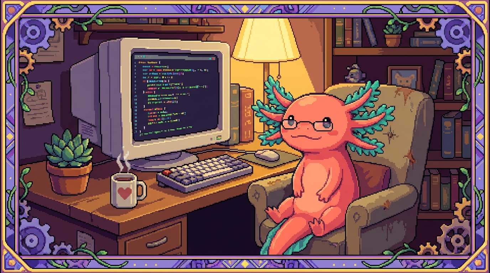

# Capítulo 09 — Tu taller: instalar y usar VS Code

<p align="center">
  
</p>


> En este capítulo montas tu mesa de trabajo. Hasta ahora has ido juntando ideas sueltas sobre programación; toca instalar **VS Code**, el programa donde vas a escribir, leer y ejecutar tu código de verdad. Verás cómo abrir una carpeta de proyecto, moverte entre archivos, usar la terminal sin salir del editor, instalar extensiones que te echan una mano, y leer las pistas de color y los atajos que te harán ir más rápido. Es el capítulo más "manos a la obra" del módulo: al terminar podrás abrir cualquiera de tus repos reales (tunal-digital, PolyPaw, RachaSimple, Faro) y sentirte en tu casa. Bit, nuestro ajolote pixelado, te acompaña como siempre.

## 1. ¿Qué es un editor de código y por qué no usar Word?

Cuando escribes una carta usas un procesador de texto, como Word o Google Docs. Esos programas guardan, junto a tus letras, un montón de información invisible: tipos de letra, márgenes, colores. Para una carta es perfecto; para el código es **veneno**. El código tiene que ser texto puro, sin adornos ocultos, o la computadora no lo entiende.

Para escribir código se usa otro tipo de programa: un **editor de código**. Y de todos los que hay, el más popular hoy es **VS Code**.

> ### 🟦 ¿Qué significa? — *Editor de código*
> Un programa pensado para escribir texto plano (sin formato oculto) y, de paso, ayudarte mientras programas: pinta las palabras de colores según lo que significan, te avisa de errores, te autocompleta y te deja ejecutar tus programas. Piensa en él como el banco de carpintero donde armas todos tus proyectos.

> ### 🟦 ¿Qué significa? — *VS Code (Visual Studio Code)*
> Un editor de código gratuito hecho por Microsoft, que funciona en Windows, Mac y Linux. Arranca muy ligero y va creciendo según las extensiones que le pongas. **Cuidado con la confusión:** "Visual Studio Code" (el editor que vamos a usar) NO es lo mismo que "Visual Studio" (un programa mucho más grande y distinto). Tú quieres el que dice *Code*.

> ### 🟦 ¿Qué significa? — *Texto plano*
> Texto sin formato: solo letras, números y símbolos, sin negritas ni colores guardados dentro. Todos tus archivos de código (`index.html`, `main.py`, `database.ts`) son texto plano. Los colores que verás en VS Code se pintan **al vuelo**; no se guardan dentro del archivo.

> ### 💡 Tip — ¿Por qué VS Code y no otro?
> Hay otros editores buenos (Sublime, Zed, los de JetBrains...). Nos quedamos con VS Code porque es gratis, tiene una comunidad enorme, y te sirve para **todos** tus proyectos a la vez: el HTML/JavaScript de tunal-digital, el Python de PolyPaw, el TypeScript de RachaSimple y Faro. Un solo taller para todo.

## 2. Instalar VS Code paso a paso

Vamos a instalarlo. Solo necesitas tu computadora y conexión a internet.

1. Abre tu navegador (Chrome, Firefox, Edge...).
2. Ve a la dirección oficial: **https://code.visualstudio.com**
3. La página detecta tu sistema y te muestra un botón grande de descarga. Haz clic.
4. Cuando termine de bajar el archivo, ábrelo y deja que el instalador te guíe.

Según tu sistema operativo cambian algunos detalles:

- **Windows:** se descarga un archivo `.exe`. Ábrelo y ve aceptando los pasos. **Marca la casilla** que dice *"Agregar a PATH"* o *"Add to PATH"* si aparece; eso te ahorra dolores de cabeza más adelante.
- **Mac:** se descarga un `.zip` que, al abrirlo, deja la app *Visual Studio Code*. Arrástrala a la carpeta **Aplicaciones**.
- **Linux (como tu servidor polypaw-nas con Ubuntu):** ojo, en un servidor sin pantalla **no instalarías VS Code de escritorio**. En una máquina Linux con escritorio bajas el paquete `.deb` (Ubuntu/Debian) y lo instalas con doble clic o por terminal.

> ### 🟦 ¿Qué significa? — *Sistema operativo*
> El programa principal que controla tu computadora: Windows, macOS o Linux. VS Code existe para los tres. Tu portátil seguramente usa Windows o Mac; tu polypaw-nas (un Acer Nitro AN515-54) corre **Ubuntu Server 26.04**, una versión de Linux sin escritorio gráfico pensada para servidores.

> ### 🟦 ¿Qué significa? — *PATH*
> Una lista de carpetas donde tu sistema busca programas cuando escribes su nombre en la terminal. Si VS Code está "en el PATH", podrás abrirlo escribiendo `code` desde cualquier lugar. No es obligatorio, pero es muy cómodo.

> ### ⚠️ Cuidado — Descarga solo de la página oficial
> Baja VS Code únicamente desde `code.visualstudio.com`. Si buscas en Google "vscode descargar" pueden aparecer páginas falsas con publicidad o instaladores con basura dentro. La regla de seguridad de tu proyecto Faro lo deja claro: cuidado con lo que entra a tu máquina. Aquí vale lo mismo.

Cuando termines, abre VS Code. La primera vez verás una pantalla de bienvenida. No te agobies: la mayoría de los botones los iremos descubriendo poco a poco.

## 3. El mapa de la pantalla

Antes de tocar nada, ubiquémonos. La ventana de VS Code tiene zonas fijas, y conocerlas es como saber dónde está cada cajón del taller.

- **Barra de actividad** (la columna de iconos pegada a la izquierda del todo): cada icono abre una herramienta. El más importante es el de arriba, que parece dos hojas: el **Explorador de archivos**.
- **Barra lateral**: se abre al lado de la barra de actividad. Cuando pulsas el explorador, aquí ves la lista de archivos y carpetas de tu proyecto.
- **Editor** (el gran espacio del centro): donde escribes y lees el código. Puedes tener varios archivos abiertos en **pestañas**, igual que en el navegador.
- **Panel inferior**: aquí vive la **terminal integrada**, los mensajes de error y más. A veces está oculto.
- **Barra de estado** (la franja de abajo del todo): muestra detalles útiles, como en qué línea estás o qué lenguaje detectó VS Code.

> ### 🟦 ¿Qué significa? — *Explorador de archivos*
> El panel lateral que muestra, en forma de árbol, las carpetas y archivos de tu proyecto. Haces clic en un archivo y se abre en el editor. Es tu mapa del proyecto. En tunal-digital verías ahí las carpetas `sitio-web/` y `backend/` con sus archivos dentro.

> ### 💡 Tip — Si te pierdes, vuelve al inicio
> El menú **Ver** (arriba) tiene la opción *"Paleta de comandos"* y muchas otras. Y si cerraste algún panel sin querer, casi todo se recupera desde **Ver → Apariencia**. No se rompe nada por explorar.

## 4. Abrir una carpeta: el corazón de todo

Esta es la idea más importante del capítulo: **en VS Code no trabajas con archivos sueltos, trabajas con carpetas**. Un proyecto entero vive dentro de una carpeta, y tú le dices a VS Code "abre esta carpeta completa". A partir de ahí ves todos los archivos y saltas entre ellos.

> ### 🟦 ¿Qué significa? — *Espacio de trabajo (workspace)*
> La carpeta (o conjunto de carpetas) que tienes abierta en VS Code en este momento. Todo lo que ves en el explorador pertenece a tu workspace. Cuando trabajes en RachaSimple, tu workspace será la carpeta de ese proyecto, con `src/components`, `src/hooks`, etc.

Para abrir una carpeta:

1. Menú **Archivo → Abrir carpeta...** (en inglés *File → Open Folder...*).
2. Navega hasta la carpeta de tu proyecto y selecciónala.
3. VS Code recarga y muestra todo el contenido en el explorador.

> ### 🔎 En tu código
> Imagina que abres la carpeta de **Faro** (que en tu disco se llama `Organizer`). En el explorador verías, entre otras, las carpetas `src/app/api` (donde vive el código que habla con servicios externos) y `src/lib` (utilidades compartidas). Haces clic en un archivo `.ts` dentro de `src/lib` y se abre listo para leerse, con cada palabra a color.

> ### ⚠️ Cuidado — Abrir la carpeta correcta
> Abre la carpeta **raíz** del proyecto, no una subcarpeta ni el archivo suelto. Si en PolyPaw abrieras solo `missions/`, te perderías `main.py` y `polypaw_db.json`. La carpeta raíz es la que contiene a todas las demás; suele ser la que tiene archivos especiales como `package.json` (en proyectos JavaScript) o el `README.md`.

> ### 💡 Tip — Archivos recientes
> Una vez has abierto una carpeta, VS Code la recuerda. Con **Archivo → Abrir reciente** vuelves a tus proyectos con un clic, sin tener que navegar de nuevo por todo el disco.

## 5. Moverte entre archivos sin perderte

Un proyecto real tiene decenas de archivos, así que moverte rápido es una habilidad en sí misma.

- **Clic en el explorador**: lo básico. Un clic abre el archivo.
- **Búsqueda rápida de archivo por nombre**: pulsa `Ctrl + P` (en Mac, `Cmd + P`), escribe parte del nombre y salta directo. ¿Quieres abrir `worker.js` de tunal-digital? `Ctrl + P`, escribes "worker", Enter. Listo.
- **Buscar texto en todo el proyecto**: pulsa `Ctrl + Shift + F` (Mac: `Cmd + Shift + F`). Escribes una palabra y VS Code te dice **en qué archivos** aparece. Perfecto para encontrar dónde se usa algo.

> ### 🟦 ¿Qué significa? — *Atajo de teclado*
> Una combinación de teclas que ejecuta una acción al instante, sin buscar en menús. Por ejemplo `Ctrl + S` para guardar. Se escriben con `+` entre teclas: `Ctrl + P` significa "mantén Ctrl y pulsa P". En Mac, donde dice `Ctrl` casi siempre usarás `Cmd`.

> ### 🔎 En tu código
> En RachaSimple, supón que quieres ver cómo se definen los datos. Pulsas `Ctrl + P`, escribes "database" y aparece `src/types/database.ts`. O quieres saber dónde se usa la palabra "Supabase" en todo el proyecto: `Ctrl + Shift + F`, escribes "Supabase", y ves la lista completa de archivos que la mencionan.

> ### 💡 Tip — La Paleta de Comandos lo hace todo
> Pulsa `Ctrl + Shift + P` (Mac: `Cmd + Shift + P`) y se abre la **Paleta de Comandos**: una cajita donde escribes lo que quieres hacer ("guardar", "formato", "terminal"...) y VS Code te ofrece el comando. Si olvidas un atajo, búscalo aquí. Es el botón mágico del editor.

## 6. La terminal integrada: una ventana al sistema, dentro del editor

Hasta ahora, si querías escribir comandos (arrancar un proyecto, instalar algo) abrías un programa aparte. VS Code trae una **terminal integrada**: la misma línea de comandos, pero dentro del editor, para que no andes saltando entre ventanas.

> ### 🟦 ¿Qué significa? — *Terminal*
> Una ventana donde escribes órdenes por texto y la computadora responde por texto, en vez de hacer clics. Por ejemplo, escribir `npm run build` para construir un proyecto. Es directa y poderosa; la veremos a fondo en otro capítulo.

> ### 🟦 ¿Qué significa? — *Terminal integrada*
> La terminal incrustada dentro de VS Code, en el panel inferior. Lo bueno: ya está "parada" dentro de la carpeta de tu proyecto, así que los comandos afectan a ese proyecto sin que tengas que navegar hasta él.

Para abrirla:

- Menú **Terminal → Nueva terminal**, o
- Atajo: `Ctrl + ñ` en teclados en español (en otros, `Ctrl + \`` con la tecla del acento grave, debajo de Escape).

Una vez abierta, ya puedes escribir comandos. Por ejemplo, en Faro o RachaSimple, el comando que tu proyecto pide antes de fusionar cambios:

```bash
npm run build
```

Esto le dice al proyecto "compílate y revisa que todo encaje". Si pasa sin errores, vas por buen camino. (No te preocupes si todavía no entiendes qué hace por dentro; lo que importa hoy es saber **dónde** se escribe.)

> ### 🔎 En tu código
> En PolyPaw, que es Python con el framework Flet, para arrancar la app escribirías en la terminal integrada algo como `python main.py`. Como la terminal ya está dentro de la carpeta de PolyPaw, encuentra `main.py` sin rodeos.

> ### ⚠️ Cuidado — La terminal hace cosas de verdad
> La terminal ejecuta órdenes reales en tu máquina. Borrar, mover, instalar: lo que escribas, pasa. No copies y pegues comandos de internet sin entenderlos, y menos si llevan `rm` (borrar) o piden tu contraseña. En tu polypaw-nas, donde hay datos en `/srv/nas`, esta prudencia vale doble.

## 7. Colores que cuentan: el resaltado de sintaxis

Abre cualquier archivo de código y notarás que las palabras tienen **colores**. No es decoración: cada color significa algo. A esto se le llama **resaltado de sintaxis**.

> ### 🟦 ¿Qué significa? — *Sintaxis*
> Las reglas de cómo se escribe un lenguaje, igual que la gramática de un idioma. Cada lenguaje (HTML, Python, JavaScript, TypeScript) tiene su sintaxis. Si la rompes, el programa no funciona.

> ### 🟦 ¿Qué significa? — *Resaltado de sintaxis (syntax highlighting)*
> Que VS Code pinte de distintos colores las partes del código según su papel: las palabras reservadas del lenguaje de un color, los textos de otro, los comentarios de otro... Te ayuda a leer de un vistazo y a cazar errores. Por ejemplo, si un texto que debería estar entre comillas se ve "raro" de color, igual olvidaste cerrar una comilla.

Un ejemplo en JavaScript, como el de `main.js` de tunal-digital:

```javascript
// Esto es un comentario: VS Code lo pinta apagado, suele ser gris
const nombre = "Tunal Digital";
console.log(nombre);
```

Aquí `const` (palabra del lenguaje), `"Tunal Digital"` (un texto) y `console.log` (una función) tendrán cada uno su color. Con el tiempo, tu ojo aprende a leer por colores antes que por letras.

> ### 💡 Tip — VS Code detecta el lenguaje solo
> VS Code mira la **extensión** del archivo (la parte tras el punto: `.py`, `.js`, `.ts`, `.html`) y elige los colores adecuados. Por eso `main.py` se colorea como Python y `worker.js` como JavaScript, sin que hagas nada. Lo ves indicado en la barra de estado, abajo a la derecha.

> ### 🟦 ¿Qué significa? — *Extensión de archivo*
> El sufijo tras el punto en el nombre de un archivo, que indica su tipo. `.html` es una página web, `.py` es Python, `.ts` es TypeScript, `.json` son datos. En PolyPaw, `polypaw_db.json` es un archivo de **datos** (JSON), distinto de `main.py`, que es **programa** (Python).

## 8. El editor que te ayuda: autocompletado

Programar tiene mucho de recordar nombres exactos. VS Code te echa una mano con el **autocompletado**: mientras escribes, te sugiere cómo seguir.

> ### 🟦 ¿Qué significa? — *Autocompletado (IntelliSense)*
> Cuando empiezas a escribir y VS Code te ofrece una lista de opciones para completar la palabra: nombres de funciones, variables, propiedades... Eliges con las flechas y Enter. Te ahorra escribir todo y reduce los errores de tipeo. En VS Code esta función se llama **IntelliSense**.

Por ejemplo, en un archivo TypeScript de RachaSimple, al escribir `console.` aparece una lista: `log`, `error`, `warn`... Eliges `log` y se completa. No tuviste que recordar la palabra exacta.

> ### 💡 Tip — El autocompletado mejora con extensiones
> En proyectos con TypeScript (RachaSimple, Faro), el autocompletado es especialmente listo: conoce los **tipos** de tus datos. Si definiste cómo es algo en `src/types/database.ts`, VS Code te sugerirá justo los campos que existen, y te avisará si te inventas uno. Es como tener un copiloto que se sabe tu proyecto.

> ### ⚠️ Cuidado — Sugerir no es acertar siempre
> El autocompletado adivina según el contexto, y casi siempre acierta, pero no piensa por ti. Lee lo que aceptas: pulsar Enter sin mirar puede colarte algo que no querías. Tú mandas; la herramienta solo propone.

## 9. Extensiones: hacer crecer tu taller

VS Code recién instalado es un taller con lo básico. Las **extensiones** son herramientas que le vas añadiendo según lo que vayas a construir.

> ### 🟦 ¿Qué significa? — *Extensión*
> Un complemento que instalas en VS Code para darle nuevas capacidades: soporte para un lenguaje, herramientas para un framework, ayudas visuales... Se instalan gratis desde el propio editor, con un clic.

Para verlas, pulsa el icono de **Extensiones** en la barra de actividad (parecen cuatro cuadritos, con uno separándose) o `Ctrl + Shift + X`. Arriba hay un buscador. Buscas, ves la lista, y pulsas **Instalar**.

Algunas extensiones útiles según tus proyectos:

- **Python** (de Microsoft): imprescindible para PolyPaw. Da autocompletado, detección de errores y poder ejecutar `main.py` con un botón.
- **Prettier**: formatea tu código (lo ordena y alinea solo) en tunal-digital, RachaSimple y Faro. Adiós a pelear con las sangrías.
- **ESLint**: revisa tu JavaScript/TypeScript y te avisa de fallos comunes mientras escribes. Muy útil en Faro y RachaSimple.
- **Tailwind CSS IntelliSense**: en RachaSimple, que usa Tailwind, te autocompleta las clases de estilo y te muestra el color resultante. Una maravilla.
- **Español**: el "Language Pack" en español pone los menús de VS Code en tu idioma, en línea con que tu producto y tu documentación van en español.

> ### 🔎 En tu código
> Para PolyPaw bastaría con la extensión **Python**. Para RachaSimple, un buen trío sería **ESLint + Prettier + Tailwind CSS IntelliSense**, porque usa React, TypeScript y Tailwind. Para Faro, **ESLint + Prettier** te cubren el día a día con Next.js y TypeScript.

> ### 💡 Tip — No instales de más
> Es tentador instalar veinte extensiones el primer día. No lo hagas. Cada una consume recursos y algunas se pisan entre sí. Instala las del lenguaje que estás usando hoy y añade más solo cuando notes que las necesitas. Un taller ordenado trabaja mejor.

> ### ⚠️ Cuidado — Mira quién publica la extensión
> Cualquiera puede publicar extensiones. Antes de instalar, fíjate en el **número de descargas**, las **estrellas** y, sobre todo, en el **editor** (las oficiales de Microsoft o de marcas conocidas son seguras). Una extensión maliciosa podría leer tu código o tus secretos. Va en la línea de la regla de Faro: los secretos no se exponen.

## 10. Abrir uno de tus repos, de principio a fin

Juntemos todo en una secuencia real. Vamos a abrir tunal-digital y echarlo a andar.

> ### 🟦 ¿Qué significa? — *Repo (repositorio)*
> La carpeta que contiene todo un proyecto: su código, sus archivos y su historial de cambios. "Abrir un repo" en VS Code es, en la práctica, abrir esa carpeta. Tus repos son tunal-digital, PolyPaw, RachaSimple y Faro.

Los pasos:

1. Abre VS Code.
2. **Archivo → Abrir carpeta...** y elige la carpeta de tunal-digital.
3. En el explorador verás `sitio-web/` y `backend/`. Despliega `sitio-web/` y haz clic en `index.html`. Se abre, a color.
4. Abre también `main.js` (`Ctrl + P`, escribes "main.js", Enter). Ya tienes dos pestañas.
5. Abre la terminal integrada (`Terminal → Nueva terminal`). Ya está dentro de la carpeta del proyecto.
6. Echa un vistazo a `backend/worker.js`, el código que corre en **Cloudflare Workers** y habla con la API de Claude.

> ### 🔎 En tu código
> En tunal-digital, `sitio-web/index.html` es la estructura de la página, `styles.css` su apariencia y `main.js` su comportamiento. Aparte, `backend/worker.js` es el "ayudante en la nube". Con VS Code los tienes todos a la vista en el mismo workspace y saltas entre ellos en segundos.

> ### 💡 Tip — Guarda con `Ctrl + S` y fíjate en el puntito
> Cuando editas un archivo y aún no lo has guardado, su pestaña muestra un **punto** en vez de la "x" de cerrar. Es VS Code diciéndote "tienes cambios sin guardar". Pulsa `Ctrl + S` y el punto desaparece. Coge la costumbre de guardar a menudo.

## 11. Atajos básicos que vale la pena memorizar

No aprendas cien atajos. Aprende estos pocos y úsalos hasta que te salgan solos:

| Atajo (Windows/Linux) | En Mac | Qué hace |
|---|---|---|
| `Ctrl + S` | `Cmd + S` | Guardar el archivo |
| `Ctrl + P` | `Cmd + P` | Buscar y abrir un archivo por nombre |
| `Ctrl + Shift + P` | `Cmd + Shift + P` | Paleta de Comandos (todo) |
| `Ctrl + Shift + F` | `Cmd + Shift + F` | Buscar texto en todo el proyecto |
| `Ctrl + ñ` o `Ctrl + \`` | `Ctrl + \`` | Abrir/cerrar terminal |
| `Ctrl + /` | `Cmd + /` | Comentar/descomentar la línea |
| `Ctrl + Z` | `Cmd + Z` | Deshacer |

> ### 💡 Tip — `Ctrl + /` para comentar es oro
> Selecciona una o varias líneas y pulsa `Ctrl + /`: VS Code las convierte en comentario (con el formato correcto, según el archivo). Pulsa otra vez y vuelven a ser código. Ideal para "apagar" un trozo un rato sin borrarlo.

> ### ⚠️ Cuidado — Los atajos cambian un poco según el idioma del teclado
> Algunos atajos (sobre todo el de la terminal y el de comentar) dependen de dónde estén las teclas en tu teclado. Si uno no funciona, no te frustres: abre la Paleta de Comandos (`Ctrl + Shift + P`), busca la acción, y ahí mismo VS Code te enseña **su atajo real** en tu sistema.

## 12. Errores frecuentes del primer día (y cómo no asustarse)

- **"Abrí un archivo y todo es blanco y negro, sin colores."** Lo más probable es que abrieras un archivo suelto fuera de su carpeta, o que VS Code no reconociera el lenguaje. Abre la carpeta completa, o mira la barra de estado abajo a la derecha y elige el lenguaje a mano.
- **"Escribí en la terminal y dice 'comando no reconocido'."** Quiere decir que el programa que invocas no está instalado o no está en el PATH. Por ejemplo, `npm` necesita tener Node.js instalado; `python` necesita Python. Cada proyecto pide sus herramientas.
- **"Cerré un panel y no sé recuperarlo."** Menú **Ver**. Casi todo se reabre desde ahí. Y la Paleta de Comandos siempre te saca del apuro.
- **"VS Code me pide instalar una extensión recomendada."** Cuando abres un proyecto de Python o de un framework conocido, VS Code a veces sugiere extensiones. Si vienen de Microsoft o son las que mencionamos, adelante.

> ### 💡 Tip — Bit dice: equivocarse aquí es gratis
> Abrir, cerrar, explorar menús, instalar y desinstalar extensiones... nada de eso rompe tu código. Lo único que toca tus archivos es cuando **tú escribes y guardas**. Así que toquetea con confianza: es la mejor forma de aprender dónde está cada cosa.

## ✅ Checklist — ¿ya domino esto?

- [ ] Tengo VS Code instalado desde la página oficial y abre sin problemas.
- [ ] Sé la diferencia entre un editor de código y un procesador de texto como Word.
- [ ] Puedo abrir una **carpeta** de proyecto completa (no solo un archivo suelto).
- [ ] Reconozco el explorador, el editor, la terminal y la barra de estado.
- [ ] Sé abrir un archivo por nombre con `Ctrl + P` y buscar texto con `Ctrl + Shift + F`.
- [ ] Sé abrir la terminal integrada y entiendo que ejecuta órdenes reales.
- [ ] Entiendo qué es el resaltado de sintaxis y por qué los colores ayudan.
- [ ] Sé qué es el autocompletado y que sugiere, pero no decide por mí.
- [ ] Sé buscar e instalar una extensión, y mirar quién la publica.
- [ ] Tengo memorizados al menos: guardar, Paleta de Comandos y abrir terminal.

## 🧪 Ejercicios

1. **💻 Instala VS Code** desde `code.visualstudio.com` y ábrelo. Localiza en la pantalla el explorador de archivos, el editor y la barra de estado. Anota en una frase para qué sirve cada uno.

2. **💻 Abre una de tus carpetas de proyecto** (la que tengas en tu computadora). Despliega el árbol del explorador y escribe una lista de las carpetas principales que ves. Por ejemplo, en tunal-digital deberías ver `sitio-web/` y `backend/`.

3. **💻 Practica `Ctrl + P`:** abre tres archivos distintos del proyecto solo por nombre, sin tocar el explorador con el ratón. Si es RachaSimple, prueba con algo dentro de `src/components` y con `src/types/database.ts`.

4. **💻 Abre la terminal integrada** y escribe un comando inofensivo que solo muestre información (por ejemplo, en Windows `dir`, en Mac/Linux `ls`, que listan archivos). Observa que la terminal ya está dentro de la carpeta del proyecto. **No** ejecutes comandos que borren o instalen todavía.

5. **💻 Instala una extensión** acorde a tu proyecto: **Python** si vas a tocar PolyPaw, o **Prettier** si vas a tocar tunal-digital, RachaSimple o Faro. Antes de instalar, fíjate en quién la publica y cuántas descargas tiene. Escribe esos dos datos.

6. **Sin computadora:** dibuja o describe en papel el mapa de la pantalla de VS Code con sus cuatro zonas (explorador, editor, terminal, barra de estado) y, al lado de cada una, su atajo o forma de abrirla. Tenerlo a mano te servirá los primeros días.
