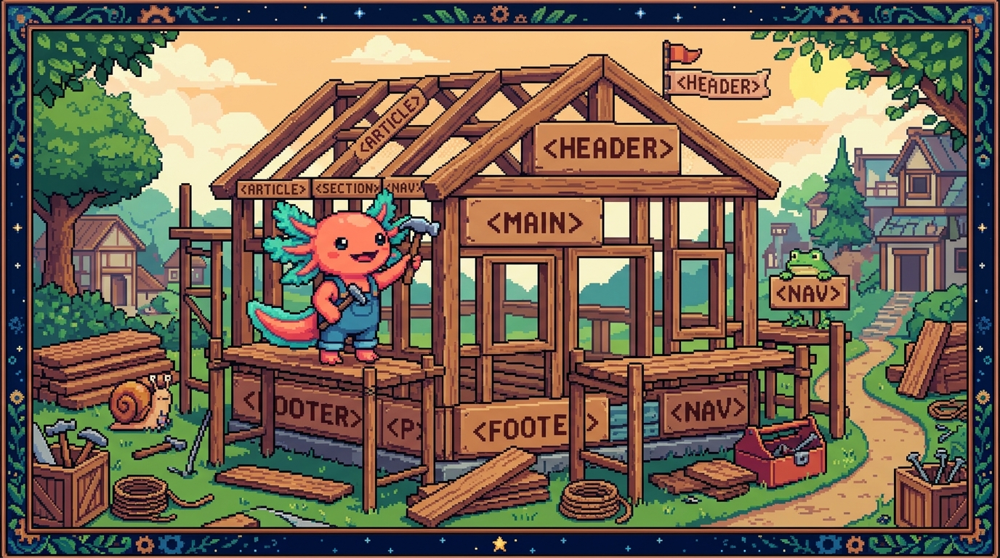

# Capítulo 01 — ¿Qué es HTML?

<p align="center">
  
</p>


> Tu primera línea de código de verdad está a unos minutos. Pero antes vale la pena entender
> qué es HTML y, sobre todo, qué **no** es. Aclarar eso desde el principio te ahorra confusiones
> que mucha gente arrastra durante años.

---

## 1. HTML describe la estructura, no da órdenes

> ### 🟦 ¿Qué significa? — *HTML*
> **HTML** significa *HyperText Markup Language* ("lenguaje de marcado de hipertexto"). Es el
> lenguaje con el que describes **la estructura y el contenido** de una página web: esto es un
> título, esto un párrafo, esto una imagen, esto un enlace.
> **¿Para qué sirve?** Para decirle al navegador *qué* hay en la página y *qué papel* cumple
> cada parte. Es el **esqueleto** de toda web.

Hay dos palabras dentro de ese nombre que conviene mirar de cerca:

> ### 🟦 ¿Qué significa? — *Marcado (markup)*
> "Marcado" quiere decir que **etiquetas** el contenido para indicar qué es cada cosa, igual
> que un editor marca un manuscrito a mano ("esto va en negrita", "esto es un título"). No le
> das órdenes paso a paso (eso es programar, como en JavaScript): solo **describes** la
> estructura. Por eso, técnicamente, HTML es un **lenguaje de marcado** y no un "lenguaje de
> programación".

> ### 🟦 ¿Qué significa? — *Hipertexto*
> "Hipertexto" es texto que contiene **enlaces** hacia otros textos o páginas. Esa es justo la
> idea que convierte a la web en una "telaraña" (*web*): puedes saltar de una página a otra con
> un clic. Esos saltos son los **enlaces**, y los verás en el capítulo 02.

> ### 💡 Tip — La analogía de la casa (te servirá todo el módulo)
> - **HTML** = la **estructura** de la casa: paredes, habitaciones, puertas. *Qué hay y dónde.*
> - **CSS** (módulo 02) = la **decoración**: pintura, colores, muebles. *Cómo se ve.*
> - **JavaScript** (módulo 03) = la **electricidad y los aparatos**: interruptores, timbre.
>   *Qué hace cuando interactúas.*
> Una casa puede existir solo con estructura (HTML solo): se ve sosa, pero funciona.

---

## 2. La pieza básica: la etiqueta

HTML se escribe con **etiquetas**. Vamos a ver su anatomía sin prisa.

> ### 🟦 ¿Qué significa? — *Etiqueta (tag) y elemento*
> Una **etiqueta** es una palabra entre los signos `<` y `>` que marca dónde empieza o dónde
> termina algo. Casi siempre van en pareja: una de **apertura** y una de **cierre** (esta lleva
> `/`). Lo que envuelven, junto con las propias etiquetas, forma un **elemento**.
>
> ```html
> <p>Hola, mundo</p>
> ```
> Aquí:
> - `<p>` es la etiqueta de **apertura** (`p` = *paragraph*, párrafo).
> - `Hola, mundo` es el **contenido**.
> - `</p>` es la etiqueta de **cierre** (la barra `/` indica "aquí termina").
> - Todo junto —`<p>Hola, mundo</p>`— es un **elemento** párrafo.

Y dibujado, se ve así:

```
   apertura        cierre
     │                │
    <p>  Hola, mundo  </p>
          │
       contenido
```

> ### 🟦 ¿Qué significa? — *Atributo*
> Un **atributo** es información **extra** que le das a una etiqueta. Se escribe dentro de la
> etiqueta de apertura, con la forma `nombre="valor"`. Por ejemplo, un enlace necesita saber
> *a dónde* lleva:
> ```html
> <a href="https://tunaldigital.com">Visita Tunal Digital</a>
> ```
> Aquí `href` es el atributo (de *hypertext reference*, "referencia de hipertexto") y
> `"https://tunaldigital.com"` es su valor, es decir, el destino. La etiqueta `<a>` es la del
> "ancla" (*anchor*), la que crea enlaces.

> ### ⚠️ Cuidado — Casi todas las etiquetas se cierran (pero no todas)
> La mayoría van en pareja (`<p>…</p>`). Unas pocas **no envuelven nada** y por eso no se
> cierran, como la imagen `` o el salto de línea `<br>`. A esas se les llama elementos
> "vacíos". No hace falta que las memorices: el editor te las irá señalando.

---

## 3. Tu primera página web (paso a paso)

Vamos a crear una página de verdad. Cuando ya tengas tu computadora, sigue estos pasos; por
ahora, **léelos y entiéndelos**.

**Paso 1.** Abre VS Code y crea un archivo nuevo llamado `index.html`.

> ### 🟦 ¿Qué significa? — *`index.html` y por qué ese nombre*
> Por convención, la página **principal** de un sitio se llama `index.html`. Cuando entras a
> `tunaldigital.com` sin pedir una página concreta, el servidor te entrega su `index.html`.
> "Index" significa índice: es la portada, la entrada al sitio. Tu sitio real tiene su
> `index.html` en `tunal-digital/sitio-web/index.html`.

**Paso 2.** Escribe esto tal cual:

```html
<!DOCTYPE html>
<html lang="es">
  <head>
    <meta charset="UTF-8">
    <title>Mi primera página</title>
  </head>
  <body>
    <h1>¡Hola! Esta es mi primera página</h1>
    <p>La estoy escribiendo mientras aprendo HTML.</p>
  </body>
</html>
```

**Paso 3.** Guarda el archivo (Ctrl+S / Cmd+S) y **ábrelo con doble clic**: se abrirá en tu
navegador y verás ahí tu título y tu párrafo. ¡Acabas de crear una página web!

Ahora desarmemos lo que escribiste, línea por línea:

> ### 🔎 Línea por línea
> - `<!DOCTYPE html>` → le avisa al navegador "esto es una página HTML moderna". Siempre va
>   primero. No es exactamente una etiqueta, sino una *declaración*.
> - `<html lang="es">` → la etiqueta que **envuelve toda la página**. El atributo `lang="es"`
>   indica que el idioma es español (algo que agradecen los buscadores y los lectores de pantalla).
> - `<head>` → la **cabecera**: información *sobre* la página que **no se ve** en el cuerpo
>   (título, idioma, enlaces a estilos). La verás a fondo en el capítulo 03.
> - `<meta charset="UTF-8">` → fija la **codificación de caracteres** en UTF-8, que es la que
>   permite acentos y la ñ. Sin esto, "programación" podría aparecer como "programaci??n".
> - `<title>` → el texto que aparece en la **pestaña** del navegador.
> - `<body>` → el **cuerpo**: aquí va **todo lo que se ve** en la página.
> - `<h1>` → un **título de nivel 1** (*heading 1*), el más grande e importante.
> - `<p>` → un **párrafo**.

> ### 🟦 ¿Qué significa? — *Anidar (anidamiento)*
> Habrás notado que unas etiquetas van **dentro** de otras: `<h1>` está dentro de `<body>`, que
> a su vez está dentro de `<html>`. A eso se le llama **anidar**, como las muñecas rusas. La
> regla de oro: lo que se abre dentro de algo **debe cerrarse dentro de eso mismo**; las
> etiquetas nunca se cruzan. La sangría (esos espacios al inicio de cada línea) existe solo para
> que *tú* lo leas mejor; al navegador le da igual, pero a ti te ahorra muchos errores.

---

## 4. Cómo "ve" el navegador tu HTML: el DOM

Cuando el navegador lee tu HTML, no se queda con el texto a secas: arma un **árbol** en su
memoria.

> ### 🟦 ¿Qué significa? — *DOM (modelo de objetos del documento)*
> El **DOM** (*Document Object Model*) es la **representación en forma de árbol** que el
> navegador construye a partir de tu HTML: cada etiqueta se convierte en un "nodo" (una rama)
> con sus hijos dentro. Tu página de ejemplo se vuelve este árbol:
> ```
> html
> ├── head
> │   ├── meta
> │   └── title
> └── body
>     ├── h1
>     └── p
> ```
> **¿Por qué importa?** Porque en el módulo 03 JavaScript modifica **ese árbol** para cambiar la
> página en vivo: mostrar u ocultar cosas, cambiar textos. De ahí que "DOM" sea una de las
> palabras que más vas a oír. Por ahora basta con que te quedes con la idea: **tu HTML se
> convierte en un árbol llamado DOM**.

---

## 5. Las herramientas de desarrollador (tu rayos X)

Todo navegador trae una herramienta para *ver el HTML por dentro* de cualquier página.

> ### 💡 Tip — Inspecciona páginas reales
> En tu computadora, párate sobre cualquier web y pulsa `F12` (o clic derecho → "Inspeccionar").
> Se abre el panel de **Herramientas de desarrollador**; en la pestaña **Elements** (Elementos)
> verás el HTML —el DOM— de esa página. Es de las mejores formas de aprender: fíjate en cómo
> están hechas las páginas que te gustan. Y cuando llegues al módulo 02, incluso podrás cambiar
> colores ahí mismo (de forma temporal) para experimentar.

---

## ✅ Checklist — ¿ya domino esto?

- [ ] Entiendo que HTML describe **estructura**, y por qué es "marcado" y no "programación".
- [ ] Sé qué es una **etiqueta**, un **elemento**, el **contenido** y un **atributo**.
- [ ] Puedo crear una página con `<!DOCTYPE>`, `<html>`, `<head>`, `<body>`, `<h1>`, `<p>`.
- [ ] Entiendo el **anidamiento** y por qué las etiquetas no se cruzan.
- [ ] Sé qué es el **DOM** (el árbol que arma el navegador) y por qué importará en JavaScript.
- [ ] Sé abrir las **herramientas de desarrollador** con `F12`.

---

## 🧪 Ejercicios

Los marcados con 💻 son para tu computadora.

1. **Anatomía.** En `<a href="contacto.html">Escríbenos</a>`, identifica: etiqueta de apertura,
   atributo, valor del atributo, contenido y etiqueta de cierre.
2. **¿Marcado o programación?** Explica con tus palabras por qué se dice que HTML "no es un
   lenguaje de programación". ¿Qué le falta respecto a lo que viste en el Módulo 00 (datos,
   decisiones, repeticiones)?
3. **Dibuja el árbol (DOM).** Dibuja el árbol DOM de este HTML:
   ```html
   <body>
     <h1>Título</h1>
     <p>Hola <a href="#">enlace</a> dentro de un párrafo</p>
   </body>
   ```
4. 💻 **Tu primera página.** Crea el `index.html` del paso 3, ábrelo en el navegador y cámbiale
   el texto del `<h1>` y del `<p>` por algo tuyo. Vuelve a guardar y recarga.
5. 💻 **Inspecciona tu sitio.** Entra a `tunaldigital.com`, pulsa `F12` → Elements, y encuentra
   el primer `<h1>` de la página. Anota qué dice.

➡️ Siguiente: **[Capítulo 02 — Etiquetas de texto y enlaces](02-texto-y-enlaces.md)**.
