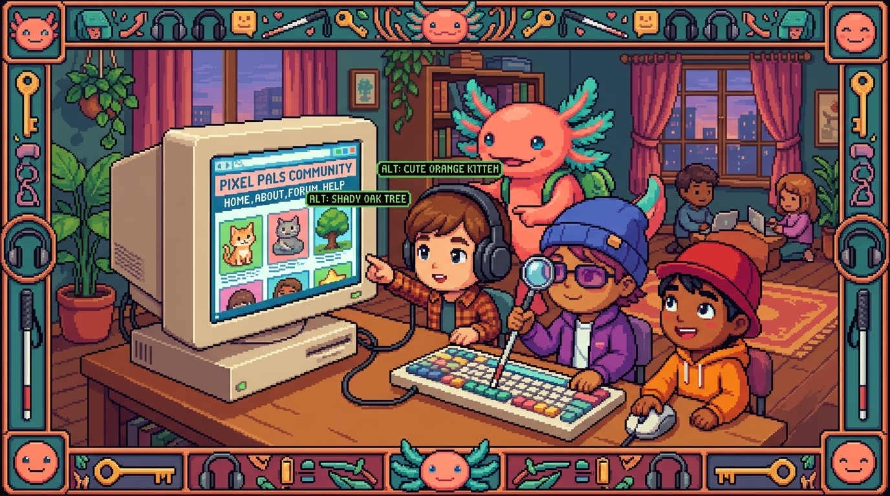

# Capítulo 05 — Accesibilidad y buenas prácticas

<p align="center">
  
</p>


> Cerramos HTML con algo que de verdad marca la diferencia entre un principiante y un
> profesional: hacer páginas que **cualquiera** pueda usar, incluidas personas con discapacidad.
> No es un adorno opcional. Es calidad, en muchos países es ley, y Google lo tiene en cuenta para
> posicionarte. Lo mejor: casi todo se consigue escribiendo bien el HTML, que es justo lo que ya
> sabes hacer.

---

## 1. Qué es la accesibilidad web

> ### 🟦 ¿Qué significa? — *Accesibilidad (a11y)*
> La **accesibilidad web** consiste en diseñar páginas que puedan usar **todas** las personas,
> también quienes tienen alguna discapacidad visual, auditiva, motriz o cognitiva. Se abrevia
> **a11y** (la "a", las 11 letras que van en medio, y la "y" final). No es un módulo aparte que se
> añade al final: es una manera de construir desde el principio.

> ### 🟦 ¿Qué significa? — *Lector de pantalla*
> Un **lector de pantalla** (*screen reader*) es un programa que **lee en voz alta** lo que aparece
> en la pantalla, pensado para personas ciegas o con baja visión. Va recorriendo tu HTML y lo va
> narrando: "encabezado nivel 1: Mi negocio… enlace: Contacto… campo de texto: Correo". Cuando el
> HTML está bien hecho, la experiencia fluye sin esfuerzo; cuando no, todo se vuelve un lío. Por eso
> lo "semántico" que viste en el capítulo 03 pesa tanto.

---

## 2. Las reglas de oro (que ya casi dominas)

La buena noticia es que la mayor parte de la accesibilidad **sale gratis** con solo escribir HTML
correcto. Vamos a repasar lo que ya conoces, esta vez poniéndole nombre y explicando para qué sirve:

1. **Usa HTML semántico** (`<header>`, `<nav>`, `<main>`, `<footer>`): el lector de pantalla
   anuncia cada zona y deja saltar de una a otra.
2. **Encabezados en orden** (`<h1>` → `<h2>` → `<h3>`, sin saltarse ninguno): funcionan como un
   índice por el que el usuario se mueve.
3. **Todas las imágenes con `alt`** descriptivo (o `alt=""` cuando son solo decorativas).
4. **Cada campo de formulario con su `<label>`**.
5. **Enlaces con texto claro**: "Ver precios" en lugar de "haz clic aquí". A veces el lector de
   pantalla lista solo los enlaces, y un "clic aquí" suelto, fuera de contexto, no dice absolutamente
   nada.
6. **El idioma declarado** (`<html lang="es">`): así el lector aplica la pronunciación correcta.

> ### 💡 Tip — La prueba del teclado
> Mucha gente navega **sin ratón**, solo con el teclado, ya sea por una discapacidad motriz o por
> simple preferencia. Haz una prueba en tu página: pulsa la tecla **Tab** varias veces. El foco
> debería ir saltando por enlaces, campos y botones en un orden lógico, y siempre tienes que **ver**
> dónde está parado. Si logras usar toda la página solo con el teclado, vas por muy buen camino.

---

## 3. Cuando el HTML semántico no alcanza: ARIA

A veces armas algo interactivo que el HTML de toda la vida no describe bien: un menú desplegable
complicado, una ventana emergente. Para esos casos aparecen los atributos ARIA.

> ### 🟦 ¿Qué significa? — *ARIA*
> **ARIA** (*Accessible Rich Internet Applications*) es un conjunto de **atributos extra** que
> aportan información de accesibilidad al navegador y a los lectores de pantalla cuando el HTML por
> sí solo se queda corto. Algunos ejemplos:
> - `aria-label="Cerrar"` → le pone nombre a un botón que solo muestra un icono "✕".
> - `aria-hidden="true"` → le indica al lector de pantalla que ignore algo puramente decorativo.
> - `role="navigation"` → describe el papel de un elemento (aunque si usas `<nav>` ya no te hace falta).

> ### ⚠️ Cuidado — La primera regla de ARIA es: no uses ARIA
> Suena contradictorio, pero es la recomendación oficial: **si una etiqueta HTML normal ya hace el
> trabajo, úsala en lugar de ARIA.** Un `<button>` de verdad es mejor que un `<div role="button">`
> cargado de cinco atributos ARIA. ARIA es un parche para situaciones especiales, no un reemplazo del
> HTML semántico. Por eso lo dejamos para el final: primero dominas lo semántico, y ARIA queda como
> la excepción.

> ### 🔎 En tu código
> En `tunal-digital/sitio-web/index.html`, el botón del menú móvil y el del chat usan algún
> `aria-label` para que su función quede clara aunque por fuera solo se vea un icono. Cuando lo
> inspecciones con `F12`, fíjate en los atributos que empiezan con `aria-`.

---

## 4. Contraste y color (un puente al módulo de CSS)

> ### 🟦 ¿Qué significa? — *Contraste*
> El **contraste** es la diferencia de luminosidad entre el texto y su fondo. Un texto gris clarito
> sobre blanco le cuesta a mucha gente. Hay un estándar, **WCAG**, que fija un contraste mínimo (para
> texto normal recomienda una relación de **4.5:1**).
> **¿Dónde aparece esto en tu proyecto?** Tanto tu sitio como Faro hablan de cumplir "WCAG AA", que
> es precisamente este criterio de contraste. El color se controla desde **CSS** (módulo 02), pero
> *decidir* que el texto sea legible es cosa de accesibilidad.

> ### 💡 Tip — No comuniques solo con color
> Nunca te quedes en "los campos en rojo son obligatorios": una persona daltónica no va a notar la
> diferencia. Acompaña siempre el color con un texto o un icono ("Obligatorio *"). El color
> **refuerza** el mensaje, no lo carga él solo.

---

## 5. Cierre del módulo: tu mapa de HTML

Mira todo lo que ya eres capaz de hacer:

```
HTML
├── Etiquetas, elementos, atributos        (cap. 01)
├── El DOM: tu HTML como árbol             (cap. 01)
├── Texto: h1–h6, p, strong/em, listas     (cap. 02)
├── Enlaces (a/href) e imágenes (img/alt)  (cap. 02)
├── head: charset, viewport, title, meta   (cap. 03)
├── body semántico: header/nav/main/footer (cap. 03)
├── Formularios: form, input, label, button(cap. 04)
└── Accesibilidad: alt, label, ARIA, WCAG  (cap. 05)
```

Con esto ya puedes leer y escribir el **esqueleto** de cualquier página, el de tu propio sitio
incluido. Eso que todavía se ve "sin pintar" lo arreglarás en el módulo que viene.

---

## ✅ Checklist — ¿ya domino esto?

- [ ] Entiendo qué es la **accesibilidad** y qué hace un **lector de pantalla**.
- [ ] Sé que el HTML **semántico** + `alt` + `label` + buen texto de enlace ya dan mucha a11y.
- [ ] Puedo hacer la **prueba del teclado** (Tab) en una página.
- [ ] Sé qué es **ARIA** y por qué se usa solo cuando el HTML normal no basta.
- [ ] Entiendo el **contraste** (WCAG) y por qué no debo comunicar solo con color.

---

## 🧪 Ejercicios

1. **Gratis con HTML.** Lista tres cosas de accesibilidad que ya consigues solo por escribir
   HTML correcto (sin ARIA ni nada extra).
2. **Texto de enlace.** Reescribe estos enlaces para que tengan sentido fuera de contexto:
   "Para ver los precios, haz clic <a href='#'>aquí</a>." 
3. **¿ARIA o HTML?** Quieres un botón que cierre una ventana y solo muestra "✕". ¿Qué etiqueta
   usas y qué atributo le añades para que un lector de pantalla sepa que "cierra"?
4. **Contraste.** Explica por qué texto gris claro (#BBBBBB) sobre fondo blanco es un problema
   y a quién afecta.
5. 💻 **Auditoría.** Abre tu `index.html` y revisa: ¿toda imagen tiene `alt`? ¿todo input tiene
   `<label>`? ¿hay un solo `<h1>`? ¿puedes navegarlo con Tab? Corrige lo que falte.

---

🎉 **¡Terminaste el Módulo 01 — HTML!** Ya construyes el esqueleto de cualquier web y entiendes
tu propio sitio por dentro. Ahora toca darle vida visual.

➡️ Siguiente módulo: **[02 — CSS](../02-css/README.md)** *(en preparación)*.
