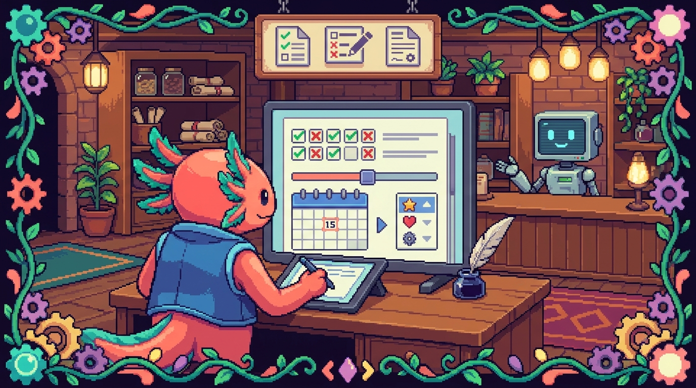

# Capítulo 08 — Formularios avanzados

<p align="center">
  
</p>


> En el capítulo anterior viste lo justo para defenderte con formularios: la etiqueta `<form>`, las cajas de texto y el botón de enviar. Ahora toca abrir el cofre entero. HTML trae un montón de campos ya hechos —calendarios, selectores de color, deslizadores, subida de archivos— y, de paso, sabe revisar lo que escribe la persona antes de que se envíe nada. A lo largo del capítulo vas a montar, pieza por pieza, un formulario de contacto completo para tu sitio **tunal-digital**. Bit, el ajolote pixel art, viene contigo: hoy se ha puesto el casco de obra porque vamos a construir cosas de verdad.

## 1. Repaso rápido: ¿qué es un formulario?

Un formulario es la parte de una página donde la persona **escribe o elige algo** y luego lo **envía**. La forma más fácil de imaginarlo es como un cuestionario de papel: tiene casillas, líneas para escribir y un botón al final.

> ### 🟦 ¿Qué significa? — *Formulario (`<form>`)*
> Es la etiqueta HTML que **agrupa** todos los campos que la persona va a rellenar y decide qué ocurre al enviarlos. Su trabajo es recoger datos: un nombre, un correo, un mensaje.
> **¿Dónde se usa en tu proyecto?** En **tunal-digital** (`sitio-web/index.html`), el formulario de contacto es justo la pieza que convierte a un visitante curioso en un mensaje que aterriza en tu bandeja.

Un esqueleto mínimo se ve así:

```html
<form action="/enviar" method="post">
  <label for="nombre">Tu nombre</label>
  <input type="text" id="nombre" name="nombre">
  <button type="submit">Enviar</button>
</form>
```

> ### 🟦 ¿Qué significa? — *`<input>`*
> Es la etiqueta estrella de los formularios: una **caja de entrada** donde la persona escribe o elige. Lo curioso es que cambia por completo según su atributo `type`. Con `type="text"` es una línea para escribir; con `type="date"`, un calendario; con `type="color"`, un selector de colores. Una sola etiqueta y mil caras.

> ### 🟦 ¿Qué significa? — *Atributo `type`*
> Un **atributo** es información extra que le das a una etiqueta, escrita dentro de los `< >`. El atributo `type` le dice al `<input>` **qué clase de campo** tiene que ser. Cambia el `type` y cambias tanto su aspecto como su comportamiento.

> ### 💡 Tip — `name` es el nombre, `id` es la dirección
> Casi todos los campos llevan dos atributos que se parecen pero no son lo mismo. `name` es la **etiqueta del dato** que viaja al enviar el formulario (el servidor lo recibe como `nombre=Edwar`). `id` es un identificador único dentro de la página, y se usa sobre todo para conectar el campo con su `<label>`. Sin `name`, el dato no se manda. Sin `id`, el `<label>` no sabe a quién apunta.

## 2. Todos los tipos de `input` (uno por uno)

Vamos a repasar los `type` que más vas a usar. De cada uno te enseño el código y para qué sirve. No hace falta que te los aprendas de memoria: con tenerlos a mano y captar la idea, sobra.

### 2.1 Texto, correo, contraseña (los que ya conoces)

```html
<input type="text" name="nombre">
<input type="email" name="correo">
<input type="password" name="clave">
```

`text` es una línea de escritura normal y corriente. `email` es igual, pero el navegador comprueba que lo escrito tenga pinta de correo (con su `@`). `password` esconde lo que se teclea detrás de unos puntitos.

### 2.2 `number` — solo números

```html
<label for="cantidad">¿Cuántas páginas web necesitas?</label>
<input type="number" id="cantidad" name="cantidad" min="1" max="10">
```

> ### 🟦 ¿Qué significa? — *`type="number"`*
> Es un campo que **solo deja meter números**. En el móvil aparece el teclado numérico, y normalmente verás unas flechitas para subir o bajar el valor. Va perfecto para edades, cantidades o precios.

Los atributos `min` y `max` ponen el cerco: en el ejemplo, no se puede pedir menos de 1 ni más de 10.

### 2.3 `date` — un calendario

```html
<label for="fecha">¿Para cuándo lo necesitas?</label>
<input type="date" id="fecha" name="fecha">
```

> ### 🟦 ¿Qué significa? — *`type="date"`*
> Convierte el campo en un **selector de fecha**: al hacer clic se despliega un calendario y la persona pincha el día. Así nadie acaba escribiendo cosas como "el martes que viene". Ideal para reservas, plazos o cumpleaños.

### 2.4 `range` — un deslizador

```html
<label for="presupuesto">Presupuesto aproximado</label>
<input type="range" id="presupuesto" name="presupuesto" min="0" max="2000" step="100">
```

> ### 🟦 ¿Qué significa? — *`type="range"`*
> Es una **barra deslizante**, como el control de volumen del móvil. La persona arrastra un botón de lado a lado para escoger un valor entre un mínimo y un máximo. Encaja cuando el número exacto da igual y lo que cuenta es la sensación de "más o menos por aquí".

> ### 🟦 ¿Qué significa? — *Atributo `step`*
> Marca **de cuánto en cuánto** salta el valor. Con `step="100"`, el deslizador avanza de 100 en 100 (0, 100, 200…). Si no pones `step`, va de uno en uno.

### 2.5 `color` — elegir un color

```html
<label for="color">Color favorito de tu marca</label>
<input type="color" id="color" name="color">
```

> ### 🟦 ¿Qué significa? — *`type="color"`*
> Abre el **selector de color** propio del sistema. La persona escoge un color y el formulario guarda su código (algo del estilo `#1d4ed8`). Puede venirte de perlas, por ejemplo, para que un cliente de **tunal-digital** te diga el color que imagina para su sitio.

### 2.6 `file` — subir un archivo

```html
<label for="logo">Sube tu logo (opcional)</label>
<input type="file" id="logo" name="logo" accept="image/*">
```

> ### 🟦 ¿Qué significa? — *`type="file"`*
> Crea un botón de **"elegir archivo"**. Al pulsarlo se abre el explorador del dispositivo para que la persona escoja un archivo: una imagen, un PDF, lo que sea. Sirve para que alguien adjunte su logo, una foto o un documento.

> ### 🟦 ¿Qué significa? — *Atributo `accept`*
> Le indica al campo **qué tipos de archivo** admitir. `accept="image/*"` quiere decir "cualquier imagen". Así te ahorras que alguien intente colarte sin querer un vídeo de 2 GB.

### 2.7 `search`, `url` y `tel`

```html
<input type="search" name="buscar" placeholder="Buscar...">
<input type="url" name="sitio" placeholder="https://ejemplo.com">
<input type="tel" name="telefono" placeholder="+1 202 555 0199">
```

- `search` se parece muchísimo a `text`, pero algunos navegadores le añaden una "x" para borrar de un toque. Está pensado para cajas de búsqueda.
- `url` comprueba que lo escrito tenga forma de dirección web (con `http://` o `https://`).
- `tel` no revisa el formato —los teléfonos cambian demasiado de un país a otro—, pero en el móvil saca el **teclado de marcación**, con sus números grandotes.

> ### 🟦 ¿Qué significa? — *`placeholder`*
> Es ese **texto gris de ejemplo** que se asoma dentro de un campo vacío y se borra en cuanto empiezas a escribir. Funciona como pista ("escribe aquí tu correo"). Eso sí: no sustituye al `<label>`, porque desaparece al teclear y más de uno se pierde.

> ### ⚠️ Cuidado — El navegador valida, pero no es tu guardia de seguridad
> Que el navegador revise un correo o una URL es una comodidad para quien rellena el formulario, no una defensa de verdad. Quien tenga malas intenciones se salta todo eso sin despeinarse. La validación **en serio** se hace siempre en el servidor. En **tunal-digital**, eso pasa en el Cloudflare Worker que recibe el mensaje, nunca en el HTML.

## 3. Listas de opciones: `select`, `option` y `optgroup`

Cuando prefieres que la persona **escoja de una lista cerrada** en lugar de escribir a su aire, lo que necesitas es un menú desplegable.

```html
<label for="servicio">¿Qué servicio te interesa?</label>
<select id="servicio" name="servicio">
  <option value="">— Elige una opción —</option>
  <option value="landing">Página de aterrizaje</option>
  <option value="tienda">Tienda en línea</option>
  <option value="rediseno">Rediseño de mi web actual</option>
</select>
```

> ### 🟦 ¿Qué significa? — *`<select>` y `<option>`*
> `<select>` es el **menú desplegable**, esa cajita que se abre al pulsarla. Dentro viven varias `<option>`, que son **cada una de las opciones** que la persona puede elegir. El atributo `value` de cada `<option>` es el dato que se manda; el texto entre las etiquetas es lo que la persona ve en pantalla.

Si tienes muchas opciones, puedes **agruparlas** para que se lean mejor:

```html
<select id="servicio" name="servicio">
  <optgroup label="Sitios web">
    <option value="landing">Página de aterrizaje</option>
    <option value="tienda">Tienda en línea</option>
  </optgroup>
  <optgroup label="Mantenimiento">
    <option value="rediseno">Rediseño</option>
    <option value="soporte">Soporte mensual</option>
  </optgroup>
</select>
```

> ### 🟦 ¿Qué significa? — *`<optgroup>`*
> Es una **cabecera de grupo** dentro de un `<select>`. Pone un título (con el atributo `label`) encima de un puñado de opciones, igual que las secciones de la carta de un restaurante. No se puede seleccionar; solo ordena. Te salva cuando tienes muchas opciones y quieres repartirlas por categorías.

> ### 💡 Tip — La primera opción como instrucción
> Es buena idea poner una primera `<option>` con `value=""` y un texto del tipo "— Elige una opción —". Así el desplegable arranca en blanco y la persona pilla a la primera que tiene que decidir algo. Si lo combinas con `required` (lo verás más abajo), la obligas a escoger de verdad.

## 4. `datalist`: sugerencias mientras escribes

A veces quieres quedarte con lo mejor de dos mundos: que la persona **escriba a su aire**, pero echándole una mano con **sugerencias**. Para eso está `datalist`.

```html
<label for="ciudad">¿Desde qué ciudad nos escribes?</label>
<input type="text" id="ciudad" name="ciudad" list="ciudades">
<datalist id="ciudades">
  <option value="Bogotá"></option>
  <option value="Medellín"></option>
  <option value="Washington D. C."></option>
</datalist>
```

> ### 🟦 ¿Qué significa? — *`<datalist>`*
> Es una **lista de sugerencias** enganchada a un `<input>` de texto. Según va escribiendo, el navegador le va proponiendo opciones que encajan, pero **nada le impide escribir algo que no esté en la lista**. La conexión se hace con el atributo `list` del input, que tiene que coincidir con el `id` del `<datalist>`.

¿La diferencia con `<select>`? El `select` te **obliga** a elegir de la lista; el `datalist` solo **sugiere** y te deja escribir lo que quieras.

## 5. Organizar el formulario: `fieldset` y `legend`

Cuando un formulario empieza a crecer, conviene meter los campos relacionados dentro de una caja con su título.

```html
<fieldset>
  <legend>Tus datos de contacto</legend>

  <label for="nombre">Nombre</label>
  <input type="text" id="nombre" name="nombre">

  <label for="correo">Correo</label>
  <input type="email" id="correo" name="correo">
</fieldset>
```

> ### 🟦 ¿Qué significa? — *`<fieldset>` y `<legend>`*
> `<fieldset>` dibuja un **recuadro que agrupa** varios campos que van juntos. `<legend>` es el **título de ese recuadro**, que queda encajado en el borde de arriba. Entre los dos te dejan partir un formulario largo en bloques con sentido ("Datos de contacto", "Detalles del proyecto") y, además, le facilitan la vida a quien navega con lector de pantalla, que así entiende cómo está organizado todo.

> ### 🔎 En tu código
> En **tunal-digital** podrías dividir tu formulario de contacto en dos `fieldset`: uno para "Quién eres" (nombre, correo, teléfono) y otro para "Qué necesitas" (servicio, presupuesto, mensaje). Visualmente queda más aireado y la persona se pierde menos.

## 6. Validación: pedir que los datos vengan bien

Lo bueno de los formularios modernos es que el navegador puede **revisar lo escrito antes de enviar** y avisar si falta algo o hay algún error. A eso lo llamamos validación.

> ### 🟦 ¿Qué significa? — *Validación*
> Es **comprobar que los datos cumplen unas reglas** antes de darlos por buenos. Por ejemplo: que el correo lleve `@`, que el mensaje no esté vacío, que el teléfono tenga al menos siete dígitos. HTML trae varias de estas reglas listas para usar como atributos.

### 6.1 `required` — obligatorio

```html
<input type="email" name="correo" required>
```

> ### 🟦 ¿Qué significa? — *`required`*
> Marca un campo como **obligatorio**. Si la persona intenta enviar el formulario dejándolo en blanco, el navegador frena el envío y le suelta un aviso. Resérvalo para los datos sin los que el formulario no pinta nada (un mensaje de contacto sin correo no sirve de gran cosa).

### 6.2 `minlength` y `maxlength` — longitud del texto

```html
<textarea name="mensaje" minlength="10" maxlength="500" required></textarea>
```

> ### 🟦 ¿Qué significa? — *`minlength` y `maxlength`*
> Controlan **cuántos caracteres** caben en un campo de texto. `minlength="10"` exige al menos 10 (para que nadie te mande un mensaje de una sola palabra). `maxlength="500"` corta el grifo a partir de 500. Entre los dos consiguen mensajes que no son ni telegráficos ni interminables.

### 6.3 `min` y `max` — rango de números o fechas

Ya los viste con `number` y `range`. Pues también funcionan con `date`:

```html
<input type="date" name="fecha" min="2026-07-01">
```

Con eso, no hay manera de elegir una fecha anterior al 1 de julio de 2026.

### 6.4 `pattern` — un molde exacto

```html
<label for="codigo">Código postal (5 dígitos)</label>
<input type="text" id="codigo" name="codigo" pattern="[0-9]{5}">
```

> ### 🟦 ¿Qué significa? — *`pattern`*
> Define un **molde** que el texto tiene que respetar, escrito en un lenguaje que se llama "expresión regular". En el ejemplo, `[0-9]{5}` significa "exactamente 5 caracteres, y todos números del 0 al 9". Si lo escrito no encaja, el navegador no deja enviar. Va de maravilla para formatos estrictos: códigos postales, identificadores y cosas así.

> ### 💡 Tip — Acompaña siempre `pattern` con un `title`
> Las expresiones regulares no hay quien las entienda de un vistazo. Añade un atributo `title` que explique la regla en cristiano: `title="Escribe 5 números"`. El navegador lo enseñará cuando la persona se equivoque, y te lo va a agradecer.

> ### ⚠️ Cuidado — No te pases con la validación estricta
> Es tentador exigir formatos de manual, pero piensa que tus visitantes escriben desde el móvil y con prisa. Un teléfono con espacios o un correo con alguna mayúscula deberían poder pasar sin problema. Valida lo justo: obligatorio sí, pero no metas un `pattern` tan rígido que espantes a un cliente de verdad.

## 7. `autocomplete`: que el navegador eche una mano

```html
<input type="text" name="nombre" autocomplete="name">
<input type="email" name="correo" autocomplete="email">
<input type="tel" name="telefono" autocomplete="tel">
```

> ### 🟦 ¿Qué significa? — *`autocomplete`*
> Le dice al navegador **qué dato representa el campo**, para que pueda ofrecerse a rellenarlo solo con información que la persona ya tiene guardada (su nombre, su correo, su dirección). Con `autocomplete="email"`, al tocar el campo le aparece su correo como sugerencia. Hace que rellenar el formulario sea más rápido y cómodo.

Algunos valores habituales: `name`, `email`, `tel`, `street-address`, `postal-code`, `organization`. Y si en algún campo no quieres sugerencias, tienes `autocomplete="off"` para apagarlo.

## 8. Accesibilidad: que cualquier persona pueda usarlo

> ### 🟦 ¿Qué significa? — *Accesibilidad*
> Es diseñar pensando en que **todas las personas** puedan usar tu sitio, incluidas las que navegan con el teclado, con lectores de pantalla (programas que leen la página en voz alta) o con baja visión. No es un lujo que se añade al final: es parte de hacer las cosas bien desde el principio.

Tres reglas de oro para formularios accesibles:

1. **Cada campo con su `<label>`,** y conectado con `for` e `id`.

```html
<label for="correo">Tu correo</label>
<input type="email" id="correo" name="correo">
```

> ### 🟦 ¿Qué significa? — *`<label>`*
> Es la **etiqueta de texto** que aclara qué se escribe en un campo. El atributo `for` del label tiene que coincidir con el `id` del input. Gracias a eso, al tocar el texto el cursor salta solo al campo, y los lectores de pantalla anuncian "Tu correo, campo de texto". En resumidas cuentas: que nadie dude de qué va en cada caja.

2. **No te apoyes solo en el color para avisar de errores.** Si un campo está mal, dilo también con texto, no solo con un borde rojo (hay gente que no distingue ese rojo).

3. **Orden lógico.** Los campos tienen que ir en un orden natural, de arriba abajo, para que se puedan recorrer con la tecla Tab sin pegar saltos raros.

> ### 💡 Tip — Bit dice: prueba sin ratón
> Bit te lanza un reto: abre tu formulario y recórrelo **solo con el teclado**, usando Tab para avanzar y Enter para enviar. Si lo completas enterito sin tocar el ratón, vas estupendamente. Si te atascas en algún punto, ahí tienes algo que pulir.

## 9. El formulario de contacto de tunal-digital (todo junto)

Vamos a juntar todo lo aprendido en un formulario de verdad para tu sitio. Este código iría dentro del `<body>` de `sitio-web/index.html`.

```html
<form action="/api/contacto" method="post" autocomplete="on">

  <fieldset>
    <legend>Cuéntanos quién eres</legend>

    <label for="nombre">Nombre</label>
    <input type="text" id="nombre" name="nombre"
           autocomplete="name" required minlength="2">

    <label for="correo">Correo electrónico</label>
    <input type="email" id="correo" name="correo"
           autocomplete="email" required
           placeholder="tucorreo@ejemplo.com">

    <label for="telefono">Teléfono (opcional)</label>
    <input type="tel" id="telefono" name="telefono"
           autocomplete="tel" placeholder="+1 202 555 0199">
  </fieldset>

  <fieldset>
    <legend>Cuéntanos qué necesitas</legend>

    <label for="servicio">Servicio que te interesa</label>
    <select id="servicio" name="servicio" required>
      <option value="">— Elige una opción —</option>
      <optgroup label="Sitios web">
        <option value="landing">Página de aterrizaje</option>
        <option value="tienda">Tienda en línea</option>
      </optgroup>
      <optgroup label="Otros">
        <option value="rediseno">Rediseño de mi web</option>
        <option value="soporte">Soporte y mantenimiento</option>
      </optgroup>
    </select>

    <label for="presupuesto">Presupuesto aproximado (USD)</label>
    <input type="range" id="presupuesto" name="presupuesto"
           min="0" max="3000" step="250" value="1000">

    <label for="fecha">¿Para cuándo lo necesitas?</label>
    <input type="date" id="fecha" name="fecha" min="2026-07-01">

    <label for="mensaje">Tu mensaje</label>
    <textarea id="mensaje" name="mensaje" required
              minlength="10" maxlength="600"
              placeholder="Cuéntame brevemente tu proyecto..."></textarea>
  </fieldset>

  <button type="submit">Enviar mensaje</button>
</form>
```

> ### 🔎 En tu código
> Mira bien el `action="/api/contacto"`: esa ruta es la que va a recibir los datos. En **tunal-digital**, ahí es donde entra tu **Cloudflare Worker** (escrito en `main.js` o en un archivo de Worker aparte), que recoge el mensaje, puede pasarlo por la **API de Claude** para resumirlo o clasificarlo, y te lo hace llegar. El HTML solo recoge y entrega; la lógica vive en el servidor. Por eso los tokens y las claves no aparecen jamás en el HTML del cliente.

> ### ⚠️ Cuidado — `value` en `range` evita el "medio raro"
> Si no le pones `value` al deslizador, arranca en mitad de la barra y mucha gente ni lo toca. Darle un `value="1000"` de salida deja un punto de partida con cabeza. Y acuérdate de mostrar en pantalla el número elegido con un poquito de JavaScript, porque un deslizador sin número al lado es adivinar a ciegas.

> ### 💡 Tip — Este patrón se repite en todos tus proyectos
> Los `<input>`, los `<label>` y la validación que viste aquí son HTML puro, así que se comportan igual en **tunal-digital**. Pero la idea viaja contigo: en **RachaSimple** (React) escribirás campos parecidos dentro de componentes `.tsx`, y en **Faro** (Next.js) los formularios de conexión también arrancan de estos mismos elementos. Dominar bien el formulario en HTML te ahorra líos en todo lo demás.

## ✅ Checklist — ¿ya domino esto?

- [ ] Sé que `type` cambia por completo lo que hace un `<input>`.
- [ ] Reconozco los tipos `text`, `email`, `password`, `number`, `date`, `range`, `color`, `file`, `search`, `url` y `tel`.
- [ ] Entiendo la diferencia entre `name` (dato que se envía) e `id` (identificador en la página).
- [ ] Sé crear un menú desplegable con `<select>` y `<option>`, y agruparlo con `<optgroup>`.
- [ ] Distingo `datalist` (sugiere, deja escribir) de `select` (obliga a elegir).
- [ ] Uso `fieldset` y `legend` para ordenar formularios largos.
- [ ] Sé validar con `required`, `minlength`, `maxlength`, `min`, `max` y `pattern`.
- [ ] Conecto cada campo con su `<label>` usando `for` e `id`.
- [ ] Entiendo que la validación del navegador es comodidad, no seguridad: lo serio se hace en el servidor.

## 🧪 Ejercicios

1. **💻 Reproduce el formulario de contacto** de la sección 9 dentro de tu `sitio-web/index.html`. Ábrelo en el navegador y comprueba que se ve.

2. **💻 Rompe las reglas a propósito.** Intenta enviar el formulario con el correo vacío y con un mensaje de solo 3 letras. Fíjate en qué avisos muestra el navegador. ¿Se entienden?

3. **💻 Añade un campo nuevo.** Agrega un `<input type="color">` con su `<label>` para que el cliente elija el color de su marca. Dale un `id`, un `name` y conéctalo bien con el label.

4. **💻 Crea un `datalist`** para el campo "¿Cómo nos conociste?" con sugerencias como "Instagram", "Recomendación", "Google", pero permitiendo escribir otra cosa.

5. **Sin computadora:** dibuja en papel tu formulario y, junto a cada campo, anota qué `type` usarías y qué reglas de validación (`required`, `min`, `pattern`...) le pondrías. Justifica cada decisión en una línea.

6. **💻 Reto de accesibilidad (de Bit):** recorre tu formulario completo usando solo el teclado (Tab y Enter). Si algún campo no se selecciona o se salta de orden, arréglalo. Apunta qué cambiaste.
