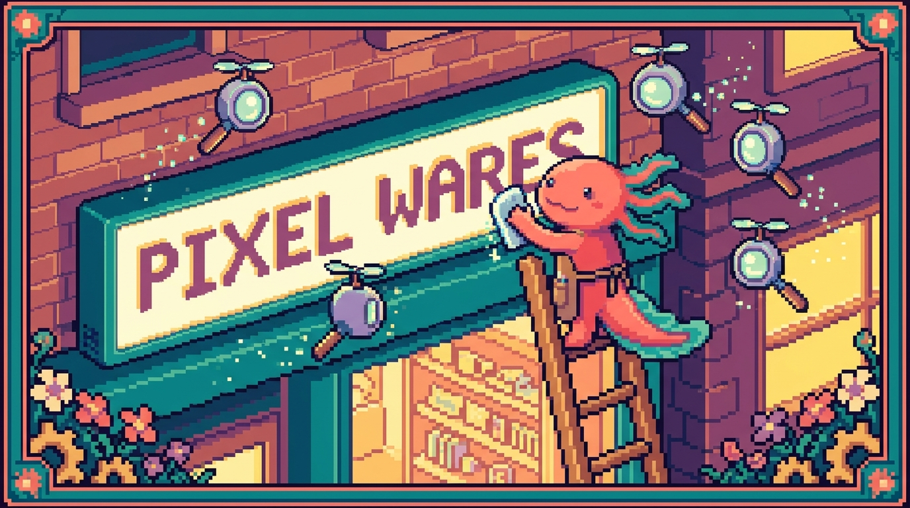

# Capítulo 09 — El head completo y el SEO

<p align="center">
  
</p>


> Hasta ahora le has dedicado casi todo tu tiempo al `<body>`: lo que se ve. Pero tu página tiene otra parte que **nadie ve directamente** y que, aun así, decide cómo se muestra tu pestaña, qué tarjeta aparece cuando alguien comparte tu enlace por WhatsApp y si Google entiende de qué trata tu sitio. Esa parte es el `<head>`. En este capítulo Bit, nuestro ajolote pixelado, te acompaña línea por línea por el `<head>` de **tunal-digital** para que dejes de copiarlas "porque sí" y entiendas de verdad qué hace cada una.

## 1. ¿Qué es el `<head>` y por qué importa tanto?

En el Capítulo 02 viste que un documento HTML se parte en dos zonas grandes: el `<head>` y el `<body>`. Vale la pena refrescarlo, porque ahora le vamos a sacar todo el jugo al primero.

> ### 🟦 ¿Qué significa? — *head*
> El `<head>` (en inglés, "cabeza") es la sección del HTML donde guardas **información sobre la página**, no su contenido visible. Le habla al navegador y a otros programas (como Google o WhatsApp) para decirles: "esta página se llama así, está en español, usa estos caracteres, esta es su imagen de portada...".
> **¿Para qué sirve?** Para que tu página se entienda, se vea bien en el móvil, salga correctamente en buscadores y luzca bonita al compartirla.
> **¿Dónde se usa en tu proyecto?** En `tunal-digital`, dentro de `sitio-web/index.html`, todo lo que va entre `<head>` y `</head>`, justo encima del contenido que el visitante ve.

La palabra clave aquí es **metadatos**.

> ### 🟦 ¿Qué significa? — *metadato*
> Un metadato es "un dato sobre un dato". El contenido de tu página es el dato; el metadato es la información *acerca* de ese contenido: su título, su idioma, su descripción.
> **¿Para qué sirve?** Para que las máquinas (navegadores, buscadores, redes sociales) sepan cómo tratar tu página sin tener que "leerla" entera.

La mayoría de esos metadatos se escriben con una etiqueta especial: `<meta>`.

> ### 🟦 ¿Qué significa? — *etiqueta `<meta>`*
> Es una etiqueta que vive dentro del `<head>` y declara un metadato. No se cierra (no lleva `</meta>`); es una etiqueta "vacía" que solo aporta atributos.
> **¿Para qué sirve?** Cada `<meta>` declara una pieza de información: el juego de caracteres, la descripción, cómo se ve en el móvil, etc.

Un `<head>` básico se ve así:

```html
<!DOCTYPE html>
<html lang="es">
  <head>
    <meta charset="UTF-8" />
    <meta name="viewport" content="width=device-width, initial-scale=1.0" />
    <title>Tunal Digital</title>
  </head>
  <body>
    <!-- Aquí va lo que el visitante ve -->
  </body>
</html>
```

> ### 💡 Tip — El orden sí importa (un poco)
> Pon `<meta charset>` lo más arriba posible dentro del `<head>`, antes que el `<title>`. Así el navegador sabe desde el primer momento cómo leer las letras, tildes y ñ incluidas.

## 2. `charset`: que las tildes y la ñ no se rompan

> ### 🟦 ¿Qué significa? — *charset (UTF-8)*
> `charset` es el "juego de caracteres": la tabla que el navegador usa para convertir los unos y ceros del archivo en letras. `UTF-8` es la tabla universal moderna, e incluye tildes, ñ, signos de apertura (¿ ¡) y hasta emojis.
> **¿Para qué sirve?** Para que "Diseño y programación" no termine apareciendo como "Diseño y programación".
> **¿Dónde se usa en tu proyecto?** En la primera línea del `<head>` de `tunal-digital`: `<meta charset="UTF-8" />`.

```html
<meta charset="UTF-8" />
```

Como tu sitio está en **español** (la regla del proyecto Faro lo pide para toda la documentación, y tu web también lo está), `UTF-8` no es opcional: es justo lo que evita que tu landing se llene de símbolos raros.

> ### ⚠️ Cuidado — Guarda el archivo en UTF-8
> Declarar `charset="UTF-8"` no basta si tu editor guarda el archivo en otra codificación. Por suerte, editores como VS Code usan UTF-8 por defecto. Si ves caracteres rotos, mira abajo a la derecha en VS Code que diga "UTF-8".

## 3. `viewport`: que se vea bien en el móvil

> ### 🟦 ¿Qué significa? — *viewport*
> El viewport es el "área visible" de la página dentro de la pantalla del dispositivo. Esta `<meta>` le dice al móvil: "no encojas mi página para que quepa entera; muéstrala al ancho real del teléfono".
> **¿Para qué sirve?** Para que en el celular tu web no se vea diminuta y haya que hacer zoom. Es la base del **diseño responsive** (el que se adapta a cualquier pantalla).
> **¿Dónde se usa en tu proyecto?** En el `<head>` de `tunal-digital`, junto al charset.

```html
<meta name="viewport" content="width=device-width, initial-scale=1.0" />
```

Veamos qué dice el atributo `content` por dentro:

- `width=device-width`: el ancho de la página = el ancho real del dispositivo.
- `initial-scale=1.0`: el zoom inicial es 100% (ni acercado ni alejado).

> ### 💡 Tip — Sin viewport, no hay móvil bonito
> Si olvidas esta línea, tu CSS responsive (los famosos "media queries" que verás en el Módulo de CSS) puede que ni se note en el teléfono. Es de las líneas más importantes del `<head>` para un sitio como `tunal-digital`, que la gente verá mucho desde el móvil.

## 4. `<title>`: el nombre de tu pestaña

> ### 🟦 ¿Qué significa? — *title*
> El `<title>` es el texto que aparece en la **pestaña del navegador** y, muy importante, el título azul que sale en los resultados de Google.
> **¿Para qué sirve?** Para identificar tu página de un vistazo y para que el buscador sepa cómo titularla.
> **¿Dónde se usa en tu proyecto?** En `tunal-digital`: `<title>Tunal Digital — ...</title>` dentro del `<head>`.

```html
<title>Tunal Digital — Diseño web para pequeños negocios</title>
```

> ### 💡 Tip — Un buen título describe, no solo nombra
> "Tunal Digital" está bien, pero "Tunal Digital — Diseño web para pequeños negocios" le dice a la persona (y a Google) qué ofreces. Apunta a unos 50-60 caracteres: si te pasas, Google lo corta con "...".

A diferencia de `<meta>`, el `<title>` **sí** lleva etiqueta de apertura y de cierre, y solo puede haber **uno** por página.

## 5. `meta description`: el textito gris de Google

> ### 🟦 ¿Qué significa? — *meta description*
> Es un resumen corto de tu página. No se ve dentro de la página, pero Google suele mostrarlo como el **párrafo gris** que va debajo del título en los resultados de búsqueda.
> **¿Para qué sirve?** Para convencer a la persona de hacer clic. Es como el "subtítulo comercial" de tu página.
> **¿Dónde se usa en tu proyecto?** En el `<head>` de `tunal-digital`, para describir qué hace el estudio.

```html
<meta
  name="description"
  content="Tunal Digital crea sitios web rápidos y a medida para pequeños negocios. Diseño, desarrollo y resultados."
/>
```

> ### 💡 Tip — Escribe para humanos
> La descripción ideal tiene entre 120 y 155 caracteres, está en español claro y promete algo concreto. No la rellenes de palabras sueltas; escríbela como si se la contaras a un cliente.

> ### 🔎 En tu código
> Abre `sitio-web/index.html` de `tunal-digital` y busca tu `<title>` y tu `<meta name="description">`. Léelos en voz alta: ¿le dirían a un desconocido qué ofreces? Si no, ahí tienes tu primera mejora.

## 6. `favicon`: el iconito de la pestaña

> ### 🟦 ¿Qué significa? — *favicon*
> Es el pequeño icono que aparece a la izquierda del título, en la pestaña del navegador y en los marcadores. "Favicon" viene de "favorite icon".
> **¿Para qué sirve?** Para reconocer tu sitio de un vistazo entre un montón de pestañas abiertas. Da imagen de marca y profesionalidad.
> **¿Dónde se usa en tu proyecto?** En `tunal-digital`, podrías añadir un `favicon.ico` o `favicon.png` dentro de la carpeta `sitio-web/` y enlazarlo desde el `<head>`.

El favicon se enlaza con la etiqueta `<link>`:

> ### 🟦 ¿Qué significa? — *etiqueta `<link>`*
> `<link>` conecta tu HTML con un archivo externo. Ya la usaste para enlazar tu hoja de estilos (`styles.css`). También sirve para el favicon, las fuentes y el "canonical" (lo verás abajo). Igual que `<meta>`, no se cierra.
> **¿Para qué sirve?** Para "traer" recursos externos sin tener que escribirlos dentro del HTML.

```html
<link rel="icon" type="image/png" href="favicon.png" />
```

El atributo `rel` (de "relation", relación) dice qué tipo de enlace es. `rel="icon"` significa "esto es el icono de la página". El mismo `<link>` que usas para tu CSS lleva `rel="stylesheet"`:

```html
<link rel="stylesheet" href="styles.css" />
```

> ### 🔎 En tu código
> En `tunal-digital`, ese `<link rel="stylesheet" href="styles.css" />` del `<head>` es justo lo que conecta tu `index.html` con tu `styles.css`. El favicon usa la misma etiqueta `<link>`; solo cambia el `rel`.

## 7. Cargar una fuente con `<link>`

Si quieres usar una tipografía de Google Fonts (por ejemplo, "Inter" o "Poppins"), también se trae con `<link>` en el `<head>`:

```html
<link rel="preconnect" href="https://fonts.googleapis.com" />
<link rel="preconnect" href="https://fonts.gstatic.com" crossorigin />
<link
  href="https://fonts.googleapis.com/css2?family=Inter:wght@400;600;700&display=swap"
  rel="stylesheet"
/>
```

> ### 🟦 ¿Qué significa? — *preconnect*
> Un `<link rel="preconnect">` le pide al navegador que vaya "calentando" la conexión con el servidor de las fuentes antes de necesitarlas, para que carguen más rápido.
> **¿Para qué sirve?** Para que el texto aparezca con su tipografía bonita cuanto antes y se note menos el "salto" de fuente.

No hace falta que entiendas cada parte de la URL de Google Fonts: es código que copias y pegas desde la propia web de Google Fonts. Lo que importa es saber **dónde va** (en el `<head>`) y **con qué etiqueta** (`<link>`).

> ### ⚠️ Cuidado — Cada `<link>` externo cuesta tiempo
> Cargar fuentes externas vuelve tu página un poco más lenta. Para `tunal-digital`, que presume de ser "rápido", usa pocas fuentes (una o dos) y pocos grosores. Menos es más.

## 8. Open Graph: cómo se ve tu enlace al compartirlo

Aquí viene la parte más vistosa. ¿Te has fijado en que, al pegar un enlace en WhatsApp, Facebook o LinkedIn, aparece una tarjetita con imagen, título y descripción? Eso **no es magia**: lo controlas tú desde el `<head>` con las etiquetas **Open Graph**.

> ### 🟦 ¿Qué significa? — *Open Graph (OG)*
> Open Graph es un conjunto de metadatos (creado por Facebook, hoy usado por casi todas las redes) que define cómo se ve tu página cuando alguien la comparte: qué imagen, qué título y qué descripción mostrar.
> **¿Para qué sirve?** Para que tu enlace de `tunal-digital` luzca profesional y atractivo al compartirlo, en lugar de quedar como un link pelado y feo.
> **¿Dónde se usa en tu proyecto?** En el `<head>` de `tunal-digital`, con la imagen apuntando a tu **og-image.png**.

Las etiquetas Open Graph son `<meta>` con un atributo especial llamado `property` (en lugar de `name`), y todas empiezan por `og:`.

```html
<meta property="og:title" content="Tunal Digital — Diseño web para pequeños negocios" />
<meta property="og:description" content="Sitios web rápidos y a medida que hacen crecer tu negocio." />
<meta property="og:type" content="website" />
<meta property="og:url" content="https://tunaldigital.com" />
<meta property="og:image" content="https://tunaldigital.com/og-image.png" />
```

Veámoslas una a una:

- `og:title`: el título de la tarjeta (puede ser igual a tu `<title>`).
- `og:description`: la descripción de la tarjeta.
- `og:type`: qué tipo de contenido es; para un sitio normal, `website`.
- `og:url`: la dirección oficial de la página.
- `og:image`: **la imagen de la tarjeta**. Aquí entra tu `og-image.png`.

> ### 🟦 ¿Qué significa? — *og-image.png*
> Es la imagen que se muestra en la tarjeta de previsualización al compartir tu enlace. Suele ser un PNG de **1200 × 630 píxeles** con tu logo y un texto corto.
> **¿Para qué sirve?** Es la "carátula" de tu sitio en redes. Una buena `og-image` hace que la gente quiera hacer clic.
> **¿Dónde se usa en tu proyecto?** En `tunal-digital`, el archivo `og-image.png` (junto a tu `index.html`, en `sitio-web/`) referenciado por `og:image`.

> ### ⚠️ Cuidado — La URL de la imagen debe ser absoluta
> En `og:image`, no pongas `href="og-image.png"` a secas. Las redes sociales viven en sus propios servidores y necesitan la **dirección completa**: `https://tunaldigital.com/og-image.png`. Si pones una ruta relativa, la imagen no aparecerá ni en WhatsApp ni en Facebook.

> ### 🟦 ¿Qué significa? — *ruta absoluta vs. relativa*
> Una ruta **relativa** (`og-image.png`) dice "el archivo está aquí al lado". Una ruta **absoluta** (`https://tunaldigital.com/og-image.png`) da la dirección completa desde internet. Para Open Graph siempre se usa la absoluta.

## 9. Twitter Cards: lo mismo, pero para X (Twitter)

X (antes Twitter) usa Open Graph, pero también tiene sus propias etiquetas para afinar cómo se ve la tarjeta. Se llaman **Twitter Cards** y usan `name="twitter:..."`.

> ### 🟦 ¿Qué significa? — *Twitter Card*
> Son metadatos para controlar cómo aparece tu enlace al compartirlo en X. Definen el tipo de tarjeta, el título, la descripción y la imagen.
> **¿Para qué sirve?** Para que tu enlace luzca bien también en X, con una imagen grande en lugar de un recuadro pequeño.

```html
<meta name="twitter:card" content="summary_large_image" />
<meta name="twitter:title" content="Tunal Digital — Diseño web para pequeños negocios" />
<meta name="twitter:description" content="Sitios web rápidos y a medida que hacen crecer tu negocio." />
<meta name="twitter:image" content="https://tunaldigital.com/og-image.png" />
```

- `twitter:card`: el formato. `summary_large_image` muestra la imagen grande (lo más vistoso).
- Los demás reutilizan tu mismo título, descripción e imagen.

> ### 💡 Tip — Reaprovecha tu og-image
> No necesitas una imagen distinta para Twitter. La misma `og-image.png` de 1200×630 funciona perfecto en X, Facebook, LinkedIn y WhatsApp. Una sola imagen para todas las redes.

> ### 🟦 ¿Qué significa? — *property vs. name*
> Lo habrás notado: Open Graph usa `property="og:..."` y Twitter usa `name="twitter:..."`. Es solo una diferencia de convención entre los dos sistemas. No te rompas la cabeza con el porqué; quédate con el patrón: **OG con `property`, Twitter con `name`**.

## 10. `canonical`: "esta es la versión oficial"

A veces una misma página es accesible desde varias direcciones (con `www` y sin `www`, con o sin `/` al final...). Para que los buscadores no se confundan y crean que son páginas distintas, se usa el **canonical**.

> ### 🟦 ¿Qué significa? — *canonical*
> Es un `<link>` que le dice a Google: "de todas las direcciones posibles de esta página, **esta** es la oficial". 
> **¿Para qué sirve?** Para evitar contenido duplicado y concentrar la "fuerza" de tu página en una sola URL.
> **¿Dónde se usa en tu proyecto?** En el `<head>` de `tunal-digital`, apuntando a tu dirección preferida.

```html
<link rel="canonical" href="https://tunaldigital.com" />
```

Para un sitio pequeño de una sola página como `tunal-digital`, basta con apuntar el canonical a tu dirección principal. Es un detalle pequeño, pero de esos que Google agradece.

## 11. ¿Qué es el SEO y cómo influye el HTML?

Hemos nombrado mucho a Google. Es hora de ponerle nombre a todo esto.

> ### 🟦 ¿Qué significa? — *SEO*
> SEO son las siglas en inglés de *Search Engine Optimization*: "optimización para motores de búsqueda". Es el conjunto de cosas que haces para que tu página aparezca **más arriba** en Google cuando alguien busca algo relacionado.
> **¿Para qué sirve?** Para que clientes potenciales encuentren `tunal-digital` sin que tengas que pagar anuncios.

El SEO tiene muchas piezas (contenido, velocidad, enlaces de otros sitios...), pero una base fundamental es **el HTML bien hecho**. Y tú ya estás haciendo SEO sin darte cuenta cuando:

- Pones un `<title>` claro y descriptivo.
- Escribes una `meta description` que invita al clic.
- Usas un solo `<h1>` con el tema principal y `<h2>`/`<h3>` ordenados (lo viste en el capítulo de encabezados).
- Pones `alt` descriptivo en tus imágenes (capítulo de imágenes).
- Declaras el idioma con `<html lang="es">`.

> ### 🟦 ¿Qué significa? — *atributo `lang`*
> `lang="es"` en la etiqueta `<html>` declara que tu página está en español. 
> **¿Para qué sirve?** Para que Google la ofrezca a hispanohablantes y para que los lectores de pantalla (que ayudan a personas ciegas) la pronuncien en español. 
> **¿Dónde se usa en tu proyecto?** En la etiqueta de apertura `<html lang="es">` de `tunal-digital`, en línea con la regla del proyecto de trabajar todo en español.

> ### 💡 Tip — El SEO empieza por el HTML semántico
> No hace falta truco alguno: un HTML claro, con encabezados bien jerarquizados, títulos honestos y descripciones reales, ya es buen SEO. Los buscadores premian a quien escribe páginas que las personas entienden.

> ### ⚠️ Cuidado — No engañes a Google
> Poner texto oculto, repetir palabras a lo loco o prometer en el `<title>` algo que la página no cumple **perjudica** tu SEO. Google lo detecta y te castiga. Sé honesto: di lo que ofreces y cúmplelo.

## 12. El `<head>` completo de tunal-digital

Si juntamos todo lo del capítulo, así quedaría un `<head>` profesional y completo para tu `sitio-web/index.html`:

```html
<!DOCTYPE html>
<html lang="es">
  <head>
    <!-- Básicos -->
    <meta charset="UTF-8" />
    <meta name="viewport" content="width=device-width, initial-scale=1.0" />

    <!-- SEO -->
    <title>Tunal Digital — Diseño web para pequeños negocios</title>
    <meta
      name="description"
      content="Tunal Digital crea sitios web rápidos y a medida para pequeños negocios. Diseño, desarrollo y resultados."
    />
    <link rel="canonical" href="https://tunaldigital.com" />

    <!-- Favicon -->
    <link rel="icon" type="image/png" href="favicon.png" />

    <!-- Open Graph (Facebook, WhatsApp, LinkedIn) -->
    <meta property="og:title" content="Tunal Digital — Diseño web para pequeños negocios" />
    <meta property="og:description" content="Sitios web rápidos y a medida que hacen crecer tu negocio." />
    <meta property="og:type" content="website" />
    <meta property="og:url" content="https://tunaldigital.com" />
    <meta property="og:image" content="https://tunaldigital.com/og-image.png" />

    <!-- Twitter Card -->
    <meta name="twitter:card" content="summary_large_image" />
    <meta name="twitter:title" content="Tunal Digital — Diseño web para pequeños negocios" />
    <meta name="twitter:description" content="Sitios web rápidos y a medida que hacen crecer tu negocio." />
    <meta name="twitter:image" content="https://tunaldigital.com/og-image.png" />

    <!-- Estilos -->
    <link rel="stylesheet" href="styles.css" />
  </head>
  <body>
    <!-- Tu contenido -->
  </body>
</html>
```

Fíjate en los comentarios (`<!-- ... -->`): no son obligatorios, pero ordenan el `<head>` por bloques para que tú —y tu yo del futuro— encuentren las cosas rápido.

> ### 💡 Tip — Comprueba tu tarjeta antes de presumirla
> Antes de compartir tu enlace, pega la URL en un "validador de Open Graph" (hay varios gratis en internet, como el de OpenGraph.xyz o el debugger de Facebook). Te muestran exactamente cómo se verá tu tarjeta. Si la `og-image` no aparece, casi siempre es porque la URL no era absoluta o la imagen aún no estaba publicada.

> ### 🔎 En tu código
> Aunque tus otros proyectos no son de HTML puro, el concepto del `<head>` sigue ahí: en `RachaSimple` (React + Vite) hay un `index.html` con su `<head>`, y en `Faro` (Next.js) los metadatos se definen en código, pero generan exactamente estas mismas etiquetas `<meta>`. Lo que aprendes hoy te servirá en todos.

## ✅ Checklist — ¿ya domino esto?

- [ ] Sé qué es el `<head>` y en qué se diferencia del `<body>`.
- [ ] Entiendo qué es un metadato y para qué sirve la etiqueta `<meta>`.
- [ ] Sé por qué `charset="UTF-8"` evita que se rompan las tildes y la ñ.
- [ ] Entiendo qué hace la `<meta>` de `viewport` y por qué importa en el móvil.
- [ ] Distingo el `<title>` de la `meta description` y sé dónde aparece cada uno en Google.
- [ ] Sé enlazar un favicon, una fuente y mi CSS con la etiqueta `<link>` y su atributo `rel`.
- [ ] Entiendo qué es Open Graph y cómo `og:image` usa mi `og-image.png`.
- [ ] Sé que la URL de `og:image` debe ser absoluta.
- [ ] Conozco las Twitter Cards y `summary_large_image`.
- [ ] Sé qué es el `canonical` y para qué sirve.
- [ ] Entiendo qué es el SEO y cómo mi HTML (title, description, encabezados, `alt`, `lang`) influye en él.

## 🧪 Ejercicios

1. **(Sin computadora)** Explica con tus palabras, como si se lo contaras a un amigo, la diferencia entre el `<title>` y la `meta description`. ¿Dónde se ve cada uno?

2. **(Sin computadora)** Mira la tarjeta que aparece cuando un enlace cualquiera se comparte en WhatsApp. Identifica en ella qué parte viene del `og:title`, cuál del `og:description` y cuál del `og:image`.

3. **💻** Abre `sitio-web/index.html` de `tunal-digital` y revisa tu `<head>`. Anota qué etiquetas de este capítulo ya tienes y cuáles te faltan.

4. **💻** Escribe (o mejora) tu `<title>` y tu `meta description` para que describan de verdad lo que ofrece `tunal-digital`. Cuida la longitud: título ~50-60 caracteres, descripción ~120-155.

5. **💻** Añade el bloque completo de Open Graph y Twitter Card a tu `<head>`, apuntando `og:image` y `twitter:image` a tu `og-image.png` con una URL **absoluta**. Guarda el archivo.

6. **💻** Pega la URL de tu sitio en un validador de Open Graph gratuito y comprueba cómo se ve la tarjeta. Si la imagen no aparece, revisa que la URL sea absoluta y que la imagen exista. Cuando Bit vea esa tarjeta bien hecha, moverá la colita feliz.
