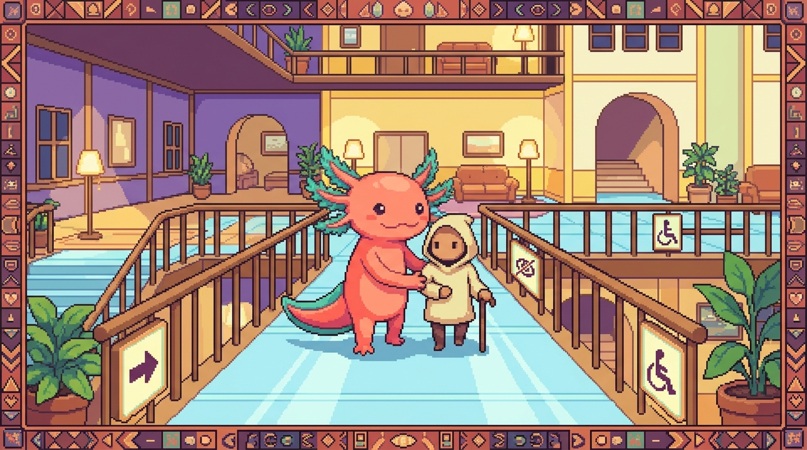

# Capítulo 10 — Accesibilidad y ARIA a fondo

<p align="center">
  
</p>


> En el capítulo anterior aprendiste a construir páginas con HTML semántico. Ahora vamos a por algo más: que tus páginas funcionen para **todas** las personas, también para quienes no ven la pantalla, no usan el ratón o no distinguen bien los colores. Bit, nuestro ajolote pixel art, lo resume sin rodeos: una web bonita que solo sirve para algunos no está terminada. La accesibilidad no es un adorno que se deja para el final; es parte de hacer bien tu trabajo. En las próximas páginas vas a conocer los lectores de pantalla, los roles ARIA, el foco del teclado, las "live regions" y el contraste de colores. Y vas a descubrir una regla de oro que te ahorrará un montón de líneas: si el HTML ya hace el trabajo, no uses ARIA.

## 1. ¿Para quién hacemos las páginas accesibles?

Cuando programas, es fácil imaginar a una sola persona usando tu página: alguien con buena vista, con ratón, frente a una pantalla grande. Pero la realidad es mucho más variada que eso. Hay personas que:

- No ven la pantalla y escuchan la página con un programa que la lee en voz alta.
- Ven poco y necesitan letras grandes o mucho contraste.
- No pueden usar el ratón y navegan **solo con el teclado**.
- No distinguen ciertos colores (por ejemplo, el rojo y el verde).
- Usan el teléfono con una mano, en la calle, con el sol pegando de lleno en la pantalla.

Y aquí va la buena noticia: casi todo lo que hace tu página accesible para alguien con una discapacidad **acaba mejorándola para el resto también**.

> ### 🟦 ¿Qué significa? — *Accesibilidad (a11y)*
> La **accesibilidad** consiste en construir páginas que cualquier persona pueda usar, sin importar sus capacidades ni el dispositivo que tenga delante. A veces verás la abreviatura **a11y**: es la palabra inglesa "accessibility", con sus 11 letras entre la "a" y la "y". Te sirve para llegar a más gente y, en muchos países, además es un requisito legal.
> **¿Dónde se usa en tu proyecto?** En **tunal-digital** (`sitio-web/index.html`), tu sitio público lo puede visitar cualquiera; hacerlo accesible significa que un cliente potencial que usa lector de pantalla también pueda leer tus servicios y escribirte.

> ### 🟦 ¿Qué significa? — *Lector de pantalla*
> Un **lector de pantalla** es un programa que lee en voz alta lo que hay en la pantalla, pensado para personas ciegas o con baja visión. La persona se mueve por la página con el teclado y el programa va anunciando lo que encuentra: "encabezado nivel 1, Tunal Digital", "enlace, Contacto", "botón, Enviar". Los más conocidos son **VoiceOver** (Mac/iPhone), **NVDA** y **JAWS** (Windows) y **TalkBack** (Android).
> **¿Dónde se usa en tu proyecto?** Cuando alguien abre **tunal-digital** con un lector de pantalla, el programa recorre tu `index.html` etiqueta por etiqueta. Si tu HTML está bien escrito, todo suena ordenado; si no, la persona escucha un revoltijo.

> ### 💡 Tip — Pruébalo tú mismo
> No hace falta instalar nada raro para empezar. En Mac, activas **VoiceOver** con `Cmd + F5`. En Windows, **NVDA** es gratuito. Cierra los ojos un minuto y recorre tu propia página solo con el teclado y el oído. Te vas a sorprender de lo que sale a la luz.

## 2. El árbol de accesibilidad: lo que "ve" el lector de pantalla

Tu navegador no se limita a dibujar la página. A la vez, construye una versión pensada para los programas de ayuda: una lista ordenada de elementos, cada uno con su **nombre**, su **rol** y su **estado**. Eso es el **árbol de accesibilidad**.

> ### 🟦 ¿Qué significa? — *Árbol de accesibilidad*
> El **árbol de accesibilidad** es la versión de tu página que el navegador le entrega a los lectores de pantalla. De cada elemento guarda tres cosas: su **rol** (qué es: botón, enlace, encabezado), su **nombre accesible** (cómo se llama: "Enviar", "Contacto") y su **estado** (cómo está: marcado, deshabilitado, expandido). Con esa información el lector de pantalla puede anunciar cada elemento como toca.

La clave está aquí: el lector de pantalla **no lee tu CSS bonito**. Lee este árbol. Por eso un `<div>` que parece un botón, porque le pusiste color y bordes con CSS, no es un botón para el árbol de accesibilidad: para él es solo "un grupo de texto". Y justo ahí empieza a cobrar sentido ARIA.

> ### 🟦 ¿Qué significa? — *Rol*
> El **rol** es la palabra que describe qué función cumple un elemento: botón, enlace, encabezado, lista, casilla de verificación, etc. Muchas etiquetas HTML ya traen un rol de serie: `<button>` tiene rol de botón, `<a href>` tiene rol de enlace y `<h1>` tiene rol de encabezado. Gracias a eso el lector de pantalla puede anunciar "botón" o "enlace" sin que tú hagas nada.

> ### 🟦 ¿Qué significa? — *Nombre accesible*
> El **nombre accesible** es el texto con el que el lector de pantalla identifica un elemento al leerlo en voz alta. En un botón suele ser su propio texto: `<button>Enviar</button>` se anuncia como "Enviar, botón". En una imagen, el nombre sale del atributo `alt`. Sirve para que la persona sepa qué hace cada cosa sin necesidad de verla.

## 3. ARIA: qué es y la regla de oro

> ### 🟦 ¿Qué significa? — *ARIA*
> **ARIA** son las siglas de "Accessible Rich Internet Applications" (Aplicaciones de Internet Ricas y Accesibles). Es un conjunto de atributos especiales que añades a tus etiquetas HTML para darle información extra al árbol de accesibilidad: por ejemplo `role="button"`, `aria-label="Cerrar"` o `aria-hidden="true"`. Sirve para describir componentes que el HTML por sí solo no alcanza a explicar.

ARIA tiene mucha fuerza, pero también una trampa que conviene tener clara: **ARIA no cambia cómo se ve ni cómo se comporta tu página; solo cambia lo que se le anuncia al lector de pantalla**. Si le pones `role="button"` a un `<div>`, el lector dirá "botón"… pero ese div no responderá a la tecla Enter ni se podrá enfocar con el teclado, salvo que tú lo programes a mano. Prometiste un botón y entregaste un disfraz.

Por eso existe la regla más importante de toda la accesibilidad web:

> ### ⚠️ Cuidado — La primera regla de ARIA: no uses ARIA
> Suena a chiste, pero es literal: **si ya existe un elemento HTML que hace lo que necesitas, úsalo en lugar de inventarlo con ARIA**. Un `<button>` de verdad ya es enfocable, ya responde a Enter y a Espacio y ya se anuncia como botón; todo eso, gratis. Un `<div role="button">` te obliga a reconstruir cada una de esas piezas a mano, y casi siempre acaba saliendo peor. ARIA es para cuando el HTML **no** tiene una solución, no para sustituir al HTML que sí la tiene.

> ### 🔎 En tu código
> En **tunal-digital**, si en `main.js` o en `index.html` te encuentras algo como `<div class="boton" onclick="...">`, cámbialo por `<button type="button">`. Ganas accesibilidad de teclado sin escribir una sola línea de ARIA. La misma idea vale para **RachaSimple**: en tus componentes `.tsx`, prefiere `<button>` antes que un `<div>` con `onClick`.

Un ejemplo de qué NO hacer y qué SÍ hacer:

```html
<!-- ❌ Mal: un div disfrazado de botón -->
<div class="btn" role="button" onclick="enviar()">Enviar</div>

<!-- ✅ Bien: el HTML ya lo resuelve todo -->
<button type="button" onclick="enviar()">Enviar</button>
```

Entonces, ¿cuándo sí toca usar ARIA? Cuando construyes cosas que el HTML no trae de serie (pestañas, ventanas emergentes, menús complejos), o cuando un elemento necesita un nombre que no aparece como texto visible. Vamos a verlo.

## 4. Dar nombre a las cosas: aria-label, aria-labelledby, aria-describedby

A veces un control no tiene texto visible. El caso de manual: un botón con solo un icono.

```html
<!-- Un botón de cerrar con una "X" -->
<button type="button">✕</button>
```

El lector de pantalla anunciaría "equis, botón", o directamente nada útil. Hace falta darle un nombre claro.

> ### 🟦 ¿Qué significa? — *aria-label*
> `aria-label` es un atributo que le pone a un elemento un **nombre accesible escrito por ti, directamente**. No se ve en pantalla; solo lo oye el lector de pantalla. Es perfecto para botones de solo icono, enlaces sin texto o controles donde el texto visible no es suficiente.
> **¿Dónde se usa en tu proyecto?** En **tunal-digital**, si tienes un icono de menú "hamburguesa" (las tres rayitas) que abre la navegación, ponle `aria-label="Abrir menú"` para que el lector lo anuncie con sentido.

```html
<!-- ✅ Ahora el lector dice "Cerrar, botón" -->
<button type="button" aria-label="Cerrar">✕</button>
```

> ### 🟦 ¿Qué significa? — *aria-labelledby*
> `aria-labelledby` toma el nombre accesible de **otro elemento que ya está en la página**, señalándolo por su `id`. En vez de volver a escribir el texto, "apuntas" a uno que ya existe. Así no repites contenido y el nombre se mantiene en sintonía con lo que se ve en pantalla.

```html
<!-- El nombre de la sección viene del h2 con id="titulo-servicios" -->
<section aria-labelledby="titulo-servicios">
  <h2 id="titulo-servicios">Nuestros servicios</h2>
  <p>Diseño web, automatización y más.</p>
</section>
```

> ### 🟦 ¿Qué significa? — *aria-describedby*
> `aria-describedby` añade una **descripción extra**; no el nombre, sino una explicación de apoyo que apunta al `id` de otro elemento. Viene de perlas para asociar a un campo de formulario el texto que explica su formato o un mensaje de error.

```html
<label for="email">Correo</label>
<input id="email" type="email" aria-describedby="ayuda-email" />
<p id="ayuda-email">Usaremos tu correo solo para responderte.</p>
```

Cuando la persona llega al campo, el lector anuncia: "Correo, campo de texto, Usaremos tu correo solo para responderte". El nombre viene del `<label>`; la descripción, del `aria-describedby`.

> ### 💡 Tip — Diferencia rápida
> `aria-label` = escribes el nombre a mano. `aria-labelledby` = el nombre lo pone otro elemento de la página. `aria-describedby` = información de apoyo, no el nombre principal. Y si dudas entre label y labelledby, quédate con esto: si el texto ya está visible en la página, tira de `labelledby` para no duplicarlo.

## 5. Esconder cosas del lector: aria-hidden

A veces quieres que algo se vea en pantalla pero que el lector de pantalla lo **ignore**. El caso más habitual: iconos decorativos que no aportan ninguna información.

> ### 🟦 ¿Qué significa? — *aria-hidden*
> `aria-hidden="true"` le dice al lector de pantalla: "ignora este elemento y todo lo que lleve dentro". El elemento **se sigue viendo** en la pantalla; simplemente no se anuncia. Es ideal para iconos decorativos o para textos duplicados que solo añadirían ruido a quien escucha.

```html
<!-- El emoji es decorativo; el texto ya lo explica -->
<button type="button">
  <span aria-hidden="true">🚀</span>
  Lanzar proyecto
</button>
```

Aquí el lector dice solo "Lanzar proyecto, botón", sin pararse a describir el cohete.

> ### ⚠️ Cuidado — Nunca escondas algo que el usuario necesita
> No le pongas `aria-hidden="true"` a un botón, un enlace o un campo de formulario que sí cumple una función. Si lo haces, las personas que usan lector de pantalla **no podrán usarlo**: para ellas, sencillamente no existe. Y ojo con otra trampa: nunca pongas `aria-hidden="true"` en un elemento que contenga algo enfocable con el teclado, porque se crea una situación de lo más confusa (el teclado llega ahí, pero el lector insiste en que no hay nada).

## 6. Foco y orden de tabulación

> ### 🟦 ¿Qué significa? — *Foco*
> El **foco** es el elemento que está "seleccionado" ahora mismo y que recibirá lo que escribas o la tecla que pulses. Cuando navegas con el teclado, el foco va saltando de un control a otro. Normalmente se reconoce por un borde o un resaltado alrededor del elemento. Te sirve para saber dónde estás dentro de la página sin tocar el ratón.

> ### 🟦 ¿Qué significa? — *Orden de tabulación*
> El **orden de tabulación** es la secuencia en la que el foco va saltando cada vez que pulsas la tecla **Tab**. Por defecto sigue el orden en que escribiste los elementos en el HTML, de arriba abajo. Gracias a él, la navegación con teclado resulta lógica y previsible.

La prueba de accesibilidad más rápida que existe: pulsa **Tab** varias veces en tu página y mira con atención. ¿El foco salta de un sitio lógico al siguiente? ¿Se ve con claridad dónde está? ¿Llegas a todos los botones y enlaces?

> ### 🟦 ¿Qué significa? — *tabindex*
> `tabindex` es un atributo que controla si un elemento puede recibir foco con el teclado y en qué orden. Sus dos valores útiles son `tabindex="0"` (el elemento entra en el orden normal de tabulación) y `tabindex="-1"` (no se llega con Tab, pero sí puedes enfocarlo desde JavaScript). Es para casos especiales; con un HTML bien hecho, casi nunca lo vas a necesitar.

> ### ⚠️ Cuidado — Huye de tabindex con números positivos
> Por ahí te toparás con cosas como `tabindex="3"`. **Esquívalas.** Los números positivos imponen un orden artificial que casi siempre rompe la lógica natural de la página y luego es un infierno de mantener. Si necesitas otro orden, reordena el HTML. Limítate a `tabindex="0"` o `tabindex="-1"`.

> ### 🟦 ¿Qué significa? — *:focus-visible*
> `:focus-visible` es un "selector" de CSS (una forma de apuntar a elementos para darles estilo) que se aplica solo cuando el navegador considera que mostrar el foco **ayuda de verdad**: normalmente cuando la persona navega con teclado, y no cuando hace clic con el ratón. Sirve para dibujar un borde de foco claro y bonito para quien usa teclado, sin que aparezca un recuadro "molesto" cada vez que alguien hace clic. Es la forma moderna y recomendada de estilizar el foco.

> ### 🟦 ¿Qué significa? — *outline (contorno)*
> El **outline** ("contorno" en inglés) es una línea que el navegador dibuja **alrededor** de un elemento cuando recibe el foco. Es justo esa pista visual que le dice a quien usa teclado "estás aquí". Por defecto suele ser un borde azul o punteado. No lo confundas con `border`: el outline no ocupa espacio ni desplaza el resto de la página. Su trabajo principal es marcar el foco; por eso nunca debes hacerlo desaparecer sin poner otra cosa en su lugar.

> ### 💡 Tip — No borres el contorno del foco
> En CSS es tentador escribir `outline: none` porque el borde azul "afea" el botón. Pero si lo haces, dejas a quien navega con teclado sin pista alguna de dónde está el foco. Si no te gusta el estilo por defecto, **cámbialo** por uno bonito (con `:focus-visible`); no lo elimines. En **tunal-digital**, échale un ojo a tu `styles.css` por si se ha colado algún `outline: none` huérfano.

```css
/* En tu styles.css de tunal-digital: un foco visible y con estilo */
:focus-visible {
  outline: 3px solid #2563eb;
  outline-offset: 2px;
}
```

## 7. Skip links: saltar lo repetitivo

Imagina que tu página tiene arriba un menú con 10 enlaces, repetido en todas las secciones. Una persona con lector de pantalla tendría que escuchar esos 10 enlaces **en cada página** antes de llegar al contenido. Agotador. La solución es un **enlace de salto**.

> ### 🟦 ¿Qué significa? — *Skip link (enlace de salto)*
> Un **skip link** es un enlace, casi siempre el primero de la página, que permite **saltar directo al contenido principal** sin recorrer el menú. Suele estar oculto y solo aparece cuando recibe el foco con Tab. Les ahorra la navegación repetitiva a quienes se mueven con teclado o con lector de pantalla.
> **¿Dónde se usa en tu proyecto?** En **tunal-digital**, añadir un skip link al principio de `index.html` hace que un visitante con teclado llegue a tus servicios en un solo Tab, en lugar de recorrer todo el encabezado.

```html
<body>
  <a class="skip-link" href="#contenido">Saltar al contenido</a>

  <header>
    <nav><!-- muchos enlaces aquí --></nav>
  </header>

  <main id="contenido">
    <h1>Tunal Digital</h1>
    <!-- ... -->
  </main>
</body>
```

```css
/* Oculto hasta que recibe foco */
.skip-link {
  position: absolute;
  left: -9999px;
}
.skip-link:focus {
  left: 1rem;
  top: 1rem;
}
```

Fíjate en un detalle que importa: el skip link apunta a `#contenido`, y ese `id="contenido"` vive en `<main>`. El destino del salto tiene que existir; si no, el enlace no lleva a ninguna parte.

## 8. Live regions: anunciar cambios sin recargar

Aquí entramos en la parte "rica" de ARIA, la que el HTML por sí solo no resuelve. Imagina que en tunal-digital pulsas "Enviar" en el formulario de contacto y, gracias a JavaScript, aparece un mensaje "Mensaje enviado con éxito" sin que la página se recargue. Quien ve, lo lee al instante. Pero quien usa un lector de pantalla… no se entera, porque su foco sigue parado en el botón. El cambio ocurrió en otra zona de la pantalla y nadie se lo anunció.

> ### 🟦 ¿Qué significa? — *Live region (región dinámica)*
> Una **live region** es una zona de la página marcada con `aria-live` para que el lector de pantalla **anuncie por su cuenta** cualquier cambio de texto que ocurra dentro de ella, sin que la persona tenga que ir a buscarlo. Es la pieza ideal para mensajes que aparecen solos: confirmaciones, errores, notificaciones, resultados de una búsqueda.
> **¿Dónde se usa en tu proyecto?** En **tunal-digital**, cuando `main.js` muestra "Mensaje enviado", una live region hace que el lector lo lea en voz alta. En **Faro** (Organizer), cuando termina el análisis con IA y aparece "Análisis completado", una live region avisa sin que el usuario tenga que andar rastreando el cambio.

```html
<!-- Esta zona empieza vacía; JavaScript escribirá dentro -->
<p id="estado-form" aria-live="polite"></p>
```

```javascript
// En main.js, tras enviar el formulario:
document.getElementById("estado-form").textContent = "Mensaje enviado con éxito.";
// El lector de pantalla lo anunciará solo.
```

> ### 🟦 ¿Qué significa? — *aria-live*
> `aria-live` es el atributo que convierte una zona normal de la página en una **live region**. Lo escribes con un valor que indica la urgencia: `aria-live="polite"` o `aria-live="assertive"`. A partir de ahí, cada vez que cambie el texto dentro de esa zona, el lector de pantalla lo anunciará por su cuenta. Así, quienes no ven la pantalla se enteran de los mensajes que aparecen sin recargar.

El valor de `aria-live` marca la urgencia:

- `aria-live="polite"`: el lector lo dice **cuando termine** lo que estaba diciendo. Es lo ideal para confirmaciones y para la mayoría de los casos.
- `aria-live="assertive"`: el lector **interrumpe** lo que estaba diciendo para anunciarlo ya mismo. Resérvalo para errores urgentes.

> ### ⚠️ Cuidado — assertive con moderación
> Usar `assertive` para todo es como hablar siempre a gritos: cansa y confunde. Interrumpir al usuario una y otra vez resulta molesto. Tira de `polite` casi siempre y deja `assertive` solo para esos errores que de verdad no pueden esperar.

> ### 💡 Tip — La región debe existir desde el principio
> La live region tiene que estar **ya en el HTML** (aunque sea vacía) antes de que cambies su contenido. Si creas el `<p aria-live>` y le metes texto en el mismo instante, muchos lectores no llegan a anunciarlo. El truco: deja el contenedor vacío en tu HTML y luego escribe dentro de él.

## 9. Formularios accesibles

Los formularios son donde más se nota una accesibilidad buena (o mala), porque la persona tiene que entender qué le piden y en qué se equivocó. Con tres reglas cubres casi todo:

**1. Toda entrada necesita su `<label>`.** Ya lo viste en el capítulo de formularios, pero aquí es de vida o muerte. El `<label>` con su `for` conectado al `id` del campo es lo que da el nombre accesible.

```html
<label for="nombre">Tu nombre</label>
<input id="nombre" type="text" />
```

**2. Marca lo obligatorio de forma clara, no solo con un asterisco rojo.** El color por sí solo no basta (acuérdate de quien no distingue colores). Usa el atributo `required`, que de paso el lector anuncia.

```html
<label for="correo">Correo (obligatorio)</label>
<input id="correo" type="email" required />
```

**3. Los errores deben ir pegados al campo.** No vale con poner el error en rojo arriba del todo. Conéctalo con `aria-describedby` y, si quieres, marca el campo como inválido con `aria-invalid`.

> ### 🟦 ¿Qué significa? — *aria-invalid*
> `aria-invalid="true"` marca un campo de formulario como **incorrecto**. El lector de pantalla lo anuncia ("entrada inválida") para que la persona sepa que ese campo concreto tiene un problema. Sirve para enlazar el error con el campo exacto, y no dejarlo como un mensaje suelto por ahí.

```html
<label for="tel">Teléfono</label>
<input id="tel" type="tel" aria-invalid="true" aria-describedby="error-tel" />
<p id="error-tel">Escribe un número de 10 dígitos.</p>
```

> ### 🔎 En tu código
> En **RachaSimple** (componentes `.tsx`) y en **Faro**, donde tengas formularios de inicio de sesión o de datos, asegúrate de que cada `<input>` lleve su `<label>` real y de que los mensajes de error se conecten con `aria-describedby`. Es de los cambios de accesibilidad con más impacto y menos esfuerzo que existen.

## 10. Contraste WCAG: que el texto se pueda leer

De nada sirve un texto perfecto si nadie lo puede leer porque es gris claro sobre fondo blanco. El contraste es la diferencia de luz entre el texto y su fondo.

> ### 🟦 ¿Qué significa? — *WCAG*
> **WCAG** son las siglas de "Web Content Accessibility Guidelines" (Pautas de Accesibilidad para el Contenido Web). Es el estándar internacional que define cómo hacer la web accesible: incluye reglas medibles sobre contraste, teclado, textos alternativos y mucho más. Es la referencia oficial; cuando alguien dice "cumple WCAG AA", se refiere a este estándar.

> ### 🟦 ¿Qué significa? — *Ratio de contraste*
> El **ratio de contraste** es un número que mide cuánto se diferencia el texto de su fondo. Va desde 1:1 (texto invisible, del mismo color que el fondo) hasta 21:1 (negro puro sobre blanco puro). WCAG pide al menos **4.5:1** para texto normal y **3:1** para texto grande. Es lo que garantiza que el texto se lea bajo el sol, con poca vista o en una pantalla barata.
> **¿Dónde se usa en tu proyecto?** En **tunal-digital**, repasa en `styles.css` los colores del texto sobre los fondos de color de marca; algún gris "elegante" puede quedarse por debajo de 4.5:1 y costarte lectores de verdad.

> ### 💡 Tip — Cómo medir el contraste
> No lo adivines. Las herramientas de desarrollo del navegador (clic derecho → Inspeccionar) te muestran el ratio de contraste de cualquier texto. También hay verificadores en línea donde pegas los dos colores y te dicen si pasa AA. Apunta a 4.5:1 o más para el texto de tamaño normal.

> ### ⚠️ Cuidado — El color no puede ser la única pista
> Si un enlace solo se distingue del texto normal porque es azul, quien no ve bien los colores no lo notará. Añade siempre una segunda señal: subrayado en los enlaces, un icono junto al error, la palabra "obligatorio" además del asterisco. La regla es simple: **no comuniques nada solo con color**.

## 11. Juntando todo: un fragmento accesible de tunal-digital

Veamos cómo queda un trozo de `index.html` aplicando casi todo lo del capítulo:

```html
<body>
  <a class="skip-link" href="#contenido">Saltar al contenido</a>

  <header>
    <nav aria-label="Principal">
      <button type="button" aria-label="Abrir menú">
        <span aria-hidden="true">☰</span>
      </button>
      <a href="#servicios">Servicios</a>
      <a href="#contacto">Contacto</a>
    </nav>
  </header>

  <main id="contenido">
    <h1>Tunal Digital</h1>

    <section aria-labelledby="titulo-contacto">
      <h2 id="titulo-contacto">Contacto</h2>

      <form>
        <label for="nombre">Tu nombre (obligatorio)</label>
        <input id="nombre" type="text" required />

        <label for="correo">Correo</label>
        <input id="correo" type="email" aria-describedby="ayuda-correo" />
        <p id="ayuda-correo">Te responderemos por aquí.</p>

        <button type="submit">Enviar</button>
      </form>

      <p id="estado-form" aria-live="polite"></p>
    </section>
  </main>
</body>
```

Fíjate en cuántas piezas están trabajando juntas: skip link, `nav` con nombre, botón de icono etiquetado, emoji oculto al lector, sección nombrada por su título, labels reales, ayuda asociada y una live region lista para anunciar el resultado. Y casi todo es HTML normal y corriente: muy poco ARIA, justo en los puntos donde el HTML no llegaba.

## ✅ Checklist — ¿ya domino esto?

- [ ] Entiendo qué hace un lector de pantalla y qué es el árbol de accesibilidad.
- [ ] Sé qué son rol, nombre accesible y estado de un elemento.
- [ ] Conozco la regla de oro: si el HTML ya lo hace, no uso ARIA.
- [ ] Sé usar `aria-label`, `aria-labelledby` y `aria-describedby`, y distingo cuándo cada uno.
- [ ] Sé cuándo usar `aria-hidden="true"` y qué NUNCA debo esconder.
- [ ] Puedo recorrer mi página con Tab y verificar el orden y la visibilidad del foco.
- [ ] Entiendo `tabindex="0"` y `tabindex="-1"`, y evito los números positivos.
- [ ] Sé añadir un skip link que apunte a un destino real.
- [ ] Entiendo las live regions y la diferencia entre `polite` y `assertive`.
- [ ] Hago formularios con label real, `required` y errores conectados con `aria-describedby`.
- [ ] Sé que el texto necesita al menos 4.5:1 de contraste y que el color no puede ser la única pista.

## 🧪 Ejercicios

1. **Sin computadora.** Explica con tus palabras, como si se lo contaras a un amigo, por qué un `<div role="button">` es peor que un `<button>` de verdad. Menciona al menos dos cosas que el `<button>` da gratis.

2. **Sin computadora.** Para cada caso, decide qué usarías y por qué: (a) un botón con solo un icono de papelera; (b) una sección cuyo título ya está en un `<h2>` visible; (c) un campo de contraseña que necesita la nota "mínimo 8 caracteres". Elige entre `aria-label`, `aria-labelledby` y `aria-describedby`.

3. **💻 En la computadora.** Abre tu `index.html` de **tunal-digital** y recórrelo entero solo con la tecla **Tab**, sin tocar el ratón. Anota: ¿se ve siempre dónde está el foco? ¿Hay algún botón o enlace al que no puedas llegar? Corrige al menos un problema que encuentres.

4. **💻 En la computadora.** Añade a tu `index.html` un **skip link** "Saltar al contenido" al principio del `<body>`, con su CSS para que se oculte y aparezca al recibir foco, y un `id="contenido"` en tu `<main>`. Pruébalo con Tab: el primer Tab debe mostrar el enlace y, al pulsar Enter, saltar al contenido.

5. **💻 En la computadora.** Crea una **live region** vacía con `aria-live="polite"` cerca de tu formulario de contacto y, desde `main.js`, escribe dentro "Mensaje enviado con éxito" al enviar. Si tienes un lector de pantalla a mano (VoiceOver o NVDA), comprueba que lo anuncia solo.

6. **💻 En la computadora.** Usa las herramientas de desarrollo del navegador (Inspeccionar) para medir el **contraste** de tres textos de tu sitio. Apunta el ratio de cada uno. Si alguno está por debajo de 4.5:1, ajusta el color en `styles.css` hasta que pase.
