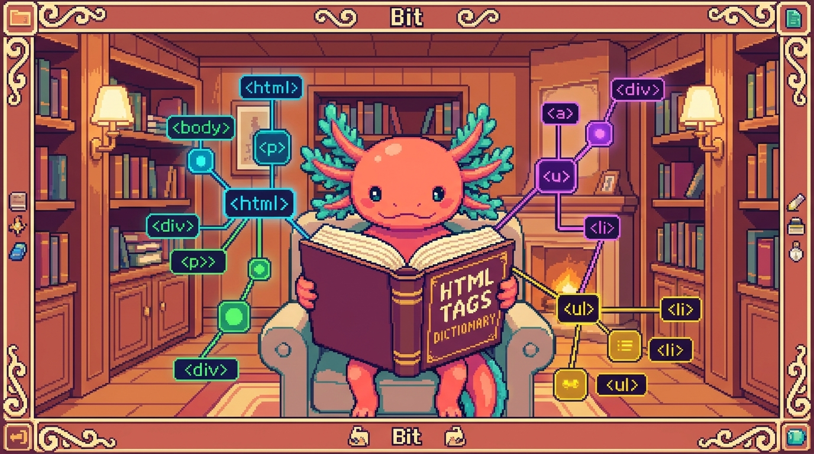

# Capítulo 15 — Glosario de HTML y mapa del módulo

<p align="center">
  
</p>


> ¡Felicidades! Llegaste al último capítulo del Módulo 01. A lo largo de estas páginas aprendiste muchísimas palabras nuevas, y es normal que algunas se mezclen en tu cabeza como fichas de un juego que todavía estás aprendiendo a ordenar. Este capítulo es un **diccionario** y un **mapa**: aquí están todos los términos del módulo, ordenados de la A a la Z, con definiciones cortitas que puedes consultar cuando algo se te olvide. Bit, el ajolote pixel art, se trae sus gafas de lectura para guiarte en este repaso final. No vamos a inventar conceptos nuevos: vamos a juntar todo lo que ya sabes y a ver cómo encaja. Respira tranquilo, este capítulo es para celebrar lo aprendido.

## 1. ¿Para qué sirve un glosario?

Cuando aprendes un oficio nuevo, las palabras técnicas son como las llaves de una casa. Si no sabes qué abre cada llave, te quedas en la puerta. Un **glosario** es simplemente una lista de palabras con su significado, ordenadas alfabéticamente para que las encuentres rápido.

> ### 🟦 ¿Qué significa? — *Glosario*
> Una lista ordenada de palabras técnicas con su definición corta. Sirve para consultar el significado de un término sin tener que releer todo el manual. Piénsalo como el índice de palabras al final de un libro de cocina.

A lo largo del módulo trabajaste sobre todo con un proyecto real: **tunal-digital**, un sitio web hecho con HTML, CSS y JavaScript "vanilla" (es decir, sin frameworks), que vive en archivos como `sitio-web/index.html`, `styles.css` y `main.js`. Cada vez que en este glosario veas "¿Dónde se usa en tu proyecto?", estaremos señalando dónde aparece ese concepto en código de verdad, casi siempre en ese `index.html`.

> ### 💡 Tip — Cómo usar este capítulo
> No lo leas de corrido como una novela. Léelo una vez completo para refrescar, y luego déjalo abierto como pestaña de consulta mientras programas. Cuando una palabra se te escape, vuelve aquí.

## 2. Glosario alfabético de HTML

Aquí están, en orden de la A a la Z, los términos que viste en el módulo. Cada uno trae una definición de una o dos líneas y, cuando aplica, dónde lo viste en tu propio código.

### A

> ### 🟦 ¿Qué significa? — *Ancla / Enlace (`<a>`)*
> La etiqueta `<a>` crea un enlace: un texto o imagen en el que se puede hacer clic para ir a otra página o a otra parte del documento. "Ancla" viene del inglés *anchor*. Sirve para conectar el sitio con el resto de la web. Necesita el atributo `href` para saber a dónde lleva.
> **¿Dónde se usa en tu proyecto?** Cada vez que en `index.html` de tunal-digital escribes un enlace del menú o un botón "Visítanos", usas un `<a>`.

```html
<a href="#contacto">Contáctanos</a>
```

> ### 🟦 ¿Qué significa? — *Anidar*
> Meter un elemento dentro de otro, como muñecas rusas. Sirve para construir estructuras: una lista contiene elementos de lista, una sección contiene párrafos. La etiqueta de adentro se cierra antes que la de afuera.

> ### 🟦 ¿Qué significa? — *ARIA*
> Un conjunto de atributos (que empiezan por `aria-`) que dan información extra a los lectores de pantalla. Sirve para que personas con discapacidad visual entiendan partes de la página que el HTML normal no explica bien.
> **¿Dónde se usa en tu proyecto?** En tunal-digital puedes añadir `aria-label="Menú principal"` a la barra de navegación de `index.html` para que un lector de pantalla la anuncie con claridad.

> ### 🟦 ¿Qué significa? — *Atributo*
> Información extra que se escribe dentro de la etiqueta de apertura, con la forma `nombre="valor"`. Sirve para configurar un elemento: a dónde lleva un enlace, qué imagen mostrar, qué idioma usa la página.
> **¿Dónde se usa en tu proyecto?** El `href` de un enlace y el `src` de una imagen en `index.html` son atributos.

```html
<a href="https://tunal.digital" class="boton">Visítanos</a>
```

En esa línea, `href` y `class` son atributos del elemento `<a>`.

### B

> ### 🟦 ¿Qué significa? — *Bloque (elemento de bloque)*
> Un elemento que, por defecto, ocupa todo el ancho disponible y empieza en una línea nueva. Sirve para estructurar grandes piezas de contenido. Ejemplos: `<div>`, `<p>`, `<section>`.

> ### 🟦 ¿Qué significa? — *Body*
> La etiqueta `<body>` contiene todo lo que el visitante VE en la página: textos, imágenes, botones. Sirve para separar el contenido visible de la configuración interna (que va en el `<head>`).
> **¿Dónde se usa en tu proyecto?** Todo el contenido visible de la página de tunal-digital vive dentro del `<body>` de `index.html`.

### C

> ### 🟦 ¿Qué significa? — *class (atributo)*
> El atributo `class` le pone una "etiqueta de grupo" a un elemento para que CSS o JavaScript puedan encontrarlo y darle estilo o comportamiento. Sirve para reutilizar el mismo aspecto en muchos elementos: todos los que tengan `class="boton"` se verán igual. Un mismo elemento puede pertenecer a varias clases a la vez.
> **¿Dónde se usa en tu proyecto?** En tunal-digital, cuando en `index.html` escribes `class="boton"`, tu `styles.css` usa ese nombre para pintar el botón con los colores de la marca.

> ### 🟦 ¿Qué significa? — *Comentario*
> Texto que escribes dentro de `<!-- -->` y que el navegador ignora. Sirve para dejarte notas a ti mismo o a otros programadores sin que aparezcan en la página.

```html
<!-- Aquí empieza la sección de servicios -->
```

> ### 🟦 ¿Qué significa? — *Contenedor*
> Un elemento cuyo trabajo es agrupar otros elementos, normalmente un `<div>` o una etiqueta semántica. Sirve para organizar y dar estilo a un grupo de cosas como una sola unidad.

### D

> ### 🟦 ¿Qué significa? — *DOCTYPE*
> La línea `<!DOCTYPE html>` que va al principio de todo archivo HTML. Sirve para decirle al navegador "esto es HTML moderno, muéstralo con las reglas actuales".
> **¿Dónde se usa en tu proyecto?** Es la primerísima línea de `index.html` en tunal-digital.

> ### 🟦 ¿Qué significa? — *DOM*
> Significa "Document Object Model". Es la versión del HTML que el navegador arma en su memoria como un árbol de elementos. Sirve para que JavaScript pueda leer y cambiar la página mientras el usuario la usa.
> **¿Dónde se usa en tu proyecto?** Tu `main.js` en tunal-digital toca el DOM cada vez que cambia un texto o muestra una respuesta de la API de Claude en la pantalla.

> ### 🟦 ¿Qué significa? — *div*
> La etiqueta `<div>` es un contenedor genérico, sin significado propio. Sirve para agrupar elementos cuando ninguna etiqueta semántica encaja mejor.

### E

> ### 🟦 ¿Qué significa? — *Elemento*
> El conjunto completo de una etiqueta de apertura, su contenido y su etiqueta de cierre. Por ejemplo, `<p>Hola</p>` es un elemento párrafo. Sirve como la pieza básica con la que se construye toda la página.

> ### 🟦 ¿Qué significa? — *Entidad (entidad HTML)*
> Un código especial que empieza con `&` y termina con `;` para escribir símbolos que el HTML usa para otra cosa. Sirve para mostrar caracteres como `<`, `>` o `&` sin confundir al navegador. Por ejemplo, `&amp;` muestra `&` y `&lt;` muestra `<`.

```html
<p>Diseño &amp; desarrollo web</p>
```

> ### 🟦 ¿Qué significa? — *Etiqueta (tag)*
> El texto entre `<` y `>` que marca el inicio o el fin de un elemento, como `<p>` (apertura) y `</p>` (cierre). Sirve para decirle al navegador qué tipo de contenido viene.
> **¿Dónde se usa en tu proyecto?** Cada línea de `index.html` está hecha de etiquetas.

> ### ⚠️ Cuidado — Etiqueta no es lo mismo que elemento
> Mucha gente los usa como sinónimos, pero no lo son. La **etiqueta** es solo la marca (`<p>`). El **elemento** es la marca de apertura, el contenido y la marca de cierre juntos (`<p>Hola</p>`). Tener clara esta diferencia te ahorra confusiones más adelante.

### F

> ### 🟦 ¿Qué significa? — *Formulario*
> La etiqueta `<form>` agrupa campos donde el usuario escribe o elige datos para enviarlos. Sirve para recoger información: un nombre, un correo, un mensaje de contacto.
> **¿Dónde se usa en tu proyecto?** Si tunal-digital tiene una sección de contacto en `index.html`, sus campos van dentro de un `<form>`.

### H

> ### 🟦 ¿Qué significa? — *html (etiqueta raíz) y `lang`*
> La etiqueta `<html>` es la raíz del documento: dentro de ella vive todo lo demás (el `<head>` y el `<body>`). Su atributo `lang` indica el idioma de la página, por ejemplo `lang="es"` para español. Sirve para que buscadores y lectores de pantalla sepan en qué idioma leer.
> **¿Dónde se usa en tu proyecto?** En `index.html` de tunal-digital, la segunda línea es `<html lang="es">`, justo después del `<!DOCTYPE html>`.

> ### 🟦 ¿Qué significa? — *Head*
> La etiqueta `<head>` contiene la configuración de la página que el visitante NO ve directamente: el título de la pestaña, los metadatos, los enlaces a hojas de estilo. Sirve para preparar la página antes de mostrarla.
> **¿Dónde se usa en tu proyecto?** En `index.html`, el `<head>` enlaza tu `styles.css` y define el título del sitio.

> ### 🟦 ¿Qué significa? — *Heading (encabezado h1–h6)*
> Las etiquetas `<h1>` a `<h6>` son títulos y subtítulos, de mayor a menor importancia. Sirven para organizar el contenido por jerarquía. El `<h1>` es el título principal; debería haber solo uno por página.

> ### 🟦 ¿Qué significa? — *href*
> El atributo que indica a dónde lleva un enlace `<a>`. Sirve para conectar páginas entre sí o saltar a otra parte del documento. Viene de "hypertext reference".

### I

> ### 🟦 ¿Qué significa? — *id (atributo)*
> El atributo `id` le da a un elemento un nombre único en toda la página, como un número de cédula: no puede repetirse. Sirve para apuntar a ese elemento exacto desde CSS, desde JavaScript o desde un enlace con `href="#nombre"`. Se diferencia de `class` en que `class` puede repetirse y `id` no.
> **¿Dónde se usa en tu proyecto?** En el formulario de contacto de tunal-digital, el `<input id="correo">` se conecta con su `<label for="correo">` gracias a ese `id`.

> ### 🟦 ¿Qué significa? — *img*
> La etiqueta `` muestra una imagen. Sirve para insertar fotos, logos o ilustraciones. Necesita el atributo `src` (de dónde sacar la imagen) y `alt` (texto descriptivo).

```html

```

> ### 🟦 ¿Qué significa? — *Input*
> La etiqueta `<input>` es un campo donde el usuario escribe o elige un dato dentro de un formulario. Sirve para recoger texto, correos, contraseñas, casillas, etc. Su atributo `type` define qué clase de campo es.
> **¿Dónde se usa en tu proyecto?** Un campo de correo en el formulario de contacto de tunal-digital sería `<input type="email">`.

### L

> ### 🟦 ¿Qué significa? — *Label*
> La etiqueta `<label>` es la etiqueta de texto que acompaña a un campo de formulario y explica qué se debe escribir. Sirve para que el usuario (y los lectores de pantalla) sepan para qué es cada campo. Se conecta al campo con el atributo `for`.

```html
<label for="correo">Tu correo</label>
<input id="correo" type="email">
```

> ### 💡 Tip — Label siempre acompaña al input
> Un campo sin `<label>` es como una caja sin etiqueta: nadie sabe qué meter ahí. Conectar `for` (del label) con `id` (del input) hace tu formulario accesible y profesional.

> ### 🟦 ¿Qué significa? — *Lista*
> Las etiquetas `<ul>` (lista sin orden, con viñetas) y `<ol>` (lista ordenada, con números) agrupan elementos `<li>`. Sirven para enumerar cosas: servicios, pasos, características.

### M

> ### 🟦 ¿Qué significa? — *Meta (etiqueta meta)*
> La etiqueta `<meta>` va en el `<head>` y da información sobre la página: su codificación de caracteres, su descripción para buscadores, cómo se ve en móviles. Sirve para que navegadores y buscadores entiendan el documento.
> **¿Dónde se usa en tu proyecto?** El `<meta charset="UTF-8">` y el `<meta name="viewport">` están en el `<head>` de `index.html`.

```html
<meta charset="UTF-8">
<meta name="viewport" content="width=device-width, initial-scale=1.0">
```

### N

> ### 🟦 ¿Qué significa? — *nav*
> La etiqueta `<nav>` marca una zona de navegación, normalmente el menú principal con enlaces. Sirve para que navegadores y lectores de pantalla identifiquen el menú del sitio.
> **¿Dónde se usa en tu proyecto?** El menú superior de tunal-digital en `index.html` debería ir dentro de un `<nav>`.

### P

> ### 🟦 ¿Qué significa? — *Párrafo (`<p>`)*
> La etiqueta `<p>` marca un párrafo: un bloque de texto normal. Sirve para escribir frases y descripciones; el navegador deja un espacio antes y después de cada párrafo para que el texto respire. Es el elemento de texto más común de toda página.
> **¿Dónde se usa en tu proyecto?** Cada descripción de servicio de tunal-digital en `index.html` va dentro de un `<p>`.

### S

> ### 🟦 ¿Qué significa? — *script*
> La etiqueta `<script>` carga o contiene código JavaScript dentro de la página. Sirve para darle comportamiento al sitio: responder a clics, validar formularios, pedir datos a una API. Suele ir al final del `<body>` para que el HTML cargue primero.
> **¿Dónde se usa en tu proyecto?** En `index.html` de tunal-digital, un `<script src="main.js">` enlaza tu archivo de JavaScript con la página.

> ### 🟦 ¿Qué significa? — *Semántico (HTML semántico)*
> Usar etiquetas cuyo nombre describe su contenido (`<header>`, `<nav>`, `<main>`, `<footer>`) en vez de `<div>` para todo. Sirve para que el código sea más claro, accesible y mejor entendido por buscadores.
> **¿Dónde se usa en tu proyecto?** Estructurar `index.html` con `<header>`, `<main>` y `<footer>` en lugar de muchos `<div>` hace tunal-digital más semántico.

> ### 🟦 ¿Qué significa? — *src*
> El atributo que indica la fuente (la ubicación) de un recurso como una imagen o un script. Sirve para decirle al navegador de dónde cargar ese archivo. Viene de "source".

### T

> ### 🟦 ¿Qué significa? — *Título (`<title>`)*
> La etiqueta `<title>` va dentro del `<head>` y define el nombre que aparece en la pestaña del navegador y en los resultados de búsqueda. Sirve para que el visitante y los buscadores sepan de qué trata la página. No se ve dentro del contenido, solo en la pestaña.
> **¿Dónde se usa en tu proyecto?** En `index.html` de tunal-digital, el `<title>` es el texto que se lee en la pestaña cuando abres el sitio.

> ### 🟦 ¿Qué significa? — *type*
> Un atributo que define el tipo de algo. En un `<input>`, indica si es texto, correo, contraseña o botón. Sirve para que el navegador ofrezca el teclado y la validación correctos.

### V

> ### 🟦 ¿Qué significa? — *Vanilla (HTML/CSS/JS "vanilla")*
> "Vanilla" significa usar HTML, CSS y JavaScript puros, sin frameworks ni librerías extra que escriban el código por ti. Sirve para entender bien los fundamentos: lo que aprendes en este módulo es exactamente "HTML vanilla".
> **¿Dónde se usa en tu proyecto?** tunal-digital está hecho con tecnología vanilla: `index.html`, `styles.css` y `main.js` sin frameworks, justo lo contrario de RachaSimple o Faro, que sí usan React.

### Bit te recuerda

> ### 🔎 En tu código
> Si abres `sitio-web/index.html` de tunal-digital, casi todo lo que ves está en este glosario: el `<!DOCTYPE html>` al inicio, el `<head>` con sus `<meta>`, el `<body>` con `<nav>`, encabezados, párrafos, imágenes y quizá un `<form>`. Léelo de arriba a abajo nombrando cada pieza. Si puedes nombrarlas, ya dominas el módulo.

## 3. Mapa mental: cómo se conecta todo

Las palabras sueltas no sirven de mucho si no ves cómo encajan. Aquí tienes un mapa que conecta los grandes temas del módulo. Léelo como un árbol que crece de arriba hacia abajo.

```
DOCUMENTO HTML (index.html de tunal-digital)
│
├── <!DOCTYPE html>  → "esto es HTML moderno"
│
└── <html lang="es">
    │
    ├── <head>  → configuración invisible
    │   ├── <meta charset>     → codificación
    │   ├── <meta viewport>    → adaptación a móviles
    │   ├── <title>            → nombre de la pestaña
    │   └── <link styles.css>  → estilos
    │
    └── <body>  → contenido visible
        │
        ├── <header> / <nav>   → menú (semántico, puede usar ARIA)
        │
        ├── <main>             → contenido principal
        │   ├── encabezados h1–h6
        │   ├── párrafos <p> (con entidades &amp;)
        │   ├── imágenes 
        │   ├── enlaces <a href>
        │   ├── listas <ul>/<ol>/<li>
        │   └── formulario <form>
        │       ├── <label for>
        │       └── <input type>
        │
        └── <footer>           → pie de página
```

Y por debajo de todo esto, cuando el navegador lee el archivo, construye el **DOM**: el árbol vivo que tu `main.js` puede cambiar. Así se conectan HTML (estructura), CSS (estilo, en `styles.css`) y JavaScript (comportamiento, en `main.js`): tres archivos, un mismo sitio.

> ### 💡 Tip — La regla de oro de las tres capas
> **HTML** es el esqueleto (qué hay). **CSS** es la ropa (cómo se ve). **JavaScript** es el movimiento (qué hace). En tunal-digital, son `index.html`, `styles.css` y `main.js`. Cada uno tiene su trabajo; no los mezcles sin razón.

## 4. Cómo encaja HTML en tus otros proyectos

Aunque este módulo es de HTML puro, vale la pena ver que esta base está por todas partes. No usaremos conceptos nuevos: solo señalamos dónde reaparece lo que ya sabes.

- En **RachaSimple** (React + TypeScript + Vite + Tailwind + Supabase), los archivos `.tsx` escriben algo muy parecido a HTML dentro del código. Las etiquetas, atributos y la idea de anidar son las mismas que aquí.
- En **Faro** (la carpeta Organizer, hecha con Next.js + React + TypeScript), pasa lo mismo: detrás de cada pantalla hay etiquetas HTML que React genera por ti.
- En **PolyPaw** (Python + Flet + JSON) y en **polypaw-nas** (tu Acer Nitro con Ubuntu Server, Samba, Cockpit, Tailscale y AdGuard) no escribes HTML a mano, pero las pantallas que ves en el navegador (como la de Cockpit) están hechas, por dentro, con el mismo HTML que estudiaste.

> ### 🔎 En tu código
> El proyecto donde más directo aplicas este módulo es **tunal-digital**, porque ahí escribes HTML a mano en `index.html`. Los demás proyectos lo usan "por debajo", pero entender este módulo te hace leerlos mucho mejor.

## 5. Errores comunes (repaso rápido)

Antes de cerrar, Bit te recuerda los tropiezos más típicos del módulo, para que no caigas en ellos.

> ### ⚠️ Cuidado — Olvidar cerrar etiquetas
> Casi todas las etiquetas necesitan su cierre: `<p>...</p>`. Si olvidas el `</p>`, el navegador se confunde y la página se ve rara. Las pocas que no se cierran (como `` o `<meta>`) son la excepción, no la regla.

> ### ⚠️ Cuidado — Anidar mal
> Si abres `<a>` y luego `<strong>`, debes cerrar primero `<strong>` y después `<a>`. Cerrar en desorden rompe el árbol. Recuerda las muñecas rusas: la última que abres es la primera que cierras.

> ### ⚠️ Cuidado — Imágenes sin alt
> Una `` sin atributo `alt` deja fuera a quien usa lector de pantalla y no muestra nada si la imagen no carga. Pon siempre una descripción corta y útil.

## ✅ Checklist — ¿ya domino esto?

- [ ] Sé explicar la diferencia entre **etiqueta** y **elemento**.
- [ ] Sé qué es un **atributo** y puedo nombrar tres (`href`, `src`, `class`).
- [ ] Entiendo qué hace el **`<head>`** y qué hace el **`<body>`**, y por qué se separan.
- [ ] Sé qué es **anidar** y respeto el orden de cierre de las etiquetas.
- [ ] Puedo explicar qué es el **DOM** y por qué le importa a JavaScript.
- [ ] Distingo el **HTML semántico** (`<header>`, `<nav>`, `<main>`, `<footer>`) del `<div>` genérico.
- [ ] Sé para qué sirven `<form>`, `<input>` y `<label>`, y cómo se conectan con `for` e `id`.
- [ ] Reconozco una **entidad HTML** como `&amp;` y sé por qué se usa.
- [ ] Sé qué hace una etiqueta **`<meta>`** y puedo nombrar `charset` y `viewport`.
- [ ] Entiendo qué aporta **ARIA** a la accesibilidad.
- [ ] Sé qué es un **enlace `<a>`** y para qué sirve su atributo `href`.
- [ ] Distingo **`class`** (se puede repetir) de **`id`** (es único en la página).
- [ ] Sé qué hace la etiqueta **`<title>`** y dónde aparece su texto.
- [ ] Entiendo qué significa que tunal-digital sea **vanilla** (sin frameworks).
- [ ] Puedo abrir `index.html` de tunal-digital y nombrar cada pieza que veo.

## 🧪 Ejercicios

1. **Sin computadora.** Escribe en una hoja, de memoria, la definición de estas cinco palabras: *etiqueta*, *elemento*, *atributo*, *anidar*, *DOM*. Luego compáralas con este glosario y corrige lo que falte.

2. **Sin computadora.** Dibuja en papel el mapa mental de la sección 3 a tu manera, sin copiarlo. Empieza por `<html>` y baja hasta los `<input>`. El objetivo es ver si recuerdas dónde va cada cosa.

3. 💻 Abre `sitio-web/index.html` de **tunal-digital** y haz una lista escrita de todas las etiquetas distintas que encuentres. Junto a cada una, anota una frase corta de qué hace, usando este glosario como apoyo.

4. 💻 En ese mismo `index.html`, busca una imagen `` y revisa si tiene atributo `alt`. Si no lo tiene, añádele una descripción corta y útil. Si sí lo tiene, evalúa si la descripción es clara.

5. 💻 Crea un archivo nuevo llamado `repaso.html` y escribe, de memoria, la estructura mínima de una página: `<!DOCTYPE html>`, `<html lang="es">`, `<head>` con `<meta charset>` y `<title>`, y un `<body>` con un `<h1>` y un `<p>`. Ábrelo en el navegador para confirmar que funciona.

6. 💻 Reto opcional. En tu `repaso.html`, añade un pequeño formulario de contacto con un `<label>`, un `<input type="email">` y un botón. Conecta el `label` y el `input` con `for` e `id`. Si lo logras sin mirar el glosario, ¡ya dominas el módulo!

> Bit el ajolote te da un abrazo pixelado. Terminaste el Módulo 01 de HTML. Aprendiste a leer y escribir el esqueleto de cualquier página web, y ahora puedes mirar `index.html` de tunal-digital y entender qué dice cada línea. Guarda este glosario cerca: será tu mapa cada vez que te pierdas. Nos vemos en el siguiente módulo. 🐾
