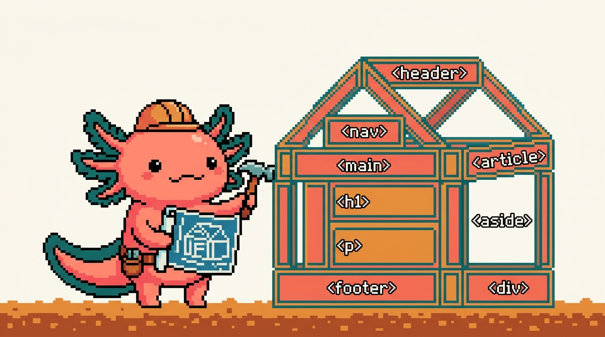

# Módulo 01 — HTML

  

> **Objetivo del módulo:** aprender **HTML**, el lenguaje que define la **estructura** de
> cualquier página web. Al terminar, podrás leer y escribir el "esqueleto" de una página, y
> entenderás el archivo `tunal-digital/sitio-web/index.html` de tu propio sitio.

HTML es **el mejor primer lenguaje**: no tiene lógica complicada, los resultados se ven al
instante en el navegador, y es la base sobre la que se montan CSS (módulo 02) y JavaScript
(módulo 03).

---

## ¿De dónde sale esto en TUS proyectos?

Tu sitio `tunaldigital.com` está hecho con HTML "puro" en `tunal-digital/sitio-web/index.html`
(unas 40 000 líneas de contenido bilingüe). Es el ejemplo real que iremos abriendo. También
hay HTML dentro de tus apps de React (módulos 05–06), aunque ahí se escribe de forma especial
(JSX), que entenderás mejor habiendo dominado HTML primero.

---

## ¿Qué vas a poder hacer al terminar?

- Explicar qué es HTML y qué NO es (no es un "lenguaje de programación" en sentido estricto).
- Crear una página web desde cero con su estructura correcta.
- Usar las etiquetas más importantes: títulos, párrafos, enlaces, imágenes, listas, secciones.
- Construir un formulario de contacto (como el de tu sitio).
- Escribir HTML **semántico y accesible** (que cualquiera, incluidas personas con lectores de
  pantalla, pueda usar).

---

## Capítulos

| # | Capítulo | Qué cubre |
|---|---|---|
| 01 | [¿Qué es HTML?](01-que-es-html.md) | Qué es, etiquetas, tu primera página, cómo verla |
| 02 | [Etiquetas de texto y enlaces](02-texto-y-enlaces.md) | Títulos, párrafos, listas, enlaces, imágenes |
| 03 | [La estructura de un documento](03-estructura-documento.md) | `head`, `body`, metadatos, HTML semántico |
| 04 | [Formularios](04-formularios.md) | Inputs, botones, validación; el formulario de tu sitio |
| 05 | [Accesibilidad y buenas prácticas](05-accesibilidad.md) | ARIA, alt, contraste, HTML que sirve a todos |

> Los capítulos se publican por tandas. Empieza por el 01.

---

## Antes de empezar

Para practicar solo necesitas dos cosas que ya tienes o conseguirás en 2 minutos:
1. Un **editor de código** (VS Code; ver `COMO-ESTUDIAR.md`).
2. Un **navegador** (para abrir tus páginas y verlas).

➡️ Empieza por **[Capítulo 01 — ¿Qué es HTML?](01-que-es-html.md)**.
