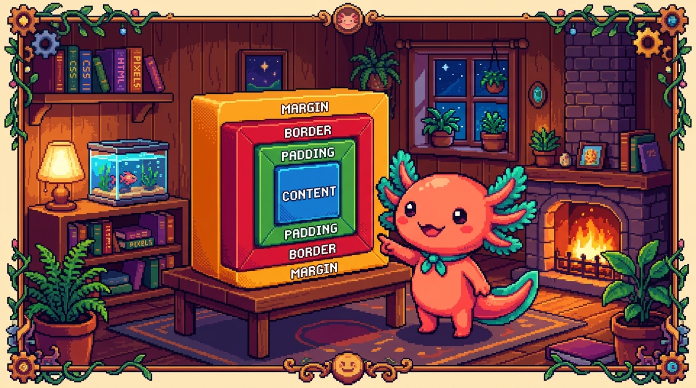

# Capítulo 03 — El modelo de cajas

<p align="center">
  
</p>


> Esta es **la idea más importante de todo CSS**. Cuando de verdad entiendes el modelo de cajas,
> entiendes el 80% de por qué las cosas se ven y se espacian como se ven. Y si no lo entiendes,
> CSS se siente como magia caótica que a veces obedece y a veces no. Así que vamos despacio,
> porque este capítulo vale oro.

---

## 1. Todo en una página es una caja

> ### 🟦 ¿Qué significa? — *El modelo de cajas (box model)*
> En CSS, **cada elemento HTML es una caja rectangular**, aunque a simple vista no lo parezca. Un
> párrafo, una imagen, un botón, un `<div>`: todos son cajas. Y cada caja tiene **cuatro capas**,
> de adentro hacia afuera:
>
> ```
> ┌──────────────────────── margin (margen) ────────────────────────┐
> │   espacio EXTERIOR, separa esta caja de las demás                │
> │   ┌──────────────── border (borde) ────────────────┐            │
> │   │   la línea del borde                            │            │
> │   │   ┌──────────── padding (relleno) ──────────┐   │            │
> │   │   │   espacio INTERIOR, entre borde y texto  │   │            │
> │   │   │   ┌──────── content (contenido) ──────┐  │   │            │
> │   │   │   │   el texto, la imagen, lo de adentro │ │   │            │
> │   │   │   └──────────────────────────────────┘  │   │            │
> │   │   └──────────────────────────────────────────┘   │            │
> │   └──────────────────────────────────────────────────┘            │
> └──────────────────────────────────────────────────────────────────┘
> ```

Quédate con el orden de adentro hacia afuera, porque lo vas a usar todo el tiempo: **contenido →
padding → borde → margen**.

---

## 2. Las cuatro capas, una por una

> ### 🟦 ¿Qué significa? — *Content (contenido)*
> Es lo de adentro: el texto, la imagen, lo que realmente quieres mostrar. Su tamaño base lo
> controlas con `width` (ancho) y `height` (alto), aunque muchas veces la caja se ajusta sola al
> tamaño de su contenido.

> ### 🟦 ¿Qué significa? — *Padding (relleno)*
> El **padding** es el espacio que queda **dentro** de la caja, entre el contenido y el borde. Es
> lo que evita que el texto de un botón quede pegado a sus bordes: le da "aire" por dentro.
> ```css
> .boton { padding: 12px; }            /* 12px por los cuatro lados */
> .boton { padding: 12px 20px; }       /* 12px arriba/abajo, 20px izq/der */
> ```

> ### 🟦 ¿Qué significa? — *Border (borde)*
> El **borde** es la línea que rodea el padding. Lo defines con tres cosas: grosor, estilo y color.
> ```css
> .tarjeta { border: 2px solid #1B6B6B; }   /* 2px, línea sólida, color teal */
> ```
> Muy relacionado: `border-radius` redondea las esquinas, y es lo que le da ese aspecto suave y
> moderno a casi cualquier tarjeta:
> ```css
> .tarjeta { border-radius: 12px; }
> ```

> ### 🟦 ¿Qué significa? — *Margin (margen)*
> El **margen** es el espacio que queda **fuera** de la caja y la separa de sus vecinas. Es lo que
> usas, por ejemplo, para que dos tarjetas no terminen pegadas una contra otra.
> ```css
> .tarjeta { margin: 16px; }            /* separación por los cuatro lados */
> .tarjeta { margin-bottom: 24px; }     /* solo por abajo */
> ```

> ### 💡 Tip — Padding vs. margin, la confusión eterna
> Esta pareja confunde a todo el mundo al principio, así que vale la pena fijarla bien:
> - **Padding** = espacio **por dentro** (entre el contenido y el borde). Empuja el contenido
>   hacia el centro, y el fondo del elemento **sí** llega hasta el borde.
> - **Margin** = espacio **por fuera** (entre esta caja y las demás). Siempre es transparente.
> La regla mental que te salva: *"padding = relleno de la caja; margin = distancia entre cajas."*

> ### 🟦 ¿Qué significa? — *La notación de cuatro lados*
> Muchas propiedades aceptan de 1 a 4 valores, y se leen en sentido del reloj empezando por arriba:
> ```css
> padding: 10px;                /* los 4 lados igual */
> padding: 10px 20px;           /* arriba/abajo | izquierda/derecha */
> padding: 10px 20px 30px 40px; /* arriba | derecha | abajo | izquierda */
> ```
> Con `margin` funciona exactamente igual. Y si solo quieres tocar un lado, tienes versiones
> sueltas como `padding-top`, `margin-left`, etc.

---

## 3. El truco que evita dolores de cabeza: `box-sizing`

Aquí hay una trampa clásica con la que todos tropiezan. Por defecto, cuando escribes `width: 300px`,
ese ancho corresponde **solo al contenido**: el padding y el borde se **suman aparte**, así que la
caja real termina midiendo más de 300px. El resultado es que los diseños se descuadran sin razón
aparente, y eso vuelve loco a cualquier principiante.

> ### 🟦 ¿Qué significa? — *`box-sizing: border-box`*
> La propiedad `box-sizing: border-box` cambia ese comportamiento: hace que `width` incluya el
> **contenido + padding + borde**. Dicho de otra forma, "300px de ancho" pasa a significar 300px de
> verdad, pase lo que pase con el padding. Es tan cómodo que prácticamente **todos** los sitios lo
> activan para todo desde el inicio del CSS:
> ```css
> * {
>   box-sizing: border-box;
> }
> ```
> (Ese `*` es el "selector universal": afecta a **todos** los elementos de la página.)
> **Recomendación:** arranca siempre tu CSS con esa regla y te ahorras horas de confusión. De hecho,
> tu propio `tunal-digital/sitio-web/styles.css` ya lo hace.

---

## 4. Bloque vs. en línea: por qué unas cajas se apilan y otras no

> ### 🟦 ¿Qué significa? — *Elementos de bloque e inline*
> - Un elemento **de bloque** (`block`) ocupa **todo el ancho disponible** y empuja lo que venga
>   después a una línea nueva. Por ejemplo: `<p>`, `<h1>`, `<div>`, `<section>`. Por eso los
>   párrafos se van apilando uno debajo de otro.
> - Un elemento **en línea** (`inline`) ocupa **solo lo que necesita** y comparte la misma línea
>   con el texto a su alrededor. Por ejemplo: `<a>`, `<strong>`, `<span>`.
> Este comportamiento se puede cambiar con la propiedad `display` (`display: block`,
> `display: inline`) y, lo más importante para lo que viene, con `display: flex`, que es justo el
> tema del próximo capítulo.

> ### 🟦 ¿Qué significa? — *`<span>` (la caja inline genérica)*
> Así como `<div>` es la caja de bloque sin significado propio, `<span>` es su gemelo **en línea**:
> sirve para envolver un trozo de texto dentro de una línea y darle estilo (colorear una palabra,
> por ejemplo) sin romper el flujo del párrafo.

---

## ✅ Checklist — ¿ya domino esto?

- [ ] Entiendo que **cada elemento es una caja** con 4 capas.
- [ ] Sé el orden: **contenido → padding → borde → margen**.
- [ ] Distingo **padding** (espacio interior) de **margin** (espacio exterior).
- [ ] Sé redondear esquinas con `border-radius` y usar la notación de 4 lados.
- [ ] Entiendo por qué conviene `box-sizing: border-box` en todo el sitio.
- [ ] Distingo elementos **de bloque** (se apilan) de **inline** (misma línea).

---

## 🧪 Ejercicios

1. **Etiqueta las capas.** Dibuja una caja y rotula sus cuatro capas de adentro hacia afuera.
2. **¿Padding o margin?** Para cada caso elige uno: (a) dar aire dentro de un botón; (b) separar
   dos tarjetas entre sí; (c) que el texto no toque el borde de una caja con fondo de color.
3. **Lee la notación.** ¿Qué significa `padding: 8px 16px;`? ¿Y `margin: 0 auto;`? (la segunda es
   un truco famoso para centrar; investiga o dedúcelo).
4. **El descuadre.** Explica con tus palabras por qué una caja con `width: 200px; padding: 20px;`
   mide 240px de ancho **sin** `border-box`, y 200px **con** `border-box`.
5. 💻 **Tarjeta.** Crea una `.tarjeta` con: fondo crema, `padding` de 20px, `border` teal de 2px,
   `border-radius` de 12px y `margin-bottom` de 16px. Aplícala a dos `<div>` y observa cómo se
   ven y se separan.

➡️ Siguiente: **[Capítulo 04 — Layout con Flexbox](04-flexbox.md)**.
