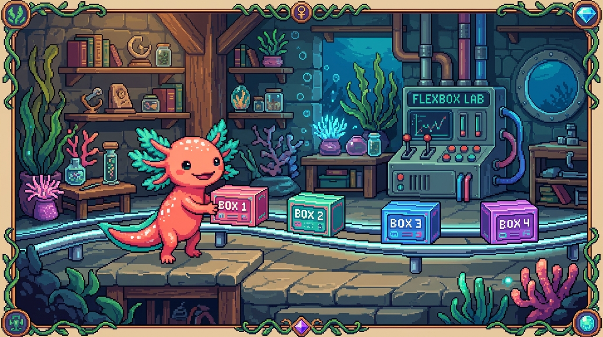

# Capítulo 04 — Layout con Flexbox

<p align="center">
  
</p>


> Hasta ahora las cajas se apilaban una sobre otra. Pero ¿cómo pones tres tarjetas **en fila**?
> ¿Cómo centras algo perfectamente? ¿Cómo haces una barra de menú con el logo a la izquierda y
> los enlaces a la derecha? La respuesta moderna es **Flexbox**, y es más fácil de lo que temes.

---

## 1. El problema que resuelve Flexbox

Durante años, alinear cosas en CSS fue un suplicio: trucos rarísimos, márgenes negativos y
elementos que se negaban a centrarse. **Flexbox** llegó precisamente para acabar con eso. Es un
sistema que toma un grupo de cajas dentro de un contenedor y las **distribuye y alinea** como tú
quieras, en fila o en columna, repartiendo el espacio que sobra de forma inteligente y
**adaptable**.

> ### 🟦 ¿Qué significa? — *Flexbox*
> **Flexbox** (*Flexible Box Layout*) es un modo de organización en el que un **contenedor**
> ordena a sus **elementos hijos** a lo largo de un eje (horizontal o vertical) y decide cómo se
> alinean y cómo se reparten el espacio sobrante. Se llama "flexible" porque los hijos pueden
> crecer o encogerse para llenar el espacio disponible.

---

## 2. Activarlo: `display: flex`

En Flexbox siempre hay dos papeles en juego: **un contenedor** (el padre) y **sus hijos** (los
elementos directos que viven dentro de él).

> ### 🟦 ¿Qué significa? — *Contenedor flex y elementos flex*
> Pones `display: flex` en el **contenedor** y, sin hacer nada más, sus **hijos directos** pasan
> a ser "elementos flex" y se colocan en fila.
> ```html
> <div class="fila">
>   <div class="caja">1</div>
>   <div class="caja">2</div>
>   <div class="caja">3</div>
> </div>
> ```
> ```css
> .fila { display: flex; }   /* las tres .caja ahora van en fila, lado a lado */
> ```
> Sin `display: flex`, esos tres `<div>` se apilarían uno debajo de otro (son de bloque). Con él,
> se ponen en hilera. Ese es el momento "¡ajá!" de Flexbox.

---

## 3. Las propiedades clave del contenedor

Casi todo Flexbox se maneja con cinco propiedades, todas en el **contenedor**. Estas son las que
vas a usar una y otra vez:

> ### 🟦 ¿Qué significa? — *`flex-direction` (la dirección del eje)*
> Decide si los hijos van en **fila** (lo que pasa por defecto) o en **columna**:
> ```css
> .fila { display: flex; flex-direction: row; }     /* → horizontal (defecto) */
> .col  { display: flex; flex-direction: column; }  /* ↓ vertical */
> ```

> ### 🟦 ¿Qué significa? — *`justify-content` (reparto en el eje principal)*
> Decide cómo se reparten los hijos **a lo largo** del eje (el horizontal, si van en fila):
> | Valor | Efecto |
> |---|---|
> | `flex-start` | Todos al inicio (izquierda) |
> | `center` | Todos al centro |
> | `flex-end` | Todos al final (derecha) |
> | `space-between` | Repartidos, pegados a los extremos |
> | `space-around` | Repartidos con espacio alrededor de cada uno |
> ```css
> .barra { display: flex; justify-content: space-between; }  /* logo a la izq, menú a la der */
> ```

> ### 🟦 ¿Qué significa? — *`align-items` (alineación en el eje cruzado)*
> Decide la alineación en el eje **perpendicular** (el vertical, si los hijos van en fila):
> ```css
> .fila { display: flex; align-items: center; }  /* centra verticalmente los hijos */
> ```

> ### 💡 Tip — El centrado perfecto (el truco más buscado de CSS)
> Centrar algo en horizontal **y** en vertical fue una pesadilla durante años. Hoy se resuelve
> con tres líneas:
> ```css
> .centro {
>   display: flex;
>   justify-content: center;   /* centra en horizontal */
>   align-items: center;       /* centra en vertical */
> }
> ```
> Apúntate esta receta, porque la vas a usar muchísimo.

> ### 🟦 ¿Qué significa? — *`gap` (espacio entre hijos)*
> El `gap` mete un espacio uniforme **entre** los elementos, y te ahorra ir poniendo márgenes uno
> por uno:
> ```css
> .fila { display: flex; gap: 16px; }   /* 16px de separación entre cada caja */
> ```

> ### 🟦 ¿Qué significa? — *`flex-wrap` (saltar de línea)*
> Por defecto, los hijos se empeñan en caber en una sola línea aunque se aprieten unos contra
> otros. Con `flex-wrap: wrap` les das permiso para **pasar a la línea siguiente** cuando ya no
> caben. Es justo lo que necesitas para que un grid de tarjetas se reacomode en pantallas
> pequeñas:
> ```css
> .galeria { display: flex; flex-wrap: wrap; gap: 16px; }
> ```

---

## 4. Un ejemplo real: la barra de navegación

Vamos a juntar todo lo anterior. Así se arma una barra con el logo a la izquierda, los enlaces a
la derecha y todo bien centrado en vertical:

```css
.barra {
  display: flex;
  justify-content: space-between;  /* separa logo (izq) y menú (der) */
  align-items: center;             /* los centra verticalmente */
  padding: 16px 24px;
  gap: 16px;
}
```
```html
<nav class="barra">
  <div class="logo">Tunal Digital</div>
  <ul class="menu">
    <li><a href="#">Servicios</a></li>
    <li><a href="#">Contacto</a></li>
  </ul>
</nav>
```

> ### 🔎 En tu código
> La barra superior de tu sitio y las tarjetas de servicios usan Flexbox exactamente así. Y en la
> hoja de estilos de **este manual** (`site/estilos.css`), la clase `.tarjetas` recurre a una
> técnica hermana (CSS Grid) para armar la cuadrícula del índice. La próxima vez que inspecciones
> con `F12` y veas `display: flex`, ya vas a saber qué está pasando ahí.

> ### 💡 Tip — ¿Y CSS Grid?
> Hay otro sistema, **CSS Grid**, pensado para diseños en **dos dimensiones**: filas *y* columnas
> al mismo tiempo, como una cuadrícula de verdad. Flexbox brilla en **una** dimensión (una fila o
> una columna); Grid, en rejillas completas. Mi consejo: domina Flexbox primero, que te resuelve
> la mayoría de los casos, y luego asómate a Grid. Son complementarios, no rivales.

---

## ✅ Checklist — ¿ya domino esto?

- [ ] Entiendo que Flexbox tiene **un contenedor** (`display: flex`) y **sus hijos**.
- [ ] Sé cambiar la dirección con `flex-direction` (row / column).
- [ ] Uso `justify-content` (eje principal) y `align-items` (eje cruzado).
- [ ] Conozco la receta del **centrado perfecto**.
- [ ] Uso `gap` para separar y `flex-wrap` para que salten de línea.
- [ ] Sé que **Grid** existe para diseños de dos dimensiones.

---

## 🧪 Ejercicios

1. **Predice.** Si pongo `display: flex` en un `<div>` con tres hijos, ¿cómo se colocan? ¿Y si
   añado `flex-direction: column`?
2. **Elige la propiedad.** ¿Cuál usarías para: (a) centrar tres botones horizontalmente; (b)
   poner el logo a la izquierda y el menú a la derecha; (c) separar las cajas 20px entre sí?
3. **Centrado.** Escribe el CSS de una caja `.hero` que centre su contenido horizontal y
   verticalmente.
4. **Lee una barra.** Explica qué hace este CSS:
   `.nav { display: flex; justify-content: space-between; align-items: center; gap: 12px; }`
5. 💻 **Tres tarjetas en fila.** Crea un contenedor con tres `.tarjeta` (las del capítulo
   anterior) y ponlas en fila con `display: flex` y `gap: 16px`. Luego añade `flex-wrap: wrap` y
   reduce el ancho de la ventana para ver cómo saltan de línea.

➡️ Siguiente: **[Capítulo 05 — Diseño responsive](05-responsive.md)**.
