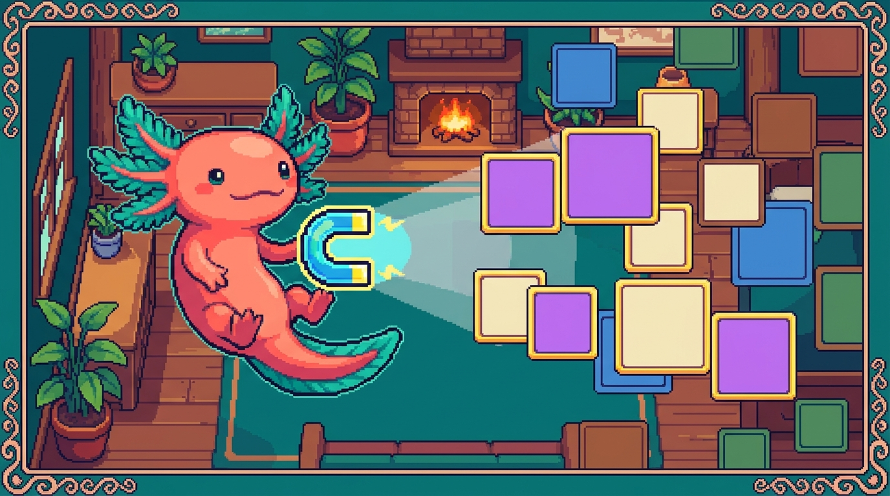

# Capítulo 06 — Selectores avanzados y especificidad

<p align="center">
  
</p>


> ¡Hola de nuevo! Soy Bit, tu ajolote acompañante. 🦎 En los capítulos anteriores aprendiste a apuntar a los elementos por su etiqueta, su clase y su `id`. Eso ya te da mucho poder, pero a veces te pasa algo frustrante: escribes una regla de CSS, recargas el navegador… ¡y no cambia nada! O peor: cambia algo que tú no querías tocar. Tranquilo, no estás roto. Lo que ocurre es que el navegador tiene reglas muy concretas para decidir **quién manda** cuando dos estilos chocan. Eso se llama *especificidad*, y hoy la vamos a domesticar. También vas a aprender a apuntar con muchísima más precisión usando *selectores avanzados*. Al terminar, vas a entender por qué tu CSS hace lo que hace, en vez de adivinar a ciegas. Vamos despacio y con ejemplos de tus propios proyectos.

## 1. Recordatorio rápido: ¿qué es un selector?

Antes de meternos en lo nuevo, refresquemos la base. Cuando escribes CSS, cada regla tiene dos partes: el **selector** (a quién apunto) y el **bloque de declaraciones** (qué le hago).

```css
/* "h1" es el selector; lo de las llaves son las declaraciones */
h1 {
  color: #1f2937;
  font-size: 2rem;
}
```

> ### 🟦 ¿Qué significa? — *Selector*
> Un selector es el texto que va **antes** de las llaves `{ }` en una regla CSS, y le dice al navegador a qué elementos del HTML aplicar los estilos. Sirve para "apuntar" sin tener que tocar el HTML uno por uno. En `tunal-digital`, dentro de `styles.css`, cada bloque que escribes empieza con un selector: `.boton`, `header`, `nav a`… todos son selectores.

Hasta ahora seguramente usaste tres tipos básicos:

- Por **etiqueta**: `p`, `h1`, `button` (apunta a todos los de ese tipo).
- Por **clase**: `.boton`, `.tarjeta` (apunta a los que tengan ese `class`).
- Por **id**: `#menu`, `#hero` (apunta al único elemento con ese `id`).

Hoy sumamos formas nuevas de combinarlos para apuntar con precisión de cirujano. Y, sobre todo, vamos a entender qué pasa cuando varios selectores apuntan al mismo elemento.

## 2. Combinadores: relaciones entre elementos

Los **combinadores** son símbolos que ponemos *entre* dos selectores para decir: "no quiero cualquier elemento, quiero uno que esté en cierta **relación** con otro". Para entenderlos, piensa en tu HTML como un árbol familiar: hay elementos padres, hijos, nietos y hermanos.

> ### 🟦 ¿Qué significa? — *Combinador*
> Un combinador es un símbolo (un espacio, `>`, `+` o `~`) que se coloca entre dos selectores para describir cómo deben estar **relacionados** los elementos en el HTML. Sirve para apuntar a algo según su posición respecto a otro elemento, sin necesidad de ponerle una clase a cada cosa. En el `styles.css` de `tunal-digital` lo usas cada vez que escribes algo como `nav a` (los enlaces *dentro* de la navegación).

Imagina este HTML de ejemplo, parecido al menú de `tunal-digital`:

```html
<nav class="menu">
  <ul>
    <li><a href="#inicio">Inicio</a></li>
    <li><a href="#servicios">Servicios</a></li>
  </ul>
  <a href="#contacto" class="cta">Contáctanos</a>
</nav>
```

### 2.1 Combinador descendiente (un espacio)

El más común. Un **espacio** entre dos selectores significa "el segundo está en cualquier nivel *dentro* del primero, no importa qué tan profundo".

```css
/* Cualquier <a> que esté dentro de .menu, a cualquier profundidad */
.menu a {
  text-decoration: none;
  color: #1f2937;
}
```

> ### 🟦 ¿Qué significa? — *Descendiente*
> Un descendiente es un elemento que está contenido dentro de otro, sin importar cuántos niveles haya en medio (hijo, nieto, bisnieto…). Sirve para aplicar estilos a todo lo que vive "dentro de" una sección. En `tunal-digital` lo usas para, por ejemplo, dar estilo a todos los enlaces dentro del `<footer>` con `footer a { ... }`.

En el HTML de arriba, `.menu a` apunta a **los tres** enlaces: los dos dentro del `<ul><li>` y también el de "Contáctanos", porque todos están en algún punto dentro de `.menu`.

### 2.2 Combinador de hijo directo (`>`)

El símbolo `>` es más estricto: solo apunta al **hijo directo**, es decir, el que está exactamente un nivel adentro, no los nietos.

```css
/* Solo los <a> que sean hijos DIRECTOS de .menu */
.menu > a {
  font-weight: bold;
}
```

> ### 🟦 ¿Qué significa? — *Hijo directo*
> Un hijo directo es un elemento que está exactamente un nivel dentro de otro, sin nada en medio. Sirve cuando quieres afectar solo el primer nivel y dejar en paz lo que esté más adentro. Útil en menús anidados, listas dentro de listas, o componentes con varios niveles.

Con `.menu > a`, en nuestro ejemplo solo se afecta el enlace "Contáctanos", porque es hijo directo de `.menu`. Los otros dos enlaces están dentro de `<li>`, que está dentro de `<ul>`: son nietos, no hijos directos.

> ### 💡 Tip
> ¿Cómo distinguir el espacio del `>`? Lee el espacio como "en algún lugar dentro de" y el `>` como "justo dentro de, sin escalones intermedios". El `>` es tu amigo cuando un descendiente normal afecta de más.

### 2.3 Combinador de hermano adyacente (`+`)

Los **hermanos** son elementos que comparten el mismo padre y están al mismo nivel. El `+` apunta al hermano que viene **inmediatamente después** de otro.

```css
/* El primer <p> que venga justo después de un <h2> */
h2 + p {
  margin-top: 0;
  color: #6b7280;
}
```

> ### 🟦 ¿Qué significa? — *Hermano adyacente*
> Un hermano adyacente es el elemento que aparece justo a continuación de otro, ambos con el mismo padre y pegados (sin nada en medio). Sirve para estilos que dependen de "lo que viene después de". Por ejemplo, separar menos un párrafo que sigue directamente a un título, como en las secciones de contenido de `tunal-digital`.

### 2.4 Combinador de hermanos generales (`~`)

El `~` es como el `+`, pero apunta a **todos** los hermanos que vengan después, no solo al de al lado.

```css
/* TODOS los <p> que vengan después de un <h2> (mismo padre) */
h2 ~ p {
  line-height: 1.6;
}
```

> ### 🟦 ¿Qué significa? — *Hermano general*
> Un hermano general es cualquier elemento que comparta padre con otro y aparezca después de él en el HTML, estén pegados o no. Sirve para afectar "todo lo que sigue" a partir de cierto punto. Se usa menos que los otros, pero es perfecto para ciertos patrones de formularios o listas.

> ### 🟦 ¿Qué significa? — *Tailwind*
> Tailwind (o Tailwind CSS) es un sistema de estilos basado en *clases de utilidad*: en vez de escribir reglas en un archivo `.css`, pones muchas clases pequeñas y predefinidas directamente en el HTML, cada una con un único efecto (`mt-0` quita el margen superior, `text-gray-500` da color al texto). Sirve para estilizar rápido y sin inventar nombres de clase. Lo usas en `RachaSimple` y `Faro`; en `tunal-digital`, en cambio, escribes el CSS a mano. Aparecerá varias veces en este capítulo porque cambia un poco cómo se vive la especificidad.

> ### 🔎 En tu código
> En `RachaSimple` y `Faro` usas **Tailwind**, donde casi no escribes combinadores a mano: pones clases directamente en cada elemento (`className="mt-0 text-gray-500"`). Pero los combinadores no desaparecen: Tailwind tiene variantes como `[&>*]` o `space-y-4` que por debajo generan exactamente reglas con combinadores (`> * + *`). Entender el combinador te ayuda a leer qué hace Tailwind por debajo.

## 3. Selectores por atributo

A veces no quieres apuntar por clase ni etiqueta, sino por un **atributo** que tenga el elemento. Para eso usamos corchetes `[ ]`.

> ### 🟦 ¿Qué significa? — *Selector por atributo*
> Un selector por atributo apunta a los elementos que tengan cierto atributo HTML (y, opcionalmente, cierto valor). Sirve para estilizar cosas sin ponerles una clase, especialmente formularios y enlaces. En `tunal-digital`, un formulario de contacto tiene muchos `<input>` con distintos `type`, y por atributo puedes estilizarlos sin tocar el HTML.

```css
/* Todos los inputs cuyo type sea exactamente "email" */
input[type="email"] {
  border: 1px solid #d1d5db;
  padding: 0.5rem;
}

/* Cualquier elemento que tenga el atributo "disabled" (sin importar valor) */
button[disabled] {
  opacity: 0.5;
  cursor: not-allowed;
}

/* Enlaces externos: href que EMPIECE por http */
a[href^="http"] {
  color: #2563eb;
}

/* Imágenes cuyo src TERMINE en .png */
img[src$=".png"] {
  background: #f3f4f6;
}

/* Elementos cuya clase CONTENGA el texto "card" */
[class*="card"] {
  border-radius: 8px;
}
```

Los pequeños símbolos antes del `=` cambian el significado:

- `[attr="x"]` → el valor es **exactamente** `x`.
- `[attr^="x"]` → el valor **empieza** por `x` (la `^` recuerda al inicio).
- `[attr$="x"]` → el valor **termina** en `x` (la `$` recuerda al final).
- `[attr*="x"]` → el valor **contiene** `x` en cualquier parte.

> ### 💡 Tip
> El selector `a[href^="http"]` es un truco clásico para marcar enlaces externos de forma distinta, ya que los enlaces internos suelen empezar por `#` o `/`. Así, sin esfuerzo manual, todos tus enlaces que van "afuera" del sitio se ven diferentes.

## 4. Agrupar selectores con coma

Cuando varias reglas comparten exactamente los mismos estilos, no hace falta repetirlas. Las **agrupas** con una coma.

> ### 🟦 ¿Qué significa? — *Agrupar selectores*
> Agrupar es escribir varios selectores separados por comas para aplicarles el mismo bloque de estilos de una sola vez. Sirve para no repetirte (principio "DRY": *Don't Repeat Yourself*) y mantener el CSS más corto. Muy útil al inicio de un `styles.css` para dar una base común a todos los títulos.

```css
/* En vez de escribir el mismo bloque tres veces... */
h1, h2, h3 {
  font-family: "Inter", sans-serif;
  color: #111827;
  margin-bottom: 0.5rem;
}
```

> ### ⚠️ Cuidado
> La coma significa "Y también este otro, por separado". No la confundas con el espacio (descendiente). `h1 h2` significa "un `h2` dentro de un `h1`" (rarísimo), mientras que `h1, h2` significa "los `h1` y, aparte, los `h2`". Una coma de más o de menos cambia todo el sentido.

> ### 🔎 En tu código
> En el propio `estilos.css` de este manual usamos agrupación para los temas: una sola regla define las variables de color base, y luego agrupamos varios elementos de texto para que compartan tipografía. Eso mantiene el archivo ordenado aunque haya modo claro y modo oscuro.

## 5. La cascada: el apellido de "CSS"

La sigla CSS significa *Cascading Style Sheets*: "hojas de estilo **en cascada**". Esa palabra, cascada, es el corazón de todo lo de hoy.

> ### 🟦 ¿Qué significa? — *Cascada*
> La cascada es el conjunto de reglas que usa el navegador para decidir qué estilo gana cuando **varias reglas distintas apuntan al mismo elemento y se contradicen**. Sirve para que siempre haya una respuesta clara y predecible. Cada vez que en `tunal-digital` un color "no cambia" aunque escribiste la regla, la causa casi siempre es la cascada eligiendo otra regla por encima de la tuya.

El navegador resuelve los conflictos en **tres pasos**, en este orden:

1. **Importancia y origen**: ¿hay un `!important`? ¿De dónde viene la regla? (lo vemos abajo).
2. **Especificidad**: ¿qué selector es más "específico"? (la estrella del capítulo).
3. **Orden de aparición**: si todo lo demás empata, **gana la última regla escrita**.

Empecemos por el más fácil de entender: el orden.

### 5.1 El orden: gana el último

Si dos reglas tienen la misma fuerza y apuntan a lo mismo, el navegador aplica **la que esté más abajo** en el archivo.

```css
.boton {
  background: blue;
}

.boton {
  background: green; /* ✅ Gana este: está después */
}
```

El botón será verde. Por eso, si copias una regla y la pegas más abajo para "probar algo", a veces parece que la de arriba "no funciona": en realidad la de abajo la está pisando.

> ### 💡 Tip
> Este principio explica por qué en `RachaSimple` y `Faro`, donde el CSS final lo arma Tailwind, **el orden en que se cargan las hojas importa**. Tu CSS personalizado normalmente se carga después del de Tailwind para poder ajustarlo.

## 6. Especificidad: quién manda de verdad

Aquí está la parte que confunde a casi todo principiante, así que vamos con mucha calma. La **especificidad** es una "puntuación" que el navegador le da a cada selector. Cuando dos reglas chocan, **gana la de mayor puntuación**, sin importar el orden.

> ### 🟦 ¿Qué significa? — *Especificidad*
> La especificidad es un valor numérico que el navegador calcula para cada selector según qué tan "preciso" es. A mayor especificidad, más fuerza tiene esa regla para imponerse sobre otras que apunten al mismo elemento. Sirve para resolver conflictos de estilo de forma consistente. Cuando en `tunal-digital` `.boton` no logra cambiar un color, casi siempre es porque otra regla más específica (por ejemplo `#hero .boton`) le está ganando.

### 6.1 Cómo se cuenta (la regla de los tres números)

Imagina que cada selector recibe una puntuación de **tres casillas**, que escribimos así: **(A, B, C)**.

- **A** → cuántos **id** (`#algo`) usa el selector.
- **B** → cuántas **clases**, **atributos** (`[type]`) y **pseudoclases** (`:hover`) usa.
- **C** → cuántas **etiquetas** (`p`, `div`) y **pseudoelementos** (`::before`) usa.

> ### 🟦 ¿Qué significa? — *Pseudoclase*
> Una pseudoclase es una palabra que se añade a un selector con dos puntos (`:`) para apuntar a un elemento solo cuando está en cierto **estado** o situación, no de forma permanente. Las más comunes son `:hover` (cuando el ratón está encima), `:focus` (cuando el campo está seleccionado) y `:first-child` (cuando es el primer hijo). Sirve para reaccionar a lo que hace el usuario sin escribir JavaScript. En `tunal-digital` la usas, por ejemplo, en `.boton:hover` para oscurecer un botón al pasar el cursor. A efectos de especificidad, una pseudoclase cuenta como una clase (suma en la casilla **B**).

> ### 🟦 ¿Qué significa? — *Pseudoelemento*
> Un pseudoelemento es una palabra que se añade a un selector con dos puntos dobles (`::`) para apuntar a una **parte** de un elemento que no existe como etiqueta propia en el HTML, o para crear contenido nuevo desde el CSS. Los más usados son `::before` y `::after` (que insertan algo antes o después del contenido) y `::first-line` (la primera línea de un párrafo). Sirve para decorar sin ensuciar el HTML, por ejemplo añadiendo un icono antes de un enlace. A efectos de especificidad, un pseudoelemento cuenta como una etiqueta (suma en la casilla **C**).

Se comparan de izquierda a derecha, como si fueran números: primero los id; si empatan, las clases; si empatan, las etiquetas.

Veamos ejemplos calculando la puntuación:

```css
p                 { } /* (0,0,1) → 1 etiqueta */
.boton            { } /* (0,1,0) → 1 clase */
nav a             { } /* (0,0,2) → 2 etiquetas */
.menu a           { } /* (0,1,1) → 1 clase + 1 etiqueta */
input[type="text"]{ } /* (0,1,1) → 1 etiqueta + 1 atributo */
#hero             { } /* (1,0,0) → 1 id */
#hero .boton      { } /* (1,1,0) → 1 id + 1 clase */
```

¿Quién gana entre `.boton` (0,1,0) y `#hero .boton` (1,1,0)? El segundo, porque tiene un `1` en la casilla de los id, que pesa más que cualquier cantidad de clases.

> ### ⚠️ Cuidado
> Un solo **id** vence a **cualquier** cantidad de clases. Aunque escribas `.a.b.c.d.e` (cinco clases, puntuación (0,5,0)), un simple `#x` (1,0,0) le gana. Por eso muchos equipos evitan estilizar por `id` y prefieren clases: así la "guerra de especificidad" se mantiene tranquila y fácil de predecir.

### 6.2 Un ejemplo completo

Mira este HTML y las tres reglas que apuntan al mismo botón:

```html
<div id="hero">
  <button class="boton">Empezar</button>
</div>
```

```css
button          { color: black; }  /* (0,0,1) */
.boton          { color: blue;  }  /* (0,1,0) */
#hero .boton    { color: red;   }  /* (1,1,0) ✅ gana */
```

El texto será **rojo**. Aunque `button` y `.boton` están ahí, `#hero .boton` tiene un id y eso lo coloca por encima. Si quitaras esa última regla, ganaría `.boton` (azul), porque una clase (0,1,0) le gana a una etiqueta (0,0,1).

> ### 🟦 ¿Qué significa? — *DevTools*
> Las DevTools (herramientas de desarrollador) son un panel que todo navegador moderno trae incorporado y que abres con clic derecho → "Inspeccionar" (o con la tecla F12). Sirven para ver el HTML y el CSS reales de una página, probar cambios al vuelo y, sobre todo, entender qué regla ganó en un conflicto: el panel de estilos **tacha** las reglas perdedoras. Es tu mejor aliada para investigar la especificidad en vivo, por ejemplo en cualquier pantalla de `tunal-digital`.

> ### 🔎 En tu código
> Este es el bug número uno de principiantes en `tunal-digital`: tienes `.boton { background: #2563eb }` pero el botón aparece de otro color. Abre las DevTools del navegador (clic derecho → "Inspeccionar"), selecciona el botón y mira el panel de estilos: el navegador **tacha** las reglas que perdieron y te muestra cuál ganó y por qué. Es la mejor herramienta para ver la especificidad en vivo.

### 6.3 ¿Y los estilos en línea (`style=""`)?

Si pones estilos directamente en el HTML con el atributo `style`, esos ganan a casi todo lo que venga de tu hoja de CSS. En la cuenta de especificidad equivalen a una casilla aún más fuerte, por delante de los id.

> ### 🟦 ¿Qué significa? — *Estilos en línea*
> Los estilos en línea son los que se escriben dentro del propio HTML usando el atributo `style="..."` en una etiqueta concreta, en vez de en una hoja `.css` aparte. Afectan solo a ese elemento y tienen una fuerza muy alta en la cascada (por encima de los id). Sirven, en casos puntuales, para valores que cambian sobre la marcha. En `RachaSimple` y `Faro` aparecen cuando React calcula un valor dinámico (como el ancho de una barra de progreso), pero como estilo fijo conviene evitarlos porque son difíciles de sobrescribir y no se reutilizan.

```html
<!-- Este color gana a casi cualquier regla del CSS -->
<button class="boton" style="color: green;">Hola</button>
```

> ### ⚠️ Cuidado
> Por eso conviene **evitar** los estilos en línea salvo casos muy puntuales: son difíciles de sobrescribir desde el CSS, no se reutilizan y desordenan el HTML. En `RachaSimple` y `Faro`, React a veces usa `style={{ ... }}` para valores dinámicos (por ejemplo, una barra de progreso cuyo ancho depende de un dato); eso está bien porque es un valor que cambia, no un estilo fijo que debería vivir en el CSS.

## 7. `!important`: el botón de pánico (que casi nunca debes pulsar)

Existe una palabra mágica que rompe todas las reglas anteriores: `!important`. Si la pones al final de una declaración, esa declaración gana **sin importar la especificidad ni el orden**.

> ### 🟦 ¿Qué significa? — *!important*
> `!important` es una marca que se añade al final de una declaración CSS para forzar que ese valor gane por encima de cualquier otra regla normal, ignorando especificidad y orden. Sirve, en teoría, para casos de emergencia. En la práctica suele crear más problemas de los que resuelve, porque luego no puedes sobrescribirlo fácilmente.

```css
.boton {
  background: blue !important; /* Gana aunque otra regla sea más específica */
}
```

> ### ⚠️ Cuidado
> Usar `!important` es como gritar para ganar una discusión: funciona la primera vez, pero cuando **otra** regla también necesite gritar, tendrás dos `!important` peleando y nadie sabrá qué pasa. Cada `!important` que añades hace tu CSS más difícil de mantener. Trátalo como un extintor: solo en emergencias reales.

¿Cuándo se justifica de verdad? Pocas veces. Por ejemplo, para sobrescribir estilos de una librería externa que no puedes editar y que ya viene con su propio `!important`. Antes de llegar ahí, **casi siempre** hay una solución mejor: subir un poquito tu especificidad de forma controlada (por ejemplo, añadir una clase extra) o reordenar tus reglas.

> ### 🔎 En tu código
> En `RachaSimple` y `Faro` con Tailwind, si necesitas pisar una clase de utilidad puedes usar la variante `!` de Tailwind (por ejemplo `!bg-red-500`), que genera el `!important` por ti. Úsala con la misma prudencia: si te ves usándola seguido, probablemente haya un conflicto de orden o de configuración que conviene arreglar de raíz en vez de tapar.

## 8. Estrategia: cómo evitar peleas de especificidad

Ahora que entiendes el mecanismo, aquí va la filosofía sana para que tu CSS no se vuelva un campo de batalla:

- **Prefiere clases** a los `id` para dar estilo. Las clases tienen una especificidad media y fácil de manejar; los id son demasiado fuertes y se vuelven un dolor de cabeza.
- **Mantén los selectores cortos**. `.tarjeta-titulo` es más fácil de mantener que `.contenedor .tarjeta .cabecera h2 span`. Cuanto más largo el selector, más alto subes la especificidad sin querer.
- **Evita `!important`** salvo emergencias documentadas.
- **Usa el orden a tu favor**: pon tus estilos personalizados después de los de librerías, para poder ajustarlos sin trucos.
- **Nombra bien tus clases**: una clase clara como `.boton--primario` te evita tener que usar combinadores y anidamientos profundos.

> ### 💡 Tip
> Tailwind (en `RachaSimple` y `Faro`) nació justamente para evitar estas guerras: todas sus utilidades tienen prácticamente la **misma especificidad**, así que casi siempre gana la última clase, que es fácil de predecir. Por eso ahí casi nunca peleas con la cascada. Pero entender la teoría te salva el día cuando mezclas Tailwind con CSS propio.

## 9. Juntando todo: un ejemplo de `tunal-digital`

Veamos cómo conviven varios conceptos del capítulo en un fragmento realista de `styles.css`:

```css
/* Agrupación: base común para títulos */
h1, h2, h3 {
  font-family: "Inter", sans-serif;
  color: #111827;
}

/* Descendiente: enlaces dentro del menú */
.menu a {
  color: #374151;
  text-decoration: none;
}

/* Hermano adyacente: el párrafo pegado a un título sube menos */
h2 + p {
  margin-top: 0.25rem;
}

/* Atributo: inputs de email en el formulario de contacto */
input[type="email"] {
  border: 1px solid #d1d5db;
}

/* Clase simple para el botón (especificidad 0,1,0) */
.boton {
  background: #2563eb;
  color: white;
}

/* Variante con un poquito más de especificidad, controlada */
.boton.boton--grande {
  padding: 1rem 2rem; /* (0,2,0): gana a .boton sin usar id ni !important */
}
```

Fíjate en el último truco: `.boton.boton--grande` (dos clases en el mismo elemento) suma (0,2,0), lo que le gana de forma limpia a `.boton` (0,1,0) **sin** recurrir a un id ni a `!important`. Esa es la manera elegante de "subir la fuerza" cuando de verdad la necesitas.

> ### 🔎 En tu código
> Si en `tunal-digital` ves que un estilo no se aplica, recorre la cascada mentalmente en orden: (1) ¿hay algún `!important` por ahí? (2) ¿hay una regla más específica ganando? (3) si empatan, ¿cuál se escribió de última? Con esas tres preguntas resuelves casi cualquier misterio de CSS.

## ✅ Checklist — ¿ya domino esto?

- [ ] Sé qué es un combinador y reconozco el espacio, `>`, `+` y `~`.
- [ ] Distingo un descendiente (espacio) de un hijo directo (`>`).
- [ ] Entiendo qué es un hermano adyacente (`+`) y uno general (`~`).
- [ ] Sé apuntar a elementos por atributo, incluyendo `^=`, `$=` y `*=`.
- [ ] Puedo agrupar selectores con coma y sé que la coma no es lo mismo que el espacio.
- [ ] Explico con mis palabras qué es la cascada de CSS.
- [ ] Calculo la especificidad de un selector con las tres casillas (A id, B clases, C etiquetas).
- [ ] Sé que el orden decide cuando la especificidad empata (gana el último).
- [ ] Entiendo qué hace `!important` y por qué conviene evitarlo.
- [ ] Sé usar las DevTools para ver qué regla ganó y por qué.

## 🧪 Ejercicios

1. **(En papel)** Calcula la especificidad de estos selectores y ordénalos de menor a mayor fuerza: `a`, `.menu a`, `#hero`, `nav a`, `.boton.boton--grande`, `input[type="text"]`. Escribe la puntuación (A,B,C) de cada uno.

2. **(En papel)** Tienes este HTML: `<div class="caja"><p>Hola</p><span>Bit</span></div>`. ¿A qué elemento(s) apunta cada selector? `.caja p`, `.caja > span`, `p + span`, `.caja *`.

3. 💻 En tu `styles.css` de `tunal-digital`, crea una regla con el selector descendiente `.menu a` y otra con el hijo directo `.menu > a`. Construye un menú con enlaces anidados en `<li>` y otro enlace directo, y observa en el navegador a cuáles afecta cada regla.

4. 💻 Provoca un conflicto a propósito: escribe `.boton { color: blue; }` y, debajo, `#contenedor .boton { color: red; }` con el botón dentro de un `<div id="contenedor">`. Abre las DevTools, inspecciona el botón y captura cómo el navegador tacha la regla perdedora. Luego elimina el id y comprueba que ahora gana el azul.

5. 💻 Usa selectores por atributo en el formulario de contacto de `tunal-digital`: dale un borde distinto a `input[type="email"]`, otro a `input[type="text"]` y un estilo "apagado" a `button[disabled]`. Verifica cada uno en el navegador.

6. 💻 Toma una regla que use `!important` (créala tú si no tienes) y reescríbela **sin** `!important`, ganando el conflicto solo con especificidad (por ejemplo, duplicando la clase: `.boton.boton`). Comprueba que el resultado visual es el mismo y reflexiona por qué esta versión es más mantenible.

> ¡Lo lograste! 🦎 Hoy pasaste de "el CSS hace cosas raras" a "yo entiendo por qué el CSS hace lo que hace". La especificidad deja de ser magia y se vuelve una cuenta sencilla de tres casillas. La próxima vez que un estilo no se aplique, ya no vas a adivinar: vas a abrir las DevTools, mirar quién ganó y arreglarlo con calma. Nos vemos en el siguiente capítulo. — Bit
