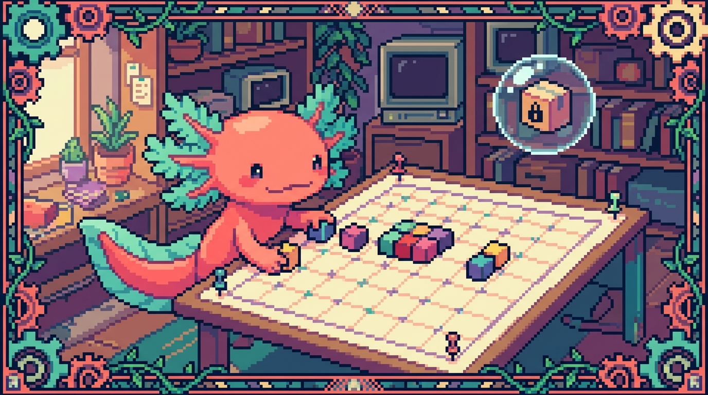

# Capítulo 08 — Posicionamiento

<p align="center">
  
</p>


> Hasta ahora tus elementos se han ido acomodando solos: uno debajo del otro, uno al lado del otro, siguiendo el orden natural del HTML. Y para la mayoría de las páginas, con eso basta. Pero tarde o temprano llega el momento en que necesitas que algo **se quede pegado arriba mientras haces scroll**, o que un globito de notificación se monte **encima** de un botón, o que una insignia "Nuevo" flote en la esquina de una tarjeta. Ahí entra el **posicionamiento**. Bit, nuestro ajolote, lo explica así: posicionar es decirle a un elemento "tú no sigas la fila, ponte exactamente aquí". Con criterio, te saca de muchos apuros. A lo loco, te arma un desastre. Este capítulo es para que aprendas a usarlo con criterio.

---

## 1. La idea grande: ¿qué es "posicionar"?

Por defecto, el navegador acomoda cada elemento siguiendo lo que se llama el **flujo normal del documento**: de arriba hacia abajo, respetando si son de bloque o de línea (algo que ya viste en capítulos anteriores). Posicionar es simplemente cambiar ese comportamiento para un elemento concreto.

La pieza central es la propiedad `position`. Acepta cinco valores, y vamos a recorrerlos uno por uno: `static`, `relative`, `absolute`, `fixed` y `sticky`. Junto a ella trabajan otras cuatro propiedades de desplazamiento (`top`, `right`, `bottom`, `left`), un sistema de capas (`z-index`) y dos técnicas más viejas que conviene saber reconocer (`float` y `overflow`).

> ### 🟦 ¿Qué significa? — *Flujo normal del documento*
> Es el orden automático con el que el navegador coloca los elementos cuando no le pides nada especial: los bloques se apilan en vertical y el contenido en línea fluye como si fuera texto. **Sirve** para que una página tenga estructura sin que muevas un dedo. **Dónde se usa en un repo real:** en `tunal-digital`, casi todo el `styles.css` confía en el flujo normal; solo unos pocos elementos (como un botón flotante o una barra superior) rompen ese flujo a propósito.

> ### 💡 Tip
> Antes de tocar `position`, pregúntate si Flexbox o Grid (capítulos siguientes o anteriores, según tu ruta) no resuelven mejor el problema. El posicionamiento es para casos puntuales de "ponte exactamente aquí", no para montar layouts enteros.

---

## 2. `position: static` — el valor por defecto

Todos los elementos arrancan con `position: static`. Quiere decir "compórtate normal, sigue el flujo". Es tan normal que casi nunca lo escribes tú; viene puesto de fábrica.

```css
.tarjeta {
  position: static; /* esto es lo que ya tenían sin escribirlo */
}
```

> ### 🟦 ¿Qué significa? — *static*
> Es la posición normal de un elemento: ocupa su lugar en la fila y **no** reacciona a `top`, `right`, `bottom` ni `left`. **Sirve** como punto de partida y como manera de "resetear" un posicionamiento que ya no quieres. **Dónde se usa:** la inmensa mayoría de los párrafos, títulos e imágenes de `tunal-digital` son `static` sin que nadie lo escriba.

El dato clave: en `static`, las propiedades `top/right/bottom/left` **no hacen absolutamente nada**. Si las escribes, el navegador las ignora. Esto trae de cabeza a muchos principiantes: "le puse `top: 20px` y no se movió". Casi siempre la razón es la misma, que el elemento sigue siendo `static`.

---

## 3. Las cuatro propiedades de desplazamiento: `top`, `right`, `bottom`, `left`

Antes de seguir con los demás valores de `position`, te conviene tener claras estas cuatro, porque son las que mueven el elemento una vez que dejó de ser `static`.

> ### 🟦 ¿Qué significa? — *top / right / bottom / left*
> Son cuatro propiedades que indican **a qué distancia** se separa un elemento posicionado de un borde de referencia. `top: 10px` significa "10 píxeles desde arriba"; `left: 0` significa "pegado a la izquierda". **Sirven** para colocar con precisión un elemento que ya no está en el flujo normal. **Dónde se usa:** para clavar una insignia "Nuevo" en la esquina superior derecha de una tarjeta de proyecto en `Faro`.

¿Desde dónde se mide esa distancia? Depende del valor de `position`, y eso es justo lo que veremos en las próximas secciones. Un detalle que no puedes perder de vista: estas propiedades **solo funcionan** si `position` es `relative`, `absolute`, `fixed` o `sticky`. Con `static`, ni te molestes.

---

## 4. `position: relative` — muévete respecto a ti mismo

Con `relative`, el elemento sigue ocupando su lugar en el flujo (su hueco no desaparece), pero ahora sí puedes empujarlo desde su posición original con `top/right/bottom/left`.

```css
.boton-destacado {
  position: relative;
  top: -4px;   /* sube 4px respecto a donde estaba */
  left: 8px;   /* se corre 8px a la derecha */
}
```

> ### 🟦 ¿Qué significa? — *relative*
> Posiciona el elemento **en relación a sí mismo**: parte de donde el flujo lo dejó y se desplaza desde ahí. El hueco que ocupaba se queda reservado. **Sirve** para ajustes finos de posición y, sobre todo, para crear un "marco de referencia" para hijos absolutos (lo verás en la sección 5). **Dónde se usa:** en `tunal-digital`, una tarjeta con `position: relative` para que dentro pueda flotar una etiqueta de precio absoluta.

Lo curioso es que el verdadero superpoder de `relative` no está en moverse a sí mismo (eso se usa poco), sino en que **convierte al elemento en el punto de referencia de sus hijos `absolute`**. Quédate con esta idea, porque la necesitamos enseguida.

> ### 🔎 En tu código
> En `RachaSimple` (React + Tailwind), `position: relative` se escribe simplemente como la clase `relative`, y `top: 0; right: 0` se vuelven `top-0 right-0`. Mismos conceptos, nombres más cortos. Todo lo que aprendas aquí en CSS puro se traduce directo a Tailwind.

---

## 5. `position: absolute` — sácame del flujo y colócame

Aquí empieza lo bueno. Con `absolute`, el elemento **sale del flujo normal**: deja de ocupar su hueco (los demás se cierran como si nunca hubiera estado ahí) y se coloca respecto a su **ancestro posicionado** más cercano.

```css
.tarjeta {
  position: relative; /* este es el ancestro de referencia */
}

.tarjeta .insignia-nuevo {
  position: absolute;
  top: 8px;
  right: 8px;       /* esquina superior derecha de la tarjeta */
  background: #e63946;
  color: white;
  padding: 2px 8px;
  border-radius: 999px;
}
```

> ### 🟦 ¿Qué significa? — *absolute*
> Saca al elemento del flujo normal y lo posiciona respecto al ancestro más cercano que tenga `position` distinta de `static` (es decir, `relative`, `absolute`, `fixed` o `sticky`). Si no encuentra ninguno, usa la página entera. **Sirve** para superponer elementos: insignias, globos, menús desplegables, iconos en esquinas. **Dónde se usa:** la insignia "Nuevo" sobre una tarjeta de proyecto en `Faro`, o un icono de candado sobre una miniatura en `tunal-digital`.

> ### ⚠️ Cuidado
> El error número uno con `absolute`: olvidar poner `position: relative` en el contenedor padre. Si lo olvidas, tu insignia no se coloca respecto a la tarjeta, sino respecto a toda la página, y termina en una esquina rarísima. La regla para memorizar: **padre `relative`, hijo `absolute`**.

> ### 🟦 ¿Qué significa? — *Ancestro posicionado (bloque contenedor)*
> Es el elemento de referencia que un hijo `absolute` usa para medir su `top/left/etc.`. Es el ancestro más cercano con `position` distinta de `static`. **Sirve** para controlar exactamente "respecto a qué" se coloca un elemento absoluto. **Dónde se usa:** en `Faro`, la tarjeta de proyecto es `relative` precisamente para ser el ancestro de su insignia de estado.

Un detalle más: cuando pones un elemento `absolute` y no le das ni `top/bottom` ni `left/right`, se queda más o menos donde estaba, pero ya fuera del flujo. Lo habitual es darle al menos dos coordenadas (una vertical y una horizontal) para clavarlo donde tú quieres.

---

## 6. `position: fixed` — quédate pegado a la pantalla

Con `fixed`, el elemento también sale del flujo, pero su referencia ya no es un ancestro: es la **ventana del navegador** (el viewport). El resultado es que se queda quieto en la pantalla por mucho que hagas scroll.

```css
.boton-subir {
  position: fixed;
  bottom: 24px;
  right: 24px;     /* siempre visible en la esquina inferior derecha */
  width: 48px;
  height: 48px;
  border-radius: 50%;
}
```

> ### 🟦 ¿Qué significa? — *fixed*
> Posiciona el elemento respecto a la ventana visible del navegador y lo mantiene fijo aunque el usuario haga scroll. **Sirve** para botones flotantes "volver arriba", barras de cookies o chats de ayuda en la esquina. **Dónde se usa:** un botón flotante de WhatsApp en la esquina de `tunal-digital` que acompaña al usuario por toda la página.

> ### 🟦 ¿Qué significa? — *Viewport*
> Es el área visible de la página dentro de la ventana del navegador, sin contar lo que queda fuera por el scroll. **Sirve** como marco de referencia para `fixed` y como unidad de medida (`vh`, `vw`). **Dónde se usa:** el botón flotante de `tunal-digital` se mide respecto al viewport, y por eso no se mueve al hacer scroll.

> ### ⚠️ Cuidado
> Un elemento `fixed` puede acabar tapando contenido importante en pantallas pequeñas. Si pones una barra fija arriba, acuérdate de dejar espacio (por ejemplo, un `padding-top` en el body) para que el primer título no quede escondido debajo.

---

## 7. `position: sticky` — lo mejor de dos mundos

`sticky` es el valor más nuevo y, para mucha gente, el más útil de todos. El elemento se comporta como `relative` (ocupa su hueco, fluye normal) **hasta** que llega a cierto punto del scroll; en ese momento se "pega" como si fuera `fixed` y se queda fijo mientras su contenedor siga visible.

```css
.barra-manual {
  position: sticky;
  top: 0;          /* se pega al borde superior al hacer scroll */
  background: var(--color-fondo);
  z-index: 10;
}
```

> ### 🟦 ¿Qué significa? — *sticky*
> Mezcla `relative` y `fixed`: el elemento fluye normal hasta alcanzar un umbral (`top`, `bottom`, etc.) y entonces se queda pegado en pantalla mientras su contenedor esté visible. **Sirve** para barras de navegación que acompañan al lector, encabezados de tabla que no se pierden de vista, índices laterales. **Dónde se usa:** ¡la propia barra superior de este manual! En `site/estilos.css`, la barra usa `position: sticky` con `top: 0` para quedarse arriba mientras lees.

> ### 💡 Tip
> `sticky` **necesita** que le des un umbral, normalmente `top: 0`. Si pones `position: sticky` pero te olvidas del `top`, no se pega a nada y da la sensación de que no funciona. Es la causa más típica de "mi sticky está roto".

> ### ⚠️ Cuidado
> `sticky` deja de pegarse en cuanto su contenedor padre termina y se sale de la pantalla. Si tu barra "sticky" no se queda fija todo lo que esperabas, revisa que su contenedor sea suficientemente alto (muchas veces el culpable es un padre con `overflow: hidden` o con una altura demasiado pequeña).

| Valor      | ¿Sale del flujo? | Referencia            | Caso típico                       |
|------------|------------------|-----------------------|-----------------------------------|
| `static`   | No               | —                     | Todo por defecto                  |
| `relative` | No               | Su propia posición    | Empujones finos / ser padre de absolutos |
| `absolute` | Sí               | Ancestro posicionado  | Insignia en esquina de tarjeta    |
| `fixed`    | Sí               | Viewport              | Botón flotante "volver arriba"    |
| `sticky`   | No (luego sí)    | Scroll del contenedor | Barra superior del manual         |

---

## 8. `z-index` y el apilamiento: ¿quién va encima?

Cuando varios elementos se superponen, ¿cuál se ve por encima de cuál? Para decidirlo está `z-index`. Imagina un eje invisible que sale de la pantalla hacia ti: cuanto mayor es el número, más cerca de tus ojos.

```css
.barra-manual {
  position: sticky;
  top: 0;
  z-index: 100;   /* por encima del contenido normal */
}

.menu-desplegable {
  position: absolute;
  z-index: 200;   /* por encima incluso de la barra */
}
```

> ### 🟦 ¿Qué significa? — *z-index*
> Es un número que decide el orden de apilamiento (qué elemento se dibuja encima de cuál) cuando se superponen. A mayor `z-index`, más al frente. **Sirve** para que menús, modales y barras no queden tapados por el contenido. **Dónde se usa:** en `Faro`, un menú desplegable de opciones necesita un `z-index` alto para no quedar oculto bajo las tarjetas de proyecto.

> ### 🟦 ¿Qué significa? — *Contexto de apilamiento*
> Es un "grupo de capas" independiente. Un elemento posicionado con `z-index` crea su propio contexto, y dentro de él sus hijos se apilan entre sí, sin importar los números que haya por fuera. **Sirve** para entender por qué a veces un `z-index: 9999` no sirve de nada (está atrapado dentro de un contexto que, en conjunto, va por debajo). **Dónde se usa:** explica esos misterios de "le puse z-index altísimo y sigue abajo" en cualquiera de tus proyectos.

> ### ⚠️ Cuidado
> `z-index` **solo funciona en elementos posicionados** (no `static`). Si pones `z-index: 50` en un elemento sin `position`, no pasa nada. Primero `position: relative` (o el que corresponda) y luego `z-index`.

> ### 💡 Tip
> No te lances a números gigantes como `z-index: 99999`. Cuando todo el equipo hace lo mismo, nadie gana la partida y aquello se vuelve un caos. Mejor usa una escala sencilla y consistente: contenido `0`, barra `100`, menús `200`, modales `1000`. En `Faro` o `RachaSimple`, esto mantiene el orden bajo control.

> ### 🔎 En tu código
> Tailwind (en `RachaSimple` y `Faro`) ofrece clases como `z-10`, `z-20`, `z-50`. Son exactamente `z-index: 10`, `20`, `50`. Y `sticky top-0 z-50` es el equivalente directo de la barra de nuestro manual.

---

## 9. `overflow` — qué pasa cuando el contenido no cabe

`overflow` no es posicionamiento en sentido estricto, pero va de la mano: controla qué ocurre cuando el contenido de un elemento es más grande que su caja.

```css
.lista-scroll {
  height: 200px;
  overflow-y: auto;   /* si la lista crece, aparece scroll dentro */
}

.recorte {
  overflow: hidden;   /* lo que se salga, se oculta */
}
```

> ### 🟦 ¿Qué significa? — *overflow*
> Decide qué hacer con el contenido que se desborda de su caja: `visible` (se ve y se sale, es lo de por defecto), `hidden` (se recorta), `scroll` (siempre muestra barras) o `auto` (muestra barras solo si hacen falta). **Sirve** para crear áreas con scroll propio, recortar imágenes a una forma o esconder lo que sobra. **Dónde se usa:** en `Faro`, una lista de roadmap larga dentro de una tarjeta usa `overflow-y: auto` para tener su propio scroll sin estirar la tarjeta.

> ### 💡 Tip
> `overflow: hidden` es el truco de toda la vida para que una imagen rectangular se recorte dentro de un contenedor redondeado (`border-radius`). Sin él, las esquinas de la imagen asoman por fuera del círculo.

> ### ⚠️ Cuidado
> Si tu barra `sticky` "deja de pegarse", mira si algún ancestro tiene `overflow: hidden` (o `auto`/`scroll`). Ese ajuste cambia el contenedor de scroll y suele romper el `sticky`. Es uno de los bugs más confusos para quien empieza; ahora ya sabes por dónde buscar.

---

## 10. `float` y `clear` — el legado que conviene reconocer

Antes de que existieran Flexbox y Grid, los layouts de varias columnas se armaban con `float`. Hoy **no** lo usamos para eso, pero todavía te lo vas a topar en código antiguo, así que vale la pena saber identificarlo.

```css
.imagen-articulo {
  float: left;       /* el texto fluye a su alrededor */
  margin: 0 16px 8px 0;
}

.fin-de-seccion {
  clear: both;       /* fuerza a empezar debajo de los floats */
}
```

> ### 🟦 ¿Qué significa? — *float*
> Saca parcialmente un elemento del flujo y lo empuja a la izquierda o a la derecha, dejando que el contenido siguiente lo rodee. **Sirve** hoy casi solo para su uso original: que un texto envuelva una imagen. **Dónde se usa:** si retomas un sitio viejo o una plantilla heredada anterior a `tunal-digital`, podrías ver `float` armando columnas; lo reconoces y, si puedes, lo migras a Flexbox/Grid.

> ### 🟦 ¿Qué significa? — *clear*
> Indica que un elemento no debe colocarse al lado de elementos flotantes anteriores, sino debajo de ellos. `clear: both` los evita por ambos lados. **Sirve** para "cerrar" una zona con floats y que lo siguiente baje correctamente. **Dónde se usa:** acompaña siempre a `float` en código antiguo; sin él, los diseños flotados se descuadran.

> ### 💡 Tip
> Regla práctica para hoy: **usa `float` solo para envolver texto alrededor de una imagen.** Para columnas y rejillas, Flexbox o Grid. Si ves `float` haciendo layout, es código viejo, no un ejemplo que imitar.

---

## 11. ¿Cuándo uso cada uno? Guía rápida de decisión

Bit te resume el árbol de decisión que siguen los desarrolladores con experiencia:

- ¿Solo quiero acomodar cosas en filas/columnas? → **No uses `position`. Usa Flexbox o Grid.**
- ¿Quiero clavar algo en la esquina de un contenedor (insignia, icono)? → Padre `relative`, hijo `absolute`.
- ¿Quiero un botón que me siga por toda la pantalla? → `fixed`.
- ¿Quiero una barra que se pegue arriba al hacer scroll? → `sticky` con `top: 0` (como la barra de este manual).
- ¿Quiero empujar un elemento unos pocos píxeles? → `relative` con `top/left`.
- ¿Quiero que un área tenga su propio scroll o recortar contenido? → `overflow`.
- ¿Necesito que algo se vea por encima de otra cosa? → `position` + `z-index`.

> ### 🔎 En tu código
> La barra superior de tu manual (`site/estilos.css`) combina de golpe varias cosas de este capítulo: `position: sticky`, `top: 0`, un `z-index` para ir por encima del texto y variables CSS para el color de fondo según el tema. Es un ejemplo real y pequeño de todo junto.

---

## ✅ Checklist — ¿ya domino esto?

- [ ] Entiendo qué es el flujo normal y qué significa "salir" de él.
- [ ] Sé que `top/right/bottom/left` no hacen nada con `position: static`.
- [ ] Distingo `relative` (no sale del flujo) de `absolute` (sí sale).
- [ ] Recuerdo la regla "padre `relative`, hijo `absolute`".
- [ ] Sé qué hace `fixed` y cuál es su referencia (el viewport).
- [ ] Entiendo `sticky` y por qué necesita un umbral como `top: 0`.
- [ ] Sé que `z-index` solo funciona en elementos posicionados.
- [ ] Conozco los cuatro valores de `overflow` y para qué sirve cada uno.
- [ ] Reconozco `float`/`clear` como legado y sé cuándo (no) usarlos.
- [ ] Sé elegir la herramienta correcta según el problema.

---

## 🧪 Ejercicios

1. **(En papel o mental)** Para cada caso, di qué `position` usarías: (a) un sello "Agotado" en la esquina de una foto de producto; (b) un botón de ayuda siempre visible abajo a la derecha; (c) una barra de navegación que se pega arriba al hacer scroll; (d) mover un icono 3px hacia arriba para alinearlo con un texto.

2. 💻 En el `styles.css` de `tunal-digital`, crea una tarjeta con `position: relative` y dentro una insignia con `position: absolute; top: 8px; right: 8px;`. Comprueba que la insignia se clava en la esquina de la tarjeta. Luego quita el `relative` del padre y observa adónde salta la insignia.

3. 💻 Añade a tu página un botón "volver arriba" con `position: fixed; bottom: 24px; right: 24px;`. Haz que la página sea larga (mucho texto) y verifica que el botón no se mueve al hacer scroll.

4. 💻 Crea una barra superior con `position: sticky; top: 0;` y dale un `z-index: 100`. Llena la página de contenido y comprueba que la barra se queda pegada arriba. Después, quítale el `top: 0` y observa que deja de pegarse: esa es la lección clave de `sticky`.

5. 💻 Haz un contenedor de `height: 150px` con una lista larga dentro y aplícale `overflow-y: auto`. Verifica que aparece un scroll interno sin que crezca el contenedor. Cámbialo a `overflow: hidden` y observa cómo el contenido sobrante desaparece.

6. 💻 Crea dos elementos superpuestos (ambos `position: absolute` en el mismo sitio) con colores distintos. Usa `z-index` para decidir cuál va encima, e intercámbialos cambiando solo los números. Bonus: pon `z-index` sin `position` y confirma que no hace nada.

---

> Lo lograste. El posicionamiento asusta al principio porque rompe el orden cómodo del flujo normal, pero como ya viste, cada valor tiene un trabajo muy concreto. Bit te deja un recordatorio: **el mejor posicionamiento es el que casi no usas.** Apóyate en Flexbox y Grid para los layouts, y reserva `position` para esos detalles que de verdad lo piden: la insignia, el botón flotante y, cómo no, la barra `sticky` que te acompaña arriba mientras lees este mismo manual. Nos vemos en el siguiente capítulo.
