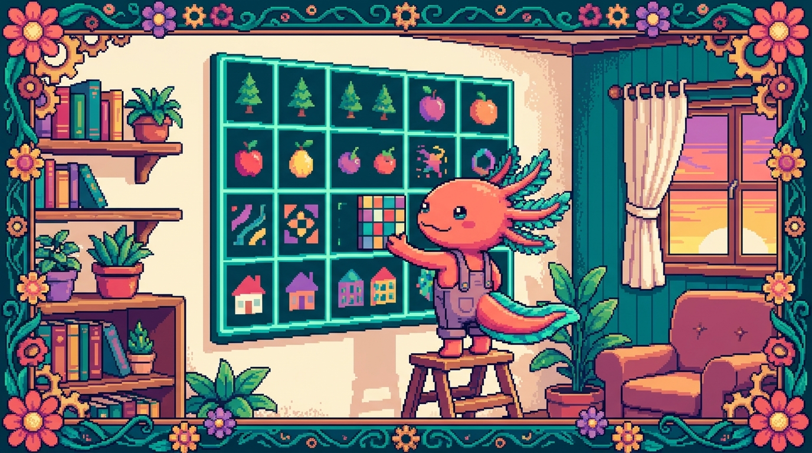

# Capítulo 09 — CSS Grid a fondo

<p align="center">
  
</p>


> ¡Hola de nuevo! Soy **Bit**, tu ajolote acompañante. 🦎 En el capítulo pasado vimos cómo alinear cosas en una sola dirección con Flexbox. Hoy damos un paso más: vamos a dibujar **cuadrículas de verdad**, con filas *y* columnas a la vez. Piensa en una hoja de papel cuadriculado: tú decides cuántas casillas hay y dónde se coloca cada cosa. Eso es **CSS Grid**, y es lo que CSS tiene para maquetar páginas completas. Respira hondo, sírvete un vaso de agua y vamos sin prisa. De verdad: cada concepto lo veremos con calma y con ejemplos sacados de tus propios proyectos.

---

## 1. ¿Por qué existe CSS Grid?

Antes de Grid, maquetar una página en dos dimensiones (filas y columnas al mismo tiempo) era un suplicio. Tocaba recurrir a trucos con `float`, a tablas o a cálculos manuales de porcentajes. Funcionaba... más o menos, y se rompía con una facilidad pasmosa.

CSS Grid nació precisamente para eso: **organizar el espacio en dos dimensiones** de manera clara y predecible. Tú defines una rejilla —la cuadrícula— y luego decides qué va en cada casilla. Sin malabares.

> ### 🟦 ¿Qué significa? — *CSS Grid*
> Es un sistema de diseño (layout) de CSS que organiza elementos en **filas y columnas** a la vez, como una cuadrícula. Te sirve para armar la estructura general de una página —cabecera, menú lateral, contenido y pie— o para repartir un montón de tarjetas de forma ordenada. En tu proyecto **tunal-digital**, la sección de servicios con varias tarjetas alineadas es un caso de manual para Grid: una rejilla que se reacomoda sola según el ancho de la pantalla.

> ### 🟦 ¿Qué significa? — *Layout (maquetación)*
> "Layout" es, sin más, la **distribución de los elementos** en la pantalla: dónde va cada bloque, cuánto espacio ocupa y cómo se relaciona con los demás. Cuando decimos "maquetar", nos referimos a construir ese layout. Grid y Flexbox son las dos herramientas principales de CSS para hacerlo.

La idea de fondo de Grid es esta: hay un **contenedor** (el elemento padre, al que le pones `display: grid`) y dentro viven los **ítems** (los hijos directos, que se acomodan en la cuadrícula). Todo lo que veremos hoy gira alrededor de esos dos roles, así que conviene tenerlos claros desde ya.

---

## 2. Tu primera cuadrícula: `display: grid`

Empecemos por lo mínimo. Tienes un contenedor con varios hijos:

```html
<div class="tarjetas">
  <div class="tarjeta">Uno</div>
  <div class="tarjeta">Dos</div>
  <div class="tarjeta">Tres</div>
  <div class="tarjeta">Cuatro</div>
</div>
```

Y en tu `styles.css`:

```css
.tarjetas {
  display: grid;
}
```

> ### 🟦 ¿Qué significa? — *`display: grid`*
> Es la propiedad que **convierte un elemento en contenedor de cuadrícula**. En cuanto la pones, sus hijos directos pasan a ser ítems de la rejilla y empiezan a obedecer las reglas de Grid. Sirve para "encender" todo el sistema. En el manual, la clase `.tarjetas` usa justo esto para colocar las tarjetas de contenido en cuadrícula.

Si te quedas solo con `display: grid`, por defecto verás una única columna con cada hijo en su propia fila, uno debajo del otro. Todavía no es gran cosa: nos falta decirle **cuántas columnas** queremos. De eso va la siguiente sección.

> ### 💡 Tip
> `display: grid` afecta solo a los **hijos directos** del contenedor, nunca a los nietos. Si una tarjeta lleva cosas dentro, esas cosas no entran en la cuadrícula del padre; siguen sus propias reglas. Grid organiza un nivel a la vez.

---

## 3. Definir columnas con `grid-template-columns`

Aquí empieza lo bueno. Le indicamos a la cuadrícula cuántas columnas tiene y de qué ancho:

```css
.tarjetas {
  display: grid;
  grid-template-columns: 200px 200px 200px;
}
```

Eso crea **tres columnas de 200 píxeles cada una**. Los ítems se reparten de izquierda a derecha y, en cuanto se llenan las tres columnas, salta a una fila nueva por su cuenta.

> ### 🟦 ¿Qué significa? — *`grid-template-columns`*
> Define **cuántas columnas tiene la cuadrícula y qué ancho tiene cada una**. Le pasas una lista de medidas separadas por espacios, y cada medida es una columna. Sirve para controlar la estructura horizontal del diseño. En **tunal-digital**, podrías usarlo para que la sección de servicios muestre siempre, por ejemplo, tres tarjetas por fila en pantallas grandes.

Cada valor que escribes equivale a una columna. `200px 200px 200px` son tres columnas; `100px 300px` serían dos (una angosta y una ancha). Y nada te impide mezclar medidas:

```css
grid-template-columns: 150px 300px 150px;
```

Eso te da una columna central más ancha, flanqueada por dos angostas. Va perfecto para layouts tipo "barra lateral + contenido + barra lateral".

> ### ⚠️ Cuidado
> Si pones medidas fijas en píxeles y la suma de las columnas supera el ancho de la pantalla, el contenido se desbordará: se saldrá de la pantalla y aparecerá una barra de desplazamiento horizontal. Por eso rara vez usamos solo píxeles fijos para el layout completo. Enseguida conocerás una unidad mucho más amable: `fr`.

---

## 4. La unidad mágica: `fr`

Las medidas fijas como `200px` tienen un punto débil: no se adaptan. Si la pantalla es grande, sobra espacio; si es pequeña, falta. CSS Grid trae una unidad pensada justo para esto: `fr`.

> ### 🟦 ¿Qué significa? — *`fr` (fracción)*
> Es una unidad que representa **una fracción del espacio disponible** dentro de la cuadrícula. No es un tamaño fijo: reparte el espacio sobrante de forma proporcional. Sirve para que las columnas crezcan o se encojan solas según el ancho de la pantalla. Es la unidad estrella de Grid para los diseños fluidos.

Mira la diferencia:

```css
.tarjetas {
  display: grid;
  grid-template-columns: 1fr 1fr 1fr;
}
```

Esto crea **tres columnas iguales** que, entre las tres, ocupan todo el ancho disponible. Si la pantalla mide 900px, cada columna mide 300px; si mide 600px, cada una baja a 200px. Se adapta sola. ✨

El número antes de `fr` marca la **proporción**. Por ejemplo:

```css
grid-template-columns: 2fr 1fr;
```

Aquí la primera columna se lleva **el doble de espacio** que la segunda. Con 900px disponibles, la primera mide 600px y la segunda 300px. Piensa en `fr` como repartir una torta: `2fr 1fr` son tres porciones en total, dos para una columna y una para la otra.

> ### 💡 Tip
> Puedes mezclar `fr` con medidas fijas. Por ejemplo, `grid-template-columns: 250px 1fr` crea una barra lateral fija de 250px y un área de contenido que se queda con todo el resto. Es un patrón clásico para dashboards, y se parece mucho a la estructura de **Faro/Organizer**: un menú lateral de ancho fijo y un área principal flexible.

---

## 5. Espacios entre celdas: `gap`

Hasta ahora nuestras tarjetas están pegadas unas a otras, sin respiro. Para separarlas usamos `gap`.

> ### 🟦 ¿Qué significa? — *`gap`*
> Define el **espacio (el hueco) entre las celdas** de la cuadrícula, tanto entre columnas como entre filas. Sirve para darle aire al diseño sin tener que ponerle márgenes a cada ítem. En cualquier rejilla de tarjetas (como la `.tarjetas` del manual) es lo que separa una tarjeta de otra de manera uniforme.

```css
.tarjetas {
  display: grid;
  grid-template-columns: 1fr 1fr 1fr;
  gap: 16px;
}
```

Con eso, hay 16px de separación entre todas las tarjetas, tanto en horizontal como en vertical. Limpio y parejo.

Y si quieres separaciones distintas para filas y columnas, le das dos valores:

```css
gap: 24px 16px; /* 24px entre filas, 16px entre columnas */
```

El primer valor va para las filas (vertical) y el segundo para las columnas (horizontal).

> ### 💡 Tip
> `gap` solo abre espacio **entre** celdas, nunca en los bordes externos de la cuadrícula. Para separar la rejilla del borde de la página, usa `padding` en el contenedor. Así controlas por separado el "aire interno" (gap) y el "aire de alrededor" (padding).

> ### 🔎 En tu código
> Si tu proyecto **RachaSimple** usa Tailwind, esta misma idea aparece con clases como `grid grid-cols-3 gap-4`. `grid` es `display: grid`, `grid-cols-3` son tres columnas iguales y `gap-4` es el `gap`. Es exactamente lo que estás aprendiendo, solo que con nombres más cortos. Entender Grid "puro" hace que Tailwind se te vuelva transparente.

---

## 6. Menos repetición: `repeat()`

Escribir `1fr 1fr 1fr 1fr` para cuatro columnas se aguanta, pero imagina hacerlo con doce. Sería un rollo. Para eso existe `repeat()`.

> ### 🟦 ¿Qué significa? — *`repeat()`*
> Es una función de CSS que **repite un patrón de columnas (o filas) un número de veces**, para no tener que escribirlo a mano. Sirve para acortar y volver más legible la definición de la cuadrícula. Cuanto más grande sea la rejilla, más se agradece.

```css
.tarjetas {
  display: grid;
  grid-template-columns: repeat(3, 1fr);
  gap: 16px;
}
```

`repeat(3, 1fr)` quiere decir "repite `1fr` tres veces"; o sea, es idéntico a `1fr 1fr 1fr`, pero más corto. La sintaxis es `repeat(cuántas-veces, qué-medida)`.

También puedes repetir patrones más elaborados:

```css
grid-template-columns: repeat(2, 200px 1fr);
```

Eso repite el patrón `200px 1fr` dos veces, lo que da cuatro columnas: `200px 1fr 200px 1fr`. Pero no te enredes con esto al principio; lo más habitual, y lo más útil, es `repeat(N, 1fr)`.

> ### 💡 Tip
> `repeat()` no es exclusivo de las columnas: también funciona en `grid-template-rows` para repetir filas. La lógica es exactamente la misma.

---

## 7. Columnas que se adaptan: `minmax()`, `auto-fill` y `auto-fit`

Llegamos a una de las partes más bonitas de Grid: **rejillas que se reacomodan solas** según el espacio, sin tener que escribir una media query por cada tamaño de pantalla. Vayamos por partes.

> ### 🟦 ¿Qué significa? — *media query (consulta de medios)*
> Es una regla de CSS que aplica estilos **solo cuando se cumple una condición**, normalmente relacionada con el ancho de la pantalla (por ejemplo: "si la pantalla mide menos de 600px, haz esto"). Tradicionalmente se usaban para cambiar el número de columnas según el dispositivo. Lo curioso de lo que verás ahora es que Grid consigue ese mismo efecto responsivo **sin una sola media query**, lo que te ahorra un montón de código.

### `minmax()`

> ### 🟦 ¿Qué significa? — *`minmax()`*
> Es una función que define un **rango de tamaño**: un mínimo y un máximo. Le dices "esta columna nunca debe ser más angosta que X ni más ancha que Y". Sirve para que las columnas se adapten sin pasarse ni de pequeñas ni de grandes.

```css
grid-template-columns: minmax(200px, 1fr);
```

Esto dice: "la columna mide como mínimo 200px y como máximo 1fr (todo el espacio disponible)". Es decir, nunca baja de 200px, pero si hay espacio de sobra, crece para aprovecharlo.

### `auto-fill` y `auto-fit`

Ahora combinamos `repeat()` con `minmax()` y una palabra clave especial. Este es **el patrón estrella** para rejillas de tarjetas responsivas:

```css
.tarjetas {
  display: grid;
  grid-template-columns: repeat(auto-fit, minmax(220px, 1fr));
  gap: 16px;
}
```

Vamos a desmenuzarlo despacio, porque vale la pena entenderlo bien. 🦎

> ### 🟦 ¿Qué significa? — *`auto-fit`*
> Es una palabra clave que va dentro de `repeat()` en el lugar del número. Le dice a Grid: **"crea tantas columnas como quepan"** en el espacio disponible, y haz que las columnas existentes **se estiren** para llenar todo el ancho. Sirve para rejillas que cambian solas de número de columnas, sin media queries.

> ### 🟦 ¿Qué significa? — *`auto-fill`*
> Es casi idéntico a `auto-fit`, pero con un matiz: cuando sobra espacio, `auto-fill` **deja columnas vacías** (huecos invisibles) en lugar de estirar las que tienen contenido. `auto-fit`, en cambio, colapsa esos huecos y estira las tarjetas. Para galerías de tarjetas, casi siempre te conviene `auto-fit`.

Traducido al español, `repeat(auto-fit, minmax(220px, 1fr))` viene a decir:

> "Crea tantas columnas como quepan, donde cada una mida mínimo 220px y máximo 1fr; y estira las que haya para llenar el ancho."

¿El resultado? En una pantalla ancha verás 4 o 5 tarjetas por fila; en una tablet, 2 o 3; en un móvil, 1. **Todo automático**, sin escribir ni una media query. Es justo lo que hace que la `.tarjetas` del manual se vea bien en cualquier dispositivo.

> ### ⚠️ Cuidado
> La diferencia entre `auto-fit` y `auto-fill` solo salta a la vista cuando hay **pocas tarjetas y mucho espacio**. Con `auto-fit`, dos tarjetas se estiran hasta ocupar toda la fila. Con `auto-fill`, esas dos tarjetas se quedan en su tamaño mínimo y dejan el resto de la fila vacío. Si tu galería se ve con tarjetas "demasiado estiradas", quizá quieras `auto-fill`; si se ve "apretada a la izquierda con un hueco a la derecha", quieres `auto-fit`.

> ### 🔎 En tu código
> Este patrón le viene como anillo al dedo a la lista de proyectos de **Faro/Organizer**, donde cada proyecto es una tarjeta y no sabes cuántas habrá. Una sola línea de Grid y la rejilla se acomoda sola, tenga 2 proyectos o 20. En Tailwind harías algo parecido con utilidades de grid responsivas, pero conocer el CSS de base te deja ver qué está pasando por debajo.

---

## 8. Definir filas con `grid-template-rows`

Hasta aquí nos hemos centrado en las columnas, porque las filas suelen crecer solas según el contenido. Pero hay momentos en que quieres controlar la altura de las filas tú mismo.

> ### 🟦 ¿Qué significa? — *`grid-template-rows`*
> Es el equivalente vertical de `grid-template-columns`: define **cuántas filas tiene la cuadrícula y qué altura tiene cada una**. Sirve cuando necesitas filas de altura concreta, por ejemplo una cabecera de 80px, un cuerpo flexible y un pie de 60px.

```css
.layout {
  display: grid;
  grid-template-rows: 80px 1fr 60px;
  min-height: 100vh;
}
```

Eso arma una página con tres filas: cabecera de 80px arriba, contenido que se queda con todo el espacio sobrante (`1fr`) en medio, y pie de 60px abajo. El `min-height: 100vh` hace que la cuadrícula ocupe al menos toda la altura de la ventana.

> ### 🟦 ¿Qué significa? — *`vh` (viewport height)*
> Es una unidad donde `100vh` equivale al **100% de la altura visible de la ventana** del navegador. `50vh` sería la mitad de la pantalla. Sirve para que un elemento ocupe la altura de la pantalla sin importar el tamaño del dispositivo. Se ve muchísimo en cabeceras "a pantalla completa".

> ### 💡 Tip
> Existe también `grid-template-areas`, una forma de nombrar zonas de la cuadrícula con palabras. La veremos en la sección 10. Por ahora, quédate con esto: columnas con `grid-template-columns`, filas con `grid-template-rows`. Mismo concepto, distinto eje.

---

## 9. Colocar elementos a mano: `grid-column` y `grid-row`

Hasta ahora dejábamos que Grid colocara las tarjetas solo, en orden. Pero a veces quieres que **un ítem concreto ocupe más de una columna o fila**, o que vaya a un sitio específico. Para eso usamos `grid-column` y `grid-row` en el ítem, no en el contenedor.

Para entenderlo, necesitamos un concepto clave: las **líneas de la cuadrícula**.

> ### 🟦 ¿Qué significa? — *Líneas de la cuadrícula (grid lines)*
> Son las **líneas imaginarias que separan las columnas y las filas**, numeradas empezando en 1. En una rejilla de 3 columnas hay 4 líneas verticales: la línea 1 está antes de la primera columna, la 2 entre la primera y la segunda, y así hasta la 4 al final. Para colocar un ítem, le dices entre qué líneas debe ir. Sirve para posicionar elementos con precisión.

Imagina una rejilla de 3 columnas. Las líneas verticales se numeran 1, 2, 3, 4:

```
1   2   3   4
| A | B | C |
```

Si quiero que un ítem ocupe **desde la línea 1 hasta la línea 3** (es decir, las dos primeras columnas), escribo:

```css
.tarjeta-destacada {
  grid-column: 1 / 3;
}
```

> ### 🟦 ¿Qué significa? — *`grid-column`*
> Indica **en qué columnas se coloca un ítem**, usando los números de línea: `inicio / fin`. `1 / 3` significa "empieza en la línea 1 y termina en la línea 3", ocupando todo lo que haya en medio (dos columnas). Sirve para que un elemento abarque varias columnas o caiga en una posición concreta. Va muy bien, por ejemplo, para una tarjeta destacada que ocupe el doble de ancho.

> ### 🟦 ¿Qué significa? — *`grid-row`*
> Es lo mismo que `grid-column`, pero en vertical: indica **en qué filas se coloca un ítem**, también con `inicio / fin`. `grid-row: 1 / 3` haría que el ítem ocupe dos filas de alto. Sirve para elementos altos, como una barra lateral que abarca varias filas.

Y hay un atajo de lo más cómodo con `span`:

```css
.tarjeta-destacada {
  grid-column: span 2; /* ocupa 2 columnas, empezando donde toque */
}
```

> ### 🟦 ¿Qué significa? — *`span`*
> Es una palabra clave que significa **"abarca esta cantidad de celdas"** sin tener que pensar en números de línea exactos. `span 2` quiere decir "ocupa 2 columnas (o filas) a partir de donde el ítem caiga naturalmente". Sirve para hacer un elemento más ancho o más alto sin ponerte a calcular líneas.

```css
.layout {
  display: grid;
  grid-template-columns: repeat(4, 1fr);
  gap: 12px;
}

.banner {
  grid-column: span 4; /* ocupa las 4 columnas: ancho completo */
}

.principal {
  grid-column: span 3; /* ocupa 3 de las 4 columnas */
}

.lateral {
  grid-column: span 1; /* ocupa 1 columna */
}
```

> ### 🔎 En tu código
> En **tunal-digital**, podrías hacer que el primer servicio (el más importante) ocupe el doble de ancho que los demás con `grid-column: span 2`. Es una forma de crear jerarquía visual sin tocar el HTML: solo CSS. El contenido manda, y la presentación la decide la hoja de estilos.

---

## 10. Zonas con nombre: `grid-template-areas`

Para mí, esta es la forma más bonita y legible de maquetar páginas completas. En lugar de pensar en números de línea, **dibujas el layout con palabras**.

> ### 🟦 ¿Qué significa? — *`grid-template-areas`*
> Es una propiedad que te deja **nombrar zonas de la cuadrícula y dibujar su disposición** como si fuera un mapa de texto. Cada palabra es una celda; las palabras repetidas significan que esa zona se extiende. Sirve para definir layouts complejos de una forma muy visual y fácil de leer. Es ideal para la estructura general de una app como **Faro/Organizer**.

Primero, en cada ítem le pones un nombre con `grid-area`:

```css
.cabecera { grid-area: cabecera; }
.menu     { grid-area: menu; }
.contenido { grid-area: contenido; }
.pie      { grid-area: pie; }
```

Y luego, en el contenedor, dibujas el mapa:

```css
.app {
  display: grid;
  grid-template-columns: 200px 1fr;
  grid-template-rows: 80px 1fr 60px;
  grid-template-areas:
    "cabecera cabecera"
    "menu     contenido"
    "pie      pie";
  min-height: 100vh;
}
```

Lee ese bloque de comillas como si fuera un dibujo:

- Fila 1: `cabecera cabecera` → la cabecera ocupa las **dos columnas** (ancho completo).
- Fila 2: `menu contenido` → el menú a la izquierda (200px), el contenido a la derecha (1fr).
- Fila 3: `pie pie` → el pie ocupa las dos columnas.

> ### 🟦 ¿Qué significa? — *`grid-area`*
> Es la propiedad que le pone un **nombre a un ítem** para que `grid-template-areas` sepa dónde colocarlo. El nombre que escribas aquí tiene que coincidir con el que uses en el mapa de zonas. Sirve para conectar cada elemento con su lugar en la cuadrícula.

¿A que es precioso? Cualquiera que lea ese CSS entiende de un vistazo cómo se ve la página. Es prácticamente un dibujo hecho en texto.

> ### 💡 Tip
> Si quieres dejar una celda **vacía** en el mapa, pon un punto `.` en su lugar. Por ejemplo, `"menu ."` deja la zona de la derecha vacía en esa fila. Y ojo: todas las filas del mapa deben tener el **mismo número de columnas**, o el navegador ignorará la regla por completo.

> ### ⚠️ Cuidado
> Los nombres en `grid-template-areas` no llevan comillas individuales ni comas: cada fila entera va entre comillas dobles, y las filas se colocan una debajo de otra. Un error típico es olvidar las comillas o meter comas entre palabras. Si tu layout "no hace nada", revisa primero la sintaxis del mapa.

---

## 11. Grid vs Flexbox: ¿cuándo uso cada uno?

Esta es la gran pregunta, y la respuesta es más sencilla de lo que suele parecer. 🦎

> ### 🟦 ¿Qué significa? — *Flexbox*
> Es el otro gran sistema de layout de CSS (lo viste en el capítulo anterior). Organiza elementos en **una sola dirección a la vez**: una fila *o* una columna. Sirve para alinear y distribuir un grupo de elementos en línea, como los botones de una barra o los ítems de un menú.

La regla mental que te recomiendo es esta:

- **Flexbox = una dimensión.** Una fila o una columna. Ideal para: barras de navegación, alinear un icono junto a un texto, repartir botones, centrar algo dentro de su contenedor.
- **Grid = dos dimensiones.** Filas y columnas a la vez. Ideal para: la estructura general de la página, galerías de tarjetas, dashboards, cualquier cosa que sea una "cuadrícula" de verdad.

| Situación | Mejor herramienta |
|---|---|
| Barra de navegación horizontal | Flexbox |
| Centrar un botón dentro de una caja | Flexbox |
| Galería de tarjetas que se reacomoda | Grid |
| Layout cabecera + menú + contenido + pie | Grid |
| Lista de etiquetas (tags) en línea | Flexbox |
| Tablero con muchas zonas | Grid |

> ### 💡 Tip
> No es "Grid contra Flexbox": **se usan juntos todo el tiempo**. Lo normal es usar Grid para la estructura grande de la página y, dentro de cada tarjeta o celda, usar Flexbox para alinear su contenido interno. Piensa en Grid como los planos de la casa y en Flexbox como la forma en que acomodas los muebles dentro de cada habitación.

> ### 🔎 En tu código
> En **RachaSimple** (React + Tailwind) verás esta combinación por todos lados: una rejilla de tarjetas con clases de grid y, dentro de cada tarjeta, un `flex` para alinear el título, el icono y el botón. Saber distinguir cuándo toca uno y cuándo el otro hará que escribas mucho menos CSS, y más limpio.

---

## 12. Juntándolo todo: la cuadrícula `.tarjetas`

Vamos a reconstruir paso a paso la rejilla de tarjetas que usa este manual, para que veas todas las piezas funcionando juntas:

```css
.tarjetas {
  display: grid;                                       /* activa Grid */
  grid-template-columns: repeat(auto-fit, minmax(220px, 1fr)); /* columnas adaptables */
  gap: 1rem;                                           /* aire entre tarjetas */
  padding: 1rem;                                       /* aire alrededor de la rejilla */
}

.tarjeta {
  background: var(--color-tarjeta);                    /* color según el tema */
  border-radius: 8px;
  padding: 1rem;
}
```

Repasemos qué hace cada línea, ahora que ya tienes todos los conceptos frescos:

1. `display: grid` activa la cuadrícula.
2. `repeat(auto-fit, minmax(220px, 1fr))` crea tantas columnas como quepan, de mínimo 220px, estirándose para llenar el ancho.
3. `gap: 1rem` separa las tarjetas entre sí.
4. `padding: 1rem` separa la rejilla del borde del contenedor.

> ### 🟦 ¿Qué significa? — *`var(--color-tarjeta)`*
> Es una **variable CSS**: un valor guardado bajo un nombre (que empieza con `--`) y reutilizado con `var()`. Sirve para no repetir el mismo color en mil sitios y para cambiar de tema (claro/oscuro) tocando una sola línea. El propio `estilos.css` de este manual usa variables CSS justo para sus temas, igual que aquí.

Con esas pocas líneas tienes una galería profesional, responsiva y que se adapta sola a cualquier pantalla. **Ahí está la elegancia de Grid.** Antes, lo mismo requería decenas de líneas y trucos frágiles; hoy son cuatro propiedades bien elegidas.

> ### 🔎 En tu código
> Si abres el `styles.css` de **tunal-digital** y te encuentras una sección con varias cajas alineadas a mano (con floats o porcentajes), este es el momento perfecto para cambiarla por una rejilla `auto-fit`. Menos código, más robusto y responsivo desde el primer momento. Pruébalo y verás cuántas líneas terminas borrando.

---

## ✅ Checklist — ¿ya domino esto?

- [ ] Sé que `display: grid` convierte un elemento en contenedor de cuadrícula y afecta a sus hijos directos.
- [ ] Entiendo que `grid-template-columns` define el número y ancho de las columnas.
- [ ] Sé qué es la unidad `fr` y cómo reparte el espacio disponible de forma proporcional.
- [ ] Puedo usar `gap` para separar las celdas entre sí.
- [ ] Sé acortar definiciones con `repeat(N, 1fr)`.
- [ ] Entiendo `minmax()` y el patrón `repeat(auto-fit, minmax(220px, 1fr))` para rejillas responsivas.
- [ ] Distingo `auto-fit` de `auto-fill`.
- [ ] Puedo colocar un ítem con `grid-column` / `grid-row` y con `span`.
- [ ] Sé dibujar un layout con `grid-template-areas` y `grid-area`.
- [ ] Tengo claro cuándo usar Grid (dos dimensiones) y cuándo Flexbox (una dimensión).

---

## 🧪 Ejercicios

1. **En papel (sin computadora).** Dibuja una rejilla de 3 columnas y 2 filas. Numera todas las líneas verticales y horizontales. Luego marca qué celdas ocuparía un ítem con `grid-column: 1 / 3` y `grid-row: 1 / 2`. Esto entrena tu intuición sobre las líneas de la cuadrícula.

2. **💻 Primera rejilla.** En un archivo HTML con un `<div class="tarjetas">` que contenga 6 `<div class="tarjeta">`, escribe en CSS una cuadrícula de 3 columnas iguales con `repeat(3, 1fr)` y `gap: 16px`. Observa cómo se acomodan las 6 tarjetas en dos filas de tres.

3. **💻 Rejilla responsiva.** Cambia el ejercicio anterior a `grid-template-columns: repeat(auto-fit, minmax(200px, 1fr))`. Redimensiona la ventana del navegador (hazla angosta y luego ancha) y observa cómo cambia el número de columnas **sin tocar nada más**. Anota cuántas tarjetas por fila ves en cada tamaño.

4. **💻 Tarjeta destacada.** Sobre la rejilla del ejercicio 2, haz que la primera tarjeta ocupe dos columnas usando `grid-column: span 2`. Comprueba cómo el resto se reacomoda alrededor.

5. **💻 Layout completo con áreas.** Crea una página con cuatro zonas: `cabecera`, `menu`, `contenido` y `pie`. Usa `grid-template-areas` para que la cabecera y el pie ocupen todo el ancho, y el menú quede a la izquierda del contenido. Pista: revisa el ejemplo de la sección 10.

6. **💻 Grid + Flexbox juntos.** Toma cualquier tarjeta de tu rejilla y, dentro de ella, usa Flexbox (`display: flex`) para alinear un título arriba y un botón abajo del todo. Así practicas la combinación real que verás en proyectos como **RachaSimple** y **Faro/Organizer**.

---

> ¡Lo lograste! 🦎 Hoy aprendiste la herramienta más poderosa de CSS para maquetar. Si al principio `repeat(auto-fit, minmax(...))` te sonó a trabalenguas, tranquilo: con dos o tres ejercicios se vuelve tu mejor amiga. La próxima vez que veas una galería de tarjetas perfectamente alineada en cualquier web, sabrás exactamente cómo está hecha. Descansa, hidrátate y nos vemos en el siguiente capítulo. — Bit
