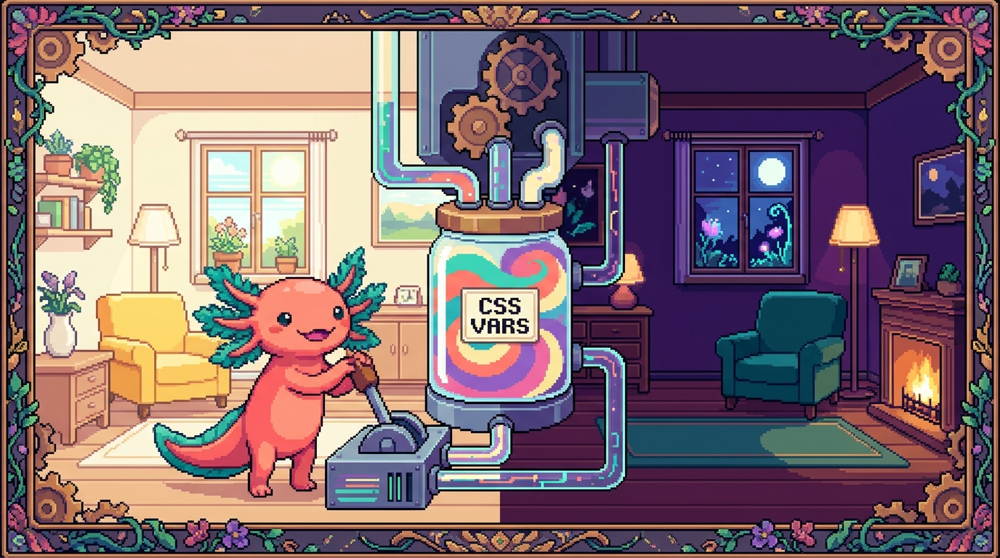

# Capítulo 12 — Variables CSS y temas

<p align="center">
  
</p>


> Hasta ahora has repetido colores y medidas una y otra vez por todo tu CSS. Imagina que el verde de tu marca aparece en treinta sitios y un día decides que ahora va a ser azul: te toca cazar esos treinta lugares uno por uno. En este capítulo Bit, nuestro ajolote favorito, te enseña a guardar un valor en una sola caja con nombre y reutilizarlo en todas partes. Eso son las **variables CSS**. Con ellas vas a montar, paso a paso, un tema claro y un tema oscuro de verdad. Es uno de los trucos más satisfactorios del CSS moderno.

---

## 1. ¿Qué problema resuelven las variables?

Imagina el `styles.css` de **tunal-digital**. En el header pintas el verde de marca. En los botones, el mismo verde. En los enlaces al pasar el ratón, otra vez el verde. Tres lugares, tres veces el código `#1f9d55`.

El problema no es escribirlo tres veces. El problema es **mantenerlo**: el día que cambie el verde tienes que acordarte de todos los rincones donde lo metiste, y seguro que alguno se te escapa. Las variables convierten ese verde en un nombre. Lo defines **una vez**, y donde antes había treinta copias del color ahora hay treinta referencias al mismo nombre. Cambias el valor en un sitio y todo el sitio web cambia con él.

> ### 🟦 ¿Qué significa? — *Variable CSS (custom property)*
> Una **variable CSS**, también llamada *custom property* (propiedad personalizada), es un nombre que tú inventas y al que le guardas un valor: un color, un tamaño, una fuente, lo que necesites. Su nombre **siempre empieza con dos guiones**, por ejemplo `--color-marca`. Sirve para no repetir valores y para poder cambiarlos en un solo lugar. En un repo real como **tunal-digital** la usarías para guardar los colores y espaciados de la marca; el propio `site/estilos.css` de este manual las usa para definir sus colores y sus temas.

Bit lo cuenta así: una variable es como ponerle una etiqueta a un frasco. En vez de decir "el líquido verde del frasco número 47", dices "salsa". Y si un día cambias el contenido del frasco "salsa", todas las recetas que pedían "salsa" usan el nuevo contenido sin que toques una sola receta.

---

## 2. Declarar una variable: `--nombre`

Una variable se **declara** (se crea) escribiendo su nombre con dos guiones al frente y dándole un valor, igual que cualquier propiedad CSS:

```css
:root {
  --color-marca: #1f9d55;
  --color-texto: #1a1a1a;
  --espacio-base: 16px;
  --radio-borde: 8px;
}
```

> ### 🟦 ¿Qué significa? — *Declarar*
> **Declarar** una variable es crearla y darle un valor por primera vez. Lo haces escribiendo `--nombre: valor;` dentro de un bloque de reglas. Sirve para que la variable exista y tenga un contenido. En **tunal-digital** declararías al inicio de `styles.css` todas las variables de la paleta antes de empezar a usarlas.

Hay tres detalles que conviene tener claros desde el principio:

- El nombre empieza con `--` (dos guiones). Sin eso, no es una variable.
- Distingue mayúsculas de minúsculas: `--Color` y `--color` son **dos variables distintas**.
- Puedes usar guiones para separar palabras: `--color-marca`, `--espacio-base`. Es la costumbre más extendida.

> ### 💡 Tip
> Ponles nombres que digan **para qué sirven**, no qué color son. `--color-marca` es mejor que `--verde`, porque si mañana la marca cambia a azul, el nombre `--color-marca` sigue teniendo sentido y `--verde: blue` quedaría ridículo.

---

## 3. `:root`: el lugar donde viven las variables globales

¿Y qué es ese `:root` donde declaramos las variables arriba? Es el sitio habitual para las variables que quieres usar **en toda la página**.

> ### 🟦 ¿Qué significa? — *`:root`*
> `:root` es un **selector** especial que apunta al elemento más alto del documento: la etiqueta `<html>`. Sirve para declarar variables que quieres tener disponibles en **toda** la página. Se usa al principio del CSS para definir la paleta y las medidas globales. En el `site/estilos.css` de este manual, los colores del tema viven dentro de `:root`.

Técnicamente `:root` es lo mismo que el selector `html`, pero tiene un pelín más de prioridad y, sobre todo, es la convención: cuando alguien lee tu CSS y se encuentra con `:root`, entiende al instante que ahí están las variables globales del proyecto. Por eso casi todo el mundo lo usa para esto.

> ### 🔎 En tu código
> Abre el `styles.css` de **tunal-digital**. Si todavía no tiene un bloque `:root`, ese es tu primer ejercicio del capítulo: crea uno y mete ahí los colores que más repites. Verás cómo el archivo empieza a leerse como una receta, con su lista de ingredientes bien colocada arriba.

---

## 4. Usar una variable: `var()`

Declarar la variable no pinta nada por sí solo. Para **usar** su valor llamas a la función `var()` con el nombre de la variable dentro:

```css
:root {
  --color-marca: #1f9d55;
  --color-texto: #1a1a1a;
  --espacio-base: 16px;
}

body {
  color: var(--color-texto);
}

.boton {
  background-color: var(--color-marca);
  padding: var(--espacio-base);
}

.enlace:hover {
  color: var(--color-marca);
}
```

> ### 🟦 ¿Qué significa? — *`var()`*
> `var()` es la **función** que lee el valor guardado en una variable y lo coloca donde la escribes. Le pasas el nombre de la variable entre paréntesis: `var(--color-marca)`. Sirve para reutilizar el valor sin repetirlo. En **tunal-digital**, cada botón, enlace y borde que use la marca llamará a `var(--color-marca)` en lugar de copiar el código de color.

Y aquí viene lo bonito. Si mañana el verde cambia a otro tono, editas **una sola línea**:

```css
:root {
  --color-marca: #0d6efd; /* antes era verde, ahora es azul */
}
```

…y el header, los botones, los enlaces y todo lo que use `var(--color-marca)` cambian solos. Eso es lo que Bit llama "tocar un interruptor y que se encienda toda la casa".

> ### ⚠️ Cuidado
> No confundas declarar con usar. **Declarar** lleva dos guiones y dos puntos: `--color-marca: green;`. **Usar** lleva `var()`: `color: var(--color-marca);`. Si escribes `color: --color-marca;` (sin `var()`), no funciona y, lo peor, no salta ningún error rojo: simplemente el color no se aplica y te quedas mirando la pantalla sin entender nada. Es uno de los despistes más comunes al empezar.

---

## 5. Valor de respaldo: el segundo argumento de `var()`

¿Y qué pasa si llamas a una variable que no existe, o que se te olvidó declarar? Por defecto, esa propiedad no recibe ningún valor y se queda como estaba. Para protegerte de eso, `var()` acepta un **valor de respaldo**:

```css
.tarjeta {
  /* Si --color-borde no existe, usa #ddd */
  border: 1px solid var(--color-borde, #ddd);
}
```

> ### 🟦 ¿Qué significa? — *Valor de respaldo (fallback)*
> El **valor de respaldo** es un segundo valor que pones dentro de `var()`, separado por una coma, y que se usa **solo si la variable no está definida**. Sirve de red de seguridad para que tu estilo nunca quede roto si falta una variable. Viene bien cuando no estás seguro de que la variable exista, por ejemplo en componentes reutilizables o cuando un compañero podría no haber declarado todas las variables.

Lo lees así: "usa `--color-borde`; y si no existe, usa `#ddd`". El respaldo incluso puede ser otra variable:

```css
.tarjeta {
  border: 1px solid var(--color-borde, var(--color-marca, #ddd));
}
```

Eso encadena respaldos: intenta `--color-borde`; si no, `--color-marca`; y si tampoco, el gris `#ddd`. Bit te avisa de que tres niveles ya son bastantes; más que eso y nadie va a entender qué color acaba saliendo.

> ### 💡 Tip
> El respaldo es perfecto para componentes que quieres compartir entre proyectos. Si copias una tarjeta de **tunal-digital** a otro sitio que no tiene las mismas variables, el fallback evita que la tarjeta se vea rota mientras terminas de configurar los colores nuevos.

---

## 6. Alcance: ¿hasta dónde llega una variable?

Las variables CSS **se heredan**. Suena técnico, pero es muy intuitivo: una variable declarada en un elemento está disponible en ese elemento **y en todo lo que tenga dentro** (sus hijos, sus nietos, etc.). Por eso `:root`, que es el ancestro de todo, las reparte a la página entera.

> ### 🟦 ¿Qué significa? — *Alcance (scope)*
> El **alcance** de una variable es la zona del documento donde se puede usar. Si la declaras en `:root`, su alcance es toda la página. Si la declaras dentro de `.tarjeta`, su alcance es solo esa tarjeta y lo que esté dentro de ella. Sirve para tener valores diferentes en partes diferentes sin que se pisen. Se usa, por ejemplo, para que una sección "destacada" de **tunal-digital** tenga su propia variante de color sin afectar al resto.

Mira este ejemplo: una misma variable con valores distintos según dónde la declares.

```css
:root {
  --fondo: white;   /* por defecto, todo es blanco */
}

.seccion-oscura {
  --fondo: #111;    /* aquí dentro, --fondo vale negro */
}

.caja {
  background-color: var(--fondo);
}
```

Una `.caja` suelta en la página será blanca. La misma `.caja` colocada **dentro** de `.seccion-oscura` será negra, porque ahí dentro `--fondo` vale otra cosa. No tocaste la regla de `.caja`: solo cambió el ambiente que la rodea. A esto se le llama **redefinir** la variable en un alcance más pequeño, y es la base de los temas que montaremos enseguida.

> ### ⚠️ Cuidado
> Una variable declarada dentro de `.tarjeta` **no existe** fuera de `.tarjeta`. Si intentas usarla en otro lado, recibirás su valor de respaldo (si lo pusiste) o nada. Dicho de otra forma: las variables bajan a los hijos, pero no suben a los padres ni saltan a los hermanos.

---

## 7. Cambiar variables con JavaScript

Aquí es donde las variables CSS se vuelven mágicas. Como son propiedades del documento, **JavaScript puede cambiarlas en vivo**, y todo lo que las usa se actualiza al instante sin recargar la página.

Esto es justo lo que necesita el `main.js` de **tunal-digital** para, por ejemplo, un botón que cambie el tema.

```js
// Cambiar una variable global (la de :root) desde JS
document.documentElement.style.setProperty("--color-marca", "#0d6efd");
```

> ### 🟦 ¿Qué significa? — *`setProperty`*
> `setProperty` es una función de JavaScript que asigna un valor a una propiedad CSS de un elemento, incluidas las variables. La usas como `elemento.style.setProperty("--nombre", "valor")`. Sirve para cambiar estilos desde el código en tiempo real. En el `main.js` de **tunal-digital** la usarías para que un clic cambie un color o el tamaño de la fuente.

Desglosemos esa línea, porque tiene tres piezas:

> ### 🟦 ¿Qué significa? — *`document.documentElement`*
> `document.documentElement` es la forma en que JavaScript se refiere a la etiqueta `<html>`, que es el mismo elemento al que apunta `:root` en CSS. Sirve para leer o cambiar las variables globales desde el código. Se usa cuando quieres que un cambio de JS afecte a toda la página, no solo a un trozo.

Así que `document.documentElement.style.setProperty("--color-marca", "#0d6efd")` se lee como: "en el `<html>`, pon la variable `--color-marca` en azul". Y como esa variable la usa todo el sitio vía `var()`, todo el sitio se pone azul de golpe.

También puedes **leer** el valor actual de una variable:

```js
const estilos = getComputedStyle(document.documentElement);
const verde = estilos.getPropertyValue("--color-marca").trim();
console.log(verde); // "#1f9d55"
```

> ### 🟦 ¿Qué significa? — *`getComputedStyle`*
> `getComputedStyle` es una función de JavaScript que devuelve **todos los estilos finales** que el navegador ha calculado para un elemento, ya resueltos. Le pasas el elemento entre paréntesis: `getComputedStyle(document.documentElement)`. Sirve para **leer** valores (incluidas las variables CSS) tal y como están aplicados en ese momento. En el `main.js` de **tunal-digital** la usarías para averiguar qué color de marca está activo antes de decidir si lo cambias.

> ### 🟦 ¿Qué significa? — *`getPropertyValue`*
> `getPropertyValue` es la función que, sobre los estilos que te dio `getComputedStyle`, **extrae el valor de una propiedad concreta** por su nombre. La usas como `estilos.getPropertyValue("--color-marca")` y te devuelve el valor guardado en esa variable. Sirve para leer una variable desde JavaScript. En **tunal-digital** la combinarías con `getComputedStyle` para consultar el valor actual de cualquier variable de tu paleta.

El `.trim()` quita los espacios sobrantes que a veces vienen pegados al valor. Bit recomienda acostumbrarse a ponerlo siempre que leas variables, para no llevarte sorpresas con un espacio invisible.

> ### 🔎 En tu código
> En **RachaSimple** (React + TS + Tailwind), normalmente no escribes `setProperty` a mano para los temas: de eso se encargan Tailwind y su clase `dark`. Pero entender este mecanismo te ayuda a saber qué hace Tailwind por debajo. En **tunal-digital**, que es JS vanilla, sí escribirías `setProperty` tú mismo en `main.js`. Misma idea, distinto nivel de ayuda.

---

## 8. Tu primer tema: claro y oscuro a mano

Ya tienes todas las piezas para construir un tema. La idea central es sencilla: **no cambies cien propiedades; cambia las variables**. Defines tus colores como variables, y el "tema oscuro" no es más que el mismo conjunto de variables con otros valores.

> ### 🟦 ¿Qué significa? — *Tema (theme)*
> Un **tema** es un conjunto coordinado de colores (y a veces fuentes o sombras) que le dan un aspecto unificado a la interfaz. Lo típico es tener un tema **claro** (fondo claro, texto oscuro) y uno **oscuro** (fondo oscuro, texto claro). Sirve para que la app se vea bien y resulte cómoda en distintos ambientes. **RachaSimple** y el `site/estilos.css` de este manual tienen temas claro y oscuro.

Primero, las variables del tema claro en `:root`:

```css
:root {
  --fondo: #ffffff;
  --texto: #1a1a1a;
  --color-marca: #1f9d55;
  --borde: #e2e2e2;
}

body {
  background-color: var(--fondo);
  color: var(--texto);
}
```

Fíjate en que `body` **no menciona ningún color directo**: solo usa variables. Esa disciplina es justo lo que hace que cambiar de tema sea pan comido.

Ahora el tema oscuro. La forma más sencilla de activarlo a mano es ponerle una clase al `<html>` o al `<body>` (por ejemplo `tema-oscuro`) y redefinir las variables dentro de esa clase:

```css
.tema-oscuro {
  --fondo: #121212;
  --texto: #f0f0f0;
  --color-marca: #34d27b;
  --borde: #2a2a2a;
}
```

Y un botón en `main.js` que ponga o quite esa clase:

```js
const boton = document.querySelector("#cambiar-tema");

boton.addEventListener("click", () => {
  document.documentElement.classList.toggle("tema-oscuro");
});
```

> ### 🟦 ¿Qué significa? — *`classList.toggle`*
> `classList.toggle` es una función de JavaScript que **añade** una clase a un elemento si no la tiene, y la **quita** si ya la tenía. La usas como `elemento.classList.toggle("nombre-clase")`. Sirve para encender y apagar algo con el mismo botón. En **tunal-digital** la usarías para alternar entre tema claro y oscuro con un solo clic.

¿Ves lo elegante que queda? El botón solo pone o quita una clase. Esa clase redefine cuatro variables. Esas cuatro variables las usan decenas de elementos vía `var()`. Un clic, y la página entera cambia de piel. Bit aplaude con sus manitas de ajolote.

> ### 💡 Tip
> Pon todas las variables del tema en un mismo bloque y mantén el **mismo conjunto de nombres** en el claro y en el oscuro. Si en `:root` tienes `--fondo` y `--texto`, en `.tema-oscuro` deben aparecer exactamente esos mismos nombres con otros valores. Así nunca se te queda un color "a medias".

---

## 9. `prefers-color-scheme`: respetar lo que el usuario ya eligió

Hay un detalle precioso aquí: muchos usuarios **ya** tienen su teléfono o su computadora configurados en modo oscuro. Lo ideal sería que tu sitio respetara esa preferencia sin que tengan que tocar nada. Para eso existe `prefers-color-scheme`.

> ### 🟦 ¿Qué significa? — *`prefers-color-scheme`*
> `prefers-color-scheme` es una **media query** (consulta de medios) que pregunta si el sistema del usuario está en modo claro u oscuro. Sirve para mostrar automáticamente el tema que la persona ya prefiere. Se usa dentro de `@media (prefers-color-scheme: dark) { ... }` y es justo el mecanismo que el `site/estilos.css` de este manual usa para su tema oscuro automático.

> ### 🟦 ¿Qué significa? — *Media query*
> Una **media query** es una regla CSS que aplica estilos **solo cuando se cumple una condición**, como el ancho de la pantalla o, en este caso, la preferencia de color. Se escribe `@media (condición) { reglas }`. Sirve para adaptar el diseño a distintas situaciones. La verás mucho más en el capítulo de diseño responsivo; aquí la usamos solo para detectar el modo oscuro.

Así se ve un tema oscuro **automático**:

```css
:root {
  --fondo: #ffffff;
  --texto: #1a1a1a;
  --color-marca: #1f9d55;
}

@media (prefers-color-scheme: dark) {
  :root {
    --fondo: #121212;
    --texto: #f0f0f0;
    --color-marca: #34d27b;
  }
}

body {
  background-color: var(--fondo);
  color: var(--texto);
}
```

Con esto, una persona que tenga el móvil en modo oscuro abre tu sitio y lo ve oscuro **sin pulsar nada**. Una persona en modo claro lo ve claro. Y tú no escribiste ni una línea de JavaScript: el navegador hace el trabajo leyendo la preferencia del sistema.

> ### ⚠️ Cuidado
> `prefers-color-scheme` lee la preferencia del **sistema operativo**, no la de tu sitio. No puedes cambiarla desde CSS ni "forzarla" desde tu página; solo puedes reaccionar a ella. Si quieres un botón que el usuario controle dentro de tu sitio, eso es el método de la clase con JavaScript de la sección anterior.

---

## 10. Lo mejor de los dos mundos: automático + botón

En la práctica, los sitios serios combinan ambas cosas: **arrancan respetando el sistema** con `prefers-color-scheme`, y además ofrecen un **botón** por si el usuario quiere lo contrario en ese sitio concreto. La estrategia típica es esta:

1. Por defecto, el CSS sigue la preferencia del sistema (`prefers-color-scheme`).
2. Un botón en JS añade una clase como `tema-oscuro` o `tema-claro` al `<html>` para forzar uno u otro.
3. La clase "gana" porque la pusiste tú a propósito, así que sobrescribe lo automático.

```css
:root {
  --fondo: #ffffff;
  --texto: #1a1a1a;
}

/* Automático según el sistema */
@media (prefers-color-scheme: dark) {
  :root {
    --fondo: #121212;
    --texto: #f0f0f0;
  }
}

/* Forzado por el usuario, gana sobre lo automático */
.tema-oscuro {
  --fondo: #121212;
  --texto: #f0f0f0;
}
.tema-claro {
  --fondo: #ffffff;
  --texto: #1a1a1a;
}
```

> ### 🔎 En tu código
> En **RachaSimple** y **Faro/Organizer** (ambos con Tailwind), Tailwind ya trae el "modo oscuro" listo: pones la clase `dark` en el `<html>` y usas utilidades como `dark:bg-gray-900`. Por debajo, eso hace exactamente lo que viste aquí: detecta o fuerza un tema y reasigna colores. En **tunal-digital**, sin framework, tú escribes a mano las variables, la media query y el `classList.toggle`. Conocer el mecanismo "crudo" te hace entender mucho mejor lo que Tailwind te da ya hecho.

> ### 💡 Tip
> Si quieres que la elección del usuario **se recuerde** entre visitas, en **tunal-digital** guardarías la preferencia en `localStorage` desde `main.js` y, al cargar la página, leerías ese valor para volver a poner la clase. No te agobies si todavía no sabes qué es `localStorage`: por ahora basta con que tengas claro que el botón cambia una clase y la clase cambia las variables.

---

## 11. Variables más allá del color

Aunque los temas son el uso estrella, las variables sirven para **cualquier valor** que repitas. Una pequeña "escala" de espaciado y de tamaños mantiene todo el sitio coherente:

```css
:root {
  --espacio-1: 4px;
  --espacio-2: 8px;
  --espacio-3: 16px;
  --espacio-4: 32px;
  --radio: 8px;
  --fuente-base: system-ui, sans-serif;
}

.tarjeta {
  padding: var(--espacio-3);
  border-radius: var(--radio);
  font-family: var(--fuente-base);
  margin-bottom: var(--espacio-4);
}
```

Cuando todos tus márgenes y rellenos salen de una escala de variables, el diseño se ve ordenado casi sin esfuerzo, porque cada espacio es siempre "uno de los de la lista" en lugar de un número inventado al azar. Esta idea de tener una escala fija es, por cierto, justo lo que hace Tailwind en **RachaSimple** y **Faro**: te da una escala de espaciados predefinida para que no andes inventando valores raros.

> ### 💡 Tip
> Empieza con pocas variables. No conviertas en variable cada número del CSS desde el primer día; eso lo único que hace es saturar. Convierte en variable lo que **se repite** y lo que querrías cambiar de golpe: colores de marca, espaciados base, radios de borde, la fuente. El resto puede esperar.

---

## ✅ Checklist — ¿ya domino esto?

- [ ] Sé declarar una variable con `--nombre: valor;` dentro de un bloque.
- [ ] Sé que `:root` es el lugar para las variables globales de toda la página.
- [ ] Uso una variable con `var(--nombre)` y entiendo que sin `var()` no funciona.
- [ ] Sé poner un valor de respaldo: `var(--nombre, valorPorDefecto)`.
- [ ] Entiendo el alcance: una variable vive en el elemento donde la declaro y en sus hijos.
- [ ] Puedo redefinir una variable dentro de una clase para crear una variante.
- [ ] Sé cambiar una variable global desde JS con `document.documentElement.style.setProperty`.
- [ ] Sé alternar un tema con `classList.toggle("tema-oscuro")`.
- [ ] Sé crear un tema oscuro automático con `@media (prefers-color-scheme: dark)`.
- [ ] Entiendo que Tailwind (en RachaSimple y Faro) hace todo esto por debajo con la clase `dark`.

---

## 🧪 Ejercicios

1. **Tu paleta en `:root`.** 💻 Abre el `styles.css` de **tunal-digital** y crea un bloque `:root` con al menos cuatro variables: `--color-marca`, `--texto`, `--fondo` y `--borde`. Después busca en el archivo los colores que repetías "a mano" y reemplázalos por `var(...)`. Recarga y comprueba que el sitio se ve igual que antes.

2. **El interruptor mágico.** 💻 En ese mismo `:root`, cambia solo el valor de `--color-marca` por otro color muy distinto (por ejemplo de verde a morado). Recarga y observa cuántos elementos cambiaron de una sola línea. Anota cuáles para confirmar que las variables están bien conectadas.

3. **Respaldo a prueba de fallos.** Crea una regla `.aviso` con `border: 2px solid var(--color-aviso, orange);` **sin** declarar `--color-aviso` en ningún lado. Comprueba que el borde sale naranja. Luego declara `--color-aviso: red;` en `:root` y verifica que ahora sale rojo. Acabas de ver el fallback en acción.

4. **Alcance local.** Crea una clase `.destacado` que redefina `--fondo` y `--texto` con colores llamativos, y dentro de un elemento con esa clase coloca una `.tarjeta` que use `var(--fondo)` y `var(--texto)`. Comprueba que la tarjeta cambia solo cuando está dentro de `.destacado`, y no fuera.

5. **Tema oscuro con botón.** 💻 En **tunal-digital**, define una clase `.tema-oscuro` que redefina tus variables de color, añade un botón en el HTML y, en `main.js`, usa `classList.toggle("tema-oscuro")` sobre `document.documentElement` al hacer clic. Verifica que el sitio entero cambia de piel con cada pulsación.

6. **Tema oscuro automático.** 💻 Añade al `styles.css` un bloque `@media (prefers-color-scheme: dark) { :root { ... } }` que redefina las mismas variables. Cambia el modo claro/oscuro de tu sistema operativo y comprueba que el sitio responde solo, sin tocar el botón. Si combinas esto con el ejercicio 5, fíjate en cómo conviven lo automático y lo forzado.
