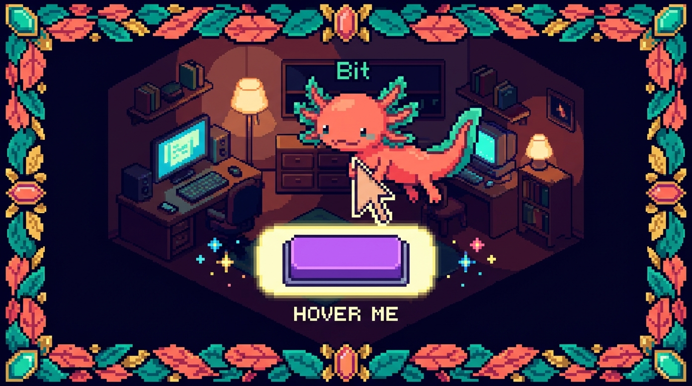

# Capítulo 13 — Pseudo-clases y pseudo-elementos

<p align="center">
  
</p>


> Hasta ahora, cuando escribías CSS, le hablabas a elementos que existen tal cual en tu HTML: un `<button>`, un `<p>`, un `<a>`. Pero una página no se queda quieta: el ratón pasa por encima de las cosas, los formularios reciben el foco, las casillas se marcan, y en cada lista siempre hay un primer hijo y un último hijo. Las **pseudo-clases** te dejan reaccionar a todo eso. Y los **pseudo-elementos** van un paso más allá: te dejan dibujar trozos nuevos que ni siquiera figuran en el HTML, como ese iconito que ves al lado de cada recuadro de este mismo manual. Bit el ajolote mueve las branquias de pura emoción, porque aquí es donde el CSS deja de ser una foto fija y empieza a sentirse interactivo. 🦎

---

## 1. ¿Qué es una pseudo-clase y por qué la necesitas?

Imagina que tienes un botón. En reposo es azul. Pero quieres que, *cuando el usuario pase el ratón por encima*, se ponga un poco más oscuro para avisar «sí, esto se puede pulsar». Ese «cuando pase el ratón por encima» no es un elemento distinto del HTML: es el **mismo botón** en un **estado distinto**. Las pseudo-clases existen justo para apuntar a esos estados.

> ### 🟦 ¿Qué significa? — *Pseudo-clase*
> Una pseudo-clase es una palabra clave que añades a un selector con dos puntos (`:`) para apuntar a un elemento **en un estado o posición especial**, sin tener que añadir una clase en el HTML. «Pseudo» quiere decir «falso» o «aparente»: parece una clase, pero no la escribes tú en el `class="..."`; la pone el navegador según lo que esté ocurriendo.
> **Para qué sirve:** cambiar el aspecto de algo según lo que el usuario hace (pasar el ratón, hacer clic, enfocar) o según dónde está (el primero de la lista, el último, los pares).
> **Dónde se usa en un repo real:** en `tunal-digital/styles.css`, los enlaces del menú y los botones de contacto usan `:hover` para reaccionar al ratón; en `RachaSimple` y `Faro`, Tailwind genera estas mismas pseudo-clases por debajo cuando escribes `hover:bg-blue-700`.

La forma general es siempre la misma:

```css
selector:pseudo-clase {
  /* estilos que aplican solo cuando se cumple ese estado */
}
```

Fíjate en un detalle pequeño pero clave: **un solo grupo de dos puntos** (`:`). Más adelante verás los pseudo-elementos, que usan **dos** (`::`). Esa diferencia de uno contra dos es la pista visual para saber con cuál estás trabajando.

> ### 💡 Tip
> No confundas la pseudo-clase `:hover` con una clase normal `.hover`. La primera lleva dos puntos y la controla el navegador; la segunda lleva un punto y la controlas tú en el HTML. Aunque se parezcan al escribirlas, son cosas completamente distintas.

---

## 2. Estados del ratón y del teclado: `:hover`, `:active`, `:focus`

Estas tres son las pseudo-clases más usadas del mundo, y por buena razón: son las que hacen que tu página se sienta «viva» cuando la tocas.

> ### 🟦 ¿Qué significa? — *`:hover`*
> Apunta a un elemento **mientras el cursor del ratón está encima** de él. En cuanto el ratón se aparta, deja de aplicar.
> **Para qué sirve:** dar una señal visual de «esto es interactivo». Botones que se oscurecen, enlaces que se subrayan, tarjetas que se levantan un poquito.
> **Dónde se usa en un repo real:** en `tunal-digital/styles.css` los botones del menú cambian de color al pasar el ratón.

> ### 🟦 ¿Qué significa? — *`:active`*
> Apunta a un elemento **en el instante exacto en que se está pulsando** (el botón del ratón está hundido sobre él). Solo dura mientras mantienes el clic.
> **Para qué sirve:** dar la sensación de que el botón «se hunde» físicamente cuando lo aprietas.
> **Dónde se usa en un repo real:** en cualquier botón de `tunal-digital`, para que el clic se sienta físico.

> ### 🟦 ¿Qué significa? — *`:focus`*
> Apunta a un elemento **que tiene el foco**: el sitio donde irían tus teclas si empezaras a escribir. Un `<input>` enfocado, un botón al que llegaste con la tecla Tab, etcétera.
> **Para qué sirve:** mostrar dónde está «parado» el teclado. Es fundamental para quien navega sin ratón.
> **Dónde se usa en un repo real:** en los formularios de contacto de `tunal-digital` y en los campos de login de `Faro` (aunque ahí Tailwind lo escribe como `focus:ring-2`).

Veámoslos los tres juntos sobre un botón de `tunal-digital`:

```css
/* Estado normal, en reposo */
.boton-contacto {
  background-color: #1d4ed8;
  color: white;
  padding: 12px 24px;
  border: none;
  border-radius: 8px;
  transition: background-color 0.2s; /* suaviza el cambio */
}

/* El ratón está encima */
.boton-contacto:hover {
  background-color: #1e40af; /* un azul más oscuro */
}

/* Justo mientras lo pulsas */
.boton-contacto:active {
  background-color: #1e3a8a; /* aún más oscuro */
}

/* Llegaste con Tab o haciendo clic */
.boton-contacto:focus {
  outline: 3px solid #93c5fd; /* un halo claro alrededor */
}
```

El `transition` de la primera regla es lo que hace que el cambio de color sea suave en lugar de brusco. No es obligatorio, pero la diferencia se nota: con él, todo se siente más cuidado.

> ### ⚠️ Cuidado
> Nunca borres el indicador de foco con `outline: none;` sin poner algo en su lugar. Si lo haces, quien navega con teclado se queda «a ciegas»: ya no ve dónde está parado. Si el contorno por defecto no te gusta, reemplázalo por uno propio, pero no lo elimines a secas.

---

## 3. El foco más educado: `:focus-visible`

Hay un problema clásico. Cuando haces clic con el ratón en un botón, a veces aparece ese halo de foco y se ve raro: «yo solo hice clic, no quería ningún halo». Pero cuando llegas con Tab, ahí sí lo quieres. ¿Cómo distinguir un caso del otro? Para eso nació `:focus-visible`.

> ### 🟦 ¿Qué significa? — *`:focus-visible`*
> Es como `:focus`, pero el navegador solo lo aplica **cuando tiene sentido mostrar el foco visualmente**, que suele ser al navegar con teclado y no al hacer clic con el ratón.
> **Para qué sirve:** mostrar el halo de accesibilidad a quien navega con teclado, sin molestar con halos a quien usa el ratón. Lo mejor de los dos mundos.
> **Dónde se usa en un repo real:** ideal para los botones y enlaces de `tunal-digital`, donde quieres accesibilidad sin que cada clic deje un contorno colgando.

```css
/* Quitamos el contorno feo en clics... */
.boton-contacto:focus {
  outline: none;
}

/* ...pero lo devolvemos cuando llegan con teclado */
.boton-contacto:focus-visible {
  outline: 3px solid #93c5fd;
  outline-offset: 2px;
}
```

> ### 💡 Tip
> Si tuvieras que elegir solo uno, hoy se recomienda estilizar `:focus-visible` antes que `:focus` para el contorno de teclado. Es el estándar moderno y lo soportan todos los navegadores actuales. Bit lo llama «el foco con buenos modales». 🦎

---

## 4. Posición entre hermanos: `:first-child`, `:last-child`, `:nth-child`

Estas pseudo-clases no miran estados, sino **lugares**: ¿este elemento es el primero de su grupo?, ¿el último?, ¿uno de los pares? Para entenderlas, piensa en una lista de hijos dentro de un mismo padre, como los `<li>` dentro de un `<ul>`.

> ### 🟦 ¿Qué significa? — *`:first-child`*
> Apunta a un elemento **solo si es el primer hijo** de su contenedor padre.
> **Para qué sirve:** quitar el margen superior del primer elemento, redondear la esquina de arriba de una lista, esos casos donde «el primero es especial».
> **Dónde se usa en un repo real:** en una lista de servicios en `tunal-digital`, para que el primer ítem no lleve línea separadora arriba.

> ### 🟦 ¿Qué significa? — *`:last-child`*
> Igual que el anterior, pero apunta al elemento **solo si es el último hijo** de su padre.
> **Para qué sirve:** quitar el borde inferior del último ítem de una lista, o el margen que sobra al final.
> **Dónde se usa en un repo real:** en `tunal-digital`, para que el último ítem del menú no deje un separador colgando.

> ### 🟦 ¿Qué significa? — *`:nth-child(n)`*
> Apunta a hijos **según un patrón numérico**: el tercero, los pares, los impares, uno de cada tres... El patrón va entre paréntesis.
> **Para qué sirve:** filas alternadas de color en tablas (el efecto «cebra»), cuadrículas con ritmo visual, resaltar cada cierto número.
> **Dónde se usa en un repo real:** en una tabla de precios o de proyectos en `tunal-digital`, para pintar las filas pares de un gris suave y que se lean mejor.

Mira cómo se usan sobre una lista de servicios:

```css
/* El primero no lleva línea arriba */
.servicios li:first-child {
  border-top: none;
}

/* El último no lleva línea abajo */
.servicios li:last-child {
  border-bottom: none;
}

/* Filas pares con fondo suave (efecto cebra) */
.tabla-proyectos tr:nth-child(even) {
  background-color: #f3f4f6;
}

/* Filas impares en blanco (es el valor por defecto, pero queda explícito) */
.tabla-proyectos tr:nth-child(odd) {
  background-color: white;
}
```

Las palabras `even` (pares) y `odd` (impares) son atajos cómodos. Pero `:nth-child` admite fórmulas más potentes con la letra `n`, que representa «0, 1, 2, 3...» en orden:

```css
/* Cada tercer elemento: el 3, el 6, el 9... */
.galeria div:nth-child(3n) {
  margin-right: 0;
}

/* Los tres primeros: el 1, 2 y 3 */
.galeria div:nth-child(-n + 3) {
  border: 2px solid gold;
}
```

> ### ⚠️ Cuidado
> `:nth-child` cuenta **todos** los hermanos, no solo los de la misma etiqueta. Si dentro de un `<div>` mezclas un `<h2>` y varios `<p>`, el primer `<p>` podría ser en realidad el «segundo hijo», porque el `<h2>` ya ocupa la posición uno. Si eso te lía, tienes la prima cercana `:nth-of-type()`, que cuenta solo elementos del mismo tipo.

> ### 🔎 En tu código
> En `RachaSimple` o `Faro`, que usan Tailwind, esto mismo se logra con utilidades como `odd:bg-gray-100` y `even:bg-white`, o con `first:mt-0` y `last:mb-0`. Por dentro, Tailwind está generando exactamente las pseudo-clases que acabas de ver. Saber qué ocurre «por debajo» te ayuda a entender qué escribe Tailwind en tu lugar.

---

## 5. Negar y filtrar: `:not()`

A veces quieres decir «todos estos, **menos** aquel». Esa palabra «menos» es `:not()`.

> ### 🟦 ¿Qué significa? — *`:not(selector)`*
> Apunta a todos los elementos que **NO** coinciden con el selector que pones dentro del paréntesis. Es, sin más, una negación.
> **Para qué sirve:** aplicar un estilo a un grupo entero excepto a algunos casos, sin tener que crear una clase aparte para los que quedan fuera.
> **Dónde se usa en un repo real:** en `tunal-digital`, para dar margen a todos los botones **menos** al último, o para estilizar todos los enlaces **menos** los que están deshabilitados.

```css
/* Todos los botones llevan margen a la derecha... menos el último */
.barra-botones button:not(:last-child) {
  margin-right: 12px;
}

/* Todos los enlaces se subrayan al pasar el ratón, menos los desactivados */
nav a:not(.desactivado):hover {
  text-decoration: underline;
}
```

Fíjate en algo elegante: dentro de `:not()` puedes meter **otra pseudo-clase** (`:not(:last-child)`) o una clase normal (`:not(.desactivado)`). Se combinan sin problema.

> ### 💡 Tip
> `:not(:last-child)` es uno de los trucos más útiles que vas a aprender. Te ahorra el clásico «espacio de más al final»: pones la separación a todos menos al último, y queda perfecto sin retoques a mano.

---

## 6. Estados de formulario: `:checked` (y amigos)

Los formularios tienen estados propios que el HTML conoce: ¿está marcada esta casilla?, ¿está deshabilitado este campo? Las pseudo-clases te dejan reaccionar a ellos.

> ### 🟦 ¿Qué significa? — *`:checked`*
> Apunta a una casilla (`checkbox`), un botón de radio o una opción que **está marcada o seleccionada** en ese momento.
> **Para qué sirve:** cambiar el aspecto de lo que rodea a una casilla marcada, montar interruptores tipo «switch» solo con CSS, resaltar la opción elegida.
> **Dónde se usa en un repo real:** en un formulario de `tunal-digital` con casillas «Quiero recibir novedades», para resaltar la opción en cuanto el usuario la activa.

```css
/* La etiqueta que sigue a un radio marcado se pone en negrita y azul */
input[type="radio"]:checked + label {
  font-weight: bold;
  color: #1d4ed8;
}
```

El `+ label` de ahí significa «el `<label>` que viene justo después»: es un selector hermano que verás con más calma en otro capítulo. Por ahora quédate con la idea: cuando el radio se marca, su etiqueta vecina cambia.

> ### 🔎 En tu código
> En `Faro` y `RachaSimple`, los formularios suelen manejarse con estado de React (`useState`) en lugar de depender solo de CSS, porque necesitan guardar datos en Supabase. Aun así, `:checked` sigue siendo útil para el aspecto puramente visual de la casilla, mientras React se ocupa de la lógica. CSS para que se vea bien, React para recordar qué pasó.

Hay más pseudo-clases de formulario que conviene que reconozcas, aunque no las domines hoy: `:disabled` (campo desactivado), `:enabled` (activado), `:required` (obligatorio), `:valid` e `:invalid` (si lo escrito cumple las reglas). Todas siguen la misma lógica de «reacciona a un estado del campo».

---

## 7. Pseudo-elementos: dibujar lo que no está en el HTML

Cambiamos de tema, y este es el favorito de Bit. Hasta aquí reaccionábamos a elementos que ya existían. Los **pseudo-elementos** hacen algo distinto: **crean** partes nuevas, o **apuntan a trozos** que nunca escribiste como etiquetas.

> ### 🟦 ¿Qué significa? — *Pseudo-elemento*
> Es una palabra clave que se añade a un selector con **dos** dos puntos (`::`) para estilizar **una parte concreta** de un elemento, o para **inventar contenido nuevo** que no existe en el HTML. El navegador lo «materializa» por ti.
> **Para qué sirve:** poner iconos decorativos, comillas, líneas, o estilizar partes internas como el texto de ayuda de un input o el texto que el usuario selecciona con el ratón.
> **Dónde se usa en un repo real:** en el propio `site/estilos.css` de este manual, los iconos que ves junto a cada recuadro (💡, ⚠️, 🔎) se ponen con `::before`. ¡Estás leyendo pseudo-elementos ahora mismo!

> ### 💡 Tip
> La regla para no perderte, cortesía de Bit: **pseudo-CLASE** con **un** dos-puntos (`:hover`), porque reacciona a algo que ya está ahí. **Pseudo-ELEMENTO** con **dos** dos-puntos (`::before`), porque «duplicas» los puntos para «crear» algo nuevo. Un punto, estado; doble punto, pieza nueva. 🦎

---

## 8. `::before` y `::after`: los gemelos decoradores

Estos dos son los pseudo-elementos estrella. Crean una cajita invisible **antes** o **después** del contenido de un elemento, y tú la rellenas.

> ### 🟦 ¿Qué significa? — *`::before`*
> Inserta un trozo de contenido **justo antes** del contenido real de un elemento, sin que tengas que escribirlo en el HTML.
> **Para qué sirve:** iconos a la izquierda de un texto, viñetas personalizadas, comillas de apertura, etiquetas decorativas.
> **Dónde se usa en un repo real:** los recuadros de este manual usan `::before` para colocar el emoji del icono al inicio de cada caja.

> ### 🟦 ¿Qué significa? — *`::after`*
> Igual que `::before`, pero inserta el contenido **justo después** del contenido real del elemento.
> **Para qué sirve:** flechitas al final de un enlace, líneas decorativas de cierre, el símbolo de «enlace externo».
> **Dónde se usa en un repo real:** en `tunal-digital`, para añadir una flecha «→» al final de los enlaces de «Ver más» sin tocar el HTML.

Y aquí llega el detalle más importante de todos:

> ### 🟦 ¿Qué significa? — *`content`*
> Es la propiedad CSS que dice **qué texto o símbolo** va a mostrar un `::before` o un `::after`. **Sin `content`, el pseudo-elemento no aparece**, ni siquiera vacío.
> **Para qué sirve:** definir el contenido de los pseudo-elementos. Puede ser un texto, un emoji, unas comillas, o `""` (vacío) si solo lo quieres como adorno geométrico.
> **Dónde se usa en un repo real:** en `site/estilos.css`, cada recuadro define algo como `content: "💡"` para su icono.

Veamos cómo el manual coloca el icono de los recuadros:

```css
/* La cajita de "Tip" */
.recuadro-tip {
  position: relative;
  padding-left: 48px; /* dejamos hueco a la izquierda para el icono */
  background-color: #eff6ff;
  border-left: 4px solid #3b82f6;
}

/* El icono, creado con ::before */
.recuadro-tip::before {
  content: "💡";        /* SIN esto, no aparece nada */
  position: absolute;
  left: 16px;
  top: 16px;
  font-size: 20px;
}
```

Y aquí está lo bonito: el emoji 💡 **no está en el HTML**. El HTML solo tiene `<div class="recuadro-tip">...texto...</div>`. El icono lo «inventa» el CSS. Si mañana quieres cambiar todos los iconos de tip a 📌, cambias una sola línea y se actualizan todos de golpe. Eso es poder.

Otro ejemplo, la flecha al final de un enlace:

```css
.ver-mas::after {
  content: " →";     /* un espacio y una flecha */
  font-weight: bold;
}
```

> ### ⚠️ Cuidado
> Si olvidas la propiedad `content`, tu `::before` o `::after` **no se mostrará en absoluto**, por mucho que le pongas colores, tamaños y bordes. Es el error número uno de quien empieza con pseudo-elementos. Cuando algo «no aparece», lo primero que revisa Bit es si falta `content`. Para adornos puramente geométricos (una línea, un cuadrito), usa `content: "";` con las comillas vacías: vacío, pero presente.

> ### 💡 Tip
> Lo que metes con `content` es **decorativo**, y los lectores de pantalla suelen ignorarlo. Por eso es perfecto para iconos bonitos, pero **nunca** pongas ahí información que importe (como un precio o una instrucción). El texto que cuenta va en el HTML de verdad.

---

## 9. Estilizar partes internas: `::placeholder` y `::selection`

Estos dos no crean contenido nuevo: apuntan a partes que ya existen «dentro» de un elemento, pero que normalmente no podrías tocar.

> ### 🟦 ¿Qué significa? — *`::placeholder`*
> Apunta al **texto de ayuda gris** que aparece dentro de un campo de formulario cuando está vacío (el `placeholder="Tu correo"`).
> **Para qué sirve:** cambiar el color, la cursiva o el tamaño de ese texto guía para que combine con tu diseño.
> **Dónde se usa en un repo real:** en los formularios de contacto de `tunal-digital` y en los campos de login de `Faro`, para que el texto guía vaya acorde a la marca.

```css
.campo-formulario::placeholder {
  color: #9ca3af;     /* gris suave */
  font-style: italic; /* en cursiva */
}
```

> ### 🟦 ¿Qué significa? — *`::selection`*
> Apunta al **texto que el usuario ha resaltado** con el ratón (cuando arrastras para seleccionar y se tiñe de color).
> **Para qué sirve:** personalizar el color del resaltado para que use los colores de tu marca en vez del azul por defecto del navegador.
> **Dónde se usa en un repo real:** en `tunal-digital` o en el `site/estilos.css` del manual, para que al seleccionar texto el resaltado sea del color de la marca.

```css
::selection {
  background-color: #1d4ed8; /* fondo de la marca */
  color: white;              /* texto en blanco al resaltar */
}
```

> ### 🔎 En tu código
> Con Tailwind (en `RachaSimple` y `Faro`) estos pseudo-elementos también están a tu alcance: escribes `placeholder:text-gray-400` o `selection:bg-blue-700`. Una vez más, Tailwind es solo un atajo para escribir el mismo CSS que viste arriba. El concepto es idéntico; lo que cambia es la forma de escribirlo.

---

## 10. Encadenar y combinar: el poder de juntarlo todo

Lo más bonito es que todas estas piezas se combinan. Puedes pegar varias pseudo-clases, o mezclar una pseudo-clase con un pseudo-elemento:

```css
/* Un enlace que NO esté deshabilitado, al pasar el ratón,
   muestra una flecha animada al final */
nav a:not(.desactivado):hover::after {
  content: " →";
  margin-left: 4px;
}

/* El primer botón de la barra, al enfocarse con teclado */
.barra button:first-child:focus-visible {
  outline: 3px solid #93c5fd;
}
```

Léelo en voz alta y el primero dice: «para los enlaces de `nav` que no tengan la clase desactivado, cuando el ratón esté encima, dibuja una flecha después». Cada pieza se va sumando como ladrillos. No te asustes por la longitud: se lee de izquierda a derecha, igual que una frase.

> ### 💡 Tip
> Si una regla se vuelve tan larga que ni tú la entiendes, suele ser señal de que conviene añadir una clase normal en el HTML para simplificar. Las pseudo-clases dan mucho juego, pero la claridad siempre gana. Bit prefiere tres reglas legibles a una imposible. 🦎

---

## ✅ Checklist — ¿ya domino esto?

- [ ] Sé explicar qué es una pseudo-clase y por qué se escribe con **un** dos-puntos.
- [ ] Distingo `:hover`, `:active` y `:focus`, y sé cuándo aplica cada uno.
- [ ] Entiendo por qué `:focus-visible` es más amable que `:focus` para el contorno de teclado.
- [ ] Nunca borro el indicador de foco sin poner uno propio en su lugar.
- [ ] Sé usar `:first-child`, `:last-child` y `:nth-child(even/odd)` para posiciones entre hermanos.
- [ ] Entiendo que `:not()` sirve para excluir y que puede llevar otra pseudo-clase dentro.
- [ ] Sé que `:checked` apunta a casillas y radios marcados.
- [ ] Distingo pseudo-elemento (dos dos-puntos `::`) de pseudo-clase (uno `:`).
- [ ] Sé que `::before` y `::after` **necesitan `content`** o no aparecen.
- [ ] Entiendo que `::placeholder` y `::selection` estilizan partes internas existentes.
- [ ] Reconozco que en Tailwind (`hover:`, `first:`, `placeholder:`) esto es el mismo CSS por debajo.

---

## 🧪 Ejercicios

1. **De memoria (sin compu).** Escribe en un papel la diferencia entre `:hover`, `:active` y `:focus`, con un ejemplo de cuándo se activa cada uno. Luego explica por qué `::before` lleva dos dos-puntos y `:hover` solo uno.

2. 💻 **Botón vivo en tunal-digital.** En `styles.css`, toma un botón existente y dale los tres estados: un color base, uno más oscuro en `:hover`, otro aún más oscuro en `:active`, y un `outline` claro en `:focus-visible`. Añade `transition: background-color 0.2s;` y observa la diferencia con y sin él.

3. 💻 **Efecto cebra.** Crea (o usa) una tabla de proyectos en `tunal-digital` y pinta las filas pares de un gris suave con `tr:nth-child(even)`. Comprueba que las impares quedan en blanco. Bonus: resalta solo la primera fila con `:first-child`.

4. 💻 **El truco del último.** En una barra con varios botones, dale `margin-right` a todos **menos al último** usando `button:not(:last-child)`. Confirma que no queda espacio sobrante al final.

5. 💻 **Icono con `::before`.** Recrea un recuadro tipo «Tip» como los de este manual: un `<div>` con clase, fondo suave, borde izquierdo de color, y un icono emoji puesto con `::before` y `content`. Luego prueba a **borrar la línea `content`** y observa cómo el icono desaparece por completo: así interiorizas por qué es obligatoria.

6. 💻 **Marca tu selección.** Añade a `styles.css` una regla `::selection` que cambie el color de fondo al resaltar texto, usando un color de tu marca. Selecciona texto con el ratón en tu página y comprueba que el resaltado ya no es el azul por defecto del navegador.

---

> Lo lograste. Hoy tu CSS dejó de ser una estatua y aprendió a reaccionar: sabe cuándo lo tocan, sabe quién va primero y quién va último, y hasta sabe dibujar iconos que no existían en el HTML. La próxima vez que veas el 💡 al lado de un recuadro, ya conoces el secreto: es un `::before` con su `content` haciendo su trabajo en silencio. Bit chapotea de orgullo. Nos vemos en el siguiente capítulo. 🦎
