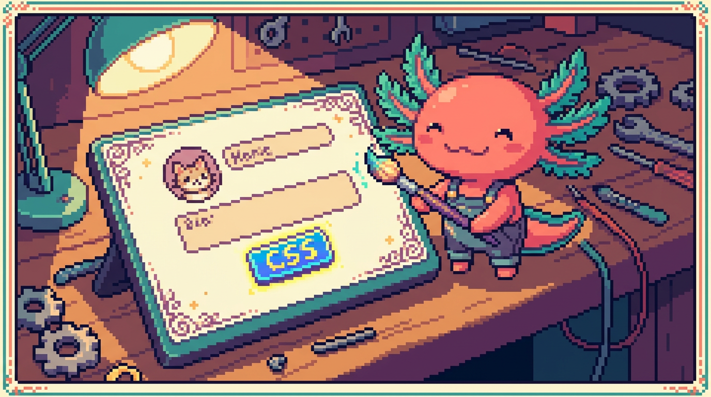

# Capítulo 14 — Mini-proyecto: una tarjeta con estilo

<p align="center">
  
</p>


> ¡Llegó el día! Durante trece capítulos fuiste juntando piezas: selectores, colores, el modelo de caja, tipografía, sombras, transiciones. Hoy las usamos todas juntas para construir algo de verdad: una **tarjeta** bonita, de esas que ves en mil sitios web (un producto, un perfil, una publicación). Lo haremos paso a paso, en tu computadora 💻, y al final tendrás una pieza que podrías pegar tal cual en tu proyecto **tunal-digital**. Bit, el ajolote, ya tiene puestas las gafas de obra y trae su casquito rosa. Vamos a construir.

---

## 1. ¿Qué vamos a construir y por qué una tarjeta?

Una **tarjeta** (en inglés *card*) es un bloque rectangular que agrupa información relacionada: una imagen, un título, un texto corto y, casi siempre, un botón. Es uno de los patrones de diseño más comunes de la web. Si abres una tienda online, cada producto es una tarjeta. Si abres una red social, cada publicación es una tarjeta.

> ### 🟦 ¿Qué significa? — *Tarjeta (card)*
> Es un patrón visual: un contenedor con bordes redondeados, algo de relleno por dentro y normalmente una sombra suave que la separa del fondo. No es una etiqueta de HTML especial; la construimos con un `<div>` (o mejor, una etiqueta semántica como `<article>`) y la vestimos con CSS.
> **Para qué sirve:** ordenar información en piezas reutilizables y fáciles de leer.
> **Dónde se usa en un repo real:** en **tunal-digital**, la sección de servicios o de portafolio podría mostrarse como una rejilla de tarjetas; en **RachaSimple** (React + Tailwind), cada racha del usuario probablemente se pinta como una tarjeta con clases de Tailwind.

La gracia de hacerla "a mano" con CSS puro es que entiendes qué hace cada propiedad. Más adelante, cuando uses **Tailwind** en RachaSimple o Faro, vas a reconocer que `rounded-xl`, `shadow-md` o `p-6` son exactamente las mismas ideas que hoy escribiremos con nombres largos.

> ### 💡 Tip
> No copies y pegues el código de golpe. Escríbelo tú, línea por línea, mirando cómo cambia la tarjeta en el navegador cada vez que guardas. Aprender CSS es como aprender a cocinar: hay que probar la sopa mientras la haces.

---

## 2. Preparar el terreno: HTML y CSS enlazados

Antes de pintar necesitamos un lienzo. Crea una carpeta nueva (por ejemplo `tarjeta/`) con dos archivos: `index.html` y `estilos.css`.

> ### 🔎 En tu código
> Tu proyecto **tunal-digital** ya usa un patrón parecido: un `index.html` que enlaza un `styles.css` y un `main.js`. Aquí repetimos la misma estructura para que te resulte familiar. El nombre del archivo de estilos da igual (`styles.css`, `estilos.css`); lo importante es enlazarlo bien.

Empecemos por el HTML. Pega esto en `index.html`:

```html
<!DOCTYPE html>
<html lang="es">
<head>
  <meta charset="UTF-8" />
  <meta name="viewport" content="width=device-width, initial-scale=1.0" />
  <title>Mi tarjeta</title>
  <link rel="stylesheet" href="estilos.css" />
</head>
<body>
  <article class="tarjeta">
    
    <div class="tarjeta__cuerpo">
      <h2 class="tarjeta__titulo">Café de la montaña</h2>
      <p class="tarjeta__texto">
        Granos tostados artesanalmente, con notas de chocolate y un final
        suave. Edición limitada de la cosecha de este año.
      </p>
      <button class="tarjeta__boton">Comprar ahora</button>
    </div>
  </article>
</body>
</html>
```

Mira que envolví todo en `<article class="tarjeta">`. Usé `<article>` en lugar de `<div>` porque es **HTML semántico**: le dice al navegador (y a los lectores de pantalla) "esto es una pieza de contenido independiente".

> ### 🟦 ¿Qué significa? — *Etiqueta semántica*
> Es una etiqueta de HTML cuyo nombre describe **qué tipo de contenido** contiene, no cómo se ve. `<article>`, `<header>`, `<nav>` y `<footer>` son semánticas; `<div>` y `<span>` son neutras (no significan nada en particular).
> **Para qué sirve:** mejora la accesibilidad y el SEO, y hace el código más legible.
> **Dónde se usa en un repo real:** en **Faro/Organizer** (Next.js), los componentes suelen renderizar `<article>` o `<section>` para cada proyecto listado.

> ### 🟦 ¿Qué significa? — *Atributo `alt`*
> Es el texto alternativo de una imagen. Si la imagen no carga, o si una persona usa un lector de pantalla, se lee este texto.
> **Para qué sirve:** accesibilidad. Una imagen sin `alt` es invisible para quien no puede verla.
> **Dónde se usa:** en TODO proyecto serio. Acostúmbrate desde ya.

Fíjate también en los nombres de clase tipo `tarjeta__cuerpo`. Ese doble guion bajo es una convención llamada **BEM** que ayuda a no perderte. No es obligatorio, pero ordena mucho.

> ### 🟦 ¿Qué significa? — *BEM (Block, Element, Modifier)*
> Es una forma de nombrar clases CSS. `bloque__elemento--modificador`. El bloque es la tarjeta, los elementos son sus partes (`__titulo`, `__boton`) y los modificadores son variantes (`--destacada`).
> **Para qué sirve:** que el nombre de una clase te diga a qué pertenece y evites colisiones.
> **Dónde se usa en un repo real:** muchos `styles.css` vanilla como el de **tunal-digital** lo usan; con Tailwind (RachaSimple, Faro) no hace falta porque las clases ya son utilitarias.

Si abres `index.html` en el navegador ahora, verás un desastre sin estilo: una imagen enorme, texto pegado a la izquierda y un botón gris feo. Perfecto. Ese es nuestro punto de partida. Bit dice que toda escultura empieza siendo un bloque de piedra.

---

## 3. La caja: relleno, bordes redondeados y sombra

Vamos al `estilos.css`. Primero, un pequeño reseteo y un fondo para que la tarjeta no flote en blanco:

```css
* {
  box-sizing: border-box;
  margin: 0;
}

body {
  font-family: system-ui, sans-serif;
  background-color: #f3f4f6;
  display: flex;
  justify-content: center;
  align-items: center;
  min-height: 100vh;
  padding: 20px;
}
```

> ### 🟦 ¿Qué significa? — *`box-sizing: border-box`*
> Cambia cómo se calcula el tamaño de una caja. Con `border-box`, el `padding` y el `border` quedan **incluidos** dentro del ancho que tú declaras, en vez de sumarse por fuera.
> **Para qué sirve:** que cuando digas "300px de ancho" sea de verdad 300px, sin sorpresas.
> **Dónde se usa:** en casi todos los proyectos se pone al inicio con el selector `*`. Es de las primeras líneas de cualquier `styles.css` profesional.

> ### 🟦 ¿Qué significa? — *`min-height: 100vh`*
> `vh` es "viewport height": `100vh` es el 100% de la altura de la ventana. Con `min-height` le pedimos al `body` que ocupe al menos toda la pantalla de alto.
> **Para qué sirve:** aquí, combinado con `display: flex` y los `justify`/`align`, centra la tarjeta en mitad de la pantalla.

> ### 🟦 ¿Qué significa? — *`display: flex` (y `justify-content` / `align-items`)*
> `display: flex` convierte una caja en un **contenedor flexible**: sus hijos se ordenan automáticamente en una fila (o columna) que tú puedes alinear. Aquí lo usamos en el `body` solo para centrar una cosa: `justify-content: center` centra horizontalmente y `align-items: center` centra verticalmente.
> **Para qué sirve:** centrar elementos sin trucos raros. Esta combinación de tres líneas es la receta clásica para "poner algo justo en el medio de la pantalla".
> **Dónde se usa en un repo real:** en **tunal-digital**, el `styles.css` usa flex para alinear los enlaces del menú o las columnas de una sección. No te preocupes si aún no lo dominas: el siguiente capítulo está dedicado por completo a Flexbox; aquí solo lo usamos de pasada para centrar.

Ahora sí, la caja de la tarjeta:

```css
.tarjeta {
  background-color: #ffffff;
  width: 320px;
  border-radius: 16px;
  box-shadow: 0 10px 25px rgba(0, 0, 0, 0.1);
  overflow: hidden;
}
```

Guarda y mira el navegador. ¡Ya parece una tarjeta! Vamos propiedad por propiedad.

> ### 🟦 ¿Qué significa? — *`border-radius`*
> Redondea las esquinas de una caja. `16px` significa que cada esquina tiene un radio de curva de 16 píxeles. Si pones un número muy grande (como `50%`) en algo cuadrado, se vuelve un círculo.
> **Para qué sirve:** suavizar el aspecto. Las esquinas redondeadas se sienten más amables.
> **Dónde se usa en un repo real:** en **RachaSimple/Faro** verás clases Tailwind como `rounded-2xl`, que hace exactamente esto.

> ### 🟦 ¿Qué significa? — *`box-shadow`*
> Dibuja una sombra alrededor de la caja. Los valores son: desplazamiento horizontal, desplazamiento vertical, desenfoque (*blur*) y el color. En `0 10px 25px rgba(0,0,0,0.1)`: 0 a los lados, 10px hacia abajo, 25px de difuminado y un negro muy transparente.
> **Para qué sirve:** dar sensación de profundidad, como si la tarjeta flotara sobre el fondo.
> **Dónde se usa:** Tailwind lo llama `shadow-lg`, `shadow-xl`, etc.

> ### 🟦 ¿Qué significa? — *`overflow: hidden`*
> Recorta cualquier cosa que se salga de la caja. Como la imagen es rectangular y la tarjeta tiene esquinas redondeadas, sin esto la imagen sobresaldría por las esquinas de arriba.
> **Para qué sirve:** aquí, que la imagen respete el redondeo de la tarjeta. ¡Es un truco muy usado!

> ### 💡 Tip
> El valor `rgba(0, 0, 0, 0.1)` es negro (0,0,0) con **10% de opacidad** (el `0.1`). Las sombras casi nunca son negro puro; un negro semitransparente se ve mucho más natural sobre cualquier fondo.

---

## 4. La imagen: que llene su espacio sin deformarse

La imagen del HTML mide originalmente 400x250 (la pedimos así a `picsum.photos`), pero nuestra tarjeta mide 320px de ancho. Hay que ajustarla:

```css
.tarjeta__imagen {
  width: 100%;
  height: 180px;
  object-fit: cover;
  display: block;
}
```

> ### 🟦 ¿Qué significa? — *`width: 100%`*
> Hace que la imagen ocupe el 100% del ancho de su contenedor (la tarjeta). Como la tarjeta mide 320px, la imagen se ajusta a 320px.
> **Para qué sirve:** que la imagen sea "responsive": si la tarjeta cambia de ancho, la imagen la sigue.

> ### 🟦 ¿Qué significa? — *`object-fit: cover`*
> Le dice a la imagen cómo rellenar el espacio que le dimos (320 × 180). `cover` significa "cubre todo el área, recortando lo que sobre, sin deformar". La alternativa `contain` mostraría la imagen entera dejando huecos.
> **Para qué sirve:** evitar que las fotos se vean estiradas o aplastadas. Es la diferencia entre una foto profesional y una foto chiclosa.
> **Dónde se usa en un repo real:** cualquier galería o avatar de usuario; en Tailwind sería `object-cover`.

> ### 🟦 ¿Qué significa? — *`display: block`*
> Las imágenes son `inline` por defecto, lo que a veces deja un pequeño espacio fantasma debajo. Ponerlas en `block` elimina ese hueco.
> **Para qué sirve:** que la imagen quede pegada limpiamente al borde superior de la tarjeta.

> ### ⚠️ Cuidado
> Si pones `height` fija (180px) pero olvidas `object-fit: cover`, la imagen se **deforma** para caber. El `object-fit` es justo lo que evita ese estiramiento. Prueba a borrarlo un momento y verás la cara aplastada de la foto. Bit se rió, pero no es bonito.

---

## 5. La tipografía: título y texto que se lean bien

Ahora el cuerpo. Le damos relleno interno y arreglamos los textos:

```css
.tarjeta__cuerpo {
  padding: 20px;
}

.tarjeta__titulo {
  font-size: 1.25rem;
  color: #111827;
  margin-bottom: 8px;
}

.tarjeta__texto {
  font-size: 0.95rem;
  color: #6b7280;
  line-height: 1.5;
  margin-bottom: 16px;
}
```

> ### 🟦 ¿Qué significa? — *`padding`*
> Es el relleno **por dentro** de la caja: el espacio entre el borde del contenedor y su contenido. Aquí `20px` separa el texto de los bordes de la tarjeta para que no quede pegado.
> **Para qué sirve:** dar "aire". El texto pegado a los bordes se siente apretado e incómodo de leer.
> **Recuerda:** `padding` es por dentro; `margin` es por fuera. Es la distinción más importante del modelo de caja.

> ### 🟦 ¿Qué significa? — *`rem` (unidad de tamaño)*
> `1rem` equivale al tamaño de fuente base del documento (normalmente 16px). Así, `1.25rem` ≈ 20px y `0.95rem` ≈ 15px. Es una unidad **relativa**.
> **Para qué sirve:** si el usuario agranda la fuente del navegador, tus textos escalan con él. Más accesible que usar `px` a secas.
> **Dónde se usa:** Tailwind se basa en rem internamente (`text-lg`, `text-sm`).

> ### 🟦 ¿Qué significa? — *`line-height`*
> Es la altura de cada línea de texto, es decir, cuánto se separan las líneas verticalmente. `1.5` significa "1.5 veces el tamaño de la fuente".
> **Para qué sirve:** un párrafo con líneas muy juntas cansa la vista. `1.4` a `1.6` es el rango cómodo para leer.

Fíjate en el detalle de los colores: el título usa un gris casi negro (`#111827`) y el texto un gris medio (`#6b7280`). Esa diferencia de intensidad crea **jerarquía**: tu ojo sabe de inmediato qué es importante.

> ### 💡 Tip
> Un error de principiante es poner todo el texto en negro puro `#000000`. Los diseños modernos usan grises muy oscuros para el texto principal; se sienten más suaves y elegantes. Es un truco gratis que mejora cualquier interfaz.

---

## 6. El botón: color, hover y transición

El protagonista de la interacción. Lo hacemos llamativo y le damos vida al pasar el ratón:

```css
.tarjeta__boton {
  background-color: #e11d48;
  color: #ffffff;
  border: none;
  padding: 12px 20px;
  border-radius: 8px;
  font-size: 0.95rem;
  font-weight: 600;
  cursor: pointer;
  width: 100%;
  transition: background-color 0.2s ease, transform 0.1s ease;
}

.tarjeta__boton:hover {
  background-color: #be123c;
}

.tarjeta__boton:active {
  transform: scale(0.98);
}
```

Guarda y pasa el ratón por encima del botón. Mira cómo cambia de color suavemente, no de golpe. Y al hacer clic, se encoge un poquito. ¡Eso es interacción de verdad! Vamos a entender cada pieza.

> ### 🟦 ¿Qué significa? — *`font-weight`*
> Controla el **grosor** de la letra. `400` es el peso normal, `600` es semi-negrita y `700` es negrita. Aquí pusimos `600` para que el texto del botón resalte sin gritar.
> **Para qué sirve:** dar énfasis. Un botón o un título en semi-negrita se lee como "más importante" sin necesidad de agrandarlo.
> **Dónde se usa en un repo real:** en **RachaSimple/Faro** lo verás como clases Tailwind tipo `font-semibold` (600) o `font-bold` (700).

> ### 🟦 ¿Qué significa? — *`border: none`*
> Quita el borde que los navegadores le ponen a los botones por defecto (ese marco gris que se ve anticuado).
> **Para qué sirve:** partir de cero para diseñar el botón a tu gusto. Casi siempre es la primera línea cuando estilizas un `<button>`.

> ### 🟦 ¿Qué significa? — *`cursor: pointer`*
> Cambia el puntero del ratón a la "manita" cuando pasas por encima.
> **Para qué sirve:** indica visualmente "esto se puede pulsar". Los botones siempre deberían tenerlo.

> ### 🟦 ¿Qué significa? — *`:hover` (pseudo-clase)*
> Es un selector especial que aplica estilos solo **mientras el ratón está encima** del elemento. `.tarjeta__boton:hover` significa "el botón, cuando lo señalas".
> **Para qué sirve:** dar retroalimentación. El usuario ve que el botón reacciona, así que confía en que es pulsable.
> **Dónde se usa en un repo real:** en **tunal-digital**, todos los botones y enlaces del menú probablemente tienen un `:hover`; en Tailwind se escribe `hover:bg-rose-700`.

> ### 🟦 ¿Qué significa? — *`:active` (pseudo-clase)*
> Aplica estilos en el instante exacto en que pulsas (el botón del ratón está presionado).
> **Para qué sirve:** simular que el botón "se hunde". Aquí lo encogemos un 2% con `transform: scale(0.98)`.

> ### 🟦 ¿Qué significa? — *`transition`*
> Hace que un cambio de propiedad ocurra de forma **gradual** en vez de instantánea. `transition: background-color 0.2s ease` significa "cuando cambie el color de fondo, tárdate 0.2 segundos en hacerlo, suavemente".
> **Para qué sirve:** que las interacciones se sientan pulidas y agradables, no bruscas.
> **Dónde se usa:** en absolutamente todas partes. Tailwind: `transition-colors duration-200`.

> ### 🟦 ¿Qué significa? — *`transform: scale()`*
> Transforma el tamaño del elemento sin afectar al resto del diseño. `scale(0.98)` lo deja al 98% de su tamaño; `scale(1.05)` lo agrandaría un 5%.
> **Para qué sirve:** efectos de "presión" o "rebote" sin mover las cosas de su sitio (a diferencia de cambiar `width`, que sí descoloca a los vecinos).

> ### ⚠️ Cuidado
> La `transition` se declara en el estado **normal** del botón (no dentro de `:hover`). Si solo la pones en el `:hover`, la animación entra suave pero sale de golpe. Decláralala una vez en `.tarjeta__boton` y servirá tanto para entrar como para salir.

> ### 💡 Tip
> Tiempos buenos para transiciones de interfaz: entre `0.1s` y `0.3s`. Si pones `1s`, todo se siente lento y pesado. La animación debe ser un toque sutil, no el centro de atención.

---

## 7. Hacerla responsive: que se vea bien en el móvil

Nuestra tarjeta mide 320px fijos. En un computador grande, perfecto. Pero en un móvil estrecho de 300px, esos 320px se salen de la pantalla. La arreglamos con una sola línea y, de paso, conocemos las *media queries*.

Cambia el ancho de la tarjeta así:

```css
.tarjeta {
  background-color: #ffffff;
  width: 100%;
  max-width: 320px;
  border-radius: 16px;
  box-shadow: 0 10px 25px rgba(0, 0, 0, 0.1);
  overflow: hidden;
}
```

> ### 🟦 ¿Qué significa? — *`max-width`*
> Pone un tope al ancho: el elemento puede ser más estrecho, pero nunca más ancho que ese valor. Aquí, `width: 100%` dice "ocupa todo el espacio disponible" y `max-width: 320px` dice "pero no pases de 320px".
> **Para qué sirve:** en pantallas grandes la tarjeta se queda en 320px; en un móvil de 300px, se encoge a 300px y no desborda. Es el truco responsive más útil que existe.

Y si quieres que en pantallas muy pequeñas el texto y el relleno se ajusten, usamos una **media query**:

```css
@media (max-width: 360px) {
  .tarjeta__cuerpo {
    padding: 14px;
  }

  .tarjeta__titulo {
    font-size: 1.1rem;
  }
}
```

> ### 🟦 ¿Qué significa? — *Media query (`@media`)*
> Es un bloque de CSS que solo se aplica **si se cumple una condición** sobre la pantalla. `@media (max-width: 360px)` significa "aplica esto solo cuando la ventana mida 360px de ancho o menos" (es decir, en móviles pequeños).
> **Para qué sirve:** el corazón del diseño responsive. Permite tener estilos distintos según el tamaño de pantalla.
> **Dónde se usa en un repo real:** el `styles.css` de **tunal-digital** seguramente tiene varias media queries para que el menú y las secciones se reorganicen en móvil. En Tailwind esto se hace con prefijos como `sm:` y `md:`.

> ### 🔎 En tu código
> El propio `estilos.css` del sitio de este manual usa **variables CSS** y temas (claro/oscuro). Una variable es como guardar un color en una caja con nombre: `--color-principal: #e11d48;` y luego usarlo con `color: var(--color-principal);`. No lo necesitamos para una sola tarjeta, pero cuando tengas diez botones del mismo color rojo, una variable te deja cambiarlos todos desde un solo sitio. Lo veremos a fondo más adelante.

> ### 💡 Tip
> Para probar el responsive sin tener un móvil a mano: abre tu tarjeta en el navegador, pulsa **F12** para abrir las herramientas de desarrollo y haz clic en el icono de móvil/tablet. Podrás simular distintos tamaños de pantalla y ver cómo reacciona tu media query en vivo.

---

## 8. El toque final: un hover sobre toda la tarjeta

Una mejora pequeñita que se ve muy profesional: que la tarjeta entera se eleve un poco cuando pasas el ratón por encima.

```css
.tarjeta {
  /* ...lo de antes... */
  transition: transform 0.2s ease, box-shadow 0.2s ease;
}

.tarjeta:hover {
  transform: translateY(-4px);
  box-shadow: 0 18px 35px rgba(0, 0, 0, 0.15);
}
```

> ### 🟦 ¿Qué significa? — *`transform: translateY()`*
> Mueve el elemento en el eje vertical sin afectar a los vecinos. `translateY(-4px)` lo sube 4 píxeles (negativo = arriba).
> **Para qué sirve:** aquí, el efecto de "levitar" al pasar el ratón. Combinado con una sombra más grande, parece que la tarjeta se acerca a ti.

Mira el resultado: la tarjeta sube suavemente y su sombra crece, como si se despegara del fondo. Con `transition` ya declarada, el movimiento es fluido. Estos detalles pequeños son los que separan una página que "funciona" de una que se siente cuidada.

> ### ⚠️ Cuidado
> No abuses de los efectos. Una tarjeta que se mueve está bien; una página donde TODO salta, gira y parpadea marea. El buen diseño es como la sal: justo la necesaria.

---

## 9. ¡Lo lograste! Mira lo que construiste

Para, respira y mira tu pantalla. Hace catorce capítulos no sabías qué era un selector y ahora tienes:

- una **caja** con relleno, esquinas redondeadas y sombra;
- una **imagen** que se ajusta sin deformarse;
- una **tipografía** con jerarquía clara;
- un **botón** con hover, estado activo y transición;
- un diseño **responsive** que aguanta en móvil;
- y un efecto de **hover** sobre toda la tarjeta.

Eso no es un ejercicio de juguete. Es exactamente el tipo de componente que vive en proyectos reales. Si abrieras una tarjeta de **RachaSimple** o un panel de proyecto en **Faro**, encontrarías estas mismísimas ideas, solo que escritas con clases de Tailwind. Hoy entiendes lo que esas clases hacen por dentro, y eso es un superpoder.

Bit se quitó el casquito de obra, está aplaudiendo con sus manitas de ajolote y ya guardó una foto de tu tarjeta en su álbum de logros. Tómate un momento para sentirte orgullosa u orgulloso: construiste algo bonito de la nada, con tus propias manos y tu propio código. 🎉

> ### 💡 Tip
> Guarda esta tarjeta en una carpeta de "trozos reutilizables". Cuando armes tu próximo proyecto y necesites mostrar productos o perfiles, vas a tener una base lista para adaptar. Los buenos programadores no reinventan la rueda cada vez: reutilizan lo que ya construyeron.

---

## ✅ Checklist — ¿ya domino esto?

- [ ] Sé enlazar un archivo CSS desde el HTML con `<link rel="stylesheet">`.
- [ ] Entiendo la diferencia entre `padding` (por dentro) y `margin` (por fuera).
- [ ] Puedo redondear esquinas con `border-radius` y poner una sombra con `box-shadow`.
- [ ] Sé usar `overflow: hidden` para que una imagen respete las esquinas redondeadas.
- [ ] Entiendo qué hace `object-fit: cover` y por qué evita que las fotos se deformen.
- [ ] Sé crear jerarquía de texto con distintos tamaños y tonos de gris.
- [ ] Puedo darle un `:hover` y una `transition` a un botón.
- [ ] Entiendo qué es una media query y por qué `max-width` ayuda al responsive.
- [ ] Reconozco que estas ideas son las mismas que las clases de Tailwind (`rounded`, `shadow`, `p-`, `hover:`).

---

## 🧪 Ejercicios

1. **Cambia los colores (💻).** Reemplaza el rojo del botón (`#e11d48`) y el de su `:hover` por los colores de tu marca favorita. Asegúrate de que el texto blanco siga siendo legible sobre el nuevo fondo. Si el color es muy claro, prueba con texto oscuro.

2. **Tu propia foto (💻).** Cambia el `src` de la imagen por la URL de una foto real (un producto, tu mascota, un paisaje). Comprueba que `object-fit: cover` la encuadra bien sin deformarla, y ajusta el `height` si quieres una imagen más alta o más baja.

3. **Una etiqueta de precio (💻).** Añade dentro del cuerpo, justo antes del botón, un `<p class="tarjeta__precio">$24.000</p>` y dale estilo: que sea grande, en negrita y con el color de tu botón. Pista: `font-size`, `font-weight: 700` y `color`.

4. **Variante destacada (💻).** Crea una clase modificadora `.tarjeta--destacada` (estilo BEM) que ponga un borde de color, por ejemplo `border: 2px solid #e11d48;`. Añádela en el HTML junto a `tarjeta` y observa el cambio. Esto te prepara para los modificadores.

5. **Tres tarjetas en fila (💻).** Duplica el `<article>` dos veces (para tener tres tarjetas) y envuélvelas en un `<div class="galeria">`. Dale a `.galeria` las propiedades `display: flex; gap: 20px; flex-wrap: wrap; justify-content: center;` y observa cómo se acomodan solas. ¿Qué pasa cuando achicas la ventana?

6. **Reto de hover (💻).** Haz que, al pasar el ratón por toda la tarjeta, la imagen se agrande ligeramente por dentro. Pista: aplica `transition: transform 0.3s ease;` a `.tarjeta__imagen` y un `transform: scale(1.05);` en la regla `.tarjeta:hover .tarjeta__imagen`. Recuerda que necesitas `overflow: hidden` en la tarjeta para que el recorte funcione.

---

> En el próximo capítulo daremos un paso más en organización visual y aprenderemos a colocar varios elementos en filas y columnas con soltura. Pero por hoy, cierra el editor con una sonrisa: tienes una tarjeta con estilo hecha por ti. Bit te choca los cinco. 🦎✨
