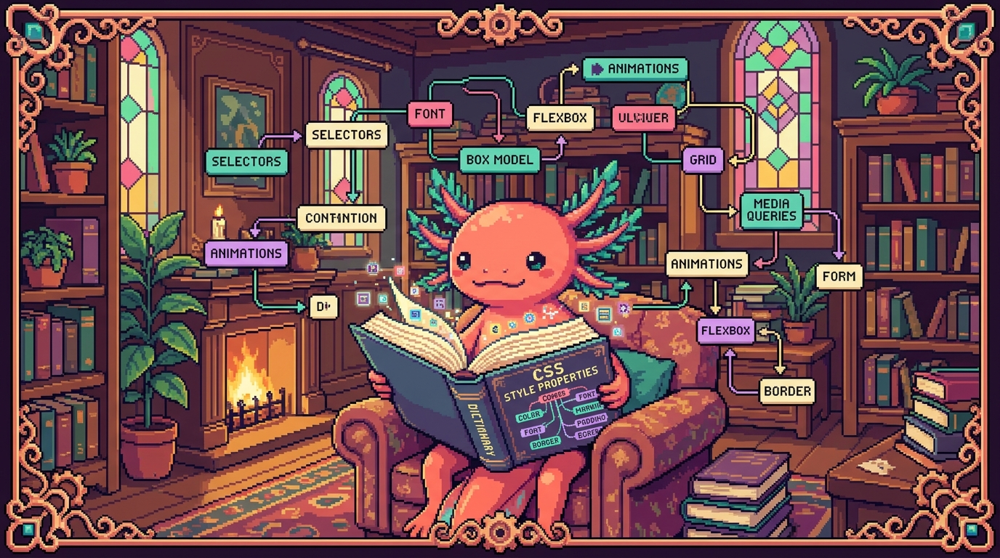

# Capítulo 15 — Glosario de CSS y mapa

<p align="center">
  
</p>


> ¡Llegaste al final del módulo de CSS! 🎉 Bit, el ajolote, flota feliz en su pecera, porque entre los dos recorrieron un montón de terreno: selectores, cajas, colores, flexbox, grid, variables y bastante más. Este capítulo no se parece a los anteriores. No vas a aprender nada nuevo; vas a **ordenar** lo que ya tienes en la cabeza. Es como cuando terminas un rompecabezas y por fin ves la imagen entera. Aquí encontrarás un **glosario alfabético** con cada término resuelto en pocas líneas, un **mapa mental** para entender cómo encaja todo y un **repaso final** para confirmar que el módulo quedó dominado. Hazlo sin prisa, como tomando un café: lee, asiente con la cabeza y date cuenta de lo lejos que llegaste.

---

## 1. Cómo usar este glosario

Piensa en CSS como una ciudad donde cada término es una calle. Durante el módulo las recorriste de a una. Lo que vamos a hacer ahora es colgar el plano en la pared para verla entera desde arriba.

Cada entrada del glosario tiene la misma estructura:

- **Definición simple**: qué es, dicho con palabras de todos los días.
- **Para qué sirve**: por qué deberías prestarle atención.
- **Dónde se usa en un repo real**: en cuál de tus proyectos (tunal-digital, RachaSimple, Faro/Organizer) aparece de verdad.

> ### 💡 Tip
> No trates de memorizar el glosario de una sentada. Léelo hoy, vuelve mañana y fíjate cuántos términos ya te suenan. La memoria de los conceptos de programación se construye repasando de a poco, con espacios entremedio, no a base de atracones.

> ### 🔎 En tu código
> Casi todos los ejemplos de este capítulo apuntan a `styles.css` de **tunal-digital**, que fue el archivo central del módulo. Tenlo abierto en otra pestaña mientras lees: ver el término real, en su sitio, vale más que mil definiciones.

---

## 2. Glosario alfabético

Vamos en orden alfabético, así puedes volver a buscar cualquier palabra rápido, igual que en un diccionario.

### A — B

> ### 🟦 ¿Qué significa? — *Atributo (selector de atributo)*
> Un selector que apunta a elementos según un atributo HTML, como `[type="email"]` o `[href]`. Te permite estilar elementos sin tener que ponerles una clase. En `styles.css` de **tunal-digital** podrías usar `input[type="text"]` para darle el mismo borde a todos los campos de texto del formulario de contacto.

> ### 🟦 ¿Qué significa? — *Border (borde)*
> Es la línea que rodea una caja, justo entre el padding y el margin. Sirve para separar elementos a la vista y darles forma. En **tunal-digital**, las tarjetas de servicios suelen llevar `border: 1px solid #ddd;` para que se vea claramente dónde empieza y termina cada una.

> ### 🟦 ¿Qué significa? — *Box model (modelo de cajas)*
> La idea de que cada elemento es una caja con cuatro capas: contenido, padding, border y margin. Te ayuda a entender cuánto espacio ocupa cualquier cosa en la página. Es la base de **todo** el layout de `styles.css`: si no lo tienes claro, los espacios se vuelven un misterio sin solución.

> ### 🟦 ¿Qué significa? — *box-sizing*
> Una propiedad que decide si el ancho que escribes incluye el padding y el border (`border-box`) o no (`content-box`). Sirve para que las cajas no se "inflen" cuando menos lo esperas. En `styles.css` casi siempre se pone `box-sizing: border-box;` al principio, para que las medidas sean predecibles.

```css
/* Patrón clásico al inicio de styles.css */
* {
  box-sizing: border-box;
  margin: 0;
  padding: 0;
}
```

### C

> ### 🟦 ¿Qué significa? — *Cascada (cascade)*
> El conjunto de reglas que decide qué estilo gana cuando varios apuntan al mismo elemento. Sirve para resolver los conflictos de forma ordenada: cuentan el origen, la especificidad y el orden en que aparecen. La "C" de CSS viene precisamente de "Cascading". En `styles.css`, la cascada es la que decide, por ejemplo, si gana el color del `body` o el de una clase más específica.

> ### 🟦 ¿Qué significa? — *Clase (class)*
> Un selector que empieza con punto, como `.boton`, y apunta a todos los elementos que llevan ese `class` en el HTML. Te permite reutilizar el mismo estilo en muchos sitios a la vez. En **tunal-digital**, `.tarjeta-servicio` se aplica a cada bloque de servicio que se repite.

> ### 🟦 ¿Qué significa? — *Color*
> El valor que define los tonos del texto, los fondos y los bordes. Se escribe con nombres (`red`), hex (`#3b82f6`), `rgb()` o `hsl()`. Sirve para darle identidad visual a la página. En `styles.css`, los colores de marca de **tunal-digital** suelen guardarse en variables para no repetir el mismo hex por todos lados.

> ### 🟦 ¿Qué significa? — *Comentario*
> Texto que el navegador ignora por completo, escrito entre `/* */`. Sirve para dejarle notas a tu yo del futuro o a tu equipo. En cualquier `styles.css` bien cuidado verás comentarios como `/* Sección hero */` separando los bloques.

### D — E

> ### 🟦 ¿Qué significa? — *Declaración*
> La pareja formada por una propiedad y su valor, como `color: blue;`. Es la unidad mínima de estilo: una orden concreta. Cada línea dentro de las llaves `{ }` de `styles.css` es una declaración.

> ### 🟦 ¿Qué significa? — *display*
> La propiedad que decide cómo se comporta una caja: en bloque (`block`), en línea (`inline`), como contenedor flexible (`flex`) o de rejilla (`grid`). Sirve para controlar cómo fluye el layout. En `styles.css`, poner `display: flex;` en el `<nav>` de **tunal-digital** alinea los enlaces en una fila.

> ### 🟦 ¿Qué significa? — *Especificidad (specificity)*
> Un sistema de "puntos" que mide qué tan específico es un selector; el más específico gana en la cascada. Sirve para anticipar qué estilo va a aplicarse. Un id (`#hero`) pesa más que una clase (`.hero`), y esa pesa más que una etiqueta (`section`). Tener esto claro te ahorra horas de pelea con `styles.css`.

```css
/* Más específico (id) gana sobre menos específico (etiqueta) */
section { color: gray; }   /* especificidad baja */
#hero   { color: black; }  /* especificidad alta: este gana */
```

### F

> ### 🟦 ¿Qué significa? — *Flexbox*
> Un sistema de layout en **una dimensión** (fila o columna) que reparte el espacio entre los elementos. Sirve para alinear y distribuir cosas con poco esfuerzo, como una barra de navegación o una fila de botones. En **tunal-digital**, el menú superior usa flexbox; en **RachaSimple**, Tailwind expresa lo mismo con clases como `flex items-center`.

> ### 🟦 ¿Qué significa? — *flex-direction*
> La propiedad de flexbox que decide si los hijos van en fila (`row`) o en columna (`column`). Sirve para cambiar la orientación sin tocar el HTML. En `styles.css`, pasar a `flex-direction: column;` apila el menú en las pantallas pequeñas.

> ### 🟦 ¿Qué significa? — *Fuente (font-family)*
> La propiedad que elige el tipo de letra. Es lo que le da voz y carácter al texto. En **tunal-digital** se suele definir `font-family` en el `body` para que toda la página herede la misma tipografía.

### G

> ### 🟦 ¿Qué significa? — *Grid (CSS Grid)*
> Un sistema de layout en **dos dimensiones** (filas y columnas a la vez). Sirve para armar cuadrículas completas, como una galería o un dashboard. En **tunal-digital**, la sección de servicios puede ser una rejilla con `display: grid; grid-template-columns: repeat(3, 1fr);`.

> ### 🟦 ¿Qué significa? — *gap*
> La propiedad que pone espacio **entre** los elementos de un flexbox o un grid, sin tocar los bordes externos. Sirve para separar tarjetas o columnas de forma limpia, y reemplaza el viejo truco de ponerle margin a cada hijo. En `styles.css`, `gap: 1rem;` separa las tarjetas de servicios.

```css
.servicios {
  display: grid;
  grid-template-columns: repeat(3, 1fr); /* 3 columnas iguales */
  gap: 1.5rem;                            /* espacio entre tarjetas */
}
```

### H

> ### 🟦 ¿Qué significa? — *Herencia (inheritance)*
> El mecanismo por el que ciertos estilos pasan solos de un elemento padre a sus hijos (como `color` o `font-family`). Te ahorra repetir reglas una y otra vez. En `styles.css`, si pones `color` en el `body`, casi todo el texto de **tunal-digital** lo hereda sin que escribas nada más.

> ### 🟦 ¿Qué significa? — *Hex (color hexadecimal)*
> Una forma de escribir colores con `#` y seis dígitos, como `#3b82f6`. Sirve para precisar tonos exactos de marca. En las variables de color de **tunal-digital**, los valores de marca casi siempre están en hex.

> ### 🟦 ¿Qué significa? — *hover (pseudo-clase :hover)*
> Un estado que se activa cuando el cursor pasa por encima de un elemento. Sirve para darle feedback al usuario, por ejemplo cambiar el color de un botón al apuntarlo. En `styles.css`, `.boton:hover { background: #2563eb; }` hace que el botón reaccione al ratón.

### I — L

> ### 🟦 ¿Qué significa? — *id (selector de id)*
> Un selector que empieza con `#`, como `#hero`, y apunta a **un único** elemento. Sirve para estilar algo que aparece una sola vez en la página. Pesa muchísimo en especificidad, así que en `styles.css` conviene usarlo con cuidado.

> ### 🟦 ¿Qué significa? — *inline (display inline)*
> Un comportamiento de caja que fluye dentro del texto, sin saltos de línea, como un `<span>` o un `<a>`. Sirve para resaltar palabras sin partir el párrafo. En `styles.css`, los enlaces dentro de un texto son inline por defecto.

> ### 🟦 ¿Qué significa? — *!important*
> Una marca que obliga a una declaración a ganar casi siempre, saltándose la especificidad normal. Sirve para emergencias, pero conviene evitarla porque ensucia la cascada. Si ves `!important` por todas partes en un `styles.css`, suele ser señal de que algo está mal ordenado.

### M

> ### 🟦 ¿Qué significa? — *Margin (margen)*
> El espacio **por fuera** del borde de una caja, el que la separa de sus vecinas. Sirve para dejar aire entre los elementos. En `styles.css`, `margin: 0 auto;` es el truco de toda la vida para centrar un contenedor horizontalmente en **tunal-digital**.

> ### 🟦 ¿Qué significa? — *Media query*
> Una regla `@media` que aplica estilos solo si se cumple una condición, como cierto ancho de pantalla. Sirve para hacer diseño **responsive**, es decir, que se adapte a móvil y a escritorio. En `styles.css`, `@media (max-width: 600px)` reacomoda el menú de **tunal-digital** en los celulares.

```css
/* Responsive: en pantallas pequeñas, una sola columna */
@media (max-width: 600px) {
  .servicios {
    grid-template-columns: 1fr;
  }
}
```

### O — P

> ### 🟦 ¿Qué significa? — *Padding (relleno)*
> El espacio **por dentro** de la caja, entre el contenido y el borde. Sirve para que el texto no quede pegado al borde, apretado. En `styles.css`, las tarjetas de **tunal-digital** llevan `padding: 1rem;` para respirar un poco por dentro.

> ### 🟦 ¿Qué significa? — *position*
> La propiedad que controla cómo se ubica una caja: `static` (lo normal), `relative`, `absolute`, `fixed` o `sticky`. Sirve para sacar elementos del flujo o fijarlos en pantalla. En `styles.css`, un encabezado que se queda arriba mientras haces scroll usa `position: sticky; top: 0;`.

> ### 🟦 ¿Qué significa? — *Propiedad*
> El nombre de la característica que quieres cambiar, como `color`, `margin` o `display`. Es el "qué" de cada orden de estilo. En la declaración `color: blue;`, la propiedad es `color`.

> ### 🟦 ¿Qué significa? — *Pseudo-clase*
> Una palabra clave con `:` que apunta a un **estado** del elemento, como `:hover`, `:focus` o `:first-child`. Sirve para estilar según lo que ocurre o según la posición. En `styles.css`, `:focus` mejora la accesibilidad de los campos del formulario de **tunal-digital**.

> ### 🟦 ¿Qué significa? — *Pseudo-elemento*
> Una palabra clave con `::` que apunta a una **parte** del elemento o crea contenido nuevo, como `::before`, `::after` o `::placeholder`. Sirve para decorar sin tocar el HTML. En `styles.css`, `::after` puede añadirle un pequeño adorno a un título.

### R — S

> ### 🟦 ¿Qué significa? — *rem / em (unidades relativas)*
> Unidades de tamaño que dependen de la fuente: `rem` se basa en el tamaño raíz del documento y `em` en el del propio elemento. Sirven para escalar de forma consistente y accesible. En `styles.css`, usar `rem` para `padding` y tipografía mantiene **tunal-digital** bien proporcionado cuando alguien cambia el zoom.

> ### 🟦 ¿Qué significa? — *Regla (rule)*
> El bloque completo: un selector más sus declaraciones entre llaves. Es la unidad que el navegador lee y aplica. Cada `selector { ... }` de `styles.css` es una regla.

> ### 🟦 ¿Qué significa? — *Selector*
> El patrón que decide **a qué** elementos se aplica un estilo, como `.boton`, `#hero` o `p`. Sirve para apuntar con precisión. Es el primer ingrediente de toda regla en `styles.css`.

### T

> ### 🟦 ¿Qué significa? — *Tailwind (CSS de utilidades)*
> Un framework que te da clases pequeñas y listas para usar (`p-4`, `flex`, `text-blue-500`) que escribes directamente en el HTML/JSX. Sirve para estilar rápido sin escribir CSS a mano. **RachaSimple** y **Faro/Organizer** lo usan; **tunal-digital** no (ahí escribes `styles.css` a mano).

> ### 🟦 ¿Qué significa? — *transition*
> La propiedad que hace que un cambio de estilo ocurra de forma **gradual** en vez de instantánea. Sirve para suavizar efectos, como un botón que cambia de color poco a poco al pasar el cursor. En `styles.css`, `transition: background 0.2s;` hace que el `:hover` se sienta suave.

```css
.boton {
  background: #3b82f6;
  transition: background 0.2s ease; /* cambio suave */
}
.boton:hover {
  background: #2563eb;
}
```

### U — V

> ### 🟦 ¿Qué significa? — *Unidad*
> El sufijo que le da medida a un número: `px`, `%`, `rem`, `em`, `vh`, `vw`. Sirve para decir "cuánto", ya sea de forma exacta o relativa. En `styles.css`, mezclas `px` para los detalles finos y `%` o `rem` para los tamaños que tienen que adaptarse.

> ### 🟦 ¿Qué significa? — *Valor*
> El "cuánto" o el "cuál" de una declaración, como `blue` en `color: blue;` o `1rem` en `padding: 1rem;`. Es la respuesta concreta que le das a la propiedad. Cada propiedad acepta sus propios tipos de valor.

> ### 🟦 ¿Qué significa? — *Variable CSS (custom property)*
> Un valor con nombre que defines una vez (`--color-marca: #3b82f6;`) y reutilizas con `var(--color-marca)`. Sirve para cambiar toda la paleta desde un solo lugar y para armar **temas** (claro/oscuro). El propio `estilos.css` de este manual usa variables para sus temas; y en `styles.css` de **tunal-digital** guardan así los colores de marca.

```css
:root {
  --color-marca: #3b82f6;
  --espacio: 1rem;
}
.boton {
  background: var(--color-marca);
  padding: var(--espacio);
}
```

> ### 🟦 ¿Qué significa? — *vh / vw (viewport height/width)*
> Unidades relativas al tamaño de la **ventana**: `100vh` es toda la altura visible y `100vw` todo el ancho. Sirven para secciones a pantalla completa. En `styles.css`, una sección hero con `min-height: 100vh;` ocupa toda la pantalla al cargar **tunal-digital**.

### Z

> ### 🟦 ¿Qué significa? — *z-index*
> Un número que decide qué elemento queda **encima** de otro cuando se superponen. Sirve para controlar las capas, como un menú que tiene que tapar el contenido. En `styles.css`, un encabezado `sticky` suele llevar un `z-index` alto para que nada lo cubra. Solo funciona en elementos cuyo `position` no sea `static`.

> ### ⚠️ Cuidado
> `z-index` solo hace efecto si el elemento tiene `position: relative`, `absolute`, `fixed` o `sticky`. Si lo pones sobre un elemento `static`, no pasa absolutamente nada, y te vas a volver loco buscando el porqué. Bit ya cayó en esa trampa más de una vez. 🐾

---

## 3. Mapa mental de CSS

Aquí tienes la ciudad vista desde arriba. Léelo de arriba hacia abajo: las ramas grandes son los grandes temas del módulo, y las hojas son los términos que ya conoces.

```
                        ┌─────────────────────────┐
                        │           CSS           │
                        │ (dar estilo al HTML)     │
                        └────────────┬────────────┘
                                     │
        ┌────────────┬───────────────┼───────────────┬────────────────┐
        │            │               │               │                │
   ┌────▼────┐  ┌────▼─────┐   ┌─────▼──────┐  ┌──────▼──────┐  ┌──────▼──────┐
   │ SINTAXIS│  │ CÓMO GANA│   │   CAJAS    │  │   LAYOUT    │  │ DINÁMICO Y  │
   │         │  │ UN ESTILO│   │ (box model)│  │             │  │ REUTILIZAR  │
   └────┬────┘  └────┬─────┘   └─────┬──────┘  └──────┬──────┘  └──────┬──────┘
        │            │               │                │                │
   • selector   • cascada       • content        • display       • variables
   • propiedad  • especificidad • padding         • flexbox         (var/--)
   • valor      • herencia      • border          • grid          • transition
   • declaración• !important    • margin          • gap           • pseudo-clase
   • regla                      • box-sizing      • position        (:hover)
   • comentario                 • width/height    • z-index       • pseudo-elemento
                                                  • media query     (::before)
                                                                  • Tailwind
                                                                    (en RachaSimple/
                                                                     Faro)
```

> ### 💡 Tip
> Fíjate en cómo las cinco ramas cuentan una historia de principio a fin: primero **escribes** una regla (sintaxis), luego el navegador decide **cuál gana** (cascada), esa regla afecta a una **caja**, las cajas se acomodan con el **layout**, y al final le das vida y orden con las cosas **dinámicas y reutilizables**. Si entiendes esa secuencia, entiendes CSS.

> ### 🔎 En tu código
> El mapa vale igual aunque uses Tailwind. Cuando en **RachaSimple** escribes `class="flex gap-4 p-2 hover:bg-blue-600"`, estás usando display + gap + padding + pseudo-clase: exactamente los mismos conceptos del mapa, solo que con nombres cortos. Tailwind no reemplaza a CSS, lo empaqueta.

---

## 4. Repaso final (en vez de teoría nueva)

En lugar de meterte algo nuevo, recorramos rápido los puntos clave del módulo, como quien repasa los apuntes antes de cerrar el cuaderno.

**1. Toda regla tiene tres partes.** Selector, propiedad y valor. Si te pierdes, vuelve a esto: `¿a quién?` (selector), `¿qué le cambio?` (propiedad), `¿a cuánto?` (valor).

**2. Cuando dos estilos pelean, gana la combinación de cascada + especificidad + orden.** Lo más específico; y a igual especificidad, lo que aparece **después** en el archivo. La herencia se encarga de rellenar lo que no especificas.

**3. Todo es una caja.** Contenido, padding, border, margin. Con `box-sizing: border-box;`, medir se vuelve fácil.

**4. Para acomodar cajas usas flexbox (una dimensión) o grid (dos dimensiones).** Y `gap` para separarlas con elegancia.

**5. Para que se adapte a móvil, usas media queries.** Y para reutilizar valores y armar temas, usas variables CSS.

> ### 🟦 ¿Qué significa? — *Responsive (diseño adaptable)*
> Un sitio que se ve bien en cualquier tamaño de pantalla, desde el celular hasta el monitor grande. Se logra con media queries y unidades relativas. Sirve para no dejar fuera a quien navega desde el móvil, que hoy es la mayoría. En **tunal-digital**, el responsive es lo que hace que el menú se reacomode en pantallas pequeñas.

> ### ⚠️ Cuidado
> No confundas **padding** (espacio por dentro) con **margin** (espacio por fuera). Es el error más típico al empezar. Truco de Bit: el padding es el **acolchado dentro** de un sobre; el margin es la **distancia entre dos sobres** sobre la mesa. ✉️

> ### 💡 Tip
> Si alguna vez un estilo "no funciona", revísalo en este orden: (1) ¿el selector apunta bien? (2) ¿hay otra regla más específica ganándole? (3) ¿el elemento tiene el `display` o el `position` correcto para lo que intentas? El 90% de los problemas de CSS está en uno de esos tres.

---

## 5. Lo que sigue

Cerraste el módulo de CSS con el mapa entero en la cabeza. Ya sabes escribir reglas, ganar peleas de cascada, construir layouts y reutilizar estilos. Cuando entres a frameworks como Tailwind en **RachaSimple** o **Faro/Organizer**, no vas a estar aprendiendo algo nuevo desde cero: vas a estar aplicando estos mismos conceptos con otra ropa. Y eso, créeme, es una ventaja enorme.

Bit te choca la patita. 🐾 Próxima parada: darle interactividad de verdad con JavaScript, donde el `main.js` de **tunal-digital** por fin tendrá su capítulo. Pero esa es otra historia.

---

## ✅ Checklist — ¿ya domino esto?

- [ ] Sé nombrar las tres partes de una regla: selector, propiedad y valor.
- [ ] Puedo explicar con mis palabras qué es la cascada y la especificidad.
- [ ] Distingo padding de margin sin dudar.
- [ ] Entiendo el modelo de cajas y para qué sirve `box-sizing: border-box;`.
- [ ] Sé cuándo usar flexbox (una dimensión) y cuándo grid (dos dimensiones).
- [ ] Puedo escribir una media query básica para hacer un sitio responsive.
- [ ] Sé declarar y reutilizar una variable CSS con `var()`.
- [ ] Reconozco pseudo-clases (`:hover`) y pseudo-elementos (`::before`).
- [ ] Entiendo que Tailwind en RachaSimple y Faro usa estos mismos conceptos con clases cortas.
- [ ] Puedo dibujar de memoria el mapa mental de las cinco ramas de CSS.

---

## 🧪 Ejercicios

1. **Sin computadora.** En una hoja, escribe los cinco grandes temas del mapa mental (sintaxis, cascada, cajas, layout, dinámico) y cuelga al menos cuatro términos bajo cada uno, de memoria. Luego compara con el mapa del capítulo.

2. **Sin computadora.** Explícale a alguien (o a Bit en voz alta) la diferencia entre padding y margin usando tu propia analogía, distinta a la del sobre.

3. 💻 Abre `styles.css` de **tunal-digital** y busca un ejemplo real de cada uno de estos términos: una clase, una pseudo-clase, una media query y una variable CSS. Anota en qué línea está cada uno.

4. 💻 En `styles.css`, encuentra una regla y reescríbela en un comentario nombrando sus partes, así: `/* selector: .boton | propiedad: color | valor: white */`. Hazlo con tres reglas distintas.

5. 💻 Toma un componente de **RachaSimple** con clases de Tailwind (por ejemplo algo con `flex gap-4 p-2`) y, debajo, escribe en un comentario el CSS "tradicional" equivalente que harías en `styles.css`. Comprueba que entiendes la traducción.

6. 💻 Crea un archivo nuevo `repaso.css` y, sin mirar el manual, escribe de memoria: una variable en `:root`, una regla con `:hover` y `transition`, y una media query. Luego revisa el glosario para verificar que la sintaxis quedó bien.
