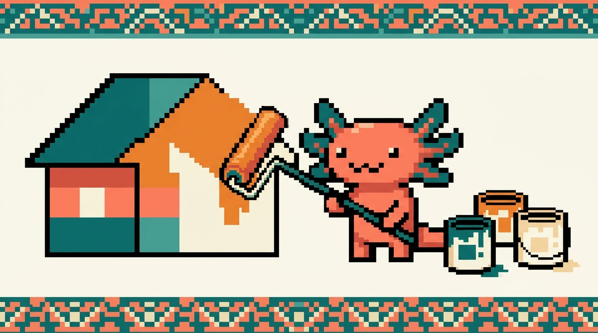

# Módulo 02 — CSS

  

> **Objetivo del módulo:** aprender **CSS**, el lenguaje que controla **cómo se ve** una página:
> colores, tipografías, tamaños, espacios y la disposición de los elementos. Al terminar, podrás
> dar órdenes precisas como *"este fondo en `#1B6B6B`, este texto a `18px`, esta tarjeta con
> `16px` de espaciado interno y esquinas de `12px`"* — exactamente la habilidad que buscabas.

Si HTML era el **esqueleto** de la casa, CSS es la **pintura y la decoración**. Es el módulo
donde tu sitio pasa de verse "feo y plano" a verse como tú quieres.

---

## ¿De dónde sale esto en TUS proyectos?

- `tunal-digital/sitio-web/styles.css` es CSS "puro" (26 KB de estilos): el diseño "Tech
  Atardecer" de tu sitio. Es nuestro ejemplo principal.
- En `RachaSimple` y `Faro` el CSS se escribe con **Tailwind** (una forma abreviada de CSS que
  verás más adelante); entenderlo requiere primero dominar el CSS normal, que es justo esto.

---

## ¿Qué vas a poder hacer al terminar?

- Conectar CSS a tu HTML y entender la sintaxis `selector { propiedad: valor; }`.
- Elegir colores con precisión (hexadecimal, RGB, HSL) y entender las unidades (`px`, `rem`, `%`).
- Controlar tipografías, tamaños y espaciados.
- Dominar el **modelo de cajas** (la base de TODO el diseño web).
- Acomodar elementos con **Flexbox** (filas y columnas que se adaptan).
- Hacer que tu página se vea bien en **móvil y escritorio** (*responsive*).

---

## Capítulos

| # | Capítulo | Qué cubre |
|---|---|---|
| 01 | [¿Qué es CSS?](01-que-es-css.md) | Cómo se conecta al HTML, sintaxis, selectores |
| 02 | [Colores, unidades y tipografía](02-colores-y-tipografia.md) | Hex, RGB, HSL, px/rem/%, fuentes |
| 03 | [El modelo de cajas](03-modelo-de-cajas.md) | content, padding, border, margin |
| 04 | [Layout con Flexbox](04-flexbox.md) | Filas/columnas flexibles, alineación |
| 05 | [Diseño responsive](05-responsive.md) | Media queries, mobile-first, viewport |
| 06 | [Selectores y especificidad](06-selectores-y-especificidad.md) | Combinadores, por atributo, quién gana |
| 07 | [La cascada y la herencia](07-cascada-y-herencia.md) | Conflictos, herencia, inherit/initial |
| 08 | [Posicionamiento](08-posicionamiento.md) | position, z-index, float, overflow |
| 09 | [CSS Grid a fondo](09-grid.md) | Cuadrículas en 2D, fr, areas, Grid vs Flexbox |
| 10 | [Transiciones y animaciones](10-transiciones-y-animaciones.md) | transition, transform, @keyframes |
| 11 | [Unidades modernas y funciones](11-unidades-y-funciones.md) | clamp, min/max, calc, vw/vh |
| 12 | [Variables CSS y temas](12-variables-y-temas.md) | Custom properties, tema claro/oscuro |
| 13 | [Pseudo-clases y pseudo-elementos](13-pseudoclases-y-pseudoelementos.md) | `:hover`, `::before`, `:nth-child` |
| 14 | [Mini-proyecto: una tarjeta con estilo](14-mini-proyecto-tarjeta.md) | Construir una tarjeta bonita paso a paso |
| 15 | [Glosario de CSS y mapa](15-glosario-css.md) | Todos los términos + mapa mental |

> ✅ **Módulo 02 — versión ampliada (capítulos 01–15, ~95 páginas).**

➡️ Empieza por **[Capítulo 01 — ¿Qué es CSS?](01-que-es-css.md)**.
