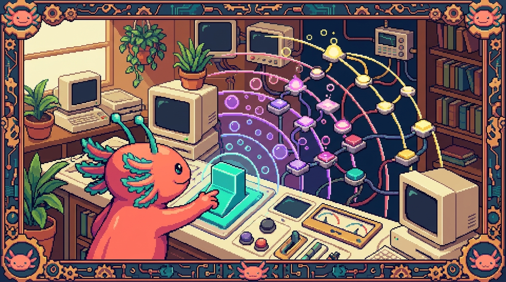

# Capitulo 07 — Eventos a fondo

<p align="center">
  
</p>


> Hola otra vez, soy **Bit**, tu ajolote guia. En el capitulo pasado aprendimos a "escuchar" un clic con `addEventListener`. Hoy vamos a abrir esa caja y ver que tiene dentro un evento: de donde salio, por que un clic en un botoncito tambien "despierta" al contenedor que lo rodea, y como un solo escucha puede ocuparse de cientos de elementos sin despeinarse. Lo haremos con el menu y el formulario de verdad de **tunal-digital**. Tranquilo: esto es de lo mas util que vas a sacar de JavaScript. Mueve la cola, que arrancamos.

## 1. Repaso rapido: que es un evento

Antes de meternos en lo nuevo, recordemos la base. Un **evento** es algo que pasa en la pagina: el usuario hace clic, mueve el raton, presiona una tecla, envia un formulario o desplaza la pantalla. JavaScript puede reaccionar a cualquiera de esas cosas.

> ### 🟦 ¿Que significa? — *Evento*
> Es un aviso de que "algo paso" en el navegador: un clic, una tecla, el envio de un formulario. El navegador lo crea por su cuenta y tu decides si reaccionas o lo dejas pasar.
> **Para que sirve:** hacer paginas interactivas que respondan a lo que hace la persona.
> **Donde se usa en un repo real:** en `main.js` de **tunal-digital**, un clic en el boton del menu abre la navegacion, y el envio de un formulario manda el mensaje de contacto.

> ### 🟦 ¿Que significa? — *Listener (escucha)*
> Es una funcion que se queda "esperando" a que ocurra cierto evento. Cuando ocurre, el navegador la ejecuta.
> **Para que sirve:** conectar un evento (por ejemplo un clic) con el codigo que quieres que corra cuando suceda.
> **Donde se usa en un repo real:** `boton.addEventListener("click", abrirMenu)` en **tunal-digital** registra un escucha sobre el boton hamburguesa.

```javascript
// La forma que ya conoces de registrar un escucha
const boton = document.querySelector(".menu-toggle");

boton.addEventListener("click", function () {
  console.log("Hiciste clic en el menu");
});
```

> ### 💡 Tip
> `addEventListener` significa literalmente "agregar un escucha de eventos". Si lees el nombre en ingles con calma, te esta diciendo justo lo que hace.

## 2. El objeto `event`: la "ficha" de lo que paso

Cada vez que ocurre un evento, el navegador le entrega a tu funcion un pequeño regalo: un objeto repleto de informacion sobre lo que acaba de pasar. Por costumbre lo llamamos `event` o, mas corto, `e`.

> ### 🟦 ¿Que significa? — *Objeto event*
> Es un objeto (una "ficha" con datos) que el navegador entrega a tu funcion cuando ocurre un evento. Adentro viene quien lo disparo, donde estaba el raton, que tecla se presiono, etc.
> **Para que sirve:** conocer los detalles del evento para reaccionar mejor: que elemento, que tecla, posicion del raton...
> **Donde se usa en un repo real:** en el formulario de contacto de **tunal-digital**, el escucha del `submit` recibe el `event` y llama a `event.preventDefault()` para que la pagina no se recargue.

```javascript
boton.addEventListener("click", function (event) {
  // 'event' es la ficha con todos los datos de este clic
  console.log(event.type);    // "click"
  console.log(event.target);  // el elemento donde se hizo clic
});
```

Fijate en `function (event)`: ese parametro lo rellena el navegador solo. Tu no lo pasas; te lo da el navegador en bandeja.

> ### 🟦 ¿Que significa? — *event.type*
> Una propiedad del objeto event que te dice el nombre del evento en texto: `"click"`, `"submit"`, `"keydown"`, etc.
> **Para que sirve:** saber que clase de evento estas manejando, util cuando una misma funcion atiende varios tipos.
> **Donde se usa en un repo real:** en el chat con IA de **tunal-digital** podrias mirar `event.type` para distinguir un clic en el boton "Enviar" de un `keydown` con Enter.

> ### 🔎 En tu codigo
> En `main.js` de **tunal-digital**, las funciones de atajo (esos helpers cortos que evitan escribir `document.querySelector` mil veces) acaban registrando escuchas que reciben este `event`. Cuando veas `e =>` o `function (e)`, ese `e` es exactamente el objeto event del que hablamos.

### 2.1 Propiedades utiles del event

Segun el tipo de evento, el `event` trae unos datos u otros:

- En un **clic**: `event.clientX` y `event.clientY` (posicion del raton en pixeles).
- En una **tecla**: `event.key` (la tecla, por ejemplo `"Enter"`).
- En un **formulario**: el evento `submit`, donde brilla `preventDefault()`.

> ### 🟦 ¿Que significa? — *preventDefault()*
> Es un metodo del objeto event que cancela la accion "por defecto" que el navegador haria. Por ejemplo: un formulario, por defecto, recarga la pagina al enviarse; `preventDefault()` lo impide.
> **Para que sirve:** tomar tu el control en lugar de dejar que el navegador haga su comportamiento automatico.
> **Donde se usa en un repo real:** es clave en el formulario de **tunal-digital**: sin `preventDefault()`, al enviar el mensaje la pagina se recargaria y el `fetch` al Worker nunca llegaria a salir.

```javascript
const form = document.querySelector("#contacto");

form.addEventListener("submit", function (event) {
  event.preventDefault(); // no recargues la pagina, yo me encargo
  console.log("Enviando el mensaje sin recargar...");
  // aqui iria el fetch al Worker
});
```

## 3. `target` vs `currentTarget`: dos preguntas distintas

Esta es una de las confusiones mas tipicas cuando uno empieza, asi que ve sin prisa. Imagina un boton que lleva un icono y un texto dentro:

```html
<button class="menu-toggle">
  <span class="icono">☰</span>
  <span class="texto">Menu</span>
</button>
```

Si haces clic justo encima del icono `☰`, ¿sobre que elemento hiciste clic en realidad? Sobre el `<span class="icono">`, no sobre el `<button>`. Pero tu escucha esta colocado en el `<button>`. Ahi entran dos propiedades:

> ### 🟦 ¿Que significa? — *event.target*
> Es el elemento exacto donde nacio el evento, el mas profundo que recibio el clic (en el ejemplo, el `<span class="icono">`).
> **Para que sirve:** saber con precision sobre que cosa concreta hizo clic la persona.
> **Donde se usa en un repo real:** en el menu de **tunal-digital**, si pones un solo escucha en la lista `<ul>` y haces clic en un enlace, `event.target` te dice exactamente cual enlace tocaste.

> ### 🟦 ¿Que significa? — *event.currentTarget*
> Es el elemento que tiene puesto el escucha, es decir, donde llamaste a `addEventListener` (en el ejemplo, el `<button>`).
> **Para que sirve:** referirte siempre al elemento "dueño" del escucha, sin importar donde nacio el clic.
> **Donde se usa en un repo real:** util en **tunal-digital** cuando el escucha vive en un contenedor pero el clic puede caer en cualquier hijo; `currentTarget` sigue siendo siempre el contenedor.

```javascript
const boton = document.querySelector(".menu-toggle");

boton.addEventListener("click", function (event) {
  console.log(event.target);        // <span class="icono"> (donde caiste)
  console.log(event.currentTarget); // <button class="menu-toggle"> (donde escuchas)
});
```

> ### 💡 Tip
> Regla mnemotecnica de Bit: **target = el objetivo del dedo** (donde aterrizo el clic). **currentTarget = el current(actual) dueño del escucha**. Si dudas cual usar, casi siempre quieres `currentTarget` cuando trabajas con el elemento al que le pusiste el escucha.

> ### ⚠️ Cuidado
> Si guardas el evento y lo lees mas tarde (por ejemplo dentro de un `setTimeout`), `currentTarget` puede aparecerte como `null`. El navegador "limpia" `currentTarget` cuando el evento termina. Si vas a necesitar ese elemento despues, guardalo en una variable mientras el evento sigue vivo.

## 4. Propagacion y burbujeo (bubbling)

Llega la parte que parece magia pero tiene toda su logica. Cuando haces clic en un elemento que esta dentro de otro, el evento no se queda quieto ahi: "sube" por todos sus contenedores, igual que una burbuja en un vaso de agua que asciende hasta la superficie.

> ### 🟦 ¿Que significa? — *Propagacion de eventos*
> Es el viaje que hace un evento por el arbol de elementos HTML. No toca solo al elemento clicado, sino que recorre tambien a sus ancestros.
> **Para que sirve:** entender por que un clic en un hijo tambien "despierta" escuchas puestos en sus padres.
> **Donde se usa en un repo real:** en el menu de **tunal-digital**, un clic en un `<a>` dentro de un `<li>` dentro de un `<ul>` toca, por orden, a los tres.

> ### 🟦 ¿Que significa? — *Bubbling (burbujeo)*
> Es la fase de la propagacion en la que el evento sube desde el elemento tocado hacia sus padres, sus abuelos y asi hasta el `document`. Como una burbuja que asciende.
> **Para que sirve:** permite poner un solo escucha "arriba" y atender clics de muchos hijos (es la base de la delegacion, seccion 6).
> **Donde se usa en un repo real:** **tunal-digital** puede poner un escucha en el `<ul>` del menu y atender los clics de todos los `<a>` gracias al burbujeo.

Veamoslo. Con esta estructura:

```html
<ul id="menu">
  <li><a href="#inicio">Inicio</a></li>
  <li><a href="#servicios">Servicios</a></li>
</ul>
```

Si pones escuchas en los tres niveles y haces clic en un enlace:

```javascript
const menu = document.querySelector("#menu");
const item = document.querySelector("#menu li");
const enlace = document.querySelector("#menu a");

enlace.addEventListener("click", () => console.log("1) enlace"));
item.addEventListener("click",   () => console.log("2) li"));
menu.addEventListener("click",   () => console.log("3) ul"));
```

Al hacer clic en el enlace, la consola te mostrara, en este orden:

```
1) enlace
2) li
3) ul
```

El evento nacio en el `<a>` y fue burbujeando hacia arriba. Eso es el bubbling en accion.

> ### 🟦 ¿Que significa? — *Capturing (fase de captura)*
> Es la fase contraria al burbujeo: antes de bajar al elemento tocado, el evento desciende desde el `document` hacia el. Casi nunca la vas a usar, pero ahi esta.
> **Para que sirve:** interceptar un evento "antes" de que llegue al elemento; util en casos avanzados.
> **Donde se usa en un repo real:** raro en **tunal-digital**; se activa pasando `true` como tercer argumento: `addEventListener("click", fn, true)`. Por defecto es `false` (burbujeo).

> ### 💡 Tip
> El recorrido completo de verdad es: captura (de arriba hacia abajo) → llega al objetivo → burbujeo (de abajo hacia arriba). El 99% del tiempo solo te importa el burbujeo. Si nunca pasas `true`, ya lo estas usando.

## 5. `stopPropagation`: cortar el viaje

A veces NO te interesa que el evento siga subiendo. Pongamos un caso: tienes un escucha en el `document` que cierra el menu cuando clicas "fuera", pero un clic dentro del menu no deberia cerrarlo. Para eso cortas la propagacion.

> ### 🟦 ¿Que significa? — *stopPropagation()*
> Es un metodo del objeto event que detiene el viaje del evento: los escuchas de los ancestros ya no se van a enterar de este evento.
> **Para que sirve:** evitar que un clic "se escape" hacia contenedores que reaccionarian de forma no deseada.
> **Donde se usa en un repo real:** en **tunal-digital**, util si hay un escucha global que cierra menus al hacer clic fuera; dentro del menu se llama a `stopPropagation()` para que ese clic no cuente como "fuera".

```javascript
const menu = document.querySelector("#menu");

document.addEventListener("click", function () {
  console.log("clic en cualquier parte -> cerrar menu");
});

menu.addEventListener("click", function (event) {
  event.stopPropagation(); // este clic NO llega al document
  console.log("clic dentro del menu -> no lo cierres");
});
```

Con `stopPropagation()`, un clic dentro de `#menu` ya no dispara el escucha del `document`.

> ### ⚠️ Cuidado
> No abuses de `stopPropagation()`. Si cortas la propagacion en demasiados sitios, mas adelante te costara entender por que ciertos escuchas globales "no se enteran" de nada. Usalo solo cuando tengas un motivo claro.

> ### 🟦 ¿Que significa? — *stopImmediatePropagation()*
> El hermano mayor del anterior: ademas de frenar el viaje hacia los ancestros, impide que se ejecuten OTROS escuchas del mismo evento en el mismo elemento.
> **Para que sirve:** cuando un elemento tiene varios escuchas y quieres que no corra ninguno mas.
> **Donde se usa en un repo real:** muy raro; en **tunal-digital** casi siempre basta con `stopPropagation()`.

> ### 💡 Tip
> No mezcles `stopPropagation()` con `preventDefault()`. `preventDefault()` cancela la accion del navegador (recargar, seguir un enlace). `stopPropagation()` corta el viaje del evento entre elementos. Son cosas distintas, aunque a veces se usen juntas.

## 6. Delegacion de eventos: un escucha para muchos

Aqui esta la joya del capitulo. Imagina que el menu de **tunal-digital** tiene 8 enlaces y quieres reaccionar al clic de cada uno. Lo ingenuo seria poner 8 escuchas, uno por enlace. Pero gracias al burbujeo hay algo mucho mejor: pones UN solo escucha en el `<ul>` padre y dejas que los clics suban hasta el.

> ### 🟦 ¿Que significa? — *Delegacion de eventos*
> Es la tecnica de poner un solo escucha en un elemento padre y usar `event.target` para averiguar cual hijo recibio el evento. Se apoya en el burbujeo.
> **Para que sirve:** manejar muchos elementos con un solo escucha; ademas funciona con elementos que aun no existen (que se crean despues).
> **Donde se usa en un repo real:** en **tunal-digital**, un solo escucha en el `<ul>` del menu atiende los clics de todos los enlaces sin tener que poner uno por enlace.

```javascript
const menu = document.querySelector("#menu");

menu.addEventListener("click", function (event) {
  // ¿El clic cayo en un enlace?
  const enlace = event.target.closest("a");
  if (!enlace) return; // clic en otro lado del ul; lo ignoramos

  event.preventDefault();
  console.log("Vas a la seccion:", enlace.getAttribute("href"));
});
```

> ### 🟦 ¿Que significa? — *closest()*
> Es un metodo de los elementos que busca, empezando por el propio elemento y subiendo por sus padres, el primero que encaje con un selector CSS. Devuelve ese elemento o `null`.
> **Para que sirve:** en delegacion, dar con el "enlace" o "boton" real aunque el clic cayera sobre un icono que esta dentro de el.
> **Donde se usa en un repo real:** en el menu de **tunal-digital**, `event.target.closest("a")` se asegura de que, aunque cliques un icono dentro del enlace, te quedes con el `<a>` completo.

> ### 💡 Tip
> La delegacion luce de verdad con listas dinamicas. En **RachaSimple** (React + TanStack Query) las listas se vuelven a renderizar cuando llegan datos nuevos del servidor; con delegacion, un escucha en el contenedor sigue funcionando aunque los hijos cambien. (En React, eso si, lo normal es usar `onClick` directamente y el framework hace la delegacion por ti por debajo.)

> ### 🔎 En tu codigo
> En el JavaScript vanilla de **tunal-digital** la delegacion encaja perfecto porque no hay framework que te eche una mano: tu pones el escucha en el contenedor y resuelves con `event.target`. En **Faro/Organizer** (Next.js + React), en cambio, declaras `onClick` en el JSX y React gestiona la delegacion por dentro; entender este capitulo te ayuda a saber que esta pasando bajo el capo.

### 6.1 Por que la delegacion es genial

- **Menos memoria:** un escucha en lugar de cien.
- **Funciona con elementos nuevos:** si despues agregas un `<li>` con JavaScript, el escucha del padre ya lo cubre, sin registrar nada nuevo.
- **Codigo mas limpio:** toda la logica del menu vive en un solo sitio.

## 7. Eventos de teclado

No todo es clic. El teclado tiene sus propios eventos, muy presentes en buscadores y chats.

> ### 🟦 ¿Que significa? — *keydown*
> Es el evento que se dispara en el instante en que se presiona una tecla (antes de soltarla).
> **Para que sirve:** reaccionar a teclas: enviar con Enter, cerrar con Escape, navegar con las flechas.
> **Donde se usa en un repo real:** en el chat con IA de **tunal-digital**, detectar Enter en el `keydown` deja enviar el mensaje sin tener que clicar el boton.

> ### 🟦 ¿Que significa? — *event.key*
> Es la propiedad que te dice, en texto, que tecla se presiono: `"Enter"`, `"Escape"`, `"a"`, `"ArrowUp"`, etc.
> **Para que sirve:** identificar la tecla exacta para decidir que hacer.
> **Donde se usa en un repo real:** en el chat de **tunal-digital**, `if (event.key === "Enter")` decide enviar el mensaje al Worker.

```javascript
const input = document.querySelector("#mensaje-chat");

input.addEventListener("keydown", function (event) {
  if (event.key === "Enter" && !event.shiftKey) {
    event.preventDefault();          // no metas un salto de linea
    console.log("Enviar:", input.value);
    // aqui iria el fetch al Worker de tunal-digital
  }
});
```

> ### 💡 Tip
> `event.shiftKey` (y tambien `event.ctrlKey`, `event.altKey`) te dicen si esas teclas estaban pulsadas a la vez. El truco de "Enter envia, Shift+Enter hace salto de linea" se consigue justo asi, como en el ejemplo.

> ### ⚠️ Cuidado
> Existe un viejo `event.keyCode` (un numero por tecla). Esta **obsoleto**: usa siempre `event.key`, que es texto legible y no depende de codigos numericos imposibles de recordar.

## 8. Eventos de formulario

Los formularios tienen sus propios eventos, mas alla del clic en el boton. **tunal-digital** tiene un formulario de contacto, asi que esto te pilla de cerca.

> ### 🟦 ¿Que significa? — *submit*
> Es el evento que se dispara cuando se envia un formulario (al clicar un boton de tipo submit o al presionar Enter en un campo). Se escucha sobre el `<form>`, no sobre el boton.
> **Para que sirve:** interceptar el envio para validar datos o mandarlos con `fetch` sin recargar.
> **Donde se usa en un repo real:** en **tunal-digital**, el `submit` del formulario de contacto se intercepta para enviar el mensaje al Worker via `fetch`.

> ### 🟦 ¿Que significa? — *input (evento)*
> Es el evento que se dispara cada vez que cambia el valor de un campo mientras la persona escribe.
> **Para que sirve:** validar o reaccionar en vivo: contar caracteres, habilitar el boton, mostrar errores al instante.
> **Donde se usa en un repo real:** en **tunal-digital** podrias usar `input` para activar el boton "Enviar" solo cuando el campo de email tenga algo escrito.

> ### 🟦 ¿Que significa? — *change*
> Es el evento que se dispara cuando un campo cambia y la persona "termina" (por ejemplo, sale del campo o elige una opcion de un `<select>`).
> **Para que sirve:** reaccionar a cambios ya completados, no a cada tecla.
> **Donde se usa en un repo real:** util en **Faro/Organizer** para un `<select>` que filtra proyectos: el `change` dispara la nueva consulta.

```javascript
const form = document.querySelector("#contacto");
const email = document.querySelector("#email");
const enviar = document.querySelector("#enviar");

// Reaccion en vivo mientras escribe:
email.addEventListener("input", function (event) {
  enviar.disabled = event.target.value.trim() === "";
});

// Envio del formulario:
form.addEventListener("submit", function (event) {
  event.preventDefault();
  const datos = {
    email: email.value,
    mensaje: form.querySelector("#mensaje").value,
  };
  console.log("Enviando al Worker:", datos);
  // fetch("https://worker.tunal/...", { method: "POST", body: JSON.stringify(datos) })
});
```

> ### 🔎 En tu codigo
> En `main.js` de **tunal-digital**, el envio del formulario junta dos cosas de este capitulo: `event.preventDefault()` para no recargar, y despues un `fetch` al Worker para mandar el mensaje. Sin el `preventDefault`, el navegador recargaria y tu `fetch` nunca llegaria a terminar.

> ### 💡 Tip
> Para leer todos los campos de un formulario de un tiron existe `new FormData(form)`. Es comodisimo cuando el formulario tiene muchos campos, porque te ahorra ir leyendolos uno por uno.

## 9. Evento de scroll (desplazamiento)

> ### 🟦 ¿Que significa? — *scroll*
> Es el evento que se dispara cuando se desplaza (sube o baja) una pagina o un contenedor.
> **Para que sirve:** efectos como una barra que se encoge al bajar, un boton "subir arriba" que aparece, o animaciones al desplazar.
> **Donde se usa en un repo real:** en **tunal-digital** podria servir para que el header cambie de estilo cuando el usuario baja un poco la pagina.

```javascript
window.addEventListener("scroll", function () {
  const bajamos = window.scrollY > 80;
  document.querySelector("header").classList.toggle("compacto", bajamos);
});
```

> ### ⚠️ Cuidado
> El evento `scroll` se dispara MUCHISIMAS veces por segundo. Si dentro haces algo pesado, la pagina se va a sentir lenta. La solucion (que veras mas adelante) es "limitar" la frecuencia con tecnicas como *throttle* o *debounce*, o usar el moderno `IntersectionObserver`. Por ahora, manten el codigo del scroll bien ligero.

> ### 🟦 ¿Que significa? — *window.scrollY*
> Es una propiedad que te dice cuantos pixeles se ha desplazado la pagina en vertical desde lo mas arriba.
> **Para que sirve:** decidir acciones segun cuanto bajo la persona (por ejemplo, mostrar un boton tras 300px).
> **Donde se usa en un repo real:** en **tunal-digital**, comparar `window.scrollY` con un numero para activar el header compacto.

## 10. `removeEventListener`: dejar de escuchar

Registrar escuchas esta muy bien, pero a veces toca quitarlos: para evitar duplicados, liberar memoria o desactivar algo de forma temporal.

> ### 🟦 ¿Que significa? — *removeEventListener()*
> Es el metodo que quita un escucha que ya habias registrado, para que ese evento deje de ejecutar esa funcion.
> **Para que sirve:** dejar de reaccionar a un evento; evita fugas de memoria y comportamientos duplicados.
> **Donde se usa en un repo real:** en **tunal-digital**, util para que un escucha temporal (por ejemplo, cerrar un modal con Escape) deje de existir cuando el modal se cierra.

La regla de oro: para quitar un escucha necesitas **la misma funcion con nombre** que usaste al agregarlo. Una funcion anonima no hay forma de quitarla, porque no tienes manera de referirte a ella.

```javascript
function alPresionarEscape(event) {
  if (event.key === "Escape") {
    console.log("Cerrar modal");
    // y ya que cerramos, dejamos de escuchar:
    document.removeEventListener("keydown", alPresionarEscape);
  }
}

// Al abrir el modal, empezamos a escuchar:
document.addEventListener("keydown", alPresionarEscape);
```

> ### ⚠️ Cuidado
> Esto NO sirve para quitar un escucha:
> ```javascript
> elemento.addEventListener("click", () => hola());
> elemento.removeEventListener("click", () => hola()); // ¡otra funcion distinta!
> ```
> Aunque el codigo "se vea igual", son dos funciones diferentes en memoria. `removeEventListener` no encuentra nada que quitar. Por eso, si piensas quitar un escucha, usa una funcion con nombre.

> ### 🟦 ¿Que significa? — *opcion `once`*
> Es una opcion de `addEventListener` (`{ once: true }`) que hace que el escucha se ejecute UNA sola vez y se quite solo.
> **Para que sirve:** ahorrarte el `removeEventListener` a mano cuando solo te interesa reaccionar la primera vez.
> **Donde se usa en un repo real:** en **tunal-digital**, ideal para una animacion de bienvenida que solo debe ocurrir en el primer clic.

```javascript
boton.addEventListener("click", function () {
  console.log("Esto solo corre una vez");
}, { once: true });
```

> ### 💡 Tip
> En frameworks como **RachaSimple** (React) o **Faro/Organizer** (Next.js), cuando agregas escuchas "a mano" dentro de un `useEffect`, tienes que quitarlos en la funcion de limpieza del efecto. Es exactamente este `removeEventListener`, y olvidarlo es la causa numero uno de bugs raros. Apunta esto: lo veras de nuevo en el modulo de React.

## 11. Juntando todo: el menu de tunal-digital

Cerremos con un ejemplo que une varias piezas del capitulo: abrir y cerrar el menu, cerrarlo al clicar fuera (propagacion), y delegar los clics de los enlaces.

```javascript
const toggle = document.querySelector(".menu-toggle");
const menu = document.querySelector("#menu");

// 1) Abrir/cerrar con el boton hamburguesa
toggle.addEventListener("click", function (event) {
  event.stopPropagation();          // que este clic no llegue al document
  menu.classList.toggle("abierto");
});

// 2) Cerrar el menu si se hace clic fuera de el
document.addEventListener("click", function () {
  menu.classList.remove("abierto");
});

// 3) Delegacion: un solo escucha para todos los enlaces
menu.addEventListener("click", function (event) {
  event.stopPropagation();          // clic dentro del menu no lo cierra
  const enlace = event.target.closest("a");
  if (!enlace) return;
  console.log("Navegar a:", enlace.getAttribute("href"));
});
```

Lee este bloque dos veces: usa `stopPropagation` (seccion 5), delegacion con `closest` (seccion 6) y `classList.toggle`. Es codigo realista, del tipo que vive en `main.js` de **tunal-digital**.

> ### 🔎 En tu codigo
> Compara mentalmente: en **tunal-digital** (vanilla) escribes tu mismo toda esta orquestacion de escuchas. En **PolyPaw** (Python/Flet) no hay DOM ni eventos del navegador: Flet maneja la interaccion con sus propios callbacks. Y en **polypaw-nas** (Ubuntu/Samba/Cockpit) directamente no hay frontend: son servicios de servidor. Cada repo vive en un mundo distinto; este capitulo es el del mundo del navegador.

## ✅ Checklist — ¿ya domino esto?

- [ ] Se que el objeto `event` es la "ficha" con datos que el navegador pasa a mi funcion.
- [ ] Entiendo que `preventDefault()` cancela la accion automatica del navegador (ej. recargar al enviar un formulario).
- [ ] Puedo explicar la diferencia entre `event.target` (donde nacio el clic) y `event.currentTarget` (donde esta el escucha).
- [ ] Entiendo el burbujeo: un evento sube desde el elemento tocado hacia sus padres.
- [ ] Se cuando usar `stopPropagation()` y por que no debo abusar de el.
- [ ] Distingo `stopPropagation()` (corta el viaje) de `preventDefault()` (cancela la accion del navegador).
- [ ] Puedo escribir delegacion de eventos: un escucha en el padre + `event.target.closest(...)`.
- [ ] Se leer la tecla con `event.key` y reaccionar a Enter o Escape.
- [ ] Conozco los eventos `submit`, `input` y `change` de formularios.
- [ ] Se que `scroll` se dispara muchisimas veces y hay que mantenerlo ligero.
- [ ] Puedo quitar un escucha con `removeEventListener` usando una funcion con nombre, y conozco la opcion `{ once: true }`.

## 🧪 Ejercicios

1. **(Sin computadora)** Dibuja en papel la estructura `ul > li > a` del menu y, con flechas, muestra el camino del burbujeo cuando haces clic en un enlace. Escribe al lado quien seria `event.target` y quien `event.currentTarget` si el escucha esta en el `<ul>`.

2. 💻 Crea un HTML con un `<button>` que tenga dentro un `<span>` con texto. Pon un escucha en el boton y muestra en consola `event.target` y `event.currentTarget`. Haz clic justo sobre el texto del span y comprueba que son distintos.

3. 💻 Reproduce la delegacion del menu de **tunal-digital**: un `<ul>` con 4 enlaces y UN solo escucha en el `<ul>`. Al hacer clic en cualquier enlace, muestra en consola el `href` usando `event.target.closest("a")`. Comprueba que un clic en el espacio vacio del `<ul>` no rompe nada.

4. 💻 Construye un mini-chat: un `<input>` y, al presionar Enter (`keydown` + `event.key === "Enter"`), muestra el texto en consola y limpia el campo. Anade que Shift+Enter NO envie (pista: `event.shiftKey`). Inspirate en el chat con IA de **tunal-digital**.

5. 💻 Haz un formulario con un campo de email y un boton "Enviar". Con el evento `input`, mantenlo deshabilitado mientras el campo este vacio. Con `submit` + `preventDefault()`, muestra en consola los datos sin recargar la pagina.

6. 💻 Crea un modal que se cierre al presionar Escape. Usa una funcion con nombre para el `keydown` y, al cerrar, quitala con `removeEventListener`. Luego reescribelo usando `{ once: true }` y compara cual te parece mas limpio.

> Lo lograste. Hoy desarmaste el objeto `event`, viste como las burbujas suben por el DOM y aprendiste el truco mas elegante de todos: la delegacion. Con esto, el menu y el formulario de **tunal-digital** ya no guardan secretos para ti. Guarda tu codigo, estira las patitas y nos vemos en el siguiente capitulo. — Bit 🪸
