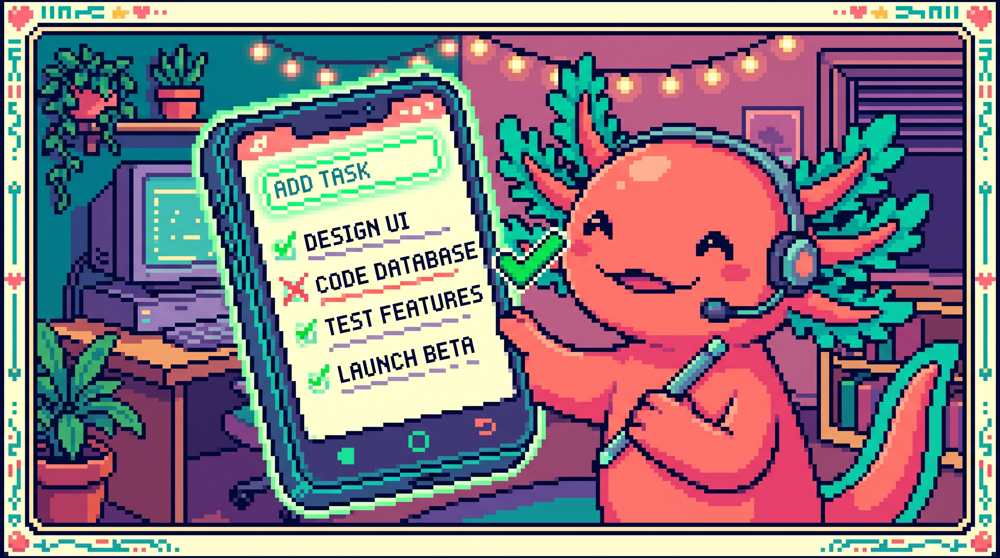

# Capitulo 14 — Mini-proyecto: lista de tareas interactiva

<p align="center">
  
</p>


> ¡Hola de nuevo! Soy **Bit**, tu ajolote programador. Hoy es un dia especial: vamos a juntar TODO lo que aprendiste en el modulo de JavaScript (el DOM, los eventos, los arrays y el almacenamiento) para construir algo de verdad, algo que funciona y que puedes ensenarle a tu familia. Vamos a hacer una **lista de tareas interactiva**: escribes una tarea, la anades, la marcas como hecha, la borras... y lo mejor: aunque cierres el navegador, ¡tus tareas siguen ahi! Respira hondo. Lo vas a lograr paso a paso. Yo te acompano. 🐾

## 1. ¿Que vamos a construir?

Imagina una libretita digital. Tiene una cajita donde escribes "Comprar pan", aprietas un boton y la tarea aparece en una lista. Si ya compraste el pan, le das clic y se tacha. Si te equivocaste, la borras. Y si cierras la pestana y vuelves manana, tus tareas siguen ahi esperandote.

Eso es exactamente lo que harás hoy. Vamos a usar tres lenguajes juntos:

- **HTML** para la estructura (la cajita, el boton, la lista vacia).
- **CSS** para que se vea bonito.
- **JavaScript** para que cobre vida: que reaccione a tus clics y recuerde tus datos.

> ### 🟦 ¿Que significa? — *Mini-proyecto*
> Un mini-proyecto es un programa pequeno pero **completo**: tiene principio y fin, y hace algo util de verdad, no es solo un ejercicio suelto. Sirve para practicar uniendo varios temas a la vez, que es como funciona la programacion en la vida real. En **tunal-digital** (un sitio web hecho con HTML, CSS y JavaScript puro), todo el sitio es como un gran proyecto donde el archivo `main.js` une muchas piezas: el chat con IA, el formulario de contacto y las llamadas al servidor. Tu lista de tareas es tu primer "main.js" en miniatura.

> ### 💡 Tip
> No intentes escribir todo el codigo de golpe. La forma profesional de trabajar es **un pasito, probar, otro pasito, probar**. Asi, si algo se rompe, sabes exactamente que linea fue. Bit lo hace asi todos los dias.

## 2. Preparamos el escenario: el HTML

Abre tu editor de codigo y crea una carpeta nueva llamada `lista-tareas`. Dentro, crea un archivo llamado `index.html`. Este archivo es el **esqueleto** de nuestra pagina.

> ### 🟦 ¿Que significa? — *HTML*
> HTML (HyperText Markup Language) es el lenguaje que define **la estructura** de una pagina web: que hay un titulo aqui, una caja de texto alla, un boton mas abajo. No decide colores ni comportamiento, solo el "que cosas hay y en que orden". Sirve como el esqueleto de cualquier web. En **tunal-digital**, cada pagina empieza por un archivo HTML que dibuja los botones y formularios que luego el JavaScript hace funcionar.

Escribe esto dentro de `index.html`:

```html
<!DOCTYPE html>
<html lang="es">
<head>
  <meta charset="UTF-8" />
  <title>Mi lista de tareas</title>
  <link rel="stylesheet" href="estilos.css" />
</head>
<body>
  <h1>📝 Mi lista de tareas</h1>

  <div class="caja">
    <input type="text" id="entrada" placeholder="Escribe una tarea..." />
    <button id="boton-anadir">Anadir</button>
  </div>

  <ul id="lista"></ul>

  <script src="app.js"></script>
</body>
</html>
```

Fijate en tres cosas importantes que vamos a usar despues desde JavaScript:

- El `<input>` tiene `id="entrada"`: ahi escribira el usuario.
- El `<button>` tiene `id="boton-anadir"`: el boton que dispara la accion.
- El `<ul>` tiene `id="lista"`: la lista (por ahora vacia) donde apareceran las tareas.

> ### 🟦 ¿Que significa? — *id (identificador)*
> Un `id` es un **nombre unico** que le pones a un elemento del HTML para poder encontrarlo despues desde JavaScript. Como ponerle nombre a una mascota: solo puede haber un "entrada" en toda la pagina. Sirve para que tu codigo diga "agarra ESE elemento exacto". En **tunal-digital**, el `main.js` usa ids para encontrar el formulario de contacto y la caja del chat antes de hacerlos funcionar.

> ### 🟦 ¿Que significa? — *input*
> Un `input` es una caja donde el usuario **escribe o introduce datos**. El tipo `type="text"` es para texto normal. Sirve para recoger lo que la persona quiere comunicarle al programa. En **tunal-digital**, el formulario de contacto usa varios `input` para que el visitante escriba su nombre y su correo.

> ### 🔎 En tu codigo
> El `<ul>` esta vacio a proposito. Las tareas NO se escriben a mano en el HTML: las va a crear JavaScript automaticamente cada vez que el usuario anada una. Esa es la magia de una pagina "interactiva".

## 3. Un toque de estilo: el CSS

Crea ahora `estilos.css` en la misma carpeta. No te preocupes por entenderlo todo, el CSS solo decora.

> ### 🟦 ¿Que significa? — *CSS*
> CSS (Cascading Style Sheets) es el lenguaje que decide **como se ve** la pagina: colores, tamanos, espacios, tipos de letra. Sirve para que algo que ya existe (gracias al HTML) se vea agradable. En **tunal-digital**, el CSS le da al sitio su aspecto de marca: los colores, los botones redondeados y los espacios.

```css
body {
  font-family: sans-serif;
  max-width: 500px;
  margin: 40px auto;
  padding: 0 20px;
}
.caja { display: flex; gap: 8px; }
#entrada { flex: 1; padding: 10px; }
button { padding: 10px 16px; cursor: pointer; }
ul { list-style: none; padding: 0; }
li {
  display: flex;
  justify-content: space-between;
  padding: 10px;
  border-bottom: 1px solid #ddd;
}
li.hecha span { text-decoration: line-through; color: gray; }
```

La ultima regla es la mas interesante para nosotros: cuando un `<li>` tenga la clase `hecha`, su texto aparecera **tachado y gris**. Lo activaremos desde JavaScript.

> ### 🟦 ¿Que significa? — *clase (class)*
> Una clase es una **etiqueta reutilizable** que le pones a uno o varios elementos para darles un estilo o marcarlos. A diferencia del `id` (unico), muchos elementos pueden compartir la misma clase. Sirve para aplicar el mismo aspecto o comportamiento a un grupo. Aqui, `hecha` marcara todas las tareas completadas.

## 4. ¡Llega JavaScript! Conectamos con la pagina

Crea el archivo `app.js`. Aqui vive toda la inteligencia. Lo primero: que JavaScript **encuentre** los elementos del HTML.

> ### 🟦 ¿Que significa? — *JavaScript*
> JavaScript es el lenguaje que le da **comportamiento** a la pagina: hace que reaccione a clics, que cambie sola, que recuerde cosas. Si el HTML es el esqueleto y el CSS la piel, JavaScript es el sistema nervioso. En **tunal-digital**, el archivo `main.js` es JavaScript puro y se encarga de todo lo "vivo" del sitio.

> ### 🟦 ¿Que significa? — *DOM*
> El DOM (Document Object Model) es la forma en que JavaScript **ve** la pagina HTML: como una coleccion de objetos que puede leer y modificar. Gracias al DOM, tu codigo puede decir "agarra la caja de texto" o "crea un elemento nuevo en la lista". Sirve de puente entre tu codigo y lo que el usuario ve. En **tunal-digital**, el `main.js` usa el DOM constantemente para mostrar y ocultar partes del sitio.

```javascript
// Buscamos los elementos del HTML por su id
const entrada = document.getElementById("entrada");
const botonAnadir = document.getElementById("boton-anadir");
const lista = document.getElementById("lista");

// Aqui guardaremos todas las tareas en memoria
let tareas = [];
```

> ### 🟦 ¿Que significa? — *document.getElementById*
> Es una funcion del DOM que **busca un elemento por su id** y te lo entrega para trabajar con el. El nombre se lee facil: "del documento, dame el elemento con este id". Sirve para conectar una variable de JavaScript con algo real de la pagina. En **tunal-digital**, `main.js` define funciones de atajo justo para hacer mas corto este tipo de busquedas, porque se usan muchisimo.

> ### 🟦 ¿Que significa? — *variable*
> Una variable es una **cajita con nombre** donde guardas un dato para usarlo despues. Con `const` guardas algo que no cambiara (como la referencia a la caja de texto) y con `let` algo que si cambiara (como nuestra lista de tareas, que crecera). Sirven para que tu programa recuerde cosas mientras trabaja.

> ### 🟦 ¿Que significa? — *array (arreglo)*
> Un array es una **lista ordenada de datos** dentro de una sola variable. Lo escribes con corchetes `[]`. Aqui, `tareas` sera un array donde cada elemento es una tarea. Sirve para guardar muchas cosas del mismo tipo juntas y recorrerlas. En **PolyPaw** (una app hecha en Python con Flet) los datos del juego se guardan en estructuras tipo lista dentro de archivos JSON, una idea muy parecida a un array.

## 5. Anadir una tarea

Ahora la primera accion real: cuando el usuario haga clic en "Anadir", queremos tomar el texto, guardarlo y mostrarlo.

```javascript
function anadirTarea() {
  const texto = entrada.value.trim();
  if (texto === "") return; // si esta vacio, no hacemos nada

  // Creamos un objeto que representa la tarea
  const tarea = { texto: texto, hecha: false };
  tareas.push(tarea);

  entrada.value = "";   // limpiamos la caja
  pintarLista();        // volvemos a dibujar la lista
}

botonAnadir.addEventListener("click", anadirTarea);
```

> ### 🟦 ¿Que significa? — *funcion*
> Una funcion es un **bloque de codigo con nombre** que agrupa varias instrucciones para reutilizarlas. La defines una vez con `function` y la llamas cuando la necesitas. Sirve para no repetir codigo y mantener todo ordenado. En **tunal-digital**, el `main.js` esta lleno de funciones, incluidas funciones de atajo que envuelven tareas comunes.

> ### 🟦 ¿Que significa? — *objeto*
> Un objeto es una caja que guarda **varios datos relacionados con sus nombres**, escrito con llaves `{}`. Nuestra tarea es un objeto con dos datos: `texto` (lo que dice) y `hecha` (si esta completada o no). Sirve para representar "cosas" con varias propiedades. En **RachaSimple** (app en React con TypeScript), cada habito del usuario es un objeto con sus propios datos.

> ### 🟦 ¿Que significa? — *.push()*
> `.push()` es una funcion de los arrays que **agrega un elemento al final** de la lista. Aqui mete la nueva tarea dentro del array `tareas`. Sirve para hacer crecer una lista poco a poco.

> ### 🟦 ¿Que significa? — *.trim()*
> `.trim()` **quita los espacios en blanco** del principio y el final de un texto. Asi, si el usuario escribe solo espacios, lo detectamos como vacio. Sirve para limpiar lo que la persona escribe antes de usarlo.

> ### 🟦 ¿Que significa? — *.value*
> `.value` es **el contenido actual de una caja de texto** (`input`). Al leerlo (`entrada.value`) sabemos que escribio el usuario; al asignarlo (`entrada.value = ""`) lo cambiamos, por ejemplo para vaciar la caja despues de anadir. Sirve de puente entre lo que la persona teclea y tu codigo. En **tunal-digital**, el formulario de contacto lee el `.value` de cada campo antes de enviar el mensaje.

> ### 🟦 ¿Que significa? — *operador === (comparacion)*
> El triple igual `===` **compara dos valores y responde verdadero o falso** segun si son iguales. La linea `texto === ""` pregunta "¿el texto esta vacio?". No confundir con un solo `=`, que sirve para *guardar* un valor, no para comparar. Sirve para tomar decisiones en tu codigo.

> ### 🟦 ¿Que significa? — *return*
> `return` **corta la funcion en ese punto** y no ejecuta lo que viene despues. Aqui, si el texto esta vacio, `return` hace que `anadirTarea` termine de inmediato sin guardar nada. Sirve para salir temprano cuando no tiene sentido seguir.

> ### 🟦 ¿Que significa? — *evento*
> Un evento es **algo que ocurre** en la pagina: un clic, una tecla, mover el raton. JavaScript puede "escuchar" esos eventos y reaccionar. Sirve para que tu programa responda al usuario. En **tunal-digital**, `main.js` escucha el evento de enviar el formulario de contacto para procesarlo.

> ### 🟦 ¿Que significa? — *addEventListener*
> `addEventListener` es la funcion que **conecta un evento con una accion**. Se lee: "al elemento, anadele un escuchador del evento 'click' que ejecute esta funcion". Aqui, al hacer clic en el boton, se ejecuta `anadirTarea`. Sirve para definir como reacciona la pagina.

> ### 💡 Tip
> Fijate que NO escribimos `anadirTarea()` con parentesis dentro del `addEventListener`, sino solo `anadirTarea`. Con parentesis, JavaScript ejecutaria la funcion de inmediato; sin parentesis, solo le pasamos el nombre para que la guarde y la ejecute "cuando ocurra el clic". Es un error muy comun al empezar.

## 6. Pintar la lista en pantalla

Mencionamos `pintarLista()` pero aun no existe. Esta funcion es el corazon visual: borra la lista y la vuelve a dibujar desde el array. Asi siempre lo que ves coincide con lo que hay guardado.

```javascript
function pintarLista() {
  lista.innerHTML = ""; // vaciamos lo que hubiera

  tareas.forEach(function (tarea, indice) {
    const li = document.createElement("li");
    if (tarea.hecha) li.classList.add("hecha");

    const span = document.createElement("span");
    span.textContent = tarea.texto;

    const botonBorrar = document.createElement("button");
    botonBorrar.textContent = "🗑️";

    li.appendChild(span);
    li.appendChild(botonBorrar);
    lista.appendChild(li);
  });
}
```

> ### 🟦 ¿Que significa? — *.forEach()*
> `.forEach()` es una funcion de los arrays que **recorre uno por uno** todos los elementos y ejecuta codigo para cada uno. Aqui, por cada tarea creamos su `<li>`. Nos da tambien el `indice` (la posicion: 0, 1, 2...). Sirve para procesar listas completas sin escribir lo mismo muchas veces.

> ### 🟦 ¿Que significa? — *document.createElement*
> Crea un **elemento HTML nuevo desde JavaScript**, sin escribirlo a mano en el archivo HTML. Aqui creamos `<li>`, `<span>` y `<button>` en el momento. Sirve para construir partes de la pagina dinamicamente.

> ### 🟦 ¿Que significa? — *.appendChild()*
> "Append child" significa **anadir un hijo**: mete un elemento dentro de otro. Aqui metemos el texto y el boton dentro del `<li>`, y el `<li>` dentro de la lista. Sirve para armar la estructura visual pieza por pieza.

> ### 🟦 ¿Que significa? — *.textContent*
> `.textContent` es **el texto que muestra un elemento**. Al asignarle un valor, cambiamos lo que se lee en pantalla. Sirve para mostrar datos al usuario de forma segura.

> ### 🟦 ¿Que significa? — *.innerHTML*
> `.innerHTML` es **todo el contenido HTML de un elemento**. Aqui lo ponemos en `""` (vacio) para limpiar la lista antes de redibujarla. Sirve para vaciar o reemplazar contenido completo.

> ### ⚠️ Cuidado
> Vaciar con `innerHTML = ""` y redibujar desde el array es facil de entender, pero ojo: significa que la "fuente de la verdad" es SIEMPRE el array `tareas`, no lo que ves en pantalla. Primero cambiamos el array, luego pintamos. Nunca al reves. Si te confundes y modificas la pantalla sin tocar el array, al redibujar perderas el cambio.

## 7. Marcar como hecha y borrar

Ahora hagamos que esos elementos reaccionen. Modificamos el `forEach` para anadir eventos al texto (marcar/desmarcar) y al boton de la basura (borrar). Reemplaza el interior del `forEach` por esto:

```javascript
tareas.forEach(function (tarea, indice) {
  const li = document.createElement("li");
  if (tarea.hecha) li.classList.add("hecha");

  const span = document.createElement("span");
  span.textContent = tarea.texto;
  // Al hacer clic en el texto, alternamos "hecha"
  span.addEventListener("click", function () {
    tareas[indice].hecha = !tareas[indice].hecha;
    pintarLista();
    guardar();
  });

  const botonBorrar = document.createElement("button");
  botonBorrar.textContent = "🗑️";
  // Al hacer clic en la basura, quitamos esa tarea
  botonBorrar.addEventListener("click", function () {
    tareas.splice(indice, 1);
    pintarLista();
    guardar();
  });

  li.appendChild(span);
  li.appendChild(botonBorrar);
  lista.appendChild(li);
});
```

> ### 🟦 ¿Que significa? — *.classList.add()*
> `.classList` es la lista de clases de un elemento, y `.add()` le **agrega una clase**. Aqui anadimos la clase `hecha` para que el CSS tache el texto. Existe tambien `.remove()` para quitarla. Sirve para cambiar el aspecto segun el estado.

> ### 🟦 ¿Que significa? — *operador ! (negacion)*
> El signo `!` **invierte un valor verdadero/falso**: si era `true` lo vuelve `false` y viceversa. La linea `!tareas[indice].hecha` significa "lo contrario de como estaba": si estaba hecha, la desmarcamos; si no, la marcamos. Sirve para alternar estados con un clic.

> ### 🟦 ¿Que significa? — *.splice()*
> `.splice()` es una funcion de los arrays que **quita (o inserta) elementos** en una posicion. `tareas.splice(indice, 1)` significa "desde esa posicion, elimina 1 elemento". Sirve para borrar una tarea concreta de la lista.

> ### 🔎 En tu codigo
> Cada accion (marcar, borrar) hace tres cosas en orden: cambia el array, llama a `pintarLista()` para refrescar la pantalla, y llama a `guardar()` para no perder los datos. Ese trio se repite a proposito. En el siguiente paso creamos `guardar()`.

## 8. La memoria: guardar en localStorage

Hasta ahora, si recargas la pagina, ¡todo desaparece! El array `tareas` vive solo en la memoria temporal. Vamos a darle memoria de verdad con **localStorage**.

> ### 🟦 ¿Que significa? — *localStorage*
> `localStorage` es un pequeno **almacen dentro del navegador** donde tu pagina puede guardar datos que sobreviven aunque cierres la pestana o apagues la computadora. Sirve para recordar preferencias o, como aqui, una lista de tareas. Es como una libreta que el navegador guarda solo para tu pagina. (Recuerda: NO sirve para datos secretos; en proyectos como **Faro/Organizer**, los tokens y secretos jamas se guardan en el navegador, solo en el servidor.)

`localStorage` solo guarda **texto**, no objetos ni arrays directamente. Por eso usamos dos traductores: `JSON.stringify` (objeto → texto) y `JSON.parse` (texto → objeto).

> ### 🟦 ¿Que significa? — *JSON*
> JSON es un **formato de texto** para representar datos (listas y objetos) de forma que cualquier programa los entienda. Sirve para guardar y transportar informacion. En **PolyPaw**, los datos del juego viven en archivos JSON; en **RachaSimple**, los datos viajan como JSON entre la app y Supabase.

> ### 🟦 ¿Que significa? — *JSON.stringify*
> Convierte un objeto o array de JavaScript en **texto JSON**. Lo necesitamos porque `localStorage` solo guarda texto. Sirve para "empaquetar" datos antes de guardarlos.

> ### 🟦 ¿Que significa? — *JSON.parse*
> Hace lo contrario: convierte **texto JSON de vuelta en un objeto o array** real de JavaScript. Sirve para "desempaquetar" lo que habiamos guardado y volver a usarlo.

```javascript
function guardar() {
  localStorage.setItem("tareas", JSON.stringify(tareas));
}

function cargar() {
  const guardado = localStorage.getItem("tareas");
  if (guardado) {
    tareas = JSON.parse(guardado);
    pintarLista();
  }
}

cargar(); // se ejecuta al abrir la pagina
```

> ### 🟦 ¿Que significa? — *.setItem() y .getItem()*
> `setItem("nombre", valor)` **guarda** un dato en localStorage bajo una etiqueta. `getItem("nombre")` lo **recupera** despues. Son como guardar y sacar algo de un cajon con su etiqueta. Sirven para escribir y leer la memoria del navegador.

No olvides anadir la llamada a `guardar()` tambien dentro de `anadirTarea`, justo despues del `push`:

```javascript
function anadirTarea() {
  const texto = entrada.value.trim();
  if (texto === "") return;
  tareas.push({ texto: texto, hecha: false });
  entrada.value = "";
  pintarLista();
  guardar(); // ¡no se nos olvide guardar!
}
```

> ### ⚠️ Cuidado
> Si abres tu `index.html` directamente con doble clic, localStorage funciona igual. Pero si algun dia cambias el codigo y ves errores raros, revisa que el nombre de la etiqueta (`"tareas"`) sea siempre el mismo en `setItem` y `getItem`. Un nombre mal escrito y la pagina "olvida" todo.

## 9. Un detalle amable: anadir con la tecla Enter

Apretar el boton funciona, pero seria mas comodo poder pulsar **Enter** tras escribir. Anade esto al final de tu `app.js`:

```javascript
entrada.addEventListener("keydown", function (evento) {
  if (evento.key === "Enter") {
    anadirTarea();
  }
});
```

> ### 🟦 ¿Que significa? — *evento keydown*
> `keydown` es el evento que ocurre cuando el usuario **presiona una tecla**. El objeto `evento` que recibimos tiene la propiedad `.key` con el nombre de la tecla (aqui buscamos `"Enter"`). Sirve para responder al teclado, no solo al raton.

> ### 💡 Tip
> Estos detalles pequenos (responder a Enter, limpiar la caja al anadir, ignorar tareas vacias) se llaman **experiencia de usuario**. No cambian lo que el programa hace, pero hacen que se sienta agradable. Los buenos programas estan llenos de estos mimos.

## 10. Probamos todo junto

¡Momento de la verdad! Abre `index.html` en tu navegador (doble clic sobre el archivo) y comprueba:

1. Escribe "Estudiar JavaScript" y pulsa Anadir. Debe aparecer en la lista.
2. Haz clic sobre el texto. Debe tacharse en gris.
3. Haz clic de nuevo. Debe destacharse.
4. Pulsa la 🗑️. Debe desaparecer.
5. Anade dos o tres tareas y **recarga la pagina** (F5). ¡Deben seguir ahi!

Si algo no funciona, abre la consola del navegador (tecla F12, pestana "Console") y lee los mensajes de error. Te diran en que linea esta el problema.

> ### 🟦 ¿Que significa? — *consola del navegador*
> La consola es una ventanita donde el navegador **muestra mensajes y errores** de tu JavaScript. Sirve para descubrir por que algo no funciona. Es la mejor amiga de quien programa. Puedes escribir `console.log("hola")` en tu codigo para imprimir mensajes ahi.

> ### 🔎 En tu codigo
> Con apenas tres archivos (`index.html`, `estilos.css`, `app.js`) construiste una app interactiva con memoria. Eso es exactamente el patron de **tunal-digital**: HTML para la estructura, CSS para el estilo y un `main.js` que conecta eventos y maneja los datos. Cambia la escala, no la idea: proyectos como **Faro/Organizer** (Next.js + React) o **RachaSimple** (React + TypeScript) hacen lo mismo, solo que con herramientas mas grandes que organizan estas piezas cuando la app crece.

## 11. ¡Lo lograste! 🎉

Para. Mira lo que hiciste. Tomaste una pagina vacia y la convertiste en una aplicacion **real** que:

- Lee lo que el usuario escribe (DOM e inputs).
- Reacciona a clics y al teclado (eventos).
- Guarda muchas tareas y las recorre (arrays y objetos).
- Recuerda todo aunque cierres el navegador (localStorage).

Eso, mi querido aprendiz, es **programar de verdad**. No memorizaste comandos sueltos: uniste piezas para resolver un problema. Asi se construyen todas las apps que usas, desde la mas pequena hasta las gigantes. Bit esta dando saltitos de orgullo en su pecera. 🐾✨

Guarda tu proyecto. Ensenaselo a alguien. Te lo ganaste.

## ✅ Checklist — ¿ya domino esto?

- [ ] Entiendo que HTML es la estructura, CSS el estilo y JavaScript el comportamiento.
- [ ] Se buscar un elemento de la pagina con `document.getElementById`.
- [ ] Se escuchar un clic con `addEventListener`.
- [ ] Puedo guardar datos en un array y agregarlos con `.push()`.
- [ ] Se recorrer un array con `.forEach()`.
- [ ] Puedo crear elementos nuevos con `document.createElement` y `.appendChild()`.
- [ ] Se borrar un elemento del array con `.splice()`.
- [ ] Entiendo que `localStorage` guarda texto que sobrevive al recargar.
- [ ] Se traducir datos con `JSON.stringify` y `JSON.parse`.
- [ ] Comprendo que el array es la "fuente de la verdad" y la pantalla se redibuja desde el.

## 🧪 Ejercicios

1. **💻 Contador de pendientes.** Anade debajo de la lista un texto que diga "Tienes N tareas pendientes". Pista: cuenta cuantas tareas tienen `hecha: false` dentro de `pintarLista()` y muestralo con `.textContent`.

2. **💻 Boton de borrar todo.** Agrega un boton "Borrar todo" que vacie el array (`tareas = []`), repinte y guarde. Pregunta al usuario antes con `confirm("¿Seguro?")`.

3. **💻 Evitar duplicados.** Antes de hacer `push`, comprueba si ya existe una tarea con el mismo texto y, si existe, no la anadas. Pista: investiga el metodo `.some()` de los arrays.

4. **💻 Color segun estado.** En el CSS, haz que las tareas pendientes tengan un pequeno punto de color a la izquierda y las hechas no. Tendras que anadir/quitar una clase desde JavaScript.

5. **Sin computadora.** En papel, dibuja el "viaje" de una tarea desde que el usuario la escribe hasta que se guarda en localStorage. Nombra cada paso (input, array, pintar, guardar).

6. **💻 Reto final.** Permite **editar** una tarea: al hacer doble clic en el texto, que se pueda cambiar. Pista: el evento es `dblclick` y puedes usar `prompt("Nuevo texto:", tarea.texto)` para pedir el nuevo valor. ¡Bit confia en ti!
