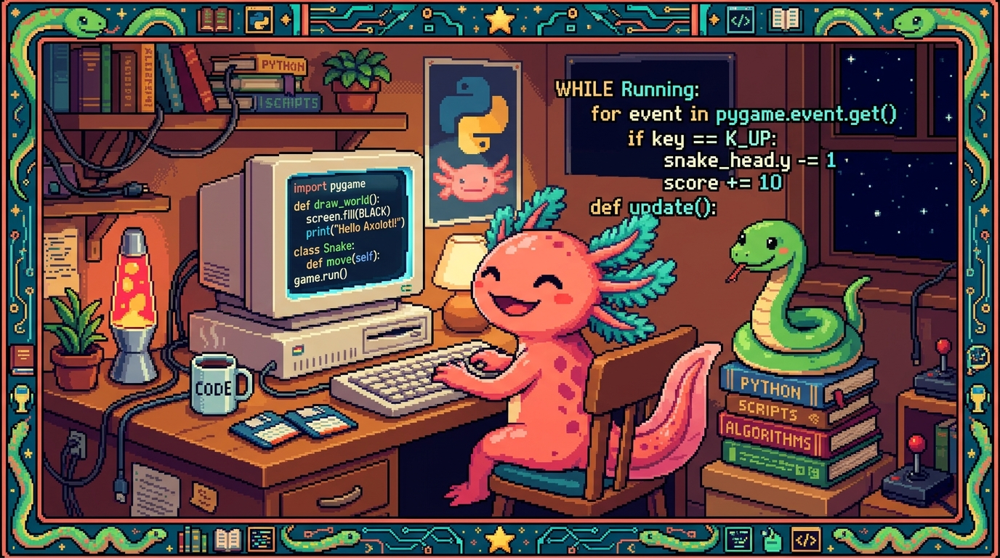

# Capítulo 01 — ¿Qué es Python?

<p align="center">
  
</p>


> Buenas noticias: ya sabes programar. En el Módulo 03 aprendiste los conceptos (variables,
> decisiones, bucles, funciones). Python usa **los mismos conceptos**, solo que escritos de
> forma distinta —y, para muchos, más clara—. Este módulo te va a costar menos porque ya tienes
> la base; ahora solo cambias la forma de escribir.

---

## 1. Qué es Python y por qué es tan querido

> ### 🟦 ¿Qué significa? — *Python*
> **Python** es un lenguaje de programación de propósito general, conocido sobre todo por lo
> **fácil que es de leer y de escribir**. Su código se parece bastante al inglés y se ahorra
> símbolos que en otros lenguajes solo estorban. Con él se hace de casi todo: aplicaciones,
> páginas web (la parte que corre en el servidor), automatización de tareas repetitivas,
> análisis de datos, ciencia y, muy especialmente, **inteligencia artificial**.

> ### 💡 Tip — ¿Por qué aprender Python si ya sé JavaScript?
> Porque cada lenguaje tiene su terreno:
> - **JavaScript** manda en el navegador y en la web.
> - **Python** manda en la automatización, los datos y la IA, y es el lenguaje de apps como
>   PolyPaw (con Flet).
> Manejar los dos te da un alcance enorme. Y como comparten los mismos conceptos, el segundo
> lenguaje siempre cuesta bastante menos que el primero.

> ### ⚠️ Cuidado — El nombre viene de un grupo de comedia, no de la serpiente
> Python se llama así por *Monty Python* (un grupo de humoristas británicos), no por la
> serpiente. Aun así, el logo es una serpiente y con el tiempo se volvió su símbolo. Una
> curiosidad inofensiva.

---

## 2. Cómo se ejecuta Python (y cómo instalarlo)

JavaScript vive dentro del navegador. Python no: para ejecutarlo necesitas un programa llamado
**intérprete** que instalas en tu computadora.

> ### 🟦 ¿Qué significa? — *Intérprete*
> Un **intérprete** es el programa que **lee tu código y lo ejecuta** línea por línea. En el
> caso de Python, ese programa se llama precisamente `python`. Lo instalas una sola vez y a
> partir de ahí puedes correr cualquier archivo `.py`.

**Instalación (cuando tengas tu computadora):**
1. Descarga Python desde <https://python.org> (botón "Download"). Si estás en Windows, marca la
   casilla **"Add Python to PATH"** durante la instalación; eso es lo que te permite luego
   usarlo desde la terminal.
2. Comprueba en la terminal: `python --version` (o `python3 --version`) debe mostrar un número.

> ### 🟦 ¿Qué significa? — *REPL (la consola interactiva)*
> Si en la terminal escribes solo `python`, entras al **REPL** (*Read-Eval-Print Loop*): una
> consola donde escribes una línea de Python y ves el resultado al momento, igual que la consola
> del navegador para JS. Va perfecto para hacer pruebas rápidas. Para salir, escribe `exit()`.

**Ejecutar un archivo:** guardas tu código en un archivo, por ejemplo `hola.py`, y en la
terminal escribes:
```
python hola.py
```

---

## 3. Tu primer programa: `print`

> ### 🟦 ¿Qué significa? — *`print()`*
> `print(...)` **muestra algo en la pantalla** (en la terminal). Es el equivalente al
> `console.log` de JavaScript:
> ```python
> print("¡Hola, mundo!")
> print(2 + 3)
> ```
> Crea un archivo `hola.py` con esas líneas, ejecútalo con `python hola.py`, y verás la salida.

> ### 💡 Tip — Compara para aprender más rápido
> A lo largo del módulo te irás encontrando recuadros "JS vs. Python". Úsalos: ver el mismo
> concepto escrito en dos lenguajes lo fija mucho mejor en la cabeza.
> | Idea | JavaScript | Python |
> |---|---|---|
> | Mostrar en pantalla | `console.log("hola")` | `print("hola")` |

---

## 4. Variables: sin `let` ni `const`

> ### 🟦 ¿Qué significa? — *Variables en Python*
> En Python **no** existen `let`, `const` ni `var`: escribes el nombre, le asignas un valor y
> listo. Tampoco hace falta poner `;` al final.
> ```python
> nombre = "Edwar"
> edad = 25
> es_programador = True
> ```
> | Idea | JavaScript | Python |
> |---|---|---|
> | Crear variable | `const nombre = "Edwar";` | `nombre = "Edwar"` |
> | Verdadero/falso | `true` / `false` | `True` / `False` (¡con mayúscula!) |
> | Nada / vacío | `null` | `None` |

> ### 💡 Tip — Estilo de nombres en Python
> En JavaScript se acostumbra el `camelCase` (`esProgramador`); en Python la convención es otra:
> `snake_case`, es decir, todo en minúsculas y las palabras unidas por guion bajo
> (`es_programador`). Cada lenguaje tiene su costumbre, y conviene respetarla para que tu código
> "hable como un nativo".

---

## 5. LA regla de Python: la sangría (indentación)

De todo lo que trae Python, esto es lo que más choca cuando vienes de otros lenguajes. También
es lo más importante del capítulo.

> ### 🟦 ¿Qué significa? — *Sangría / indentación*
> La **sangría** es el espacio en blanco al inicio de una línea (normalmente 4 espacios). En la
> mayoría de lenguajes esa sangría es pura estética; **en Python es obligatoria y tiene
> significado**: es lo que define qué líneas pertenecen a un bloque.
>
> En JavaScript, los bloques se marcan con **llaves** `{ }`:
> ```javascript
> if (edad >= 18) {
>   console.log("Adulto");
> }
> ```
> En Python, se marcan con **dos puntos `:` y sangría** (sin llaves):
> ```python
> if edad >= 18:
>     print("Adulto")
> ```
> Las líneas que van "dentro" del `if` se escriben **sangradas** (4 espacios). En cuanto la
> sangría se acaba, el bloque termina. Es más limpio, pero también más **estricto**.

> ### ⚠️ Cuidado — La sangría inconsistente rompe el programa
> Si mezclas distintas cantidades de espacios, o combinas tabuladores con espacios, Python te
> lanza un error (`IndentationError`). La regla es sencilla: usa **4 espacios** siempre. Editores
> como VS Code lo hacen solos cuando pulsas Tab. Este es el error número uno de quien empieza con
> Python; pero en cuanto te acostumbras, deja de molestar e incluso se vuelve agradable.

> ### 🔎 En tu código
> Abre cualquier archivo de PolyPaw, por ejemplo `main.py`: vas a ver que NO hay llaves `{ }`
> marcando los bloques, solo dos puntos y sangría. Esa es la firma visual de Python.

---

## ✅ Checklist — ¿ya domino esto?

- [ ] Sé qué es Python y para qué destaca (automatización, datos, IA, apps con Flet).
- [ ] Entiendo qué es el **intérprete** y cómo ejecutar un `.py` (`python archivo.py`).
- [ ] Sé usar `print()` y el **REPL** para probar.
- [ ] Creo variables sin `let`/`const` y sin `;`, en `snake_case`.
- [ ] Conozco `True`/`False`/`None` (con mayúscula).
- [ ] **Entiendo la sangría**: bloques con `:` y 4 espacios, sin llaves.

---

## 🧪 Ejercicios

1. **Traduce a Python.** Pasa esto de JavaScript a Python:
   `const ciudad = "San Salvador"; console.log(ciudad);`
2. **Mayúsculas.** ¿Qué tiene de malo, en Python, escribir `activo = true`? Corrígelo.
3. **Sangría.** Explica qué marca el final de un bloque en Python (si en JS son las llaves, en
   Python es…).
4. **Encuentra el error.** ¿Por qué falla esto?
   ```python
   if edad >= 18:
   print("Adulto")
   ```
5. 💻 **Primer programa.** Cuando tengas Python, crea `hola.py` con un `print` que muestre tu
   nombre y, en otra línea, el resultado de `7 * 6`. Ejecútalo con `python hola.py`.

➡️ Siguiente: **[Capítulo 02 — Tipos y control de flujo](02-tipos-y-control.md)**.
