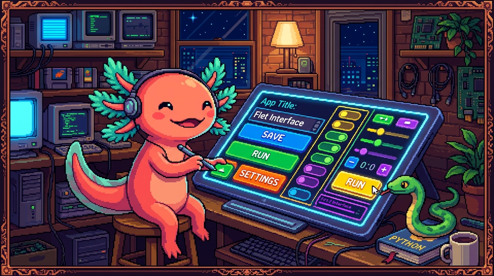

# Capítulo 13 — Flet a fondo

<p align="center">
  
</p>


> En el Capítulo 05 conociste Flet de lejos: viste que PolyPaw es una app hecha **solo con
> Python** y que la pantalla son objetos. Hoy bajamos al detalle. Vas a entender qué hace
> de verdad `main(page)`, qué es esa `page` que tanto se nombra, por qué hay que llamar a
> `page.update()`, cómo se colocan los controles, cómo responden a un clic y cómo se pasa de
> una pantalla a otra. Al final, leerás el `main.py` de PolyPaw sin perderte.
> Bit, nuestro ajolote, ya tiene puesto el casco: vamos a meter las manos en la interfaz.

---

## 1. ¿Qué es Flet, en serio?

En el módulo 03 (JavaScript) y en el de HTML/CSS viste que para hacer una página web necesitas
**tres lenguajes a la vez**: HTML para la estructura, CSS para el aspecto y JavaScript para el
comportamiento. El repo **tunal-digital** es justo eso: un sitio en HTML/CSS/JS vanilla.

Flet propone algo distinto: **una sola cosa, Python, para todo**.

> ### 🟦 ¿Qué significa? — *Flet*
> **Flet** es un framework de Python para construir **interfaces gráficas** (pantallas con
> textos, botones, imágenes, listas) que funcionan en escritorio, web y móvil con el mismo
> código. Tú escribes solo Python; Flet se encarga de **dibujar** la interfaz y de **escuchar**
> lo que hace el usuario.
> **¿Para qué sirve?** Para crear apps con ventanas y botones sin aprender HTML, CSS ni
> JavaScript.
> **¿Dónde se usa en un repo real?** **PolyPaw**, la app de aprendizaje de idiomas, está hecha
> **íntegramente** con Flet. Toda su pantalla nace en `main.py`.

> ### 🟦 ¿Qué significa? — *Framework*
> Un **framework** es un esqueleto de programa ya construido: te da la estructura y las reglas,
> y tú rellenas lo que falta. Si una librería es una caja de herramientas que tú usas cuando
> quieres, un framework es el taller entero que te dice "tú pon tu código aquí, yo me encargo
> del resto". Flet es el framework; tu `main.py` es lo que pones dentro.

> ### 💡 Tip
> Una buena forma de pensarlo: en una web vanilla **tú** mueves el HTML con JavaScript. En Flet
> **describes** cómo se ve la pantalla con objetos de Python y Flet la pinta por ti. Cambias el
> objeto, avisas a Flet, y Flet redibuja.

---

## 2. La estructura mínima: `main(page)` y `ft.app`

Toda app de Flet arranca igual. Mira el patrón base:

```python
import flet as ft

def main(page):
    page.title = "Mi primera app"
    page.add(ft.Text("¡Hola desde Flet!"))

ft.app(target=main)
```

Tres ideas viven aquí: la función `main`, el parámetro `page` y la llamada `ft.app`.

> ### 🟦 ¿Qué significa? — *La función `main(page)`*
> `main` es la función que **construye tu app**. Flet la llama una vez, al arrancar, y le pasa
> un objeto: la página. El nombre `main` es por convención (puede ser otro), pero **siempre
> recibe la página como primer parámetro**.
> **¿Para qué sirve?** Es el punto de entrada: todo lo que quieras mostrar lo agregas aquí
> dentro.
> **¿Dónde se usa en un repo real?** En `main.py` de PolyPaw existe una función `main(page)`
> que prepara la ventana y muestra la primera pantalla.

> ### 🟦 ¿Qué significa? — *`ft.app(target=main)`*
> `ft.app` es la orden que **enciende** la aplicación. El argumento `target=main` le dice a Flet
> "la función que arma mi app es `main`, llámala". Es la última línea del archivo y la que pone
> todo en marcha.
> **¿Para qué sirve?** Sin esta línea, definiste la función pero nadie la ejecuta; la ventana
> nunca aparecería.

> ### 🟦 ¿Qué significa? — *`import flet as ft`*
> Esta línea trae la librería Flet y le pone el apodo corto `ft`. A partir de ahí, en vez de
> escribir `flet.Text(...)` escribes `ft.Text(...)`. Es el mismo `import ... as ...` que ya
> conoces del módulo de Python; el apodo `ft` es la costumbre de toda la comunidad Flet.

> ### 🔎 En tu código
> En PolyPaw, abre `main.py` y busca al final del archivo la línea que invoca `ft.app(...)`. Esa
> es la chispa: lo que la ejecuta cuando haces correr la app. Y arriba del todo verás
> `import flet as ft`, igual que en el ejemplo.

---

## 3. La página (`page`): el lienzo de tu app

`page` no es una variable cualquiera. Es **el objeto más importante** de toda app Flet.

> ### 🟦 ¿Qué significa? — *La página (`page`)*
> La `page` es el **lienzo** donde vive tu interfaz: la ventana completa de la app. Es un objeto
> de Python con propiedades que puedes ajustar (título, color de fondo, alineación) y métodos
> para meter o quitar controles.
> **¿Para qué sirve?** Es tu mando a distancia de la ventana: todo lo que el usuario ve está,
> directa o indirectamente, dentro de `page`.
> **¿Dónde se usa en un repo real?** En PolyPaw, `main(page)` configura `page.title`, agrega los
> controles iniciales y se va pasando a otras funciones para que cada pantalla pueda dibujarse.

Algunas propiedades típicas de la página:

```python
def main(page):
    page.title = "PolyPaw"              # texto de la barra de la ventana
    page.bgcolor = "#0f172a"            # color de fondo
    page.horizontal_alignment = "center"  # centra los controles a lo ancho
    page.vertical_alignment = "center"    # centra a lo alto
    page.add(ft.Text("Aprende idiomas con Balam y Andy"))

ft.app(target=main)
```

> ### 🟦 ¿Qué significa? — *`page.add(...)`*
> `page.add(control)` **mete un control dentro de la página**. Le pasas un objeto (un `Text`, un
> botón, una columna) y aparece en pantalla.
> **¿Para qué sirve?** Es la forma más directa de mostrar algo. Si comparas con la web: es
> parecido a hacer `appendChild` en JavaScript, pero aquí agregas objetos de Python, no nodos de
> HTML.

> ### ⚠️ Cuidado
> `page.add(...)` ya redibuja la pantalla por ti. Pero cuando **modifiques** algo que ya estaba
> (cambiar un texto, ocultar un botón), `add` no basta: ahí entra `page.update()`, que vemos
> ahora mismo.

---

## 4. `page.update()`: avisar para que se redibuje

Este es el concepto que más confunde al principio, así que vamos despacio.

> ### 🟦 ¿Qué significa? — *`page.update()`*
> `page.update()` le dice a Flet: "cambié algo de la pantalla, **vuelve a dibujarla**". Tú
> modificas las propiedades de los controles en Python (por ejemplo `texto.value = "Nuevo"`) y
> esos cambios **no se ven** hasta que llamas a `update()`.
> **¿Para qué sirve?** Para refrescar la interfaz tras un cambio. Es el "guardar y mostrar" de
> Flet.
> **¿Dónde se usa en un repo real?** En PolyPaw, cada vez que respondes una pregunta de una
> misión y el marcador sube, hay que llamar a `update()` para que el número nuevo aparezca.

Mira la diferencia. Esto **no funciona** como esperas:

```python
def main(page):
    texto = ft.Text("Cuenta: 0")
    page.add(texto)
    texto.value = "Cuenta: 1"   # cambiaste el objeto...
    # ...pero nunca avisaste a Flet, así que en pantalla sigue diciendo "Cuenta: 0"
```

Esto **sí**:

```python
def main(page):
    texto = ft.Text("Cuenta: 0")
    page.add(texto)
    texto.value = "Cuenta: 1"
    page.update()   # ahora Flet redibuja y se ve "Cuenta: 1"
```

> ### 💡 Tip
> Regla mental de oro: **"cambié algo → llamo a `update()`"**. Si tocaste el `value`, el color o
> la visibilidad de un control que ya estaba en pantalla, termina con `page.update()`. Si te
> olvidas, lo más típico es "mi código está bien pero la pantalla no se mueve". Casi siempre es
> un `update()` que falta.

> ### 🟦 ¿Qué significa? — *Renderizar (redibujar)*
> **Renderizar** es el acto de convertir tus objetos de Python en píxeles reales en la pantalla.
> Flet renderiza al iniciar y cada vez que llamas a `update()`. Tú no dibujas a mano: describes
> y Flet renderiza.

---

## 5. Los controles principales

Recordemos: en Flet **cada elemento de la pantalla es un control**, un objeto de Python.

> ### 🟦 ¿Qué significa? — *Control*
> Un **control** es un objeto que representa una pieza de la interfaz: un texto, un campo para
> escribir, un botón, una fila, una columna o una caja. Construyes la pantalla **creando estos
> objetos y combinándolos**.

Vamos uno por uno con los más usados.

### 5.1 `Text` — mostrar texto

> ### 🟦 ¿Qué significa? — *`ft.Text`*
> `ft.Text("...")` crea un control que **muestra texto** en pantalla. Su propiedad principal es
> `value` (lo que dice) y acepta extras como `size` (tamaño) o `color`.
> **¿Dónde se usa en un repo real?** En PolyPaw, los enunciados de cada misión y la puntuación
> son controles `Text`.

```python
titulo = ft.Text("Misión 1: Saludos", size=24, color="white")
titulo.value = "Misión 2: Comida"   # luego puedes cambiar lo que dice (+ page.update())
```

### 5.2 `TextField` — recibir texto del usuario

> ### 🟦 ¿Qué significa? — *`ft.TextField`*
> `ft.TextField` es una **caja donde el usuario escribe**. Su propiedad `label` pone una
> etiqueta y `value` guarda lo que el usuario tecleó.
> **¿Para qué sirve?** Para pedir datos: un nombre, una respuesta, una traducción.
> **¿Dónde se usa en un repo real?** En PolyPaw, cuando una misión pide que el usuario escriba
> la palabra correcta, ese cuadro es un `TextField`.

```python
respuesta = ft.TextField(label="Escribe la traducción")
# más tarde, en un botón, lees lo que puso:
texto_escrito = respuesta.value
```

### 5.3 `ElevatedButton` — un botón que se pulsa

> ### 🟦 ¿Qué significa? — *`ft.ElevatedButton`*
> `ft.ElevatedButton("texto")` crea un **botón con relieve**. Su propiedad clave es `on_click`:
> la función que se ejecuta al pulsarlo (lo vemos en la sección de eventos).
> **¿Dónde se usa en un repo real?** En PolyPaw, los botones "Comprobar", "Siguiente" o el de
> elegir idioma son `ElevatedButton`.

```python
boton = ft.ElevatedButton("Comprobar")
```

### 5.4 `Column` y `Row` — apilar y alinear

> ### 🟦 ¿Qué significa? — *`ft.Column` y `ft.Row`*
> `ft.Column` apila controles **en vertical** (uno debajo de otro). `ft.Row` los pone **en
> horizontal** (uno al lado de otro). A ambos les pasas una **lista de controles**.
> Si vienes del módulo de CSS: es la misma idea que **Flexbox**, pero escrita en Python.

```python
ft.Column([
    ft.Text("¿Cómo se dice 'hola' en maya?"),
    ft.TextField(label="Tu respuesta"),
    ft.Row([
        ft.ElevatedButton("Comprobar"),
        ft.ElevatedButton("Saltar"),
    ]),
])
```

Aquí los dos botones quedan lado a lado (van en una `Row`), y esa fila queda debajo del texto y
del campo (porque todo está dentro de una `Column`).

### 5.5 `Container` — la caja que envuelve y decora

> ### 🟦 ¿Qué significa? — *`ft.Container`*
> Un `ft.Container` es una **caja** que envuelve un control (o un grupo) y le da estilo: color de
> fondo (`bgcolor`), márgenes internos (`padding`), bordes redondeados o alineación interna.
> **¿Para qué sirve?** Para dar espacio y aspecto. Es el primo de la etiqueta `<div>` de HTML
> con su CSS, pero en Python.
> **¿Dónde se usa en un repo real?** En PolyPaw, las tarjetas de cada misión suelen ser un
> `Container` con fondo y padding alrededor del contenido.

```python
tarjeta = ft.Container(
    content=ft.Text("Lección de hoy"),
    bgcolor="#1e293b",
    padding=20,
    border_radius=12,
)
```

> ### ⚠️ Cuidado
> Un `Container` envuelve **un solo** `content`. Si quieres meter varios controles dentro, pon
> primero una `Column` o una `Row` como su `content`, y dentro de esa la lista de controles.

---

## 6. Layout: alineación y espaciado

> ### 🟦 ¿Qué significa? — *Layout (disposición)*
> El **layout** es **cómo se acomodan** los controles en la pantalla: dónde se centran, cuánto
> espacio hay entre ellos, qué tan separados de los bordes están. En Flet se controla con
> propiedades de `Column`, `Row`, `Container` y de la propia `page`.

Las dos propiedades de alineación que más usarás:

> ### 🟦 ¿Qué significa? — *`alignment` y `horizontal_alignment`*
> En una `Column`, `alignment` controla la posición **vertical** (arriba, centro, abajo) y
> `horizontal_alignment` la posición **a lo ancho**. En una `Row` es al revés. Se usan con
> valores de Flet como `ft.MainAxisAlignment.CENTER`.

```python
ft.Column(
    [
        ft.Text("Bienvenido a PolyPaw"),
        ft.ElevatedButton("Empezar"),
    ],
    alignment=ft.MainAxisAlignment.CENTER,            # centrado vertical
    horizontal_alignment=ft.CrossAxisAlignment.CENTER, # centrado horizontal
    spacing=20,                                        # separación entre controles
)
```

> ### 🟦 ¿Qué significa? — *`spacing` y `padding`*
> `spacing` es el **hueco entre** los controles de una `Column` o `Row`. `padding` es el
> **margen interno** dentro de un `Container` (entre el borde de la caja y su contenido).
> Si recuerdas el "modelo de caja" de CSS, es exactamente la misma intuición.

> ### 💡 Tip
> Para centrar toda tu app en mitad de la ventana, lo más cómodo es ajustar
> `page.horizontal_alignment` y `page.vertical_alignment` directamente. Así no tienes que
> centrar control por control.

---

## 7. Eventos: que la app reaccione (`on_click`)

Una pantalla bonita pero muerta no sirve. Necesitamos que **responda**.

> ### 🟦 ¿Qué significa? — *Evento*
> Un **evento** es algo que ocurre en la app: un clic, un texto que cambia, una tecla. Tú
> "escuchas" un evento conectándole una **función** que se ejecuta cuando sucede. Es la misma
> idea de los *event listeners* del módulo de JavaScript, pero en Python.

> ### 🟦 ¿Qué significa? — *`on_click`*
> `on_click` es la propiedad de un botón donde pones **qué función llamar al pulsarlo**. Flet,
> al producirse el clic, ejecuta esa función y le pasa un objeto con datos del evento (por
> convención lo llamamos `e`).
> **¿Dónde se usa en un repo real?** En PolyPaw, el botón "Comprobar" tiene un `on_click` que
> revisa la respuesta y actualiza el marcador.

> ### 🟦 ¿Qué significa? — *Manejador de evento (handler)*
> El **manejador** es la función que responde a un evento. Recibe un parámetro (normalmente `e`,
> de *event*) con la información de lo que pasó.

Ejemplo completo y mínimo: un contador.

```python
import flet as ft

def main(page):
    page.title = "Contador"
    cuenta = 0
    marcador = ft.Text(f"Clics: {cuenta}", size=20)

    def sumar(e):                 # este es el manejador
        nonlocal cuenta           # quiero modificar la variable de fuera
        cuenta += 1
        marcador.value = f"Clics: {cuenta}"
        page.update()             # avisar para redibujar

    boton = ft.ElevatedButton("Sumar", on_click=sumar)

    page.add(marcador, boton)

ft.app(target=main)
```

> ### ⚠️ Cuidado
> En `on_click=sumar` se escribe el nombre de la función **sin paréntesis**. Si pusieras
> `on_click=sumar()`, Python la ejecutaría **inmediatamente** y le pasaría a `on_click` el
> resultado (probablemente `None`), no la función. Le entregas la función para que Flet la llame
> luego, no el resultado de llamarla ahora.

> ### 🟦 ¿Qué significa? — *`nonlocal`*
> `nonlocal` le dice a una función interna: "la variable `cuenta` **no es nueva**, es la de la
> función de afuera; déjame modificarla". Sin `nonlocal`, Python crearía una `cuenta` local y la
> de fuera no cambiaría. Lo necesitas cuando un manejador modifica una variable definida en
> `main`.

---

## 8. Manejar el estado de la interfaz

> ### 🟦 ¿Qué significa? — *Estado (state)*
> El **estado** son los **datos que tu app recuerda y que cambian con el tiempo**: la puntuación
> actual, qué misión estás resolviendo, qué idioma elegiste. Cuando el estado cambia, la
> pantalla debe reflejarlo.
> **¿Dónde se usa en un repo real?** En PolyPaw, el estado incluye el progreso del usuario y la
> misión activa; al avanzar, esos datos cambian y la pantalla se actualiza.

El ciclo en Flet es siempre el mismo, y conviene memorizarlo:

1. Guardas el estado en variables de Python (`cuenta = 0`, `mision_actual = 1`).
2. Un evento (clic) cambia ese estado.
3. Actualizas los controles que dependen de ese estado (`marcador.value = ...`).
4. Llamas a `page.update()` para que se vea.

> ### 💡 Tip
> Si vienes de React (lo verás en el módulo 06, y RachaSimple y Faro lo usan), notarás algo: en
> React la pantalla **se redibuja sola** cuando cambia el estado. En Flet, en cambio, **tú**
> avisas con `page.update()`. Más manual, pero más fácil de seguir paso a paso.

> ### 🔎 En tu código
> PolyPaw guarda los datos de las misiones en **archivos JSON** (carpeta `missions/`). Un módulo
> aparte, `database_manager.py`, se encarga de **leer y escribir** esos datos. Esa es una idea
> clave: el estado del *contenido* (las misiones, el progreso) vive en JSON y en Python, no
> "dentro" de los controles. Los controles solo **muestran** lo que el estado dice en cada
> momento.

> ### 🟦 ¿Qué significa? — *`database_manager.py`*
> En PolyPaw, `database_manager.py` es el módulo que **gestiona los datos**: abre los archivos
> JSON de `missions/`, devuelve la información de cada misión y guarda el progreso. Separar esto
> de la interfaz mantiene el código ordenado: `main.py` dibuja, `database_manager.py` recuerda.

---

## 9. Navegación entre pantallas

Una app real tiene varias pantallas: inicio, elegir idioma, misión, resultados. ¿Cómo se pasa
de una a otra en Flet?

> ### 🟦 ¿Qué significa? — *Navegación*
> La **navegación** es el paso de una pantalla a otra dentro de la app. En Flet, la técnica más
> sencilla para principiantes es: **borrar lo que hay en la página y dibujar la pantalla nueva**.

> ### 🟦 ¿Qué significa? — *`page.controls` y `page.clean()`*
> `page.controls` es la **lista** de todos los controles que hay ahora mismo en la página.
> `page.clean()` la **vacía** (quita todo lo que se ve). Combinadas con `page.add(...)`, te
> permiten reemplazar una pantalla entera por otra.

Patrón clásico: una función por pantalla.

```python
import flet as ft

def main(page):
    page.title = "PolyPaw"

    def mostrar_inicio():
        page.clean()                      # borra lo anterior
        page.add(
            ft.Text("PolyPaw", size=30),
            ft.ElevatedButton("Empezar misión", on_click=ir_a_mision),
        )
        page.update()

    def mostrar_mision():
        page.clean()
        page.add(
            ft.Text("Misión 1: Saludos", size=24),
            ft.TextField(label="Traduce 'hola'"),
            ft.ElevatedButton("Volver al inicio", on_click=ir_a_inicio),
        )
        page.update()

    def ir_a_mision(e):
        mostrar_mision()

    def ir_a_inicio(e):
        mostrar_inicio()

    mostrar_inicio()   # arrancamos en la pantalla de inicio

ft.app(target=main)
```

Cada pantalla es **una función** que limpia la página y dibuja lo suyo. Los botones de una
pantalla llaman a la función de otra. Así de simple es saltar entre vistas.

> ### 💡 Tip
> Fíjate en el truco: `ir_a_mision(e)` recibe el `e` del clic (Flet siempre lo pasa) y por
> dentro llama a `mostrar_mision()`, que **no** necesita `e`. Separar el manejador (que recibe
> `e`) de la función que dibuja (que no lo necesita) mantiene todo limpio y reutilizable.

> ### ⚠️ Cuidado
> Si después de `page.clean()` y `page.add(...)` se te olvida `page.update()`, la pantalla se
> queda en blanco o congelada. Otra vez la regla de oro: cambiaste algo, llama a `update()`.

> ### 🔎 En tu código
> Para Flet más avanzado existe un sistema de rutas con `page.go(...)` y vistas. PolyPaw, siendo
> una app de aprendizaje, se entiende muy bien con el patrón "una función por pantalla" que
> acabas de ver. Cuando leas `main.py`, busca funciones cuyo nombre empiece por `mostrar_`,
> `pantalla_` o similar: cada una arma una vista.

---

## 10. Cómo se arma la interfaz real de PolyPaw

Juntemos todo en un mapa mental de cómo encaja PolyPaw, la app de idiomas hecha 100% en Python
con Flet:

- **`main.py`** es el corazón. Tiene la función `main(page)` y la línea `ft.app(target=main)`
  al final. Configura la `page` (título, colores) y muestra la primera pantalla.
- Las **pantallas** se arman combinando los controles que ya conoces: `Text` para enunciados,
  `TextField` para respuestas, `ElevatedButton` para acciones, todo organizado con `Column`,
  `Row` y `Container`.
- Los **eventos** (`on_click`) conectan los botones con funciones que comprueban respuestas,
  suben la puntuación y navegan a la siguiente misión.
- El **estado** (progreso, misión actual) vive en variables de Python y, de forma persistente,
  en los **archivos JSON** de `missions/`, gestionados por **`database_manager.py`**.
- Cada cambio visible termina con **`page.update()`**.

> ### 🔎 En tu código
> Recorrido sugerido para leer PolyPaw con lo aprendido hoy: (1) abre `main.py` y localiza
> `main(page)` y `ft.app(...)`; (2) identifica dónde se crean los controles de la primera
> pantalla; (3) sigue un `on_click` hasta su función manejadora; (4) mira cómo esa función pide
> datos a `database_manager.py` (que lee de `missions/*.json`) y cómo cierra con `page.update()`.
> Con ese recorrido entiendes la app completa.

> ### 💡 Tip
> Compara con los otros repos del manual para ver por qué Flet es especial: **tunal-digital** es
> HTML/CSS/JS; **RachaSimple** es React + TypeScript; **Faro/Organizer** es Next.js + React +
> TypeScript. Todos esos usan tecnologías web. **PolyPaw es el único que hace una app completa
> con interfaz usando solo Python**, gracias a Flet. Ese es su superpoder.

---

## ✅ Checklist — ¿ya domino esto?

- [ ] Sé explicar qué es Flet y por qué deja hacer interfaces sin HTML/CSS/JS.
- [ ] Entiendo qué hace la función `main(page)` y para qué sirve `ft.app(target=main)`.
- [ ] Sé qué es la `page` y nombro tres propiedades suyas.
- [ ] Tengo clarísima la regla de oro: cambié algo → llamo a `page.update()`.
- [ ] Reconozco y sé usar `Text`, `TextField`, `ElevatedButton`, `Column`, `Row` y `Container`.
- [ ] Puedo centrar y espaciar controles con `alignment`, `spacing` y `padding`.
- [ ] Sé conectar un botón a una función con `on_click` (sin paréntesis) y entiendo `nonlocal`.
- [ ] Comprendo qué es el estado y el ciclo cambiar estado → actualizar control → `update()`.
- [ ] Sé navegar entre pantallas con `page.clean()` + `page.add(...)` + `page.update()`.
- [ ] Puedo ubicar en `main.py` de PolyPaw el `main(page)`, un control y un `on_click`.

---

## 🧪 Ejercicios

1. **(En papel)** Explica con tus palabras la diferencia entre `page.add(...)` y `page.update()`.
   ¿Cuándo basta solo con `add` y cuándo necesitas `update`?

2. 💻 Escribe la app mínima de Flet: importa Flet, crea `main(page)`, ponle un título a la
   página, agrega un `Text` que diga "Hola, soy Bit" y enciéndela con `ft.app(target=main)`.

3. 💻 Construye un contador como el de la sección 7, pero con **dos botones**: uno que sume y
   otro que reste. Acuérdate de `nonlocal` y de `page.update()` en cada manejador.

4. 💻 Arma una pantalla de "registro": un `TextField` con etiqueta "Tu nombre" y un
   `ElevatedButton` "Saludar". Al pulsarlo, un `Text` debe cambiar para decir "¡Hola, <nombre>!"
   usando el `value` del `TextField`.

5. 💻 Crea dos pantallas con el patrón "una función por pantalla": `mostrar_inicio()` con un
   botón "Ir a misión" y `mostrar_mision()` con un botón "Volver". Comprueba que puedes ir y
   volver sin que la pantalla se quede en blanco.

6. 💻 Abre el `main.py` de PolyPaw (o léelo en el repo) y localiza: dónde se llama a
   `ft.app(...)`, un control `Text`, un `on_click` y, si lo encuentras, una llamada a
   `database_manager.py`. Anota en una lista qué hace cada uno. (No hace falta que lo modifiques;
   el objetivo es **leer** y entender.)

> Bit te choca la patita: hoy pasaste de "ver" Flet a **entender cómo respira** una app real.
> Con `main(page)`, los controles, los eventos y `page.update()` ya tienes las cuatro patas de
> la mesa. Lo demás es práctica.
