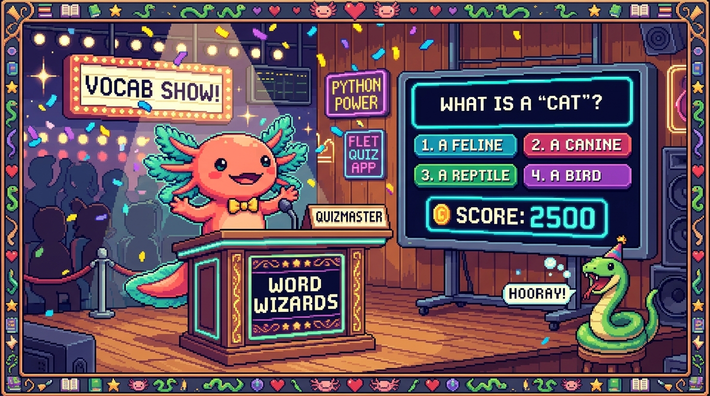

# Capitulo 14 — Mini-proyecto: un quiz de vocabulario con Flet

<p align="center">
  
</p>


> ¡Llegaste al gran momento, aprendiz! Bit, el ajolote, infla las branquias de la emocion: hoy NO vamos a aprender una pieza suelta, vamos a unir TODAS las piezas. Funciones, diccionarios, archivos, clases y Flet se juntan en una sola app que de verdad corre en tu computadora. Vas a construir un quiz de vocabulario, igualito al espiritu de PolyPaw (la app de aprender idiomas hecha enteramente en Python). El usuario vera una pregunta, elegira una respuesta, sumara aciertos y al final guardaremos su puntaje en un archivo JSON. Respira hondo: vas a terminar este capitulo con una app que puedes mostrarle a quien quieras. 🦎

## 1. Que vamos a construir (y por que)

Imagina una mini-version de PolyPaw. PolyPaw es una app real de aprendizaje de idiomas hecha **integramente en Python** con el framework **Flet**, y guarda sus datos (las misiones, el progreso) en archivos JSON, no en una base de datos pesada. Archivos como `main.py`, `database_manager.py` y la carpeta `missions/*.json` forman su corazon.

Nosotros vamos a hacer algo mucho mas pequeno, pero con el mismo ADN:

1. **Leeremos preguntas** desde un archivo JSON (como PolyPaw lee sus misiones).
2. **Mostraremos cada pregunta** con Flet, con botones para responder.
3. **Contaremos aciertos** mientras el usuario juega.
4. **Guardaremos el puntaje** en otro archivo JSON al terminar.

Cada parte usa algo que ya viste en capitulos anteriores. Hoy lo amarramos todo.

> ### 🟦 ¿Que significa? — *Mini-proyecto*
> Un proyecto pequeno pero **completo**: tiene principio, mitad y final, y produce algo que funciona de verdad. No es un ejercicio de una linea; es una app entera en miniatura.
> **Para que sirve:** para practicar como se combinan los conceptos en la vida real, donde nada vive solo.
> **Donde se usa en un repo real:** PolyPaw empezo siendo un mini-proyecto en Python antes de crecer; la idea de "una app chiquita que corre" es exactamente esto.

> ### 💡 Tip
> No intentes escribir todo el archivo de golpe. Vamos seccion por seccion. Al final juntamos todo. Asi, si algo falla, sabes exactamente que pieza revisar.

## 2. Preparar la carpeta del proyecto 💻

Vamos a crear una carpeta para nuestro quiz. Abre tu terminal y escribe:

```python
# Esto NO es Python; son comandos de terminal. Los pongo para que sigas el paso.
# mkdir quiz-vocabulario
# cd quiz-vocabulario
```

Dentro de esa carpeta tendremos tres archivos:

- `preguntas.json` — las preguntas del quiz (los **datos**).
- `quiz.py` — la **logica** (clases y funciones que manejan el juego).
- `main.py` — la **interfaz** con Flet (lo que el usuario ve).

> ### 🟦 ¿Que significa? — *Separar datos, logica e interfaz*
> Es dividir tu app en tres responsabilidades: los **datos** (la informacion), la **logica** (las reglas y operaciones) y la **interfaz** (lo que se ve y se toca).
> **Para que sirve:** para que cada parte sea facil de leer y cambiar sin romper las demas. Si quieres mas preguntas, tocas solo el JSON. Si quieres cambiar colores, tocas solo la interfaz.
> **Donde se usa en un repo real:** PolyPaw separa sus misiones (`missions/*.json`, datos), su `database_manager.py` (logica de guardado) y `main.py` (interfaz Flet). Nosotros copiamos esa misma idea a escala mini.

> ### 💡 Tip
> Si ya instalaste Flet en un capitulo anterior, ¡genial! Si no, en tu terminal: `pip install flet`. Solo se hace una vez por computadora.

## 3. Las preguntas en JSON

Empecemos por los datos. Crea el archivo `preguntas.json` con este contenido:

```json
[
  {
    "palabra": "Hola",
    "opciones": ["Hello", "Goodbye", "Please"],
    "correcta": "Hello"
  },
  {
    "palabra": "Gracias",
    "opciones": ["Sorry", "Thanks", "Yes"],
    "correcta": "Thanks"
  },
  {
    "palabra": "Perro",
    "opciones": ["Cat", "Dog", "Bird"],
    "correcta": "Dog"
  }
]
```

> ### 🟦 ¿Que significa? — *JSON*
> JSON (JavaScript Object Notation) es un formato de texto para guardar datos organizados con llaves `{}` y corchetes `[]`. Es como una lista de fichas, cada una con sus campos.
> **Para que sirve:** para guardar informacion de forma que tanto humanos como programas la entiendan facil. Es legible y ligero.
> **Donde se usa en un repo real:** PolyPaw guarda TODAS sus misiones en archivos JSON dentro de `missions/`. Si abres uno, veras esta misma estructura de llaves y corchetes.

Fijate en la forma: el archivo entero es una **lista** (los corchetes `[]`), y dentro hay tres **objetos** (las llaves `{}`), uno por pregunta. Cada objeto tiene tres campos: `palabra`, `opciones` y `correcta`.

> ### 🔎 En tu codigo
> Cuando Python lea este JSON, la lista `[]` se convertira en una **lista de Python** y cada `{}` en un **diccionario**. ¡Justo lo que practicaste en los capitulos de listas y diccionarios! No es casualidad: por eso esos temas eran tan importantes.

> ### ⚠️ Cuidado
> En JSON las comillas SIEMPRE son dobles (`"`), nunca simples (`'`). Y no se permite una coma despues del ultimo elemento. Si Python se queja al leer el archivo, casi siempre es una coma de mas o una comilla mal puesta.

## 4. Leer el JSON desde Python

Ahora, en `quiz.py`, escribiremos una funcion que lea ese archivo y nos devuelva la lista de preguntas.

```python
import json


def cargar_preguntas(ruta):
    """Lee un archivo JSON y devuelve la lista de preguntas."""
    with open(ruta, "r", encoding="utf-8") as archivo:
        datos = json.load(archivo)
    return datos
```

Vamos despacio, linea por linea.

> ### 🟦 ¿Que significa? — *import json*
> `import` trae un **modulo** (una caja de herramientas ya hecha) a tu programa. `json` es el modulo que sabe leer y escribir el formato JSON.
> **Para que sirve:** para no tener que escribir tu mismo el codigo que entiende JSON; Python ya lo trae listo.
> **Donde se usa en un repo real:** el `database_manager.py` de PolyPaw importa `json` para leer y guardar el progreso del jugador.

> ### 🟦 ¿Que significa? — *Funcion*
> Una funcion es un bloque de codigo con nombre que hace una tarea y (a veces) devuelve un resultado. Se define con `def` y se ejecuta cuando la "llamas" por su nombre.
> **Para que sirve:** para reutilizar codigo sin repetirlo y para darle un nombre claro a cada tarea.
> **Donde se usa en un repo real:** todo PolyPaw esta hecho de funciones; cada accion (cargar una mision, marcar un acierto) es una funcion con su nombre.

> ### 🟦 ¿Que significa? — *with open(...)*
> `open` abre un archivo. La palabra `with` se encarga de **cerrarlo solo** cuando terminas, aunque ocurra un error.
> **Para que sirve:** para leer o escribir archivos sin olvidarte de cerrarlos (un descuido comun que causa errores).
> **Donde se usa en un repo real:** cada vez que PolyPaw lee una mision desde `missions/`, usa este mismo patron `with open(...)`.

> ### 🟦 ¿Que significa? — *encoding="utf-8"*
> Le dice a Python con que "alfabeto" leer el archivo. UTF-8 entiende tildes, la ñ y emojis.
> **Para que sirve:** para que palabras como "corazon" o "ñandu" no se rompan al leerse.
> **Donde se usa en un repo real:** PolyPaw maneja varios idiomas, asi que el `utf-8` es obligatorio para no romper caracteres especiales.

`json.load(archivo)` toma el texto del archivo y lo convierte en estructuras de Python: nuestra lista de diccionarios. Eso lo guardamos en `datos` y lo devolvemos con `return`.

> ### 💡 Tip
> Si vienes del modulo de JavaScript: `json.load()` en Python es el primo de `JSON.parse()` en JS. Misma idea (texto → datos), distinta sintaxis.

## 5. Una clase para llevar el juego

Aqui entra algo poderoso: una **clase**. Vamos a crear una clase `Quiz` que recuerde las preguntas, en cual vamos y cuantos aciertos llevamos.

```python
class Quiz:
    """Lleva el estado del juego: preguntas, posicion y aciertos."""

    def __init__(self, preguntas):
        self.preguntas = preguntas
        self.indice = 0
        self.aciertos = 0

    def pregunta_actual(self):
        return self.preguntas[self.indice]

    def responder(self, opcion_elegida):
        """Compara la opcion con la correcta y suma si acierta."""
        correcta = self.pregunta_actual()["correcta"]
        if opcion_elegida == correcta:
            self.aciertos += 1
            acerto = True
        else:
            acerto = False
        self.indice += 1
        return acerto

    def hay_mas_preguntas(self):
        return self.indice < len(self.preguntas)

    def total(self):
        return len(self.preguntas)
```

> ### 🟦 ¿Que significa? — *Clase*
> Una clase es un **molde** para crear objetos que guardan datos y saben hacer cosas. Define que recuerda (atributos) y que puede hacer (metodos).
> **Para que sirve:** para agrupar datos relacionados con las acciones que los manejan. Aqui, el `Quiz` guarda el progreso Y sabe responder preguntas.
> **Donde se usa en un repo real:** en apps como PolyPaw, las clases organizan cosas como una mision o el estado del jugador en un solo lugar ordenado.

> ### 🟦 ¿Que significa? — *__init__ y self*
> `__init__` es el metodo que se ejecuta al **crear** un objeto; sirve para darle sus valores iniciales. `self` es "yo mismo": la forma en que el objeto se refiere a sus propios datos.
> **Para que sirve:** `__init__` prepara el objeto recien nacido; `self` permite que cada objeto guarde sus propios valores sin mezclarse con otros.
> **Donde se usa en un repo real:** cualquier clase de cualquier app Python (incluida PolyPaw) usa `__init__` para arrancar con datos limpios.

> ### 🟦 ¿Que significa? — *Metodo*
> Un metodo es una funcion que vive **dentro** de una clase. Se llama sobre un objeto, por ejemplo `mi_quiz.responder("Dog")`.
> **Para que sirve:** para que el objeto sepa "hacer cosas" con sus propios datos.
> **Donde se usa en un repo real:** los metodos son las acciones de cada objeto; en PolyPaw, un metodo podria marcar una mision como completada.

> ### 🟦 ¿Que significa? — *Atributo*
> Un atributo es un dato guardado dentro de un objeto, como `self.aciertos`. Es la "memoria" del objeto.
> **Para que sirve:** para que el objeto recuerde su estado entre una accion y otra (cuantos aciertos llevas, en que pregunta vas).
> **Donde se usa en un repo real:** el progreso del jugador en PolyPaw vive en atributos antes de guardarse en JSON.

Mira el metodo `responder`: saca la respuesta correcta del **diccionario** de la pregunta actual con `["correcta"]`, la compara con lo que eligio el usuario, y si coincide suma uno a `self.aciertos`. Luego avanza el `self.indice`. ¡Diccionarios, clases y funciones trabajando juntos!

> ### 🟦 ¿Que significa? — *len()*
> `len()` es una funcion de Python que te dice **cuantos** elementos tiene algo (una lista, un texto). `len(self.preguntas)` devuelve cuantas preguntas hay en total.
> **Para que sirve:** para contar el tamano de una lista sin recorrerla a mano; por ejemplo, saber cuantas preguntas quedan.
> **Donde se usa en un repo real:** PolyPaw usa `len()` para saber cuantas misiones tiene un pack y mostrar el avance ("3 de 10").

> ### 💡 Tip
> Si vienes de JavaScript, una clase en Python se parece mucho a una de JS, pero aqui usas `self` donde alla usabas `this`, y el constructor se llama `__init__` en lugar de `constructor`.

## 6. Guardar el puntaje en JSON

Cuando el juego termine, queremos guardar el resultado. Volvemos a `quiz.py` y agregamos una funcion para escribir:

```python
from datetime import datetime


def guardar_puntaje(ruta, aciertos, total):
    """Anade el puntaje de esta partida a un archivo JSON de historial."""
    nuevo = {
        "aciertos": aciertos,
        "total": total,
        "fecha": datetime.now().strftime("%Y-%m-%d %H:%M"),
    }

    try:
        with open(ruta, "r", encoding="utf-8") as archivo:
            historial = json.load(archivo)
    except FileNotFoundError:
        historial = []

    historial.append(nuevo)

    with open(ruta, "w", encoding="utf-8") as archivo:
        json.dump(historial, archivo, ensure_ascii=False, indent=2)
```

Esta funcion hace tres cosas: arma el registro nuevo, lee el historial que ya exista (o empieza vacio si el archivo aun no existe) y guarda todo de vuelta.

> ### 🟦 ¿Que significa? — *datetime y strftime*
> `datetime` es un modulo de Python para trabajar con fechas y horas. `datetime.now()` te da el momento exacto de ahora mismo, y `.strftime("%Y-%m-%d %H:%M")` lo convierte en texto con el formato que tu elijas (ano-mes-dia hora:minuto).
> **Para que sirve:** para guardar CUANDO ocurrio algo, como la fecha de cada partida, en un texto ordenado y legible.
> **Donde se usa en un repo real:** PolyPaw guarda marcas de tiempo asi para saber cuando el jugador completo cada mision.

> ### 🟦 ¿Que significa? — *append*
> `append` es un metodo de las listas que **agrega** un elemento al final. `historial.append(nuevo)` mete el registro nuevo al final de la lista de partidas.
> **Para que sirve:** para hacer crecer una lista de a un elemento, sin borrar lo que ya tenia.
> **Donde se usa en un repo real:** PolyPaw usa `append` para ir sumando misiones completadas a la lista de progreso del jugador.

> ### 🟦 ¿Que significa? — *json.dump*
> Es lo contrario de `json.load`: toma datos de Python (listas, diccionarios) y los **escribe** como texto JSON en un archivo.
> **Para que sirve:** para guardar resultados de forma permanente, que sobrevivan al cerrar el programa.
> **Donde se usa en un repo real:** el `database_manager.py` de PolyPaw usa esta idea para guardar el avance del jugador despues de cada mision.

> ### 🟦 ¿Que significa? — *Modo "w" vs "r"*
> Al abrir un archivo, `"r"` es **read** (leer) y `"w"` es **write** (escribir). El modo `"w"` reemplaza el contenido entero del archivo.
> **Para que sirve:** `"r"` para mirar datos sin tocarlos; `"w"` para guardar datos nuevos.
> **Donde se usa en un repo real:** toda app que persiste datos en archivos alterna entre estos dos modos.

> ### 🟦 ¿Que significa? — *try / except*
> Es una forma de "intentar" algo que podria fallar y tener un plan B si falla. `try` intenta; `except` captura el error y reacciona.
> **Para que sirve:** para que tu programa no se caiga ante problemas previsibles, como un archivo que todavia no existe.
> **Donde se usa en un repo real:** cualquier codigo serio que lea archivos usa `try/except` por si el archivo no esta.

> ### ⚠️ Cuidado
> El modo `"w"` **borra** lo que habia en el archivo. Por eso primero LEEMOS el historial, le agregamos el nuevo registro con `append`, y solo entonces escribimos. Si escribieras directo con `"w"` sin leer antes, perderias las partidas anteriores.

> ### 💡 Tip
> `ensure_ascii=False` hace que las tildes y la ñ se guarden bonitas en lugar de como codigos raros. Y `indent=2` deja el JSON ordenado y legible, con sangrias.

## 7. La interfaz con Flet

Ahora lo visual. En `main.py` construimos la pantalla con **Flet**.

> ### 🟦 ¿Que significa? — *Flet*
> Flet es un framework de Python para crear interfaces graficas (botones, textos, ventanas) sin saber HTML ni JavaScript. Escribes solo Python y Flet dibuja la pantalla.
> **Para que sirve:** para hacer apps de escritorio, web o movil con un unico lenguaje: Python.
> **Donde se usa en un repo real:** PolyPaw esta hecho **integramente** con Flet; toda su pantalla, sus botones y misiones se dibujan asi.

> ### 🟦 ¿Que significa? — *Framework*
> Un framework es una estructura ya armada que te da piezas y reglas para construir mas rapido. Tu pones tu logica; el framework pone los cimientos.
> **Para que sirve:** para no reinventar lo basico (ventanas, botones, eventos) en cada proyecto.
> **Donde se usa en un repo real:** Flet es el framework de PolyPaw; en el modulo de JavaScript viste que React es un framework para la web. Misma idea, distintos mundos.

Aqui esta el archivo `main.py` completo:

```python
import flet as ft

from quiz import cargar_preguntas, guardar_puntaje, Quiz


def main(pagina):
    pagina.title = "Quiz de vocabulario"
    pagina.window_width = 400
    pagina.window_height = 400

    preguntas = cargar_preguntas("preguntas.json")
    juego = Quiz(preguntas)

    texto_palabra = ft.Text(size=28, weight="bold")
    mensaje = ft.Text()
    columna_opciones = ft.Column()

    def mostrar_pregunta():
        actual = juego.pregunta_actual()
        texto_palabra.value = f"Traduce: {actual['palabra']}"
        mensaje.value = f"Pregunta {juego.indice + 1} de {juego.total()}"
        columna_opciones.controls.clear()
        for opcion in actual["opciones"]:
            boton = ft.ElevatedButton(
                text=opcion,
                on_click=lambda e, op=opcion: al_responder(op),
            )
            columna_opciones.controls.append(boton)
        pagina.update()

    def al_responder(opcion):
        juego.responder(opcion)
        if juego.hay_mas_preguntas():
            mostrar_pregunta()
        else:
            mostrar_final()

    def mostrar_final():
        guardar_puntaje("puntajes.json", juego.aciertos, juego.total())
        texto_palabra.value = "¡Quiz terminado! 🎉"
        mensaje.value = f"Aciertos: {juego.aciertos} de {juego.total()}"
        columna_opciones.controls.clear()
        pagina.update()

    pagina.add(texto_palabra, mensaje, columna_opciones)
    mostrar_pregunta()


ft.app(target=main)
```

Vamos a desmenuzarlo, porque aqui se junta TODO.

> ### 🟦 ¿Que significa? — *ft.app(target=main)*
> Es la linea que **arranca** la app de Flet. Le decimos que use nuestra funcion `main` para construir la pantalla.
> **Para que sirve:** para encender la aplicacion y abrir la ventana.
> **Donde se usa en un repo real:** el `main.py` de PolyPaw termina con una llamada parecida que enciende toda la app.

> ### 🟦 ¿Que significa? — *La pagina (page)*
> El objeto `pagina` representa la ventana de la app. Le agregas controles con `pagina.add(...)` y refrescas la vista con `pagina.update()`.
> **Para que sirve:** es el lienzo donde colocas todo lo que el usuario vera.
> **Donde se usa en un repo real:** en PolyPaw, la pagina es el contenedor de cada pantalla de mision.

> ### 🟦 ¿Que significa? — *Control (Text, ElevatedButton, Column)*
> Un control es una pieza visual: un texto (`ft.Text`), un boton (`ft.ElevatedButton`), una columna que apila cosas (`ft.Column`).
> **Para que sirve:** para construir la pantalla juntando piezas como bloques de lego.
> **Donde se usa en un repo real:** PolyPaw arma sus pantallas combinando estos mismos controles de Flet.

> ### 🟦 ¿Que significa? — *f-string*
> Un f-string es un texto que empieza con `f"..."` y permite meter valores dentro usando llaves `{}`. Por ejemplo `f"Traduce: {actual['palabra']}"` arma el texto pegando la palabra de la pregunta.
> **Para que sirve:** para construir mensajes que mezclan texto fijo con datos que cambian, de forma corta y clara.
> **Donde se usa en un repo real:** PolyPaw usa f-strings por todas partes para mostrar textos como "Mision 3 de 10" con numeros que cambian.

> ### 🟦 ¿Que significa? — *Evento on_click*
> `on_click` dice "cuando hagan clic en este boton, ejecuta esta funcion". Es como reaccionar a lo que hace el usuario.
> **Para que sirve:** para que la app responda a clics, no solo muestre cosas.
> **Donde se usa en un repo real:** cada boton de respuesta en PolyPaw usa un evento parecido para registrar lo que el jugador toca.

> ### 🟦 ¿Que significa? — *lambda*
> Una `lambda` es una mini-funcion sin nombre, escrita en una sola linea. Aqui la usamos para "recordar" que opcion corresponde a cada boton.
> **Para que sirve:** para crear funciones cortas al vuelo, sobre todo en eventos.
> **Donde se usa en un repo real:** Flet (y PolyPaw) usa lambdas para conectar cada boton con su accion exacta.

> ### ⚠️ Cuidado
> Fijate en `lambda e, op=opcion: al_responder(op)`. Ese `op=opcion` es clave: **captura** el valor de la opcion en ese momento del bucle. Si escribieras solo `lambda e: al_responder(opcion)`, todos los botones terminarian usando la ULTIMA opcion del bucle. Es un error clasico; el `op=opcion` lo evita.

> ### 🔎 En tu codigo
> Mira como todo se conecta: `cargar_preguntas` (archivos + JSON) llena el `Quiz` (clase). `mostrar_pregunta` lee un **diccionario** y crea **controles** de Flet. `al_responder` llama al **metodo** `responder` de la clase. Y al final, `guardar_puntaje` escribe en JSON. ¡Cada concepto del modulo aparece aqui!

## 8. Probar la app 💻

Con los tres archivos en la misma carpeta, abre la terminal en esa carpeta y corre:

```python
# En la terminal (no es Python):
# python main.py
```

Deberia abrirse una ventana mostrando "Traduce: Hola" con tres botones. Haz clic en uno y avanzaras a la siguiente pregunta. Al terminar veras tus aciertos, y en la carpeta aparecera un archivo nuevo: `puntajes.json`. ¡Abrelo! Veras tu partida guardada.

> ### 💡 Tip
> ¿No se abre nada? Revisa que los tres archivos esten en la MISMA carpeta y que `preguntas.json` no tenga errores de comas o comillas. La consola te dira la linea exacta del problema.

> ### ⚠️ Cuidado
> Si ves un error que dice `ModuleNotFoundError: No module named 'flet'`, significa que Flet no esta instalado en tu entorno. Vuelve al paso 2 y corre `pip install flet`.

## 9. Como se ve el resultado guardado

Despues de jugar una vez, tu `puntajes.json` se vera asi:

```json
[
  {
    "aciertos": 2,
    "total": 3,
    "fecha": "2026-06-25 14:30"
  }
]
```

Y si juegas otra vez, se **agregara** un segundo registro a la lista, sin borrar el primero. Eso es gracias al `append` que pusimos antes de escribir. Acabas de construir un historial persistente, ¡como el progreso de un jugador en PolyPaw!

> ### 🔎 En tu codigo
> Este archivo de puntajes es exactamente la idea de los `missions/*.json` de PolyPaw: una lista de objetos JSON que crece con el tiempo y que tu programa lee y escribe. Lo que hiciste en chiquito es lo mismo que hacen las apps de verdad.

## 10. Ideas para crecer tu quiz

Tu mini-proyecto ya funciona, pero puede crecer. Algunas direcciones:

- Agregar mas preguntas: solo editas `preguntas.json`, ¡sin tocar el codigo!
- Mostrar un color verde o rojo segun si acertaste (mas controles de Flet).
- Barajar las preguntas con el modulo `random` para que cada partida sea distinta.
- Mostrar el mejor puntaje historico leyendo `puntajes.json` al inicio.

> ### 💡 Tip
> Cada mejora usa una pieza que ya conoces. Crecer una app es agregar piezas pequenas, una a la vez. Asi crecio PolyPaw: empezo simple y fue sumando.

## 11. Lo que lograste

Para de un momento y mira lo que hiciste, aprendiz. Combinaste:

- **Archivos y JSON** para leer y guardar datos.
- **Funciones** para organizar cada tarea.
- **Diccionarios y listas** para mover la informacion.
- **Clases** para llevar el estado del juego.
- **Flet** para una interfaz real con la que el usuario interactua.

Eso ya no es "estudiar Python". Eso es **construir software**. Bit mueve la cola con orgullo: pasaste de aprender piezas sueltas a ensamblar una app completa que corre, responde y recuerda. Pocas personas que empiezan a programar llegan a juntar tantas piezas en un solo proyecto que funciona. Tu lo hiciste. 🦎🎉

## ✅ Checklist — ¿ya domino esto?

- [ ] Entiendo por que separamos datos (`preguntas.json`), logica (`quiz.py`) e interfaz (`main.py`).
- [ ] Se leer un archivo JSON con `json.load` y `with open(...)`.
- [ ] Se que una clase guarda estado en atributos (`self.aciertos`) y actua con metodos (`responder`).
- [ ] Entiendo como un metodo lee un diccionario con `["correcta"]` para comparar respuestas.
- [ ] Se guardar datos en JSON con `json.dump`, leyendo antes para no borrar el historial.
- [ ] Entiendo que hace `ft.app(target=main)` y como agrego controles a la pagina.
- [ ] Se por que un boton usa `on_click` y por que la `lambda` lleva `op=opcion`.
- [ ] Logre correr `python main.py` y ver mi puntaje guardado en `puntajes.json`.

## 🧪 Ejercicios

1. **Sin computadora.** En tus palabras, explica que hace cada uno de los tres archivos del proyecto (`preguntas.json`, `quiz.py`, `main.py`) y por que estan separados.

2. **Sin computadora.** Mira el metodo `responder` de la clase `Quiz`. Si el usuario elige una opcion incorrecta, ¿cambia `self.aciertos`? ¿Avanza igual el `self.indice`? Razona tu respuesta leyendo el codigo.

3. **💻 Mas preguntas.** Agrega dos preguntas nuevas a `preguntas.json` (por ejemplo "Casa" → "House", "Agua" → "Water"). Vuelve a correr la app y comprueba que ahora el quiz tiene cinco preguntas. No deberias tocar ningun archivo `.py`.

4. **💻 Mensaje de acierto.** Modifica `al_responder` para que, antes de avanzar, ponga en `mensaje.value` el texto "¡Correcto!" o "Casi..." segun lo que devuelva `juego.responder(opcion)`. Pista: el metodo `responder` ya devuelve `True` o `False`.

5. **💻 Mejor puntaje.** Al iniciar la app, lee `puntajes.json` (si existe) y muestra arriba el mejor numero de aciertos historico. Usa un `try/except` por si el archivo aun no existe.

6. **💻 Barajar.** Importa el modulo `random` y usa `random.shuffle(preguntas)` justo despues de cargarlas, para que cada partida tenga las preguntas en distinto orden. Comprueba que el quiz sigue funcionando.
