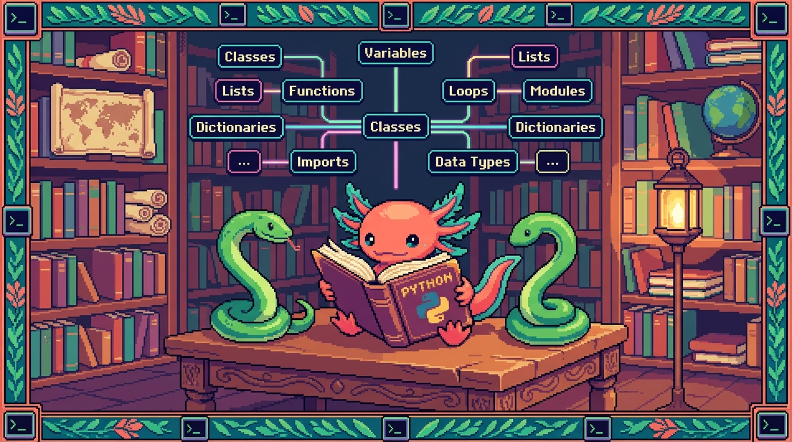

# Capitulo 15 — Glosario de Python y mapa

<p align="center">
  
</p>


> ¡Hola de nuevo! Soy **Bit**, tu ajolote guia. Llegaste al final del modulo de Python, y eso merece una celebracion (imaginame moviendo mis branquias de la emocion). Este capitulo es distinto a los demas: no vamos a aprender nada nuevo, vamos a **ordenar todo lo que ya sabes**. Piensa en este capitulo como el cajon donde guardas las herramientas despues de un proyecto: cada termino tiene su sitio, su etiqueta y una nota de "para que sirve esto". Lo usaras como diccionario cuando se te olvide algo (y se te va a olvidar, a todos nos pasa, no pasa nada). Al final hay un mapa mental, un repaso y la puerta hacia el **Modulo 05: TypeScript**. Respira, agarra agua, y vamos.

---

## 1. Como usar este glosario

Cada termino esta en un recuadro azul que empieza con `🟦 ¿Que significa?`. Dentro encontraras tres cosas: una **definicion simple** (1-2 lineas), **para que sirve** y **donde aparece en un repo real**. El repo estrella de este modulo es **PolyPaw**, una app para aprender idiomas hecha **integramente en Python** con el framework **Flet** y datos guardados en archivos **JSON** (`main.py`, `database_manager.py`, `missions/*.json`). Cuando algo se parezca a lo que viste en JavaScript (Modulo 03), te lo digo en una frase corta para que conectes ideas.

No tienes que leerlo de corrido. Salta al termino que necesites. Pero la primera vez, dale una pasada completa: vas a decir "ah, ya entiendo como encaja todo".

> ### 💡 Tip
> Marca con un lapiz (o con un comentario `# revisar`) los terminos que aun te suenan borrosos. Volver a un glosario tres veces es normal y sano.

---

## 2. Fundamentos del lenguaje

Empezamos por lo mas basico: las piezas con las que se construye cualquier programa en Python.

> ### 🟦 ¿Que significa? — *Variable*
> Un nombre que guarda un valor para usarlo despues. **Para que sirve:** etiquetar datos (un texto, un numero) y reutilizarlos sin repetirlos. **En PolyPaw:** `idioma = "nahuatl"` guarda el idioma que eligio el usuario para mostrarselo en pantalla.

```python
nombre_usuario = "Edwar"
puntos = 0
puntos = puntos + 10   # ahora puntos vale 10
```

En JavaScript escribias `let puntos = 0;`. En Python no hay `let` ni `;`: solo el nombre, el `=` y el valor.

> ### 🟦 ¿Que significa? — *Tipo (de dato)*
> La clase de informacion que contiene un valor: texto, numero, verdadero/falso, lista, etc. **Para que sirve:** Python sabe que operaciones puede hacer segun el tipo (sumar numeros, unir textos). **En PolyPaw:** el puntaje es un tipo numero (`int`), el idioma es un tipo texto (`str`).

> ### 🟦 ¿Que significa? — *str (cadena / string)*
> Un tipo de dato que representa texto, escrito entre comillas. **Para que sirve:** guardar palabras, frases, nombres de archivo. **En PolyPaw:** `"Buenos dias"` es el texto de una leccion.

> ### 🟦 ¿Que significa? — *int (entero)*
> Un numero sin decimales. **Para que sirve:** contar cosas: puntos, intentos, indice de una mision. **En PolyPaw:** `vidas = 3`.

> ### 🟦 ¿Que significa? — *float (decimal)*
> Un numero con punto decimal. **Para que sirve:** medir cosas que no son enteras, como un porcentaje de progreso. **En PolyPaw:** `progreso = 0.75` (75% de la mision completada).

> ### 🟦 ¿Que significa? — *bool (booleano)*
> Un tipo que solo puede ser `True` o `False`. **Para que sirve:** representar respuestas de si/no para tomar decisiones. **En PolyPaw:** `mision_completada = True`.

> ### ⚠️ Cuidado
> En Python se escriben con mayuscula inicial: `True` y `False`. En JavaScript era `true` y `false` en minuscula. Es un error clasico al cambiar de lenguaje.

> ### 🟦 ¿Que significa? — *None*
> Un valor especial que significa "nada" o "sin valor todavia". **Para que sirve:** indicar que algo aun no tiene contenido. **En PolyPaw:** un usuario nuevo puede tener `ultima_leccion = None` hasta que termine la primera. (En JavaScript esto era `null`.)

> ### 🟦 ¿Que significa? — *Sangria (indentacion)*
> Los espacios al inicio de una linea que indican que ese codigo pertenece a un bloque. **Para que sirve:** en Python la sangria **sustituye a las llaves `{}`** de JavaScript; define que esta dentro de un `if`, un `for` o una funcion. **En PolyPaw:** todo el cuerpo de una funcion va sangrado.

```python
if puntos >= 100:
    print("¡Subiste de nivel!")   # esta linea pertenece al if por la sangria
```

> ### ⚠️ Cuidado
> Usa siempre **4 espacios** y no mezcles espacios con tabuladores. Una sangria inconsistente rompe el programa con un `IndentationError`. Bit ha llorado lagrimas de ajolote por esto.

> ### 🟦 ¿Que significa? — *Comentario*
> Texto que Python ignora, escrito despues de `#`. **Para que sirve:** explicarle a un humano (o a ti del futuro) que hace el codigo. **En PolyPaw:** `# carga las misiones del idioma elegido`.

> ### 🟦 ¿Que significa? — *Operador*
> Un simbolo que opera sobre valores: `+`, `-`, `*`, `/`, `==`, `and`, `or`, `not`. **Para que sirve:** hacer cuentas y comparaciones. **En PolyPaw:** `if vidas > 0 and not fin_del_juego:`.

> ### 🔎 En tu codigo
> En PolyPaw, abre `main.py` y busca la primera linea sangrada despues de un `def`. Esa sangria es la frontera invisible que en JavaScript marcabas con `{`. Si la entiendes, entiendes la mitad de Python.

---

## 3. Colecciones: guardar muchos datos

Cuando necesitas guardar varios valores juntos, usas una **coleccion**. Python tiene cuatro principales.

> ### 🟦 ¿Que significa? — *Lista (list)*
> Una coleccion ordenada de valores que puedes cambiar, escrita entre corchetes `[]`. **Para que sirve:** guardar secuencias: las palabras de una leccion, los pasos de una mision. **En PolyPaw:** `opciones = ["agua", "fuego", "tierra"]` para una pregunta de opcion multiple.

```python
misiones = ["saludos", "comida", "colores"]
misiones.append("animales")   # agregar al final
primera = misiones[0]          # acceder por posicion (empieza en 0)
```

Es practicamente el mismo concepto que el **array** de JavaScript.

> ### 🟦 ¿Que significa? — *Tupla (tuple)*
> Una coleccion ordenada que **no se puede cambiar**, escrita entre parentesis `()`. **Para que sirve:** guardar datos fijos que no deben modificarse, como una coordenada. **En PolyPaw:** `tamano_ventana = (400, 800)` (ancho y alto que no cambian).

> ### 💡 Tip
> ¿Lista o tupla? Si los datos van a cambiar, usa **lista**. Si son fijos para siempre, usa **tupla**. La tupla ademas es un poquito mas rapida.

> ### 🟦 ¿Que significa? — *Conjunto (set)*
> Una coleccion **sin orden y sin duplicados**, escrita entre llaves `{}`. **Para que sirve:** guardar elementos unicos, como los idiomas que un usuario ya desbloqueo (sin repetir). **En PolyPaw:** `idiomas_desbloqueados = {"nahuatl", "maya"}`.

> ### 🟦 ¿Que significa? — *Diccionario (dict)*
> Una coleccion de pares **clave: valor**, escrita entre llaves `{}`. **Para que sirve:** guardar datos etiquetados, como una ficha. **En PolyPaw:** cada mision es un diccionario: `{"titulo": "Saludos", "nivel": 1, "completada": False}`.

```python
mision = {
    "titulo": "Saludos",
    "nivel": 1,
    "completada": False
}
print(mision["titulo"])   # accedes por la clave, no por posicion
```

Es muy parecido al **objeto** literal de JavaScript (`{ clave: valor }`). El diccionario es el corazon de PolyPaw, porque cada archivo de `missions/*.json` se convierte en un diccionario al cargarlo.

> ### 🟦 ¿Que significa? — *Clave (key)*
> El nombre con el que buscas un valor dentro de un diccionario. **Para que sirve:** etiquetar cada dato. **En PolyPaw:** `"titulo"`, `"nivel"` y `"completada"` son las claves de una mision.

> ### 🟦 ¿Que significa? — *Indice (index)*
> El numero de posicion de un elemento en una lista o tupla, **empezando en 0**. **Para que sirve:** acceder a un elemento concreto. **En PolyPaw:** `opciones[0]` es la primera opcion de respuesta.

> ### ⚠️ Cuidado
> El primer elemento es el indice `0`, no el `1`. Si una lista tiene 3 elementos, los indices validos son 0, 1 y 2. Pedir `opciones[3]` da un error `IndexError`.

---

## 4. Control de flujo y bucles

Estas son las estructuras que deciden **que** se ejecuta y **cuantas veces**.

> ### 🟦 ¿Que significa? — *Condicional (if / elif / else)*
> Una estructura que ejecuta codigo solo si se cumple una condicion. **Para que sirve:** tomar decisiones. **En PolyPaw:** mostrar "¡Correcto!" solo si la respuesta del usuario coincide con la esperada.

```python
if respuesta == correcta:
    print("¡Correcto!")
elif intentos > 0:
    print("Intenta de nuevo")
else:
    print("Sin intentos")
```

> ### 🟦 ¿Que significa? — *Bucle for*
> Una estructura que repite codigo una vez por cada elemento de una coleccion. **Para que sirve:** recorrer listas y diccionarios. **En PolyPaw:** recorrer todas las misiones para mostrarlas en el menu.

```python
for mision in misiones:
    print(mision["titulo"])
```

> ### 🟦 ¿Que significa? — *Bucle while*
> Una estructura que repite codigo **mientras** una condicion sea verdadera. **Para que sirve:** repetir sin saber cuantas veces de antemano. **En PolyPaw:** seguir pidiendo respuesta mientras al usuario le queden vidas.

> ### ⚠️ Cuidado
> Si la condicion de un `while` nunca se vuelve `False`, el programa se queda atrapado para siempre (bucle infinito). Asegurate de que algo cambie dentro del bucle.

---

## 5. Funciones: empaquetar instrucciones

> ### 🟦 ¿Que significa? — *Funcion*
> Un bloque de codigo con nombre que hace una tarea y puedes reutilizar. Se define con `def`. **Para que sirve:** evitar repetir codigo y organizar el programa en piezas. **En PolyPaw:** `cargar_misiones()` lee los archivos JSON y devuelve las misiones.

```python
def saludar(nombre):
    return "Hola, " + nombre

mensaje = saludar("Bit")
```

En JavaScript escribias `function saludar(nombre) { ... }`. En Python es `def` y dos puntos, y el cuerpo va sangrado.

> ### 🟦 ¿Que significa? — *Parametro*
> El nombre que aparece entre los parentesis al **definir** una funcion; es como una caja vacia que se llenara al llamarla. **Para que sirve:** que la funcion reciba datos. **En PolyPaw:** en `def cargar_idioma(codigo):`, `codigo` es el parametro.

> ### 🟦 ¿Que significa? — *Argumento*
> El valor real que le pasas a una funcion **al llamarla**. **Para que sirve:** darle el dato concreto con el que trabajara. **En PolyPaw:** en `cargar_idioma("nahuatl")`, el argumento es `"nahuatl"`.

> ### 💡 Tip
> Parametro vs argumento: el **parametro** es la caja vacia (al definir); el **argumento** es lo que metes en la caja (al llamar). Misma caja, distinto momento.

> ### 🟦 ¿Que significa? — *return*
> La palabra que devuelve un resultado desde una funcion hacia quien la llamo. **Para que sirve:** sacar el resultado del trabajo. **En PolyPaw:** `cargar_misiones()` hace `return misiones` para entregar la lista.

> ### 🟦 ¿Que significa? — *print()*
> Una funcion incorporada que muestra texto en la consola. **Para que sirve:** ver valores y depurar. **En PolyPaw:** util durante el desarrollo para revisar que datos llegan antes de mostrarlos en la interfaz.

> ### 🟦 ¿Que significa? — *f-string*
> Un texto que empieza con `f` y permite insertar variables dentro con `{}`. **Para que sirve:** construir frases con datos sin pegar textos a mano. **En PolyPaw:** `f"Nivel {nivel}: {titulo}"`.

```python
nivel = 3
titulo = "Comida"
print(f"Nivel {nivel}: {titulo}")   # Nivel 3: Comida
```

Es el equivalente a las *template literals* de JavaScript (`` `Nivel ${nivel}` ``), pero con `f` y llaves simples.

> ### 🟦 ¿Que significa? — *Comprension (de lista)*
> Una forma corta de crear una lista en una sola linea recorriendo otra. **Para que sirve:** transformar o filtrar colecciones de manera compacta. **En PolyPaw:** `titulos = [m["titulo"] for m in misiones]` saca solo los titulos.

```python
numeros = [1, 2, 3, 4]
dobles = [n * 2 for n in numeros]   # [2, 4, 6, 8]
```

> ### 💡 Tip
> Una comprension es genial para tareas simples. Si necesitas mucha logica o condiciones complicadas, usa un `for` normal: se lee mejor.

---

## 6. Modulos, paquetes y entorno

Aqui esta lo que hace que Python sea tan potente: poder usar codigo de otros y organizar el tuyo.

> ### 🟦 ¿Que significa? — *Modulo*
> Un archivo `.py` con codigo (funciones, variables) que puedes importar en otro. **Para que sirve:** dividir el programa en archivos con responsabilidades claras. **En PolyPaw:** `database_manager.py` es un modulo que se encarga de leer y guardar datos.

> ### 🟦 ¿Que significa? — *import*
> La instruccion que trae a tu archivo el codigo de otro modulo o paquete. **Para que sirve:** reutilizar funciones sin reescribirlas. **En PolyPaw:** `main.py` hace `import flet` y `import database_manager`.

```python
import json
import database_manager
from missions import cargar_misiones
```

En JavaScript era `import ... from "..."`. En Python es `import` o `from ... import ...`, sin llaves ni comillas en el nombre.

> ### 🟦 ¿Que significa? — *Paquete*
> Una carpeta que agrupa varios modulos relacionados. **Para que sirve:** organizar proyectos grandes. **En PolyPaw:** la carpeta `missions/` agrupa los datos y la logica de las misiones.

> ### 🟦 ¿Que significa? — *Biblioteca estandar*
> El conjunto de modulos que vienen incluidos con Python sin instalar nada. **Para que sirve:** tareas comunes ya resueltas (leer JSON, fechas, archivos). **En PolyPaw:** el modulo `json` (de la biblioteca estandar) convierte los archivos `.json` en diccionarios.

> ### 🟦 ¿Que significa? — *pip*
> El instalador de paquetes de Python; descarga librerias de internet. **Para que sirve:** agregar herramientas que no vienen incluidas. **En PolyPaw:** `pip install flet` instala el framework de la interfaz.

> ### 🟦 ¿Que significa? — *PyPI*
> El gran almacen en linea de donde `pip` descarga los paquetes (Python Package Index). **Para que sirve:** es la fuente oficial de librerias. **En PolyPaw:** Flet vive en PyPI; de ahi lo baja `pip`. (Es el equivalente a npm en JavaScript.)

> ### 🟦 ¿Que significa? — *venv (entorno virtual)*
> Una "burbuja" aislada con su propia version de Python y sus paquetes, separada del sistema. **Para que sirve:** que cada proyecto tenga sus librerias sin chocar con otros. **En PolyPaw:** se crea con `python -m venv .venv` para instalar Flet solo ahi.

```bash
python -m venv .venv
source .venv/bin/activate   # activarlo (Linux/Mac)
pip install flet
```

> ### 💡 Tip
> El entorno virtual es como una `node_modules` con superpoderes: ademas de las librerias, aisla la version de Python. Crea uno por proyecto, siempre.

> ### 🟦 ¿Que significa? — *requirements.txt*
> Un archivo de texto que lista los paquetes que necesita el proyecto. **Para que sirve:** que otra persona instale todo de golpe con `pip install -r requirements.txt`. **En PolyPaw:** ahi aparece `flet` con su version. (Es el primo del `package.json`.)

---

## 7. Clases y objetos (programacion orientada a objetos)

> ### 🟦 ¿Que significa? — *Clase*
> Un molde para crear objetos con datos y comportamientos propios. Se define con `class`. **Para que sirve:** representar cosas del mundo real con estructura. **En PolyPaw:** una clase `Usuario` que agrupa nombre, puntos e idioma.

```python
class Usuario:
    def __init__(self, nombre):
        self.nombre = nombre
        self.puntos = 0

    def sumar_puntos(self, cantidad):
        self.puntos = self.puntos + cantidad
```

> ### 🟦 ¿Que significa? — *Objeto (instancia)*
> Una "cosa" concreta creada a partir de una clase. **Para que sirve:** tener ejemplares reales del molde. **En PolyPaw:** `u = Usuario("Edwar")` crea un objeto usuario con sus propios puntos.

> ### 🟦 ¿Que significa? — *Atributo*
> Un dato guardado dentro de un objeto. **Para que sirve:** que cada objeto recuerde su estado. **En PolyPaw:** `u.nombre` y `u.puntos` son atributos del usuario.

> ### 🟦 ¿Que significa? — *Metodo*
> Una funcion que pertenece a una clase y actua sobre el objeto. **Para que sirve:** darle comportamientos al objeto. **En PolyPaw:** `u.sumar_puntos(10)` es un metodo.

> ### 🟦 ¿Que significa? — *self*
> La palabra que, dentro de una clase, se refiere al objeto concreto que esta usando el metodo. **Para que sirve:** acceder a los atributos de ese objeto en particular. **En PolyPaw:** `self.puntos` son los puntos de ese usuario, no de otro.

> ### ⚠️ Cuidado
> `self` debe ser el **primer parametro** de todos los metodos de una clase, y se escribe explicitamente. En JavaScript esto era `this` y aparecia solo; en Python tienes que ponerlo a mano. Olvidarlo es un error muy comun al empezar.

> ### 🟦 ¿Que significa? — *__init__ (constructor)*
> Un metodo especial que se ejecuta al crear un objeto y prepara sus atributos iniciales. **Para que sirve:** dejar el objeto listo para usar. **En PolyPaw:** `__init__` de `Usuario` pone `puntos = 0` al nacer el usuario.

---

## 8. Errores y robustez

> ### 🟦 ¿Que significa? — *Excepcion*
> Un error que ocurre mientras el programa corre y, si no se atiende, lo detiene. **Para que sirve:** avisarte de que algo salio mal (un archivo que no existe, una division por cero). **En PolyPaw:** si falta un archivo de `missions/`, Python lanza una excepcion `FileNotFoundError`.

> ### 🟦 ¿Que significa? — *try / except*
> Una estructura para intentar codigo que podria fallar y reaccionar si falla, sin que el programa muera. **Para que sirve:** manejar errores con elegancia. **En PolyPaw:** intentar cargar un JSON y, si esta corrupto, mostrar un mensaje en vez de cerrar la app.

```python
try:
    datos = cargar_misiones("nahuatl")
except FileNotFoundError:
    print("No encontre las misiones de ese idioma")
```

Es el primo del `try/catch` de JavaScript; aqui se llama `try/except`.

> ### 🟦 ¿Que significa? — *Traceback*
> El reporte que Python imprime cuando un error no se atiende, mostrando donde ocurrio. **Para que sirve:** encontrar la linea exacta del problema. **En PolyPaw:** si `main.py` falla, el traceback te dice el archivo y la linea culpable.

> ### 💡 Tip
> No le tengas miedo al traceback. Leelo **de abajo hacia arriba**: la ultima linea suele decir el tipo de error, y arriba esta el rastro de como se llego ahi.

---

## 9. Datos externos: JSON y Flet

> ### 🟦 ¿Que significa? — *JSON*
> Un formato de texto para guardar datos estructurados (claves y valores), facil de leer por humanos y maquinas. **Para que sirve:** guardar y compartir informacion entre archivos o programas. **En PolyPaw:** cada archivo de `missions/*.json` guarda una mision; el modulo `json` lo convierte en un diccionario de Python.

```python
import json

with open("missions/saludos.json") as archivo:
    mision = json.load(archivo)   # ahora mision es un diccionario
print(mision["titulo"])
```

> ### 💡 Tip
> JSON y los diccionarios de Python se parecen muchisimo: ambos usan `clave: valor`. Por eso `json.load()` te devuelve un diccionario casi sin esfuerzo. En JavaScript usabas `JSON.parse()`; aqui es `json.load()` (de archivo) o `json.loads()` (de texto).

> ### 🟦 ¿Que significa? — *Flet*
> Un framework de Python para crear interfaces graficas (botones, textos, pantallas) sin escribir HTML ni CSS. **Para que sirve:** construir apps con ventana y botones usando solo Python. **En PolyPaw:** **toda** la interfaz (menus, lecciones, botones de respuesta) esta hecha con Flet en `main.py`.

```python
import flet as ft

def main(page: ft.Page):
    page.add(ft.Text("¡Bienvenido a PolyPaw!"))

ft.app(target=main)
```

> ### 🔎 En tu codigo
> A diferencia de **tunal-digital**, que dibuja su interfaz con HTML, CSS y JavaScript en el navegador, o de **RachaSimple** y **Faro**, que usan React, PolyPaw arma toda su pantalla con codigo Python y Flet. Mismo objetivo (una interfaz bonita), distinto camino. Por eso PolyPaw es nuestro ejemplo estrella: te muestra que con Python puro se puede hacer una app completa.

> ### 🟦 ¿Que significa? — *with (gestor de contexto)*
> Una estructura que abre un recurso (como un archivo) y lo cierra solo al terminar, aunque haya error. **Para que sirve:** manejar archivos de forma segura sin olvidar cerrarlos. **En PolyPaw:** se usa `with open(...)` cada vez que se lee un JSON de misiones.

---

## 10. Mapa mental de Python

Aqui tienes todo el modulo de un vistazo. Leelo de arriba hacia abajo: cada rama agrupa terminos que ya definimos.

```text
                           PYTHON (Modulo 04)
                                  │
   ┌──────────────┬──────────────┼──────────────┬───────────────┐
   │              │              │              │               │
FUNDAMENTOS   COLECCIONES     FLUJO         FUNCIONES        ESTRUCTURA
   │              │              │              │               │
 variable       lista          if/elif       def            modulo
 tipo           tupla          else          parametro      paquete
 str/int        conjunto       for           argumento      import
 float/bool     diccionario    while         return         pip / PyPI
 None           clave          condicion     f-string       venv
 sangria        indice                        comprension    requirements
 comentario
 operador
                                  │
                  ┌───────────────┼────────────────┐
                  │               │                │
            OBJETOS (POO)      ERRORES          DATOS / UI
                  │               │                │
              class           excepcion          JSON
              objeto          try/except         json.load
              atributo        traceback          Flet
              metodo                             with / open
              self
              __init__
                                  │
                          ┌───────┴────────┐
                          │   PolyPaw       │
                          │  main.py        │
                          │  database_      │
                          │   manager.py    │
                          │  missions/*.json│
                          └─────────────────┘
```

> ### 💡 Tip
> Imprime o copia este mapa. Cuando estes programando y no recuerdes "¿como recorria una lista?", localiza la rama (FLUJO → for) y vuelve a la seccion 4. El mapa es tu indice mental.

---

## 11. Repaso final del modulo

Hagamos memoria juntos de lo que construiste a lo largo del Modulo 04:

- Aprendiste a guardar datos en **variables** y a distinguir sus **tipos** (`str`, `int`, `float`, `bool`, `None`).
- Dominaste la **sangria**, que en Python reemplaza a las llaves de JavaScript.
- Usaste las cuatro **colecciones**: lista, tupla, conjunto y diccionario, y entendiste que el diccionario es la base de cada mision de PolyPaw.
- Tomaste decisiones con `if/elif/else` y repetiste con `for` y `while`.
- Creaste **funciones** con `def`, distinguiste **parametro** de **argumento** y devolviste resultados con `return`.
- Escribiste **f-strings** y **comprensiones** para hacer codigo mas limpio.
- Organizaste codigo en **modulos** y **paquetes**, instalaste librerias con **pip** y aislaste todo en un **venv**.
- Modelaste el mundo con **clases** y **objetos**, usando **self** y `__init__`.
- Manejaste errores con **try/except** y aprendiste a leer un **traceback**.
- Leiste datos en **JSON** y construiste una interfaz completa con **Flet**, igual que PolyPaw.

Si lees esta lista y la mayoria te suena familiar, estas listo para avanzar. Si algo te chirria, vuelve a su seccion del glosario. No hay prisa: Bit te espera en el agua.

> ### 🔎 En tu codigo
> Como ultimo repaso, abre PolyPaw e intenta localizar **un ejemplo de cada cosa** de la lista de arriba. Encontraras `import` arriba de `main.py`, diccionarios en `missions/*.json`, una clase o funciones en `database_manager.py` y componentes de Flet en la interfaz. Ver los terminos "en vivo" sella el aprendizaje.

---

## 12. Como seguir: hacia el Modulo 05 (TypeScript)

Hiciste algo grande: aprendiste un lenguaje **completo** y viste como se construye una app real (PolyPaw) de principio a fin con Python. Ahora, ¿hacia donde?

El **Modulo 05 es TypeScript**, y no es casualidad. En el Modulo 03 conociste JavaScript; TypeScript es JavaScript **con tipos**, es decir, le agrega esas etiquetas de tipo que en Python eran implicitas. Muchas ideas que aprendiste aqui se transfieren:

- **Variables y tipos** seran familiares; en TypeScript escribiras `let puntos: number = 0`, declarando el tipo a proposito.
- Las **funciones**, **listas** (arrays) y **objetos** (diccionarios) tienen equivalentes casi directos.
- La idea de organizar codigo en **modulos** con `import` es practicamente igual.

Y lo mejor: vas a ver TypeScript en proyectos reales de este mismo manual. **RachaSimple** (React + TypeScript + Supabase) y **Faro/Organizer** (Next.js + React + TypeScript + Supabase + OpenAI) estan construidos con el. Despues de Python puro, daras el salto al mundo web moderno con tipos que te protegen de errores antes de ejecutar.

> ### 💡 Tip
> Antes de empezar TypeScript, deja descansar lo aprendido un dia o dos. El cerebro consolida mejor con pausas. Cuando vuelvas, traeras Python bien asentado y veras TypeScript con ojos mas agudos.

Gracias por llegar hasta aqui. Fue un honor ser tu guia anfibia en Python. Nos vemos en el Modulo 05. — Bit 🐾

---

## ✅ Checklist — ¿ya domino esto?

- [ ] Explico que es una **variable** y nombro al menos cuatro **tipos** de dato.
- [ ] Entiendo que la **sangria** reemplaza a las llaves `{}` y uso 4 espacios.
- [ ] Distingo **lista**, **tupla**, **conjunto** y **diccionario** y se cuando usar cada uno.
- [ ] Diferencio **parametro** de **argumento** y se que hace **return**.
- [ ] Se que son las **f-strings** y una **comprension** de lista.
- [ ] Explico la diferencia entre **modulo**, **paquete**, **pip** y **venv**.
- [ ] Entiendo **clase**, **objeto**, **atributo**, **metodo**, **self** y **__init__**.
- [ ] Se manejar errores con **try/except** y leer un **traceback**.
- [ ] Explico que es **JSON** y como **Flet** crea la interfaz de PolyPaw.
- [ ] Puedo leer el **mapa mental** y ubicar cualquier termino en su rama.

---

## 🧪 Ejercicios

1. **Glosario propio.** Sin mirar este capitulo, escribe con tus palabras la definicion de estos cinco terminos: variable, diccionario, funcion, self y JSON. Luego comparalas con las del glosario y corrige lo que falte.

2. **Caza de equivalencias.** Para cada concepto de Python, escribe su equivalente en JavaScript: lista, diccionario, f-string, `import`, `try/except`. (Pista: array, objeto, template literal...).

3. 💻 **Identifica en PolyPaw.** Abre los archivos de PolyPaw y localiza, anotando el nombre del archivo y la linea aproximada: un `import`, un diccionario, una funcion `def` y un componente de Flet.

4. 💻 **Mini-diccionario.** Crea un archivo `usuario.py` y dentro un diccionario `usuario` con las claves `nombre`, `idioma` y `puntos`. Imprimelo con una **f-string** que diga: `"<nombre> aprende <idioma> con <puntos> puntos"`.

5. 💻 **Lee un JSON.** Crea un archivo `mision.json` con `{"titulo": "Colores", "nivel": 2}`. Desde un `leer.py`, usa `with open(...)` y `json.load()` para cargarlo en un diccionario e imprime su titulo. Envuelvelo en un `try/except FileNotFoundError` que avise si el archivo no existe.

6. **Mapa a mano.** Dibuja de memoria el mapa mental de la seccion 10 con solo las cinco ramas principales (Fundamentos, Colecciones, Flujo, Funciones, Estructura) y cuelga al menos dos terminos de cada una. Comparalo con el original.
