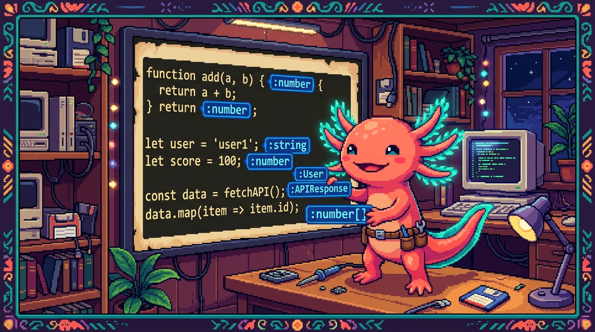

# Capítulo 01 — ¿Qué es TypeScript?

<p align="center">
  
</p>


> Este módulo es corto y muy rentable: TypeScript es JavaScript que ya conoces, más una "red de
> seguridad". Entender el *porqué* es la mitad del trabajo; la otra mitad es sintaxis sencilla.

---

## 1. El problema que resuelve TypeScript

Hay un detalle de JavaScript que conviene tener fresco: una variable puede guardar cualquier cosa
y cambiar de tipo cuando le da la gana, sin avisarte. Eso da mucha libertad, pero también abre la
puerta a errores que luego cuesta cazar. Míralo aquí:

```javascript
function precioConIva(precio) {
  return precio * 1.13;
}
precioConIva("100");   // en JavaScript no se queja… y da un resultado raro
```

Le pasaste el texto `"100"` en lugar del número `100`, y JavaScript ni se inmuta. No salta ningún
error en ese momento. El fallo aparece **más tarde**, normalmente en producción, y cuando vas a
buscarlo se te va medio día encontrándolo.

> ### 🟦 ¿Qué significa? — *Tipo (type)*
> El **tipo** de un dato es la **clase** de información que es: texto (`string`), número
> (`number`), booleano (`boolean`), etc. Ya te los cruzaste en JS y en Python. En JavaScript los
> tipos existen, pero el lenguaje no te obliga a respetarlos: tú verás. TypeScript sí te obliga.

> ### 🟦 ¿Qué significa? — *TypeScript*
> **TypeScript** es JavaScript **más un sistema de tipos**: te deja **declarar** de qué tipo es
> cada cosa, y revisa tu código **antes de ejecutarlo** para avisarte si metes la pata (por
> ejemplo, si pasas un texto donde tocaba un número).
> ```typescript
> function precioConIva(precio: number) {   // ': number' declara el tipo
>   return precio * 1.13;
> }
> precioConIva("100");   // ❌ TypeScript marca error aquí mismo, antes de ejecutar
> ```

---

## 2. La idea clave: errores temprano, no tarde

> ### 💡 Tip — "Shift left": atrapar el error cuanto antes
> Cuanto **antes** pillas un error, más barato sale arreglarlo. Un error que TypeScript te subraya
> en rojo **mientras escribes** te cuesta unos segundos. Ese mismo error, descubierto por un
> cliente en producción, te cuesta horas y un poco de tu reputación. Lo que hace TypeScript es
> adelantar la detección "hacia la izquierda" en el tiempo: del usuario final a tu teclado.

> ### 🟦 ¿Qué significa? — *Tipado estático vs. dinámico*
> - **Dinámico** (JavaScript, Python): los tipos se revisan **al ejecutar**. Muy flexible, pero
>   los errores asoman tarde.
> - **Estático** (TypeScript): los tipos se revisan **antes de ejecutar**, al escribir o compilar.
>   Más seguro. "Estático" quiere decir comprobado de antemano, sin tener que correr el programa.

---

## 3. TypeScript es un "superset" de JavaScript

> ### 🟦 ¿Qué significa? — *Superset (superconjunto)*
> Un **superset** es un lenguaje que **contiene a otro entero y le añade cosas encima**. TypeScript
> mete **todo** JavaScript dentro y le suma los tipos. Y esto tiene una consecuencia muy cómoda:
> **todo tu JavaScript ya es TypeScript válido**. Puedes ir adoptándolo poco a poco, poniendo tipos
> donde te apetezca y dejando el resto como está. No tiras nada de lo que aprendiste en el Módulo
> 03; simplemente lo amplías.

---

## 4. Los navegadores no entienden TypeScript: la compilación

> ### 🟦 ¿Qué significa? — *Compilar (transpilar)*
> Los navegadores solo saben ejecutar JavaScript, TypeScript no lo entienden. Así que, antes de
> usarlo, el código `.ts` se **compila** (o "transpila"): un programa lo traduce a JavaScript
> normal y le quita las anotaciones de tipo por el camino. **Compilar** es eso, traducir código de
> una forma a otra que la máquina sepa ejecutar.
> ```
>   archivo.ts   ──(compilador de TypeScript)──►   archivo.js   ──►   el navegador lo ejecuta
> ```
> Mientras traduce, el compilador **repasa los tipos** y te avisa de los errores. Las herramientas
> modernas (como **Vite**, que usa RachaSimple) se encargan de todo esto solas mientras programas;
> no tienes que lanzar nada a mano.

> ### 🟦 ¿Qué significa? — *Las extensiones `.ts` y `.tsx`*
> - `.ts` → un archivo de TypeScript normal y corriente.
> - `.tsx` → TypeScript que además lleva **JSX** dentro (la sintaxis de React para escribir
>   interfaz; la verás en el Módulo 06). Por eso los componentes de RachaSimple y Faro acaban en
>   `.tsx`.

---

## 5. Tu primera anotación de tipo

La sintaxis es de lo más simple: tras el nombre, dos puntos `:` y el tipo.

```typescript
let nombre: string = "Edwar";
let edad: number = 25;
let activo: boolean = true;
```

Si intentas guardar algo del tipo que no toca, TypeScript protesta **al momento**:
```typescript
let edad: number = 25;
edad = "veintiséis";   // ❌ Error: el tipo 'string' no se puede asignar a 'number'
```

> ### 💡 Tip — El editor se vuelve tu copiloto
> Con TypeScript, VS Code hace más que marcarte errores: también **autocompleta** mucho mejor
> (sabe qué propiedades tiene cada cosa) y te enseña la "forma" de los datos con solo pasar el
> cursor por encima. Esa ayuda constante, todo el rato, es una de las razones de peso por las que
> equipos enteros se pasan a TypeScript.

---

## ✅ Checklist — ¿ya domino esto?

- [ ] Entiendo qué problema resuelve TypeScript (errores de tipo que JS no atrapa).
- [ ] Sé qué es un **tipo** y la diferencia entre tipado **estático** y **dinámico**.
- [ ] Entiendo que TypeScript es un **superset**: todo mi JavaScript ya es válido.
- [ ] Sé que el `.ts` se **compila** a `.js` y que ahí se revisan los tipos.
- [ ] Distingo `.ts` de `.tsx` (este último con JSX de React).
- [ ] Sé anotar una variable con `: tipo`.

---

## 🧪 Ejercicios

1. **El porqué.** Explica, con el ejemplo del IVA, por qué pasar `"100"` (texto) a una función
   de precios es un problema que TypeScript evita y JavaScript no.
2. **Estático o dinámico.** Clasifica: JavaScript, Python, TypeScript. ¿Cuál revisa los tipos
   antes de ejecutar?
3. **Superset.** ¿Es verdad que tu código JavaScript del Módulo 03 ya es TypeScript válido?
   Explica por qué.
4. **Anota.** Escribe tres variables tipadas: una `string`, una `number` y una `boolean`.
5. **Encuentra el error.** ¿Qué marcará TypeScript aquí y por qué?
   ```typescript
   let total: number = 0;
   total = "cero";
   ```

➡️ Siguiente: **[Capítulo 02 — Tipos básicos y anotaciones](02-tipos-basicos.md)**.
