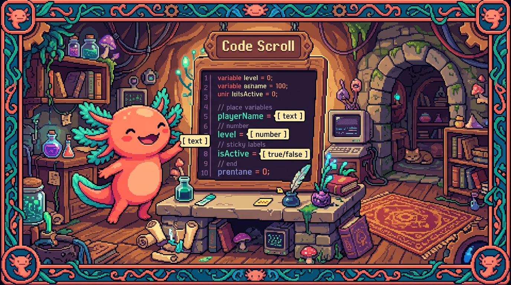

# Capítulo 02 — Tipos básicos y anotaciones

<p align="center">
  
</p>


> Pasemos a la práctica: cómo se escriben los tipos en el día a día. Vas a ver que es muy
> poca sintaxis y que casi todo cuadra solo. La regla de oro ya la tienes: **nombre `:` tipo**.

---

## 1. Los tipos básicos

> ### 🟦 ¿Qué significa? — *Los tipos primitivos*
> | Tipo | Qué guarda | Ejemplo |
> |---|---|---|
> | `string` | texto | `let n: string = "Edwar";` |
> | `number` | números (enteros o decimales) | `let e: number = 25;` |
> | `boolean` | verdadero/falso | `let a: boolean = true;` |
> | `null` | "vacío a propósito" | `let x: null = null;` |
> | `undefined` | "sin definir" | `let y: undefined;` |
> Un detalle que sorprende a quien viene de Python: aquí no hay `int` ni `float` por separado.
> Sea entero o decimal, todo número es `number`.

---

## 2. La inferencia: TypeScript adivina el tipo

> ### 🟦 ¿Qué significa? — *Inferencia de tipos*
> **Inferir** es deducir. Cuando le das un valor inicial a una variable, TypeScript **deduce
> solo** de qué tipo es; no hace falta que se lo escribas:
> ```typescript
> let nombre = "Edwar";   // TypeScript infiere que es string
> nombre = 42;            // ❌ Error: ya sabe que 'nombre' es string
> ```
> ¿Qué sacas de esto en la práctica? Que no tienes que anotar todo. Anota lo que aclare las
> cosas (sobre todo las funciones) y deja que la inferencia se encargue del resto. Menos ruido
> y la misma seguridad.

> ### 💡 Tip — ¿Cuándo anotar y cuándo no?
> - **Anota** los parámetros de funciones y, a veces, lo que devuelven (eso no se infiere solo
>   al llamarlas).
> - **Deja inferir** las variables simples que ya nacen con un valor (`const total = 0`).
> La idea es sencilla: anota en las "fronteras" (lo que entra y lo que sale) y confía en la
> inferencia hacia adentro.

---

## 3. Arrays tipados

> ### 🟦 ¿Qué significa? — *Tipar una lista*
> Para decir "una lista de textos" o "una lista de números", pones el tipo y le pegas `[]`:
> ```typescript
> let servicios: string[] = ["Diseño web", "IA"];
> let precios: number[] = [100, 250, 99];
> ```
> `string[]` se lee "arreglo de strings". Si intentas colar un número dentro de `servicios`,
> TypeScript salta con un error.

---

## 4. El tipo `any` (y por qué evitarlo)

> ### 🟦 ¿Qué significa? — *`any` (cualquiera)*
> `any` quiere decir "cualquier tipo, y no lo reviso". En la práctica apaga toda la seguridad
> de TypeScript para esa variable:
> ```typescript
> let cosa: any = "hola";
> cosa = 42;          // permitido
> cosa.metodoRaro();  // TypeScript NO se queja (y eso es peligroso)
> ```
> ⚠️ **Úsalo lo menos posible.** Si llenas todo de `any`, vuelves a programar en JavaScript a
> pelo, sin red. Tiene su lugar para casos muy concretos (código viejo, datos que llegan con
> forma desconocida), pero es una "puerta trasera" que conviene tener cerrada. Por eso los
> proyectos serios (como los tuyos) activan reglas que te avisan en cuanto aparece un `any`.

> ### 🟦 ¿Qué significa? — *`unknown` (la alternativa segura a `any`)*
> `unknown` también acepta cualquier valor, pero con una diferencia clave: **te obliga a
> comprobar el tipo antes de usarlo**. Es el "any responsable". Por ahora basta con que lo
> reconozcas; quédate con esto: **mejor tipos concretos; y si de verdad no sabes el tipo, usa
> `unknown` antes que `any`.**

---

## 5. Tipos unión: "esto o aquello"

> ### 🟦 ¿Qué significa? — *Tipo unión (`|`)*
> A veces un valor puede ser de **uno entre varios** tipos. Eso se escribe con la barra `|`:
> ```typescript
> let id: string | number;   // puede ser texto O número
> id = "abc123";   // ✅
> id = 42;         // ✅
> id = true;       // ❌ no es ni string ni number
> ```
> Hay una variante muy usada: poner **valores literales** como unión para limitar las opciones
> a unas pocas:
> ```typescript
> let estado: "completado" | "minimo" | "no_hecho";
> estado = "completado";   // ✅
> estado = "otro";         // ❌ solo se permiten esos tres textos
> ```

> ### 🔎 En tu código
> RachaSimple hace justo esto: el tipo de un check-in diario es algo parecido a
> `"completed" | "minimum" | "recovery" | "no_done"`. Gracias a eso es **imposible** guardar
> por error un estado inválido: TypeScript te lo cortaría mientras escribes, antes de ejecutar
> nada. Esa es la seguridad de tipos trabajando a tu favor.

---

## ✅ Checklist — ¿ya domino esto?

- [ ] Anoto variables con `string`, `number`, `boolean`.
- [ ] Entiendo la **inferencia** y cuándo conviene anotar y cuándo no.
- [ ] Tipo arrays con `tipo[]` (ej. `string[]`).
- [ ] Sé qué es `any`, por qué evitarlo, y que `unknown` es la alternativa segura.
- [ ] Uso **tipos unión** (`A | B`) y uniones de literales para limitar valores.

---

## 🧪 Ejercicios

1. **Anota o infiere.** ¿En cuáles hace falta anotar y en cuáles no?:
   (a) `const ciudad = "San Salvador";` (b) un parámetro de función `precio`.
2. **Array.** Declara una variable `edades` que sea una lista de números.
3. **Evita any.** Explica por qué llenar un proyecto de `any` "tira a la basura" las ventajas
   de TypeScript.
4. **Unión de literales.** Declara una variable `talla` que solo pueda ser `"S"`, `"M"` o `"L"`.
5. **Lee tu app.** Si en RachaSimple un check-in es
   `"completed" | "minimum" | "recovery" | "no_done"`, ¿qué pasaría si el código intentara
   guardar `"casi"`? ¿Cuándo se detectaría el error?

➡️ Siguiente: **[Capítulo 03 — Interfaces y tipos propios](03-interfaces-y-tipos.md)**.
