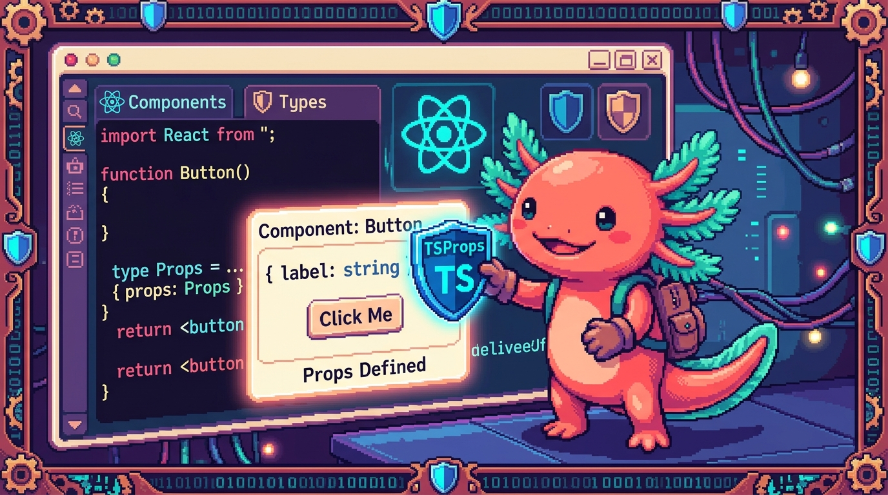

# Capítulo 11 — TypeScript con React

<p align="center">
  
</p>


> Llevas diez capítulos tipando funciones, objetos y datos que llegan de afuera. Ahora viene
> el momento que estabas esperando sin saberlo: **¿cómo se juntan TypeScript y React?** React
> es la librería con la que están construidas RachaSimple (la app de hábitos) y Faro (tu
> organizador de proyectos). Y resulta que React + TypeScript es una de las parejas más felices
> de la programación moderna: cada **componente**, cada **prop**, cada **estado** puede llevar su
> tipo, y el editor te avisa al instante si le pasas algo equivocado. Este capítulo es el
> **puente al Módulo 06** (donde aprenderás React de verdad): aquí no vamos a enseñarte React
> entero, sino a **leer y tipar** los pedazos de React que ya viven en tus repos reales. Bit, tu
> ajolote, te recuerda algo que ya sabes: **TypeScript es JavaScript con tipos.** React con TS es
> el mismo React de siempre, solo que con etiquetas que dicen qué forma tiene cada cosa. Vamos.

---

## 1. ¿Qué es un componente y por qué tiparlo?

En React, la interfaz se arma con **componentes**: funciones que devuelven un pedazo de pantalla.
Mira el componente más pequeño de Faro, `PhaseBadge` (la etiqueta de color que muestra la fase de
un proyecto):

```typescript
import { Badge } from "@/components/ui";
import { phaseConfig } from "@/lib/phases";
import type { ProjectPhase } from "@/lib/types";

export function PhaseBadge({ phase }: { phase: ProjectPhase }) {
  const cfg = phaseConfig(phase);
  return <Badge className={cfg.className}>{cfg.label}</Badge>;
}
```

Eso es todo: una función que recibe un dato (`phase`) y devuelve algo que se ve en pantalla
(`<Badge>...</Badge>`). Ese «algo que se ve» es **JSX**.

> ### 🟦 ¿Qué significa? — *Componente*
> Un **componente** es una función de JavaScript que devuelve interfaz (un trozo de pantalla).
> **Para qué sirve:** dividir la app en piezas reutilizables, como ladrillos. **Dónde se usa:** en
> RachaSimple, `HabitCard` dibuja una tarjeta de hábito; en Faro, `PhaseBadge` dibuja la etiqueta
> de fase. Cada pantalla es muchos componentes anidados.

> ### 🟦 ¿Qué significa? — *JSX / TSX*
> **JSX** es una sintaxis que deja escribir «HTML dentro de JavaScript» (como `<Badge>...</Badge>`).
> Cuando ese archivo lleva tipos de TypeScript, la extensión es **`.tsx`** en vez de `.ts`. **Para
> qué sirve:** describir cómo se ve un componente sin separar el HTML del código. **Dónde se ve:**
> todos los archivos de pantalla en tus repos terminan en `.tsx` — `HabitCard.tsx`, `project-card.tsx`.

> ### 💡 Tip
> ¿Por qué `{ phase }` entre llaves? Es **desestructuración** (la viste en el Módulo 03). React le
> pasa al componente un solo objeto con todas sus props, y tú sacas las que necesitas por nombre.
> `{ phase }` significa «dame la propiedad `phase` de ese objeto».

---

## 2. Tipar las props con una `interface`

Las **props** son los datos que un componente recibe de quien lo usa, como los argumentos de una
función. Cuando son una o dos, puedes escribir el tipo en línea (como `{ phase }: { phase: ProjectPhase }`).
Pero cuando son varias, lo limpio es declarar una `interface` (recuerda el Capítulo 03).

Mira `MetricCard` de RachaSimple, la tarjeta que muestra una métrica (por ejemplo «Racha actual: 7»):

```typescript
import type { LucideIcon } from 'lucide-react';
import { SoftCard } from './SoftCard';

interface MetricCardProps {
  label: string;
  value: string | number;
  caption?: string;
  icon?: LucideIcon;
}

export function MetricCard({ label, value, caption, icon: Icon }: MetricCardProps) {
  return (
    <SoftCard className="space-y-2">
      <div className="flex items-center justify-between">
        <p className="text-xs ...">{label}</p>
        {Icon && <Icon size={16} className="text-muted-foreground" />}
      </div>
      <p className="font-display text-4xl ...">{value}</p>
      {caption && <p className="text-sm text-muted-foreground">{caption}</p>}
    </SoftCard>
  );
}
```

Lee la `interface` como una lista de requisitos: «quien use `MetricCard` **tiene que** darme un
`label` (texto) y un `value` (texto o número), y **puede** darme un `caption` y un `icon`».

> ### 🟦 ¿Qué significa? — *Props*
> **Props** (de *properties*) son los datos de entrada de un componente. Quien usa el componente
> se los pasa como atributos: `<MetricCard label="Racha" value={7} />`. **Para qué sirven:** que el
> mismo componente sirva para muchos casos cambiando solo los datos. **Dónde se ve:** en RachaSimple
> la pantalla de inicio usa varios `MetricCard` con distintos `label` y `value`.

> ### 🟦 ¿Qué significa? — *Interface de props*
> Es una `interface` que describe **la forma exacta** de las props que un componente acepta. Por
> convención se llama `NombreDelComponente` + `Props` (`MetricCardProps`, `PageHeaderProps`). **Para
> qué sirve:** que TypeScript revise que le pasas las props correctas y que el editor te las
> autocomplete. **Dónde se ve:** en casi todos los componentes de RachaSimple y Faro.

Lo bonito: si por error escribes `<MetricCard value={7} />` (olvidaste `label`), TypeScript te
subraya en rojo **antes de abrir el navegador**: «falta la propiedad `label`». Es el mismo poder
que ya conoces, ahora cuidando tu interfaz.

> ### 🔎 En tu código
> Abre `RachaSimple/src/components/racha/MetricCard.tsx`. Fíjate en `icon?: LucideIcon`. `LucideIcon`
> es un **tipo importado** de la librería de íconos `lucide-react`: el componente exige que, si le
> pasas un ícono, sea uno de verdad de esa librería, no cualquier cosa.

---

## 3. Props opcionales y valores por defecto

¿Viste el `?` en `caption?: string` y `icon?: LucideIcon`? Ese signo de pregunta lo aprendiste en
el Capítulo 03: marca una propiedad como **opcional**. Quien use `MetricCard` puede dárselas o no.

> ### 🟦 ¿Qué significa? — *Prop opcional*
> Una **prop opcional** lleva `?` después de su nombre en la `interface` (`caption?: string`).
> Significa que se puede omitir; su valor será `undefined` si no la pasan. **Para qué sirve:**
> componentes flexibles que no obligan a llenar todo. **Dónde se ve:** en `MetricCard`, `caption`
> e `icon` son opcionales; `label` y `value` son obligatorias.

Cuando una prop es opcional, el componente debe protegerse por si llega `undefined`. Por eso
`MetricCard` escribe `{caption && <p>...</p>}`: «si hay `caption`, dibújalo; si no, nada». Es el
mismo **estrechamiento** del Capítulo 06.

A veces quieres que una prop opcional tenga un **valor por defecto** en lugar de quedar `undefined`.
Eso se hace al desestructurar, igual que con argumentos de función. Mira el `Logo` de Faro:

```typescript
export function Logo({
  showText = true,
  size = 28,
}: {
  showText?: boolean;
  size?: number;
}) {
  return (
    <span className="inline-flex items-center gap-2">
      <svg width={size} height={size} viewBox="0 0 48 48">{/* ...dibujo del faro... */}</svg>
      {showText && <span className="font-display ...">Faro</span>}
    </span>
  );
}
```

`showText = true` significa: «si no me pasan `showText`, vale `true`». Así `<Logo />` muestra el
texto, y `<Logo showText={false} />` muestra solo el dibujo. Lo mismo con `size = 28`.

> ### 🟦 ¿Qué significa? — *Valor por defecto*
> Un **valor por defecto** es el que toma una prop cuando no se la pasan, escrito con `=` en la
> desestructuración (`size = 28`). **Para qué sirve:** que el componente funcione «de fábrica» sin
> obligar a configurarlo. **Dónde se ve:** en el `Logo` de Faro, `showText` y `size` vienen con
> valores listos.

> ### ⚠️ Cuidado
> El `?` en la `interface` y el `= valor` en la desestructuración son **dos cosas distintas pero
> complementarias.** El `?` le dice a TS «esta prop se puede omitir». El `= 28` decide **qué pasa**
> cuando la omiten. Si pones valor por defecto, casi siempre marcas la prop opcional con `?` también,
> para que TS no la exija al usarla.

> ### 💡 Tip
> ¿Notaste el truco `icon: Icon` en `MetricCard`? Eso **renombra** al desestructurar: la prop se
> llama `icon`, pero dentro del componente la usamos como `Icon` (con mayúscula). React exige que
> los componentes empiecen con mayúscula para distinguirlos de las etiquetas HTML normales.

---

## 4. Tipar `children` con `ReactNode`

Muchos componentes envuelven a otros. En `<SoftCard>contenido</SoftCard>`, ese «contenido» que va
entre la apertura y el cierre es una prop especial llamada **`children`** (hijos). ¿De qué tipo es?
De `ReactNode`.

Mira `PageHeader` de RachaSimple, que recibe un `action` (por ejemplo, un botón) para ponerlo a la
derecha del título:

```typescript
import type { ReactNode } from 'react';

interface PageHeaderProps {
  eyebrow?: string;
  title: string;
  description?: string;
  action?: ReactNode;
}

export function PageHeader({ eyebrow, title, description, action }: PageHeaderProps) {
  return (
    <header className="mb-7 space-y-4">
      {eyebrow && <p className="...">{eyebrow}</p>}
      <div className="flex items-start justify-between gap-4">
        <div className="space-y-2">
          <h1 className="...">{title}</h1>
          {description && <p className="...">{description}</p>}
        </div>
        {action}
      </div>
    </header>
  );
}
```

`action?: ReactNode` significa: «opcionalmente recíbeme **cualquier cosa que React pueda dibujar**».
Un botón, un texto, un ícono, varios elementos juntos… todo eso es `ReactNode`.

> ### 🟦 ¿Qué significa? — *`children`*
> **`children`** es la prop automática que contiene lo que escribes **entre** la etiqueta de apertura
> y la de cierre de un componente: en `<SoftCard>hola</SoftCard>`, `children` es `"hola"`. **Para qué
> sirve:** hacer componentes «contenedores» que envuelven a otros. **Dónde se ve:** `SoftCard` de
> RachaSimple envuelve el contenido de muchas tarjetas.

> ### 🟦 ¿Qué significa? — *`ReactNode`*
> **`ReactNode`** es el tipo de «cualquier cosa que React puede mostrar en pantalla»: texto, números,
> un elemento JSX, una lista de elementos, `null`, etc. Se importa de `react`. **Para qué sirve:**
> tipar `children` o cualquier prop que reciba contenido renderizable. **Dónde se ve:** en `PageHeader`
> de RachaSimple la prop `action` es `ReactNode`.

Cuando un componente recibe `children` directamente (no con otro nombre como `action`), su tipo
también es `ReactNode`. Una forma típica de tiparlo:

```typescript
interface SeccionProps {
  titulo: string;
  children: ReactNode;
}

function Seccion({ titulo, children }: SeccionProps) {
  return (
    <section>
      <h2>{titulo}</h2>
      {children}
    </section>
  );
}
```

> ### 🔎 En tu código
> En `SoftCard.tsx` de RachaSimple no aparece la palabra `children` en una `interface` propia: el
> componente extiende `HTMLAttributes<HTMLDivElement>`, un tipo de React que **ya incluye** `children`
> y todos los atributos de un `<div>` (como `className` y `style`). Es un truco avanzado que verás a
> fondo en el Módulo 06; por ahora basta con saber que `children` siempre es del tipo `ReactNode`.

---

## 5. Tipar eventos: `onClick`, `onChange`

Los componentes responden a lo que hace el usuario: clics, teclas, texto que escribe. Eso son
**eventos**, y React los maneja con props que empiezan por `on`: `onClick`, `onChange`, `onSubmit`.

El caso más simple aparece en `ColorPicker` de RachaSimple (el selector de color de un hábito):

```typescript
interface ColorPickerProps {
  value: string | null;
  onChange: (color: string | null) => void;
}

export function ColorPicker({ value, onChange }: ColorPickerProps) {
  return (
    <div className="flex flex-wrap gap-3">
      <button type="button" onClick={() => onChange(null)} aria-label="Sin color">—</button>
      {HABIT_COLORS.map((c) => (
        <button key={c.id} type="button" onClick={() => onChange(c.id)} title={c.label} />
      ))}
    </div>
  );
}
```

Fíjate en dos cosas. Primero, `onChange` es una prop **función**: su tipo es
`(color: string | null) => void` (el `=> void` lo viste en el Capítulo 04: «no devuelve nada útil»).
Segundo, `onClick={() => onChange(c.id)}` es lo que se ejecuta al hacer clic en ese botón.

> ### 🟦 ¿Qué significa? — *Evento*
> Un **evento** es algo que ocurre en la interfaz: un clic, una tecla, un cambio de texto. **Para
> qué sirve:** reaccionar a lo que hace la persona. **Dónde se ve:** en `ColorPicker` cada botón
> tiene un `onClick` que avisa qué color se eligió.

> ### 🟦 ¿Qué significa? — *Manejador de evento (event handler)*
> Es la función que se ejecuta cuando ocurre un evento, como `() => onChange(c.id)`. **Para qué
> sirve:** decir «cuando pase esto, haz aquello». **Dónde se ve:** en todos los `onClick` y `onChange`
> de tus apps.

Cuando necesitas leer **lo que el usuario escribió** en un input, el manejador recibe un objeto
**evento** que también lleva tipo. Mira el input de hora en `ReminderCard` de RachaSimple:

```typescript
<input
  type="time"
  value={time}
  onChange={(e) => setTime(e.target.value)}
/>
```

Aquí `e` es el evento. `e.target.value` es el texto que el usuario tiene en el input. ¿De qué tipo
es `e`? En este caso React lo **deduce solo**, porque el `<input>` es un elemento HTML que React ya
conoce: `e` es del tipo `ChangeEvent<HTMLInputElement>`. No tienes que escribirlo.

> ### 🟦 ¿Qué significa? — *`ChangeEvent`*
> **`ChangeEvent<HTMLInputElement>`** es el tipo del evento que dispara un input al cambiar su valor.
> Lleva entre `<>` el tipo del elemento (un input, un textarea…). **Para qué sirve:** que
> `e.target.value` esté tipado como texto y el editor sepa qué propiedades tiene `e`. **Dónde se
> usa:** en `ReminderCard` y en la pantalla de login de RachaSimple, al leer lo que se escribe.

A veces sí necesitas escribir el tipo del evento tú mismo: cuando defines el manejador **aparte**
del JSX. Ahí React no puede deducirlo y se lo dices a mano:

```typescript
import type { ChangeEvent } from 'react';

function manejarTexto(e: ChangeEvent<HTMLInputElement>) {
  setNombre(e.target.value);
}

// ...y en el JSX:
<input value={nombre} onChange={manejarTexto} />
```

> ### 💡 Tip
> Regla práctica: si escribes el manejador **en línea** (`onChange={(e) => ...}`), normalmente React
> deduce el tipo de `e` y no escribes nada. Si lo defines como **función separada**, tendrás que
> ponerle el tipo (`ChangeEvent<...>`, `MouseEvent<...>`, etc.). El editor te dirá cuál falta.

---

## 6. Tipar `useState`

Un componente recuerda cosas mientras está en pantalla: el texto a medio escribir, qué color se
eligió, si un menú está abierto. Eso es el **estado**, y se guarda con el hook `useState`.

> ### 🟦 ¿Qué significa? — *Hook*
> Un **hook** es una función especial de React cuyo nombre empieza por `use` (`useState`, `useRef`,
> `useEffect`). Da «superpoderes» a un componente: memoria, acceso al DOM, efectos. **Para qué sirve:**
> manejar estado y comportamiento. **Dónde se ve:** RachaSimple los usa en todas partes; los verás a
> fondo en el Módulo 06.

> ### 🟦 ¿Qué significa? — *Estado (state)*
> El **estado** es un dato que un componente guarda y que, al cambiar, hace que React vuelva a dibujar
> la pantalla. **Para qué sirve:** recordar y reaccionar (un contador, un campo de texto). **Dónde se
> ve:** en `ReminderCard` el estado guarda la hora del recordatorio.

`useState` devuelve dos cosas en un array: el valor actual y una función para cambiarlo. Mira un
caso real de `ReferralCard` de RachaSimple:

```typescript
const [count, setCount] = useState<number | null>(null);
```

Lee la línea así: «`count` es el valor (un número o `null`), `setCount` lo cambia, y empieza valiendo
`null`». El `<number | null>` entre ángulos es **el tipo del estado**, que ya conoces de los genéricos
(Capítulo 04): le dice a `useState` qué clase de dato va a guardar.

> ### 🟦 ¿Qué significa? — *`useState`*
> **`useState<T>(inicial)`** crea un estado del tipo `T` con un valor inicial, y devuelve
> `[valor, funciónParaCambiarlo]`. **Para qué sirve:** guardar datos que cambian con el tiempo.
> **Dónde se usa:** en `ReferralCard` guarda un contador (`number | null`) y en `ReminderCard` guarda
> la hora escrita (`string`).

Más ejemplos reales de `ReminderCard`:

```typescript
const [time, setTime] = useState<string>('');
const [permission, setPermission] = useState<ReminderPermission>('default');
```

`time` es texto y arranca vacío; `permission` es de un tipo propio (`ReminderPermission`, una unión
como las del Capítulo 06) y arranca en `'default'`.

> ### ⚠️ Cuidado
> Cuando das un valor inicial claro, **TypeScript deduce el tipo solo** y no necesitas el `<...>`.
> `useState(0)` ya sabe que es un número; `useState('')` sabe que es texto. Pero si el estado puede
> ser de más de un tipo —como `number | null`, que empieza en `null` pero luego será número— **sí
> tienes que escribirlo**: `useState<number | null>(null)`. Si no, TS pensaría que `count` siempre
> es `null` y te impediría guardarle un número. Por eso `ReferralCard` lo escribe explícito.

> ### 💡 Tip
> El nombre del cambiador es por convención `set` + el nombre del estado: `count` → `setCount`,
> `time` → `setTime`. No es obligatorio, pero todo el ecosistema lo hace y se lee solo.

Y así se conecta todo lo de este capítulo. En el login de RachaSimple, el estado y el evento bailan
juntos:

```typescript
const [email, setEmail] = useState<string>('');
// ...
<input value={email} onChange={(e) => setEmail(e.target.value)} />
```

El input muestra `email`; cuando escribes, el evento `e` trae el nuevo texto y `setEmail` lo guarda;
React redibuja. Estado tipado + evento tipado, trabajando en equipo.

---

## 7. Tipar `useRef`

A veces no quieres «memoria que redibuja la pantalla», sino una referencia a un **elemento del DOM**
real (para enfocar un input, medir su tamaño, hacer scroll). Eso es `useRef`.

> ### 🟦 ¿Qué significa? — *`useRef`*
> **`useRef<T>(inicial)`** crea una «caja» que guarda un valor entre redibujos **sin** provocar
> redibujos cuando cambia. Su uso más común es apuntar a un elemento del DOM. **Para qué sirve:**
> acceder directamente a un elemento (enfocarlo, leerlo). **Dónde se usará:** lo verás en formularios
> del Módulo 06; tus repos actuales casi no lo necesitan porque React maneja el DOM por ti.

Cuando apunta a un elemento del DOM, su tipo es el del elemento o `null` (porque al principio el
elemento todavía no existe):

```typescript
import { useRef } from 'react';

function CampoNombre() {
  const inputRef = useRef<HTMLInputElement>(null);

  function enfocar() {
    inputRef.current?.focus();   // current puede ser null al inicio
  }

  return (
    <>
      <input ref={inputRef} type="text" />
      <button type="button" onClick={enfocar}>Enfocar</button>
    </>
  );
}
```

`useRef<HTMLInputElement>(null)` dice: «esta caja apuntará a un `<input>`, y por ahora es `null`».
El valor real se lee en `inputRef.current`. Como puede ser `null`, usamos `?.` (el encadenamiento
opcional del Capítulo 06) antes de `.focus()`.

> ### 🟦 ¿Qué significa? — *`.current`*
> Toda ref guarda su valor en la propiedad **`.current`**. Si la ref apunta a un input, `inputRef.current`
> es ese input (o `null` si aún no está montado). **Para qué sirve:** llegar al elemento real. **Dónde
> se ve:** en cualquier `useRef`, siempre lees y escribes `.current`.

> ### ⚠️ Cuidado
> No confundas `useState` con `useRef`. **Cambiar el estado** (`setCount`) redibuja la pantalla;
> **cambiar una ref** (`inputRef.current = ...`) **no** redibuja. Usa estado para datos que se ven;
> usa ref para «agarrar» un elemento o guardar algo entre bambalinas.

---

## 8. Juntándolo todo: leer un componente real

Ya tienes las piezas. Mira de nuevo `ColorPicker` con ojos nuevos y nómbralas tú:

```typescript
interface ColorPickerProps {           // 1. interface de props
  value: string | null;                // 2. prop obligatoria, unión de tipos
  onChange: (color: string | null) => void;  // 3. prop función para un evento
}

export function ColorPicker({ value, onChange }: ColorPickerProps) {  // 4. desestructuración tipada
  return (
    <div className="flex flex-wrap gap-3">
      <button type="button" onClick={() => onChange(null)}>—</button>  {/* 5. manejador de evento */}
      {HABIT_COLORS.map((c) => (
        <button
          key={c.id}                    // 6. key, obligatoria al recorrer listas
          onClick={() => onChange(c.id)}
          style={{ backgroundColor: c.hex }}
        />
      ))}
    </div>
  );
}
```

Esto es React + TypeScript de verdad, el mismo que escribirás en el Módulo 06. Nada mágico: una
función, props tipadas con `interface`, eventos manejados con funciones tipadas. TypeScript es
JavaScript con tipos, y React con TypeScript es React con etiquetas. Bit te aplaude con sus
branquias: ya puedes **leer** la interfaz de tus apps, y eso es el 80% del camino para escribirla.

> ### 🔎 En tu código
> Abre tres archivos seguidos: `RachaSimple/src/components/racha/MetricCard.tsx`,
> `PageHeader.tsx` y `ColorPicker.tsx`. En cada uno, busca primero la `interface ...Props`, luego la
> función, luego el JSX. Si reconoces ese patrón —interface, función, JSX— ya sabes leer cualquier
> componente de tus repos.

---

## ✅ Checklist — ¿ya domino esto?

- [ ] Sé que un **componente** es una función que devuelve JSX, y que los archivos con tipos terminan en `.tsx`.
- [ ] Puedo declarar una **interface de props** (`NombreProps`) y desestructurarla en el componente.
- [ ] Distingo una **prop obligatoria** de una **opcional** (la opcional lleva `?`).
- [ ] Sé poner un **valor por defecto** a una prop opcional al desestructurar (`size = 28`).
- [ ] Entiendo qué es **`children`** y que su tipo es **`ReactNode`**.
- [ ] Sé tipar un **evento**: en línea React lo deduce; aparte uso `ChangeEvent<HTMLInputElement>`.
- [ ] Puedo escribir **`useState<T>(inicial)`** y sé cuándo necesito el `<T>` y cuándo TS lo deduce.
- [ ] Distingo **`useState`** (redibuja) de **`useRef`** (no redibuja), y sé leer `.current`.
- [ ] Puedo abrir un componente real de RachaSimple o Faro y nombrar sus partes.

---

## 🧪 Ejercicios

1. **Lee y etiqueta (sin computadora).** Copia en papel la `interface MetricCardProps` de RachaSimple.
   Marca cuáles props son obligatorias y cuáles opcionales, y di de qué tipo es cada una. Explica por
   qué `value` es `string | number` y no solo `number`.

2. **Diseña la interface (sin computadora).** Imagina un componente `HabitCard` que muestra un hábito.
   Debe recibir: el nombre del hábito (texto, obligatorio), la racha actual (número, obligatorio), un
   emoji (texto, opcional) y una función `onComplete` que no recibe nada y no devuelve nada. Escribe la
   `interface HabitCardProps` completa.

3. 💻 **Tipa el estado.** En un archivo `.tsx`, crea un componente `Contador` con
   `const [n, setN] = useState(0)` y un botón cuyo `onClick` haga `setN(n + 1)`. Luego añade un segundo
   estado `const [nota, setNota] = useState<string | null>(null)`. Pregúntate: ¿por qué el primero **no**
   necesita `<...>` y el segundo **sí**?

4. 💻 **Input controlado.** Crea un componente con `const [texto, setTexto] = useState('')` y un
   `<input value={texto} onChange={(e) => setTexto(e.target.value)} />`. Muestra debajo `<p>{texto}</p>`.
   Comprueba que al escribir, el párrafo se actualiza. Pasa el ratón sobre `e` en tu editor: ¿qué tipo
   muestra?

5. 💻 **Props opcionales con defecto.** Copia el componente `Logo` de Faro a un archivo nuevo. Úsalo tres
   veces: `<Logo />`, `<Logo showText={false} />` y `<Logo size={48} />`. Observa qué cambia en cada caso
   y por qué el valor por defecto evita errores.

6. 💻 **Caza el error.** Escribe `<MetricCard value={7} />` (olvidando `label`) y mira el subrayado rojo
   que pone TypeScript. Lee el mensaje. Luego escribe `<MetricCard label="Racha" value={true} />` y
   observa el nuevo error: ¿por qué `true` no es válido como `value`? Conecta esto con lo que el editor
   te avisa **antes** de abrir el navegador.
