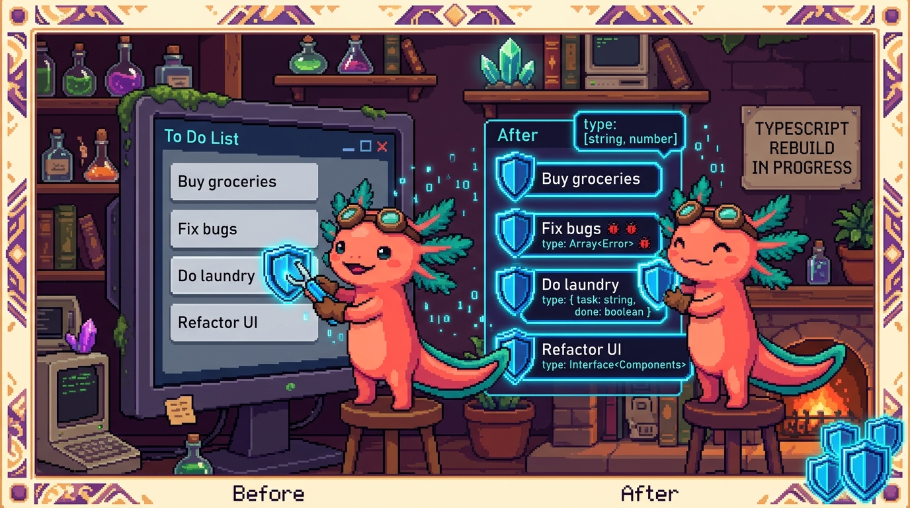

# Capítulo 14 — Mini-proyecto: una lista de tareas tipada

<p align="center">
  
</p>


> ¡Hola otra vez! Soy **Bit**, tu ajolote programador. 🐾 ¿Te acuerdas de la lista de tareas que construiste en el Módulo 03 con JavaScript puro? Aquella libretita digital donde escribías "Comprar pan", la marcabas como hecha y la borrabas. Hoy vamos a hacer algo precioso: **la vamos a reescribir con TypeScript**. No para empezar de cero, sino para ponerle "etiquetas de seguridad" a cada pieza. Vas a ver con tus propios ojos el momento exacto en que TypeScript te salva de un error *antes* de ejecutar el programa. Y al final vamos a poner las dos versiones lado a lado —la de JavaScript sin tipos y la nueva con tipos— para que sientas en carne propia qué aportan los tipos. Recuerda el lema de todo el módulo: **TypeScript es JavaScript con tipos**. Todo lo que ya sabes sigue valiendo; solo le sumamos avisos. Respira. Esto lo vas a disfrutar.

---

## 1. ¿Qué vamos a construir (otra vez)?

La misma lista de tareas de siempre: una caja para escribir, un botón para añadir, una lista donde aparecen las tareas, clic para marcarlas como hechas y un botón para borrarlas. **El comportamiento no cambia.** Lo que cambia es que ahora cada dato va a tener un **tipo** que le dice a TypeScript (y a tu editor) qué forma tiene.

La pregunta honesta que quizá tengas es: *"Si la versión de JavaScript ya funcionaba, ¿para qué complicarme?"*. La respuesta corta: para que el editor te avise de los errores mientras escribes, en vez de que se rompa cuando un usuario lo usa. La respuesta larga es todo este capítulo.

> ### 🟦 ¿Qué significa? — *TypeScript*
> TypeScript es **JavaScript con tipos**: el mismo lenguaje que ya conoces, más una capa que te deja decir de qué tipo es cada dato (texto, número, verdadero/falso, objeto con tal forma...). Sirve para que tu editor te avise de errores **antes** de ejecutar el programa. Donde se usa de verdad: **RachaSimple** (app de hábitos en React + TypeScript) y **Faro/Organizer** (Next.js + React + TypeScript) están escritas enteras en TypeScript; cada archivo termina en `.ts` o `.tsx`.

> ### 🟦 ¿Qué significa? — *tipo*
> Un tipo es una **etiqueta que describe qué forma tiene un dato**: si es texto (`string`), número (`number`), verdadero/falso (`boolean`), una lista, un objeto con ciertas propiedades... Sirve para que TypeScript sepa qué puedes hacer con cada dato y te frene si te equivocas. En **Faro**, el archivo `src/lib/types.ts` está dedicado por completo a definir los tipos del proyecto.

> ### 💡 Tip
> No tienes que tirar la versión de JavaScript del Módulo 03. Lo ideal es tener las dos carpetas abiertas y comparar. Verás que el 90% del código es **idéntico**. TypeScript no es un lenguaje nuevo que aprender de cero: es tu JavaScript de siempre con anotaciones.

## 2. Preparamos el proyecto

En el Módulo 03 abrías el `index.html` con doble clic y listo. Con TypeScript hay un paso extra: el navegador **no entiende** TypeScript directamente, así que hay que **traducirlo** a JavaScript primero. A ese paso se le llama **compilar**.

> ### 🟦 ¿Qué significa? — *compilar*
> Compilar es **traducir** tu código de TypeScript (`.ts`) a JavaScript normal (`.js`) que el navegador sí entiende. Durante esa traducción, TypeScript revisa los tipos y te avisa si algo no cuadra. Sirve para tener dos beneficios: avisos de errores + un archivo que cualquier navegador puede ejecutar. En **RachaSimple** y **Faro**, esa traducción la hace la herramienta de construcción (Vite en uno, Next.js en el otro) cada vez que corres `npm run build`.

Para este mini-proyecto vamos a usar la forma más sencilla posible. Crea una carpeta `lista-tareas-ts` y dentro un archivo `app.ts`. Si quieres compilar a mano, instala TypeScript una vez con `npm install -g typescript` y luego, dentro de la carpeta, ejecuta:

```typescript
// En la terminal (no es código TypeScript, es un comando):
// tsc app.ts
// Eso genera app.js, que es el que carga tu index.html con <script src="app.js">
```

> ### 💡 Tip
> Si esto te suena a mucho lío, tranquilo: en proyectos reales nunca compilas a mano; las herramientas (Vite, Next.js) lo hacen solas mientras programas. Aquí lo hacemos manual una vez para ver la "cocina" por dentro. Lo importante de este capítulo son los **tipos**, no la compilación.

El `index.html` y el `estilos.css` son **exactamente los mismos** del Módulo 03. Lo único que cambia es que el `<script>` apunta a `app.js` (el archivo traducido, no a `app.ts`).

## 3. El corazón del capítulo: el `type Tarea`

Aquí está la gran diferencia. En JavaScript, una tarea era simplemente:

```typescript
// Versión JavaScript del Módulo 03: un objeto suelto, sin describir su forma
const tarea = { texto: "Comprar pan", hecha: false };
```

Funcionaba, pero JavaScript no sabía nada sobre esa tarea. Si por error escribías `tarea.echa` (sin la "h") o le ponías `tarea.hecha = "sí"` (un texto donde debía ir verdadero/falso), nadie te avisaba. El programa fallaba *después*, cuando ya era tarde.

En TypeScript, **primero describimos la forma** de una tarea con un `type`:

```typescript
type Tarea = {
  texto: string;
  hecha: boolean;
};
```

Léelo en voz alta: "una `Tarea` es un objeto que tiene un `texto` que es un `string` y un `hecha` que es un `boolean`". Ya está. Acabas de crear un molde.

> ### 🟦 ¿Qué significa? — *type (alias de tipo)*
> Un `type` es un **molde con nombre** que describe la forma exacta de un dato. Aquí, `Tarea` dice "un objeto con `texto` (texto) y `hecha` (verdadero/falso)". Sirve para reutilizar esa forma en todo tu programa sin repetirla. En **RachaSimple**, el archivo `src/types/database.ts` usa `type` para muchas cosas, por ejemplo `type UserPlan = 'free' | 'pro'` (un usuario es gratis o pro, nada más).

> ### 🟦 ¿Qué significa? — *string*
> `string` es el tipo de los **textos**: palabras, frases, cualquier cosa entre comillas. El `texto` de una tarea es un `string` porque es lo que el usuario escribe. Sirve para que TypeScript sepa que ahí va texto y te deje usar funciones de texto como `.trim()`. En **Faro**, en `src/lib/types.ts`, el `name` de un proyecto es un `string`.

> ### 🟦 ¿Qué significa? — *boolean*
> `boolean` es el tipo de los valores **verdadero/falso** (`true` o `false`), nada más. El `hecha` de una tarea es un `boolean`: o está hecha (`true`) o no (`false`). Sirve para representar interruptores: encendido/apagado, sí/no. En **Faro**, cada paso del roadmap tiene `done: boolean` (hecho o no hecho).

> ### 🔎 En tu codigo
> Fíjate que en RachaSimple y Faro hay un archivo **dedicado solo a tipos** (`types/database.ts` y `lib/types.ts`). No es casualidad: definir las formas de tus datos en un solo sitio y reutilizarlas es una de las costumbres más sanas de TypeScript. Tu `type Tarea` es la versión de juguete de esos archivos.

> ### 💡 Tip — ¿`type` o `interface`?
> En el Capítulo 03 viste que también existe `interface`, que hace casi lo mismo para describir objetos. RachaSimple y Faro usan `interface` para sus objetos grandes (`interface Habit`, `interface Project`) y `type` para las uniones de opciones. Para nuestra tarea, `type Tarea = { ... }` o `interface Tarea { ... }` darían igual. Elige uno y sé consistente.

## 4. Un estado tipado: el array de tareas

En JavaScript tenías esto para guardar todas las tareas:

```typescript
// JavaScript: un array, pero ¿un array de qué? Nadie lo sabe.
let tareas = [];
```

El problema: ese `[]` está vacío y JavaScript no tiene idea de qué meterás dentro. Podrías meter tareas, números, texto suelto, lo que sea, y nadie protestaría. En TypeScript le decimos **qué contiene** el array:

```typescript
let tareas: Tarea[] = [];
```

Eso `: Tarea[]` significa "un array de `Tarea`". Ahora TypeScript sabe que dentro solo van tareas con su `texto` y su `hecha`. Si intentas hacer `tareas.push(42)`, el editor se pone rojo de inmediato.

> ### 🟦 ¿Qué significa? — *anotación de tipo (`: Tipo`)*
> Una anotación de tipo son los **dos puntos seguidos de un tipo** que le pones a una variable para decir qué guarda: `tareas: Tarea[]`. Sirve para que TypeScript revise que solo metas ahí lo que corresponde. En **Faro**, verás anotaciones por todas partes, como `roadmap: RoadmapStep[]` (una lista de pasos del roadmap).

> ### 🟦 ¿Qué significa? — *array tipado (`Tipo[]`)*
> Un array tipado es una **lista donde todos los elementos son del mismo tipo**. Se escribe poniendo `[]` después del tipo: `Tarea[]` es "lista de tareas", `string[]` es "lista de textos". Sirve para garantizar que tu lista no se llene de cosas mezcladas. En **Faro**, un proyecto tiene `tags: string[]` (una lista de etiquetas de texto).

> ### 🟦 ¿Qué significa? — *estado*
> El estado son **los datos que tu programa recuerda mientras funciona**. Aquí, el array `tareas` es el estado: lo que el usuario ha ido añadiendo. Sirve como la "fuente de la verdad" del programa. En **RachaSimple**, el estado (la lista de hábitos) se maneja con TanStack Query, que también está tipado.

> ### 🔎 En tu codigo
> Esa idea de "fuente de la verdad" que aprendiste en el Módulo 03 sigue intacta: el array `tareas` manda, la pantalla se redibuja desde él. TypeScript no cambia esa filosofía. Solo le pone un guardia en la puerta del array que dice: "aquí solo entran objetos con forma de `Tarea`".

## 5. Tipar las funciones: añadir una tarea

Ahora la función de añadir. Compara las dos versiones con calma.

**Versión JavaScript (Módulo 03):**

```typescript
function anadirTarea() {
  const texto = entrada.value.trim();
  if (texto === "") return;
  const tarea = { texto: texto, hecha: false };
  tareas.push(tarea);
  entrada.value = "";
  pintarLista();
  guardar();
}
```

**Versión TypeScript:**

```typescript
function anadirTarea(): void {
  const texto = entrada.value.trim();
  if (texto === "") return;
  const tarea: Tarea = { texto, hecha: false };
  tareas.push(tarea);
  entrada.value = "";
  pintarLista();
  guardar();
}
```

Casi idénticas, ¿verdad? Dos diferencias diminutas pero poderosas:

1. `function anadirTarea(): void` — ese `: void` dice "esta función no devuelve nada".
2. `const tarea: Tarea = { texto, hecha: false }` — anotamos que `tarea` debe tener forma de `Tarea`. Si te equivocaras y escribieras `{ texto, echa: false }` (sin la "h"), TypeScript te marcaría el error **al instante**, subrayando la línea.

> ### 🟦 ¿Qué significa? — *tipo de retorno*
> El tipo de retorno es **lo que una función devuelve**, escrito tras los paréntesis: `anadirTarea(): void`. Sirve para que TypeScript revise que la función devuelve lo que prometiste. En **RachaSimple**, el repositorio de hábitos tiene funciones como `listAll(): Promise<Habit[]>` (devuelve, en el futuro, una lista de hábitos).

> ### 🟦 ¿Qué significa? — *void*
> `void` es el tipo de retorno de **las funciones que no devuelven ningún valor**, solo "hacen cosas" (pintar, guardar, limpiar). Nuestra `anadirTarea` no devuelve nada útil, solo modifica la lista y la pantalla, así que su retorno es `void`. Sirve para dejar claro que no esperes un valor de vuelta.

> ### 💡 Tip — el atajo del nombre repetido
> En la versión TypeScript escribí `{ texto, hecha: false }` en lugar de `{ texto: texto, hecha: false }`. Cuando la propiedad y la variable se llaman igual, JavaScript (y por tanto TypeScript) te deja escribirlo una sola vez. Es JavaScript moderno, no algo exclusivo de TypeScript, pero verás esta forma corta por todos lados en RachaSimple y Faro.

## 6. Tipar la función de pintar y el peligroso `null`

Aquí llega el momento más jugoso del capítulo. En el Módulo 03 buscabas los elementos del HTML así:

```typescript
// JavaScript: confías en que el elemento existe... y rezas.
const entrada = document.getElementById("entrada");
const lista = document.getElementById("lista");
```

El problema escondido: `document.getElementById` **puede no encontrar el elemento** (si te equivocas en el `id`, o si el HTML aún no cargó). En ese caso devuelve `null`, que significa "aquí no hay nada". En JavaScript esto explotaba en tiempo de ejecución con el temido error *"Cannot read properties of null"*. En TypeScript, el editor te **obliga** a tener en cuenta esa posibilidad.

> ### 🟦 ¿Qué significa? — *null*
> `null` es un valor especial que significa **"aquí no hay nada"** a propósito. `document.getElementById` devuelve `null` cuando no encuentra el elemento. Sirve para representar la ausencia de un valor. En **Faro**, muchos campos pueden ser `null`: por ejemplo `description: string | null` (un proyecto puede tener descripción... o no tener todavía).

> ### 🟦 ¿Qué significa? — *unión con null (`Tipo | null`)*
> `string | null` significa "esto es un texto **o** está vacío (null)". Esa barrita `|` se lee "o". Es la forma de TypeScript de decir "ojo, este valor podría no existir, tenlo en cuenta". Sirve para que no se te olvide manejar el caso "no hay nada". En **Faro**, `next_action: string | null` es justo esto: o hay una próxima acción, o no la hay.

Cuando escribes en TypeScript:

```typescript
const entrada = document.getElementById("entrada");
```

TypeScript sabe que `entrada` es del tipo `HTMLElement | null`. Y en cuanto intentes hacer `entrada.value`, te subrayará: *"`entrada` es posiblemente null"*. ¡Te está protegiendo! La forma segura de manejarlo es comprobar primero:

```typescript
const entrada = document.getElementById("entrada") as HTMLInputElement | null;
const lista = document.getElementById("lista");

if (!entrada || !lista) {
  throw new Error("Falta un elemento del HTML. Revisa los id.");
}
// A partir de aquí, TypeScript ya sabe que entrada y lista existen de verdad.
```

Después de ese `if`, TypeScript hace algo mágico llamado **estrechamiento**: como ya descartamos el `null`, a partir de esa línea trata a `entrada` y `lista` como elementos que **sí existen**. Ya no te molesta más con avisos.

> ### 🟦 ¿Qué significa? — *manejo seguro de null*
> Manejar `null` con seguridad es **comprobar si un valor existe antes de usarlo**, en vez de dar por hecho que está. Aquí, el `if (!entrada || !lista)` corta el programa con un error claro si falta algo. Sirve para evitar que la app explote a mitad de camino. En **RachaSimple**, el repositorio devuelve `Habit | null` y el código que lo usa siempre comprueba antes de tocar el dato.

> ### 🟦 ¿Qué significa? — *estrechamiento (narrowing)*
> Estrechar es cuando TypeScript, gracias a un `if`, **descarta posibilidades** y afina el tipo. Antes del `if`, `entrada` era "elemento o null"; después, TypeScript sabe que es "elemento" a secas. Sirve para que, tras comprobar, puedas usar el valor sin más avisos. Lo viste a fondo en el Capítulo 06.

> ### 🟦 ¿Qué significa? — *aserción de tipo (`as`)*
> `as HTMLInputElement` es decirle a TypeScript "confía en mí, **esto es** un campo de texto". Lo usamos porque `getElementById` devuelve un elemento genérico, pero nosotros sabemos que `entrada` es un `<input>` con `.value`. Sirve para precisar el tipo cuando tú sabes algo que TypeScript no puede deducir solo. En **RachaSimple**, el repositorio usa `as Habit[]` para afinar lo que llega de Supabase.

> ### ⚠️ Cuidado
> El `as` es una promesa tuya: le dices a TypeScript "confía en mí". Si te equivocas y eso **no** era un `<input>`, TypeScript ya no te protege y el error vuelve en tiempo de ejecución. Úsalo solo cuando de verdad sepas la forma del dato. No es una varita para callar avisos molestos: es una afirmación seria.

Ahora la función de pintar, tipada. El cambio clave está en el parámetro:

```typescript
function pintarLista(): void {
  lista.innerHTML = "";

  tareas.forEach((tarea: Tarea, indice: number) => {
    const li = document.createElement("li");
    if (tarea.hecha) li.classList.add("hecha");

    const span = document.createElement("span");
    span.textContent = tarea.texto;
    span.addEventListener("click", () => {
      tareas[indice].hecha = !tareas[indice].hecha;
      pintarLista();
      guardar();
    });

    const botonBorrar = document.createElement("button");
    botonBorrar.textContent = "🗑️";
    botonBorrar.addEventListener("click", () => {
      tareas.splice(indice, 1);
      pintarLista();
      guardar();
    });

    li.appendChild(span);
    li.appendChild(botonBorrar);
    lista.appendChild(li);
  });
}
```

> ### 🟦 ¿Qué significa? — *parámetro tipado*
> Un parámetro tipado es un **dato que entra a una función con su tipo anotado**: `(tarea: Tarea, indice: number)`. Sirve para que TypeScript revise que dentro de la función usas ese dato correctamente (por ejemplo, que `tarea.texto` existe). En **RachaSimple**, la función para actualizar un hábito recibe `{ id: string; changes: Partial<Habit> }`: cada parámetro lleva su tipo.

> ### 🟦 ¿Qué significa? — *number*
> `number` es el tipo de los **números**: enteros o decimales, da igual. El `indice` (la posición 0, 1, 2...) es un `number`. Sirve para que TypeScript sepa que ahí van números y te deje sumar, comparar, etc. En **Faro**, `progress_pct: number | null` es el porcentaje de progreso (un número, o null si aún no se calculó).

> ### 🔎 En tu codigo
> ¿Notaste que dentro del `forEach`, al escribir `tarea.`, tu editor te ofrece automáticamente `texto` y `hecha`? Eso se llama **autocompletado**, y es uno de los regalos de tipar tus datos. En RachaSimple, cuando alguien escribe `habit.`, el editor sugiere las 20+ propiedades de `Habit` sin que haya que recordarlas de memoria. Tipar es también escribir más rápido y con menos errores de dedo.

## 7. Guardar y cargar: el viaje de ida y vuelta a texto

`localStorage` solo guarda **texto**, igual que en el Módulo 03. Usamos los mismos traductores `JSON.stringify` y `JSON.parse`. La diferencia en TypeScript aparece al **cargar**:

```typescript
function guardar(): void {
  localStorage.setItem("tareas", JSON.stringify(tareas));
}

function cargar(): void {
  const guardado = localStorage.getItem("tareas");
  if (guardado) {
    tareas = JSON.parse(guardado) as Tarea[];
    pintarLista();
  }
}

cargar();
```

Fíjate en dos cosas. Primero, `localStorage.getItem` devuelve `string | null` (puede no haber nada guardado todavía), por eso el `if (guardado)` antes de usarlo: es manejo seguro de null otra vez. Segundo, `JSON.parse` devuelve un tipo "cualquiera" porque no puede adivinar la forma del texto guardado, así que con `as Tarea[]` le decimos "lo que sale de aquí son tareas".

> ### 🟦 ¿Qué significa? — *JSON.parse y los datos de fuera*
> `JSON.parse` convierte texto en datos, pero TypeScript **no puede saber** qué forma tienen esos datos hasta que se lo dices. Por eso usamos `as Tarea[]`. Sirve para tipar datos que vienen de "fuera" (archivos, almacenamiento, internet). En **Faro**, los datos que llegan de GitHub se guardan en tipos como `GithubSnapshot` justo por esta razón: lo de afuera hay que tiparlo a mano.

> ### ⚠️ Cuidado
> El `as Tarea[]` confía en que lo guardado de verdad sean tareas. Si alguien manipula el `localStorage` a mano y mete basura, TypeScript no lo detecta (recuerda: los tipos solo existen mientras programas, desaparecen al compilar). En apps serias como RachaSimple se **valida** lo que llega de fuera antes de confiar en ello. Para tu mini-proyecto, el `as` está bien; solo que sepas que no es magia infalible.

## 8. Las dos versiones, cara a cara: ¿qué aportan los tipos?

Llegó el momento de la verdad. Pongamos un error típico y veamos qué pasa en cada versión.

Imagina que, despistado, escribes esto al añadir una tarea:

```typescript
// El error: escribimos "echa" en vez de "hecha", y un texto en vez de boolean
const tarea = { texto: texto, echa: "no" };
tareas.push(tarea);
```

**En la versión JavaScript del Módulo 03:** no pasa *nada* al escribirlo. El programa arranca tan feliz. Luego, cuando `pintarLista` intenta leer `tarea.hecha`, encuentra `undefined`, y la tarea nunca se tacha bien. Pasas media hora buscando el error sin saber dónde está. 😵

**En la versión TypeScript:** en cuanto escribes esa línea, el editor subraya en rojo: *"El tipo `{ texto: string; echa: string }` no es asignable al tipo `Tarea`."* El error te salta **a la cara, en el segundo en que lo escribes**, señalando la línea exacta. Lo arreglas en 5 segundos y sigues.

**Ese** es el valor de los tipos. No hacen tu app más rápida ni más bonita. Hacen que **tú** cometas menos errores y los encuentres antes. Es como tener a Bit mirando por encima de tu hombro todo el rato, diciendo "oye, eso no cuadra". 🐾

> ### 🔎 En tu codigo
> En proyectos pequeños el ahorro parece poco. Pero RachaSimple tiene decenas de archivos y Faro maneja datos de GitHub, Google Drive, OpenAI y Supabase a la vez. Sin tipos, un cambio en la forma de un dato rompería cosas en diez sitios sin avisar. Con tipos, el editor marca los diez sitios al instante. Cuanto más grande el proyecto, más te salvan los tipos. Por eso ambas apps están escritas enteras en TypeScript.

> ### 💡 Tip
> Una forma bonita de pensarlo: en JavaScript, los errores aparecen **cuando el usuario usa la app** (tarde y caro). En TypeScript, aparecen **cuando tú escribes el código** (temprano y barato). Tipar es mover los errores hacia atrás en el tiempo, a donde son fáciles de arreglar.

## 9. ¡Lo lograste! 🎉

Para un momento. Mira lo que acabas de hacer. Tomaste una app que ya conocías y la **reforzaste**:

- Definiste un `type Tarea` que describe la forma exacta de cada tarea.
- Tipaste tu estado con `let tareas: Tarea[] = []`.
- Tipaste tus funciones con parámetros (`tarea: Tarea`) y retornos (`: void`).
- Manejaste `null` con seguridad, comprobando antes de usar.
- Viste con tus propios ojos cómo TypeScript atrapa un error que JavaScript dejaba pasar.

Y lo más importante: te diste cuenta de que **no aprendiste un lenguaje nuevo**. Reusaste todo tu JavaScript del Módulo 03 y le sumaste etiquetas de seguridad. Eso es exactamente lo que hacen, a gran escala, RachaSimple y Faro: el mismo JavaScript de siempre, pero con un guardia de tipos que vela por que todo encaje.

Bit está dando saltitos de orgullo en su pecera. 🐾✨ Guarda tu proyecto. Abre tu editor, escribe `tarea.` y disfruta del autocompletado. Te lo ganaste.

## ✅ Checklist — ¿ya domino esto?

- [ ] Entiendo que TypeScript es JavaScript con tipos, no un lenguaje nuevo.
- [ ] Sé definir la forma de un objeto con `type Tarea = { texto: string; hecha: boolean }`.
- [ ] Reconozco los tipos básicos: `string`, `number`, `boolean`.
- [ ] Sé tipar un array con `Tarea[]` y una variable con `: Tipo`.
- [ ] Puedo tipar una función con parámetros (`tarea: Tarea`) y su retorno (`: void`).
- [ ] Entiendo que `null` significa "no hay nada" y que `string | null` me obliga a tenerlo en cuenta.
- [ ] Sé manejar `null` con seguridad usando un `if` antes de usar el valor (estrechamiento).
- [ ] Comprendo qué hace `as Tipo` y por qué es una promesa mía, no una garantía.
- [ ] Puedo explicar con un ejemplo qué error atrapa TypeScript que JavaScript dejaría pasar.
- [ ] Entiendo que los tipos mueven los errores a "cuando escribo", no a "cuando el usuario usa la app".

## 🧪 Ejercicios

1. **💻 Añade un campo `id`.** Cambia tu `type Tarea` para que tenga también `id: number`. Genera el id con `Date.now()` al crear la tarea. Observa cómo el editor te avisa en `cargar()` si los datos guardados no tienen `id`. (Pista: tendrás que actualizar el objeto en `anadirTarea`.)

2. **💻 Una función tipada que cuenta.** Escribe una función `contarPendientes(lista: Tarea[]): number` que reciba el array y devuelva cuántas tareas tienen `hecha: false`. Anota bien el parámetro y el retorno. Muéstralo en pantalla bajo la lista.

3. **💻 Provoca un error a propósito.** En `anadirTarea`, intenta hacer `tareas.push("solo texto")`. Lee el mensaje rojo que te da el editor. Luego arréglalo. Este ejercicio es para que *sientas* la protección de los tipos.

4. **💻 Estrechamiento en acción.** Crea una función `buscarTarea(texto: string): Tarea | null` que devuelva la primera tarea con ese texto, o `null` si no la encuentra. Después, donde la uses, comprueba con un `if` antes de leer `.hecha`. Observa cómo TypeScript te obliga a hacerlo.

5. **Sin computadora.** En papel, escribe el `type Tarea` y, debajo, tres ejemplos de objetos: uno **válido**, uno al que le **falta** una propiedad y uno con un **tipo equivocado** (texto donde va boolean). Marca cuáles aceptaría TypeScript y cuáles rechazaría, y por qué.

6. **Sin computadora.** Abre el archivo `src/lib/types.ts` de Faro (o `src/types/database.ts` de RachaSimple) si lo tienes a mano, y busca tres campos que sean `string | null`. Escribe en una frase, para cada uno, por qué tiene sentido que ese dato "pueda no existir todavía". ¡Bit confía en ti! 🐾
