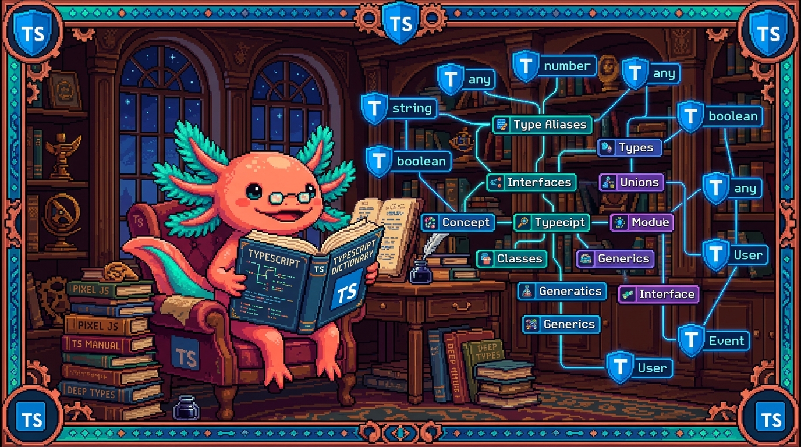

# Capitulo 15 — Glosario de TypeScript y mapa

<p align="center">
  
</p>


> Hola otra vez, soy **Bit**, tu ajolote programador favorito. Llegamos al final del Modulo 05 y, antes de saltar a React, quiero que tengamos un **diccionario de bolsillo**: todas las palabras raras que aprendimos, ordenadas alfabeticamente, cada una explicada en una o dos lineas, con un ejemplo de codigo de verdad sacado de **RachaSimple** o de **Faro**. Si en algun capitulo te perdiste con un termino, este es el lugar para volver. Recuerda la idea madre de todo el modulo: **TypeScript es JavaScript con tipos**. Nada que aprendiste en el Modulo 03 se borro; solo le pusimos etiquetas para que la computadora nos avise cuando metemos la pata. Vamos despacio, sin prisa, que para eso son los ajolotes.

---

## 1. Como usar este glosario

Este capitulo no es para leerlo de corrido y memorizar (aunque puedes). Es un **mapa para volver**. Cada termino vive en su propio recuadro azul con tres partes: que significa en palabras simples, para que sirve, y donde aparece en un repo real. Si ves una palabra que no recuerdas mientras programas, busca aqui su letra y listo.

Los repos que citamos en los ejemplos son reales y los hemos visto a lo largo del modulo:

- **RachaSimple** — app de habitos en **React 18 + TypeScript + Vite + Tailwind + Supabase + TanStack Query**. De aqui salen casi todos los ejemplos de tipos de datos y hooks tipados.
- **Faro/Organizer** — organizador de proyectos en **Next.js 15 + React 19 + TypeScript + Supabase + OpenAI**. De aqui salen los tipos del dominio (proyectos, fuentes, snapshots).

> ### 💡 Tip
> Otros repos del manual (**tunal-digital** en HTML/CSS/JS vanilla, **PolyPaw** en Python/Flet/JSON, **polypaw-nas** en Ubuntu/Samba) **no usan TypeScript**. Por eso aqui solo aparecen RachaSimple y Faro: son los unicos donde tiene sentido buscar archivos `.ts` y `.tsx`.

---

## 2. Glosario alfabetico

Aqui esta el corazon del capitulo. Cada termino tecnico tiene su recuadro. Nada queda sin explicar.

### A

> ### 🟦 ¿Que significa? — *Anotacion (de tipo)*
> Es escribir, despues de los dos puntos, **que tipo** tiene una variable, parametro o resultado: `nombre: string`. Sirve para decirle a TypeScript lo que esperas, y que te corrija si te equivocas. En RachaSimple, cada campo de `UserProfile` lleva su anotacion: `referral_code: string | null`.

> ### 🟦 ¿Que significa? — *`as` (asercion de tipo)*
> Es una forma de decirle a TypeScript "confia en mi, esto es de este tipo", aunque el no lo pueda comprobar solo. Sirve para casos donde tu sabes mas que el compilador. En RachaSimple aparece como `const KEY = ['habits'] as const`, que congela el arreglo para que sea un tipo exacto y no un `string[]` cualquiera.

> ### ⚠️ Cuidado
> `as` no convierte nada en tiempo de ejecucion: solo silencia al compilador. Si mientes (`valor as Habit` cuando no lo es), el error explotara mas tarde y sera mas dificil de encontrar. Usalo poco y con razon.

### C

> ### 🟦 ¿Que significa? — *Compilador (`tsc`)*
> Es el programa que lee tu TypeScript, revisa todos los tipos y lo traduce a JavaScript normal que el navegador entiende. Sirve para atrapar errores **antes** de ejecutar. En RachaSimple el `build` lo invoca: `"build": "tsc -b && vite build"`.

> ### 🟦 ¿Que significa? — *Restriccion (constraint) de un generico*
> Es poner un limite a un tipo generico con `extends`, para exigir que cumpla cierta forma. Sirve para que el generico no sea "cualquier cosa" sino "cualquier cosa que al menos tenga esto". Por ejemplo `function primero<T extends { id: string }>(lista: T[])` exige que cada elemento tenga `id`.

### D

> ### 🟦 ¿Que significa? — *`.d.ts` (archivo de declaracion)*
> Es un archivo que **solo describe tipos**, sin codigo que se ejecute. Sirve para decirle a TypeScript que forma tienen cosas que vienen de fuera (librerias, variables de entorno). RachaSimple tiene `src/vite-env.d.ts`, donde Vite declara los tipos de `import.meta.env`.

### E

> ### 🟦 ¿Que significa? — *`extends`*
> Palabra clave con dos usos: en interfaces, para **heredar** campos de otra; en genericos, para **restringir** un tipo. En Faro, `interface ProjectWithSources extends Project` significa "tiene todo lo de `Project` y ademas lo suyo".

### G

> ### 🟦 ¿Que significa? — *Generico*
> Es un tipo "con un hueco" que se rellena al usarlo, escrito entre `<>`. Sirve para escribir codigo reutilizable que funciona con muchos tipos sin perder seguridad. `Array<string>` es un generico: la caja `Array` rellena con `string`. TanStack Query, en RachaSimple, devuelve `UseQueryResult<Habit[]>` para que sepas exactamente que trae.

### I

> ### 🟦 ¿Que significa? — *Inferencia (de tipos)*
> Es cuando TypeScript **adivina solo** el tipo sin que lo escribas, mirando el valor. Sirve para escribir menos y mantener la seguridad. En `const KEY = ['habits']`, TypeScript infiere que `KEY` es `string[]` sin que digas nada.

> ### 💡 Tip
> Buena regla de principiante: **deja que infiera lo obvio** (variables con valor claro) y **anota lo importante** (parametros de funciones y resultados de API). Asi el codigo queda limpio pero protegido en las fronteras.

> ### 🟦 ¿Que significa? — *`import type`*
> Es una importacion que trae **solo un tipo**, no codigo que se ejecute. Sirve para que el compilador sepa que esa importacion desaparece al traducir a JavaScript. En RachaSimple es muy comun: `import type { Habit, NewHabit } from '@/types/database'`.

> ### 🟦 ¿Que significa? — *Interface*
> Es una forma de describir la **forma de un objeto**: que campos tiene y de que tipo. Sirve para dar nombre a una estructura y reutilizarla. En Faro, `interface Project` describe un proyecto completo: `id`, `name`, `phase`, `progress_pct`, etc.

```typescript
// Faro · src/lib/types.ts
export interface RoadmapStep {
  title: string;
  done: boolean;
}
```

### K

> ### 🟦 ¿Que significa? — *`keyof`*
> Es un operador que toma un tipo objeto y te da la **union de sus nombres de campo** como tipo. Sirve para escribir funciones que reciben "alguna clave valida de este objeto" y no cualquier texto. Si tienes `interface Project`, entonces `keyof Project` es `"id" | "name" | "phase" | ...`.

### L

> ### 🟦 ¿Que significa? — *Tipo literal*
> Es un tipo que es **un valor exacto**, no toda una categoria: no `string` sino `"free"`. Sirve para limitar las opciones validas. En RachaSimple, `UserPlan` solo puede ser `'free'` o `'pro'`, no cualquier texto.

```typescript
// RachaSimple · src/types/database.ts
export type UserPlan = 'free' | 'pro';
export type CheckinStatus = 'completed' | 'minimum' | 'recovery' | 'not_done';
```

### M

> ### 🟦 ¿Que significa? — *Modulo*
> En TypeScript, cada archivo `.ts` que usa `import` o `export` es un modulo: una cajita con sus propias cosas. Sirve para organizar y compartir solo lo necesario. `src/types/database.ts` de RachaSimple es un modulo que exporta tipos para todo el proyecto.

### N

> ### 🟦 ¿Que significa? — *Narrowing (estrechamiento)*
> Es cuando TypeScript **reduce** un tipo amplio a uno mas preciso dentro de un `if`. Sirve para trabajar seguro con uniones. Si `id` es `string | undefined`, dentro de `if (id) { ... }` TypeScript ya sabe que ahi `id` es `string`. RachaSimple lo usa en `useHabit`: chequea `enabled: !!id` y luego usa `id!`.

> ### 🟦 ¿Que significa? — *`null` y `undefined`*
> Son los dos "valores vacios" de JavaScript. Con `strict` activado, TypeScript te obliga a tener en cuenta que algo puede estar vacio. En Faro, `description: string | null` avisa: "el texto puede no existir, contempla ese caso".

### O

> ### 🟦 ¿Que significa? — *`Omit<T, K>`*
> Es un tipo utilitario que toma un tipo `T` y te da una copia **sin** los campos `K`. Sirve para reutilizar un tipo quitando lo que sobra (por ejemplo, quitar `id` para un objeto que aun no se guardo). Es el primo opuesto de `Pick`.

> ### 🟦 ¿Que significa? — *`as const` (asercion const)*
> Es un `as` especial que congela un valor para que su tipo sea lo mas exacto posible y de solo lectura. RachaSimple lo usa en `const KEY = ['habits'] as const`, asi la clave de cache es un tipo fijo y no un arreglo modificable.

### P

> ### 🟦 ¿Que significa? — *`Partial<T>`*
> Es un tipo utilitario que toma `T` y hace **todos sus campos opcionales**. Sirve para actualizaciones, donde solo mandas lo que cambia. RachaSimple lo usa para editar habitos: `changes: Partial<Habit>` significa "puedes mandar uno, varios o ningun campo de `Habit`".

```typescript
// RachaSimple · src/hooks/useHabits.ts
mutationFn: ({ id, changes }: { id: string; changes: Partial<Habit> }) =>
  habitsRepo.update(id, changes),
```

> ### 🟦 ¿Que significa? — *`Pick<T, K>`*
> Es un tipo utilitario que toma `T` y te da una copia con **solo** los campos `K`. Sirve para construir un tipo nuevo a partir de unos pocos campos de otro. RachaSimple lo usa para definir lo minimo que necesita un habito nuevo.

```typescript
// RachaSimple · src/types/database.ts
export type NewHabit = Pick<
  Habit,
  'name' | 'daily_goal' | 'minimum_version' | 'category' | 'support_tone'
> & { active?: boolean; emoji?: string | null };
```

> ### 🟦 ¿Que significa? — *Props (tipadas)*
> En React, las props son los datos que un componente recibe. Tiparlas es describir, con un `type` o `interface`, que props acepta. Sirve para que TypeScript te avise si olvidas pasar una o la pasas del tipo equivocado. En Faro, los componentes `.tsx` como `phase-progress.tsx` declaran sus props para no recibir basura.

### R

> ### 🟦 ¿Que significa? — *`Record<K, V>`*
> Es un tipo utilitario para un objeto cuyas **claves son de tipo `K` y los valores de tipo `V`**. Sirve para diccionarios. En Faro aparece `Record<string, unknown>` (un objeto con claves de texto y valores desconocidos) y `Record<Weekday, DayConfig>` (un dia de la semana mapeado a su configuracion).

### S

> ### 🟦 ¿Que significa? — *`strict` (modo estricto)*
> Es una opcion del `tsconfig.json` que enciende todas las revisiones serias de TypeScript de golpe (entre ellas, vigilar los `null`). Sirve para que el lenguaje te proteja de verdad. Tanto RachaSimple como Faro tienen `"strict": true`. RachaSimple suma `"noUncheckedIndexedAccess": true`, aun mas cuidadoso.

> ### ⚠️ Cuidado
> Empezar un proyecto sin `strict` y activarlo despues suele soltar decenas de errores de golpe. Mejor nacer con `strict: true` desde el primer dia, como hicieron estos dos repos. Duele menos.

### T

> ### 🟦 ¿Que significa? — *Tipo*
> Es la **categoria** de un valor: que clase de dato es y que se puede hacer con el (`string`, `number`, `boolean`, un objeto, una funcion). Es el concepto base de todo el modulo. JavaScript ya tenia tipos por dentro; TypeScript solo los hace visibles y revisables.

> ### 🟦 ¿Que significa? — *`type` (alias de tipo)*
> Es una palabra clave para **ponerle nombre a un tipo**, sea objeto, union o lo que sea. Sirve para no repetir y para dar significado. RachaSimple define `type SupportTone = 'gentle' | 'practical' | 'encouraging' | 'direct'` y luego lo usa por nombre en todos lados.

> ### 💡 Tip
> ¿`type` o `interface`? Para la forma de un objeto, ambos sirven. Regla simple: usa `interface` para objetos que podrian crecer o heredar, y `type` para uniones, literales y combinaciones. Faro usa `interface Project` (objeto) y `type ProjectPhase` (union). Aprende imitando esa eleccion.

> ### 🟦 ¿Que significa? — *`tsconfig.json`*
> Es el archivo de configuracion que le dice al compilador como comportarse: que tan estricto ser, a que version de JavaScript traducir, donde buscar archivos. Sirve para que todo el equipo comparta las mismas reglas. Cada proyecto TypeScript tiene el suyo; RachaSimple y Faro incluidos.

### U

> ### 🟦 ¿Que significa? — *Union (tipo union)*
> Es un tipo que puede ser **una cosa u otra**, escrito con la barra `|`. Sirve para valores con varias formas posibles. En Faro, `ProjectPhase` es la union de cinco fases; un snapshot puede ser `GithubSnapshot | Record<string, unknown>`.

```typescript
// Faro · src/lib/types.ts
export type ProjectPhase =
  | "idea"
  | "en_progreso"
  | "en_pausa"
  | "bloqueado"
  | "terminado";
```

> ### 🟦 ¿Que significa? — *`unknown`*
> Es el tipo "no se que es esto todavia". Sirve para datos que llegan de fuera (una API, un JSON) y que debes **revisar antes de usar**. Es el primo seguro de `any`: con `unknown`, TypeScript te obliga a comprobar el tipo antes de tocarlo. Faro lo usa en `Record<string, unknown>` para datos de snapshot aun sin validar.

> ### ⚠️ Cuidado
> No confundas `unknown` con `any`. `any` apaga todas las revisiones (peligroso); `unknown` las mantiene encendidas y te exige verificar primero. Cuando dudes, prefiere `unknown`.

> ### 🟦 ¿Que significa? — *Tipo utilitario (utility type)*
> Son tipos que ya vienen con TypeScript para **transformar otros tipos**: `Partial`, `Pick`, `Omit`, `Record`, `Required`, `Readonly`. Sirven para no escribir tipos repetidos a mano. RachaSimple los combina sin miedo: `Pick<...> & Partial<Pick<...>>` para definir cada tipo "Nuevo".

```typescript
// RachaSimple · src/types/database.ts
export type NewFeedback = Pick<Feedback, 'message'> &
  Partial<Pick<Feedback, 'mood' | 'contact_email'>>;
```

### V

> ### 🟦 ¿Que significa? — *Variable de entorno (tipada)*
> Son valores secretos o de configuracion que viven fuera del codigo (claves, URLs). Tiparlas (en un `.d.ts`) ayuda a que TypeScript sepa cuales existen. RachaSimple lo prepara en `src/vite-env.d.ts`. Recuerda la regla de Faro: los secretos van solo en el servidor, nunca en el cliente.

---

## 3. Mapa mental de TypeScript

Una imagen vale mas que mil definiciones. Aqui esta como se conecta todo lo que aprendiste, en forma de arbol. Lee desde la raiz hacia las ramas.

```text
                         TYPESCRIPT
                  (JavaScript + tipos)
                            |
   ┌────────────┬───────────┼────────────┬──────────────┐
   |            |           |            |              |
 TIPOS       FORMAS      COMBINAR     SEGURIDAD       HERRAMIENTAS
   |            |           |            |              |
 string      interface   union (|)    strict        tsconfig.json
 number      type        literal      null/undefined compilador (tsc)
 boolean     props       narrowing    unknown        .d.ts
 array       (objetos)   keyof        as / as const  import type
   |            |           |            |              |
   └── INFERENCIA: TS adivina solo lo obvio ──────────┘
                            |
                  GENERICOS  <T>
                  (tipos con hueco)
                            |
              ┌─────────────┴─────────────┐
        restriccion (extends)      utilitarios
                                Partial · Pick · Omit · Record
```

> ### 🔎 En tu codigo
> Mira cualquier archivo de RachaSimple o Faro y veras estas ramas mezcladas en una sola linea. Por ejemplo, `changes: Partial<Habit>` junta **utilitario** (`Partial`), **generico** (los `<>`) e **interface/objeto** (`Habit`). No son temas separados: son piezas de un mismo lego.

---

## 4. Las cuatro ideas que de verdad importan

Si olvidas todo lo demas, quedate con esto, dice Bit moviendo sus branquias:

1. **TypeScript es JavaScript con etiquetas.** El codigo corre igual; los tipos solo viven mientras programas y desaparecen al traducir.
2. **Los tipos describen la forma de tus datos.** `interface Project`, `type UserPlan`: son fotos de como lucen tus datos para que la computadora vigile que no se deformen.
3. **Las fronteras necesitan cuidado.** Donde entran datos de fuera (API, formularios, env), ahi anota bien y usa `unknown` + revision. Adentro, deja que la inferencia trabaje.
4. **`strict: true` es tu amigo gruñon.** Te molesta hoy para que no llores manana con un `undefined` en produccion.

---

## ✅ Checklist — ¿ya domino esto?

- [ ] Puedo explicar con mis palabras la diferencia entre **tipo**, **anotacion** e **inferencia**.
- [ ] Se cuando usar `type` y cuando `interface` (y por que da casi igual para objetos).
- [ ] Entiendo que es una **union** (`|`) y un **tipo literal**, y reconozco ambos en `ProjectPhase`.
- [ ] Se que hace el **narrowing** dentro de un `if` y por que TypeScript "se vuelve mas listo" ahi.
- [ ] Puedo leer un **generico** como `UseQueryResult<Habit[]>` y decir que tipo lleva dentro.
- [ ] Reconozco los **utilitarios** `Partial`, `Pick`, `Omit` y `Record` cuando aparecen.
- [ ] Se para que sirve `keyof`, `as`, `as const` y `unknown`, y por que `unknown` es mas seguro que `any`.
- [ ] Entiendo que hace `import type` y por que se usa tanto en los hooks de RachaSimple.
- [ ] Se que es `strict` en el `tsconfig.json` y por que ambos repos lo tienen encendido.
- [ ] Se que es un archivo `.d.ts` y que ahi viven declaraciones de tipos sin codigo ejecutable.

---

## 🧪 Ejercicios

No son ejercicios de programar funciones nuevas, sino de **repasar y reconocer**. Asi cerramos el modulo afianzando el vocabulario. Los marcados con 💻 piden abrir el editor.

1. **Diccionario sin mirar.** Tapa este capitulo y escribe en una hoja la definicion de estos cinco terminos en una linea cada uno: *inferencia*, *union*, *narrowing*, *generico*, *utilitario*. Luego destapa y compara. ¿Cuales se te resistieron?

2. **Caza de literales.** Sin abrir el editor, lista cuatro tipos literales que viste en RachaSimple (pista: planes, tonos, estados de check-in, temas). ¿Por que crees que el autor uso literales en vez de `string` suelto?

3. 💻 **Safari de tipos.** Abre `RachaSimple/src/types/database.ts`. Encuentra y senala una **interface**, un **alias `type`**, una **union literal** y un uso de **`Pick`**. Anota la linea de cada uno.

4. 💻 **El detective del `strict`.** Abre `RachaSimple/tsconfig.json` y `Organizer/tsconfig.json`. Confirma que ambos tienen `"strict": true`. Luego busca en RachaSimple la opcion extra `noUncheckedIndexedAccess` y, con tus palabras, escribe que crees que protege.

5. 💻 **Lee un hook tipado.** Abre `RachaSimple/src/hooks/useHabits.ts`. Encuentra la linea `import type { Habit, NewHabit }`. ¿Por que `import type` y no un `import` normal? Luego ubica el `Partial<Habit>` y explica que permite hacer.

6. **Dibuja tu mapa.** Cierra este capitulo y dibuja de memoria el mapa mental de la seccion 3, aunque sea torcido. El objetivo no es que quede bonito, sino que las ramas (tipos, formas, combinar, seguridad, herramientas) te salgan solas.

---

## 5. Como sigue: rumbo al Modulo 06 (React)

Lo lograste, dice Bit dando una vuelta de campana en el agua. Terminaste TypeScript. Pero fijate en algo: casi todos los ejemplos venian de **RachaSimple** y **Faro**, que son apps de **React**. No fue casualidad. TypeScript brilla de verdad cuando tipas **componentes y props**.

En el **Modulo 06** vamos a juntar todo:

- Construiremos **componentes** que reciben **props tipadas** (te acordaras de `Project` y de los `.tsx` de Faro).
- Usaremos **hooks** como `useState` y `useQuery`, que son **genericos** por dentro (ya viste `UseQueryResult<Habit[]>`).
- Modelaremos los datos de la pantalla con las mismas **interfaces** y **uniones** de este modulo.

O sea: no empezamos de cero. **Cada termino de este glosario reaparece en React**, ahora con botones y pantallas. Guarda este capitulo a mano: sera tu diccionario cuando una prop te de error en rojo.

> ### 💡 Tip
> Antes de pasar al Modulo 06, vuelve a leer una vez la seccion 4 ("Las cuatro ideas que de verdad importan"). Si esas cuatro te quedan claras, estas mas que listo para React. Nos vemos alla. — Bit 🦎
