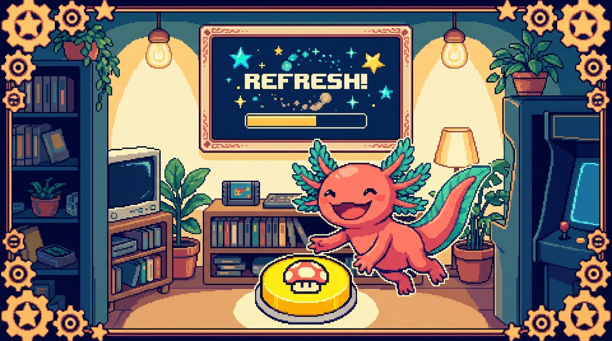

# Capítulo 04 — Estado con useState

> Las props son datos que **llegan de afuera** y se quedan quietos. Pero una app viva necesita
> datos que **cambian con el tiempo**: un contador que sube, un campo que el usuario va llenando,
> un menú que se abre y se cierra. A eso lo llamamos **estado**, y se maneja con tu primer
> **hook**: `useState`. Es justo lo que hace que React sea "reactivo".

<p align="center">
  
</p>

---

## 1. Qué es el estado

> ### 🟦 ¿Qué significa? — *Estado (state)*
> El **estado** son los **datos que cambian con el tiempo** dentro de un componente y que, al
> cambiar, hacen que la interfaz se **vuelva a dibujar** para reflejarlos. Si las props son "lo
> que me dan desde afuera y no toco", el estado es "lo mío, lo que evoluciona aquí dentro".
> Por ejemplo: el número de un contador, si un menú está abierto o cerrado, o lo que hay escrito
> en un input.

> ### 🟦 ¿Qué significa? — *Re-render (volver a renderizar)*
> **Renderizar** es "dibujar" el componente en pantalla. Cuando el estado cambia, React
> **vuelve a ejecutar** la función del componente y actualiza solo lo que cambió. A eso le
> decimos **re-render**. Es la misma magia declarativa del Módulo 06-cap.01: tú cambias el dato y
> React redibuja; no tocas el DOM a mano.

---

## 2. `useState`: tu primer hook

> ### 🟦 ¿Qué significa? — *Hook*
> Un **hook** ("gancho") es una **función especial de React** cuyo nombre empieza por `use...` y
> que le da "superpoderes" a un componente: recordar datos, ejecutar efectos, y más. El primero y
> el que más vas a usar es `useState`.

> ### 🟦 ¿Qué significa? — *`useState`*
> `useState` crea una variable de **estado** dentro de un componente. Te devuelve **dos cosas** en
> un array: el **valor actual** y una **función para cambiarlo**.
> ```tsx
> import { useState } from "react";
>
> function Contador() {
>   const [cuenta, setCuenta] = useState(0);   // valor inicial: 0
>
>   return (
>     <button onClick={() => setCuenta(cuenta + 1)}>
>       Has hecho clic {cuenta} veces
>     </button>
>   );
> }
> ```
> - `cuenta` → el valor actual del estado (arranca en `0`).
> - `setCuenta` → la función que lo cambia. **Siempre** se usa esta función para cambiarlo, nunca
>   `cuenta = cuenta + 1` directamente.
> - `useState(0)` → ese `0` es el valor inicial.
> Cada vez que pulsas el botón, `setCuenta` actualiza el estado, React **re-renderiza** y el
> número en pantalla sube. Todo sin tocar el DOM. Eso es React.

> ### 🟦 ¿Qué significa? — *La desestructuración `[valor, setValor]`*
> `const [cuenta, setCuenta] = useState(0)` usa **desestructuración de array**: saca dos cosas de
> la lista que devuelve `useState`, una por posición. Hay una convención cómoda: la función se
> llama igual que el estado pero con `set` delante (`cuenta` → `setCuenta`).

---

## 3. La regla de oro: nunca cambies el estado directamente

> ### ⚠️ Cuidado — Usa SIEMPRE la función `set...`
> ```tsx
> // ❌ MAL: React no se entera, la pantalla no se actualiza
> cuenta = cuenta + 1;
>
> // ✅ BIEN: avisa a React, que re-renderiza
> setCuenta(cuenta + 1);
> ```
> ¿Por qué? Porque la función `set...` es la que le **avisa a React** de que algo cambió, y por eso
> redibuja. Si modificas la variable a mano, React ni se entera y la pantalla se queda igual. Este
> es el error número uno cuando uno empieza con estado.

> ### 💡 Tip — Estado basado en el anterior
> Cuando el nuevo valor depende del que ya tienes, pásale a `set...` una función:
> ```tsx
> setCuenta((anterior) => anterior + 1);
> ```
> Es la forma segura cuando haces varios cambios seguidos. Por ahora solo apréndela de vista; la
> vas a ver muchísimo.

---

## 4. Eventos en React

Para que el estado cambie, casi siempre respondes a un **evento** del usuario: un clic, una tecla.
Es parecido al `addEventListener` del Módulo 03, pero más directo y cómodo.

> ### 🟦 ¿Qué significa? — *Manejadores de eventos en JSX*
> En JSX, los eventos se ponen como props que empiezan por `on...` y reciben una función:
> ```tsx
> <button onClick={() => setAbierto(!abierto)}>Abrir/cerrar</button>
> <input onChange={(e) => setTexto(e.target.value)} />
> ```
> - `onClick` → al hacer clic.
> - `onChange` → al cambiar un campo, es decir, al escribir. `e.target.value` es lo que el usuario
>   tecleó.
> Fíjate en un detalle: le pasas **una función** (`() => ...`), no la ejecutas ahí mismo. Y va en
> camel-case: `onClick`, no `onclick`.

---

## 5. Un formulario controlado (caso real)

Ahora juntemos estado y eventos. Así se maneja un campo de texto en React:

```tsx
function Saludo() {
  const [nombre, setNombre] = useState("");

  return (
    <div>
      <input
        value={nombre}
        onChange={(e) => setNombre(e.target.value)}
        placeholder="Tu nombre"
      />
      <p>Hola, {nombre || "desconocido"} 👋</p>
    </div>
  );
}
```

> ### 🟦 ¿Qué significa? — *Componente/input controlado*
> Un **input controlado** es aquel cuyo valor **lo gobierna el estado de React** (`value={nombre}`),
> y donde cada tecla actualiza ese estado (`onChange`). Así, la "fuente de la verdad" de lo que hay
> en el campo es tu estado, no el DOM. Es como RachaSimple maneja sus formularios (crear hábito,
> check-in). El `<p>` de abajo se actualiza **en vivo** mientras escribes: cambia el estado, viene
> el re-render.

> ### 🔎 En tu código
> Cada vez que en RachaSimple escribes el nombre de un hábito o eliges su color, hay un `useState`
> detrás guardando ese valor y volviendo a renderizar la vista previa. Ya conoces el motor que lo
> mueve.

---

## ✅ Checklist — ¿ya domino esto?

- [ ] Distingo **estado** (cambia adentro) de **props** (llegan de afuera).
- [ ] Sé qué es un **re-render** y por qué React lo hace al cambiar el estado.
- [ ] Uso **`useState`**: `const [valor, setValor] = useState(inicial)`.
- [ ] **Nunca** cambio el estado directo; siempre con la función `set...`.
- [ ] Manejo **eventos** con `onClick`, `onChange` y `e.target.value`.
- [ ] Entiendo qué es un **input controlado**.

---

## 🧪 Ejercicios

1. **Lee el contador.** En `const [cuenta, setCuenta] = useState(0)`, ¿qué es `cuenta`, qué es
   `setCuenta` y qué es el `0`?
2. **Encuentra el error.** ¿Por qué la pantalla no cambia? `<button onClick={() => { abierto =
   !abierto; }}>`
3. **Interruptor.** Escribe un componente con un estado booleano `encendido` y un botón que lo
   alterne (de `true` a `false`), mostrando "💡 Encendido" o "🌑 Apagado".
4. **Input controlado.** Escribe un componente con un `<input>` controlado y un `<p>` que muestre
   en vivo cuántos caracteres llevas escritos (pista: `texto.length`).
5. 💻 **Contador real.** Cuando tengas la computadora y un proyecto React, crea el `Contador` de
   la sección 2 y compruébalo: cada clic sube el número sin recargar la página.

➡️ Siguiente: **[Capítulo 05 — Hooks y efectos](05-hooks-y-efectos.md)**.
