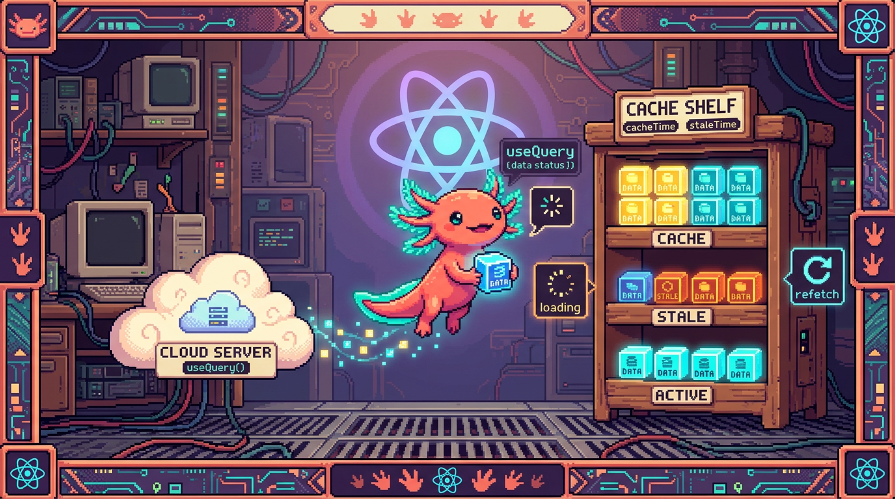

# Capítulo 11 — Datos del servidor con TanStack Query

<p align="center">
  
</p>


> Hasta ahora tus datos vivían dentro del navegador: un `useState` con un contador, una lista
> de tareas que escribías a mano. En este capítulo das un paso más: vas a aprender a traer
> datos que viven **en otro sitio** (un servidor, una base de datos) y a mostrarlos en pantalla
> sin perder la cabeza por el camino. La herramienta para eso se llama **TanStack Query**, y es
> exactamente la que usa RachaSimple con Supabase. Lo veremos término a término, con calma. Bit,
> nuestro ajolote, ya tiene la red lista para pescar datos en el río del servidor.

---

## 1. El problema: el estado del servidor no es como el estado local

En el Capítulo 04 aprendiste `useState`. Allí el dato es **tuyo**: lo creas, lo cambias, lo
borras. Si pones el contador en `5`, vale `5` hasta que tú decidas otra cosa. Nadie más lo toca.

Los datos de RachaSimple no funcionan así. La lista de hábitos del usuario vive en **Supabase**,
una base de datos que está en internet. Ese dato no es solo tuyo: puede cambiar desde otro
dispositivo, puede tardar en llegar, puede caerse la conexión, puede quedar **viejo** mientras lo
miras. Es un tipo de estado distinto, y tiene su propio nombre.

> ### 🟦 ¿Qué significa? — *Estado del servidor (server state)*
> Es la información que **no vive en tu navegador**, sino en un servidor o base de datos remota
> (como Supabase). Sirve para guardar datos que deben sobrevivir aunque cierres la página y que
> pueden compartirse entre dispositivos. En RachaSimple, los hábitos y los registros diarios
> (check-ins) son estado del servidor: están en Supabase, no en la memoria del navegador.

Compáralo con lo que ya conoces.

> ### 🟦 ¿Qué significa? — *Estado local (local state)*
> Es la información que vive **dentro de tu componente**, en la memoria del navegador, y
> desaparece al recargar la página. Sirve para cosas pasajeras de la interfaz: si un menú está
> abierto, qué texto hay en un input, qué pestaña está activa. Lo manejas con `useState`. En
> RachaSimple, "¿está abierto el modal para crear un hábito?" es estado local.

La diferencia clave está aquí: el estado local **lo controlas tú**; el del servidor solo lo
**copias** para mirarlo, y esa copia se te puede quedar atrás. Manejar todo eso a mano —pedir,
esperar, guardar, refrescar, atender los errores— es un montón de trabajo que se repite una y otra
vez. De ahí que exista una herramienta dedicada a ello.

> ### 🟦 ¿Qué significa? — *TanStack Query*
> Es una **librería** (código que instalas y reutilizas) especializada en manejar estado del
> servidor en React. Sirve para pedir datos, guardarlos en una caché, saber si están cargando o si
> fallaron, y refrescarlos cuando hace falta, todo sin que escribas esa fontanería a mano. Antes se
> llamaba "React Query"; hoy su nombre oficial es TanStack Query. RachaSimple la usa para hablar con
> Supabase, y Faro también la incluye en su stack.

> ### 💡 Tip
> No mezcles los dos mundos. Un error de principiante es guardar la lista de hábitos en un
> `useState` y actualizarla a mano. Si el dato viene del servidor, deja que TanStack Query lo
> maneje; reserva `useState` para lo que es puramente de la interfaz.

---

## 2. La caché: la libreta donde se guardan los datos

Antes de escribir código conviene entender una palabra que va a aparecer durante todo el capítulo.

> ### 🟦 ¿Qué significa? — *Caché (cache)*
> Es una **memoria temporal** donde TanStack Query guarda los datos que ya pidió, para no tener que
> pedirlos otra vez si los necesitas pronto. Sirve para que la app vaya rápida: si dos pantallas de
> RachaSimple necesitan la lista de hábitos, se pide **una vez** y ambas leen la misma copia
> guardada. Piensa en la caché como una libreta donde apuntas lo que ya averiguaste para no volver
> a preguntar.

Para que esa libreta funcione hace falta una pieza que la administre y que esté disponible en toda
la app.

> ### 🟦 ¿Qué significa? — *QueryClient*
> Es el **objeto central** de TanStack Query: la libreta de la caché en persona. Guarda todos los
> datos, sabe cuáles están viejos y coordina las peticiones. Sirve como cerebro único para toda la
> app. Se crea **una sola vez** al arrancar el programa.

¿Y cómo hacen todos los componentes para usar esa misma libreta? Con un envoltorio.

> ### 🟦 ¿Qué significa? — *QueryClientProvider*
> Es un **componente envoltorio** que pones lo más arriba posible de tu app y que reparte el
> `QueryClient` a todos los componentes de dentro. Sirve para que cualquier componente, por hondo
> que esté, pueda usar la misma caché. Es el mismo patrón "provider" que viste con el contexto:
> envuelves la app una vez y todo lo de dentro queda conectado.

Así se ve esta configuración en la raíz de una app como RachaSimple:

```tsx
import { QueryClient, QueryClientProvider } from "@tanstack/react-query";

// 1. Creamos el cerebro/libreta una sola vez.
const queryClient = new QueryClient();

function App() {
  return (
    // 2. Envolvemos toda la app para repartir esa libreta.
    <QueryClientProvider client={queryClient}>
      <Rutas />
    </QueryClientProvider>
  );
}
```

> ### 🔎 En tu código
> En RachaSimple este montaje suele estar en `src/App.tsx` o en `src/main.tsx`. Búscalo: es la
> primera vez en toda la app que aparece `QueryClientProvider`, y casi siempre envuelve también al
> provider del router y al de la sesión de Supabase. Si no existiera, ningún `useQuery`
> funcionaría: daría un error diciendo que no encuentra un `QueryClient`.

---

## 3. Leer datos: `useQuery`

Ahora sí, el hook estrella para **traer** datos.

> ### 🟦 ¿Qué significa? — *useQuery*
> Es el **hook** de TanStack Query que sirve para **leer** (traer) datos del servidor. Tú le dices
> qué datos quieres y cómo pedirlos, y él se encarga de pedirlos, guardarlos en la caché y avisarte
> mientras carga o si falla. En RachaSimple, el hook que trae la lista de hábitos usa `useQuery` por
> dentro.

A `useQuery` tienes que darle dos cosas, y cada una tiene nombre propio. La primera es la etiqueta
del dato.

> ### 🟦 ¿Qué significa? — *queryKey*
> Es la **etiqueta única** que le pones a un dato en la caché, escrita como un arreglo (por ejemplo
> `["habits"]`). Sirve para que TanStack Query sepa **quién es quién** en su libreta: dos
> componentes que usen la misma `queryKey` comparten el mismo dato guardado. En RachaSimple, la
> lista de hábitos podría tener la `queryKey` `["habits"]` y los check-ins de un día
> `["checkins", fecha]`.

La segunda es la función que de verdad va a buscar los datos.

> ### 🟦 ¿Qué significa? — *queryFn (query function)*
> Es la **función que trae los datos**. TanStack Query la ejecuta cuando hace falta refrescar. Debe
> devolver una promesa (algo que tarda y luego se resuelve, como aprendiste en el módulo de
> JavaScript). Sirve para encerrar la llamada real al servidor. En RachaSimple, la `queryFn` es la
> que llama a Supabase para pedir las filas de la tabla de hábitos.

Juntemos las dos piezas en un hook real de RachaSimple:

```tsx
import { useQuery } from "@tanstack/react-query";
import { supabase } from "@/lib/supabase";

export function useHabits() {
  return useQuery({
    queryKey: ["habits"], // la etiqueta del dato en la caché
    queryFn: async () => {
      // la función que de verdad pide los datos a Supabase
      const { data, error } = await supabase
        .from("habits")
        .select("*")
        .order("created_at", { ascending: true });

      if (error) throw error; // si Supabase falla, lanzamos el error
      return data;            // si todo va bien, devolvemos las filas
    },
  });
}
```

Fíjate en cómo responde Supabase: te entrega `data` y `error` en el mismo objeto. Si hay `error`, lo
**lanzamos** con `throw` para que TanStack Query lo trate como un fallo; si no, devolvemos `data`, y
eso es lo que acabará llegando a tu componente.

> ### ⚠️ Cuidado — La `queryFn` debe lanzar el error
> Supabase no "explota" por su cuenta: te devuelve el error metido dentro de un objeto. Si olvidas el
> `if (error) throw error`, TanStack Query creerá que todo salió bien y `data` valdrá `null`. El
> `throw` es justo lo que conecta el fallo de Supabase con el manejo de errores de TanStack Query.

> ### 💡 Tip
> La `queryFn` es `async` porque hablar con un servidor **tarda**. El `await` espera a que Supabase
> responda. Si esto te suena borroso, repasa promesas y `async/await` en el módulo 03; aquí son la
> base de todo.

---

## 4. Lo que devuelve `useQuery`: `data`, `loading` y `error`

`useQuery` no te devuelve solo los datos. Devuelve un objeto con varias piezas que describen **en
qué punto** va la petición. Estas tres son las que vas a usar siempre.

> ### 🟦 ¿Qué significa? — *data*
> Es la propiedad donde llegan **los datos ya cargados**. Empieza valiendo `undefined` (todavía no
> hay nada) y, cuando la `queryFn` termina bien, pasa a contener lo que devolviste. En RachaSimple,
> `data` sería el arreglo de hábitos listo para pintar en pantalla.

> ### 🟦 ¿Qué significa? — *isLoading (estado de carga)*
> Es un valor `true`/`false` que vale `true` mientras la **primera** petición está en camino y aún
> no hay datos. Sirve para mostrar un mensaje de "Cargando..." o un esqueleto gris mientras llegan
> los datos. En RachaSimple, mientras `isLoading` es `true`, la pantalla de hábitos muestra un
> spinner en vez de la lista vacía.

> ### 🟦 ¿Qué significa? — *isError y error*
> `isError` es un `true`/`false` que vale `true` si la `queryFn` lanzó un fallo; `error` es el
> objeto con el detalle de ese fallo. Sirven para mostrarle al usuario un mensaje claro cuando algo
> sale mal (sin conexión, permiso denegado, etc.) en lugar de dejar la pantalla en blanco.

Estos tres estados se van turnando: primero cargando, y luego o bien datos o bien error, nunca a la
vez. Tu componente los lee y decide qué pintar en cada caso. A esto se le llama manejar los estados
de la petición:

```tsx
function ListaHabitos() {
  const { data, isLoading, isError, error } = useHabits();

  // 1. Mientras carga, mostramos un aviso.
  if (isLoading) {
    return <p>Cargando hábitos...</p>;
  }

  // 2. Si falló, mostramos el error de forma amable.
  if (isError) {
    return <p>Algo salió mal: {error.message}</p>;
  }

  // 3. Si llegamos aquí, hay datos seguros: los pintamos.
  return (
    <ul>
      {data.map((habito) => (
        <li key={habito.id}>{habito.name}</li>
      ))}
    </ul>
  );
}
```

Ese orden —`isLoading` primero, `isError` después y los datos al final— es un patrón que verás
repetido en RachaSimple y en Faro. Se llama **renderizado por estados**, y te ahorra disgustos.

> ### ⚠️ Cuidado — No leas `data` antes de comprobar la carga
> Si intentas hacer `data.map(...)` mientras la petición aún carga, `data` será `undefined` y la app
> reventará con "cannot read map of undefined". Por eso los `if (isLoading)` e `if (isError)` van
> **antes**: cuando llegas al `return` final, ya tienes la garantía de que `data` existe.

> ### 🔎 En tu código
> En RachaSimple, un componente como `HabitsList.tsx` casi nunca toca Supabase directamente. Llama a
> `useHabits()` (que por dentro usa `useQuery`) y se limita a leer `data`, `isLoading` e `isError`.
> Esa separación —el hook trae, el componente pinta— es exactamente lo que viste con los hooks
> personalizados en el Capítulo 09.

> ### 💡 Tip — `isLoading` vs `isPending` vs `isFetching`
> En versiones recientes de TanStack Query verás también `isPending` (no hay datos todavía) e
> `isFetching` (hay una petición en marcha, aunque ya tengas datos viejos en pantalla). Para empezar,
> quédate con `isLoading` para la primera carga; los otros los entenderás solos cuando los necesites.

---

## 5. Datos viejos: `staleTime` y por qué TanStack refresca solo

Recuerda lo que decíamos: la copia que tienes en la caché se puede quedar **vieja**. TanStack Query
lo sabe y, por defecto, vuelve a pedir los datos en ciertos momentos (por ejemplo, cuando regresas a
la pestaña del navegador). Para hablar de esto necesitamos un término más.

> ### 🟦 ¿Qué significa? — *Dato obsoleto (stale)*
> Un dato es **stale** ("rancio", "viejo") cuando ya pasó suficiente tiempo desde que se pidió como
> para sospechar que en el servidor pudo cambiar. No es que esté mal: es que conviene volver a
> comprobarlo. TanStack Query refresca en segundo plano los datos stale para mantener la pantalla al
> día.

> ### 🟦 ¿Qué significa? — *staleTime*
> Es el **tiempo que un dato se considera fresco** antes de volverse stale, medido en milisegundos.
> Sirve para controlar con qué frecuencia se refresca: un `staleTime` alto = menos peticiones (datos
> que cambian poco); uno bajo o cero = se refresca casi siempre (datos que cambian a cada rato). Se
> configura en el `useQuery` o en el `QueryClient`.

```tsx
useQuery({
  queryKey: ["habits"],
  queryFn: traerHabitos,
  staleTime: 1000 * 60, // un minuto fresco antes de volverse stale
});
```

> ### 💡 Tip
> No te obsesiones con `staleTime` al principio. El valor por defecto funciona bien para casi todo.
> Ajústalo solo cuando notes que la app pide datos demasiado seguido (sube el `staleTime`) o que
> muestra datos viejos demasiado tiempo (bájalo).

---

## 6. Escribir datos: `useMutation`

`useQuery` solo **lee**. Para **cambiar** datos en el servidor —crear un hábito, marcar un check-in,
borrar algo— hace falta otro hook.

> ### 🟦 ¿Qué significa? — *Mutación (mutation)*
> Es cualquier acción que **modifica** datos en el servidor: crear, actualizar o borrar. La palabra
> viene de "mutar", cambiar. A diferencia de una lectura, una mutación tiene efectos: deja el
> servidor distinto de como estaba.

> ### 🟦 ¿Qué significa? — *useMutation*
> Es el **hook** de TanStack Query para hacer mutaciones (crear/editar/borrar). A diferencia de
> `useQuery`, no se dispara solo: lo ejecutas tú cuando ocurre algo, normalmente al pulsar un botón.
> Te da una función `mutate` para disparar la acción y sus propios estados de carga y error. En
> RachaSimple, crear un hábito nuevo o marcar el día como cumplido se hace con `useMutation`.

> ### 🟦 ¿Qué significa? — *mutationFn (mutation function)*
> Es la **función que ejecuta el cambio** en el servidor. Recibe los datos nuevos y los manda a
> Supabase. Es la prima de la `queryFn`, pero en vez de leer, escribe. En RachaSimple, la
> `mutationFn` de crear hábito hace un `insert` en la tabla `habits`.

Veámoslo creando un hábito en RachaSimple:

```tsx
import { useMutation } from "@tanstack/react-query";
import { supabase } from "@/lib/supabase";

function FormularioNuevoHabito() {
  const crearHabito = useMutation({
    // la función que escribe en Supabase
    mutationFn: async (nombre: string) => {
      const { data, error } = await supabase
        .from("habits")
        .insert({ name: nombre })
        .select()
        .single();

      if (error) throw error;
      return data;
    },
  });

  return (
    <button
      disabled={crearHabito.isPending} // se desactiva mientras guarda
      onClick={() => crearHabito.mutate("Beber agua")}
    >
      {crearHabito.isPending ? "Guardando..." : "Crear hábito"}
    </button>
  );
}
```

> ### 🟦 ¿Qué significa? — *mutate*
> Es la **función que dispara** la mutación. La llamas tú —por ejemplo dentro de un `onClick`— y le
> pasas los datos que quieres mandar. En el ejemplo, `crearHabito.mutate("Beber agua")` manda ese
> nombre a la `mutationFn`. Hasta que no llames `mutate`, no pasa nada.

> ### ⚠️ Cuidado — `useMutation` no se ejecuta al renderizar
> `useQuery` pide datos en cuanto el componente aparece. `useMutation`, no: solo deja la herramienta
> preparada. El cambio ocurre cuando **tú** llamas `mutate`. Aquí es fácil tropezar: si esperas que
> el `insert` ocurra solo, nunca va a suceder.

> ### 💡 Tip — Desactiva el botón mientras guarda
> `useMutation` también te da `isPending` (mientras el cambio está en camino). Úsalo para poner
> `disabled` en el botón y evitar que el usuario lo pulse dos veces y cree el hábito duplicado.

---

## 7. El problema después de mutar: la caché quedó vieja

Imagina que acabas de crear "Beber agua" con la mutación. Funcionó: ya está en Supabase. Pero la
lista que ves en pantalla la trajo `useQuery` **antes**, así que sigue mostrando la versión vieja,
sin el hábito nuevo. La caché y el servidor ya no coinciden.

Hay dos formas de arreglarlo, y cada una tiene nombre.

> ### 🟦 ¿Qué significa? — *Invalidar la caché (invalidate)*
> Es **marcar un dato de la caché como viejo** para obligar a TanStack Query a volver a pedirlo. No
> borras nada: solo dices "esto ya no es de fiar, tráelo otra vez". Es la forma más segura de mantener
> la pantalla sincronizada después de una mutación. Se hace con `queryClient.invalidateQueries`.

> ### 🟦 ¿Qué significa? — *invalidateQueries*
> Es el **método del `QueryClient`** que invalida una o varias `queryKey`. Le pasas la etiqueta del
> dato que cambió y él vuelve a ejecutar su `queryFn`, refrescando la pantalla con los datos nuevos.
> En RachaSimple, tras crear un hábito se invalida `["habits"]` para que la lista se recargue ya con
> el hábito nuevo dentro.

Para usarlo necesitas una forma de alcanzar el `QueryClient` desde dentro de un componente.

> ### 🟦 ¿Qué significa? — *useQueryClient*
> Es el **hook** que te entrega el `QueryClient` que repartió el `QueryClientProvider`. Sirve para
> poder invalidar o tocar la caché desde cualquier componente. Lo llamas arriba del componente y
> guardas el resultado en una variable.

Juntándolo todo, así queda el flujo completo de "crear y refrescar" en RachaSimple:

```tsx
import { useMutation, useQueryClient } from "@tanstack/react-query";
import { supabase } from "@/lib/supabase";

function FormularioNuevoHabito() {
  const queryClient = useQueryClient(); // alcanzamos la libreta/caché

  const crearHabito = useMutation({
    mutationFn: async (nombre: string) => {
      const { data, error } = await supabase
        .from("habits")
        .insert({ name: nombre })
        .select()
        .single();
      if (error) throw error;
      return data;
    },
    // cuando la mutación termina bien, refrescamos la lista
    onSuccess: () => {
      queryClient.invalidateQueries({ queryKey: ["habits"] });
    },
  });

  return (
    <button onClick={() => crearHabito.mutate("Beber agua")}>
      Crear hábito
    </button>
  );
}
```

> ### 🟦 ¿Qué significa? — *onSuccess*
> Es una **función que TanStack Query ejecuta solo si la mutación salió bien**. Sirve para hacer
> cosas "después de": cerrar un modal, mostrar un mensaje de éxito o, lo más típico, invalidar la
> caché para refrescar la pantalla. Es el lugar natural para poner el `invalidateQueries`.

La segunda forma de refrescar es pedir los datos otra vez a mano.

> ### 🟦 ¿Qué significa? — *refetch (refrescar)*
> Es **volver a ejecutar la `queryFn` a propósito** para traer datos frescos. `useQuery` te da una
> función `refetch` que puedes llamar, por ejemplo, en un botón de "Actualizar". Mientras
> `invalidateQueries` dice "esto está viejo, encárgate", `refetch` dice "tráelo ahora mismo".

> ### 🔎 En tu código
> Faro es un caso interesante: su filosofía es de **refresco bajo demanda**. El usuario pulsa
> "Analizar proyecto" y ahí se dispara el trabajo, no antes. Ese patrón encaja como anillo al dedo
> con `useMutation` (la acción que el usuario lanza) seguido de `invalidateQueries` o `refetch` para
> mostrar el resultado nuevo. Busca en Faro los botones de análisis: detrás casi siempre hay una
> mutación.

> ### 💡 Tip — Invalidar es casi siempre la respuesta correcta
> Como principiante, después de cualquier mutación que cambie datos, tu reflejo debe ser: "invalida
> la `queryKey` afectada en `onSuccess`". Con eso, el 90% de las veces la pantalla se queda
> sincronizada sin que pienses más.

---

## 8. Juntando el ciclo completo

Con todo lo anterior ya puedes seguir el ciclo de vida del estado del servidor en RachaSimple de
principio a fin:

1. La app arranca y `QueryClientProvider` reparte la caché.
2. La pantalla de hábitos llama `useHabits()`, que por dentro hace `useQuery` con
   `queryKey: ["habits"]`. Mientras llega la respuesta, `isLoading` es `true` y se ve
   "Cargando...".
3. Supabase responde, `data` se llena con los hábitos y se pintan en pantalla. La copia queda
   guardada en la caché bajo la etiqueta `["habits"]`.
4. El usuario crea un hábito nuevo: un `useMutation` ejecuta su `mutationFn` (un `insert` en
   Supabase).
5. En `onSuccess`, `invalidateQueries({ queryKey: ["habits"] })` marca la lista como vieja.
6. TanStack Query vuelve a ejecutar la `queryFn`, trae la lista actualizada y la pantalla se
   refresca con el hábito nuevo. Fin del ciclo.

Ese baile —leer, mostrar estados, mutar, invalidar, refrescar— es el corazón de cualquier app React
que hable con un servidor. El día en que lo veas como algo natural, habrás domado el estado del
servidor. Bit ya recogió su red llena de datos frescos y la pantalla brilla al día.

---

## ✅ Checklist — ¿ya domino esto?

- [ ] Explico con mis palabras la diferencia entre **estado local** y **estado del servidor**.
- [ ] Sé qué es la **caché** y por qué `QueryClientProvider` va arriba de toda la app.
- [ ] Uso `useQuery` con su `queryKey` y su `queryFn` para **leer** datos.
- [ ] Manejo los estados `isLoading`, `isError`/`error` y `data` en el orden correcto.
- [ ] Entiendo por qué hay que comprobar la carga **antes** de leer `data`.
- [ ] Sé que `useMutation` sirve para **escribir** y que no se dispara hasta llamar `mutate`.
- [ ] Después de una mutación, **invalido** la `queryKey` afectada en `onSuccess`.
- [ ] Distingo entre `invalidateQueries` (márcalo viejo) y `refetch` (tráelo ahora).
- [ ] Sé qué significa que un dato esté **stale** y para qué sirve `staleTime`.
- [ ] Reconozco este ciclo dentro de RachaSimple y entiendo el refresco bajo demanda de Faro.

---

## 🧪 Ejercicios

1. **En papel.** Haz dos columnas: "estado local" y "estado del servidor". Clasifica estas
   cosas de RachaSimple: el texto que el usuario escribe en el input de nuevo hábito; la lista
   de hábitos guardada en Supabase; si el menú lateral está abierto; los check-ins de hoy.
   Explica en una frase por qué cada una va donde la pusiste.

2. **En papel.** Dibuja la línea de tiempo de un `useQuery`: marca en qué momento `isLoading`
   es `true`, cuándo se llena `data` y en qué punto podría aparecer un `error`. Indica qué se
   ve en pantalla en cada tramo.

3. 💻 Escribe un hook `useHabits()` con `useQuery` que tenga `queryKey: ["habits"]` y una
   `queryFn` que pida los hábitos a Supabase (puedes simular Supabase con una función que
   devuelva una promesa con datos de prueba). Asegúrate de hacer `if (error) throw error`.

4. 💻 Crea un componente `ListaHabitos` que use ese hook y muestre, en este orden:
   "Cargando..." mientras `isLoading`, un mensaje de error si `isError`, y la lista pintada con
   `data.map(...)` si todo va bien. Comprueba que nunca lees `data` antes de tiempo.

5. 💻 Añade un `useMutation` que cree un hábito nuevo. Pon un botón que llame a `mutate` con un
   nombre, y desactívalo (`disabled`) mientras `isPending`. En `onSuccess`, invalida la
   `queryKey` `["habits"]` con `useQueryClient` y comprueba que la lista se refresca sola.

6. 💻 (Reto) Cambia el `staleTime` del `useQuery` a `0` y a `1000 * 60` (un minuto). Abre y
   cierra la pestaña del navegador y observa en qué casos vuelve a pedir datos. Escribe una
   frase explicando qué notaste y por qué.
