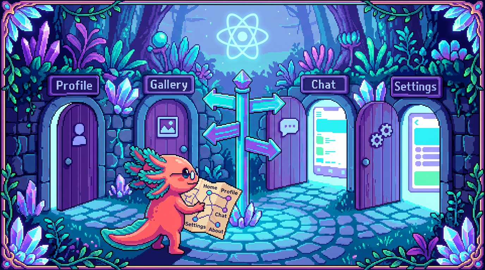

# Capitulo 13 — Rutas y estructura de una app

<p align="center">
  
</p>


> Hasta ahora tus componentes vivian en una sola pantalla: un `App` con su estado, sus listas y sus formularios. Pero una aplicacion de verdad tiene **varias pantallas**: una de inicio, otra de login, otra para ver el detalle de algo. ¿Como pasas de una a otra sin recargar la pagina entera? Eso es el **enrutado** (routing), y es el tema de este capitulo. Bit, nuestro ajolote, ya tiene su mapa en la mano y un ojo cerrado de concentracion: vamos a recorrer las dos formas mas comunes de organizar una app React, usando dos proyectos reales: **RachaSimple** (una app de habitos con Vite + React Router) y **Faro** (un organizador de proyectos con Next.js). Misma idea, dos sabores distintos.

---

## 1. ¿Que problema resuelve el enrutado?

Imagina que entras a una web. Escribes `racha.app/today` y ves tus habitos de hoy. Haces clic en uno y la barra de direcciones cambia a `racha.app/habit/42`, y ahora ves el detalle de ese habito. Vuelves atras con el boton del navegador y regresas a la lista. Todo eso —las URLs distintas, el boton de atras, los enlaces— es trabajo del **enrutado**.

> ### 🟦 ¿Que significa? — *Enrutado (routing)*
> Es el mecanismo que decide **que pantalla mostrar segun la URL** (la direccion que aparece en la barra del navegador). Sirve para que tu app tenga varias "paginas" que el usuario puede visitar, marcar como favoritas y compartir por enlace. En una **SPA** (aplicacion de una sola pagina), el navegador no recarga todo: el enrutado intercambia los componentes en pantalla al vuelo. En RachaSimple lo usa React Router; en Faro lo da Next.js.

> ### 🟦 ¿Que significa? — *URL y ruta (path)*
> La **URL** es la direccion completa (`https://racha.app/habit/42`). La **ruta** o **path** es solo la parte despues del dominio (`/habit/42`). El enrutado mira esa ruta para elegir el componente. Piensa en la URL como la direccion de una casa y en la ruta como "calle y numero" dentro de tu ciudad.

> ### 💡 Tip
> Antes de React, cada URL distinta cargaba un archivo HTML distinto desde el servidor (recarga completa, pantalla en blanco un instante). El enrutado moderno hace que cambiar de pantalla se sienta **instantaneo**, porque solo intercambia componentes en JavaScript sin volver a pedir toda la pagina.

---

## 2. Paginas vs componentes de UI

Aqui hay una distincion que confunde a mucha gente al principio, asi que Bit la marca con su patita: **no todo componente es una pagina**.

> ### 🟦 ¿Que significa? — *Componente de pagina*
> Es el componente que representa **una pantalla completa** a la que se llega por una URL. Suele ocupar todo el espacio, decide que datos cargar y arma la estructura general. En RachaSimple cada pantalla vive en `src/pages/`: `Today.tsx`, `HabitDetail.tsx`, `Settings.tsx`, `Login.tsx`. Cada uno es "una pagina".

> ### 🟦 ¿Que significa? — *Componente de UI (interfaz)*
> Es una pieza reutilizable que **no es una pantalla**, sino un trozo visual que se usa dentro de las paginas: un boton, una tarjeta, una cabecera. En RachaSimple viven en `src/components/`: por ejemplo `HabitCard.tsx` (la tarjeta de un habito) o `PageHeader.tsx` (la cabecera). En Faro estan en `src/components/`: `project-card.tsx`, `phase-badge.tsx`, `sign-out-button.tsx`.

La regla mental es simple:

- **¿Le llego por una URL?** Es una pagina.
- **¿Lo uso *dentro* de varias paginas?** Es un componente de UI.

Por ejemplo, en RachaSimple la pagina `Today.tsx` (pantalla) renderiza muchos `HabitCard` (UI) en una lista. La pagina manda; las piezas de UI obedecen y reciben sus datos por **props** (lo viste en el Capitulo 3).

> ### 🔎 En tu codigo
> Mira `src/pages/Today.tsx` de RachaSimple: en su parte de arriba importa `Link` de React Router y `HabitCard` de componentes. La pagina coordina; la tarjeta solo pinta un habito. Esa separacion (carpeta `pages/` aparte de `components/`) no es decoracion: te dice de un vistazo que cosa es navegable y que cosa es una pieza reutilizable.

> ### ⚠️ Cuidado
> No metas logica de "que pantalla mostrar" dentro de un boton o una tarjeta. Una tarjeta no deberia saber a que URL pertenece la app entera; solo deberia avisar "me hicieron clic" (con una funcion que recibe por props) y dejar que la pagina decida. Mezclar esto hace que los componentes de UI dejen de ser reutilizables.

---

## 3. RachaSimple: enrutado con React Router

RachaSimple es una app construida con **Vite** (la herramienta que empaqueta y sirve el proyecto) y usa **React Router** para el enrutado. Veamos como encaja todo.

> ### 🟦 ¿Que significa? — *Vite*
> Es una herramienta de desarrollo que arranca tu app React en segundos y la empaqueta para produccion. Cuando ejecutas `npm run dev` en RachaSimple, es Vite quien levanta el servidor local. No decide rutas: solo construye y sirve la app. El enrutado lo pones tu encima, con React Router.

> ### 🟦 ¿Que significa? — *React Router*
> Es una libreria que añade enrutado a una app React. Tu le declaras, en codigo, "esta ruta muestra este componente", y ella se encarga de cambiar de pantalla cuando la URL cambia. En RachaSimple es el paquete `react-router-dom` (version 6), que ves en su `package.json`.

El corazon esta en `src/App.tsx`. La app envuelve todo con un `BrowserRouter` y dentro declara las rutas con `Routes` y `Route`:

```tsx
import { BrowserRouter, Navigate, Route, Routes } from 'react-router-dom';
import { LandingPage } from '@/pages/Landing';
import { LoginPage } from '@/pages/Login';
import { TodayPage } from '@/pages/Today';
import { CreateHabitPage } from '@/pages/CreateHabit';

function AppRoutes() {
  return (
    <Routes>
      <Route path="/" element={<LandingPage />} />
      <Route path="/login" element={<LoginPage />} />
      <Route path="/today" element={<TodayPage />} />
      <Route path="/create-habit" element={<CreateHabitPage />} />
      <Route path="/habit/:id" element={<HabitDetailPage />} />
    </Routes>
  );
}
```

Lee cada `Route` como una frase: "cuando la ruta sea `/today`, muestra el elemento `<TodayPage />`". Es un **mapa explicito**: tu, programador, escribes a mano la correspondencia entre URL y componente.

> ### 🟦 ¿Que significa? — *`<Routes>` y `<Route>`*
> `<Routes>` es la caja que contiene todas tus rutas posibles; mira la URL actual y elige **una sola** `<Route>` que coincida. Cada `<Route>` empareja un `path` (la ruta) con un `element` (el componente de pagina a mostrar). Sirve para declarar el mapa completo de pantallas de la app.

> ### 🟦 ¿Que significa? — *`<BrowserRouter>`*
> Es el componente que envuelve toda la app y conecta React Router con la barra de direcciones real del navegador (la "Browser URL"). Sin el, `<Routes>` no sabria que URL esta activa. Va una sola vez, bien arriba del arbol. En RachaSimple envuelve a `AppRoutes`.

### Ruta dinamica: `/habit/:id`

Fijate en `path="/habit/:id"`. Esos dos puntos antes de `id` significan "aqui va un valor variable". `/habit/42` y `/habit/7` casan ambos con esa ruta; lo que cambia es el `id`.

> ### 🟦 ¿Que significa? — *Ruta dinamica y parametro*
> Es una ruta con un hueco variable, escrito como `:nombre`. El valor que entra por ese hueco es el **parametro**. En RachaSimple, `/habit/:id` deja que una misma pagina de detalle sirva para cualquier habito; el `id` distingue cual. Sirve para no escribir una ruta por cada elemento (¡seria imposible!).

Dentro de la pagina de detalle, lees ese parametro con el hook `useParams`:

```tsx
import { useParams } from 'react-router-dom';

export function HabitDetailPage() {
  const { id } = useParams(); // "42" si la URL es /habit/42
  // ...usas ese id para cargar el habito correcto
}
```

> ### 🟦 ¿Que significa? — *`useParams`*
> Es un hook de React Router que te devuelve los **parametros de la ruta actual** (los huecos `:nombre` que declaraste en el `path`). Lo llamas dentro de la pagina y te entrega un objeto: si la ruta es `/habit/:id` y la URL es `/habit/42`, `const { id } = useParams()` te da `id = "42"`. Sirve para que la pagina de detalle sepa **cual** elemento mostrar. En Faro esto no se necesita: alli el parametro llega por la prop `params` (sin hook), porque la pagina corre en el servidor.

### Navegar entre paginas: `Link` y `useNavigate`

Para que el usuario salte de una pagina a otra hay dos formas, y RachaSimple usa ambas.

> ### 🟦 ¿Que significa? — *`<Link>`*
> Es el componente que reemplaza al `<a href>` de HTML dentro de una app con React Router. Crea un enlace que cambia la pantalla **sin recargar** toda la pagina. En `src/pages/Today.tsx`, RachaSimple lo usa asi: `<Link to="/create-habit">` para llevar al usuario a crear un habito nuevo.

```tsx
import { Link } from 'react-router-dom';

// Dentro de Today.tsx:
<Link to="/create-habit">Crear habito</Link>
```

> ### 🟦 ¿Que significa? — *`useNavigate`*
> Es un hook que te devuelve una funcion para cambiar de pagina **desde codigo**, no desde un clic en un enlace. Util cuando navegas como consecuencia de algo: "termino de guardar, ahora llevame a `/today`". Se usa asi: `const navigate = useNavigate();` y luego `navigate('/today');`.

> ### 💡 Tip
> Usa `<Link>` cuando el usuario decide ir (un menu, un boton de "ver detalle"). Usa `useNavigate` cuando **el codigo** decide ir (despues de guardar un formulario, tras un login exitoso). Ambos evitan la recarga completa; la diferencia es quien dispara la navegacion.

### Rutas protegidas

RachaSimple tiene pantallas que solo deben ver usuarios con sesion iniciada. Lo resuelve con un componente envoltorio:

```tsx
function ProtectedRoute({ children }: { children: ReactNode }) {
  const { user, loading } = useAuth();
  if (loading) return <LoadingScreen />;
  if (!user) return <Navigate to="/login" replace />;
  return <>{children}</>;
}
```

> ### 🟦 ¿Que significa? — *Ruta protegida*
> Es una pantalla que solo se muestra si se cumple una condicion (normalmente: hay usuario con sesion). Si no se cumple, se **redirige** a otra ruta. En RachaSimple, `ProtectedRoute` revisa `user` con el hook `useAuth` y, si no hay nadie, devuelve `<Navigate to="/login" />` para mandar al login.

> ### 🟦 ¿Que significa? — *`<Navigate>` y redirigir*
> **Redirigir** es enviar al usuario a otra ruta de forma automatica, sin que haga clic. `<Navigate to="/login" replace />` hace justo eso al renderizarse. El `replace` evita que la pantalla previa quede en el historial (asi el boton "atras" no lo regresa a una pagina que no debe ver).

> ### 🔎 En tu codigo
> En `App.tsx` de RachaSimple veras varias rutas envueltas en `<ProtectedRoute>...</ProtectedRoute>`: `/today`, `/create-habit`, `/onboarding`, etc. En cambio `/`, `/login`, `/privacidad` y `/terminos` quedan **publicas**, fuera del envoltorio. Esa lista te dice de un vistazo que parte de la app exige sesion.

---

## 4. Faro: enrutado por archivos con Next.js

Faro es otro proyecto y juega distinto. No usa React Router: usa **Next.js** con su **App Router**, donde **las carpetas y los archivos SON las rutas**. No hay un `App.tsx` con una lista de `<Route>`. La estructura de carpetas *es* el mapa.

> ### 🟦 ¿Que significa? — *Next.js*
> Es un framework (un conjunto de herramientas y reglas) construido sobre React. Aporta enrutado, renderizado en el servidor y mas, todo integrado. Faro usa Next.js 15 con React 19. A diferencia de Vite + React Router (donde juntas piezas tu), Next.js trae muchas decisiones ya tomadas.

> ### 🟦 ¿Que significa? — *Enrutado por archivos (file-based routing)*
> Es el enfoque donde la **ubicacion de cada archivo en el disco define su URL**, sin que escribas un mapa de rutas a mano. En el App Router de Next.js, una carpeta dentro de `src/app/` es una ruta, y el archivo `page.tsx` que contiene es la pantalla de esa ruta. La carpeta es la URL.

Mira la estructura real de `src/app/` en Faro:

```
src/app/
  page.tsx              ->  /            (pagina de inicio)
  login/page.tsx        ->  /login
  dashboard/page.tsx    ->  /dashboard
  agenda/page.tsx       ->  /agenda
  projects/page.tsx     ->  /projects
  projects/new/page.tsx ->  /projects/new
  projects/[id]/page.tsx -> /projects/42 (ruta dinamica)
  layout.tsx            ->  envoltura comun de todas
```

¿Ves el patron? No hay declaracion de rutas en ningun lado. Si quieres una pantalla en `/agenda`, creas `src/app/agenda/page.tsx` y listo: esa URL ya existe.

> ### 🟦 ¿Que significa? — *`page.tsx`*
> Es el nombre de archivo reservado por Next.js para "la pantalla de esta carpeta". Si una carpeta tiene un `page.tsx`, esa carpeta es navegable como URL. `src/app/dashboard/page.tsx` exporta por defecto un componente, y ese componente es lo que se ve en `/dashboard`.

> ### 🟦 ¿Que significa? — *Ruta dinamica en Next.js (`[id]`)*
> Es el equivalente del `:id` de React Router, pero con **corchetes en el nombre de la carpeta**: `projects/[id]`. La carpeta `[id]` casa con cualquier valor (`/projects/42`, `/projects/abc`). Faro la usa para mostrar el detalle de cualquier proyecto con una sola plantilla.

En Faro, la pagina de detalle recibe ese parametro por **props**, no con un hook:

```tsx
export default async function ProjectDetailPage({
  params,
}: {
  params: Promise<{ id: string }>;
}) {
  const { id } = await params; // el "42" de /projects/42
  const project = await getProject(id);
  if (!project) notFound();
  // ...
}
```

> ### 💡 Tip
> ¿Notaste `async` y `await params`? En el App Router de Next.js, una `page.tsx` puede ser un **componente de servidor**: se ejecuta en el servidor antes de llegar al navegador, por eso puede usar `await` para pedir datos directamente. En RachaSimple (que corre todo en el navegador) eso no pasa: los datos se cargan con hooks como `useEffect` o TanStack Query (Capitulos 8 y 11).

> ### 🟦 ¿Que significa? — *`layout.tsx`*
> Es un archivo especial de Next.js que define la **envoltura comun** de las paginas: lo que se repite en todas (el `<html>`, la fuente, una barra de navegacion). El `src/app/layout.tsx` de Faro define `lang="es"`, carga las fuentes de marca y mete `{children}` (la pagina actual) dentro del `<body>`. Es el primo de Next.js del `AppShell` que RachaSimple pone alrededor de sus `<Routes>`.

### Navegar en Faro: `Link` de `next/link`

Para enlazar entre pantallas, Faro usa tambien un componente `Link`, pero importado de Next.js:

```tsx
import Link from "next/link";

// Dentro de dashboard/page.tsx:
<Link href="/projects/new">Nuevo proyecto</Link>
```

> ### ⚠️ Cuidado
> Los dos `Link` se llaman igual pero **no son intercambiables**. El de React Router usa la prop `to="/ruta"` y se importa de `react-router-dom`. El de Next.js usa `href="/ruta"` y se importa de `next/link`. Si copias codigo de un proyecto al otro sin cambiar el import y la prop, te dara error. Bit ya se equivoco una vez y se le pusieron las branquias rosas de la verguenza.

> ### 🔎 En tu codigo
> En `dashboard/page.tsx` de Faro veras `import Link from "next/link"` y, ademas, `redirect("/login")` de `next/navigation`. Ese `redirect` es el equivalente del `<Navigate>` de RachaSimple: si no hay usuario, Next.js manda al login desde el servidor. Misma idea de "ruta protegida", herramienta distinta.

---

## 5. RachaSimple vs Faro: la misma idea, dos caminos

Pongamos las dos formas lado a lado para que se grabe.

| Tema | RachaSimple (Vite + React Router) | Faro (Next.js App Router) |
|---|---|---|
| Donde se declaran las rutas | A mano, en `src/App.tsx` con `<Route>` | Por carpetas dentro de `src/app/` |
| Una pantalla nueva | Añades un `<Route>` y un componente | Creas una carpeta con `page.tsx` |
| Ruta dinamica | `path="/habit/:id"` + `useParams()` | carpeta `[id]` + prop `params` |
| Enlace de navegacion | `<Link to="...">` de `react-router-dom` | `<Link href="...">` de `next/link` |
| Navegar desde codigo | `useNavigate()` | `redirect()` / `useRouter()` |
| Envoltura comun | Componente `AppShell` alrededor de `<Routes>` | Archivo `layout.tsx` |
| Donde corre | Todo en el navegador (SPA) | Servidor + navegador |

> ### 💡 Tip
> No existe "el mejor". React Router te da control explicito y es comodo para apps que viven solo en el navegador, como RachaSimple. Next.js te ahorra escribir el mapa de rutas y permite correr codigo en el servidor (util para Faro, que habla con GitHub, Drive y OpenAI con secretos que no deben llegar al navegador). Elige segun lo que la app necesite.

---

## 6. Como organizar las carpetas de una app React

Mas alla del enrutado, una app crece y necesita orden. Bit detesta el desorden (perdio una semilla de calabaza entre sus archivos una vez). Estas son las carpetas que veras en proyectos reales.

> ### 🟦 ¿Que significa? — *Estructura de carpetas por responsabilidad*
> Es agrupar los archivos segun **lo que hacen**, no segun el azar. Cada carpeta tiene un papel claro, asi cualquiera (incluido tu en tres meses) encuentra las cosas rapido.

Asi se reparte RachaSimple en `src/`:

```
src/
  pages/        # pantallas navegables (Today, HabitDetail, Settings...)
  components/   # piezas de UI reutilizables (HabitCard, PageHeader...)
  hooks/        # hooks propios (Capitulo 9)
  lib/          # utilidades y config (supabase, query-client...)
  auth/         # todo lo de sesion (AuthProvider, useAuth)
  i18n/         # textos en varios idiomas
  types/        # tipos de TypeScript (Capitulo 5)
  App.tsx       # el mapa de rutas
  main.tsx      # el punto de arranque
```

Y Faro, con Next.js, en `src/`:

```
src/
  app/          # rutas (carpetas con page.tsx) + api/
  components/   # piezas de UI (project-card, phase-badge...)
  lib/          # queries, conexiones, cliente de supabase
  middleware.ts # codigo que corre antes de cada peticion
```

> ### 🟦 ¿Que significa? — *Punto de arranque (entry point)*
> Es el archivo donde la app empieza a vivir. En RachaSimple es `src/main.tsx`: con `ReactDOM.createRoot(...).render(<App />)` engancha tu arbol de componentes a la pagina HTML. En Next.js no escribes este archivo: el framework lo gestiona por ti.

> ### 🔎 En tu codigo
> Abre `src/main.tsx` de RachaSimple. Veras que `<App />` va envuelto en `<React.StrictMode>`, un modo que React usa en desarrollo para avisarte de codigo sospechoso. Es la primera linea de toda la app: desde aqui cuelga absolutamente todo lo demas.

> ### 💡 Tip
> Tunal Digital, en cambio, es un sitio en HTML/CSS/JS vanilla: cada pagina ES un archivo `.html` de verdad, sin React ni enrutado de SPA. Y PolyPaw esta hecho en Python con Flet, otra cosa por completo. Por eso en este modulo solo sacamos ejemplos de React de **RachaSimple y Faro**: son los unicos dos proyectos donde el enrutado de React aplica.

> ### ⚠️ Cuidado
> No crees una carpeta nueva por cada componente solo "por si acaso". Empieza simple (`pages/` y `components/`) y separa mas cuando una carpeta crezca demasiado. Sobre-organizar al inicio te hace perder mas tiempo del que ahorras. Que la estructura crezca *con* la app, no antes.

---

## 7. Juntando las piezas: el recorrido de un clic

Para cerrar, sigamos un clic de principio a fin en RachaSimple, que ya conoces:

1. El usuario esta en `/today` (pagina `Today.tsx`), viendo sus `HabitCard`.
2. Hace clic en `<Link to="/create-habit">`. React Router cambia la URL **sin recargar**.
3. `<Routes>` detecta la nueva ruta y monta `<CreateHabitPage />`.
4. Pero esa ruta esta dentro de `<ProtectedRoute>`: se revisa `user`. Hay sesion, asi que pasa.
5. El usuario llena el formulario y guarda. El codigo llama a `navigate('/today')`.
6. Vuelve a `/today`, ahora con un habito mas en la lista.

En Faro el guion es parecido, pero el paso 3 lo decide la **carpeta** (`projects/new/page.tsx`) en vez de un `<Route>`, y el paso 4 (proteccion) ocurre en el **servidor** con `redirect("/login")`. Misma pelicula, distinto reparto.

> ### 💡 Tip
> Si entiendes este recorrido, entiendes el enrutado. Todo lo demas (rutas anidadas, carga de datos por ruta, transiciones) son variaciones sobre esta misma historia: URL cambia -> se elige una pagina -> se muestra, quizas tras comprobar permisos.

---

## ✅ Checklist — ¿ya domino esto?

- [ ] Explico con mis palabras que es el enrutado y por que una app necesita varias URLs.
- [ ] Distingo un **componente de pagina** de un **componente de UI** y se en que carpeta va cada uno.
- [ ] Se que en RachaSimple las rutas se declaran a mano en `App.tsx` con `<Routes>` y `<Route>`.
- [ ] Se que en Faro las rutas las definen las **carpetas** con `page.tsx` dentro de `src/app/`.
- [ ] Entiendo una **ruta dinamica**: `:id` en React Router y `[id]` en Next.js.
- [ ] Distingo `<Link>` de `react-router-dom` (`to=`) del `<Link>` de `next/link` (`href=`).
- [ ] Se que es una **ruta protegida** y como se redirige a `/login` si no hay sesion.
- [ ] Reconozco las carpetas tipicas (`pages`, `components`, `lib`, `hooks`) y para que sirve cada una.

---

## 🧪 Ejercicios

1. **En papel.** Dibuja el mapa de rutas de RachaSimple a partir de `App.tsx`: una columna con las rutas (`/`, `/login`, `/today`, `/habit/:id`...) y al lado el componente de pagina que muestra cada una. Marca con un asterisco las que estan protegidas.

2. **En papel.** Para cada uno de estos archivos de Faro, escribe la URL que le corresponde: `src/app/page.tsx`, `src/app/agenda/page.tsx`, `src/app/projects/new/page.tsx`, `src/app/projects/[id]/page.tsx`. Explica que tienen en comun los corchetes del ultimo.

3. **En papel.** Clasifica cada componente como "pagina" o "UI" y justifica: `HabitCard.tsx`, `Today.tsx`, `PageHeader.tsx`, `Settings.tsx`, `project-card.tsx`, `phase-badge.tsx`. Pista: preguntate "¿se llega por una URL?".

4. 💻 **Abre RachaSimple.** Busca en `src/pages/Today.tsx` el uso de `<Link>`. Anota a que ruta apunta (`to="..."`) y luego ve a `App.tsx` y confirma que existe un `<Route>` con ese mismo `path`. Has seguido un enlace de punta a punta.

5. 💻 **Abre Faro.** Lista el contenido de `src/app/` y escribe la lista de URLs que ofrece la app (una por carpeta con `page.tsx`). Compara: ¿cuantas pantallas tiene Faro y cuantas RachaSimple? ¿Cual declara sus rutas con menos codigo?

6. 💻 **Mini-reto de diseño (sin codificar aun).** Imagina que añades a RachaSimple una pantalla de "Logros" en `/achievements`. Escribe los tres cambios que harias en `App.tsx`: (a) el `import` de la nueva pagina, (b) el `<Route>` nuevo, (c) si iria dentro de `<ProtectedRoute>` o no, y por que. Luego di como seria el equivalente en Faro (que archivo crearias y donde).
