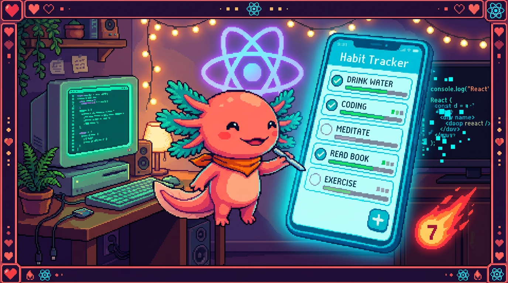

# Capítulo 14 — Mini-proyecto: una mini app de hábitos

<p align="center">
  
</p>


> Llegó el capítulo donde todo lo que aprendiste se junta en una sola obra. Vas a construir,
> paso a paso y con tus propias manos, una versión chiquita de **RachaSimple**: una app que
> lista hábitos, te deja **añadir**, **marcar como hecho** y **borrar**, con un **formulario
> controlado**, un **hook personalizado** llamado `useHabits` y, al final, persistencia en
> **localStorage** para que tus hábitos sigan ahí cuando recargas. No usaremos Supabase ni
> TanStack Query: solo React puro, para que veas cómo encajan componentes, props, estado,
> efectos y hooks. Bit, nuestro ajolote, se puso el casco de obra: hoy se construye. 🪼

---

## 1. Qué vamos a construir (y por qué así)

RachaSimple, tu app real, está hecha con React 18 + TypeScript + Vite + Tailwind + shadcn/ui
+ Supabase + TanStack Query. Es una app completa, con servidor y base de datos. Nosotros vamos
a hacer una **maqueta** suya: misma idea (hábitos que marcas cada día), pero sin servidor.
Todo vive en el navegador. Así puedes correrla en tu computadora sin configurar nada.

La app tendrá tres componentes y un hook:

- `useHabits` — el **hook personalizado** que guarda la lista y sabe añadir, marcar y borrar.
- `HabitForm` — el **formulario controlado** para escribir un hábito nuevo.
- `HabitItem` — una **fila** que muestra un hábito y sus botones.
- `App` — el componente raíz que junta todo.

> ### 🟦 ¿Qué significa? — *Mini-proyecto (o maqueta)*
> Un **mini-proyecto** es una versión reducida y autocontenida de una app real, hecha para
> practicar un concepto sin la complejidad completa. Sirve para **aprender el esqueleto** antes
> de enfrentarte al edificio entero. Aquí copiamos la *idea* de RachaSimple (lista de hábitos,
> marcar a diario) pero quitamos lo que distrae para principiantes: el servidor, la
> autenticación y la caché de datos.

> ### 🟦 ¿Qué significa? — *Hook personalizado*
> Un **hook personalizado** es una función tuya cuyo nombre empieza por `use` (aquí `useHabits`) y
> que **agrupa lógica de estado y efectos** para reutilizarla. Sirve para sacar el "cerebro" de un
> componente a un sitio aparte, de modo que `App` quede limpio y la lógica se pueda probar y
> reutilizar. Lo viste a fondo en el capítulo 09; aquí lo aplicas por primera vez en un proyecto
> completo. RachaSimple tiene su propio `useHabits`, solo que apoyado en el servidor.

> ### 💡 Tip
> No leas este capítulo de corrido. Ábrelo junto a tu editor y escribe cada bloque de código en
> cuanto aparezca. Se aprende a construir construyendo, no mirando.

---

## 2. Preparar el proyecto en tu computadora 💻

Vamos a crear un proyecto React con **Vite**, la misma herramienta que usa RachaSimple.

> ### 🟦 ¿Qué significa? — *Vite*
> **Vite** es una herramienta que arranca un proyecto de React, lo sirve en tu navegador
> mientras programas y lo empaqueta para publicarlo. Sirve para **ver tus cambios al instante**
> sin configurar nada a mano. RachaSimple usa Vite de verdad; por eso lo usamos también aquí.

> ### 🟦 ¿Qué significa? — *`npm` y la terminal*
> **`npm`** (Node Package Manager) es la herramienta de línea de comandos que **instala y arranca**
> proyectos de JavaScript: descarga librerías y ejecuta tareas como `npm run dev`. La **terminal**
> es la ventana de texto donde escribes esos comandos. Sirve para montar y mover el proyecto sin
> botones, solo con instrucciones escritas. RachaSimple y Faro se manejan con `npm`; PolyPaw, al
> ser Python, usa otras herramientas equivalentes.

En una terminal, ejecuta:

```bash
npm create vite@latest mini-rachas -- --template react-ts
cd mini-rachas
npm install
npm run dev
```

> ### 🟦 ¿Qué significa? — *Plantilla `react-ts`*
> La **plantilla** `react-ts` le dice a Vite "crea un proyecto de **React** con **TypeScript**".
> Sirve para empezar con todo ya enchufado: React, el compilador de TypeScript y la estructura
> de carpetas. El `-ts` es lo que hace que tus archivos sean `.tsx` (React + TypeScript), igual
> que los de RachaSimple y Faro.

Cuando `npm run dev` arranque, te dará una dirección como `http://localhost:5173`. Ábrela en el
navegador: verás la pantalla de ejemplo de Vite. Vamos a reemplazarla por nuestra app.

> ### 🔎 En tu código
> RachaSimple se arranca igual: `npm run dev` levanta Vite. En Faro (Next.js 15) el comando es
> el mismo (`npm run dev`), aunque por dentro use otra herramienta. PolyPaw, en cambio, es Python
> con Flet: ahí no hay `npm` ni navegador, se corre con Python. Cada stack, su forma de arrancar.

---

## 3. El tipo `Habit`: decidir la forma del dato

Antes de tocar React, decide **cómo es un hábito**. En TypeScript (módulo 05) eso se escribe con
un `type`. Crea el archivo `src/types.ts`:

```ts
export type Habit = {
  id: string;        // identificador único de cada hábito
  name: string;      // el texto, p. ej. "Beber agua"
  done: boolean;     // ¿ya lo marcaste hoy?
};
```

> ### 🟦 ¿Qué significa? — *`type` (tipo)*
> Un **`type`** en TypeScript describe la **forma** que debe tener un dato: qué campos tiene y de
> qué clase es cada uno. Sirve para que el editor te avise si te equivocas (por ejemplo, si
> escribes `done: "sí"` en vez de `true`). En RachaSimple existe un tipo `Habit` parecido,
> generado a partir de la tabla de Supabase, con más campos (color, fecha de creación, etc.).

> ### 💡 Tip — Empieza por el dato
> Decidir la forma del dato **antes** de programar la interfaz es un hábito de profesional. Si
> sabes que un hábito tiene `id`, `name` y `done`, ya sabes qué mostrar y qué botones necesitas.
> El dato manda; la pantalla lo sigue.

---

## 4. El hook `useHabits`: el cerebro de la app

Aquí vive toda la lógica. Crea `src/useHabits.ts`. Empezaremos **sin** localStorage (lo
añadiremos en el apartado 8) para no mezclar conceptos.

```tsx
import { useState } from 'react';
import type { Habit } from './types';

export function useHabits() {
  const [habits, setHabits] = useState<Habit[]>([]);

  // Añadir un hábito nuevo a partir de su nombre.
  function addHabit(name: string) {
    const nuevo: Habit = {
      id: crypto.randomUUID(),
      name,
      done: false,
    };
    setHabits((prev) => [...prev, nuevo]);
  }

  // Cambiar done de true a false (o al revés) en un hábito.
  function toggleHabit(id: string) {
    setHabits((prev) =>
      prev.map((h) => (h.id === id ? { ...h, done: !h.done } : h))
    );
  }

  // Quitar un hábito de la lista.
  function removeHabit(id: string) {
    setHabits((prev) => prev.filter((h) => h.id !== id));
  }

  return { habits, addHabit, toggleHabit, removeHabit };
}
```

Repasemos cada pieza, porque aquí está el 80 % del capítulo.

> ### 🟦 ¿Qué significa? — *`useState<Habit[]>([])`*
> **`useState`** es el hook que le da **memoria** a un componente o hook. Le dijimos que guarda un
> array de hábitos (`Habit[]`) y que empieza vacío (`[]`). Devuelve dos cosas: el valor actual
> (`habits`) y una función para cambiarlo (`setHabits`). Cada vez que llamas `setHabits`, React
> vuelve a dibujar lo que dependa de esa lista. Es el mismo `useState` del capítulo 04.

> ### 🟦 ¿Qué significa? — *`crypto.randomUUID()`*
> **`crypto.randomUUID()`** es una función del navegador que genera un **identificador único**
> (un texto largo e irrepetible como `"a1b2c3..."`). Sirve para darle a cada hábito un `id`
> propio, de modo que puedas marcarlo o borrarlo sin confundirlo con otro. En RachaSimple ese
> `id` lo pone Supabase al guardar; aquí, como no hay servidor, lo generamos nosotros.

> ### 🟦 ¿Qué significa? — *Inmutabilidad, el spread `...`, `.map()` y `.filter()`*
> **Inmutabilidad** significa **no modificar** el array original, sino crear uno **nuevo** con el
> cambio; React necesita esto para darse cuenta de que algo cambió. El operador **spread** (`...`)
> copia: `[...prev, nuevo]` crea una lista nueva con todo lo de antes más el hábito nuevo.
> **`.map()`** recorre y transforma (en `toggleHabit`, solo al hábito del `id` le invertimos `done`
> con `{ ...h, done: !h.done }`). **`.filter()`** devuelve la lista **sin** lo que no cumple (en
> `removeHabit`, todos menos el del `id`). Los tres crean listas nuevas y no tocan el original.
> Cuando le pasas una **función** a `setHabits`, React te entrega el valor más reciente en `prev`:
> la forma segura cuando el nuevo valor depende del anterior. Todo esto es JavaScript del módulo 03.

> ### ⚠️ Cuidado — `!h.done` invierte, no "marca siempre hecho"
> `done: !h.done` significa "pon `done` al **contrario** de como está": si era `false` pasa a
> `true`, y si era `true` pasa a `false`. Por eso `toggleHabit` sirve tanto para marcar como para
> desmarcar. Si pusieras `done: true` a secas, nunca podrías desmarcar un hábito.

> ### 🔎 En tu código
> En RachaSimple, este "cerebro" no usa `useState` con un array local: usa **TanStack Query**
> (`useHabits` con `useQuery`) para traer los hábitos de Supabase y `useMutation` para crearlos.
> La *idea* es idéntica —un hook que expone la lista y las acciones— pero la fuente de datos es el
> servidor en vez de la memoria del navegador. Lo viste en el capítulo 11.

---

## 5. `HabitForm`: el formulario controlado

Ahora la interfaz para **escribir** un hábito. Crea `src/HabitForm.tsx`:

```tsx
import { useState } from 'react';

type HabitFormProps = {
  onAdd: (name: string) => void;
};

export function HabitForm({ onAdd }: HabitFormProps) {
  const [text, setText] = useState('');

  function handleSubmit(e: React.FormEvent) {
    e.preventDefault();
    const limpio = text.trim();
    if (limpio === '') return; // no añadir hábitos vacíos
    onAdd(limpio);
    setText(''); // vaciar el campo tras añadir
  }

  return (
    <form onSubmit={handleSubmit}>
      <input
        type="text"
        value={text}
        onChange={(e) => setText(e.target.value)}
        placeholder="Nuevo hábito..."
      />
      <button type="submit">Añadir</button>
    </form>
  );
}
```

> ### 🟦 ¿Qué significa? — *Formulario controlado (componente controlado)*
> Un **formulario controlado** es aquel donde el valor del `input` lo manda **React**, no el
> navegador. Lo logramos con dos cosas: `value={text}` (el input muestra lo que dice el estado) y
> `onChange={(e) => setText(e.target.value)}` (cada tecla actualiza el estado). Sirve para que
> React sea siempre la "única fuente de verdad" de lo que hay escrito: puedes validarlo, vaciarlo
> o transformarlo cuando quieras. Lo viste a fondo en el capítulo 07.

> ### 🟦 ¿Qué significa? — *`props` y el callback `onAdd`*
> Las **props** son los datos y funciones que un componente padre le pasa a un hijo. Aquí
> `HabitForm` recibe la prop **`onAdd`**, que es una **función** (un *callback*). Cuando el
> usuario envía el formulario, el form no sabe *cómo* se guarda un hábito: solo llama
> `onAdd(limpio)` y deja que el padre decida. Sirve para que el formulario sea **reutilizable** y
> no esté pegado a una app concreta. Esto es exactamente lo del capítulo 03.

> ### 🟦 ¿Qué significa? — *`onSubmit`, `e.preventDefault()` y validar con `.trim()`*
> **`onSubmit`** se dispara al enviar el formulario (botón o Enter). **`e.preventDefault()`** evita
> el comportamiento por defecto del navegador, que sería **recargar la página** entera; sin esa
> línea tu app se reiniciaría y perderías todo. **`.trim()`** quita los espacios de los extremos,
> para que un hábito de solo espacios cuente como vacío y no se añada: a comprobar antes de guardar
> se le llama **validar**, y RachaSimple también valida que el nombre no esté vacío.

> ### 🟦 ¿Qué significa? — *`e: React.FormEvent`*
> Cuando escribes `handleSubmit(e: React.FormEvent)`, la **`e`** es el **evento**: un objeto que
> React te entrega con información de lo que pasó (qué formulario se envió) y métodos como
> `preventDefault()`. La parte **`: React.FormEvent`** es solo el **tipo** de TypeScript que
> describe ese objeto, para que el editor sepa qué puedes hacer con `e` y te autocomplete. Sirve
> para trabajar con seguridad: si te equivocas de método, el editor te avisa antes de ejecutar.

> ### 💡 Tip — Vaciar el campo tras añadir
> Fíjate en `setText('')` al final de `handleSubmit`. Como el input es controlado, basta con
> poner el estado a cadena vacía para que el campo se limpie solo. Sin componentes controlados,
> tendrías que tocar el **DOM** a mano (el DOM es el árbol de elementos HTML que el navegador
> dibuja en pantalla; manipularlo "a mano" sería buscar el input y vaciarlo tú mismo). Esta es una
> de las grandes comodidades de React.

---

## 6. `HabitItem`: una fila con sus botones

Cada hábito de la lista será una fila. Crea `src/HabitItem.tsx`:

```tsx
import type { Habit } from './types';

type HabitItemProps = {
  habit: Habit;
  onToggle: (id: string) => void;
  onRemove: (id: string) => void;
};

export function HabitItem({ habit, onToggle, onRemove }: HabitItemProps) {
  return (
    <li>
      <input
        type="checkbox"
        checked={habit.done}
        onChange={() => onToggle(habit.id)}
      />
      <span style={{ textDecoration: habit.done ? 'line-through' : 'none' }}>
        {habit.name}
      </span>
      <button onClick={() => onRemove(habit.id)}>Borrar</button>
    </li>
  );
}
```

> ### 🟦 ¿Qué significa? — *Componente de presentación*
> Un **componente de presentación** es un componente que **solo dibuja** lo que recibe por props y
> avisa de los clics, sin guardar estado propio. `HabitItem` no sabe nada de la lista completa:
> recibe **un** `habit` y dos funciones (`onToggle`, `onRemove`). Sirve para tener piezas
> pequeñas, reutilizables y fáciles de leer. En RachaSimple, `HabitCard.tsx` cumple este papel:
> muestra una tarjeta de hábito y delega las acciones hacia arriba.

> ### 🟦 ¿Qué significa? — *Renderizado condicional con el ternario*
> El **ternario** `condición ? A : B` elige entre dos valores según una condición. Aquí
> `habit.done ? 'line-through' : 'none'` tacha el texto si el hábito está hecho. Es la forma de
> que la **interfaz reaccione al estado**: el mismo componente se ve distinto según `done`. Lo
> viste en el capítulo 06.

> ### 🟦 ¿Qué significa? — *Checkbox controlado (`checked` + `onChange`)*
> Igual que el input de texto, este **checkbox** es controlado: `checked={habit.done}` hace que la
> marca dependa del estado, y `onChange` avisa al padre para que cambie ese estado. No guardamos
> "marcado/desmarcado" en el navegador: lo guarda React en la lista de hábitos. Una sola fuente de
> verdad, otra vez.

> ### ⚠️ Cuidado — `onClick={() => onRemove(habit.id)}`, no `onClick={onRemove(habit.id)}`
> Tienes que pasarle a `onClick` una **función**, no el **resultado** de llamarla. Si escribes
> `onClick={onRemove(habit.id)}` (sin la flecha), React llamaría `onRemove` **al dibujar**, no al
> hacer clic, y borraría el hábito de inmediato. La flecha `() => ...` crea una función que se
> ejecuta **cuando** ocurre el clic. Es el error más común de principiante; ténlo presente.

---

## 7. `App`: juntar todas las piezas

Ahora el componente raíz que orquesta todo. Reemplaza el contenido de `src/App.tsx`:

```tsx
import { useHabits } from './useHabits';
import { HabitForm } from './HabitForm';
import { HabitItem } from './HabitItem';

export default function App() {
  const { habits, addHabit, toggleHabit, removeHabit } = useHabits();

  const hechos = habits.filter((h) => h.done).length;

  return (
    <main>
      <h1>Mini RachaSimple</h1>

      <HabitForm onAdd={addHabit} />

      {habits.length === 0 ? (
        <p>Aún no tienes hábitos. ¡Añade el primero!</p>
      ) : (
        <ul>
          {habits.map((habit) => (
            <HabitItem
              key={habit.id}
              habit={habit}
              onToggle={toggleHabit}
              onRemove={removeHabit}
            />
          ))}
        </ul>
      )}

      <p>
        Llevas {hechos} de {habits.length} hechos hoy.
      </p>
    </main>
  );
}
```

Mira lo limpio que quedó `App`: una línea trae todo del hook, el formulario recibe `addHabit`, y
la lista se pinta recorriendo `habits`. `App` **no** tiene `useState`: toda la memoria vive en
`useHabits`. Ese es el premio de haber extraído la lógica.

> ### 🟦 ¿Qué significa? — *Renderizar una lista con `.map()` y `key`*
> Para dibujar una lista, recorremos `habits` con **`.map()`** y devolvemos un `<HabitItem>` por
> cada uno. La prop especial **`key`** le da a React un identificador estable de cada fila
> (`habit.id`) para que sepa cuál cambió, se añadió o se borró, y redibuje solo lo necesario. Sin
> `key`, React se confunde al reordenar o eliminar. Esto es del capítulo 06.

> ### 🟦 ¿Qué significa? — *"Levantar el estado" (lifting state up)*
> El estado (la lista) vive **arriba**, en el hook que usa `App`, no dentro de cada hijo.
> `HabitForm` y `HabitItem` no guardan la lista: la **reciben** y avisan de cambios con sus
> callbacks. A esto se le llama **levantar el estado**: ponerlo en el ancestro común para que
> todos los hijos compartan la misma verdad. Es el patrón estándar de React y el que usa
> RachaSimple entre sus pantallas y tarjetas.

> ### 🟦 ¿Qué significa? — *Estado derivado (`hechos`)*
> **`hechos`** no es un estado nuevo: se **calcula** a partir de `habits` en cada render
> (`habits.filter((h) => h.done).length`). A los datos que se obtienen de otro estado se les llama
> **estado derivado**. La regla de oro: si puedes **calcularlo**, no lo guardes en otro `useState`.
> Guardar un contador aparte solo te daría dos verdades que se contradicen.

> ### 💡 Tip — Compila mentalmente el flujo
> Sigue un clic: pulsas el checkbox → `HabitItem` llama `onToggle(id)` → que es `toggleHabit` del
> hook → este hace `setHabits` con la lista nueva → React redibuja `App` → la fila se tacha y el
> contador sube. Datos hacia abajo (props), avisos hacia arriba (callbacks). Ese ciclo es **toda**
> la app.

---

## 8. Persistir en localStorage con un efecto

Si recargas ahora, tus hábitos desaparecen: viven solo en memoria. Vamos a guardarlos en el
navegador con **localStorage** y un **efecto**. Vuelve a `src/useHabits.ts` y modifícalo así:

```tsx
import { useState, useEffect } from 'react';
import type { Habit } from './types';

const STORAGE_KEY = 'mini-rachas:habits';

// Leer el valor inicial desde localStorage (o array vacío si no hay nada).
function leerInicial(): Habit[] {
  const guardado = localStorage.getItem(STORAGE_KEY);
  if (!guardado) return [];
  try {
    return JSON.parse(guardado) as Habit[];
  } catch {
    return []; // si el dato estaba corrupto, empezamos limpio
  }
}

export function useHabits() {
  const [habits, setHabits] = useState<Habit[]>(leerInicial);

  // Cada vez que la lista cambie, la guardamos.
  useEffect(() => {
    localStorage.setItem(STORAGE_KEY, JSON.stringify(habits));
  }, [habits]);

  function addHabit(name: string) {
    const nuevo: Habit = { id: crypto.randomUUID(), name, done: false };
    setHabits((prev) => [...prev, nuevo]);
  }

  function toggleHabit(id: string) {
    setHabits((prev) =>
      prev.map((h) => (h.id === id ? { ...h, done: !h.done } : h))
    );
  }

  function removeHabit(id: string) {
    setHabits((prev) => prev.filter((h) => h.id !== id));
  }

  return { habits, addHabit, toggleHabit, removeHabit };
}
```

Solo cambiaron dos cosas respecto al apartado 4: **de dónde sale el valor inicial** y **un
efecto que guarda**. El resto es idéntico. Veámoslas.

> ### 🟦 ¿Qué significa? — *`localStorage`*
> **`localStorage`** es un pequeño almacén que el navegador guarda en el disco del usuario y que
> **sobrevive a recargas y a cerrar la pestaña**. Guarda pares de **texto**: una clave
> (`'mini-rachas:habits'`) y un valor. Sirve para recordar cosas sin servidor: preferencias,
> borradores, o aquí, la lista de hábitos. Solo guarda texto, por eso necesitamos convertir.

> ### 🟦 ¿Qué significa? — *`JSON.stringify` y `JSON.parse`*
> **`JSON.stringify(habits)`** convierte tu array en **texto** para guardarlo (localStorage solo
> entiende texto); **`JSON.parse(guardado)`** hace lo contrario al leer. Dos funciones de
> JavaScript (módulo 03) que viajan juntas: una para guardar, otra para recuperar.

> ### 🟦 ¿Qué significa? — *Inicializador perezoso (`useState(leerInicial)`)*
> Fíjate que pasamos `useState(leerInicial)` — la **función**, sin paréntesis — y no
> `useState(leerInicial())`. Así React la ejecuta **una sola vez**, al montar, en vez de en cada
> render. Eso es un **inicializador perezoso** (*lazy initializer*): sirve para que la lectura de
> localStorage (que es lenta) no se repita inútilmente en cada dibujo.

> ### 🟦 ¿Qué significa? — *`useEffect` con dependencia `[habits]`*
> **`useEffect`** ejecuta código **después** de que React dibuja, para cosas que tocan el "mundo
> exterior" (aquí, el almacén del navegador). El array `[habits]` son sus **dependencias**:
> significa "vuelve a ejecutar este efecto **cada vez que `habits` cambie**". Así, cada añadir,
> marcar o borrar dispara un guardado automático. Lo viste a fondo en el capítulo 08.

> ### ⚠️ Cuidado — El `try/catch` no es decorativo
> Si el dato guardado se corrompiera (alguien lo editó a mano, o cambió el formato), `JSON.parse`
> lanzaría un error y tu app **no arrancaría**. El **`try/catch`** atrapa ese fallo y devuelve un
> array vacío para empezar limpio en vez de romperse. Programar defensivamente alrededor de datos
> externos es una marca de madurez.

> ### 🔎 En tu código
> RachaSimple **no** usa localStorage para los hábitos: usa Supabase (base de datos en la nube)
> para que tus rachas estén en cualquier dispositivo. Pero el patrón —*leer al inicio, guardar
> cuando cambie*— es el mismo que aplicarás con servidores. PolyPaw persiste su progreso en
> archivos **JSON** locales: misma idea de "guardar texto", distinto entorno.

---

## 9. Probarlo y entender el ciclo completo 💻

Guarda todo y mira tu navegador en `http://localhost:5173`. Deberías poder:

1. Escribir "Beber agua" y pulsar **Añadir** → aparece en la lista, el campo se vacía.
2. Marcar el checkbox → el texto se tacha y el contador "Llevas 1 de 1" sube.
3. Pulsar **Borrar** → la fila desaparece.
4. **Recargar la página (F5)** → tus hábitos siguen ahí. 🎉

Si los cuatro pasos funcionan, acabas de construir una app de React completa con todo lo del
módulo trabajando junto.

> ### 💡 Tip — Inspecciona localStorage
> Abre las herramientas de desarrollador del navegador (F12), ve a la pestaña **Application** (o
> **Almacenamiento**) → **Local Storage**. Verás tu clave `mini-rachas:habits` con el JSON de tus
> hábitos. Verlo con tus ojos hace que "persistencia" deje de ser una palabra abstracta.

> ### ⚠️ Cuidado — Si algo no aparece, revisa la consola
> Cuando una pantalla queda en blanco, casi siempre hay un error rojo en la **consola** (F12 →
> Console). Léelo: suele decirte el archivo y la línea. Olvidar un `export`, un `import` mal
> escrito o una `key` faltante son los culpables más frecuentes en este proyecto.

---

## 10. Repaso: qué concepto del módulo usó cada pieza

Para que veas que de verdad integraste todo, este es el mapa:

- **Componentes** (cap. 02): `App`, `HabitForm`, `HabitItem`.
- **JSX** (cap. 02): todo el HTML dentro de los `return`.
- **Props** (cap. 03): `onAdd`, `habit`, `onToggle`, `onRemove`.
- **Estado con `useState`** (cap. 04): la lista `habits` y el `text` del formulario.
- **Eventos y formularios controlados** (cap. 07): `onSubmit`, `onChange`, `onClick`,
  `e.preventDefault()`.
- **Listas y renderizado condicional** (cap. 06): `.map()`, `key`, el ternario, el `&&` implícito
  del "lista vacía".
- **`useEffect`** (cap. 08): el guardado automático en localStorage.
- **Hook personalizado** (cap. 09): `useHabits`, que encapsula todo el cerebro.

> ### 💡 Tip — Esta maqueta es el plano de RachaSimple
> Cuando abras el RachaSimple real, reconocerás el mismo esqueleto: un hook que expone la lista y
> las acciones, componentes de presentación que reciben props y avisan hacia arriba, y un punto
> donde se persiste. Solo cambian las piezas de abajo (Supabase y TanStack Query en vez de
> `useState` y localStorage). El plano es idéntico.

---

## ✅ Checklist — ¿ya domino esto?

- [ ] Arranqué un proyecto React con Vite y plantilla `react-ts`.
- [ ] Definí un `type Habit` y entiendo por qué decidir el dato primero.
- [ ] Escribí `useHabits` con `useState` y las funciones `addHabit`, `toggleHabit`, `removeHabit`.
- [ ] Explico por qué uso `...` (spread), `.map()` y `.filter()` en vez de modificar el array.
- [ ] Construí un **formulario controlado** con `value`, `onChange`, `onSubmit` y `e.preventDefault()`.
- [ ] Entiendo por qué `HabitItem` recibe props y avisa con callbacks en vez de guardar estado.
- [ ] Sé qué es **levantar el estado** y por qué la lista vive en el hook, no en los hijos.
- [ ] Reconozco el **estado derivado** (`hechos`) y por qué no lo guardo aparte.
- [ ] Persistí en **localStorage** con `JSON.stringify`/`JSON.parse` y un `useEffect` con `[habits]`.
- [ ] Probé los cuatro pasos (añadir, marcar, borrar, recargar) y funcionaron.

---

## 🧪 Ejercicios

1. **En papel.** Dibuja el flujo de datos cuando el usuario marca un checkbox: qué componente
   avisa, qué función del hook se ejecuta, qué hace `setHabits` y qué se redibuja. Usa flechas
   "hacia abajo" para props y "hacia arriba" para callbacks.

2. **En papel.** Explica por qué `App` no necesita ningún `useState`, y de dónde sale entonces la
   memoria de la app. ¿Qué pasaría si moviéramos la lista a un `useState` dentro de `HabitItem`?

3. 💻 **Construye la app entera.** Sigue los apartados 2 a 9 hasta tener la maqueta funcionando con
   persistencia. No copies y pegues: escribe cada archivo. Verifica los cuatro pasos del
   apartado 9.

4. 💻 **Botón "Limpiar hechos".** Añade en `useHabits` una función `clearDone()` que borre solo los
   hábitos con `done: true` (pista: `filter` por `!h.done`). Ponla en `App` con un botón "Limpiar
   hechos" y compruébalo.

5. 💻 **Contador de racha.** Amplía el tipo `Habit` con un campo `streak: number` que empiece en 0.
   Haz que `toggleHabit`, al **marcar** un hábito (pasar a `done: true`), suba `streak` en 1.
   Muéstralo en `HabitItem` como "🔥 3". (Reto: ¿qué hacer al desmarcar?)

6. 💻 **Editar el nombre (reto).** Añade a `useHabits` una función `renameHabit(id, nuevoNombre)` y
   en `HabitItem` un pequeño formulario controlado para editar el texto de un hábito. Esto te
   obliga a combinar formulario controlado + props + actualización inmutable con `.map()`, justo
   lo que practicaste en todo el capítulo.

---

> Cierre de Bit: *lo lograste.* 🎉 Empezaste el módulo sin saber qué era un componente y acabas de
> construir, de cero, una app de hábitos con estado, efectos, props, formularios controlados y un
> hook propio que persiste datos. Eso es RachaSimple en miniatura, hecho por ti. Guárdala con
> cariño: es la prueba de que ya piensas en React. Bit cuelga el casco de obra y aplaude desde su
> frasco. 🪼
