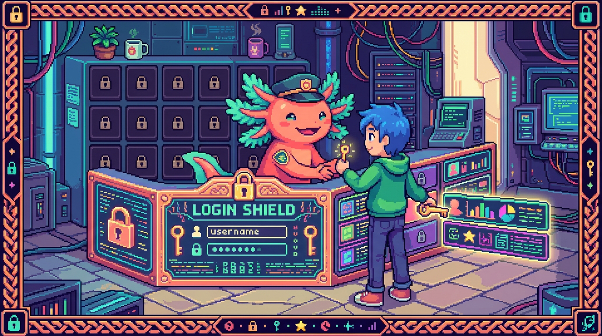

# Capítulo 05 — Seguridad: RLS y autenticación

<p align="center">
  
</p>


> Si la clave pública de Supabase la puede ver cualquiera, ¿qué impide que un usuario lea
> los hábitos de otro? La respuesta tiene nombre: **RLS**. Es una de las ideas de seguridad
> que más te van a servir, así que cerramos el módulo viendo con calma cómo tus datos se
> quedan donde tienen que quedarse: en privado.

---

## 1. Autenticación: ¿quién eres?

> ### 🟦 ¿Qué significa? — *Autenticación (auth)*
> La **autenticación** es comprobar **quién es** un usuario, es decir, que de verdad es quien
> dice ser. Es el **login** de toda la vida. Cuando te autenticas (con correo y contraseña, o
> entrando con Google o GitHub), Supabase ya sabe quién eres y te abre una **sesión**.

> ### 🟦 ¿Qué significa? — *Autenticación vs. autorización*
> Son dos palabras que se confunden todo el tiempo:
> - **Autenticación** = *¿quién eres?* (el login).
> - **Autorización** = *¿qué tienes permitido hacer?* (los permisos).
> El orden importa: primero te autenticas, demuestras tu identidad, y solo después el sistema
> decide qué puedes ver o hacer. RLS, que viene justo a continuación, es **autorización**: una
> vez que sé quién eres, decido qué filas te dejo tocar.

> ### 🟦 ¿Qué significa? — *Sesión y token*
> Cuando inicias sesión, Supabase te entrega un **token**: una credencial temporal, un texto
> cifrado que tu app manda en cada petición para decir "soy el usuario 7, ya autenticado". La
> **sesión** es ese estado de "estás dentro". El token caduca cada cierto tiempo y se renueva
> solo, sin que te enteres. Por eso no tienes que escribir la contraseña en cada clic.

---

## 2. El concepto estrella: Row-Level Security (RLS)

> ### 🟦 ¿Qué significa? — *RLS (seguridad a nivel de fila)*
> **RLS** (*Row-Level Security*, "seguridad a nivel de fila") es una función de Postgres que
> decide, **fila por fila**, quién puede verla o cambiarla. No dice "este usuario puede entrar
> a la tabla habitos"; afina mucho más: "este usuario solo puede ver las **filas** de la tabla
> habitos **cuyo `usuario_id` sea el suyo**".
> Eso es lo que hace que, aunque todos compartan la misma clave pública y la misma tabla, **cada
> quien vea únicamente lo suyo**. Si la RLS no está bien puesta, cualquiera podría leer los datos
> de todos. Es el fallo de seguridad más grave que se ve en apps con Supabase, y también el más
> frecuente.

> ### 🟦 ¿Qué significa? — *Política (policy)*
> Una **política** es una **regla SQL** que define el permiso. Funciona casi como una condición
> `WHERE` que la base de datos le pega **sola** a cada consulta de ese usuario. Mira el ejemplo:
> ```sql
> -- "Un usuario solo puede LEER sus propios hábitos"
> CREATE POLICY "ver_mis_habitos"
> ON habitos FOR SELECT
> USING ( usuario_id = auth.uid() );
> ```
> - `auth.uid()` → el `id` del usuario **que está autenticado ahora mismo** (lo aporta Supabase).
> - `USING ( usuario_id = auth.uid() )` → la condición que cada fila tiene que cumplir para ser
>   visible. Si no la cumple, **para ese usuario es como si la fila ni existiera**.
> Se escribe una política por cada acción: SELECT, INSERT, UPDATE y DELETE.

> ### ⚠️ Cuidado — RLS hay que ACTIVARLA
> En Postgres y en Supabase, la RLS viene **apagada** por defecto en una tabla nueva. Tienes que
> encenderla a mano y escribir las políticas. Una tabla con RLS apagada y clave pública expuesta
> equivale a dejar los datos de todo el mundo al aire. Por eso, encender RLS y revisar las
> políticas es lo **primero** que se audita en una app de Supabase. De hecho, Supabase te lo
> recuerda con sus "advisors" (avisos de seguridad) cuando detecta una tabla sin proteger.

---

## 3. Cómo encaja todo junto

Así es el recorrido completo de una petición segura en RachaSimple:

```
1. Te logueas        → Supabase Auth comprueba tu identidad y te da una sesión + token.
2. Pides tus hábitos → el cliente envía: "SELECT * FROM habitos" + tu token.
3. RLS entra en acción→ Postgres añade en automático: "...WHERE usuario_id = auth.uid()".
4. Recibes SOLO       → las filas que son tuyas. Las de otros ni se asoman.
```

> ### 🔎 En tu código
> La carpeta `supabase/migrations/` de Faro guarda el SQL que **crea las tablas Y sus políticas
> RLS** a la vez. Por eso, aunque la clave pública ande suelta en el navegador, tus proyectos en
> Faro y tus hábitos en RachaSimple siguen siendo privados: es la propia base de datos la que los
> protege fila por fila. Seguridad **donde tiene que estar** (en el servidor y la BD), sin
> depender de que el frontend se porte bien.

> ### 💡 Tip — La regla de seguridad que te llevas
> *Nunca confíes en el frontend para la seguridad.* El navegador es del usuario y el usuario puede
> manipularlo a su antojo. La verdad y los permisos viven en el **servidor y la base de datos**
> (RLS, validaciones en el backend). El frontend valida por **comodidad**, para avisar rápido si
> algo está mal; el backend valida por **seguridad**, que es lo que cuenta de verdad. Ya lo viste
> con los formularios en el Módulo 01, y aquí se confirma.

---

## 4. Cierre del módulo

```
Bases de datos y SQL
├── Qué es: tablas/filas/columnas, relacional, claves     (cap. 01)
├── Consultar: SELECT/WHERE/ORDER BY                       (cap. 02)
├── Modificar y relacionar: CRUD, INSERT/UPDATE/DELETE, JOIN (cap. 03)
├── Supabase: Postgres en la nube, el cliente, BaaS        (cap. 04)
└── Seguridad: autenticación, RLS y políticas             (cap. 05)
```

Ya sabes **dónde viven los datos** de tus apps y cómo se mantienen en privado. Te falta una pieza
para cerrar el círculo: cómo hablan tus apps con el resto del mundo. Eso son las **APIs** (y de
paso, cómo se enchufan servicios externos como la IA). De eso trata el siguiente módulo.

---

## ✅ Checklist — ¿ya domino esto?

- [ ] Distingo **autenticación** (quién eres) de **autorización** (qué puedes hacer).
- [ ] Entiendo qué es una **sesión** y un **token**.
- [ ] Sé qué es **RLS** y por qué permite que cada usuario solo vea lo suyo.
- [ ] Entiendo qué es una **política** y el papel de `auth.uid()`.
- [ ] Sé que **RLS hay que activarla** y que olvidarlo expone los datos.
- [ ] Me llevo la regla: **la seguridad vive en el servidor/BD, no en el frontend**.

---

## 🧪 Ejercicios

1. **Auth vs. authz.** Clasifica como autenticación o autorización: (a) iniciar sesión con
   Google; (b) que solo puedas editar tus propios hábitos; (c) escribir tu contraseña.
2. **Lee la política.** Explica en español qué permite esta política:
   `CREATE POLICY ... ON checkins FOR SELECT USING ( usuario_id = auth.uid() );`
3. **El agujero.** Una tabla `notas` tiene la clave pública expuesta y RLS **apagada**. ¿Qué
   problema hay y cómo se arregla?
4. **El flujo.** Describe los 4 pasos desde que un usuario se loguea hasta que recibe solo sus
   datos, nombrando dónde actúa RLS.
5. **La regla de oro.** Explica por qué validar "solo en el frontend" no es seguro, con un
   ejemplo de cómo alguien podría saltárselo.

---

🎉 **¡Terminaste el Módulo 07 — Bases de datos y SQL!** Ahora entiendes dónde y cómo se guardan
los datos de tus apps, el lenguaje SQL, Supabase y la seguridad con RLS. Solo quedan dos módulos:
conectar con servicios externos (APIs, OAuth, IA) y tu servidor NAS.

➡️ Siguiente módulo: **[08 — APIs, OAuth e IA](../08-apis-oauth-ia/README.md)** *(en preparación)*.
