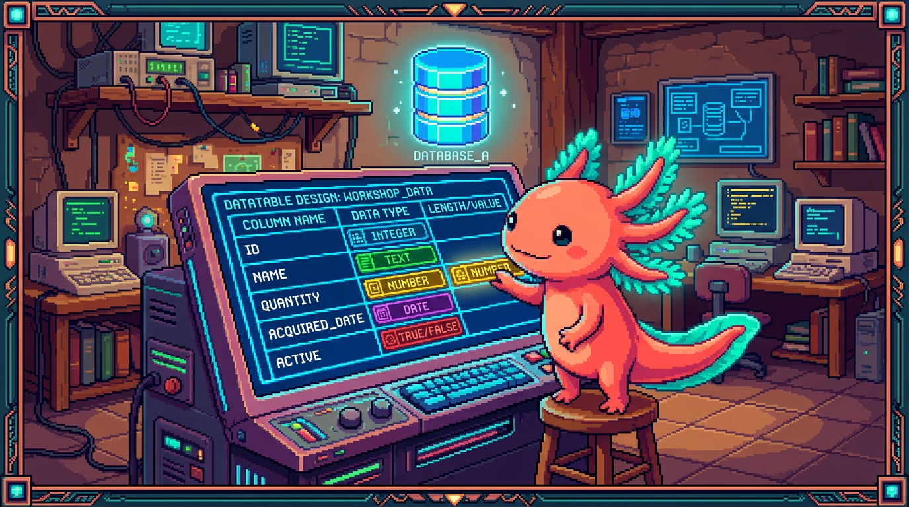

# Capitulo 06 — Diseñar tablas: tipos y esquema

<p align="center">
  
</p>


> Hasta ahora aprendiste a leer una base de datos. Toca el otro lado: *diseñarla*. Es decir, decidir qué tablas van a existir, qué columnas tiene cada una y qué tipo de dato guarda cada columna. Piénsalo como dibujar los planos de una casa antes de poner el primer ladrillo. Bit, nuestro ajolote, lo dice sin rodeos: diseñar bien una tabla es el 80% de un buen proyecto. Si las cajitas están bien hechas, lo demás encaja casi solo. Para que no sea teoría suelta, vamos a usar las tablas reales de **RachaSimple** (la app de hábitos) y **Faro** (el organizador de proyectos), porque las dos viven en Postgres dentro de Supabase.

## 1. ¿Qué es diseñar una tabla?

Una tabla es una cuadrícula: filas y columnas. Diseñarla es contestar tres preguntas antes de guardar nada:

1. ¿De qué cosa habla esta tabla? (un hábito, un registro, un proyecto, una fase…)
2. ¿Qué datos necesito de cada una? (su nombre, su fecha, si está activo…)
3. ¿De qué *tipo* es cada dato? (texto, número, fecha, verdadero/falso…)

> ### 🟦 ¿Que significa? — *Tabla*
> Una colección de filas que describen cosas del mismo tipo. Cada fila es una cosa (un hábito) y cada columna es un dato de esa cosa (su nombre). **Para qué sirve:** guardar muchos elementos parecidos de forma ordenada. **Dónde se usa:** en RachaSimple existe la tabla `habitos`, y cada fila es un hábito que el usuario quiere construir, como "tomar agua" o "leer 10 minutos".

> ### 🟦 ¿Que significa? — *Columna*
> Un dato concreto que comparten todas las filas de la tabla. **Para qué sirve:** definir qué información describe a cada elemento. **Dónde se usa:** la tabla `proyectos` de Faro tiene columnas como `nombre`, `descripcion`, `estado` y `progreso`. Cada proyecto que analizas va rellenando esas mismas columnas.

Hagamos un contraste con un proyecto que **no** usa base de datos relacional. **PolyPaw**, hecho en Python con Flet, guarda sus datos en archivos JSON. Ahí no hay tablas ni tipos estrictos: un campo puede ser texto hoy y número mañana, y nada protesta. Es comodísimo para arrancar, pero se vuelve peligroso cuando el proyecto crece. En Postgres pasa lo contrario: cada columna tiene un tipo fijo y la base de datos te cubre las espaldas. Bit lo resume con una imagen: "JSON es una mochila donde tiras todo de cualquier manera; una tabla es un cajón con compartimentos etiquetados".

## 2. Los tipos de columna de Postgres

El **tipo** de una columna define qué clase de valor puede guardar y qué reglas se le aplican. Si una columna es de tipo número, Postgres no te va a dejar meter la palabra "hola" ahí. Esa rigidez no es un capricho: es justo lo que te ahorra errores.

> ### 🟦 ¿Que significa? — *Tipo de dato*
> La categoría de valor que una columna acepta: texto, número entero, fecha, etc. **Para qué sirve:** que los datos sean coherentes y que Postgres pueda trabajar con ellos (sumar números, ordenar fechas). **Dónde se usa:** en RachaSimple, la columna `nombre` de `habitos` es de tipo texto, y `created_at` es de tipo fecha-hora.

Vamos a recorrer, uno por uno, los tipos que de verdad aparecen en RachaSimple y Faro.

### 2.1 Texto: `text` y `varchar`

> ### 🟦 ¿Que significa? — *text*
> Tipo para cadenas de caracteres de cualquier longitud: palabras, frases o párrafos enteros. **Para qué sirve:** guardar nombres, descripciones, notas. **Dónde se usa:** la descripción que la IA genera para cada proyecto en Faro se guarda en una columna `descripcion` de tipo `text`, porque puede ser larga.

> ### 🟦 ¿Que significa? — *varchar(n)*
> Texto con un límite máximo de `n` caracteres (por ejemplo `varchar(100)`). **Para qué sirve:** poner un tope cuando sabes que algo no debería pasar de cierto tamaño, como un nombre corto. **Dónde se usa:** podrías declarar `nombre varchar(120)` en `habitos` para que nadie registre un hábito de mil letras.

> ### 💡 Tip
> En Postgres, `text` y `varchar` rinden prácticamente igual; no ganas velocidad por limitar la longitud. Lo habitual es usar `text` por defecto y validar el tamaño en la aplicación. Reserva `varchar(n)` para cuando el límite sea una regla real del negocio.

### 2.2 Números: `int` y `bigint`

> ### 🟦 ¿Que significa? — *int (integer)*
> Número entero, sin decimales, en un rango de unos -2 mil millones a +2 mil millones. **Para qué sirve:** contar cosas, guardar porcentajes, posiciones. **Dónde se usa:** la columna `progreso` de un proyecto en Faro guarda un porcentaje (de 0 a 100) como `int`. Lo mismo el `orden` de una fase, para saber cuál va primero.

> ### 🟦 ¿Que significa? — *bigint*
> Número entero gigante, pensado para valores que pueden dispararse (hasta unos 9 trillones). **Para qué sirve:** identificadores o contadores que algún día podrían superar el techo de `int`. **Dónde se usa:** una tabla de eventos o logs que registra millones de filas usaría `bigint` para su contador autoincremental.

> ### ⚠️ Cuidado
> No uses `int` para un identificador que va a crecer sin freno si esperas miles de millones de filas: te quedas sin rango. Para porcentajes o cantidades pequeñas, `int` te sobra de largo. Bit lo deja en una frase: "elige el tipo más pequeño que cubra el peor caso, y ni uno más".

### 2.3 Verdadero o falso: `boolean`

> ### 🟦 ¿Que significa? — *boolean*
> Tipo que solo admite dos valores: `true` (verdadero) o `false` (falso). **Para qué sirve:** representar un sí/no, encendido/apagado, activo/inactivo. **Dónde se usa:** en RachaSimple, un hábito puede tener `activo boolean` para saber si el usuario lo sigue practicando o ya lo archivó.

### 2.4 Fechas y horas: `timestamp`

> ### 🟦 ¿Que significa? — *timestamp*
> Tipo que guarda un instante completo: fecha y hora juntas (año, mes, día, hora, minuto, segundo). En Supabase casi siempre se usa la variante `timestamptz`, que además incluye la zona horaria. **Para qué sirve:** saber *cuándo* pasó algo. **Dónde se usa:** la columna `created_at` aparece en casi todas las tablas de RachaSimple y Faro: marca el momento exacto en que se creó la fila.

> ### 🟦 ¿Que significa? — *timestamptz (timestamp with time zone)*
> Igual que `timestamp`, pero guarda también la zona horaria, así un mismo instante significa lo mismo para alguien en Bogotá y para alguien en Madrid. **Para qué sirve:** evitar líos de horario entre usuarios de países distintos. **Dónde se usa:** es el tipo que Supabase recomienda para columnas de fecha; los `created_at` de Faro lo usan.

> ### 💡 Tip
> Si solo te interesa el día y no la hora (por ejemplo, "el usuario cumplió su hábito el 26 de junio"), existe el tipo `date`. En RachaSimple, la tabla de `registros` puede usar `date` para la columna `fecha`, porque ahí importa el día, no el segundo exacto.

### 2.5 Identificadores únicos: `uuid`

> ### 🟦 ¿Que significa? — *uuid*
> Un identificador universal único: un código largo del estilo `a1b2c3d4-...-9f8e` que, con muchísima probabilidad, no se repite jamás en ningún lado. **Para qué sirve:** darle a cada fila una identidad única e imposible de adivinar. **Dónde se usa:** en Supabase, la tabla de usuarios usa `uuid` como identificador, y RachaSimple guarda en `habitos.user_id` el `uuid` del dueño de cada hábito para saber de quién es.

> ### 🟦 ¿Que significa? — *RLS (Row Level Security, seguridad a nivel de fila)*
> Una regla de Postgres que decide, fila por fila, quién puede ver o modificar cada una. **Para qué sirve:** que cada usuario llegue solo a *sus* datos, aunque todos compartan la misma tabla. **Dónde se usa:** en RachaSimple, el RLS sobre `habitos` usa la columna `user_id` para mostrarte únicamente tus hábitos; en Faro, la tabla `user_connections` protege con RLS los tokens de cada usuario.

> ### 🔎 En tu codigo
> En RachaSimple, el vínculo entre un hábito y su usuario funciona así: cada fila de `habitos` tiene una columna `user_id uuid` que apunta al `id` del usuario autenticado. Sobre esa columna se monta la seguridad por filas (RLS), que hace que cada quien vea solo *sus* hábitos. Sin un `uuid` por usuario, esa protección sencillamente no podría existir.

### 2.6 Datos flexibles: `jsonb`

> ### 🟦 ¿Que significa? — *jsonb*
> Tipo que guarda un documento JSON (texto estructurado con llaves y valores) en un formato optimizado para consultarlo. **Para qué sirve:** guardar datos cuya forma cambia o que no quieres modelar con columnas fijas. **Dónde se usa:** en Faro, el roadmap o las sugerencias que devuelve OpenAI por proyecto pueden guardarse como `jsonb`, porque su estructura (lista de pasos, etiquetas) varía según el análisis.

> ### ⚠️ Cuidado
> `jsonb` es tentador para *todo*, pero si abusas vuelves al estilo "mochila JSON" de PolyPaw y pierdes las validaciones de tipo. Resérvalo para datos que de verdad cambian de forma. Si un campo siempre existe y siempre tiene la misma pinta, dale su propia columna con su tipo.

## 3. Reglas sobre las columnas: NOT NULL y DEFAULT

Elegir el tipo es la mitad del trabajo. La otra mitad es poner reglas sobre qué valores se permiten.

> ### 🟦 ¿Que significa? — *NULL*
> Un valor especial que significa "aquí no hay dato" o "se desconoce". No es cero ni texto vacío: es *ausencia*. **Para qué sirve:** representar información que todavía no tienes. **Dónde se usa:** un proyecto recién creado en Faro puede tener `descripcion` en NULL hasta que la IA la genere.

> ### 🟦 ¿Que significa? — *NOT NULL*
> Regla que obliga a que una columna *siempre* tenga un valor; prohíbe NULL. **Para qué sirve:** garantizar que los datos esenciales no falten nunca. **Dónde se usa:** en `habitos`, la columna `nombre` es `NOT NULL`: un hábito sin nombre no tiene sentido, así que Postgres rechaza la fila.

> ### 🟦 ¿Que significa? — *DEFAULT*
> Un valor que Postgres coloca solo cuando tú no le das ninguno. **Para qué sirve:** ahorrarte escribir lo obvio y mantener la coherencia. **Dónde se usa:** `created_at timestamptz DEFAULT now()` hace que Postgres ponga la fecha y hora actual por su cuenta cada vez que insertas una fila, tanto en RachaSimple como en Faro.

Veamos cómo se juntan todas estas piezas en una tabla de verdad. Esta es, simplificada, la tabla `habitos` de RachaSimple:

```sql
create table habitos (
  id uuid primary key default gen_random_uuid(),
  user_id uuid not null,
  nombre text not null,
  descripcion text,
  activo boolean not null default true,
  created_at timestamptz not null default now()
);
```

Léela despacio con Bit al lado:

- `id`: el identificador de la fila, un `uuid` que se genera solo con `gen_random_uuid()`. Es la *clave primaria* (primary key), el dato que señala esa fila de forma única.
- `user_id`: a quién pertenece el hábito. Va `not null` porque un hábito huérfano no debería existir.
- `nombre`: obligatorio (`not null`), y puede ser cualquier texto.
- `descripcion`: opcional; si no la mandas, se queda en NULL.
- `activo`: verdadero/falso, con `true` por defecto (un hábito nace activo).
- `created_at`: se rellena solo con el momento de creación.

> ### 🟦 ¿Que significa? — *primary key (clave primaria)*
> La columna que identifica de forma única a cada fila: no se repite y no puede ser NULL. **Para qué sirve:** poder apuntar a una fila exacta sin ambigüedad. **Dónde se usa:** en todas las tablas de RachaSimple y Faro la clave primaria es `id` de tipo `uuid`.

> ### 🔎 En tu codigo
> Fíjate en el patrón que se repite en *cada* tabla de los dos proyectos: `id uuid primary key default gen_random_uuid()` y `created_at timestamptz not null default now()`. Cuando te encuentres una tabla nueva en Supabase, busca primero esas dos líneas: son la "firma" de una tabla bien hecha.

## 4. Columnas generadas

A veces una columna no se escribe a mano: se *calcula* a partir de otras.

> ### 🟦 ¿Que significa? — *columna generada (generated column)*
> Una columna cuyo valor lo calcula Postgres solo, con una fórmula que usa otras columnas de la misma fila. **Para qué sirve:** no guardar datos que se pueden deducir, y mantenerlos siempre coherentes. **Dónde se usa:** en RachaSimple podrías querer una columna `racha_completa` que sea verdadera solo si la racha llegó a la meta, calculada a partir de `dias_seguidos` y `meta`.

Un ejemplo concreto. Imagina que en `registros` quieres una columna que te diga el año del registro sin tener que teclearlo:

```sql
create table registros (
  id uuid primary key default gen_random_uuid(),
  habito_id uuid not null,
  fecha date not null,
  anio int generated always as (extract(year from fecha)) stored
);
```

Aquí `anio` no se escribe nunca: Postgres lo deduce de `fecha`. Si la fecha es 2026-06-26, `anio` será 2026, de forma automática y siempre correcta.

> ### 🟦 ¿Que significa? — *stored (almacenada)*
> Palabra que indica que la columna generada se calcula al insertar o actualizar y se guarda físicamente en disco. **Para qué sirve:** que el valor esté listo y no haya que recalcularlo en cada lectura. **Dónde se usa:** es la única modalidad de columna generada que Postgres soporta hoy; por eso siempre verás `stored` al final.

> ### ⚠️ Cuidado
> No puedes escribir a mano en una columna generada: Postgres no te deja. Y la fórmula solo puede usar columnas de la *misma* fila, no datos de otras tablas. Si necesitas algo más enredado, eso es trabajo de una *vista* o de la aplicación, no de una columna generada.

## 5. El esquema (schema) de la base de datos

Hasta aquí hablamos de tablas sueltas. El conjunto de *todas* las tablas, con sus columnas, tipos y relaciones, también tiene nombre.

> ### 🟦 ¿Que significa? — *esquema (schema)*
> Tiene dos sentidos. (1) El **diseño general**: la lista de tablas y cómo se conectan entre sí, como el plano de la base de datos. (2) En Postgres, un **contenedor con nombre** que agrupa tablas, parecido a una carpeta. **Para qué sirve:** organizar y dar estructura. **Dónde se usa:** en Supabase, tus tablas viven en el esquema `public` por defecto; la información de usuarios vive en un esquema aparte llamado `auth`.

> ### 🟦 ¿Que significa? — *public (esquema público)*
> El esquema por defecto de Postgres: donde se crean las tablas si no indicas otra cosa. **Para qué sirve:** tener un lugar predeterminado para tus tablas. **Dónde se usa:** las tablas `habitos`, `registros` y `perfiles` de RachaSimple, y `proyectos`, `fases` de Faro, viven todas en `public`.

> ### 🟦 ¿Que significa? — *auth (esquema de autenticación)*
> Un esquema especial que Supabase reserva para gestionar usuarios y sesiones. **Para qué sirve:** separar la maquinaria del login de tus propios datos. **Dónde se usa:** la tabla `auth.users` guarda a los usuarios; tu columna `user_id uuid` de `habitos` apunta a un `id` que vive ahí.

Así se ve el esquema completo de RachaSimple (en el sentido de diseño), contado en palabras:

- `perfiles`: datos extra de cada usuario (nombre visible, preferencias).
- `habitos`: cada hábito que el usuario quiere construir.
- `registros`: cada día que el usuario marcó un hábito como hecho; aquí vive la racha.

Y el de Faro:

- `proyectos`: cada proyecto analizado, con su descripción, estado y progreso generados por IA.
- `fases`: las etapas del roadmap de cada proyecto, con su `orden` y si están completas.
- `user_connections`: los tokens de GitHub y Google Drive de cada usuario, protegidos con RLS.

> ### 🟦 ¿Que significa? — *foreign key (clave foránea)*
> Una columna que apunta a la clave primaria de otra tabla para enlazar dos filas. **Para qué sirve:** representar relaciones (esta fase *pertenece* a este proyecto) y dejar que Postgres vigile que el enlace sea válido. **Dónde se usa:** en Faro, `fases.proyecto_id` es una clave foránea hacia `proyectos.id`; en RachaSimple, `registros.habito_id` apunta a `habitos.id`.

> ### 🔎 En tu codigo
> En Faro, una `fase` pertenece a un `proyecto`. Esa relación se arma con una columna `proyecto_id uuid` en la tabla `fases` que apunta al `id` de `proyectos`: es una *clave foránea* (foreign key). Gracias a eso, cuando borras un proyecto puedes hacer que sus fases se borren con él. Diseñar el esquema es, en buena parte, decidir estas conexiones entre tablas.

## 6. Convenciones de nombres

Postgres te deja nombrar tablas y columnas casi como quieras, pero seguir unas convenciones te ahorra dolores de cabeza. Bit insiste: "el yo del futuro te lo va a agradecer".

> ### 🟦 ¿Que significa? — *convención de nombres*
> Un conjunto de reglas acordadas para nombrar tablas y columnas de forma consistente. **Para qué sirve:** que cualquiera (incluido tú dentro de seis meses) entienda la base de datos de un vistazo. **Dónde se usa:** RachaSimple y Faro nombran todo en minúscula y con guion bajo, como `user_id` o `created_at`.

Estas son las reglas prácticas que siguen los dos proyectos:

- **Minúsculas y guion bajo** (`snake_case`): `created_at`, no `CreatedAt` ni `created at`. Postgres lleva mal las mayúsculas y los espacios.
- **Tablas en plural**: `habitos`, `proyectos`, `fases`. Cada tabla contiene *muchas* cosas.
- **Columna de relación = singular + `_id`**: `user_id`, `proyecto_id`, `habito_id`. Se lee solo a quién apunta.
- **Tiempos con `_at`**: `created_at`, `updated_at`. Avisa de que es un instante.
- **Booleanos que se leen como pregunta**: `activo`, `completada`. Se entiende que es sí/no.

> ### ⚠️ Cuidado
> Si nombras una columna con mayúsculas o espacios, Postgres te obligará a rodearla de comillas dobles *siempre* (`"Created At"`). Es incómodo y se presta a errores. Quédate en `snake_case` minúsculas y nunca tendrás que pelear con eso.

> ### 💡 Tip
> Sé consistente con el idioma. RachaSimple y Faro mezclan español en los nombres de negocio (`habitos`, `fases`, `progreso`) con convenciones técnicas en inglés (`id`, `created_at`, `user_id`) que ya son estándar en todas partes. Lo importante no es tener un idioma perfecto, sino no cambiar de criterio a mitad del proyecto.

## 7. Cómo se ve desde el cliente de Supabase

La tabla la diseñas en SQL, pero la *usas* desde tu app. Así inserta RachaSimple un hábito nuevo con el cliente de Supabase en TypeScript:

```ts
const { data, error } = await supabase
  .from("habitos")
  .insert({
    nombre: "Tomar agua",
    descripcion: "8 vasos al día",
    user_id: usuario.id, // un uuid
    // activo y created_at NO los mandamos:
    // Postgres pone sus DEFAULT (true y now())
  })
  .select()
  .single();
```

Mira lo que hace por ti un buen diseño: no enviamos `id`, ni `activo`, ni `created_at`. Postgres los rellena solos gracias a los `DEFAULT` que pusimos al crear la tabla. Cuando el diseño está bien pensado, el código de la app queda más corto y es más difícil de equivocar.

> ### 🔎 En tu codigo
> Las columnas `NOT NULL` *sin* `DEFAULT` son justo las que tu app *tiene* que enviar siempre: aquí, `nombre` y `user_id`. Si te olvidas de una, Postgres rechaza el insert con un error. Esa es exactamente la protección que PolyPaw no tiene con sus archivos JSON: ahí podrías guardar un hábito sin nombre y nadie te diría nada hasta que algo reventara en pantalla.

## ✅ Checklist — ¿ya domino esto?

- [ ] Puedo explicar qué es una tabla, una fila y una columna con un ejemplo de RachaSimple.
- [ ] Sé elegir entre `text`, `int`, `bigint`, `boolean`, `timestamptz`, `uuid` y `jsonb` según el dato.
- [ ] Entiendo la diferencia entre NULL, `NOT NULL` y `DEFAULT`.
- [ ] Reconozco el patrón `id uuid primary key default gen_random_uuid()` y `created_at timestamptz default now()`.
- [ ] Sé qué es una columna generada y por qué no se escribe a mano.
- [ ] Entiendo qué es un esquema y por qué las tablas de Supabase viven en `public` y los usuarios en `auth`.
- [ ] Sigo convenciones de nombres: `snake_case`, tablas en plural, `_id` para relaciones, `_at` para tiempos.
- [ ] Sé por qué un buen diseño deja menos trabajo (y menos errores) al código de la app.

## 🧪 Ejercicios

1. **En papel.** Dibuja la tabla `registros` de RachaSimple. ¿Qué columnas necesita para saber qué hábito se completó y qué día? Anota el tipo de cada una y cuáles serían `NOT NULL`.

2. **En papel.** Para la tabla `fases` de Faro, decide el tipo de estas columnas: `nombre`, `orden`, `completada`, `proyecto_id`, `created_at`. Justifica cada elección en una frase.

3. 💻 **En el editor SQL de Supabase.** Crea una tabla de práctica llamada `notas` con: `id uuid` clave primaria con default, `titulo text not null`, `cuerpo text`, `archivada boolean default false` y `created_at timestamptz default now()`. Insértale una fila enviando solo `titulo` y comprueba que las demás columnas se rellenaron solas.

4. 💻 **En el editor SQL de Supabase.** A tu tabla `notas`, añade una columna generada `largo_titulo int generated always as (length(titulo)) stored`. Inserta una nota y verifica que `largo_titulo` aparece calculado sin que tú lo escribieras. Luego intenta escribir un valor a mano en esa columna y observa el error.

5. 💻 **En el editor SQL de Supabase.** Crea a propósito una columna mal nombrada (`"Fecha Creacion" timestamptz`) y luego intenta consultarla sin comillas. Observa el error y reescríbela como `fecha_creacion`. Acabas de comprobar por qué existen las convenciones de nombres.

6. **De contraste.** Abre cualquier archivo JSON de PolyPaw y elige tres campos. Para cada uno, escribe qué tipo de columna de Postgres usarías si esos datos vivieran en una tabla, y qué validación (`NOT NULL`, `DEFAULT`) le pondrías. Esto te entrena el ojo para "ver tablas" donde otros ven texto suelto.
