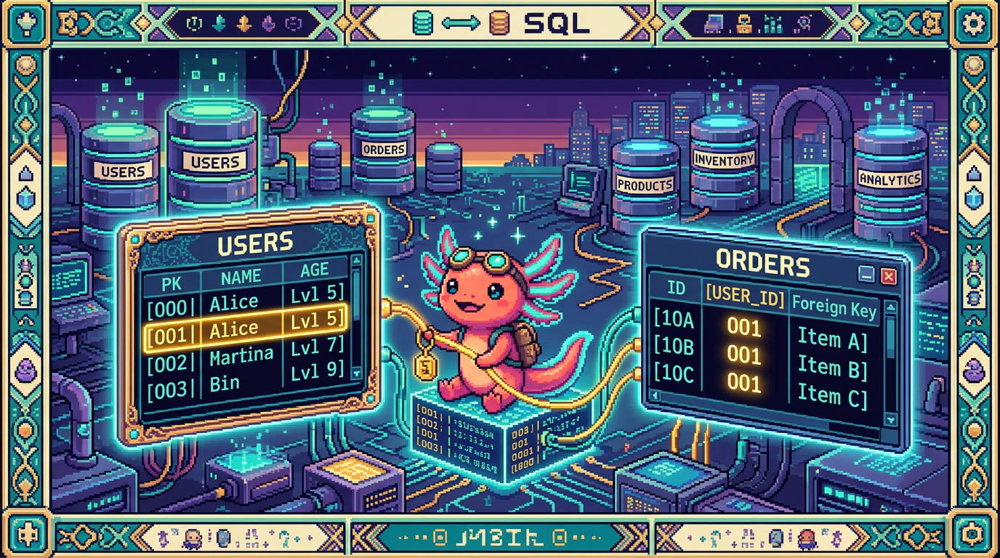

# Capitulo 07 — Claves primarias, foráneas y relaciones

<p align="center">
  
</p>


> ¡Hola otra vez! Soy **Bit**, tu ajolote guía. 🦎 Hasta ahora cada tabla vivía por su cuenta, como una isla en su propio mar. Pero en la vida real nada está tan aislado: un *hábito* es de alguien, un *registro de racha* pertenece a un *hábito*, una *fase* forma parte de un *proyecto*. En este capítulo vas a aprender a **conectar** tablas sin que todo se enrede: claves primarias, claves foráneas, integridad referencial y los famosos "uno-a-muchos" y "muchos-a-muchos". Al final entenderás por qué las tablas reales de **RachaSimple** y **Faro** están armadas como están. Respira hondo (yo respiro por las branquias 😄) y arrancamos.

## 1. El problema: datos que se repiten y se desordenan

Imagina que guardas tus hábitos en un único archivo, como hace **PolyPaw** (que usa archivos **JSON** en disco, sin base de datos relacional). Cada vez que anotas que cumpliste un hábito, vuelves a copiar el nombre del usuario, su correo, el nombre del hábito... una vez tras otra. El día que el usuario cambie de correo, tendrías que corregirlo en cientos de sitios. Y basta con que se te escape uno para que los datos queden contradiciéndose entre sí.

Las bases de datos relacionales (como **Postgres**, que usan **RachaSimple** y **Faro** a través de **Supabase**) atacan ese problema de raíz: en vez de copiar la información, la separan en tablas y las **enlazan**. Para ese enlace hacen falta dos piezas: una manera de identificar cada fila sin lugar a dudas (la clave primaria) y una manera de apuntar desde una tabla hacia otra (la clave foránea).

> ### 🟦 ¿Que significa? — *Base de datos relacional*
> Es un tipo de base de datos que guarda la información en **tablas** (filas y columnas) y permite **relacionar** unas tablas con otras mediante claves. El "relacional" viene precisamente de esas relaciones entre tablas.
> **Para que sirve:** evitar repetir datos y mantener la información consistente.
> **Donde se usa:** RachaSimple y Faro usan Postgres (vía Supabase), que es relacional. PolyPaw, en cambio, guarda todo en archivos JSON: no es relacional, así que para relacionar cosas hay que hacerlo "a mano" en el código.

> ### 🟦 ¿Que significa? — *Postgres (PostgreSQL)*
> Es un **motor de base de datos relacional** muy popular, libre y robusto. Es el programa que guarda tus tablas, hace cumplir las reglas (como la integridad referencial) y responde a tus consultas SQL.
> **Para que sirve:** almacenar y consultar datos relacionados de forma segura y consistente, incluso con muchos usuarios a la vez.
> **Donde se usa:** RachaSimple y Faro guardan toda su información en Postgres. PolyPaw no: sus datos viven en archivos JSON en disco.

> ### 🟦 ¿Que significa? — *Supabase*
> Es una **plataforma** que te entrega un Postgres ya montado en la nube y, alrededor, un montón de herramientas: autenticación de usuarios (Supabase Auth), un cliente para consultar desde tu código y seguridad por fila (RLS). Piénsala como "Postgres con todo incluido".
> **Para que sirve:** levantar el backend de una app (base de datos + login + permisos) sin tener que administrar un servidor tú mismo.
> **Donde se usa:** RachaSimple y Faro se apoyan en Supabase tanto para su base Postgres como para el login de los usuarios.

## 2. La clave primaria: el documento de identidad de cada fila

Cada fila de una tabla necesita algo que la separe de todas las demás, por mucho que dos filas se parezcan. Eso es la clave primaria.

> ### 🟦 ¿Que significa? — *Clave primaria (primary key)*
> Es una columna (o un conjunto de columnas) cuyo valor **identifica de forma única** a cada fila de la tabla. No puede repetirse y no puede estar vacío (NULL).
> **Para que sirve:** decir "esta fila exacta y ninguna otra". Es la base para que otras tablas puedan apuntar a ella.
> **Donde se usa:** en RachaSimple, la tabla `habitos` tiene una columna `id` que es la clave primaria de cada hábito. En Faro, la tabla `proyectos` tiene su propia `id`.

En Postgres, hoy lo más habitual es usar un **UUID** como clave primaria.

> ### 🟦 ¿Que significa? — *UUID*
> Es un identificador larguísimo y aleatorio, del estilo `a1b2c3d4-...-9f8e`. UUID significa "identificador único universal". La probabilidad de que dos coincidan es prácticamente cero.
> **Para que sirve:** dar un id único sin tener que ir contando (1, 2, 3...) ni preocuparte de que alguien lo adivine.
> **Donde se usa:** Supabase, por defecto, usa UUID para los `id` de las tablas de RachaSimple y Faro, y también para identificar a cada usuario en `auth.users`.

Así se ve una tabla con clave primaria en SQL (ejemplo basado en `habitos` de RachaSimple):

```sql
create table habitos (
  id          uuid primary key default gen_random_uuid(),
  nombre      text not null,
  color       text,
  creado_en   timestamptz default now()
);
```

La parte `primary key` declara que `id` es la clave primaria. Y `default gen_random_uuid()` quiere decir "si no me das un id, te genero un UUID nuevo yo mismo".

> ### 💡 Tip
> Casi siempre conviene una clave primaria que **no tenga significado de negocio** (un UUID o un número), en lugar de usar el correo o el nombre. ¿Por qué? Porque los datos de negocio cambian: alguien se cambia de correo, y no quieres que ese cambio te obligue a tocar la identidad de la fila en media base de datos.

> ### ⚠️ Cuidado
> "Único" y "obligatorio" no son lo mismo. La clave primaria es **las dos cosas a la vez**: única (no se repite) y no nula (siempre tiene valor). Si solo quieres que algo no se repita pero pueda faltar, eso es otra restricción (`unique`), no una clave primaria.

## 3. La clave foránea: apuntar a otra tabla

Ya tenemos hábitos con su `id`. Ahora queremos decir "este hábito es de este usuario". Para eso guardamos en la tabla `habitos` una columna con el `id` del usuario dueño. Esa columna que apunta a otra tabla es una clave foránea.

> ### 🟦 ¿Que significa? — *Clave foránea (foreign key)*
> Es una columna que **guarda el valor de la clave primaria de otra tabla**, y con eso crea un enlace entre ambas. Se llama "foránea" porque su valor viene de fuera, de otra tabla.
> **Para que sirve:** conectar una fila con la fila a la que pertenece en otra tabla, sin copiar todos sus datos.
> **Donde se usa:** en RachaSimple, `habitos` tiene una columna `user_id` que apunta al usuario dueño. En Faro, la tabla `fases` tiene `proyecto_id`, que apunta al proyecto al que pertenece la fase.

Veamos `habitos` ahora con su clave foránea hacia el usuario:

```sql
create table habitos (
  id          uuid primary key default gen_random_uuid(),
  user_id     uuid not null references auth.users (id),
  nombre      text not null,
  color       text,
  creado_en   timestamptz default now()
);
```

La línea que importa es `user_id uuid not null references auth.users (id)`. Esa palabra `references` es la que declara la clave foránea: "el valor de `user_id` tiene que existir como `id` en la tabla `auth.users`". Y así cada hábito queda amarrado a un usuario de verdad.

> ### 🔎 En tu codigo
> En RachaSimple usas Supabase Auth. Cuando alguien inicia sesión, Supabase crea (o ya tenía) una fila en `auth.users` con su `id` (un UUID). Ese mismo UUID es el que guardas en `habitos.user_id`. Por eso cada hábito "sabe" de quién es: comparte el `id` de su usuario.

> ### 🟦 ¿Que significa? — *Tabla referenciada y tabla que referencia*
> La tabla **referenciada** es la que tiene la clave primaria a la que se apunta (por ejemplo `auth.users`). La tabla **que referencia** es la que lleva la clave foránea (por ejemplo `habitos`).
> **Para que sirve:** tener clara la dirección del enlace: la clave foránea siempre vive en la tabla "hija" y apunta hacia la "padre".
> **Donde se usa:** en Faro, `fases` (hija) referencia a `proyectos` (padre) con `proyecto_id`.

## 4. Integridad referencial: la base no te deja mentir

Y aquí viene lo bueno. En cuanto declaras una clave foránea, Postgres se pone a **vigilar** que el enlace siempre tenga sentido. A eso se le llama integridad referencial.

> ### 🟦 ¿Que significa? — *Integridad referencial*
> Es la garantía de que toda clave foránea **apunta a una fila que existe de verdad**. La base de datos no te deja crear un hábito con un `user_id` de un usuario inexistente, ni borrar a un usuario dejando hábitos "huérfanos" apuntando al vacío (salvo que le digas qué hacer con ellos).
> **Para que sirve:** evitar datos rotos e incoherentes ("este hábito es del usuario X" cuando X ya no existe).
> **Donde se usa:** en RachaSimple y Faro se activa con cada `references`. Es Postgres quien hace cumplir la regla por ti.

> ### 🟦 ¿Que significa? — *Fila huérfana*
> Es una fila cuya clave foránea apunta a algo que ya no existe (por ejemplo, un registro de racha cuyo hábito fue borrado).
> **Para que sirve (evitarla):** mantener los datos limpios. La integridad referencial existe justamente para impedir huérfanos.
> **Donde se usa:** sin reglas, borrar un hábito en RachaSimple podría dejar registros de racha huérfanos. Con la clave foránea bien configurada, eso no ocurre.

> ### ⚠️ Cuidado
> En PolyPaw, como los datos están en JSON sin base relacional, **no hay nadie vigilando la integridad**. Si en un archivo borras una mascota pero en otro quedan referencias a ella, el programa puede romperse y nadie te avisa hasta que reviente. Esa es una de las grandes ventajas de Postgres frente a "datos en archivos": las reglas se cumplen solas.

## 5. Relaciones uno-a-muchos: el caso más común

La relación que más vas a encontrar es la de "uno-a-muchos": una fila de una tabla se relaciona con muchas filas de otra.

> ### 🟦 ¿Que significa? — *Relación uno-a-muchos*
> Es cuando **una** fila de la tabla A se relaciona con **muchas** filas de la tabla B, pero cada fila de B pertenece a una sola de A.
> **Para que sirve:** modelar el "uno tiene varios": un usuario tiene varios hábitos; un hábito tiene varios registros; un proyecto tiene varias fases.
> **Donde se usa:** RachaSimple → un usuario tiene muchos hábitos, y un hábito tiene muchos registros de racha. Faro → un usuario tiene muchos proyectos, y un proyecto tiene muchas fases.

La clave foránea siempre se coloca **del lado "muchos"**. Mira la cadena completa de RachaSimple: usuario → hábitos → registros.

```sql
-- Un usuario (auth.users) tiene muchos habitos
create table habitos (
  id        uuid primary key default gen_random_uuid(),
  user_id   uuid not null references auth.users (id),
  nombre    text not null
);

-- Un habito tiene muchos registros de racha
create table registros (
  id          uuid primary key default gen_random_uuid(),
  habito_id   uuid not null references habitos (id),
  fecha       date not null,
  completado  boolean default true
);
```

Sigue el hilo: `registros.habito_id` apunta a `habitos.id`, y `habitos.user_id` apunta a `auth.users.id`. Partiendo de un registro puedes llegar al hábito, y del hábito al usuario. Todo encadenado, nada repetido.

> ### 🔎 En tu codigo
> En Faro ocurre lo mismo, solo que con otra cadena: usuario → proyectos → fases.
> ```sql
> create table proyectos (
>   id        uuid primary key default gen_random_uuid(),
>   user_id   uuid not null references auth.users (id),
>   nombre    text not null,
>   estado    text
> );
>
> create table fases (
>   id           uuid primary key default gen_random_uuid(),
>   proyecto_id  uuid not null references proyectos (id),
>   titulo       text not null,
>   completada   boolean default false
> );
> ```
> `fases.proyecto_id` apunta a `proyectos.id`. Un proyecto tiene muchas fases; cada fase pertenece a un único proyecto.

> ### 💡 Tip
> Un truco para saber dónde va la clave foránea: pregúntate "¿quién pertenece a quién?". El que **pertenece** es el que lleva la clave foránea. Una fase pertenece a un proyecto, así que `proyecto_id` va en `fases`, y no al revés.

## 6. Leer relaciones desde el cliente de Supabase

En RachaSimple y Faro no te pones a escribir SQL a mano cada vez: usas el **cliente de Supabase** desde tu código TypeScript (y normalmente lo combinas con **TanStack Query** para llevar la carga de datos). Lo mejor es que el cliente entiende las claves foráneas y puede traerse datos relacionados de un solo viaje.

> ### 🟦 ¿Que significa? — *Cliente de Supabase*
> Es una librería de JavaScript/TypeScript que te deja consultar tu base de datos Postgres llamando a métodos en vez de escribir SQL crudo. Por debajo, sigue usando las tablas y relaciones que definiste.
> **Para que sirve:** leer y escribir datos desde tu app web sin tener que armar las consultas SQL a mano.
> **Donde se usa:** RachaSimple y Faro lo usan en el front (Next.js / React) para hablar con Postgres.

```ts
// RachaSimple: traer cada habito junto con sus registros (relacion uno-a-muchos)
const { data, error } = await supabase
  .from("habitos")
  .select("id, nombre, registros ( fecha, completado )");
```

Ese `registros ( fecha, completado )` dentro del `select` funciona **porque existe la clave foránea** `registros.habito_id → habitos.id`. Supabase detecta la relación y, para cada hábito, te anida sus registros. Quita la clave foránea y esto deja de ser posible.

> ### 🟦 ¿Que significa? — *TanStack Query*
> Es una librería de React que se encarga de **pedir datos del servidor, guardarlos en caché y refrescarlos** cuando hace falta. Tú le pasas una función que trae datos (por ejemplo la consulta de Supabase de arriba) y ella se ocupa del resto.
> **Para que sirve:** que tu interfaz muestre datos siempre frescos sin que tengas que escribir a mano toda la lógica de carga, recarga y errores.
> **Donde se usa:** RachaSimple la usa para cargar hábitos y registros y mantener la pantalla al día.

## 7. Relaciones muchos-a-muchos y tablas puente

Hay veces en que el "uno-a-muchos" se queda corto. Imagina que en Faro quisieras **etiquetas** (tags) en los proyectos: un proyecto puede llevar muchas etiquetas, y una etiqueta puede aparecer en muchos proyectos. Eso es muchos-a-muchos, y no hay forma de resolverlo con una sola clave foránea.

> ### 🟦 ¿Que significa? — *Relación muchos-a-muchos*
> Es cuando muchas filas de la tabla A se relacionan con muchas filas de la tabla B, en ambos sentidos. Un proyecto puede tener varias etiquetas; una etiqueta puede pertenecer a varios proyectos.
> **Para que sirve:** modelar relaciones cruzadas, donde ninguno de los dos lados "es dueño" del otro.
> **Donde se usa (ejemplo):** proyectos ↔ etiquetas en Faro, o hábitos ↔ categorías en RachaSimple.

¿Dónde meterías la clave foránea? Si la pones en `proyectos`, solo cabe una etiqueta; si la pones en `etiquetas`, solo cabe un proyecto. La salida es poner una **tabla puente** en medio.

> ### 🟦 ¿Que significa? — *Tabla puente (tabla de unión)*
> Es una tabla intermedia que existe solo para **conectar** dos tablas en una relación muchos-a-muchos. Tiene dos claves foráneas: una hacia cada lado.
> **Para que sirve:** registrar cada par "este proyecto con esta etiqueta" como una fila. Muchos pares = muchas filas.
> **Donde se usa (ejemplo):** una tabla `proyecto_etiquetas` que une `proyectos` y `etiquetas` en Faro.

```sql
create table etiquetas (
  id      uuid primary key default gen_random_uuid(),
  nombre  text not null
);

-- Tabla puente: cada fila es "un proyecto con una etiqueta"
create table proyecto_etiquetas (
  proyecto_id  uuid not null references proyectos (id),
  etiqueta_id  uuid not null references etiquetas (id),
  primary key (proyecto_id, etiqueta_id)
);
```

Fíjate en el `primary key (proyecto_id, etiqueta_id)`: aquí la clave primaria la forman **dos columnas juntas**. Con eso te aseguras de que el mismo par proyecto+etiqueta no se repita.

> ### 🟦 ¿Que significa? — *Clave primaria compuesta*
> Es una clave primaria formada por **más de una columna**. La combinación de todas tiene que ser única, aunque cada columna por separado sí pueda repetirse.
> **Para que sirve:** identificar filas en tablas puente, donde lo único es la *combinación* de las dos referencias.
> **Donde se usa:** la tabla puente `proyecto_etiquetas`: ni `proyecto_id` ni `etiqueta_id` son únicos por sí solos, pero su par sí lo es.

> ### 💡 Tip
> Una tabla puente puede tener columnas propias además de las dos claves. Por ejemplo, en `proyecto_etiquetas` podrías añadir `creado_en` para saber cuándo se asignó esa etiqueta. No tiene por qué ser "solo dos columnas".

## 8. ON DELETE CASCADE: ¿qué pasa al borrar?

Volvamos a la integridad referencial. Si borras un hábito en RachaSimple, ¿qué pasa con sus registros de racha, que lo apuntaban con `habito_id`? Postgres no va a dejarlos colgando. Tienes que decirle qué hacer, y en este caso la opción más útil es la **cascada**.

> ### 🟦 ¿Que significa? — *ON DELETE CASCADE*
> Es una regla en la clave foránea que dice: "si borran la fila padre, **borra también** las filas hijas que la referencian". En cascada, como fichas de dominó cayendo.
> **Para que sirve:** limpiar de forma automática los datos dependientes. Borras un hábito y sus registros se van con él, sin quedar huérfanos.
> **Donde se usa:** en RachaSimple, `registros.habito_id` con `on delete cascade`: borrar un hábito elimina sus registros. En Faro, `fases.proyecto_id` igual: borrar un proyecto elimina sus fases.

```sql
create table registros (
  id          uuid primary key default gen_random_uuid(),
  habito_id   uuid not null references habitos (id) on delete cascade,
  fecha       date not null,
  completado  boolean default true
);
```

Ahora, borrar un hábito arrastra en cascada todos sus registros. Lo mismo harías en Faro con `fases.proyecto_id ... on delete cascade`: si un usuario elimina un proyecto, sus fases se van con él.

> ### 🟦 ¿Que significa? — *Otras acciones de borrado (RESTRICT, SET NULL)*
> Además de `cascade`, existen `on delete restrict` ("no dejes borrar el padre si tiene hijos") y `on delete set null` ("conserva el hijo, pero pon su clave foránea en NULL").
> **Para que sirve:** elegir el comportamiento según el caso. A veces quieres impedir el borrado; otras, conservar el hijo aunque se quede sin dueño.
> **Donde se usa:** en RachaSimple y Faro lo más natural es `cascade` para datos que no tienen sentido sin su padre (registros sin hábito, fases sin proyecto).

> ### ⚠️ Cuidado
> `on delete cascade` es muy útil, pero también tiene su filo: borrar **una** fila puede llevarse **miles** en cadena, y no hay botón de "deshacer". Úsalo solo cuando de verdad los hijos no sirvan para nada sin el padre. Un registro de racha sin su hábito no significa nada → ahí cascade encaja. Pero piénsatelo dos veces antes de ponerlo en todas partes.

> ### 🔎 En tu codigo
> En RachaSimple, además de estas reglas, cada tabla tiene **RLS** (seguridad a nivel de fila) para que cada usuario vea solo SUS hábitos y registros. RLS y claves foráneas trabajan en equipo: la clave foránea conecta los datos, y RLS decide quién puede verlos. En Faro pasa lo mismo con `proyectos`, `fases` y `user_connections`.

> ### 🟦 ¿Que significa? — *RLS (Row Level Security)*
> Es una función de Postgres que filtra **fila por fila** quién puede leer o modificar qué, según reglas que tú escribes (por ejemplo: "solo si `user_id` coincide con el usuario logueado").
> **Para que sirve:** que un usuario nunca llegue a datos de otro, aunque la consulta no lo filtre de forma explícita.
> **Donde se usa:** RachaSimple (hábitos, registros, perfiles) y Faro (proyectos, fases, conexiones de usuario) la aplican en todas sus tablas con datos privados.

## 9. Normalización, a grandes rasgos

Todo lo que acabamos de hacer —separar usuarios, hábitos y registros en tablas distintas en vez de meterlo todo en un bloque— tiene un nombre: normalización.

> ### 🟦 ¿Que significa? — *Normalización*
> Es el proceso de organizar los datos en varias tablas relacionadas para **no repetirlos** y mantenerlos consistentes. La idea de fondo: cada dato vive en **un solo lugar**.
> **Para que sirve:** que no haya información duplicada que luego se pueda contradecir. Si el nombre de un hábito vive solo en `habitos`, cambiarlo una vez lo cambia para todos sus registros.
> **Donde se usa:** RachaSimple y Faro están normalizadas: el correo del usuario vive en `auth.users`, no copiado en cada hábito o proyecto.

La regla práctica para principiantes: **si te ves copiando el mismo dato en muchas filas, casi seguro ese dato debería estar en su propia tabla**, referenciada con clave foránea.

> ### 💡 Tip
> No te agobies todavía con la teoría de las "formas normales". Para empezar te basta con tres cosas: (1) cada elemento importante tiene su tabla, (2) cada tabla tiene clave primaria, (3) las relaciones se hacen con claves foráneas, no copiando datos. Con eso ya estás haciendo bien lo esencial.

> ### ⚠️ Cuidado
> Pasarse de normalización tampoco es ideal: trocear todo en mil tablas puede volver las consultas un dolor de cabeza. En PolyPaw, sin ir más lejos, tener los datos juntos en JSON es perfectamente razonable para su tamaño y su forma de funcionar (archivos locales, sin servidor de base de datos). La normalización brilla cuando tienes muchos datos relacionados y varios usuarios, como en RachaSimple y Faro.

## 10. Juntando todo: el mapa de RachaSimple y Faro

Pongamos las dos historias una al lado de la otra, porque siguen exactamente el mismo patrón:

**RachaSimple:**
- `auth.users` (un usuario) → muchos `habitos` (vía `habitos.user_id`)
- `habitos` (un hábito) → muchos `registros` (vía `registros.habito_id`, con `on delete cascade`)
- `perfiles`: datos extra del usuario, también ligados a `auth.users`

**Faro:**
- `auth.users` (un usuario) → muchos `proyectos` (vía `proyectos.user_id`)
- `proyectos` (un proyecto) → muchas `fases` (vía `fases.proyecto_id`, con `on delete cascade`)
- `user_connections`: las conexiones OAuth del usuario (GitHub, Drive), ligadas a `auth.users` y protegidas con RLS

¿Ves el patrón? **Usuario → cosa principal → detalles**. Una cadena de relaciones uno-a-muchos, cada eslabón sujeto con una clave foránea, todo protegido con integridad referencial y RLS. El día que entiendas este patrón, entiendes el 80% de cómo está armada cualquier app con Supabase.

> ### 🔎 En tu codigo
> Faro usa OpenAI para generar descripción, estado y roadmap de cada proyecto. Esos resultados se guardan ligados al `proyecto_id` que les corresponde. Sin claves foráneas bien puestas, no sabrías a qué proyecto pertenece cada análisis que sale de la IA. Las relaciones no son un adorno académico: sostienen funciones reales del producto.

Y por hoy lo dejamos aquí. Tómate un respiro, que yo me voy a flotar un rato. 🦎💤 En el próximo capítulo veremos cómo consultar varias tablas a la vez con `JOIN`, que es justo donde estas relaciones enseñan toda su fuerza.

## ✅ Checklist — ¿ya domino esto?

- [ ] Sé explicar qué es una clave primaria y por qué cada fila necesita una.
- [ ] Entiendo por qué se suele usar UUID como clave primaria en Supabase.
- [ ] Sé qué es una clave foránea y en qué lado de la relación se coloca.
- [ ] Puedo explicar la integridad referencial y qué es una fila huérfana.
- [ ] Distingo una relación uno-a-muchos de una muchos-a-muchos.
- [ ] Entiendo para qué sirve una tabla puente y por qué lleva clave primaria compuesta.
- [ ] Sé qué hace `on delete cascade` y cuándo conviene (y cuándo no).
- [ ] Puedo explicar, a grandes rasgos, qué es normalizar y por qué evita datos repetidos.
- [ ] Sé trazar la cadena usuario → hábitos → registros (RachaSimple) y usuario → proyectos → fases (Faro).
- [ ] Entiendo por qué PolyPaw (JSON) no tiene integridad referencial automática y Postgres sí.

## 🧪 Ejercicios

1. **En papel.** Dibuja tres cajas: `auth.users`, `habitos`, `registros`. Traza flechas que representen las claves foráneas e indica de qué columna a qué columna va cada una. Marca dónde pondrías `on delete cascade`.

2. **En papel.** Explica con tus palabras, como si se lo contaras a un amigo, por qué guardar el correo del usuario dentro de cada fila de `registros` sería una mala idea. Usa la palabra "normalización".

3. 💻 **En el editor SQL de Supabase.** Crea una tabla `notas` con: `id` (UUID, clave primaria), `habito_id` (clave foránea a `habitos`, con `on delete cascade`) y `texto` (text). Inserta una fila usando el `id` de un hábito existente. Luego borra ese hábito y comprueba que la nota desapareció en cascada.

4. 💻 **En el editor SQL de Supabase.** Intenta insertar en `registros` una fila con un `habito_id` que NO exista (inventa un UUID). Observa el error que devuelve Postgres y escribe qué concepto de este capítulo lo provocó.

5. 💻 **En el editor SQL (diseño).** Escribe el SQL de una tabla puente `proyecto_etiquetas` para Faro, con dos claves foráneas y una clave primaria compuesta. Añade una columna extra `creado_en` con valor por defecto `now()`.

6. 💻 **Con el cliente de Supabase (TypeScript).** Escribe una consulta `supabase.from("proyectos").select(...)` que traiga cada proyecto junto con sus fases anidadas. Explica en un comentario por qué esa consulta funciona (pista: la clave foránea `fases.proyecto_id`).
