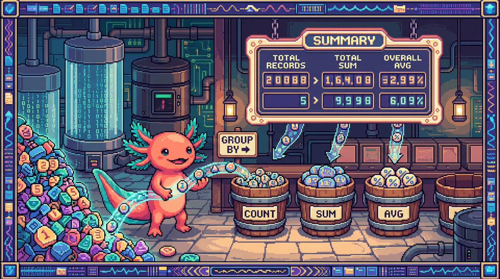

# Capitulo 09 — Agregaciones, GROUP BY y funciones

<p align="center">
  
</p>


> Hasta ahora has aprendido a sacar filas de una tabla: "dame todos los habitos", "dame los proyectos de este usuario". Pero muchas preguntas reales no son sobre filas sueltas, sino sobre *grupos* de filas: ¿cuantos habitos tengo?, ¿cuantos dias seguidos llevo?, ¿que porcentaje de mis proyectos esta terminado? Para responder eso necesitas **agregaciones**: operaciones que toman muchas filas y devuelven un solo numero (o un numero por grupo). En este capitulo Bit, nuestro ajolote, te acompana a contar, sumar, promediar y agrupar datos reales de RachaSimple y Faro.

---

## 1. ¿Por que necesitamos agregar?

Imagina que en RachaSimple tienes una tabla `registros` donde cada vez que completas un habito se guarda una fila: la fecha, el habito y el usuario. Si tienes 200 dias registrados, esa tabla tiene 200 filas. Pero tu no quieres ver 200 filas: quieres ver *un* numero ("llevas 200 dias") o *un numero por habito* ("meditacion: 80 dias, ejercicio: 120 dias").

Pasar de "muchas filas" a "un resumen" es lo que hacen las **funciones de agregacion**. Y cuando quieres ese resumen separado por categorias (por habito, por semana, por proyecto), usas **GROUP BY**.

> ### 🟦 ¿Que significa? — *Agregacion*
> Una **agregacion** es un calculo que toma un conjunto de filas y produce un solo valor resumen: un conteo, una suma, un promedio, un maximo. En vez de devolver datos crudos, devuelve una *conclusion* sobre esos datos.
> **Para que sirve:** responder preguntas de tipo "cuantos", "cuanto", "en promedio", "el mayor".
> **Donde se usa en un repo real:** en RachaSimple, para mostrar "Has completado 47 dias este mes" en el panel del usuario; en Faro, para calcular el progreso de un proyecto a partir de sus fases.

PolyPaw, en cambio, guarda sus datos en archivos JSON sueltos (sin base de datos relacional). Ahi, si quisieras contar cuantas misiones completo un jugador, tendrias que abrir el archivo en Python, recorrer una lista y llevar un contador a mano. SQL te da esa misma cuenta con una sola linea. Esa es justo la diferencia que hace valioso tener una base de datos como la de RachaSimple o Faro.

---

## 2. Las cinco funciones de agregacion basicas

SQL trae cinco funciones que vas a usar todo el tiempo: `COUNT`, `SUM`, `AVG`, `MIN` y `MAX`. Veamoslas con la tabla `registros` de RachaSimple (una fila por dia completado).

> ### 🟦 ¿Que significa? — *COUNT*
> `COUNT` cuenta filas. `COUNT(*)` cuenta todas las filas del grupo; `COUNT(columna)` cuenta solo las filas donde esa columna no es NULL.
> **Para que sirve:** saber "cuantos".
> **Donde se usa en un repo real:** en RachaSimple para contar dias completados; en Faro para contar cuantas fases tiene un proyecto.

```sql
-- ¿Cuantos dias en total he registrado?
select count(*) as total_dias
from registros
where user_id = auth.uid();
```

> ### 🟦 ¿Que significa? — *auth.uid()*
> `auth.uid()` es una funcion que Supabase expone dentro de Postgres y que devuelve el identificador (UUID) del usuario que esta haciendo la consulta en ese momento. La veras en casi todos los ejemplos como `where user_id = auth.uid()`, que significa "solo mis filas".
> **Para que sirve:** filtrar datos por el usuario logueado sin tener que pasarle el id a mano; es la pieza con la que se construyen las politicas de RLS.
> **Donde se usa en un repo real:** en RachaSimple y Faro aparece en consultas y en las politicas de seguridad de cada tabla (registros, habitos, proyectos, fases) para que cada quien vea unicamente lo suyo.

> ### 🟦 ¿Que significa? — *SUM*
> `SUM(columna)` suma todos los valores numericos de una columna dentro del grupo.
> **Para que sirve:** totalizar cantidades (minutos, puntos, dinero).
> **Donde se usa en un repo real:** si en RachaSimple cada registro guardara `minutos_dedicados`, `SUM(minutos_dedicados)` daria el total de minutos invertidos en el habito.

```sql
-- Total de minutos dedicados a habitos este usuario
select sum(minutos_dedicados) as minutos_totales
from registros
where user_id = auth.uid();
```

> ### 🟦 ¿Que significa? — *AVG*
> `AVG(columna)` calcula el promedio (la media aritmetica) de los valores de una columna.
> **Para que sirve:** saber "cuanto en promedio".
> **Donde se usa en un repo real:** el promedio de minutos por sesion en RachaSimple, o el progreso promedio de los proyectos en Faro.

> ### 🟦 ¿Que significa? — *MIN y MAX*
> `MIN(columna)` devuelve el valor mas pequeno del grupo; `MAX(columna)`, el mas grande. Funcionan con numeros, fechas y texto (orden alfabetico).
> **Para que sirve:** encontrar el primero, el ultimo, el mayor, el menor.
> **Donde se usa en un repo real:** en RachaSimple, `MIN(fecha)` es el primer dia que registraste y `MAX(fecha)` el ultimo; en Faro, `MAX(updated_at)` dice cuando se toco un proyecto por ultima vez.

```sql
-- Primer y ultimo dia registrado, y promedio de minutos por sesion
select
  min(fecha)            as primer_dia,
  max(fecha)            as ultimo_dia,
  count(*)              as total_sesiones,
  avg(minutos_dedicados) as promedio_minutos
from registros
where user_id = auth.uid();
```

Fijate que puedes pedir varias agregaciones a la vez en el mismo `SELECT`. El resultado siempre es **una sola fila** con varias columnas, porque estas resumiendo toda la tabla en un solo resumen.

> ### 💡 Tip
> Cuando quieras contar solo cosas *distintas*, usa `COUNT(DISTINCT columna)`. Por ejemplo, `COUNT(DISTINCT habito_id)` te dice *cuantos habitos diferentes* tienes registrados, sin importar cuantas veces aparezca cada uno.

> ### ⚠️ Cuidado
> `COUNT(*)` cuenta filas (incluso si tienen columnas en NULL). `COUNT(columna)` ignora los NULL de esa columna. Si una fila tiene `minutos_dedicados` vacio, `AVG(minutos_dedicados)` no la cuenta y `SUM` la trata como si no existiera. No es lo mismo "promedio de las sesiones con minutos" que "promedio de todas las sesiones".

> ### 🟦 ¿Que significa? — *NULL*
> `NULL` es la ausencia de valor: significa "aqui no hay dato" (distinto de cero o de texto vacio). Las funciones de agregacion, salvo `COUNT(*)`, ignoran los NULL.
> **Para que sirve:** representar datos faltantes u opcionales.
> **Donde se usa en un repo real:** en Faro, un proyecto recien creado puede tener `descripcion` en NULL hasta que la IA la genera; en RachaSimple, un registro sin nota deja la columna `nota` en NULL.

---

## 3. GROUP BY: un resumen por categoria

Hasta aqui hemos resumido *toda* la tabla en una fila. Pero casi siempre quieres el resumen *separado* por algo: por habito, por semana, por proyecto. Para eso esta `GROUP BY`.

> ### 🟦 ¿Que significa? — *GROUP BY*
> `GROUP BY columna` agrupa las filas que comparten el mismo valor en esa columna y aplica las funciones de agregacion *a cada grupo por separado*. En vez de una sola fila de resumen, obtienes una fila por grupo.
> **Para que sirve:** comparar categorias entre si (cuantos por habito, cuanto por proyecto).
> **Donde se usa en un repo real:** en RachaSimple, contar dias completados *por habito*; en Faro, contar fases *por proyecto*.

```sql
-- Cuantos dias he completado de cada habito
select
  habito_id,
  count(*) as dias_completados
from registros
where user_id = auth.uid()
group by habito_id
order by dias_completados desc;
```

La idea mental: SQL toma todas tus filas, las reparte en montones segun `habito_id`, y cuenta cada monton. El resultado es una fila por habito con su conteo.

> ### ⚠️ Cuidado
> Regla de oro del `GROUP BY`: en el `SELECT`, **cada columna debe estar agregada (con COUNT, SUM, etc.) o aparecer en el GROUP BY**. Si pones una columna suelta que no esta agrupada ni agregada, Postgres te dara un error como "column must appear in the GROUP BY clause". Esto es porque SQL no sabria *cual* de los muchos valores del grupo mostrarte.

> ### 🔎 En tu codigo
> En RachaSimple el cliente normalmente usa Supabase con TanStack Query. Para una agregacion mas elaborada que un `.select()` simple, lo limpio es crear una *vista* o una funcion en Postgres y llamarla desde el cliente:
> ```ts
> // RachaSimple: leer el resumen por habito desde una vista
> const { data, error } = await supabase
>   .from("resumen_por_habito") // una view que ya hace el GROUP BY
>   .select("habito_id, dias_completados")
>   .order("dias_completados", { ascending: false });
> ```
> Asi la logica de agregacion vive en la base de datos (rapida y con RLS aplicada) y el front solo la consume.

> ### 🟦 ¿Que significa? — *RLS (Row Level Security)*
> Es una funcion de Postgres (y Supabase) que filtra automaticamente las filas segun quien hace la consulta, mediante *politicas*. Aunque escribas `select * from registros`, RLS solo te devuelve *tus* filas.
> **Para que sirve:** que cada usuario vea solo sus datos sin tener que recordar el `where user_id = ...` en cada consulta.
> **Donde se usa en un repo real:** RachaSimple y Faro tienen RLS en todas sus tablas (registros, habitos, perfiles, proyectos, fases, conexiones de usuario). Por eso muchos ejemplos podrian funcionar incluso sin el `where user_id`, porque RLS ya filtra.

---

## 4. HAVING: filtrar grupos

Ya sabes que `WHERE` filtra *filas* antes de agrupar. Pero, ¿como filtras los *grupos*? Por ejemplo: "muestrame solo los habitos que he completado mas de 30 dias". Eso es una condicion sobre el *resultado de un COUNT*, y `WHERE` no puede verlo todavia. Para eso existe `HAVING`.

> ### 🟦 ¿Que significa? — *HAVING*
> `HAVING` es como `WHERE`, pero se aplica *despues* de agrupar, sobre los valores agregados. Filtra grupos completos segun su resumen.
> **Para que sirve:** quedarte solo con los grupos que cumplen una condicion calculada (conteo, suma, promedio).
> **Donde se usa en un repo real:** en RachaSimple, mostrar solo los habitos "consolidados" (mas de 30 dias); en Faro, listar proyectos con mas de 5 fases.

```sql
-- Habitos en los que llevo mas de 30 dias completados
select
  habito_id,
  count(*) as dias_completados
from registros
where user_id = auth.uid()      -- filtra filas: solo mis registros
group by habito_id
having count(*) > 30            -- filtra grupos: solo los de mas de 30
order by dias_completados desc;
```

> ### 💡 Tip
> Orden mental de una consulta con grupos: primero **WHERE** descarta filas, luego **GROUP BY** arma los montones, luego se calculan las agregaciones, luego **HAVING** descarta montones, y al final **ORDER BY** ordena el resultado. Si recuerdas ese orden, nunca confundiras WHERE con HAVING.

> ### ⚠️ Cuidado
> No metas condiciones de *fila* en `HAVING` ni condiciones de *grupo* en `WHERE`. `where minutos > 10` (fila) y `having count(*) > 30` (grupo) van en sitios distintos. Mezclarlos da errores o resultados raros.

---

## 5. Funciones de fecha utiles: contar por semana

Un caso clasico de RachaSimple: "cuantos habitos complete cada semana". El problema es que cada registro tiene una *fecha exacta* (2026-06-26), no una "semana". Necesitamos agrupar fechas distintas dentro de la misma semana. Para eso usamos funciones de fecha.

> ### 🟦 ¿Que significa? — *DATE_TRUNC*
> `date_trunc('unidad', fecha)` "recorta" una fecha a la unidad que pidas: `'week'`, `'month'`, `'day'`, `'year'`. Todas las fechas de la misma semana se convierten en el mismo valor (el lunes de esa semana).
> **Para que sirve:** agrupar fechas distintas en periodos (semana, mes) para poder contarlas juntas.
> **Donde se usa en un repo real:** en RachaSimple, para la grafica de "habitos por semana"; en Faro, para ver actividad por mes.

```sql
-- Habitos completados por semana
select
  date_trunc('week', fecha)::date as semana,
  count(*)                        as completados
from registros
where user_id = auth.uid()
group by date_trunc('week', fecha)
order by semana;
```

Aqui `date_trunc('week', fecha)` convierte, por ejemplo, el lunes 22, el miercoles 24 y el viernes 26 todos al "lunes 22", asi que las tres filas caen en el mismo grupo y `count(*)` da 3 para esa semana. El `::date` es una conversion de tipo para mostrar solo la fecha sin la hora.

> ### 🟦 ¿Que significa? — *Conversion de tipo (cast)*
> El `::tipo` (por ejemplo `::date` o `::int`) convierte un valor de un tipo a otro. `valor::date` quita la parte de hora de una fecha-hora.
> **Para que sirve:** mostrar o comparar datos en el formato correcto.
> **Donde se usa en un repo real:** en RachaSimple, mostrar la semana como fecha limpia; en Faro, convertir texto a numero al calcular progreso.

Otras funciones de fecha que veras seguido:

> ### 🟦 ¿Que significa? — *EXTRACT y AGE*
> `extract(dow from fecha)` saca un trozo de la fecha (`dow` = dia de la semana, 0=domingo; tambien `month`, `year`, `hour`). `age(fecha1, fecha2)` da la diferencia entre dos fechas como un intervalo legible (ej. "3 days").
> **Para que sirve:** analizar patrones (¿en que dia de la semana fallo mas?) o medir antiguedad.
> **Donde se usa en un repo real:** en RachaSimple, ver en que dia de la semana se rompe mas la racha; en Faro, `age(now(), created_at)` para "este proyecto tiene 2 meses".

```sql
-- ¿En que dia de la semana completo mas habitos?
select
  extract(dow from fecha) as dia_semana,  -- 0=domingo ... 6=sabado
  count(*)                as completados
from registros
where user_id = auth.uid()
group by extract(dow from fecha)
order by completados desc;
```

> ### 💡 Tip
> En Postgres `now()` te da la fecha-hora actual y `current_date` solo la fecha de hoy. Para "lo de los ultimos 7 dias" usa `where fecha >= current_date - interval '7 days'`. Ese `interval` es la forma de restar tiempo.

---

## 6. Funciones de texto utiles

A veces necesitas limpiar o transformar texto antes de agrupar o mostrar. Estas son las mas comunes en RachaSimple y Faro.

> ### 🟦 ¿Que significa? — *Funciones de texto (LOWER, UPPER, LENGTH, TRIM, CONCAT, ||)*
> `lower(t)` y `upper(t)` cambian a minusculas/mayusculas; `length(t)` da el numero de caracteres; `trim(t)` quita espacios sobrantes a los lados; `concat(a, b)` y el operador `||` unen textos.
> **Para que sirve:** normalizar texto (para que "Ejercicio" y "ejercicio" cuenten igual) y armar etiquetas legibles.
> **Donde se usa en un repo real:** en Faro, para mostrar el nombre del proyecto en mayuscula inicial o juntar "nombre + estado"; en RachaSimple, para que los nombres de habito se comparen sin importar mayusculas.

```sql
-- Normalizar el nombre del habito y contar sin que mayusculas separen grupos
select
  lower(trim(nombre)) as habito_normalizado,
  count(*)            as veces
from habitos
where user_id = auth.uid()
group by lower(trim(nombre))
order by veces desc;
```

```sql
-- Faro: armar una etiqueta legible juntando nombre y estado
select
  nombre || ' (' || estado || ')' as etiqueta
from proyectos
where user_id = auth.uid();
```

> ### ⚠️ Cuidado
> Si concatenas con `||` y una de las partes es NULL, *todo el resultado se vuelve NULL*. Si `estado` puede estar vacio, protegelo con `COALESCE` (lo vemos en la seccion 8) para no terminar con etiquetas en NULL.

---

## 7. CASE: clasificar dentro de la consulta

`CASE` es el "si... entonces... si no..." de SQL. Te deja crear categorias o etiquetas calculadas sobre la marcha, y es potentisimo combinado con agregaciones.

> ### 🟦 ¿Que significa? — *CASE*
> `CASE WHEN condicion THEN valor ... ELSE otro END` evalua condiciones en orden y devuelve el primer `valor` cuya condicion sea verdadera; si ninguna lo es, devuelve el `ELSE`.
> **Para que sirve:** clasificar, etiquetar o transformar valores fila por fila sin salir de SQL.
> **Donde se usa en un repo real:** en Faro, traducir el progreso numerico a un estado ("En curso", "Casi listo"); en RachaSimple, marcar si un dia fue laborable o fin de semana.

```sql
-- RachaSimple: clasificar cada registro y contar por categoria
select
  case
    when extract(dow from fecha) in (0, 6) then 'fin de semana'
    else 'entre semana'
  end as tipo_dia,
  count(*) as completados
from registros
where user_id = auth.uid()
group by 1   -- agrupa por la primera columna del SELECT (el CASE)
order by completados desc;
```

Un truco muy util es `CASE` *dentro* de un `SUM` para contar condicionalmente:

```sql
-- Faro: por proyecto, cuantas fases hechas vs total
select
  proyecto_id,
  count(*) as fases_totales,
  sum(case when completada then 1 else 0 end) as fases_hechas
from fases
where user_id = auth.uid()
group by proyecto_id;
```

Aqui `sum(case when completada then 1 else 0 end)` pone un 1 por cada fase completada y un 0 por cada una que no, y suma: el resultado es *cuantas fases estan hechas*. Es la forma clasica de "contar solo las que cumplen una condicion" dentro de un grupo.

> ### 💡 Tip
> `group by 1` significa "agrupa por la primera columna del SELECT". Es comodo cuando esa columna es una expresion larga (como un CASE) y no quieres repetirla. Funciona igual con `order by 1`, `order by 2`, etc.

---

## 8. COALESCE: un valor de respaldo para los NULL

Los NULL son utiles, pero a veces molestan: no quieres mostrar "null" en pantalla ni que un NULL rompa un calculo. `COALESCE` resuelve eso.

> ### 🟦 ¿Que significa? — *COALESCE*
> `coalesce(a, b, c)` devuelve el primer argumento que *no* sea NULL. Si `a` tiene valor, devuelve `a`; si `a` es NULL, prueba `b`; y asi.
> **Para que sirve:** poner un valor por defecto cuando un dato falta, para no mostrar ni sumar NULL.
> **Donde se usa en un repo real:** en Faro, mostrar "Sin descripcion" cuando la IA aun no genero el texto; en RachaSimple, tratar los minutos vacios como 0.

```sql
-- Faro: nunca mostrar NULL en la descripcion
select
  nombre,
  coalesce(descripcion, 'Sin descripcion aun') as descripcion
from proyectos
where user_id = auth.uid();
```

```sql
-- RachaSimple: tratar minutos faltantes como 0 antes de sumar
select
  habito_id,
  sum(coalesce(minutos_dedicados, 0)) as minutos_totales
from registros
where user_id = auth.uid()
group by habito_id;
```

> ### ⚠️ Cuidado
> No abuses de `COALESCE(columna, 0)` dentro de `AVG`. Convertir los NULL en 0 *baja* el promedio, porque ahora cuentan como sesiones de 0 minutos. Si lo que quieres es el promedio de las sesiones que *si* tienen minutos, deja que `AVG` ignore los NULL por su cuenta.

---

## 9. Caso real: progreso por proyecto en Faro

Faro calcula el progreso de cada proyecto como porcentaje de fases completadas. Juntemos casi todo lo del capitulo en una sola consulta.

```sql
-- Faro: progreso (%) de cada proyecto segun sus fases
select
  p.id,
  p.nombre,
  count(f.id) as fases_totales,
  sum(case when f.completada then 1 else 0 end) as fases_hechas,
  round(
    100.0 * sum(case when f.completada then 1 else 0 end)
          / nullif(count(f.id), 0)
  ) as progreso_pct
from proyectos p
left join fases f on f.proyecto_id = p.id
where p.user_id = auth.uid()
group by p.id, p.nombre
order by progreso_pct desc nulls last;
```

Vamos por partes, que aqui hay varias ideas nuevas trabajando juntas:

- `left join fases` trae todas las fases de cada proyecto. Usamos `LEFT JOIN` (no `JOIN` normal) para que un proyecto *sin fases* aun aparezca, con `count(f.id) = 0`.
- `sum(case when f.completada then 1 else 0 end)` cuenta las fases hechas (truco de la seccion 7).
- `100.0 * hechas / totales` da el porcentaje. Ponemos `100.0` (con decimal) para forzar division con decimales; si pusieramos `100` entero, Postgres haria division entera y un proyecto a medias daria 0%.
- `round(...)` redondea a un numero entero bonito para la interfaz.

> ### 🟦 ¿Que significa? — *NULLIF*
> `nullif(a, b)` devuelve NULL si `a` es igual a `b`, y `a` en caso contrario.
> **Para que sirve:** sobre todo, evitar la division por cero. `count / nullif(total, 0)` convierte un divisor de 0 en NULL, y dividir entre NULL da NULL en lugar de un error.
> **Donde se usa en un repo real:** en Faro, para que un proyecto sin fases no rompa el calculo de progreso (da NULL, no un crash).

> ### 🟦 ¿Que significa? — *LEFT JOIN*
> `LEFT JOIN` combina dos tablas conservando *todas* las filas de la tabla izquierda, aunque no tengan pareja en la derecha (esas parejas faltantes salen como NULL). Un `JOIN` normal descartaria las que no emparejan.
> **Para que sirve:** no perder los registros "sin hijos" (proyectos sin fases, habitos sin registros).
> **Donde se usa en un repo real:** en Faro, listar todos los proyectos aunque alguno no tenga fases todavia.

> ### 🔎 En tu codigo
> En Faro, este calculo suele vivir en una vista o funcion de Postgres y se consume desde Next.js:
> ```ts
> // Faro: leer el progreso ya calculado por la base de datos
> const { data } = await supabase
>   .from("vista_progreso_proyectos")
>   .select("id, nombre, progreso_pct")
>   .order("progreso_pct", { ascending: false, nullsFirst: false });
> ```
> Nota que el progreso de Faro es *hibrido*: a veces lo ajusta la IA (OpenAI). Esta consulta da la parte "objetiva" (milestones/fases) que luego se combina con la sugerencia de la IA.

---

## 10. Caso real: la racha mas larga en RachaSimple

La pregunta estrella de una app de habitos: "¿cual es mi racha mas larga de dias seguidos?". Esto es mas dificil de lo que parece, porque hay que detectar tramos de fechas *consecutivas*. Hay un truco clasico en SQL para esto, y aunque usa cosas que veras a fondo mas adelante (funciones de ventana), vale la pena verlo como meta.

```sql
-- RachaSimple: racha mas larga de dias consecutivos
with dias as (
  select distinct fecha
  from registros
  where user_id = auth.uid()
),
grupos as (
  select
    fecha,
    -- a cada fecha le restamos su numero de orden; los dias seguidos
    -- comparten el mismo "ancla", asi que forman un grupo
    fecha - (row_number() over (order by fecha))::int as ancla
  from dias
)
select
  count(*)    as racha_dias,
  min(fecha)  as inicio,
  max(fecha)  as fin
from grupos
group by ancla
order by racha_dias desc
limit 1;
```

La intuicion: si tomas dias consecutivos (22, 23, 24) y a cada uno le restas su posicion en la lista (1, 2, 3), todos dan el mismo numero "ancla". Cuando hay un hueco, el ancla cambia. Asi que agrupar por `ancla` te separa los tramos de dias seguidos, y `count(*)` mide cada tramo. El `order by ... limit 1` se queda con el tramo mas largo: tu racha record.

> ### 🟦 ¿Que significa? — *CTE (clausula WITH)*
> Un **CTE** (Common Table Expression) es una consulta con nombre, definida con `WITH`, que puedes usar como si fuera una tabla temporal dentro de la consulta principal. Sirve para partir un problema grande en pasos legibles.
> **Para que sirve:** ordenar la logica en etapas (primero `dias`, luego `grupos`, luego el resumen) en vez de una consulta gigante e ilegible.
> **Donde se usa en un repo real:** en RachaSimple, para el calculo de rachas; en Faro, para reportes de progreso que combinan varias tablas.

> ### 🟦 ¿Que significa? — *Funcion de ventana (ROW_NUMBER, OVER)*
> Una **funcion de ventana** calcula un valor mirando un conjunto de filas relacionadas *sin colapsarlas en una sola* (a diferencia de las agregaciones). `row_number() over (order by fecha)` numera las filas 1, 2, 3... segun la fecha.
> **Para que sirve:** numerar, rankear o comparar filas vecinas. Es un tema grande que tiene su propio capitulo mas adelante.
> **Donde se usa en un repo real:** el truco de la racha en RachaSimple depende de `row_number()`.

> ### 💡 Tip
> No te agobies si la consulta de la racha te parece magia. Es un patron avanzado; aqui lo importante es que entiendas *que* hace cada agregacion (`count`, `min`, `max`) y que reconozcas un `WITH`. Las funciones de ventana las dominaras en su propio capitulo.

> ### 🔎 En tu codigo
> En RachaSimple lo practico es encapsular esto en una funcion de Postgres (`get_longest_streak`) y llamarla con RPC desde el cliente:
> ```ts
> // RachaSimple: pedir la racha mas larga calculada en la base de datos
> const { data, error } = await supabase.rpc("get_longest_streak");
> // data -> { racha_dias, inicio, fin }
> ```
> Asi el calculo pesado ocurre en Postgres (con RLS aplicada) y TanStack Query cachea el resultado en el front.

---

## 11. Por que esto no existe igual en PolyPaw

Conviene cerrar contrastando. PolyPaw guarda sus datos en archivos JSON: una lista de misiones, un objeto por jugador. No hay tablas ni SQL. Para "contar misiones completadas por semana" tendrias que, en Python, abrir el JSON, recorrer la lista con un bucle, parsear cada fecha, agrupar a mano en un diccionario y sumar. Funciona para pocos datos, pero todo el peso recae en tu codigo.

En RachaSimple y Faro, con Postgres detras, esa misma pregunta es un `GROUP BY` de tres lineas que ademas respeta RLS (cada quien ve solo lo suyo) y se ejecuta cerca de los datos. Esa es la ventaja de tener una base de datos relacional: las preguntas de resumen se vuelven triviales y seguras. Bit lo resume asi: *en JSON cuentas tu; en SQL, cuenta la base de datos por ti.*

---

## ✅ Checklist — ¿ya domino esto?

- [ ] Se que una agregacion convierte muchas filas en un valor resumen.
- [ ] Uso `COUNT`, `SUM`, `AVG`, `MIN` y `MAX`, y se que `COUNT(*)` cuenta filas y `COUNT(col)` ignora NULL.
- [ ] Entiendo que `GROUP BY` hace un resumen por cada categoria, una fila por grupo.
- [ ] Recuerdo la regla: en el SELECT, toda columna va agregada o en el GROUP BY.
- [ ] Distingo `WHERE` (filtra filas, antes de agrupar) de `HAVING` (filtra grupos, despues de agrupar).
- [ ] Uso `date_trunc` para agrupar fechas por semana o mes, y `extract` para sacar dia/mes/ano.
- [ ] Aplico funciones de texto (`lower`, `trim`, `||`) para normalizar y armar etiquetas.
- [ ] Uso `CASE` para clasificar, incluido el truco `sum(case when ... then 1 else 0 end)`.
- [ ] Uso `COALESCE` para dar valores de respaldo a los NULL y `NULLIF` para evitar dividir entre cero.
- [ ] Entiendo a grandes rasgos como se calcula el progreso por proyecto (Faro) y la racha mas larga (RachaSimple).

---

## 🧪 Ejercicios

1. 💻 En el editor SQL de Supabase de RachaSimple, escribe una consulta que devuelva, en una sola fila, el total de dias registrados (`count`), tu primer dia (`min(fecha)`) y tu ultimo dia (`max(fecha)`).

2. 💻 Escribe una consulta con `GROUP BY habito_id` que cuente los dias completados de cada habito y los ordene de mayor a menor. Luego agregale un `HAVING` para mostrar solo los habitos con mas de 10 dias.

3. 💻 Usa `date_trunc('week', fecha)` para contar cuantos habitos completaste por semana en el ultimo mes. Anade `where fecha >= current_date - interval '30 days'`.

4. 💻 En Faro, escribe la consulta de progreso por proyecto de la seccion 9, pero protege el caso de proyectos sin fases con `nullif`. Comprueba que un proyecto sin fases sale con progreso NULL y no rompe la consulta.

5. Sin computadora: explica con tus palabras la diferencia entre `WHERE` y `HAVING`, y pon un ejemplo de cada uno usando la tabla `registros`. Pista: una condicion sobre `fecha` vs. una condicion sobre `count(*)`.

6. 💻 Reto: usando `CASE`, clasifica tus registros en "entre semana" y "fin de semana" (con `extract(dow ...)`) y cuenta cuantos hay de cada tipo. ¿En cual eres mas constante? Comparte el resultado con Bit.
