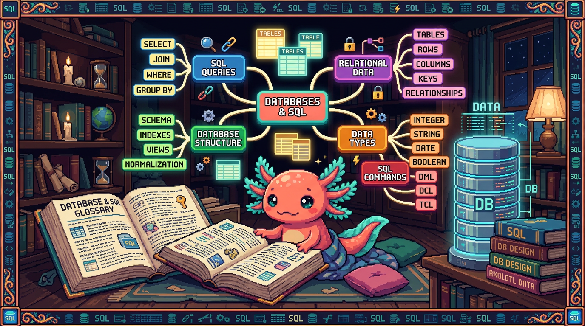

# Capitulo 15 — Glosario de bases de datos y mapa

<p align="center">
  
</p>


> Hola otra vez. Soy **Bit**, tu ajolote guia. Llegaste al final del Modulo 07 y eso merece un aplauso con mis cuatro patitas. Este capitulo es distinto: no hay teoria nueva pesada. Es un **glosario** ordenado de la A a la Z con todos los terminos que vimos, cada uno explicado en una o dos lineas, mas un **mapa mental** para ver como encaja todo. Piensa en este capitulo como el mapa que dejas pegado en la pared: cuando se te olvide que era un `JOIN` o que rayos es la RLS, vuelves aqui, lo lees en diez segundos y sigues. Vamos despacito y al final te digo como sigue la aventura en el Modulo 08.

---

## 1. Como usar este glosario

Cada termino viene en un recuadro con tres cosas: **que significa** (en palabras de cocina, sin tecnicismos), **para que sirve** y **donde se usa en un repo real** de los tuyos. Los repos que vamos a citar son siempre estos cinco, ni uno mas:

- **tunal-digital** — un sitio web hecho con HTML, CSS y JavaScript a mano (vanilla). No tiene base de datos.
- **PolyPaw** — app en Python con Flet que guarda sus datos en **archivos JSON**. Tampoco usa base de datos relacional. Nos sirve para **contrastar**.
- **RachaSimple** — app de habitos con **Supabase/Postgres**: tablas de habitos, registros de racha y perfiles, con RLS y TanStack Query.
- **Faro/Organizer** — app en **Next.js + Supabase/Postgres**: proyectos, fases y conexiones de usuario, con RLS, y usa OpenAI para analizar.
- **polypaw-nas** — un servidor casero con Ubuntu, Samba, Cockpit y Tailscale. Guarda archivos, no es base de datos.

> ### 💡 Tip
> Casi todos los ejemplos de SQL los puedes pegar tal cual en el **editor SQL de Supabase** (panel web). Es como tener una libreta donde pruebas frases y la base de datos te responde al instante.

---

## 2. Glosario alfabetico

### A

> ### 🟦 ¿Que significa? — *Agregacion*
> Tomar muchas filas y resumirlas en **un solo numero**: contar, sumar, promediar. Sirve para responder preguntas tipo "¿cuantos?" o "¿cuanto en total?". En **RachaSimple** la usamos para contar cuantos registros de racha tiene un habito.

> ### 🟦 ¿Que significa? — *Alias*
> Un **apodo** corto que le pones a una tabla o columna en la consulta con `as`. Sirve para escribir menos y leer mejor. En **Faro** un `select` largo de proyectos puede usar `p` como alias de la tabla `proyectos`.

### B

> ### 🟦 ¿Que significa? — *Base de datos*
> Un lugar organizado donde se guardan datos para buscarlos y cambiarlos rapido y sin perderlos. Sirve para que la app recuerde cosas entre sesiones. **RachaSimple** y **Faro** tienen una base de datos Postgres en Supabase; **PolyPaw** NO (guarda todo en archivos JSON).

> ### 🟦 ¿Que significa? — *Backup (respaldo)*
> Una copia de seguridad de los datos por si algo se rompe. Sirve para dormir tranquilo. En **polypaw-nas** los respaldos son copias de archivos por Samba; en **Supabase** la plataforma respalda la base Postgres por ti.

### C

> ### 🟦 ¿Que significa? — *Clave primaria (primary key)*
> Una columna cuyo valor es **unico** para cada fila e identifica esa fila sin confusion (normalmente un `id`). Sirve para senalar "esta fila y no otra". En **RachaSimple**, cada fila de la tabla `habitos` tiene su `id` como clave primaria.

> ### 🟦 ¿Que significa? — *Clave foranea (foreign key)*
> Una columna que **apunta** a la clave primaria de otra tabla, creando un vinculo entre ambas. Sirve para conectar datos relacionados sin repetirlos. En **Faro**, la tabla `fases` tiene un `proyecto_id` que apunta al `id` de la tabla `proyectos`.

> ### 🟦 ¿Que significa? — *Columna (campo)*
> Cada uno de los datos que describe una fila; es una "casilla" con nombre y tipo. Sirve para guardar un dato concreto. En **RachaSimple**, la tabla `perfiles` tiene columnas como `nombre` y `creado_en`.

> ### 🟦 ¿Que significa? — *Consulta (query)*
> Una pregunta que le haces a la base de datos en lenguaje SQL. Sirve para leer, filtrar o cambiar datos. En **Faro** cada vez que abres tu lista de proyectos se dispara una consulta a Postgres.

```sql
-- Una consulta simple en RachaSimple: traer todos los habitos
select * from habitos;
```

### D

> ### 🟦 ¿Que significa? — *Dato*
> La pieza minima de informacion: un nombre, una fecha, un numero. Sirve para describir algo del mundo real. En **PolyPaw** un dato puede ser el nombre de una mascota guardado en un JSON; en **RachaSimple** ese mismo tipo de dato vive en una columna de Postgres.

> ### 🟦 ¿Que significa? — *DELETE*
> La orden SQL para **borrar** filas. Sirve para eliminar datos que ya no quieres. En **RachaSimple**, borrar un habito que abandonaste usa `delete`.

```sql
-- Borrar el habito con id 7 (¡siempre con WHERE!)
delete from habitos where id = 7;
```

> ### ⚠️ Cuidado
> `delete` **sin** `where` borra **toda** la tabla. Bit ha visto a humanos sudar frio por esto. Antes de borrar, prueba con un `select` que tenga el mismo `where` para ver que filas van a desaparecer.

### E

> ### 🟦 ¿Que significa? — *Editor SQL (de Supabase)*
> Una pantalla web donde escribes SQL y ves la respuesta al instante, sin instalar nada. Sirve para probar y aprender. Tanto **RachaSimple** como **Faro** comparten que su Postgres vive en Supabase, asi que su editor SQL es donde practicas.

> ### 🟦 ¿Que significa? — *Esquema (schema)*
> El "plano" de la base de datos: que tablas existen, sus columnas y sus tipos. Sirve para saber como esta organizado todo. En **Faro** el esquema incluye `proyectos`, `fases` y `conexiones_usuario`.

### F

> ### 🟦 ¿Que significa? — *Fila (registro / row)*
> Una linea completa de una tabla; representa **una cosa** (un habito, un proyecto). Sirve para guardar un elemento entero con todos sus datos. En **RachaSimple**, cada fila de `registros_racha` es un dia marcado como cumplido.

> ### 🟦 ¿Que significa? — *Filtro*
> Quedarte solo con las filas que cumplen una condicion, usando `where`. Sirve para no traer todo, solo lo que te importa. En **Faro**, filtrar proyectos por usuario es lo que evita que veas los proyectos de otros.

### G

> ### 🟦 ¿Que significa? — *GROUP BY*
> Agrupar filas que comparten un valor para resumirlas juntas (casi siempre con una agregacion). Sirve para responder "¿cuanto por cada categoria?". En **RachaSimple**, agrupar `registros_racha` por `habito_id` te dice cuantas marcas tiene cada habito.

```sql
-- Cuantos registros de racha tiene cada habito
select habito_id, count(*) as total
from registros_racha
group by habito_id;
```

### H

> ### 🟦 ¿Que significa? — *HAVING*
> Como un `where`, pero para filtrar **despues** de agrupar con `group by`. Sirve para quedarte solo con grupos que cumplen algo. En **RachaSimple**, mostrar solo habitos con mas de 10 registros usa `having`.

```sql
select habito_id, count(*) as total
from registros_racha
group by habito_id
having count(*) > 10;
```

### I

> ### 🟦 ¿Que significa? — *Indice (index)*
> Una estructura extra que la base crea para **encontrar filas rapido**, como el indice al final de un libro. Sirve para que las busquedas no tarden. En **Faro**, una columna como `proyecto_id` que se busca mucho se beneficia de un indice.

> ### 🟦 ¿Que significa? — *INSERT*
> La orden SQL para **agregar** filas nuevas. Sirve para meter datos. En **RachaSimple**, marcar el habito de hoy hace un `insert` en `registros_racha`.

```sql
insert into registros_racha (habito_id, fecha)
values (3, '2026-06-26');
```

### J

> ### 🟦 ¿Que significa? — *JOIN*
> Unir dos tablas en una sola respuesta combinando sus filas por una columna en comun (normalmente clave primaria con clave foranea). Sirve para juntar datos que viven separados. En **Faro**, un `join` une `proyectos` con sus `fases` para mostrarlas en la misma pantalla.

```sql
-- Cada proyecto con el nombre de sus fases (Faro)
select proyectos.nombre, fases.titulo
from proyectos
join fases on fases.proyecto_id = proyectos.id;
```

> ### 💡 Tip
> El `join` se lee asi: "pegame las filas de `fases` donde su `proyecto_id` coincida con el `id` del proyecto". Si la condicion del `on` esta mal, te salen combinaciones que no tienen sentido.

### K

> ### 🟦 ¿Que significa? — *Key (llave)*
> Palabra inglesa para "clave". Cuando leas `primary key` o `foreign key` en codigo, es lo mismo que clave primaria y clave foranea. Aparece en las migraciones de **RachaSimple** y **Faro** al definir las tablas.

### L

> ### 🟦 ¿Que significa? — *LIMIT*
> Recortar la respuesta a un numero maximo de filas. Sirve para no traer miles de filas cuando solo quieres ver unas pocas. En **Faro**, mostrar "los ultimos 5 proyectos" usa `limit 5`.

```sql
select * from proyectos order by creado_en desc limit 5;
```

### M

> ### 🟦 ¿Que significa? — *Migracion*
> Un archivo con instrucciones SQL que **cambia la estructura** de la base (crear tablas, agregar columnas) de forma ordenada y repetible. Sirve para que todos tengan la misma base y haya historial de cambios. En **Faro**, crear la tabla `fases` fue una migracion.

> ### 🟦 ¿Que significa? — *Milestone (hito)*
> Un punto importante marcado dentro de un proyecto. Sirve para medir avance. En **Faro**, el progreso de un proyecto se calcula de forma hibrida entre **milestones** cumplidos y lo que sugiere la IA.

### N

> ### 🟦 ¿Que significa? — *NULL*
> Un valor especial que significa "**no hay dato aqui**" (vacio), distinto de cero o de texto vacio. Sirve para representar informacion ausente. En **Faro**, un proyecto recien creado puede tener `descripcion` en `null` hasta que la IA la genere.

> ### ⚠️ Cuidado
> `null` no se compara con `=`. Para preguntar si algo esta vacio se usa `is null` o `is not null`, no `= null`. Es una trampa clasica de principiante.

### O

> ### 🟦 ¿Que significa? — *OAuth*
> Una forma segura de iniciar sesion usando otra cuenta (Google, GitHub) sin darle tu contrasena a la app. Sirve para autenticarte sin manejar passwords. En **Faro**, conectas tu GitHub y Google Drive por **OAuth** a traves de Supabase Auth.

> ### 🟦 ¿Que significa? — *OpenAI*
> Un servicio de inteligencia artificial que recibe texto y genera respuestas. Sirve para automatizar redaccion o analisis. En **Faro**, OpenAI genera la descripcion, el estado y el roadmap de cada proyecto.

> ### 🟦 ¿Que significa? — *ORDER BY*
> Ordenar las filas de la respuesta por una columna, ascendente (`asc`) o descendente (`desc`). Sirve para presentar datos en un orden util. En **RachaSimple**, los registros de racha se ordenan por `fecha`.

### P

> ### 🟦 ¿Que significa? — *Postgres (PostgreSQL)*
> Una base de datos relacional gratuita y muy robusta; es la que usa Supabase por debajo. Sirve para guardar datos en tablas con SQL. **RachaSimple** y **Faro** corren sobre Postgres; **PolyPaw** no usa Postgres (usa JSON).

> ### 🟦 ¿Que significa? — *Politica (policy de RLS)*
> Una regla escrita en SQL que dice **quien puede ver o tocar que filas**. Sirve para que cada usuario acceda solo a lo suyo. En **RachaSimple**, una politica deja que cada persona vea unicamente sus propios habitos.

```sql
-- Politica: cada quien solo ve sus habitos (RachaSimple)
create policy "ver mis habitos"
on habitos for select
using (auth.uid() = usuario_id);
```

> ### 🟦 ¿Que significa? — *Primary key*
> Es el termino en ingles de **clave primaria** (ver mas arriba). Lo veras tal cual en las migraciones de **Faro** y **RachaSimple**.

### Q

> ### 🟦 ¿Que significa? — *Query*
> Termino en ingles para **consulta** (ver "C"). En **Faro**, las queries a Postgres pasan por el cliente de Supabase desde Next.js.

### R

> ### 🟦 ¿Que significa? — *Relacion / relacional*
> Que las tablas se conectan entre si por claves (relaciones). Una base "relacional" organiza datos en tablas vinculadas. **RachaSimple** y **Faro** son relacionales; **PolyPaw**, con sus JSON sueltos, no lo es.

> ### 🟦 ¿Que significa? — *RLS (Row Level Security)*
> Seguridad a **nivel de fila**: Postgres revisa, fila por fila, si tienes permiso, segun las politicas. Sirve para proteger datos privados aunque compartan tabla. En **Faro** y **RachaSimple**, la RLS impide que un usuario lea datos de otro.

> ### 🟦 ¿Que significa? — *Roadmap*
> Una lista ordenada de lo que falta por hacer en un proyecto. Sirve para ver el camino. En **Faro**, la IA genera el roadmap de cada proyecto y tu lo vas marcando.

### S

> ### 🟦 ¿Que significa? — *SELECT*
> La orden SQL para **leer** datos: dices que columnas quieres y de que tabla. Sirve para consultar sin cambiar nada. En **RachaSimple**, ver tu lista de habitos es un `select` sobre la tabla `habitos`.

```sql
select nombre, creado_en from habitos;
```

> ### 🟦 ¿Que significa? — *SQL*
> El idioma para hablar con bases de datos relacionales (Structured Query Language). Sirve para leer, agregar, cambiar y borrar datos. Lo usas en **RachaSimple** y **Faro**; en **PolyPaw** no, porque ahi se leen archivos JSON con Python.

> ### 🟦 ¿Que significa? — *Supabase*
> Una plataforma que te da Postgres, autenticacion (Auth), almacenamiento y APIs listas, todo alrededor de una base de datos. Sirve para tener backend sin montar servidores. **RachaSimple** y **Faro** usan Supabase.

```ts
// Cliente de Supabase leyendo habitos (RachaSimple, TypeScript)
const { data, error } = await supabase
  .from('habitos')
  .select('id, nombre');
```

> ### 🔎 En tu codigo
> En **RachaSimple** ese `supabase.from('habitos').select(...)` por debajo se traduce a un `select` de SQL contra Postgres. El cliente te ahorra escribir SQL a mano, pero la RLS sigue mandando: solo recibes tus filas.

### T

> ### 🟦 ¿Que significa? — *Tabla*
> Una cuadricula con filas y columnas que guarda cosas del mismo tipo (todos los habitos, todos los proyectos). Sirve para organizar datos parecidos juntos. En **RachaSimple** hay tablas `habitos`, `registros_racha` y `perfiles`.

> ### 🟦 ¿Que significa? — *TanStack Query*
> Una libreria del frontend que pide datos al servidor, los guarda en cache y los refresca solito. Sirve para no recargar de mas y mantener la pantalla al dia. En **RachaSimple** maneja las consultas a Supabase desde la interfaz.

> ### 🟦 ¿Que significa? — *Tipo (de dato)*
> La clase de dato que admite una columna: texto, numero, fecha, booleano (verdadero/falso). Sirve para que la base valide y guarde bien. En **Faro**, `creado_en` es de tipo fecha-hora y `nombre` es de tipo texto.

> ### 🟦 ¿Que significa? — *Transaccion*
> Un grupo de cambios que se aplican **todos o ninguno**: si uno falla, se deshace todo. Sirve para no dejar datos a medias. En **RachaSimple**, crear un habito y su primer registro juntos puede ir en una transaccion para que no quede uno sin el otro.

> ### 💡 Tip
> Piensa en una transaccion como un sobre que cierras: o entregas el sobre completo o no entregas nada. Asi la base nunca queda en un estado raro a la mitad.

### U

> ### 🟦 ¿Que significa? — *UPDATE*
> La orden SQL para **cambiar** datos de filas que ya existen. Sirve para corregir o actualizar. En **Faro**, cuando la IA genera la descripcion de un proyecto, se hace un `update` de la fila.

```sql
update proyectos
set descripcion = 'App de habitos diarios'
where id = 12;
```

> ### 🟦 ¿Que significa? — *Usuario (auth.uid)*
> La persona que inicio sesion; Postgres conoce su identificador con `auth.uid()`. Sirve para que las politicas sepan de quien son los datos. En **RachaSimple** y **Faro**, las politicas de RLS comparan `auth.uid()` con la columna del dueno.

### V

> ### 🟦 ¿Que significa? — *Vista (view)*
> Una consulta guardada con nombre que se usa como si fuera una tabla. Sirve para reutilizar consultas largas sin repetirlas. En **Faro**, una vista podria juntar proyectos con su numero de fases para mostrarlo facil.

> ### 🟦 ¿Que significa? — *Variable de entorno*
> Un valor secreto o de configuracion que vive fuera del codigo (claves, URLs). Sirve para no commitear secretos. En **Faro**, la clave de OpenAI y las de Supabase van en variables de entorno **solo del servidor**.

> ### ⚠️ Cuidado
> Nunca pongas la clave de OpenAI ni los tokens en el codigo del cliente. En **Faro** los secretos viven en el servidor y en `user_connections` protegida con RLS. Regla del dueno del proyecto: secretos solo en el servidor.

### W

> ### 🟦 ¿Que significa? — *WHERE*
> La parte de la consulta que pone la **condicion** para elegir filas. Sirve para filtrar (ver "Filtro"). En **RachaSimple**, traer solo el habito de id 3 usa `where id = 3`.

```sql
select * from habitos where id = 3;
```

### Otros que conviene recordar

> ### 🟦 ¿Que significa? — *JSON*
> Un formato de texto para guardar datos como pares "nombre: valor". Sirve para almacenar o intercambiar datos sencillos sin base de datos. En **PolyPaw** los datos viven en archivos JSON; es justo lo contrario a las tablas de Postgres de **RachaSimple**.

> ### 🟦 ¿Que significa? — *COUNT / SUM / AVG*
> Funciones de agregacion: `count` cuenta filas, `sum` las suma, `avg` saca promedio. Sirven para resumir. En **RachaSimple**, `count(*)` cuenta cuantos dias llevas en un habito.

---

## 3. Mapa mental del modulo

Aqui esta todo el modulo en un solo dibujo de palabras. Leelo de arriba hacia abajo.

```text
                        BASE DE DATOS (Postgres)
                                 |
        ┌────────────────────────┼────────────────────────┐
        |                        |                         |
    GUARDAR                  CONSULTAR                 PROTEGER
        |                        |                         |
   Tablas                    SELECT ... FROM           RLS (seguridad
   ├─ Filas                  ├─ WHERE  (filtrar)            por fila)
   ├─ Columnas (tipo)        ├─ ORDER BY (ordenar)      └─ Politicas
   ├─ Clave primaria         ├─ LIMIT  (recortar)          (auth.uid)
   └─ Clave foranea ─────┐   ├─ JOIN   (unir tablas)
                         |   └─ GROUP BY + agregacion
   Cambiar datos:        |        (COUNT/SUM/AVG)
   ├─ INSERT             |        └─ HAVING (filtrar grupos)
   ├─ UPDATE             |
   └─ DELETE        conecta tablas
                    relacionadas
        |
   Estructura:
   ├─ Migraciones (crear/cambiar tablas)
   └─ Indices (buscar rapido)

   TODO ESTO VIVE EN:  Supabase  ──→  Auth (OAuth)  ──→  cliente
                                                          (TanStack Query
                                                           en RachaSimple,
                                                           Next.js en Faro)
```

> ### 💡 Tip
> Si memorizas solo una linea de este mapa, que sea esta: **guardas en tablas, consultas con SELECT, proteges con RLS.** Todo lo demas son detalles que cuelgan de esos tres clavos.

---

## 4. Donde encaja cada repo

> ### 🔎 En tu codigo
> No todos tus proyectos usan base de datos, y eso esta bien. Asi se reparten:
> - **RachaSimple** y **Faro**: Postgres en Supabase, con SQL, RLS y politicas. Son tus dos ejemplos "de verdad" de este modulo.
> - **PolyPaw**: datos en archivos **JSON** con Python/Flet. Sirve para ver el contraste: sin tablas, sin SQL, sin RLS. Cuando los datos crecen, un JSON se queda corto y ahi entra Postgres.
> - **tunal-digital**: HTML/CSS/JS a mano, sin datos persistentes. No toca nada de este modulo.
> - **polypaw-nas**: guarda **archivos** (Samba) sobre Ubuntu; es almacenamiento, no base de datos relacional.

---

## 5. Repaso final del modulo

Recordemos el viaje, sin codigo, solo ideas:

1. Una **base de datos** guarda datos en **tablas** con **filas** y **columnas**, y cada columna tiene un **tipo**.
2. Cada fila se identifica con una **clave primaria**; las tablas se conectan con **claves foraneas**.
3. Lees datos con **SELECT**, filtras con **WHERE**, ordenas con **ORDER BY** y recortas con **LIMIT**.
4. Unes tablas con **JOIN** y resumes con **GROUP BY** + agregaciones (**COUNT/SUM/AVG**), filtrando grupos con **HAVING**.
5. Cambias datos con **INSERT**, **UPDATE** y **DELETE** (siempre con cuidado del `where`).
6. Los **indices** aceleran las busquedas; las **migraciones** cambian la estructura de forma ordenada; las **transacciones** agrupan cambios "todo o nada".
7. **Postgres** es el motor; **Supabase** lo envuelve con Auth (**OAuth**), y protege filas con **RLS** y **politicas** que comparan `auth.uid()` con el dueno del dato.
8. En el frontend, **TanStack Query** (RachaSimple) o el cliente de Supabase en **Next.js** (Faro) piden esos datos.

Si lees esos ocho puntos y todos te suenan, dominaste el Modulo 07. Bit esta orgulloso y mueve las branquias de la emocion.

---

## 6. Como sigue: Modulo 08 (APIs, OAuth e IA)

Ya sabes guardar y consultar datos. El siguiente paso es **hacer que tu app hable con otros servicios**. En el Modulo 08 veras:

- **APIs**: como una app le pide datos a otra por internet (por ejemplo, **Faro** pidiendo tus repos a GitHub).
- **OAuth a fondo**: el inicio de sesion seguro que ya asomamos, ahora explicado paso a paso (**Faro** conecta GitHub y Google Drive).
- **IA con OpenAI**: como **Faro** manda texto a OpenAI y recibe la descripcion, el estado y el roadmap de un proyecto, y como cuidar la clave en variables de entorno del servidor.

La buena noticia: la base de datos que ya entiendes es justo **donde se guardan** las respuestas de esas APIs y de la IA. El Modulo 07 fue el cimiento; el 08 construye la casa encima.

> Nos vemos en el Modulo 08. Lleva tu glosario contigo. — Bit el ajolote.

---

## ✅ Checklist — ¿ya domino esto?

- [ ] Puedo explicar con mis palabras que es una **base de datos**, una **tabla**, una **fila** y una **columna**.
- [ ] Distingo entre **clave primaria** y **clave foranea** y se para que sirve cada una.
- [ ] Se leer datos con **SELECT** y filtrar con **WHERE**.
- [ ] Entiendo que hace un **JOIN** y por que necesita una columna en comun.
- [ ] Se que es una **agregacion** y como **GROUP BY** resume filas.
- [ ] Puedo explicar que es **Postgres** y que papel juega **Supabase** encima.
- [ ] Entiendo que la **RLS** y las **politicas** protegen las filas de cada usuario.
- [ ] Se que es una **migracion**, un **indice** y una **transaccion**, aunque sea a grandes rasgos.
- [ ] Puedo decir por que **PolyPaw** (JSON) NO es una base de datos relacional y **RachaSimple**/**Faro** si.
- [ ] Se donde NO deben ir los secretos (nunca en el cliente; solo en el servidor).

---

## 🧪 Ejercicios

1. 💻 Abre el **editor SQL de Supabase** de **RachaSimple** (o uno de practica) y escribe un `select` que traiga todas las columnas de la tabla `habitos`. Despues agrega un `where` para traer solo el habito con `id = 1`.

2. 💻 Sobre `registros_racha`, escribe una consulta con `group by habito_id` y `count(*)` para contar cuantos registros tiene cada habito. Anade un `having count(*) > 5` y observa que cambia.

3. 💻 Escribe un `join` que una `proyectos` con `fases` (estilo **Faro**) mostrando `proyectos.nombre` y `fases.titulo`. Revisa que la condicion del `on` use la clave foranea correcta (`fases.proyecto_id = proyectos.id`).

4. Sin computadora: toma este glosario y, tapando las definiciones, intenta explicar en voz alta que es **RLS**, **JOIN** y **clave foranea**. Si te trabas, ese es el termino que toca repasar.

5. Sin computadora: dibuja en una hoja el **mapa mental** de la seccion 3 de memoria. No tiene que quedar bonito; tiene que tener los tres clavos: **guardar**, **consultar**, **proteger**.

6. 💻 (Reto) En el editor SQL, escribe un `update` que cambie la `descripcion` de un proyecto y luego un `select` para confirmar el cambio. Asegurate de incluir un `where` con el `id` correcto antes de ejecutar el `update`.
