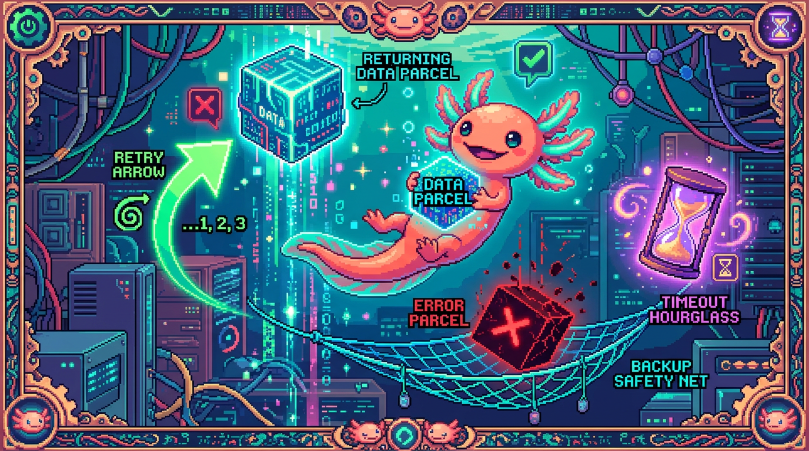

# Capitulo 08 — fetch a fondo y manejo de errores

<p align="center">
  
</p>


> 🐾 ¡Hola otra vez! Soy **Bit**, tu ajolote programador. En el capítulo 06 vimos cómo viaja la información por internet (HTTP, peticiones, respuestas, códigos de estado) y en el módulo 03 ya usaste `fetch` de forma básica. Hoy levantamos el capó: vamos a ver `fetch` por dentro, a pedirle cosas a una API de verdad y, sobre todo, a saber qué hacer cuando algo falla. Y te adelanto algo: en internet, las cosas fallan a menudo. De ejemplo usaremos el chat de IA de **tunal-digital**, que habla con la API de Claude. Empecemos.

---

## 1. Recordando: ¿qué es `fetch`?

Antes de meternos en lo nuevo, refresquemos quién es el protagonista del capítulo.

> ### 🟦 ¿Que significa? — *fetch*
> `fetch` es una función que ya trae el navegador de fábrica (no instalas nada). **Sirve para** pedir datos a un servidor por internet sin recargar la página: le pasas una dirección (URL), opcionalmente le explicas cómo quieres hacer la petición, y te devuelve la respuesta. **Dónde se usa en un repo real:** en **tunal-digital**, cuando el visitante escribe un mensaje en el chat, el JavaScript del navegador usa `fetch` para enviar ese texto a un Cloudflare Worker, que a su vez habla con la API de Claude.

La forma más corta de usar `fetch` es pasarle solo una URL:

```javascript
// La versión más simple: solo una URL
fetch("https://api.ejemplo.com/datos");
```

Pero con esto no llegamos muy lejos. La mayoría de las APIs necesita que les digamos **cómo** queremos hablarles: con qué verbo HTTP, qué cabeceras enviamos y qué datos van en el cuerpo. Para todo eso, `fetch` acepta un **segundo argumento**: un objeto de configuración. Es justo lo que veremos en la sección 2.

> ### 💡 Tip
> Recuerda la imagen del capítulo 06: una petición HTTP es como mandar una carta. La URL es la dirección, el método es lo que quieres hacer (leer, crear, borrar), las cabeceras son notas escritas en el sobre, y el cuerpo es el contenido de la carta. `fetch` no es más que el cartero que la lleva al correo.

---

## 2. `fetch` completo: method, headers y body

Veamos una llamada `fetch` "de verdad", parecida a la que hace tunal-digital cuando envía un mensaje al chat:

```javascript
fetch("https://chat.tunal-digital.workers.dev", {
  method: "POST",
  headers: {
    "Content-Type": "application/json"
  },
  body: JSON.stringify({
    mensaje: "Hola, ¿qué servicios ofrecen?"
  })
});
```

Esta vez pasamos un segundo argumento: un objeto con tres campos clave. Vamos uno por uno.

### El `method`

> ### 🟦 ¿Que significa? — *método HTTP*
> El **método** (o verbo) le dice al servidor qué tipo de acción quieres hacer. Los más habituales son `GET` (leer datos), `POST` (enviar o crear datos), `PUT` (reemplazar) y `DELETE` (borrar). **Sirve para** que el servidor entienda tu intención. **Dónde se usa:** el chat de tunal-digital usa `POST` porque está **enviando** el mensaje del usuario al Worker. Si haces `fetch(url)` sin indicar método, por defecto es `GET`.

### Los `headers`

> ### 🟦 ¿Que significa? — *headers (cabeceras)*
> Los **headers** son pares de "etiqueta: valor" que viajan junto a tu petición con información extra sobre ella. **Sirven para** indicar cosas como el tipo de contenido que envías, el idioma, la autenticación, etc. **Dónde se usa:** en tunal-digital el navegador manda `Content-Type: application/json` para avisar "lo que va en el cuerpo es JSON". La clave secreta de Claude **NO** viaja aquí desde el navegador; eso lo veremos en la sección 7.

### El `body`

> ### 🟦 ¿Que significa? — *body (cuerpo)*
> El **body** es el contenido principal que envías en la petición: los datos en sí. **Sirve para** transportar la información que el servidor necesita (un formulario, un mensaje, un JSON...). **Dónde se usa:** en el chat, el body lleva el texto que escribió el visitante. Solo se usa con métodos como `POST` o `PUT`; un `GET` normalmente va sin body.

### `JSON.stringify`: del objeto al texto

Mira bien: el body no es directamente el objeto `{ mensaje: "..." }`. Está envuelto en `JSON.stringify(...)`. ¿Por qué?

> ### 🟦 ¿Que significa? — *JSON.stringify*
> `JSON.stringify` convierte un objeto de JavaScript en **texto** con formato JSON. **Sirve porque** por internet viaja texto, no objetos de JavaScript: hay que "aplanar" el objeto a una cadena antes de enviarlo. **Dónde se usa:** tunal-digital convierte `{ mensaje: "..." }` en el texto `{"mensaje":"..."}` justo antes de meterlo en el body.

```javascript
const datos = { mensaje: "Hola" };

console.log(datos);                 // un objeto de JavaScript
console.log(JSON.stringify(datos)); // el texto:  {"mensaje":"Hola"}
```

> ### ⚠️ Cuidado
> Si metes un objeto directo en el body sin `JSON.stringify`, JavaScript lo convierte en el texto inútil `"[object Object]"` y el servidor no entiende nada. Como regla práctica: siempre que el `Content-Type` sea `application/json`, el body tiene que pasar por `JSON.stringify`.

---

## 3. La respuesta es una Promise: `async`/`await`

Aquí llega un detalle importante. `fetch` **no te entrega los datos al instante**. Pedir algo por internet lleva su tiempo (milisegundos, a veces segundos), y JavaScript no se queda paralizado esperando. En vez de eso, `fetch` te devuelve una **promesa**.

> ### 🟦 ¿Que significa? — *Promise (promesa)*
> Una **Promise** es un objeto que representa un resultado que **todavía no está, pero llegará** (o fallará) más adelante. **Sirve para** manejar tareas que tardan, como pedir datos por internet, sin congelar el programa. **Dónde se usa:** cada `fetch` de tunal-digital devuelve una promesa que se "resuelve" cuando el Worker responde. Piénsalo como el ticket del guardarropa: el abrigo aún no lo tienes en la mano, pero tienes la promesa de recogerlo.

Para trabajar con promesas de forma cómoda y legible, usamos `async` y `await`.

> ### 🟦 ¿Que significa? — *async/await*
> `async` es una palabra que pones delante de una función para avisar "esta función hace tareas que tardan". Dentro de ella puedes usar `await`, que significa "**espera** aquí hasta que la promesa termine y dame el resultado". **Sirve para** escribir código asíncrono que se lee de arriba abajo, como si fuera código normal. **Dónde se usa:** la función que envía el mensaje del chat en tunal-digital es `async`, y usa `await fetch(...)` para esperar la respuesta del Worker.

Veamos la diferencia. Sin `await` te quedas con una promesa "cruda", sin abrir:

```javascript
const promesa = fetch("https://chat.tunal-digital.workers.dev");
console.log(promesa); // Promise { <pending> } — ¡aún no hay datos!
```

Con `await`, en cambio, esperas el resultado real:

```javascript
async function enviarMensaje(texto) {
  // await: "espera a que llegue la respuesta antes de seguir"
  const respuesta = await fetch("https://chat.tunal-digital.workers.dev", {
    method: "POST",
    headers: { "Content-Type": "application/json" },
    body: JSON.stringify({ mensaje: texto })
  });

  // Aquí 'respuesta' ya es la respuesta real del servidor
  const datos = await respuesta.json();
  console.log(datos);
}
```

> ### 💡 Tip
> `await` solo funciona dentro de una función marcada con `async`. Si lo usas "suelto", fuera de una función async, JavaScript te lanza un error. Por eso casi siempre metemos nuestra lógica de `fetch` dentro de una función `async`.

### `respuesta.json()` también es una promesa

¿Te fijaste en el segundo `await`, el de `respuesta.json()`? Leer y procesar el cuerpo de la respuesta también lleva su tiempo, así que también devuelve una promesa.

> ### 🟦 ¿Que significa? — *JSON.parse*
> `JSON.parse` hace lo contrario de `JSON.stringify`: convierte un **texto** en formato JSON de vuelta a un **objeto** de JavaScript que puedes usar. **Sirve para** entender la respuesta del servidor (que llega como texto) como datos que puedes recorrer. **Dónde se usa:** el método `respuesta.json()` que usa tunal-digital por dentro hace un `JSON.parse` por ti, y te devuelve la respuesta de Claude ya convertida en objeto.

```javascript
const texto = '{"respuesta":"¡Hola! Ofrecemos diseño web."}';
const objeto = JSON.parse(texto);
console.log(objeto.respuesta); // "¡Hola! Ofrecemos diseño web."
```

---

## 4. ¿Salió bien? `response.ok` y `response.status`

Aquí hay una trampa con la que tropieza casi todo el mundo al empezar:

> ### ⚠️ Cuidado
> `fetch` **NO falla** cuando el servidor responde con un error como 404 (no encontrado) o 500 (error del servidor). Para `fetch`, "el servidor me contestó algo" ya cuenta como éxito, aunque ese algo sea un error de cabo a rabo. Eres tú quien tiene que revisar **a mano** si la respuesta fue buena.

Para esa revisión tenemos dos propiedades de la respuesta.

> ### 🟦 ¿Que significa? — *código de estado*
> Un **código de estado** es un número de tres cifras que el servidor incluye en su respuesta para resumir qué pasó. Como vimos en el capítulo 06: 200 = todo bien, 400 = pediste algo mal, 401 = no autorizado, 404 = no existe, 429 = demasiadas peticiones, 500 = el servidor reventó. **Sirve para** saber el resultado de un vistazo. **Dónde se usa:** si la API de Claude responde 429 (límite de uso) al Worker de tunal-digital, ese código viaja de vuelta para que el navegador muestre un aviso amable.

> ### 🟦 ¿Que significa? — *response.status*
> `response.status` es la propiedad que guarda ese número de código de estado de la respuesta. **Sirve para** mirar el resultado exacto y decidir qué hacer. **Dónde se usa:** tunal-digital puede consultar `respuesta.status` para distinguir entre "te pasaste del límite" (429) y "algo se rompió en el servidor" (500).

> ### 🟦 ¿Que significa? — *response.ok*
> `response.ok` es un atajo: vale `true` si el código de estado cae entre 200 y 299 (es decir, "todo bien") y `false` en cualquier otro caso. **Sirve para** comprobar rápido si la petición tuvo éxito sin tener que memorizar todos los números. **Dónde se usa:** el chat de tunal-digital comprueba `if (!respuesta.ok)` antes de intentar leer la respuesta de Claude.

Así se ve la comprobación bien hecha:

```javascript
async function enviarMensaje(texto) {
  const respuesta = await fetch("https://chat.tunal-digital.workers.dev", {
    method: "POST",
    headers: { "Content-Type": "application/json" },
    body: JSON.stringify({ mensaje: texto })
  });

  // ¿El servidor respondió con un código de éxito (200-299)?
  if (!respuesta.ok) {
    console.log("Algo salió mal. Código:", respuesta.status);
    return; // no seguimos leyendo
  }

  const datos = await respuesta.json();
  return datos.respuesta;
}
```

> ### 🔎 En tu codigo
> En tunal-digital, distinguir entre códigos te deja dar mensajes realmente útiles al visitante: un 429 ("Estamos recibiendo muchos mensajes, intenta en un momento") suena muy distinto de un 500 ("Hubo un problema técnico"). Si sueltas el mismo aviso genérico para todo, solo consigues confundir al usuario.

---

## 5. Dos tipos de error: de red y de API

Cuando hablas con una API, las cosas pueden fallar de **dos formas muy diferentes**. Entender esa diferencia te va a ahorrar muchos dolores de cabeza.

> ### 🟦 ¿Que significa? — *error de red vs error de API*
> Un **error de red** es cuando la petición ni siquiera **llega** al servidor, o no consigue volver: no hay internet, el servidor está caído, el dominio no existe, se corta la conexión. En ese caso, `fetch` **sí lanza una excepción**. Un **error de API** es cuando la petición **sí llegó** y el servidor te contestó, pero con un código de error (404, 401, 500...). Aquí `fetch` **no lanza nada**; lo descubres con `response.ok`. **Dónde se usa:** en tunal-digital, "no hay wifi" es error de red; "Claude rechazó la clave" (401) es error de API.

Un resumen rápido para que no se te escape:

- **Error de red** → `fetch` explota → lo atrapas con `try/catch`.
- **Error de API** → `fetch` no explota → lo detectas con `if (!respuesta.ok)`.

Hay que cubrir **los dos**. Para los errores de red, la herramienta es `try/catch`.

> ### 🟦 ¿Que significa? — *try/catch*
> `try/catch` es una estructura para capturar errores sin que el programa se venga abajo. Metes el código que **podría** fallar dentro de `try { ... }`, y si algo lanza un error, el flujo salta solo al bloque `catch (error) { ... }`, donde tú decides qué hacer. **Sirve para** que un fallo (como perder internet) no congele toda la página. **Dónde se usa:** el chat de tunal-digital envuelve su `fetch` en `try/catch` para que, si se cae la conexión, muestre "No pudimos conectar" en vez de quedarse colgado.

Juntando todo, un manejo completo queda así:

```javascript
async function enviarMensaje(texto) {
  try {
    const respuesta = await fetch("https://chat.tunal-digital.workers.dev", {
      method: "POST",
      headers: { "Content-Type": "application/json" },
      body: JSON.stringify({ mensaje: texto })
    });

    // --- Error de API: llegó, pero el servidor dice que no ---
    if (!respuesta.ok) {
      if (respuesta.status === 429) {
        return "Estamos recibiendo muchos mensajes. Intenta en un momento.";
      }
      return "Hubo un problema técnico. Intenta más tarde.";
    }

    const datos = await respuesta.json();
    return datos.respuesta;

  } catch (error) {
    // --- Error de red: ni siquiera pudimos hablar con el servidor ---
    console.log("Error de red:", error);
    return "No pudimos conectar. Revisa tu conexión a internet.";
  }
}
```

> ### 💡 Tip
> Una regla mental que ayuda: el `try/catch` rodea **todo** el `fetch`, y dentro del `try` revisas `response.ok`. Así cubres los dos mundos a la vez: la red (con el catch) y la API (con el `if`).

---

## 6. Timeouts, AbortController y reintentos (a grandes rasgos)

¿Y qué pasa si el servidor no se cae... pero tarda una eternidad? El usuario se queda mirando un "cargando" que no termina nunca. Para esos casos existen los **timeouts**.

> ### 🟦 ¿Que significa? — *timeout (tiempo límite)*
> Un **timeout** es el tiempo máximo que estás dispuesto a esperar una respuesta. Si se cumple ese plazo y la respuesta no ha llegado, cancelas la petición. **Sirve para** no dejar al usuario esperando para siempre cuando algo va lentísimo. **Dónde se usa:** tunal-digital podría poner un límite de, digamos, 20 segundos para la respuesta de Claude; si tarda más, avisa al visitante en lugar de quedarse colgado.

El detalle es que `fetch` no trae un botón de "cancelar" propio. Para poder cancelarlo necesitamos una herramienta aparte.

> ### 🟦 ¿Que significa? — *AbortController*
> `AbortController` es un objeto del navegador que funciona como un **interruptor de cancelación**. Lo creas, le pasas su `signal` a `fetch`, y cuando llamas a `controller.abort()`, la petición se cancela. **Sirve para** poder detener un `fetch` que ya no te interesa (porque tardó demasiado o porque el usuario cambió de pantalla). **Dónde se usa:** combinándolo con un temporizador, tunal-digital puede abortar la llamada a Claude si se pasa del tiempo límite.

> ### 🟦 ¿Que significa? — *signal*
> El `signal` es la "antena" que el `AbortController` le entrega a `fetch`. **Sirve para** que `fetch` escuche la orden de cancelar: si el controller dispara `abort()`, la `signal` se lo comunica a `fetch` y este se detiene, lanzando un error que puedes atrapar. **Dónde se usa:** se pasa como una opción más en la configuración del `fetch`: `{ signal: controller.signal }`.

Veamos un timeout con `AbortController`:

```javascript
async function enviarConTimeout(texto, milisegundos = 20000) {
  const controller = new AbortController();

  // Programa la cancelación: si pasan los milisegundos, aborta
  const temporizador = setTimeout(() => controller.abort(), milisegundos);

  try {
    const respuesta = await fetch("https://chat.tunal-digital.workers.dev", {
      method: "POST",
      headers: { "Content-Type": "application/json" },
      body: JSON.stringify({ mensaje: texto }),
      signal: controller.signal // <- aquí conectamos el interruptor
    });

    clearTimeout(temporizador); // llegó a tiempo: cancela el temporizador
    return await respuesta.json();

  } catch (error) {
    clearTimeout(temporizador);
    if (error.name === "AbortError") {
      return "La respuesta tardó demasiado. Intenta de nuevo.";
    }
    return "Error de conexión.";
  }
}
```

### Reintentos y backoff

A veces un error es solo **pasajero**: una conexión que parpadeó un segundo, o un 429 que duró un instante. En esos casos puede valer la pena **volver a intentarlo**.

> ### 🟦 ¿Que significa? — *reintento (retry)*
> Un **reintento** es repetir la misma petición de forma automática cuando ha fallado, con la esperanza de que a la segunda funcione. **Sirve para** sortear fallos temporales sin molestar al usuario. **Dónde se usa:** si la API de Claude devuelve un 429 ocasional, tunal-digital podría reintentar una o dos veces antes de darse por vencido.

> ### 🟦 ¿Que significa? — *backoff*
> **Backoff** es la idea de **esperar cada vez más** entre un reintento y el siguiente: primero 1 segundo, luego 2, luego 4... **Sirve para** no machacar a un servidor que ya viene saturado (lo cual solo empeoraría las cosas). **Dónde se usa:** un reintento educado ante un 429 va esperando un poco más en cada intento, para darle aire al servidor.

```javascript
async function enviarConReintentos(texto, intentos = 3) {
  for (let i = 0; i < intentos; i++) {
    try {
      const respuesta = await fetch("https://chat.tunal-digital.workers.dev", {
        method: "POST",
        headers: { "Content-Type": "application/json" },
        body: JSON.stringify({ mensaje: texto })
      });

      if (respuesta.ok) {
        return await respuesta.json(); // ¡éxito!
      }
      // si no fue ok, caemos abajo y reintentamos (si quedan intentos)
    } catch (error) {
      // error de red: también reintentamos
    }

    // backoff: esperar más en cada vuelta (1s, 2s, 4s...)
    const espera = 1000 * Math.pow(2, i);
    await new Promise(r => setTimeout(r, espera));
  }

  return "No pudimos obtener respuesta tras varios intentos.";
}
```

> ### ⚠️ Cuidado
> No reintentes **todo**. Un error 400 ("pediste mal") o 401 ("clave inválida") **no** se arregla repitiendo: vas a fallar igual y a gastar recursos para nada. Los reintentos tienen sentido sobre todo con errores de red y con 429/500, que suelen ser cosas temporales.

---

## 7. El patrón real de tunal-digital: navegador → Worker → Claude

Y ahora llega la pieza más importante del capítulo. A lo mejor te estás preguntando: *"Bit, si quiero hablar con la API de Claude, ¿por qué no hago `fetch` directo desde el navegador?"*. La respuesta cabe en una palabra: **seguridad**.

Para usar la API de Claude necesitas una **clave secreta** (una API key). Esa clave es como la contraseña de tu cuenta: quien la tenga, puede gastar tu dinero. Y ahí está el problema:

> ### ⚠️ Cuidado
> **TODO el código JavaScript que corre en el navegador queda a la vista de cualquiera.** Basta con abrir las herramientas de desarrollador (F12) para leerlo entero. Si pones tu clave de Claude en el JavaScript del navegador, se la estás **regalando** al mundo. Cualquiera podría copiarla y consumir tu cuota.

Por eso tunal-digital mete un intermediario en el servidor: un **Cloudflare Worker**. El flujo es este:

```
[Navegador del visitante]
        |  fetch (POST con el mensaje, SIN clave)
        v
[Cloudflare Worker]  <-- aquí vive la clave secreta, oculta
        |  fetch a la API de Claude (CON la clave en los headers)
        v
[API de Claude / Anthropic]
        |  respuesta
        v
[Worker] --> [Navegador]  (le devuelve solo el texto de la respuesta)
```

El navegador nunca ve la clave. El Worker la guarda en una variable de entorno secreta (en Cloudflare), la añade a los headers de **su** `fetch` hacia Claude, recibe la respuesta y le pasa al navegador **solo lo que hace falta**.

Así se ve, simplificado, el `fetch` que hace el **Worker** (este código corre en el servidor, no en el navegador):

```javascript
// ESTO CORRE EN EL CLOUDFLARE WORKER (servidor), no en el navegador
async function llamarAClaude(mensajeDelUsuario, env) {
  const respuesta = await fetch("https://api.anthropic.com/v1/messages", {
    method: "POST",
    headers: {
      "Content-Type": "application/json",
      // La clave vive SOLO aquí, en el servidor, leída de una variable secreta:
      "x-api-key": env.ANTHROPIC_API_KEY,
      "anthropic-version": "2023-06-01"
    },
    body: JSON.stringify({
      model: "claude-sonnet-4-5",
      max_tokens: 1024,
      messages: [{ role: "user", content: mensajeDelUsuario }]
    })
  });

  const datos = await respuesta.json();
  return datos; // el Worker decide qué parte devolver al navegador
}
```

> ### 🔎 En tu codigo
> Fíjate en la simetría: el navegador hace `fetch` al Worker, y el Worker hace **otro** `fetch` a Claude. Es la misma herramienta (`fetch`) usada en dos sitios distintos. Lo que cambia, y es lo crucial, es **dónde está la clave**: solo aparece en el segundo `fetch`, el que corre en el servidor. Esta misma filosofía la sigue Faro/Organizer: las claves de OpenAI viven en el servidor de Next.js, nunca en el cliente.

> ### 💡 Tip
> Regla de oro para todo el módulo: **las claves secretas nunca tocan el navegador.** Si una API te pide una clave, pon un pequeño servidor en medio que la guarde (un Worker, una función serverless, una ruta de API). El navegador habla con tu servidor; tu servidor habla con la API.

---

## 8. Poniéndolo todo junto

Mira cómo encaja la pieza del navegador con todo lo que hemos visto. Este es el código del **lado del cliente** de tunal-digital, ya con su manejo de errores:

```javascript
async function enviarMensajeAlChat(texto) {
  const controller = new AbortController();
  const temporizador = setTimeout(() => controller.abort(), 20000);

  try {
    const respuesta = await fetch("https://chat.tunal-digital.workers.dev", {
      method: "POST",
      headers: { "Content-Type": "application/json" },
      body: JSON.stringify({ mensaje: texto }),
      signal: controller.signal
    });
    clearTimeout(temporizador);

    // Error de API
    if (!respuesta.ok) {
      if (respuesta.status === 429) {
        return "Muchos mensajes ahora mismo. Intenta en un momento.";
      }
      return "Hubo un problema técnico. Intenta más tarde.";
    }

    const datos = await respuesta.json();
    return datos.respuesta;

  } catch (error) {
    clearTimeout(temporizador);
    // Error de red o timeout
    if (error.name === "AbortError") {
      return "La respuesta tardó demasiado.";
    }
    return "No pudimos conectar. Revisa tu internet.";
  }
}
```

Si entiendes este bloque línea por línea, ya tienes lo esencial del capítulo en la mano. Está todo aquí: `fetch` completo (method, headers, body con `JSON.stringify`), `async`/`await`, la comprobación de `response.ok` y `response.status`, el manejo separado de errores de API y de red, y un timeout con `AbortController` y `signal`. Todo lo de hoy reunido en una sola función.

> 🐾 Bit dice: no memorices el código, **memoriza las preguntas**. Ante cada `fetch`, pregúntate: ¿qué método? ¿qué headers? ¿hay body (y lo paso por `JSON.stringify`)? ¿revisé `response.ok`? ¿qué hago si se cae la red? ¿dónde está la clave secreta (que ojalá NO sea en el navegador)? Si sabes responder esas seis, estás listo.

---

## ✅ Checklist — ¿ya domino esto?

- [ ] Sé que `fetch` recibe una URL y, opcionalmente, un objeto con `method`, `headers` y `body`.
- [ ] Entiendo que el `body` con JSON debe pasar por `JSON.stringify` antes de enviarse.
- [ ] Sé que `fetch` devuelve una **Promise** y que uso `async`/`await` para esperar la respuesta.
- [ ] Entiendo que `respuesta.json()` también devuelve una promesa (por eso lleva su propio `await`).
- [ ] Reviso `response.ok` y `response.status` para saber si la petición tuvo éxito.
- [ ] Sé que `fetch` **no** lanza error en un 404 o 500; eso lo detecto yo con `response.ok`.
- [ ] Distingo un **error de red** (se atrapa con `try/catch`) de un **error de API** (se detecta con `if (!respuesta.ok)`).
- [ ] Conozco la idea de **timeout** y sé que se implementa con `AbortController` y su `signal`.
- [ ] Entiendo qué son los **reintentos** y el **backoff**, y cuándo NO conviene reintentar.
- [ ] Tengo grabado que las **claves secretas viven en el servidor (el Worker)**, jamás en el navegador.
- [ ] Puedo explicar el flujo navegador → Cloudflare Worker → API de Claude de tunal-digital.

---

## 🧪 Ejercicios

1. **(en papel)** Dibuja el flujo de un mensaje del chat de tunal-digital desde que el visitante presiona "Enviar" hasta que ve la respuesta. Marca con un círculo el único lugar donde aparece la clave secreta de Claude. Explica con tus palabras por qué no puede ir en el navegador.

2. **(en papel)** Para cada situación, escribe si es **error de red** o **error de API**, y cómo lo detectarías (`try/catch` o `response.ok`):
   - El usuario se quedó sin wifi.
   - La API responde 401 porque la clave es inválida.
   - La API responde 429 por demasiadas peticiones.
   - El dominio del Worker está mal escrito y no existe.

3. 💻 Escribe una función `async` llamada `pedirChiste()` que haga `fetch` a `https://api.chucknorris.io/jokes/random`, revise `response.ok`, y si todo va bien imprima en consola el campo `value` de la respuesta. Si no, imprime el `status`. Envuélvelo en `try/catch`.

4. 💻 Toma la función del ejercicio 3 y añádele un **timeout de 5 segundos** usando `AbortController` y `signal`. Si la petición se aborta, imprime "Tardó demasiado". Pista: revisa `error.name === "AbortError"` en el `catch`.

5. 💻 Crea una función `enviarDatos(objeto)` que haga un `POST` a una URL de prueba (puedes usar `https://httpbin.org/post`), enviando `objeto` en el body con `JSON.stringify` y el header `Content-Type: application/json`. Imprime la respuesta con `respuesta.json()`. Comprueba en la respuesta de httpbin que tus datos llegaron tal cual.

6. 💻 **(reto)** Implementa una función `fetchConReintentos(url, intentos)` con **backoff**: si falla (red o `response.ok` falso), espera 1s, luego 2s, luego 4s antes de reintentar, hasta agotar los `intentos`. NO reintentes si el `status` es 400 o 401 (esos no se arreglan repitiendo). Devuelve los datos si tiene éxito o un mensaje de fallo si no.

---

> 🐾 ¡Lo lograste! Ahora `fetch` ya no es una caja negra: sabes pedir bien, esperar con `async`/`await`, distinguir los fallos de red de los de la API, cancelar lo que tarda demasiado y, sobre todo, **proteger tus claves** poniéndolas en el servidor. En el próximo capítulo seguiremos construyendo sobre esto. Nos vemos. — Bit 🪶
