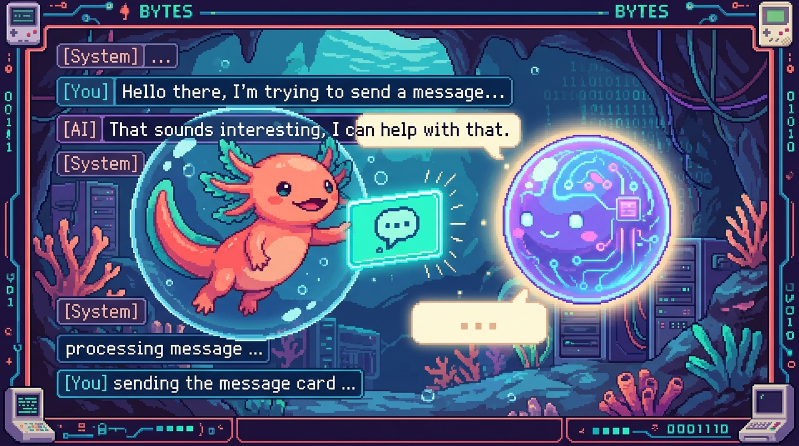

# Capitulo 11 — Integrar IA a fondo

<p align="center">
  
</p>


> Hasta ahora usaste la IA como una caja magica: le mandas un texto y te devuelve otro.
> En este capitulo abrimos la caja. Vas a entender que es de verdad una API de modelo de
> lenguaje, como se conversa con ella usando "mensajes", que son los tokens (la moneda con
> la que se cobra y se mide todo), y como controlar el resultado con un par de parametros.
> Lo veremos con dos casos reales: el chat de **tunal-digital**, que habla con la API de
> Claude/Anthropic, y **Faro**, que usa la API de OpenAI para describir tus proyectos.
> Bit, el ajolote, viene con nosotros. Bit es curioso pero olvidadizo: por eso entiende
> tan bien a los modelos de IA, que tambien olvidan todo entre una pregunta y la siguiente.

---

## 1. Que es una API de modelo de lenguaje

En el modulo 03 viste `fetch` y aprendiste que una **API** es una "ventanilla" a la que le
mandas una peticion y te devuelve una respuesta. Una API de IA funciona igual: la diferencia
es que del otro lado no hay una base de datos comun, sino un **modelo de lenguaje**.

> ### 🟦 ¿Que significa? — *Modelo de lenguaje (LLM)*
> Un **modelo de lenguaje grande** (en ingles *Large Language Model*, LLM) es un programa
> entrenado con enormes cantidades de texto que aprendio a **predecir la siguiente palabra**.
> Sirve para: redactar, resumir, traducir, clasificar, responder preguntas o programar.
> Donde se usa en un repo real: en **tunal-digital**, el chat de la web le manda al modelo
> Claude (de Anthropic) la pregunta del visitante y muestra la respuesta. En **Faro**, el
> modelo de OpenAI lee la informacion de tus proyectos y genera la descripcion y el roadmap.

La idea clave: el modelo **no busca** la respuesta en ningun lado, la **genera** palabra por
palabra. Por eso a veces inventa cosas (a eso se le llama "alucinar") y por eso dos preguntas
iguales pueden dar respuestas algo distintas.

> ### 🟦 ¿Que significa? — *API*
> Una **API** (*Application Programming Interface*) es una direccion de internet a la que tu
> programa le hace una peticion HTTP y recibe una respuesta, normalmente en formato JSON.
> Sirve para: usar un servicio que vive en otro servidor sin tener ese servicio en tu maquina.
> Donde se usa: la API de Claude vive en `https://api.anthropic.com/v1/messages` y la de
> OpenAI en `https://api.openai.com/v1/...`. Tu codigo les manda peticiones a esas direcciones.

> ### 💡 Tip
> Un LLM es "sin estado" (en ingles *stateless*): no recuerda nada de tu conversacion
> anterior. Cada vez que le preguntas algo, hay que mandarle **toda la conversacion otra vez**.
> Bit te lo resume asi: el modelo tiene la memoria de un pez. Si quieres que recuerde tu
> nombre, se lo tienes que repetir en cada mensaje.

---

## 2. El rol de los mensajes: system, user y assistant

Las APIs modernas de chat no reciben "un texto suelto": reciben una **lista de mensajes**.
Cada mensaje tiene un **rol** que le dice al modelo quien esta hablando.

> ### 🟦 ¿Que significa? — *Mensaje y rol*
> Un **mensaje** es un objeto con dos partes: un **rol** (quien habla) y un **contenido**
> (lo que dice). El **rol** puede ser `system`, `user` o `assistant`.
> Sirve para: darle estructura a la conversacion para que el modelo sepa quien dijo que.
> Donde se usa: tanto la API de Claude (tunal-digital) como la de OpenAI (Faro) reciben
> esta lista de mensajes en el cuerpo (`body`) de la peticion.

Los tres roles, en cristiano:

- **`system`** — las instrucciones generales. Es como el guion del actor: define el tono,
  el idioma, las reglas. El usuario normalmente **no lo ve**. Ejemplo: *"Eres el asistente
  de Tunal Digital. Responde en espanol, breve y amable."*
- **`user`** — lo que escribe la persona. Ejemplo: *"Hola, ¿hacen paginas web?"*
- **`assistant`** — lo que respondio el modelo en turnos anteriores. Sirve para que el modelo
  recuerde el hilo de la conversacion.

Una conversacion en JSON se ve asi (este es el estilo de **OpenAI**, como en Faro):

```json
{
  "model": "gpt-4o-mini",
  "messages": [
    { "role": "system", "content": "Eres el asistente de Faro. Responde en espanol." },
    { "role": "user", "content": "Resume el estado de mi proyecto RachaSimple." },
    { "role": "assistant", "content": "RachaSimple va por la fase de login con Supabase." },
    { "role": "user", "content": "¿Y que falta para terminarlo?" }
  ]
}
```

Fijate que el ultimo mensaje es del `user`: el modelo respondera a ese, pero usando todo lo
anterior como contexto. En la API de **Claude/Anthropic** (la de tunal-digital) es casi igual,
con una diferencia: las instrucciones de sistema no van dentro de `messages`, sino en un campo
aparte llamado `system`. El cuerpo se ve asi:

```json
{
  "model": "claude-opus-4-8",
  "max_tokens": 1024,
  "system": "Eres el asistente de Tunal Digital. Responde en espanol, breve y amable.",
  "messages": [
    { "role": "user", "content": "Hola, ¿hacen paginas web?" }
  ]
}
```

> ### 🔎 En tu codigo
> En **tunal-digital** el frontend (HTML/CSS/JS vanilla) no llama directo a Anthropic.
> Le manda el mensaje a un **Cloudflare Worker**, y el Worker es quien arma este JSON con
> `system` y `messages` y se lo manda a la API de Claude. Ya veremos en la seccion 7 por
> que ese paso intermedio es obligatorio por seguridad.

> ### ⚠️ Cuidado
> El campo `system` es poderoso pero no es magia. Si le dices "responde solo en espanol" y el
> usuario insiste mucho en otro idioma, el modelo puede desviarse. Las instrucciones de sistema
> guian, no encadenan. Pon ahi las reglas importantes, pero no esperes obediencia ciega.

---

## 3. Tokens: la moneda de los modelos

Aqui esta el concepto que mas confunde a quien empieza, asi que lo desmenuzamos despacio.

> ### 🟦 ¿Que significa? — *Token*
> Un **token** es un pedacito de texto: puede ser una palabra corta, parte de una palabra
> larga, un signo de puntuacion o un espacio. El modelo no lee letras ni palabras enteras,
> lee tokens.
> Sirve para: medir cuanto texto entra y sale, y para **cobrar**. Todo se cuenta en tokens.
> Donde se usa: tanto Claude (tunal-digital) como OpenAI (Faro) reportan en su respuesta
> cuantos tokens consumio cada peticion.

Una regla aproximada para el espanol e ingles: **1 token ≈ 4 caracteres**, o mas o menos
**3 palabras = 4 tokens**. No es exacto, pero te da la intuicion. Por ejemplo, la frase
*"Hola, ¿como estas?"* son unos 6 o 7 tokens.

> ### 💡 Tip
> No cuentes tokens "a ojo" multiplicando por un numero fijo. El codigo y los idiomas con
> tildes o emojis gastan mas tokens de lo que parece. Si necesitas el numero exacto, ambas
> APIs ofrecen una manera de contarlos antes de enviar. Para una estimacion rapida en tu
> cabeza, "4 caracteres por token" sobra.

Hay dos tipos de tokens que importan:

- **Tokens de entrada** (*input*): todo lo que le mandas (el `system` + todos los `messages`).
- **Tokens de salida** (*output*): todo lo que el modelo te responde.

Esta distincion es la base del costo, que veremos en la seccion 6.

> ### 🟦 ¿Que significa? — *Ventana de contexto*
> La **ventana de contexto** es el maximo de tokens que el modelo puede "ver" de una sola vez,
> sumando entrada **y** salida. Es como el tamano de su escritorio: solo cabe cierta cantidad
> de papeles abiertos al mismo tiempo.
> Sirve para: saber cuanto texto le puedes pasar antes de que se "desborde".
> Donde se usa: en **Faro**, cuando la IA lee muchos proyectos de GitHub y Drive a la vez,
> hay que vigilar no pasarse de la ventana de contexto, o la peticion falla o se recorta.

> ### ⚠️ Cuidado
> Si tu conversacion crece y crece (como en un chat largo), cada nueva pregunta arrastra todo
> el historial, y los tokens de entrada se disparan. Llega un punto en que te pasas de la
> ventana de contexto. Soluciones tipicas: resumir lo viejo, o quedarte solo con los ultimos
> mensajes. Bit lo dice asi: el escritorio no es infinito; a veces hay que guardar papeles
> viejos en un cajon.

---

## 4. Parametros para controlar la respuesta

Ademas de `model` y `messages`, en el cuerpo de la peticion puedes mandar **parametros** que
ajustan como responde el modelo. Los dos mas comunes para empezar son `max_tokens` y
`temperature`.

> ### 🟦 ¿Que significa? — *max_tokens*
> `max_tokens` es el **maximo de tokens de salida** que permites en la respuesta. Es un techo:
> si el modelo lo alcanza, corta la respuesta ahi, aunque no haya terminado la idea.
> Sirve para: evitar respuestas eternas y poner un limite al gasto.
> Donde se usa: en la API de Claude (tunal-digital) `max_tokens` es **obligatorio**; en la de
> OpenAI es opcional (existe como `max_tokens` o `max_completion_tokens` segun la version).

```json
{
  "model": "claude-opus-4-8",
  "max_tokens": 500,
  "messages": [{ "role": "user", "content": "Explicame que es una cookie." }]
}
```

> ### ⚠️ Cuidado
> Si pones `max_tokens` muy bajo, la respuesta se corta a la mitad de una frase. No es un error
> del modelo: literalmente le dijiste "no escribas mas de tantos tokens". Si ves respuestas
> truncadas, sube `max_tokens`. Para un chat normal, unos cientos suelen bastar; para generar
> un roadmap completo como en Faro, necesitas mas espacio.

> ### 🟦 ¿Que significa? — *temperature*
> `temperature` es un numero (tipicamente de 0 a 1) que controla cuanto **se arriesga** el
> modelo al elegir la siguiente palabra. Cerca de 0 es predecible y "serio"; mas alto es mas
> creativo y variado.
> Sirve para: tareas exactas (clasificar, extraer datos) conviene bajo; para redactar o
> hacer lluvia de ideas conviene mas alto.
> Donde se usa: en **Faro**, para generar el estado y el progreso de un proyecto interesa una
> temperatura baja, porque quieres respuestas consistentes y no inventadas.

> ### 💡 Tip
> Un detalle importante de 2026: los modelos mas nuevos de Claude (la familia Opus 4.x y
> Fable 5) **ya no aceptan** el parametro `temperature`; lo guian con otros mecanismos
> internos. En cambio, los modelos de OpenAI que usa Faro si lo aceptan. Moraleja: cada API
> tiene sus propios parametros y van cambiando. Cuando algo no funcione, revisa la
> documentacion del modelo concreto que estas usando en lugar de copiar parametros de memoria.

Otro parametro que veras a menudo es `stream`, que activa el envio por partes. Lo vemos en la
seccion 5.

---

## 5. Streaming: respuestas que van llegando de a poco

¿Has notado que ChatGPT y otros chats escriben la respuesta letra por letra, como si la
estuvieran tecleando? Eso es **streaming**.

> ### 🟦 ¿Que significa? — *Streaming*
> El **streaming** es recibir la respuesta del modelo **en pedacitos**, a medida que se va
> generando, en lugar de esperar a que termine toda y recibirla de golpe.
> Sirve para: que el usuario vea texto enseguida (mejor experiencia) y para evitar que la
> conexion se caiga por esperar demasiado en respuestas largas.
> Donde se usa: un chat como el de **tunal-digital** se siente mucho mas agil si el Worker
> reenvia el texto de Claude conforme llega, en vez de mostrar todo al final.

A grandes rasgos funciona asi: en la peticion pones `"stream": true`. El servidor, en vez de
mandarte un solo JSON al final, te manda una secuencia de pequenos eventos. Cada evento trae
un trocito de texto (un "delta"). Tu codigo los va pegando uno tras otro para formar la
respuesta completa.

```json
{
  "model": "claude-opus-4-8",
  "max_tokens": 1024,
  "stream": true,
  "messages": [{ "role": "user", "content": "Escribe un haiku sobre el codigo." }]
}
```

> ### 💡 Tip
> El streaming es comodo para el usuario, pero anade complejidad: tu codigo tiene que ir
> juntando los pedazos en vez de recibir un objeto listo. Para tu primer chat, empezar **sin**
> streaming (esperar la respuesta completa) es perfectamente valido y mas facil de depurar.
> Bit recomienda: primero que funcione de un solo golpe, despues lo haces "bonito" con stream.

---

## 6. El costo: pagas por tokens

Las APIs de IA cobran **por token**, normalmente con un precio por **millon de tokens** (se
abrevia *MTok*). Y casi siempre la **salida cuesta mas** que la entrada, porque generar texto
es mas costoso que leerlo.

> ### 🟦 ¿Que significa? — *Costo por tokens*
> Es la forma de cobrar de estas APIs: un precio por cada millon de tokens de **entrada** y
> otro (mas alto) por cada millon de tokens de **salida**. Pagas exactamente lo que consumes.
> Sirve para: poder estimar y controlar cuanto te va a costar usar la IA en tu producto.
> Donde se usa: tanto en la cuenta de Anthropic (tunal-digital) como en la de OpenAI (Faro)
> el panel te muestra el gasto acumulado en tokens.

Un ejemplo ilustrativo con precios de referencia de la familia Opus de Claude (5 USD por
millon de tokens de entrada, 25 USD por millon de salida):

- Una peticion con **1.000 tokens de entrada** cuesta `1.000 / 1.000.000 * 5 = 0,005 USD`.
- Si responde con **500 tokens de salida**, son `500 / 1.000.000 * 25 = 0,0125 USD`.
- Total de esa peticion: unos **0,0175 USD**, menos de dos centavos.

Parece poquisimo, y para una peticion lo es. Pero multiplicalo por miles de visitantes en el
chat de tunal-digital, o por un Faro que analiza decenas de proyectos cada vez, y se vuelve un
numero que importa.

> ### 💡 Tip
> Tres palancas para gastar menos: (1) un **modelo mas barato** para tareas simples (las
> familias tienen modelos "grandes" caros y "pequenos" baratos); (2) **`max_tokens` ajustado**
> para no generar texto de mas; (3) **no arrastrar historial innecesario** en chats largos.
> En Faro, la filosofia de "refresco bajo demanda" (el usuario dispara el analisis, no se
> ejecuta solo) tambien es una decision de costo: no llamas a la IA sin que haga falta.

> ### ⚠️ Cuidado
> Cada vez que reenvias toda la conversacion (porque el modelo no recuerda, ¿te acuerdas?),
> **vuelves a pagar** esos tokens de entrada. Un chat largo no solo gasta mas memoria: gasta
> mas dinero en cada turno. Tenlo en cuenta antes de mandar 50 mensajes de historial en cada
> pregunta.

---

## 7. Seguridad: las claves van en el servidor, NUNCA en el cliente

Esta es la seccion mas importante del capitulo. Leela dos veces. Es la regla de seguridad
explicita de **Faro** y aplica a cualquier proyecto que use IA.

> ### 🟦 ¿Que significa? — *API key (clave de API)*
> Una **API key** es una contrasena secreta que te identifica ante la API. Quien la tenga puede
> hacer peticiones **a tu cuenta y con tu dinero**.
> Sirve para: autenticarte ante Anthropic u OpenAI para que sepan que eres tu y te cobren a ti.
> Donde se usa: tanto Claude (tunal-digital) como OpenAI (Faro) exigen una clave en cada
> peticion, en una cabecera HTTP (`x-api-key` en Anthropic, `Authorization: Bearer ...` en OpenAI).

> ### 🟦 ¿Que significa? — *Cliente vs. servidor*
> El **cliente** es lo que corre en el navegador del usuario: tu HTML, CSS y JavaScript. El
> usuario puede ver todo ese codigo (clic derecho → inspeccionar). El **servidor** es codigo
> que corre en una maquina que tu controlas y que el usuario **no** puede leer.
> Sirve para: decidir donde guardar secretos. Lo del cliente es publico; lo del servidor es privado.
> Donde se usa: en **tunal-digital**, el navegador es el cliente y el **Cloudflare Worker** es
> el servidor. En **Faro** (Next.js), el cliente es el navegador y las rutas de servidor de
> Next.js (junto con `user_connections` protegido por RLS en Supabase) son el lado seguro.

La regla, en una frase: **si pones tu API key en el JavaScript del navegador, cualquiera puede
robarla.** No importa que la "escondas" en una variable o la ofusques: el navegador la descarga
y se puede leer. Alguien la copia, hace miles de peticiones, y te llega la factura.

Por eso **tunal-digital** mete un Cloudflare Worker en el medio. El flujo es:

```
Navegador (cliente)  ->  Cloudflare Worker (servidor)  ->  API de Claude
   (sin la clave)          (aqui SI esta la clave)         (Anthropic)
```

El navegador solo le manda el mensaje del usuario al Worker. El Worker, que vive en un servidor
seguro, **tiene la clave guardada como variable de entorno** y es quien habla con Anthropic.
La clave nunca toca el navegador. Faro hace lo mismo con sus rutas de servidor y la clave de
OpenAI.

> ### 🟦 ¿Que significa? — *Variable de entorno*
> Una **variable de entorno** es un valor secreto (como una API key) que se configura en el
> servidor **fuera del codigo**, y que el programa lee al ejecutarse. No se escribe en los
> archivos del proyecto, asi que no termina en GitHub.
> Sirve para: guardar secretos sin escribirlos en el codigo ni subirlos al repositorio.
> Donde se usa: en el Worker de tunal-digital y en Faro, las claves viven en variables de
> entorno del servidor, nunca en el codigo que se sube al repo.

> ### ⚠️ Cuidado
> **Nunca** escribas una API key directamente en un archivo `.js`, `.ts` o `.html`, y **nunca**
> hagas commit de un archivo con la clave dentro. Si por accidente subes una clave a GitHub,
> considerala quemada: **revocala de inmediato** desde el panel de Anthropic u OpenAI y crea
> una nueva. Los bots rastrean GitHub buscando claves filtradas en segundos.

> ### 🔎 En tu codigo
> En **Faro**, la regla esta escrita en el `CLAUDE.md` del proyecto: *"Tokens y secretos solo
> en el servidor. Nunca exponer claves en el cliente ni commitearlas."* Las conexiones OAuth
> con GitHub y Google Drive se guardan en la tabla `user_connections` con **RLS** (seguridad a
> nivel de fila) en Supabase, de modo que cada usuario solo puede ver lo suyo. La IA de OpenAI
> se llama desde el lado servidor, nunca desde el navegador.

> ### 💡 Tip
> ¿Como sabes si una clave esta "en el cliente"? Pregunta simple: ¿el navegador del usuario
> necesita esa clave para hacer su trabajo? Si la respuesta es "tendria que descargarla", esta
> en el cliente y esta mal. La clave solo debe vivir donde el usuario no puede mirar.

---

## 8. Juntando todo: el viaje de una pregunta en tunal-digital

Pongamos las piezas en orden, paso a paso, para el chat de tunal-digital:

1. El visitante escribe *"¿Hacen tiendas online?"* en el chat de la web.
2. El JavaScript del navegador (cliente) le manda **solo ese texto** al Cloudflare Worker.
3. El Worker arma el cuerpo de la peticion: el campo `system` con las instrucciones de marca,
   el historial en `messages`, el `model` y `max_tokens`.
4. El Worker le anade la **API key** (que tiene en una variable de entorno) y llama a la API
   de Claude en `https://api.anthropic.com/v1/messages`.
5. Claude procesa los **tokens de entrada**, genera la respuesta (los **tokens de salida**) y
   se la devuelve al Worker, eventualmente por **streaming**.
6. El Worker reenvia el texto al navegador, que lo muestra al visitante.
7. La respuesta incluye cuantos tokens se usaron: con eso podrias estimar el **costo**.

Cada pieza de este capitulo aparece en ese viaje: mensajes con roles, tokens, ventana de
contexto (si el chat se alarga), parametros, streaming, costo y, sobre todo, la clave a salvo
en el servidor. Bit asiente satisfecho: la caja magica ya no es magica, es entendible.

---

## ✅ Checklist — ¿ya domino esto?

- [ ] Puedo explicar con mis palabras que es un LLM y por que "genera" en vez de "buscar".
- [ ] Se la diferencia entre los roles `system`, `user` y `assistant`.
- [ ] Entiendo por que un LLM no recuerda nada entre peticiones (es *stateless*).
- [ ] Se que es un token y puedo estimar a ojo cuantos tiene una frase corta.
- [ ] Entiendo que es la ventana de contexto y por que un chat largo se la puede comer.
- [ ] Se para que sirven `max_tokens` y `temperature` y cuando bajar la temperatura.
- [ ] Puedo explicar a grandes rasgos que es el streaming y que problema resuelve.
- [ ] Se que la salida cuesta mas que la entrada y como estimar el costo de una peticion.
- [ ] Tengo clarisimo que la API key va en el servidor y JAMAS en el cliente ni en un commit.
- [ ] Entiendo por que tunal-digital usa un Cloudflare Worker entre el navegador y Claude.

---

## 🧪 Ejercicios

1. **Roles a mano.** Escribe en papel (o en un comentario de codigo) una conversacion de 4
   mensajes para el asistente de Tunal Digital: un `system` que defina el tono, dos `user` y
   un `assistant` en medio. Marca claramente el rol de cada uno.

2. **Estimando tokens.** Toma la frase *"Faro lee GitHub y Google Drive para describir tus
   proyectos con IA."* y estima cuantos tokens tiene usando la regla de 4 caracteres por token.
   Luego escribe en una frase por que esa estimacion no es exacta.

3. 💻 **Contando el gasto.** Escribe una pequena funcion en JavaScript `costo(entrada, salida)`
   que reciba el numero de tokens de entrada y de salida y devuelva el costo en dolares, usando
   5 USD/MTok de entrada y 25 USD/MTok de salida. Pruebala con 2.000 de entrada y 800 de salida.

4. 💻 **Detector de claves filtradas.** Imagina este fragmento de cliente:
   `const apiKey = "sk-ant-xxxx"; fetch("https://api.anthropic.com/v1/messages", ...)`.
   Explica en un comentario por que esto es inseguro y reescribe el plan: ¿a quien deberia
   llamar el navegador en su lugar (en el caso de tunal-digital)?

5. **Comparando dos APIs.** Haz una mini tabla con dos columnas (Claude/Anthropic y OpenAI/Faro)
   y compara: (a) donde van las instrucciones de sistema, (b) si `max_tokens` es obligatorio,
   (c) si aceptan `temperature` en sus modelos mas nuevos. Apoyate en lo leido en este capitulo.

6. 💻 **Chat sin streaming.** Esboza (en pseudocodigo o JS) el cuerpo JSON de una peticion al
   chat: `model`, `max_tokens`, `system` y un arreglo `messages` con un mensaje de `user`. No
   pongas la API key en ese objeto y explica en un comentario donde deberia estar.
