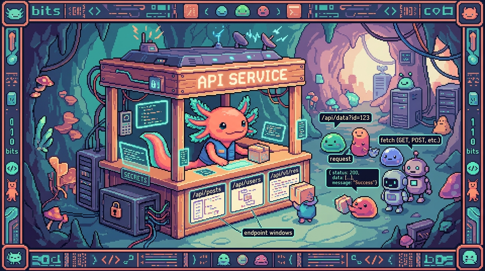

# Capitulo 13 — Construir tu propia API

<p align="center">
  
</p>


> Hasta ahora siempre fuiste **cliente**: tu codigo hacia `fetch` a la API de alguien mas (GitHub, OpenAI, Supabase) y recibia una respuesta. En este capitulo cambias de bando. Vas a **construir tu propia API**: el lugar al que *otros* (incluido tu propio frontend) le hacen `fetch`. Bit el ajolote se frota las manitas: "Hoy dejamos de pedir prestada la cocina ajena... y montamos la nuestra." Lo haremos con dos herramientas reales que usan tus repos: las **rutas de API de Next.js** (como en Faro) y los **Cloudflare Workers** (como en tunal-digital). Y vamos a insistir, mucho, en lo mas importante: **tus claves secretas viven en el servidor, jamas en el navegador.**

---

## 1. ¿Por que necesito una API propia?

En el modulo 03 aprendiste `fetch`. Probablemente pensaste: "si desde el navegador puedo llamar a la API de OpenAI, ¿para que quiero un backend en medio?". Excelente pregunta. La respuesta corta: **por seguridad y por control**.

Imagina el chat de IA de **tunal-digital**. Es un sitio de HTML, CSS y JavaScript "vanilla" (sin frameworks) con un cotizador, un formulario y un chat que responde con inteligencia artificial. Ese chat necesita llamar a la API de Claude (Anthropic). Para llamar a Claude necesitas una **clave de API**, algo como `sk-ant-...`. 

Si pusieras esa clave en el JavaScript del navegador, cualquier visitante podria abrir las herramientas de desarrollador, copiarla y gastar tu dinero. Por eso tunal-digital **no** llama a Claude desde el navegador: llama primero a un **Cloudflare Worker** (un pequeño servidor), y es el Worker quien guarda la clave y habla con Claude. El navegador nunca ve el secreto.

> ### 🟦 ¿Que significa? — *API propia (backend)*
> Una **API propia** es un programa que vive en un servidor y expone direcciones (URLs) a las que tu aplicacion le pide cosas. Tu codigo de servidor decide que datos entrega, que valida y que esconde.
> **Para que sirve:** centralizar logica, proteger secretos y ser el unico que habla con servicios caros o privados.
> **Donde se usa:** en **Faro** son las rutas dentro de `app/api/...`; en **tunal-digital** es el Cloudflare Worker que atiende el chat.

> ### 🟦 ¿Que significa? — *Cliente y servidor*
> El **cliente** es quien pide (el navegador, tu app de celular). El **servidor** es quien responde (tu API). El cliente nunca debe guardar secretos porque vive en la maquina del usuario, donde cualquiera puede mirar.
> **Para que sirve:** separar lo publico (lo que ve el usuario) de lo privado (claves, logica).
> **Donde se usa:** en RachaSimple el cliente es React; el servidor de autenticacion es Supabase. En Faro el cliente es la interfaz y el servidor son las rutas de API de Next.js.

---

## 2. Una ruta de API en Next.js (route handler)

**Faro** esta hecho con Next.js + React + TypeScript. Next.js trae una manera elegante de crear endpoints: pones un archivo `route.ts` dentro de una carpeta bajo `app/api/`, y esa carpeta se convierte en una URL.

> ### 🟦 ¿Que significa? — *Endpoint*
> Un **endpoint** es una direccion concreta de tu API a la que se le pide algo, por ejemplo `/api/proyectos`. Cada endpoint hace una tarea.
> **Para que sirve:** organizar tu API en "puertas" claras, cada una con su proposito.
> **Donde se usa:** Faro tiene endpoints como `/api/analyze` (dispara el analisis con IA) o rutas para leer proyectos de GitHub.

> ### 🟦 ¿Que significa? — *Route handler (manejador de ruta)*
> En Next.js, un **route handler** es una funcion que responde a un endpoint. Se escribe en un archivo `route.ts` y exportas funciones con el nombre del metodo HTTP: `GET`, `POST`, etc.
> **Para que sirve:** decir "cuando alguien haga GET a esta URL, ejecuta esta funcion".
> **Donde se usa:** todas las rutas de API de Faro son route handlers.

> ### 🟦 ¿Que significa? — *Metodo HTTP (GET, POST...)*
> Un **metodo HTTP** es el "verbo" de la peticion. `GET` = "dame datos" (no cambia nada). `POST` = "aqui van datos, crea/procesa algo". Tambien existen `PUT` (actualizar) y `DELETE` (borrar).
> **Para que sirve:** comunicar la *intencion* de la peticion.
> **Donde se usa:** Faro usa `GET` para listar proyectos y `POST` para enviar datos y pedir un analisis con IA.

Asi se ve un route handler sencillo en Faro. El archivo estaria en `app/api/saludo/route.ts`:

```ts
// app/api/saludo/route.ts
import { NextResponse } from "next/server";

// Responde a GET /api/saludo
export async function GET() {
  return NextResponse.json({ mensaje: "Hola desde la API de Faro" });
}
```

Si tu app esta corriendo y entras a `http://localhost:3000/api/saludo`, recibes `{ "mensaje": "Hola desde la API de Faro" }`. ¡Ya construiste tu primera API!

> ### 🟦 ¿Que significa? — *NextResponse.json()*
> `NextResponse.json(objeto)` es una funcion de Next.js que toma un objeto de JavaScript, lo convierte a **JSON** y lo envia al cliente con las cabeceras correctas.
> **Para que sirve:** devolver datos de forma estandar sin armar la respuesta a mano.
> **Donde se usa:** practicamente todas las rutas de API de Faro terminan con un `NextResponse.json(...)`.

> ### 🟦 ¿Que significa? — *JSON*
> **JSON** (JavaScript Object Notation) es un formato de texto para intercambiar datos. Se ve como un objeto de JavaScript: llaves, claves entre comillas y valores. Es el idioma universal de las APIs.
> **Para que sirve:** que cliente y servidor se entiendan, sin importar el lenguaje de cada uno.
> **Donde se usa:** Faro, tunal-digital y hasta PolyPaw (que guarda datos en archivos `.json`) usan JSON.

> ### 💡 Tip
> La carpeta es la URL. `app/api/proyectos/route.ts` → `/api/proyectos`. `app/api/proyectos/[id]/route.ts` → `/api/proyectos/123` (donde `[id]` es un parametro variable). Crear endpoints es, literalmente, crear carpetas.

---

## 3. Recibir datos: leer lo que manda el cliente

Una API aburrida solo responde lo mismo siempre. Una API util **recibe datos**, los procesa y responde en consecuencia. En Faro, cuando el usuario dispara un analisis, el frontend envia (por `POST`) que proyecto analizar.

> ### 🟦 ¿Que significa? — *Request (peticion)*
> El **request** es el objeto que representa lo que el cliente envio: el metodo, las cabeceras y el cuerpo (body). Tu route handler lo recibe como argumento.
> **Para que sirve:** leer que pidio el usuario para responder lo correcto.
> **Donde se usa:** las rutas `POST` de Faro reciben un `request` para sacar el id del proyecto.

> ### 🟦 ¿Que significa? — *Body (cuerpo de la peticion)*
> El **body** es la "carga" que el cliente envia, normalmente en JSON. En un `GET` casi nunca hay body; en un `POST` es donde van los datos.
> **Para que sirve:** mandar informacion al servidor (un formulario, un id, un texto).
> **Donde se usa:** el chat de tunal-digital envia en el body el mensaje del usuario; Faro envia el id del proyecto a analizar.

```ts
// app/api/analizar/route.ts
import { NextResponse } from "next/server";

export async function POST(request: Request) {
  // Leemos el JSON que mando el cliente
  const datos = await request.json();
  const proyectoId = datos.proyectoId;

  // ... aqui Faro buscaria el proyecto y llamaria a OpenAI ...

  return NextResponse.json({ ok: true, proyectoId });
}
```

Fijate en `await request.json()`. Como leer el cuerpo es una operacion que toma su tiempo, es **asincrona**, asi que usamos `await` (eso lo viste en el modulo 03 con `fetch`).

> ### 🔎 En tu codigo
> En el frontend de Faro, llamar a esa ruta se ve asi:
> ```ts
> const res = await fetch("/api/analizar", {
>   method: "POST",
>   headers: { "Content-Type": "application/json" },
>   body: JSON.stringify({ proyectoId: "abc-123" }),
> });
> const data = await res.json();
> ```
> El `JSON.stringify` convierte tu objeto a texto JSON para enviarlo. Del otro lado, `request.json()` lo vuelve a convertir en objeto. Ida y vuelta.

---

## 4. Validar: nunca confies en el cliente

Aqui Bit se pone serio (lo cual es raro en un ajolote). **Cualquiera puede mandar lo que sea a tu API.** Un usuario malintencionado puede enviar un body vacio, un id que no existe, o texto enorme para tumbar tu servidor. Tu API debe **validar** antes de actuar.

> ### 🟦 ¿Que significa? — *Validar*
> **Validar** es revisar que los datos que llegaron cumplan las reglas (que existan, que sean del tipo correcto, que no esten vacios) antes de usarlos.
> **Para que sirve:** evitar errores, datos basura y ataques.
> **Donde se usa:** antes de llamar a OpenAI, Faro valida que venga un proyecto valido; tunal-digital valida que el mensaje del chat no este vacio.

```ts
export async function POST(request: Request) {
  const datos = await request.json();
  const proyectoId = datos?.proyectoId;

  // Validacion: ¿vino el id y es texto?
  if (!proyectoId || typeof proyectoId !== "string") {
    return NextResponse.json(
      { error: "Falta proyectoId o no es valido" },
      { status: 400 } // 400 = peticion incorrecta
    );
  }

  // Si pasa la validacion, seguimos...
  return NextResponse.json({ ok: true, proyectoId });
}
```

> ### ⚠️ Cuidado
> "Pero yo controlo el frontend, yo nunca mandaria datos malos." No importa. Tu frontend no es el unico que puede llamar a tu API: cualquiera con la URL puede. **Validar en el servidor no es opcional.** El navegador es territorio del usuario, no tuyo.

---

## 5. Codigos de estado: el semaforo de HTTP

Cada respuesta HTTP lleva un **codigo de estado**: un numero que resume como salio todo. Ya usaste algunos sin notarlo (el famoso `404`).

> ### 🟦 ¿Que significa? — *Codigo de estado (status code)*
> Un **codigo de estado** es un numero de tres cifras que indica el resultado de la peticion. `2xx` = exito, `4xx` = error del cliente, `5xx` = error del servidor.
> **Para que sirve:** que el cliente sepa, sin leer el contenido, si todo fue bien o que tipo de error hubo.
> **Donde se usa:** las rutas de Faro devuelven `200` al exito y `400`/`401`/`500` en errores; el Worker de tunal-digital responde `200` cuando Claude contesta bien.

Los que mas vas a usar:

| Codigo | Significado | Cuando usarlo |
|--------|-------------|---------------|
| `200` | OK | Todo salio bien |
| `201` | Creado | Creaste un recurso nuevo |
| `400` | Bad Request | El cliente mando datos invalidos |
| `401` | No autorizado | Falta login / token |
| `404` | No encontrado | Ese recurso no existe |
| `500` | Error del servidor | Algo se rompio de tu lado |

> ### 🟦 ¿Que significa? — *401 No autorizado*
> El `401` dice "no se quien eres o no tienes permiso". Es distinto del `400` (datos malos) y del `404` (no existe).
> **Para que sirve:** proteger endpoints privados.
> **Donde se usa:** Faro usa autenticacion con Supabase Auth; si llamas a una ruta privada sin sesion, lo correcto es responder `401`.

> ### 💡 Tip
> Por defecto `NextResponse.json(datos)` ya devuelve `200`. Solo necesitas indicar el status cuando es distinto: `NextResponse.json({ error: "..." }, { status: 400 })`. En errores, devuelve **siempre** un JSON con un campo `error` legible; tu yo del futuro lo agradecera al depurar.

---

## 6. El patron proxy: esconder secretos detras de tu backend

Llegamos al corazon del capitulo, y a la regla de seguridad de Faro: **tokens y secretos solo en el servidor, nunca en el cliente.** La tecnica que lo hace posible se llama **patron proxy**.

> ### 🟦 ¿Que significa? — *Patron proxy*
> Un **proxy** es un intermediario. En vez de que el cliente llame directo al servicio externo (OpenAI, Claude), llama a *tu* API, y *tu* API es la que llama al servicio con la clave secreta y devuelve el resultado.
> **Para que sirve:** que la clave nunca llegue al navegador y que tu controles que se pide.
> **Donde se usa:** el Worker de tunal-digital es un proxy a Claude; las rutas de Faro son un proxy a OpenAI.

Asi se ve el flujo:

```
SIN proxy (PELIGROSO):
  Navegador  --(con la clave sk-...)-->  OpenAI/Claude   ❌

CON proxy (SEGURO):
  Navegador  -->  TU API (guarda la clave)  -->  OpenAI/Claude   ✅
              <--                            <--
```

> ### 🟦 ¿Que significa? — *Variable de entorno*
> Una **variable de entorno** es un valor de configuracion (como una clave secreta) que vive *fuera* del codigo, en el servidor. Se lee con `process.env.NOMBRE` en Next.js o `env.NOMBRE` en un Worker. Nunca se escribe directamente en el codigo ni se sube al repo.
> **Para que sirve:** guardar secretos sin commitearlos y cambiarlos sin tocar el codigo.
> **Donde se usa:** Faro guarda la clave de OpenAI en variables de entorno; tunal-digital guarda la clave de Claude como secreto del Worker.

Asi seria una ruta proxy en Faro que llama a OpenAI sin exponer la clave:

```ts
// app/api/ia/route.ts
import { NextResponse } from "next/server";

export async function POST(request: Request) {
  const { prompt } = await request.json();

  if (!prompt || typeof prompt !== "string") {
    return NextResponse.json({ error: "Falta prompt" }, { status: 400 });
  }

  // La clave vive en el servidor, jamas viaja al navegador
  const respuesta = await fetch("https://api.openai.com/v1/chat/completions", {
    method: "POST",
    headers: {
      "Content-Type": "application/json",
      Authorization: `Bearer ${process.env.OPENAI_API_KEY}`,
    },
    body: JSON.stringify({
      model: "gpt-4o-mini",
      messages: [{ role: "user", content: prompt }],
    }),
  });

  const data = await respuesta.json();
  return NextResponse.json({ texto: data.choices[0].message.content });
}
```

El navegador solo conoce `/api/ia`. Nunca ve `OPENAI_API_KEY`. Ese es el patron proxy en accion.

> ### ⚠️ Cuidado
> En Next.js, cualquier variable de entorno que empiece con `NEXT_PUBLIC_` se incrusta en el codigo del navegador y queda **publica**. Jamas pongas una clave secreta con ese prefijo. `OPENAI_API_KEY` (sin prefijo) se queda en el servidor; `NEXT_PUBLIC_ALGO` se va al cliente. Confundirlos es filtrar tu clave.

> ### 🔎 En tu codigo
> Esta es exactamente la filosofia de Faro: la IA de OpenAI que genera descripcion, estado, progreso y roadmap se llama desde rutas del servidor, con la clave en variables de entorno. Los tokens de cada usuario se guardan en una tabla `user_connections` protegida con **RLS** (Row Level Security: una regla de la base de datos que hace que cada usuario solo pueda leer sus propias filas). El frontend solo dispara el analisis "bajo demanda" y recibe JSON ya cocinado.

---

## 7. Cloudflare Workers: el caso de tunal-digital

Faro tiene un backend completo de Next.js. Pero **tunal-digital** es solo HTML, CSS y JavaScript vanilla: ¡no tiene servidor propio! ¿Como esconde entonces la clave de Claude? Con un **Cloudflare Worker**.

> ### 🟦 ¿Que significa? — *Cloudflare Worker*
> Un **Cloudflare Worker** es una pequeña funcion de servidor que Cloudflare ejecuta en sus servidores, repartidos por el mundo, muy cerca del usuario. No administras maquinas: solo subes una funcion y te dan una URL.
> **Para que sirve:** tener "un poquito de backend" sin montar un servidor entero. Ideal para un sitio estatico que necesita esconder una clave.
> **Donde se usa:** tunal-digital usa un Worker como proxy entre su chat y la API de Claude (Anthropic).

Un Worker no usa `NextResponse`; usa el estandar web `Request`/`Response`. Su estructura minima:

```js
// worker.js — el proxy de chat de tunal-digital
export default {
  async fetch(request, env) {
    // Solo aceptamos POST para el chat
    if (request.method !== "POST") {
      return new Response("Metodo no permitido", { status: 405 });
    }

    const { mensaje } = await request.json();

    // Validacion
    if (!mensaje || typeof mensaje !== "string") {
      return new Response(
        JSON.stringify({ error: "Mensaje vacio" }),
        { status: 400, headers: { "Content-Type": "application/json" } }
      );
    }

    // Llamamos a Claude con la clave guardada como secreto del Worker
    const r = await fetch("https://api.anthropic.com/v1/messages", {
      method: "POST",
      headers: {
        "Content-Type": "application/json",
        "x-api-key": env.ANTHROPIC_API_KEY,
        "anthropic-version": "2023-06-01",
      },
      body: JSON.stringify({
        model: "claude-3-5-haiku-latest",
        max_tokens: 500,
        messages: [{ role: "user", content: mensaje }],
      }),
    });

    const data = await r.json();
    return new Response(
      JSON.stringify({ respuesta: data.content[0].text }),
      { status: 200, headers: { "Content-Type": "application/json" } }
    );
  },
};
```

> ### 🟦 ¿Que significa? — *env (entorno del Worker)*
> En un Worker, `env` es el objeto que contiene las variables de entorno y secretos. `env.ANTHROPIC_API_KEY` es la clave de Claude, configurada en el panel de Cloudflare, no en el codigo.
> **Para que sirve:** acceder a secretos sin escribirlos en el archivo del Worker.
> **Donde se usa:** el Worker de tunal-digital lee de ahi su clave de Anthropic.

> ### 💡 Tip
> Igual que Faro y su clave de OpenAI, tunal-digital y su clave de Claude siguen la misma regla de oro: **el secreto vive en el servidor (aqui, el Worker), nunca en el JavaScript del navegador.** Dos stacks distintos, una misma disciplina de seguridad.

---

## 8. CORS a grandes rasgos

Cuando tu pagina (digamos `tunaldigital.com`) llama a una API en *otro* dominio (el Worker en `tu-worker.workers.dev`), el navegador aplica una regla de seguridad llamada **CORS**. Si tu API no da permiso explicito, el navegador bloquea la respuesta.

> ### 🟦 ¿Que significa? — *CORS*
> **CORS** (Cross-Origin Resource Sharing) es una regla del navegador: por defecto, una pagina solo puede leer respuestas de su *mismo origen* (mismo dominio, puerto y protocolo). Para permitir otros origenes, el servidor debe enviar cabeceras especiales.
> **Para que sirve:** evitar que cualquier sitio malicioso use tu API en nombre de tus usuarios sin permiso.
> **Donde se usa:** el Worker de tunal-digital, que vive en un dominio distinto al sitio, debe enviar cabeceras CORS para que el chat funcione.

> ### 🟦 ¿Que significa? — *Origen (origin)*
> Un **origen** es la combinacion de protocolo + dominio + puerto, por ejemplo `https://tunaldigital.com`. Dos URLs son del "mismo origen" solo si coinciden los tres.
> **Para que sirve:** es la unidad con la que el navegador decide que esta permitido.
> **Donde se usa:** Faro, al llamar `fetch("/api/...")` (mismo origen), no sufre CORS; tunal-digital, al llamar a otro dominio, si.

La cabecera clave es `Access-Control-Allow-Origin`. En el Worker:

```js
const cabecerasCORS = {
  "Access-Control-Allow-Origin": "https://tunaldigital.com",
  "Access-Control-Allow-Methods": "POST, OPTIONS",
  "Access-Control-Allow-Headers": "Content-Type",
};

// El navegador manda primero una peticion OPTIONS (preflight)
if (request.method === "OPTIONS") {
  return new Response(null, { status: 204, headers: cabecerasCORS });
}
```

> ### 🟦 ¿Que significa? — *Preflight (peticion OPTIONS)*
> Antes de un `POST` a otro origen, el navegador envia automaticamente una peticion `OPTIONS` para preguntar "¿me dejas?". Tu servidor responde con las cabeceras CORS. Si dice que si, el navegador hace el `POST` real.
> **Para que sirve:** confirmar permisos antes de enviar datos de verdad.
> **Donde se usa:** el Worker de tunal-digital responde a ese `OPTIONS` antes de procesar el chat.

> ### ⚠️ Cuidado
> Es tentador poner `Access-Control-Allow-Origin: *` (asterisco = "cualquiera"). Para una API publica de solo lectura puede valer, pero para una que cuesta dinero (como un proxy a Claude) **limita el origen a tu propio dominio**. Si dejas `*`, cualquier web podria usar tu Worker y gastar tu cuota. CORS no reemplaza la validacion ni la autenticacion: es solo una capa mas.

> ### 💡 Tip
> En Faro casi nunca pelearas con CORS, porque el frontend y las rutas `/api` viven en el *mismo* dominio. CORS aparece sobre todo cuando, como en tunal-digital, el sitio y la API estan separados. Si ves "blocked by CORS policy" en la consola, ya sabes: faltan cabeceras en el servidor.

---

## 9. Juntando todo: el viaje de una peticion

Recapitulemos el camino completo, con el chat de tunal-digital como ejemplo:

1. El usuario escribe "¿cuanto cuesta una pagina web?" y presiona enviar.
2. El JavaScript del navegador hace `fetch` (POST) al Worker, con el mensaje en el **body** como JSON.
3. El navegador, como es otro origen, primero hace el **preflight OPTIONS**; el Worker responde con cabeceras **CORS**.
4. El Worker **valida** que el mensaje no este vacio.
5. El Worker, como **proxy**, llama a Claude usando su clave secreta (`env.ANTHROPIC_API_KEY`).
6. Claude responde; el Worker devuelve un **JSON** con `status 200`.
7. El navegador recibe la respuesta y la muestra en el chat.

En ningun momento la clave toco el navegador. Ese es el objetivo de todo este capitulo. Bit sonrie: "El secreto se quedo en casa, justo donde debe estar."

---

## ✅ Checklist — ¿ya domino esto?

- [ ] Entiendo la diferencia entre **cliente** y **servidor**, y por que los secretos solo van en el servidor.
- [ ] Se crear un **route handler** en Next.js poniendo `route.ts` en una carpeta bajo `app/api/`.
- [ ] Se exportar funciones `GET` y `POST` y devolver datos con `NextResponse.json(...)`.
- [ ] Se leer el **body** de una peticion con `await request.json()`.
- [ ] **Valido** siempre los datos recibidos antes de usarlos, y respondo `400` si son invalidos.
- [ ] Conozco los **codigos de estado** mas comunes: `200`, `400`, `401`, `404`, `500`.
- [ ] Entiendo el **patron proxy** y por que es la forma correcta de esconder claves de OpenAI o Claude.
- [ ] Se que una **variable de entorno** guarda secretos fuera del codigo, y que `NEXT_PUBLIC_` los hace publicos.
- [ ] Entiendo a grandes rasgos que es **CORS**, el **origen** y la peticion **preflight OPTIONS**.
- [ ] Se que un **Cloudflare Worker** es un mini-servidor ideal para dar backend a un sitio estatico como tunal-digital.

---

## 🧪 Ejercicios

1. 💻 **Tu primer endpoint.** En un proyecto Next.js, crea `app/api/saludo/route.ts` con un `GET` que devuelva `{ mensaje: "Hola" }`. Entra a `http://localhost:3000/api/saludo` en el navegador y confirma que ves el JSON.

2. 💻 **Recibir y validar.** Crea `app/api/eco/route.ts` con un `POST` que lea `texto` del body y lo devuelva en mayusculas. Si `texto` falta o no es string, responde `400` con `{ error: "..." }`. Pruebalo con `fetch` desde la consola del navegador.

3. **En papel: codigos de estado.** Para cada situacion, escribe que codigo devolverias y por que: (a) el usuario pide un proyecto que no existe; (b) manda un body vacio; (c) todo sale bien; (d) tu llamada a OpenAI falla por un error interno.

4. 💻 **Patron proxy simulado.** Escribe una ruta `/api/clima` que, en vez de exponer una clave, lea `process.env.CLIMA_API_KEY` y la use en un `fetch` a un servicio (puedes simular el servicio). Verifica que la clave **no** aparece en el codigo del navegador (revisa las herramientas de desarrollador).

5. **CORS en tu cabeza.** Explica con tus palabras por que el chat de tunal-digital necesita cabeceras CORS pero las rutas `/api` de Faro normalmente no. Pista: piensa en los **origenes**.

6. 💻 **(Reto) Un mini-Worker.** Si tienes cuenta de Cloudflare, crea un Worker que responda `{ respuesta: "pong" }` a un `POST`, rechace cualquier otro metodo con `405` y conteste el preflight `OPTIONS` con cabeceras CORS limitadas a tu dominio. No llames a ninguna IA todavia: solo el esqueleto del proxy.
