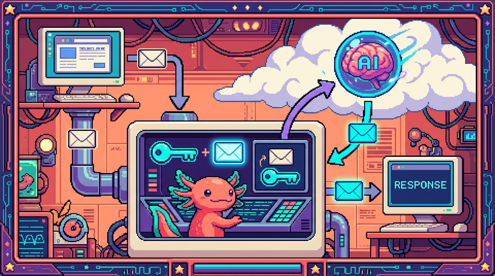

# Capitulo 14 — Mini-proyecto: tu propio proxy de IA

<p align="center">
  
</p>


> Llegamos al gran final del modulo. En los capitulos anteriores aprendiste a hablar con APIs, a usar `fetch`, a pedir una clave secreta y hasta a entender que es OAuth. Hoy todo eso se junta en un solo proyecto que de verdad funciona: un pequeno backend que recibe un mensaje desde el navegador, le pega tu clave secreta **en el servidor**, llama a una API de IA y te devuelve la respuesta, sin que nadie pueda robarte la clave por el camino. Es justo el patron que usa el sitio real **tunal-digital** para su chat con la IA de Claude. Bit, nuestro ajolote, se puso el casco de obra: hoy construimos algo de verdad.

---

## 1. Que vamos a construir (y por que importa)

Imagina una pagina web sencilla: una cajita de texto donde escribes una pregunta, un boton "Enviar" y un area donde aparece la respuesta de una IA. Suena simple, y la parte visual lo es. El problema esta escondido: **para hablar con la IA necesitas una clave secreta**, y esa clave NO puede vivir en el navegador.

Entonces, ¿como hace la pagina para usar la IA sin tener la clave? Poniendo a alguien **en el medio**: un pequeno servidor de confianza que si la tiene. El navegador le habla a ese servidor, y el servidor le habla a la IA. A ese intermediario lo llamamos **proxy**.

> ### 🟦 ¿Que significa? — *Proxy*
> Un **proxy** es un programa que se planta en medio de dos partes y reenvia mensajes de una a otra, normalmente anadiendo o quitando algo en el camino. En nuestro caso, recibe el mensaje del navegador, le agrega la clave secreta y lo reenvia a la IA.
> **Para que sirve:** para que el navegador nunca tenga que conocer la clave; el proxy la guarda y la usa en su lugar.
> **Donde se usa en un repo real:** en **tunal-digital**, el chat de la web no llama directo a la API de Claude. Llama a un **Cloudflare Worker** (el proxy), y ese Worker es quien tiene la clave de Anthropic y habla con la IA.

El diagrama mental es este:

```
Navegador  ──(mensaje)──►  Proxy (tiene la clave)  ──(mensaje + clave)──►  API de IA
Navegador  ◄──(respuesta)──  Proxy                 ◄──(respuesta)────────  API de IA
```

> ### 💡 Tip
> Si te quedas con una sola idea de este capitulo, que sea esta: **la clave secreta vive en el servidor, jamas en el navegador**. Todo lo demas que construyamos hoy existe para cumplir esa regla.

---

## 2. Repaso rapido de las piezas que ya conoces

No empezamos de cero. Estas piezas ya las viste a lo largo del modulo; hoy solo las vamos a conectar. Aun asi te dejo la definicion fresca de cada una para que nada quede colgando.

> ### 🟦 ¿Que significa? — *HTTP*
> **HTTP** es el idioma con el que dos computadoras se hablan por internet. El navegador manda una **peticion** ("dame esto", "guarda esto otro") y el servidor manda una **respuesta**. Cada peticion lleva un metodo (como `GET` para pedir o `POST` para enviar datos), unas cabeceras y, a veces, un cuerpo con datos.
> **Para que sirve:** para mover informacion entre cliente y servidor de forma ordenada.
> **Donde se usa en un repo real:** en **Faro**, cuando aprietas "analizar proyecto", el navegador manda una peticion HTTP a una ruta del backend de Next.js, y esa ruta responde con el analisis generado por IA.

> ### 🟦 ¿Que significa? — *API*
> Una **API** (Interfaz de Programacion de Aplicaciones) es la lista de "puertas de entrada" que un programa ofrece para que otros programas le pidan cosas. Es como el menu de un restaurante: tu no entras a la cocina, pides del menu y te traen el plato.
> **Para que sirve:** para que tu codigo use un servicio (una IA, una base de datos, GitHub) sin tener que saber como funciona por dentro.
> **Donde se usa en un repo real:** **Faro** usa la API de OpenAI para generar texto, y las APIs de GitHub y Google Drive para leer tus proyectos. **tunal-digital** usa la API de Anthropic (Claude).

> ### 🟦 ¿Que significa? — *fetch*
> **`fetch`** es una funcion que ya trae JavaScript para hacer peticiones HTTP desde el codigo. Le pasas una direccion (URL) y unas opciones (metodo, cabeceras, cuerpo) y te devuelve una **promesa** con la respuesta.
> **Para que sirve:** es la herramienta principal para llamar a una API desde JavaScript, tanto en el navegador como en el servidor.
> **Donde se usa en un repo real:** el chat de **tunal-digital** usa `fetch` en el navegador para llamar al Worker, y el Worker usa `fetch` por dentro para llamar a la API de Claude.

> ### 🟦 ¿Que significa? — *Clave de API (API key)*
> Una **clave de API** es una contrasena larga y secreta que identifica a quien esta usando un servicio. La API de IA revisa la clave para saber que la peticion viene de una cuenta valida (y, normalmente, para cobrarte por el uso).
> **Para que sirve:** para autenticarte ante el servicio y poder usarlo.
> **Donde se usa en un repo real:** **Faro** guarda la clave de OpenAI como variable de entorno del servidor; **tunal-digital** guarda la clave de Anthropic como secreto del Worker. En ninguno de los dos la clave llega al navegador.

> ### ⚠️ Cuidado
> Si pegaras tu clave de API directamente en el JavaScript del navegador, cualquiera podria abrir las herramientas de desarrollo (F12), verla, copiarla y gastar tu dinero con tu cuenta. Esto ha arruinado a mas de un proyecto. Por eso existe el proxy.

---

## 3. El backend: que es y por que lo necesitamos

> ### 🟦 ¿Que significa? — *Backend*
> El **backend** es la parte de una aplicacion que corre en un servidor, no en el navegador del usuario. El usuario no ve su codigo; solo recibe sus respuestas. Es un lugar **de confianza** donde puedes guardar secretos.
> **Para que sirve:** para hacer tareas que no deben ocurrir a la vista de todos: usar claves secretas, hablar con bases de datos, validar datos.
> **Donde se usa en un repo real:** **Faro** tiene su backend en las rutas de servidor de Next.js; **tunal-digital** usa un **Cloudflare Worker** como backend minimo.

> ### 🟦 ¿Que significa? — *Cliente / lado del cliente*
> El **cliente** es la parte que corre en el dispositivo del usuario: el navegador con su HTML, CSS y JavaScript. Todo lo que esta en el cliente es **publico**: el usuario puede leerlo.
> **Para que sirve:** para mostrar la interfaz y reaccionar a lo que hace la persona.
> **Donde se usa en un repo real:** en **tunal-digital**, la pagina HTML/CSS/JS **vanilla** (es decir, JavaScript "puro", sin frameworks como React) con la cajita del chat, el cotizador y el formulario es todo cliente.

> ### 🟦 ¿Que significa? — *Cloudflare Worker*
> Un **Cloudflare Worker** es un pequeno programa de servidor que corre en la nube de Cloudflare sin que tengas que administrar ninguna maquina. Le das un trozo de codigo y Cloudflare lo ejecuta cada vez que llega una peticion a su direccion.
> **Para que sirve:** para tener un backend liviano y barato, ideal justo para un proxy de IA.
> **Donde se usa en un repo real:** es exactamente lo que usa **tunal-digital** para su chat: el Worker es el proxy entre la web y la API de Claude.

> ### 🔎 En tu codigo
> Para este capitulo no necesitas Cloudflare. Vamos a construir el mismo proxy con **Node.js** en tu propia computadora, porque es mas facil de probar y la idea de fondo es identica. Una vez que lo entiendas, mover el codigo a un Worker o a una ruta de Next.js (como en Faro) es un paso pequeno.

---

## 4. Preparar el proyecto en tu computadora 💻

Vamos a crear una carpeta con dos partes: el proxy (servidor) y una pagina web sencilla (cliente). Abre tu terminal y sigue los pasos.

```bash
mkdir proxy-ia
cd proxy-ia
npm init -y
```

> ### 🟦 ¿Que significa? — *npm init*
> **`npm init -y`** crea un archivo `package.json`, que es la "ficha de identidad" de tu proyecto JavaScript: dice como se llama, que dependencias usa y que comandos sabe ejecutar. El `-y` acepta todas las respuestas por defecto.
> **Para que sirve:** para que Node sepa que esto es un proyecto y puedas instalar librerias.
> **Donde se usa en un repo real:** todos los repos del curso lo tienen. **Faro** y **RachaSimple** tienen un `package.json` con sus dependencias (Next.js, React, Supabase, etc.).

Ahora vamos a usar variables de entorno para guardar la clave. Crea un archivo llamado `.env`:

```
IA_API_KEY=pega-aqui-tu-clave-secreta
```

> ### 🟦 ¿Que significa? — *Variable de entorno*
> Una **variable de entorno** es un valor que vive fuera de tu codigo, en el "ambiente" donde corre el programa. Tu codigo la lee con `process.env.NOMBRE`, pero el valor no esta escrito dentro de los archivos que compartes.
> **Para que sirve:** para guardar secretos (como claves) y configuraciones sin escribirlos en el codigo que subes a GitHub.
> **Donde se usa en un repo real:** **Faro** guarda ahi la clave de OpenAI y las credenciales de Supabase; su `CLAUDE.md` ordena explicitamente que "tokens y secretos solo en el servidor (variables de entorno)".

> ### ⚠️ Cuidado
> El archivo `.env` NUNCA debe subirse a GitHub. Crea un archivo `.gitignore` con una linea que diga `.env` para que git lo ignore. Si tu clave termina en un repo publico, dala por quemada y generala de nuevo de inmediato.

> ### 💡 Tip
> Una clave "quemada" es una clave que se volvio publica por accidente. Casi todos los servicios te dejan **revocar** (anular) una clave y crear otra desde su panel. Hazlo sin pena: es lo correcto.

---

## 5. Escribir el proxy paso a paso 💻

Crea un archivo `servidor.js`. Lo vamos a armar por pedazos para entender cada linea, y al final lo veras completo.

### 5.1 Levantar un servidor que escucha

```javascript
// servidor.js
import http from "node:http";

const PORT = 3000;

const servidor = http.createServer((req, res) => {
  res.end("Hola, soy el proxy de IA");
});

servidor.listen(PORT, () => {
  console.log(`Proxy escuchando en http://localhost:${PORT}`);
});
```

> ### 🟦 ¿Que significa? — *Servidor*
> Un **servidor** es un programa que se queda esperando peticiones y responde a cada una. `http.createServer` crea uno; `listen` lo pone a escuchar en un **puerto** (una "puerta" numerada de tu computadora, aqui la 3000).
> **Para que sirve:** para recibir las peticiones del navegador y contestarlas.
> **Donde se usa en un repo real:** todo backend es un servidor. El Worker de **tunal-digital** y las rutas de **Faro** hacen este mismo trabajo, aunque el framework les esconda la parte de `listen`.

Corre `node servidor.js` y abre `http://localhost:3000` en el navegador. Si ves el saludo, ya tienes un servidor vivo. Bit aplaude con sus patitas.

### 5.2 Leer el mensaje que manda el navegador

El navegador nos va a mandar el mensaje del usuario en el **cuerpo** de una peticion `POST`, en formato JSON. Toca leerlo.

> ### 🟦 ¿Que significa? — *JSON*
> **JSON** (JavaScript Object Notation) es una forma de escribir datos como texto, con llaves, comillas y dos puntos. Por ejemplo `{ "mensaje": "hola" }`. Casi todas las APIs hablan en JSON.
> **Para que sirve:** para enviar datos estructurados entre cliente y servidor de forma que ambos los entiendan.
> **Donde se usa en un repo real:** la API de OpenAI en **Faro** y la de Claude en **tunal-digital** reciben y devuelven JSON.

> ### 🟦 ¿Que significa? — *Cuerpo (body) de una peticion*
> El **cuerpo** es la parte de una peticion HTTP que lleva los datos. En un `POST`, ahi viaja la informacion que mandas (por ejemplo, el mensaje del usuario). El cuerpo llega en pedacitos, asi que hay que juntarlos.
> **Para que sirve:** para transportar los datos de la peticion.
> **Donde se usa en un repo real:** cuando **Faro** pide un analisis, el cuerpo lleva que proyecto analizar.

```javascript
function leerCuerpo(req) {
  return new Promise((resolve) => {
    let datos = "";
    req.on("data", (parte) => (datos += parte));
    req.on("end", () => resolve(datos ? JSON.parse(datos) : {}));
  });
}
```

> ### 🟦 ¿Que significa? — *Promesa (Promise)*
> Una **promesa** es un objeto de JavaScript que representa un resultado que **aun no esta listo** pero llegara mas tarde (por ejemplo, cuando el cuerpo de la peticion termine de llegar). Cuando el valor ya esta disponible, la promesa se **resuelve** (`resolve`). El `await` que viste antes es justo la forma de esperar a que una promesa se resuelva.
> **Para que sirve:** para manejar cosas que tardan (red, archivos, temporizadores) sin congelar el programa mientras esperas.
> **Donde se usa en un repo real:** `fetch` siempre devuelve una promesa; cada llamada a la API de OpenAI en **Faro** o a la de Claude en **tunal-digital** es, por dentro, una promesa que se espera con `await`.

> ### 🟦 ¿Que significa? — *JSON.parse y JSON.stringify*
> **`JSON.parse`** convierte un texto JSON en un objeto de JavaScript con el que puedes trabajar. **`JSON.stringify`** hace lo contrario: convierte un objeto en texto JSON para enviarlo.
> **Para que sirve:** para traducir entre "texto que viaja por la red" y "objeto que usa tu codigo".
> **Donde se usa en un repo real:** en cualquier llamada a una API de IA: se arma el cuerpo con `stringify` y se lee la respuesta con `parse`.

### 5.3 Anadir la clave y llamar a la IA

Aqui esta el corazon del proxy. Tomamos el mensaje del usuario, leemos la clave **del entorno del servidor** y llamamos a la API de IA con `fetch`.

```javascript
async function preguntarAIA(mensajeUsuario) {
  const respuesta = await fetch("https://api.de-la-ia.com/v1/chat", {
    method: "POST",
    headers: {
      "Content-Type": "application/json",
      "Authorization": `Bearer ${process.env.IA_API_KEY}`,
    },
    body: JSON.stringify({
      model: "modelo-de-ejemplo",
      messages: [{ role: "user", content: mensajeUsuario }],
    }),
  });

  const datos = await respuesta.json();
  return datos;
}
```

> ### 🟦 ¿Que significa? — *Cabecera (header) HTTP*
> Una **cabecera** es un par "nombre: valor" que viaja con la peticion para dar informacion extra: que tipo de datos mandas (`Content-Type`) o quien eres (`Authorization`).
> **Para que sirve:** para acompanar el mensaje con metadatos que el servidor necesita.
> **Donde se usa en un repo real:** el Worker de **tunal-digital** pone la cabecera con la clave de Anthropic antes de reenviar a la API de Claude.

> ### 🟦 ¿Que significa? — *Authorization: Bearer*
> **`Authorization`** es la cabecera donde pones tu credencial. La palabra **`Bearer`** ("portador") seguida de la clave significa "quien presenta esta clave tiene permiso". Es la forma estandar de mandar una clave de API.
> **Para que sirve:** para autenticar tu peticion ante la IA.
> **Donde se usa en un repo real:** asi se autentica **Faro** ante OpenAI; el formato exacto cambia un poco segun el proveedor, pero la idea es la misma.

> ### 🟦 ¿Que significa? — *async / await*
> **`async`** marca una funcion que hace cosas que tardan (como una llamada de red). **`await`** dice "espera aqui hasta que esto termine antes de seguir". Juntos hacen que el codigo asincrono se lea casi como codigo normal, de arriba hacia abajo.
> **Para que sirve:** para esperar respuestas de la red sin congelar el programa ni enredarte con promesas.
> **Donde se usa en un repo real:** toda llamada a IA, base de datos o API en **Faro** y **RachaSimple** usa `async/await`.

> ### 🔎 En tu codigo
> Fijate que `process.env.IA_API_KEY` solo existe **en el servidor**. Este archivo `servidor.js` nunca se manda al navegador, asi que la clave nunca sale de la maquina de confianza. Ese es exactamente el truco del proxy.

### 5.4 Conectar todo: la ruta del proxy

```javascript
const servidor = http.createServer(async (req, res) => {
  // Permitir que el navegador llame a este proxy
  res.setHeader("Access-Control-Allow-Origin", "*");
  res.setHeader("Access-Control-Allow-Headers", "Content-Type");

  if (req.method === "OPTIONS") {
    res.writeHead(204);
    return res.end();
  }

  if (req.method === "POST" && req.url === "/chat") {
    try {
      const cuerpo = await leerCuerpo(req);
      const mensaje = (cuerpo.mensaje || "").toString().slice(0, 1000);

      if (!mensaje) {
        res.writeHead(400, { "Content-Type": "application/json" });
        return res.end(JSON.stringify({ error: "Falta el mensaje" }));
      }

      const datos = await preguntarAIA(mensaje);
      res.writeHead(200, { "Content-Type": "application/json" });
      res.end(JSON.stringify(datos));
    } catch (e) {
      res.writeHead(500, { "Content-Type": "application/json" });
      res.end(JSON.stringify({ error: "Algo fallo en el proxy" }));
    }
    return;
  }

  res.writeHead(404, { "Content-Type": "application/json" });
  res.end(JSON.stringify({ error: "Ruta no encontrada" }));
});
```

> ### 🟦 ¿Que significa? — *Ruta (endpoint)*
> Una **ruta** o **endpoint** es una direccion concreta dentro de tu servidor que hace una tarea, por ejemplo `/chat`. El servidor mira el metodo (`POST`) y la ruta (`/chat`) para decidir que codigo ejecutar.
> **Para que sirve:** para organizar tu API en acciones claras.
> **Donde se usa en un repo real:** **Faro** tiene rutas como las de analisis de proyecto; cada una es un endpoint con su tarea.

> ### 🟦 ¿Que significa? — *Codigo de estado HTTP*
> Es el numero con el que el servidor resume como salio la peticion: **200** todo bien, **400** te equivocaste tu (faltaba el mensaje), **404** no existe esa ruta, **500** fallo el servidor.
> **Para que sirve:** para que el cliente sepa de un vistazo si funciono o no.
> **Donde se usa en un repo real:** toda API responde con estos codigos; el chat de **tunal-digital** revisa el estado para mostrar un error amable si la IA falla.

> ### 🟦 ¿Que significa? — *CORS*
> **CORS** (Cross-Origin Resource Sharing) es la regla del navegador que decide si una pagina puede llamar a un servidor que esta en otra direccion. El servidor tiene que enviar la cabecera `Access-Control-Allow-Origin` para dar permiso. La peticion `OPTIONS` es el "permiso previo" que el navegador pregunta antes.
> **Para que sirve:** para proteger a los usuarios de que cualquier sitio llame a cualquier servidor sin permiso.
> **Donde se usa en un repo real:** el Worker de **tunal-digital** configura CORS para que solo el sitio de Tunal pueda usar el proxy.

> ### ⚠️ Cuidado
> Pusimos `Access-Control-Allow-Origin: "*"` (cualquier origen) solo para practicar en tu maquina. En produccion, como en **tunal-digital**, debes poner el dominio exacto de tu sitio, para que no cualquier pagina del mundo use tu proxy y te queme el saldo.

> ### 💡 Tip
> Fijate que cortamos el mensaje a 1000 caracteres con `.slice(0, 1000)`. **Validar y limitar** lo que llega es parte del trabajo del backend: nunca te fies a ciegas de lo que manda el navegador.

---

## 6. El cliente: una pagina que usa tu proxy 💻

Ahora la parte bonita. Crea un archivo `index.html`. Fijate que aqui **no aparece ninguna clave**: el navegador solo conoce la direccion del proxy.

```html
<!DOCTYPE html>
<html lang="es">
  <head>
    <meta charset="utf-8" />
    <title>Mi chat de IA</title>
  </head>
  <body>
    <h1>Pregunta a la IA</h1>
    <input id="entrada" placeholder="Escribe tu pregunta" />
    <button id="enviar">Enviar</button>
    <pre id="respuesta"></pre>

    <script>
      const boton = document.getElementById("enviar");
      const entrada = document.getElementById("entrada");
      const salida = document.getElementById("respuesta");

      boton.addEventListener("click", async () => {
        salida.textContent = "Pensando...";
        try {
          const r = await fetch("http://localhost:3000/chat", {
            method: "POST",
            headers: { "Content-Type": "application/json" },
            body: JSON.stringify({ mensaje: entrada.value }),
          });
          const datos = await r.json();
          salida.textContent = JSON.stringify(datos, null, 2);
        } catch (e) {
          salida.textContent = "No pude conectar con el proxy.";
        }
      });
    </script>
  </body>
</html>
```

> ### 🔎 En tu codigo
> Lee con calma el `<script>`: el navegador hace `fetch` a `http://localhost:3000/chat`, que es **tu proxy**, no la IA. El navegador no sabe ni la direccion de la IA ni la clave. Esa separacion es justo la arquitectura de **tunal-digital**: cliente vanilla → Worker → Claude.

> ### 💡 Tip
> Abre el `index.html` con una extension de servidor local (como "Live Server" en tu editor) en lugar de hacer doble clic en el archivo. Asi el navegador lo sirve por `http://` y CORS funciona como en la vida real.

Para probar todo junto: en una terminal corre `node servidor.js`, en el editor abre `index.html` con Live Server, escribe una pregunta y aprieta Enviar. Si recibes una respuesta, **acabas de construir tu primer proxy de IA**. Bit hace una vuelta de campana en el agua.

> ### ⚠️ Cuidado
> Si la respuesta de la IA viene anidada (por ejemplo dentro de `datos.choices[0].message.content` o `datos.content[0].text` segun el proveedor), tendras que sacar ese campo concreto en lugar de mostrar el JSON entero. Revisa la documentacion de la API que uses; cada una organiza su respuesta a su manera.

---

## 7. Por que este patron es tan importante

Lo que construiste hoy no es un ejercicio de juguete: es la columna vertebral de casi cualquier app que use IA en serio.

- En **tunal-digital**, el patron es identico: el chat de la web (cliente) llama a un Cloudflare Worker (proxy) que guarda la clave de Anthropic y habla con Claude.
- En **Faro**, las rutas de servidor de Next.js hacen de proxy hacia OpenAI: el navegador pide un analisis, el servidor pone la clave y llama a la IA, y devuelve descripcion, estado, progreso y roadmap. La regla de seguridad del proyecto lo dice sin rodeos: tokens y secretos solo en el servidor.

> ### 🟦 ¿Que significa? — *Variable de entorno en el servidor (recordatorio aplicado)*
> Es el lugar donde, tanto en tu proxy como en Faro y en tunal-digital, vive la clave: en el entorno del servidor, leida con `process.env`, fuera del codigo publico y fuera del navegador.
> **Para que sirve:** para cumplir la regla de oro de seguridad de todo este modulo.
> **Donde se usa en un repo real:** en los tres casos que mencionamos. Si entendiste tu proxy, entendiste como protegen su clave los proyectos reales.

> ### 💡 Tip
> El mismo patron protege MAS que claves de IA. Un proxy/backend es donde tambien validas tokens de OAuth, hablas con la base de datos (como Supabase en **RachaSimple** y **Faro**) y aplicas reglas de seguridad. El cliente pide; el servidor de confianza decide.

> ### ⚠️ Cuidado
> Tener la clave en el servidor te protege de que la roben desde el navegador, pero no de gastar de mas. Un proxy abierto al mundo puede recibir miles de peticiones. En produccion conviene anadir limites de uso (rate limiting) y, si aplica, exigir que el usuario haya iniciado sesion antes de usar la IA.

---

## ✅ Checklist — ¿ya domino esto?

- [ ] Puedo explicar con mis palabras que es un **proxy** y por que el navegador no debe tener la clave de la IA.
- [ ] Distingo el **cliente** (navegador, publico) del **backend/servidor** (de confianza, donde viven los secretos).
- [ ] Se que una **clave de API** va en una **variable de entorno** del servidor y que el `.env` no se sube a GitHub.
- [ ] Entiendo el camino completo: navegador → `fetch` al proxy → el proxy anade la clave → `fetch` a la IA → respuesta de vuelta.
- [ ] Reconozco las piezas HTTP: **metodo** (`POST`), **ruta** (`/chat`), **cabeceras** (`Content-Type`, `Authorization: Bearer`), **cuerpo** JSON y **codigo de estado** (200, 400, 404, 500).
- [ ] Se que es **CORS** y por que en produccion debo limitar el origen a mi propio dominio.
- [ ] Puedo relacionar mi proxy con casos reales: el Worker de **tunal-digital** y las rutas de servidor de **Faro**.

---

## 🧪 Ejercicios

1. **Sin computadora.** Dibuja en papel el recorrido de un mensaje desde que lo escribes hasta que recibes la respuesta de la IA, marcando en que punto exacto se anade la clave secreta y por que ese punto esta del lado del servidor.

2. **Sin computadora.** Explica con tus palabras que pasaria si pusieras la clave de API dentro del `<script>` del `index.html`. ¿Quien podria verla y como? Relacionalo con la regla de seguridad de **Faro**.

3. 💻 **Construye el proxy.** Sigue las secciones 4, 5 y 6 hasta que tu `index.html` reciba una respuesta a traves de tu `servidor.js`. Usa una clave de prueba o, si no tienes acceso a una API de IA real, haz que `preguntarAIA` devuelva un objeto fijo de ejemplo para verificar que el flujo completo funciona.

4. 💻 **Mejora la validacion.** Modifica el proxy para que rechace con codigo **400** los mensajes vacios o de mas de 1000 caracteres, devolviendo un mensaje de error claro en JSON. Comprueba desde la pagina que el error se muestra bien.

5. 💻 **Cierra el CORS.** Cambia `Access-Control-Allow-Origin` de `"*"` al origen exacto desde el que sirves tu `index.html` (por ejemplo `http://localhost:5500`). Verifica que sigue funcionando desde tu pagina y razona por que esto se parece a lo que hace **tunal-digital** en produccion.

6. 💻 **Lleva la respuesta limpia.** Ajusta el cliente para que, en lugar de mostrar el JSON completo, muestre solo el texto de la respuesta de la IA (saca el campo correcto del objeto). Si usaste una respuesta de ejemplo en el ejercicio 3, adaptala a la forma real de la API que elijas.

---

Lo lograste. Empezaste el modulo sin saber que era una API y lo terminas habiendo construido un backend que protege una clave secreta y conversa con una inteligencia artificial, el mismo patron que usan proyectos reales. Eso no es poca cosa: es ingenieria de verdad. Bit infla los cachetes de orgullo y te choca la patita. Nos vemos en el siguiente modulo.
