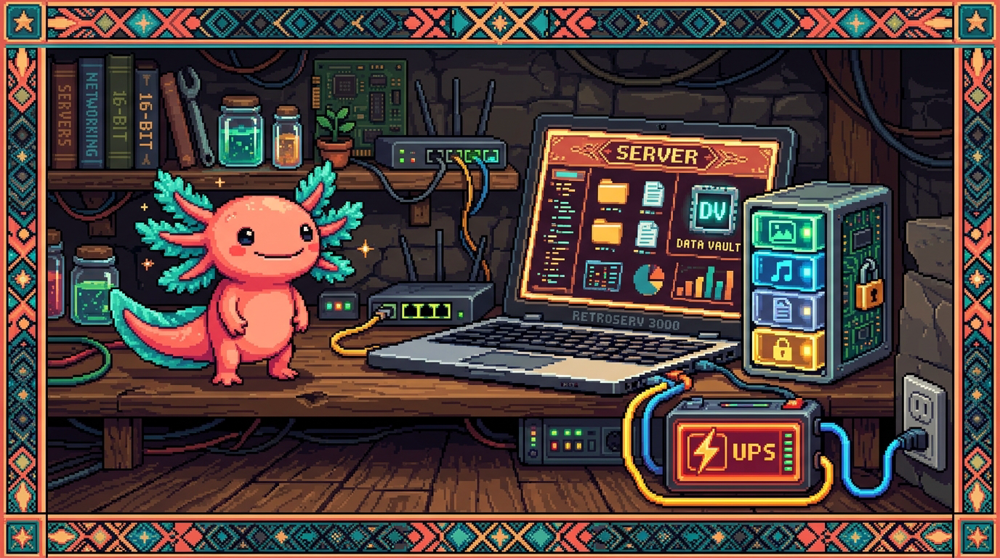

# Capítulo 01 — ¿Qué es un servidor y un NAS?

  

> Cambiamos de tema: pasamos de escribir apps a las **máquinas que las hacen funcionar**. Y aquí
> tienes una ventaja: ya posees un servidor de verdad (tu `polypaw-nas`), así que nada de esto va a
> quedarse en teoría abstracta. Vas a entender exactamente qué tienes en casa y por qué te sirve
> tanto.

---

## 1. Qué es un servidor (de verdad, sin misterio)

La palabra ya apareció en el Módulo 00. Vamos a recordarla y a meternos un poco más a fondo.

> ### 🟦 ¿Qué significa? — *Servidor*
> Un **servidor** es una computadora (o un programa) que está **encendida y a la espera**, lista
> para **dar un servicio** a otras computadoras que se lo pidan: entregar páginas web, archivos,
> datos, correo… La palabra viene de *servir*, sin más. No es un tipo especial de máquina: es un
> **papel**. Cualquier computadora puede ser servidor si tiene un programa que "sirve" algo y está
> disponible para que otros lo usen.

> ### 💡 Tip — Servidor ≠ caja misteriosa en una sala fría
> Casi siempre imaginamos los servidores como armarios llenos de lucecitas en un centro de datos.
> Algunos son así, sí, pero un servidor también puede ser **un laptop viejo en tu casa**. Lo que lo
> separa de tu computadora normal no es el hardware, sino **el papel** que cumple: tu laptop de
> diario *consume* servicios (cliente), mientras que un servidor *los ofrece*. Tu Acer Nitro hizo
> justo ese salto: de cliente (jugar) a servidor (servir archivos y agentes).

> ### 🟦 ¿Qué significa? — *Cliente y servidor (repaso aplicado)*
> Imagina que desde tu teléfono abres un archivo guardado en el NAS: tu teléfono es el **cliente**
> (el que pide) y el NAS es el **servidor** (el que responde con el archivo). Es el mismo modelo
> del Módulo 00, solo que ahora ocurre **dentro de tu casa** y no por internet.

---

## 2. Qué es un NAS

> ### 🟦 ¿Qué significa? — *NAS (Network Attached Storage)*
> Un **NAS** (*Network Attached Storage*, "almacenamiento conectado a la red") es un **servidor
> especializado en guardar archivos** y compartirlos con todos los dispositivos de tu red. En lugar
> de tener tus fotos en una memoria USB que vas pasando de un aparato a otro, viven en el NAS, y tu
> teléfono, tu laptop y tu tele las ven **a la vez**, a través de la red de tu casa.
> Piénsalo como **tu propia "nube" privada en casa**: parecido a Google Drive o Dropbox, pero el
> disco es tuyo, está bajo tu techo, y no pagas mensualidad ni dependes de ninguna empresa.

> ### 💡 Tip — Por qué un NAS es tan útil
> - **Centraliza**: todos tus archivos en un solo sitio, accesibles desde cualquier dispositivo.
> - **Respalda**: copias de seguridad automáticas de tus equipos.
> - **Comparte**: varias personas (la familia) trabajan sobre los mismos archivos.
> - **Privacidad y costo**: tus datos se quedan en tu casa, sin cuotas mensuales de almacenamiento.
> - **Más que archivos**: puede correr otros servicios (como hace el tuyo con AdGuard y OpenClaw).

---

## 3. Tu NAS concreto: un Acer Nitro reconvertido

Veamos, pieza por pieza, por qué tu equipo es un buen servidor (¿te acuerdas del hardware del
Módulo 00?):

> ### 🔎 En tu equipo — `polypaw-nas`
> - **CPU Intel i5-9300H (4 núcleos / 8 hilos)**: "cerebro" de sobra para servir archivos y correr
>   varios servicios a la vez. (Núcleos/hilos = cuántas tareas puede atender en paralelo, Módulo 00.)
> - **8 GB de RAM**: su memoria de trabajo. Aquí está el **límite principal** de cara al futuro:
>   cada servicio que añadas consume RAM, y 8 GB se llenan si metes demasiados. (RAM = el escritorio,
>   Módulo 00.)
> - **SSD NVMe 238 GB (sistema) + HDD 954 GB (datos en `/srv/nas`)**: el SSD, que es rápido, hace que
>   Ubuntu arranque ágil; el HDD, grande y barato, guarda los archivos. Una división clásica y bien
>   pensada. El disco de datos está casi vacío (~890 GB libres), así que espacio te sobra.

> ### 💡 Tip — La batería como UPS (un detalle genial)
> Un **UPS** (*Uninterruptible Power Supply*, "fuente de alimentación ininterrumpida") es una batería
> que mantiene el equipo encendido unos minutos cuando se va la luz, para evitar apagones bruscos que
> podrían corromper datos. Los servidores serios usan uno. Lo curioso es que **tu laptop ya trae su
> batería integrada**, así que tienes UPS gratis. Si la luz parpadea, tu NAS no se apaga ni se
> corrompe. Es una ventaja muy real de usar un laptop como servidor.

---

## 4. ¿NAS dedicado o "hecho a mano"? El caso de tu equipo

> ### 🟦 ¿Qué significa? — *NAS "appliance" vs. servidor genérico*
> Para tener un NAS hay básicamente dos caminos:
> - **Aparato dedicado** (Synology, QNAP) o sistemas como **TrueNAS / OpenMediaVault**: vienen con
>   una interfaz lista para NAS. Es cómodo, pero también más cerrado.
> - **Servidor genérico hecho a mano**: una computadora con un Linux normal (como tu **Ubuntu
>   Server**) a la que tú le vas instalando las piezas (Samba para compartir, Cockpit para
>   administrar). Resulta **más flexible y educativo** —aprendes de verdad cómo funciona por dentro—,
>   aunque toca configurarlo tú.
> **Tu NAS es del segundo tipo**: Ubuntu Server + Samba + Cockpit, armado a mano. Por eso este módulo
> te enseña tanto: entiendes cada pieza porque está puesta a propósito, no escondida detrás de una
> interfaz.

---

## ✅ Checklist — ¿ya domino esto?

- [ ] Explico qué es un **servidor** y que es un **papel** (servir), no un hardware especial.
- [ ] Sé qué es un **NAS** y por qué es "tu nube privada en casa".
- [ ] Entiendo las piezas de **tu** NAS (CPU, RAM como límite, SSD sistema + HDD datos).
- [ ] Sé qué es un **UPS** y por qué la batería del laptop cumple ese papel.
- [ ] Distingo un **NAS dedicado** de un **servidor genérico** (el tuyo) y por qué el tuyo enseña más.

---

## 🧪 Ejercicios

Este módulo es práctico-conceptual, y varios ejercicios los harás **conectándote a tu NAS** (verás
cómo en los próximos capítulos). Por ahora, puro razonamiento:

1. **Cliente o servidor.** En estas escenas, di quién es cliente y quién servidor: (a) ves una
   película guardada en el NAS desde la tele; (b) tu NAS le pide una página a Google.
2. **Por qué NAS.** Da tres ventajas de tener tus fotos en el NAS en lugar de en una memoria USB.
3. **El límite.** ¿Por qué decimos que los **8 GB de RAM** son el principal límite de tu NAS y no
   el disco (que tiene 890 GB libres)? (Repasa RAM vs. disco del Módulo 00.)
4. **UPS.** Explica con tus palabras por qué un apagón brusco es peligroso para un servidor y cómo
   ayuda la batería del laptop.
5. **Dedicado vs. a mano.** Menciona una ventaja y una desventaja de haber montado el NAS "a mano"
   con Ubuntu en lugar de comprar un Synology.

➡️ Siguiente: **[Capítulo 02 — Linux y la terminal del servidor](02-linux-servidor.md)**.
