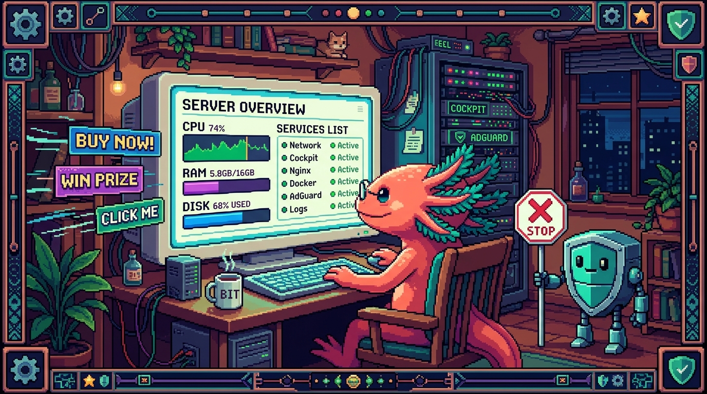

# Capitulo 12 — Administración web: Cockpit y AdGuard

<p align="center">
  
</p>


> Hasta ahora has administrado tu NAS a punta de comandos en una terminal negra. Funciona, claro, pero no siempre es lo más cómodo. Hay momentos en que solo quieres ver de un vistazo cuánta RAM te queda, reiniciar un servicio con un clic o saber si el disco de datos se está llenando. En este capítulo te presento dos paneles web que viven dentro de **polypaw-nas**, tu laptop **Acer Nitro AN515-54** reciclado: **Cockpit**, que es como la sala de control de todo el servidor, y **AdGuard Home**, un portero que bloquea anuncios y rastreadores para toda tu casa. Bit, el ajolote, anda feliz: por fin va a tener botones que apretar en vez de teclear comandos con sus patitas.

## 1. ¿Por qué un panel web si ya tengo la terminal?

La terminal es poderosa, pero cobra un peaje: hay que recordarse los comandos. Un panel web, en cambio, te muestra la información ya masticada, con gráficas y botones, y lo abres desde el navegador de cualquier dispositivo de tu red. No viene a reemplazar a la terminal (de hecho, Cockpit incluye una terminal dentro del propio navegador), pero le quita muchísima fricción al día a día.

> ### 🟦 ¿Que significa? — *Panel web (interfaz web de administración)*
> Es un programa que corre en el servidor y te muestra páginas en el navegador para administrarlo: ver el estado, cambiar configuraciones, reiniciar cosas. En vez de escribir comandos, haces clic.
> **¿Para qué sirve?** Para administrar el servidor de forma visual y rápida, sin tener que memorizar comandos.
> **¿Dónde aparece en polypaw-nas?** Tienes dos: **Cockpit** (administración general del sistema, puerto 9090) y **AdGuard Home** (bloqueo de anuncios por DNS, con su propio panel).

> ### 🟦 ¿Que significa? — *Puerto*
> Piensa que la dirección IP de polypaw-nas es la dirección de un edificio, y los puertos son los números de cada apartamento dentro de ese edificio. Un mismo servidor puede ofrecer muchos servicios a la vez, y cada uno escucha en su propio puerto.
> **¿Para qué sirve?** Para que un solo equipo atienda varios servicios distintos sin que se pisen entre sí.
> **¿Dónde aparece en polypaw-nas?** Cockpit escucha en el puerto **9090**, Samba usa los suyos, y AdGuard Home usa el **53** (DNS) más un puerto propio para su panel (normalmente el 3000 o el 80, según cómo lo instalaste).

> ### 💡 Tip
> Para saber la IP local de tu NAS dentro de casa, ejecuta `ip a` en la terminal de polypaw-nas y busca una dirección tipo `192.168.x.x`. Esa IP, seguida de `:9090`, es la puerta de Cockpit. Por ejemplo: `http://192.168.1.50:9090`.

## 2. Cockpit: la sala de control de polypaw-nas

Cockpit es un panel web oficial que viene muy bien integrado con Ubuntu Server. Te deja ver y administrar prácticamente todo el sistema desde el navegador, y como polypaw-nas corre **Ubuntu Server 26.04**, encaja a la perfección.

> ### 🟦 ¿Que significa? — *Cockpit*
> Es un panel web para administrar servidores Linux. Te muestra CPU, memoria, discos y red en tiempo real, y te deja gestionar servicios, usuarios, actualizaciones e incluso abrir una terminal, todo desde el navegador.
> **¿Para qué sirve?** Para administrar el servidor de forma visual, sin tener que conectarte siempre por consola.
> **¿Dónde aparece en polypaw-nas?** Lo abres en `http://IP-de-tu-nas:9090`. Entras con el **mismo usuario y contraseña** del sistema (tu cuenta de Ubuntu en el laptop).

### 2.1. Cómo entrar

Desde cualquier dispositivo conectado a tu red (tu teléfono, otra laptop), abre el navegador y escribe la IP de polypaw-nas seguida del puerto 9090.

```bash
# Primero averigua la IP de tu NAS (ejecútalo EN polypaw-nas):
ip a | grep "inet "

# Verás algo como:
#   inet 192.168.1.50/24 ...
# Entonces en el navegador escribes:
#   http://192.168.1.50:9090
```

Te saldrá una pantalla de inicio de sesión. Usa el usuario con el que administras el laptop. La primera vez es probable que el navegador te advierta que la conexión "no es segura": tranquilo, es normal. Pasa porque Cockpit usa un certificado autofirmado dentro de tu red. No estamos en internet público, estamos en tu propia casa.

> ### 🟦 ¿Que significa? — *Certificado autofirmado*
> Un certificado es un documento digital que sirve para cifrar la conexión y demostrar identidad. Lo de "autofirmado" quiere decir que el propio servidor se lo emitió a sí mismo, en lugar de comprárselo a una autoridad reconocida.
> **¿Para qué sirve?** Para cifrar el tráfico entre tu navegador y Cockpit, aunque nadie externo lo haya validado.
> **¿Dónde aparece en polypaw-nas?** Cuando entras a Cockpit por HTTPS, el navegador te dice "no seguro" justamente porque el certificado es autofirmado. Dentro de tu red eso es aceptable: haces clic en "avanzado" y sigues adelante.

> ### ⚠️ Cuidado
> El puerto 9090 NO debe estar abierto hacia internet. Cockpit es una puerta de administración total: si alguien de fuera adivina tu contraseña, se queda con el control del servidor entero. Para entrar desde la calle, usa **Tailscale** (lo viste en el capítulo de VPN); nunca abras el 9090 en el router.

### 2.2. Ver CPU, RAM, discos y red

La pantalla principal de Cockpit ("Visión general") te muestra el pulso de polypaw-nas en vivo.

> ### 🟦 ¿Que significa? — *CPU (procesador)*
> Es el cerebro del equipo, la pieza que hace los cálculos. En polypaw-nas es un **Intel Core i5-9300H**, un procesador de laptop gaming con potencia de sobra para un servidor casero.
> **¿Para qué sirve?** Cuanta más CPU disponible, más tareas a la vez aguanta el NAS (copiar archivos, filtrar DNS, correr contenedores).
> **¿Dónde aparece en polypaw-nas?** En la gráfica de uso de CPU de Cockpit. Si la ves clavada al 100% durante mucho rato, es que algo está trabajando de más.

> ### 🟦 ¿Que significa? — *RAM (memoria)*
> Es la memoria de trabajo temporal: ahí guarda el sistema lo que está usando en este preciso momento. Es muy rápida, pero se borra al apagar. polypaw-nas tiene **8 GB de RAM**.
> **¿Para qué sirve?** Cada programa abierto (Samba, AdGuard, Docker) consume RAM. Si se acaba, el sistema se pone lento o empieza a matar procesos.
> **¿Dónde aparece en polypaw-nas?** En la gráfica de memoria de Cockpit. Con solo 8 GB, este es **el número que más debes vigilar** en tu NAS.

> ### ⚠️ Cuidado
> Los 8 GB de RAM de polypaw-nas son su mayor límite. Samba, AdGuard Home y un par de contenedores de Docker pueden convivir bien, pero no te pases: cada contenedor extra se come su parte de memoria. Si en Cockpit ves la RAM constantemente por encima del 85-90%, es señal de apagar algo o de no seguir añadiendo servicios. Tenlo bajo el ojo en la gráfica de memoria.

> ### 🟦 ¿Que significa? — *Contenedor (Docker / Podman)*
> Un contenedor es como una caja sellada que lleva dentro un programa con todo lo que necesita para funcionar (sus librerías, su configuración), aislado del resto del sistema. **Docker** y **Podman** son las dos herramientas más usadas para crear y correr esas cajas; hacen casi lo mismo, pero Podman puede funcionar sin un servicio con permisos de administrador siempre encendido, lo que lo hace algo más ligero y seguro.
> **¿Para qué sirve?** Para instalar y correr aplicaciones (por ejemplo, el propio AdGuard Home, un servidor de descargas o una página web) sin ensuciar el sistema y sin pelear con dependencias. Si una app se rompe, borras su contenedor y listo: el resto del NAS ni se entera.
> **¿Dónde aparece en polypaw-nas?** Cada contenedor consume RAM del total de 8 GB, así que en un NAS con poca memoria conviene correr solo los imprescindibles. En Cockpit puedes instalar una extensión para ver y administrar contenedores con botones; por debajo es lo mismo que `docker ps` o `podman ps` en la terminal.

> ### 🟦 ¿Que significa? — *Disco / almacenamiento*
> Es donde se guardan los datos de forma permanente (no se borran al apagar). polypaw-nas tiene **dos**: un **SSD de 238 GB** para el sistema operativo y un **HDD de 954 GB** montado en `/srv/nas` para los datos.
> **¿Para qué sirve?** El SSD hace que el sistema arranque y responda rápido; el HDD grande almacena tus archivos, respaldos y proyectos.
> **¿Dónde aparece en polypaw-nas?** En la sección "Almacenamiento" de Cockpit verás los dos discos, cuánto espacio queda y la actividad de lectura/escritura.

> ### 🔎 En tu servidor
> Entra a "Almacenamiento" en Cockpit y fíjate en el HDD de 954 GB montado en `/srv/nas`. Ahí es donde vive el recurso compartido de Samba (**PolyPawNAS**) y donde guardarías respaldos de tus repos como **tunal-digital**, **PolyPaw**, **RachaSimple** o **Faro/Organizer**. Cuando ese disco llegue al 80-85% de uso, ve pensando en limpieza o en más espacio.

> ### 🟦 ¿Que significa? — *Red (tráfico de red)*
> Es la cantidad de datos que entran y salen del NAS por el cable o el wifi. Se mide en velocidad (megabits o megabytes por segundo).
> **¿Para qué sirve?** Te dice qué tan ocupada está la conexión: si copias un archivo grande a Samba, verás subir el tráfico de entrada.
> **¿Dónde aparece en polypaw-nas?** En la gráfica de red de Cockpit, con sus líneas de "enviado" y "recibido".

### 2.3. Administrar servicios

Un servicio es un programa que corre en segundo plano de forma permanente. Samba, AdGuard, Tailscale y el propio Cockpit son servicios.

> ### 🟦 ¿Que significa? — *Servicio (demonio / systemd)*
> Un servicio es un programa que arranca solo con el sistema y se queda corriendo en silencio, a la espera de trabajo. En el Linux moderno, quien los gestiona es un componente llamado **systemd**.
> **¿Para qué sirve?** Para que cosas como compartir archivos o filtrar DNS estén siempre disponibles sin que tengas que lanzarlas a mano cada vez.
> **¿Dónde aparece en polypaw-nas?** En la sección "Servicios" de Cockpit. Ahí ves Samba (`smbd`), AdGuard, Tailscale, etc., y los inicias, detienes o reinicias con un clic.

Desde la pestaña "Servicios" puedes hacer clic en cualquiera para ver si está activo, detenerlo, reiniciarlo o dejarlo configurado para que arranque solo al encender. Es lo mismo que harías con `systemctl` en la terminal, pero con botones.

```bash
# Lo que Cockpit hace por debajo cuando reinicias Samba con un clic:
sudo systemctl restart smbd

# Ver el estado de un servicio (Cockpit lo muestra en verde/rojo):
systemctl status smbd
```

> ### 💡 Tip
> Si un día Samba deja de aparecer en la red, no reinstales nada todavía: entra a Cockpit > Servicios, busca `smbd` y mira si está "activo" (verde). A veces basta con reiniciar el servicio para que el recurso **PolyPawNAS** vuelva a verse.

### 2.4. Administrar usuarios

> ### 🟦 ¿Que significa? — *Usuario (cuenta del sistema)*
> Es una identidad dentro del servidor, con su nombre, su contraseña y sus permisos. Cada persona o servicio puede tener su propia cuenta.
> **¿Para qué sirve?** Para separar quién puede hacer qué. Tu cuenta de administrador lo puede todo; podrías crear cuentas más limitadas para otros.
> **¿Dónde aparece en polypaw-nas?** En "Cuentas" dentro de Cockpit. Ahí ves los usuarios del laptop, cambias contraseñas, creas cuentas nuevas o das y quitas permisos de administrador.

> ### ⚠️ Cuidado
> No crees usuarios administradores de más, ni dejes contraseñas débiles. Cada cuenta con permisos de administrador es una llave maestra de polypaw-nas. Usa contraseñas largas (frases de varias palabras) y distintas para el sistema y para Samba.

### 2.5. La terminal del navegador

Cockpit trae una terminal completa dentro del navegador. Es la misma consola de Linux de siempre, pero a la que llegas sin abrir un programa de SSH aparte.

> ### 🟦 ¿Que significa? — *SSH (acceso remoto seguro)*
> SSH (Secure Shell) es la forma estándar de abrir, a distancia y de manera cifrada, la terminal de otro equipo. Te conectas desde tu laptop a polypaw-nas y escribes comandos como si estuvieras sentado frente a él, solo que todo el tráfico va protegido.
> **¿Para qué sirve?** Para administrar el servidor desde otro dispositivo, sin necesidad de pantalla ni teclado conectados al NAS. Es lo que normalmente usarías para entrar a un servidor "sin cabeza" (sin monitor).
> **¿Dónde aparece en polypaw-nas?** La terminal de Cockpit te ahorra abrir SSH a mano: te da la misma consola, ya autenticada. Cuando quieras entrar por SSH directamente desde fuera de casa, hazlo a través de **Tailscale**, nunca abriendo el puerto SSH (22) en el router.

> ### 🟦 ¿Que significa? — *Terminal (consola / línea de comandos)*
> Es la pantalla de texto donde escribes comandos para hablar directamente con el sistema. Sin botones: solo texto que tú tecleas y respuestas que el servidor devuelve.
> **¿Para qué sirve?** Para tareas avanzadas o rápidas que no tienen botón en el panel. Es la herramienta más potente y directa.
> **¿Dónde aparece en polypaw-nas?** En Cockpit, en la pestaña "Terminal". Te da una consola igual a la que tendrías por SSH, ya autenticada con tu usuario.

> ### 🔎 En tu servidor
> La terminal de Cockpit es ideal para un vistazo rápido sin tener que sacar otro dispositivo. Por ejemplo, comprobar cuánto espacio queda en el HDD de datos:
> ```bash
> df -h /srv/nas
> ```
> Verás el tamaño total (~954 GB), lo usado y lo disponible. Hazlo de vez en cuando para que el disco no te agarre lleno por sorpresa.

### 2.6. Actualizaciones

> ### 🟦 ¿Que significa? — *Actualizaciones de software*
> Son versiones nuevas de los programas y del sistema que corrigen errores y, sobre todo, **fallos de seguridad**.
> **¿Para qué sirve?** Para mantener el servidor protegido y estable. Un sistema sin actualizar es una puerta abierta a problemas que ya son conocidos.
> **¿Dónde aparece en polypaw-nas?** En la sección "Actualizaciones de software" de Cockpit, que lista los paquetes pendientes y te deja instalarlos con un clic.

```bash
# Lo que Cockpit ejecuta por detrás al actualizar en Ubuntu:
sudo apt update
sudo apt upgrade
```

> ### 💡 Tip
> Como polypaw-nas es un laptop, su **batería actúa como una UPS natural**: si se va la luz, el NAS sigue encendido con la batería y no se corta a mitad de una actualización. Aun así, mejor actualiza cuando nadie esté copiando archivos pesados, por si toca reiniciar.

> ### 🟦 ¿Que significa? — *UPS (Sistema de Alimentación Ininterrumpida)*
> Es una batería de respaldo que mantiene un equipo encendido unos minutos cuando se corta la luz, para que no se apague de golpe.
> **¿Para qué sirve?** Para evitar apagones bruscos, que pueden corromper datos o dejar el sistema a medias.
> **¿Dónde aparece en polypaw-nas?** No tienes una UPS comprada: la batería interna del laptop **Acer Nitro AN515-54** cumple ese papel de forma natural. Esa es una de las grandes ventajas de reciclar un portátil como NAS.

## 3. AdGuard Home: el portero anti-anuncios de toda la red

Ahora cambiamos de panel. AdGuard Home no administra el sistema; lo suyo es otra cosa: **bloquear publicidad y rastreadores para todos los dispositivos de tu casa a la vez**. Y lo hace de una forma muy elegante, interceptando el DNS.

> ### 🟦 ¿Que significa? — *DNS (Sistema de Nombres de Dominio)*
> Es la "agenda telefónica" de internet. Cuando escribes `youtube.com`, tu dispositivo no sabe a qué número (IP) ir, así que le pregunta a un servidor DNS, y este le responde con la dirección correcta.
> **¿Para qué sirve?** Para traducir nombres fáciles de recordar (los dominios) en direcciones IP, que es lo que las máquinas entienden.
> **¿Dónde aparece en polypaw-nas?** AdGuard Home se instala como un **servidor DNS** dentro del NAS, escuchando en el puerto **53**. Tus dispositivos le preguntan a él en lugar de a un DNS externo.

> ### 🟦 ¿Que significa? — *AdGuard Home*
> Es un servidor DNS que filtra las respuestas: cuando un dispositivo pide el dominio de un anuncio o un rastreador, AdGuard responde "no existe" y el anuncio nunca se carga.
> **¿Para qué sirve?** Para bloquear publicidad, rastreadores y dominios maliciosos **en toda la red de una sola vez**, incluidos teléfonos y televisores donde no puedes instalar bloqueadores.
> **¿Dónde aparece en polypaw-nas?** Corre como servicio en el NAS y tiene su propio panel web. Desde ahí ves cuántas peticiones bloqueó, gestionas listas y revisas estadísticas.

### 3.1. ¿Cómo bloquea anuncios un DNS?

El truco es sencillo. Cada anuncio que ves vive en un dominio (por ejemplo, `ads.algo.com`). Cuando tu navegador va a cargar la página, le pregunta al DNS por la dirección de ese dominio publicitario. Si tu DNS es AdGuard Home, AdGuard revisa su lista de bloqueo, ve que ese dominio es publicidad y simplemente **no da la dirección**. El anuncio nunca llega. La página normal, en cambio, sí se resuelve y carga sin problemas.

> ### 🟦 ¿Que significa? — *Rastreador (tracker)*
> Es un fragmento invisible incrustado en webs y apps que recopila datos sobre lo que haces para perfilarte y mostrarte publicidad dirigida.
> **¿Para qué sirve?** (Para quien lo pone) para seguirte por internet. Bloquearlo protege tu privacidad.
> **¿Dónde aparece en polypaw-nas?** AdGuard Home también bloquea dominios de rastreo, no solo de anuncios. En su panel verás cuántos rastreadores ha frenado.

> ### 🟦 ¿Que significa? — *Lista de bloqueo (blocklist / filtro)*
> Es un archivo, mantenido por la comunidad, con miles de dominios de anuncios y rastreadores ya conocidos. AdGuard la consulta para decidir qué bloquear.
> **¿Para qué sirve?** Para no tener que escribir tú a mano cada dominio malo: la lista viene hecha y se actualiza sola.
> **¿Dónde aparece en polypaw-nas?** En el panel de AdGuard, sección "Filtros" > "Listas de bloqueo DNS". Trae una por defecto (AdGuard DNS filter) y puedes añadir más.

### 3.2. Apuntar tus dispositivos a AdGuard

Para que AdGuard te proteja, tus dispositivos tienen que usarlo como su servidor DNS. Hay dos caminos:

**Opción A — Dispositivo por dispositivo.** En el wifi de tu teléfono o laptop, dentro de la configuración de red, cambias el "DNS" manual por la IP de polypaw-nas (por ejemplo, `192.168.1.50`). Solo ese dispositivo quedará protegido.

**Opción B — Toda la red desde el router (recomendada).** Entras a la configuración de tu router y pones la IP de polypaw-nas como servidor DNS del router. A partir de ahí, **todos** los dispositivos que se conecten al wifi usarán AdGuard automáticamente, sin que tengas que tocar cada uno.

> ### 💡 Tip
> La opción del router es la más cómoda porque también protege la TV, la consola y todos esos aparatos del hogar donde no puedes instalar nada. Si tu router lo permite, pon ahí la IP de polypaw-nas como DNS y listo: toda la casa filtrada.

> ### ⚠️ Cuidado
> Si polypaw-nas se apaga y es el único DNS de tu router, **toda la casa se queda sin internet** (nadie podría traducir dominios). Configura siempre un DNS secundario de respaldo en el router (por ejemplo, `1.1.1.1` de Cloudflare o `9.9.9.9` de Quad9). Así, si el NAS descansa, internet sigue funcionando, aunque sea sin filtro. Recuerda que la batería del laptop ayuda a que polypaw-nas no se caiga por apagones, pero un reinicio o una actualización sí lo dejan unos minutos fuera.

> ### 🔎 En tu servidor
> Para confirmar que un dispositivo está usando AdGuard, entra a su panel mientras navegas: en "Registro de consultas" deberías ver, en tiempo real, las peticiones DNS que llegan desde ese dispositivo y cuáles fueron bloqueadas. Si no ves nada, es que el dispositivo no está apuntando al NAS.

### 3.3. El panel de AdGuard Home

El panel web de AdGuard te muestra un tablero con estadísticas: total de consultas, cuántas bloqueó, los dominios más solicitados y los más bloqueados. Da gusto ver el porcentaje de anuncios frenados subir día tras día.

> ### 🟦 ¿Que significa? — *Registro de consultas (query log)*
> Es el historial de todas las preguntas DNS que tus dispositivos le hicieron a AdGuard: qué dominio pidieron, cuándo y si se permitió o se bloqueó.
> **¿Para qué sirve?** Para diagnosticar. Si una app deja de funcionar, miras el registro y ves si AdGuard bloqueó por error un dominio que esa app necesitaba.
> **¿Dónde aparece en polypaw-nas?** En la pestaña "Registro de consultas" del panel de AdGuard Home.

> ### 🟦 ¿Que significa? — *Regla de excepción (allowlist / lista blanca)*
> Es una orden manual para decirle a AdGuard "este dominio NO lo bloquees nunca", aunque alguna lista lo marque.
> **¿Para qué sirve?** Para arreglar "falsos positivos": esos casos en que AdGuard bloquea por error algo que sí necesitas (un botón de pago, una imagen).
> **¿Dónde aparece en polypaw-nas?** En "Filtros" > "Reglas de filtrado personalizadas" del panel de AdGuard. Ahí añades las excepciones.

> ### 💡 Tip
> Si una página web se rompe de repente (no carga un vídeo, falla un login), antes de culpar a la página revisa el registro de AdGuard. Quizá bloqueó un dominio que esa web necesitaba. Lo añades a la lista blanca y vuelve a funcionar.

### 3.4. Acceder al panel de AdGuard desde fuera

Igual que con Cockpit, puede que quieras revisar AdGuard desde la calle. La regla es la misma.

> ### ⚠️ Cuidado
> **No abras el panel de AdGuard ni el puerto 53 hacia internet.** Un DNS abierto al mundo puede acabar usándose para ataques contra terceros, y un panel expuesto es un blanco fácil. Para administrar AdGuard desde fuera, conéctate primero por **Tailscale** y luego abre el panel usando la IP de Tailscale de polypaw-nas. Privado, cifrado y sin abrir nada en el router.

> ### 🟦 ¿Que significa? — *Tailscale*
> Es una VPN sencilla que crea una red privada entre tus dispositivos, como si estuvieran en la misma casa aunque estén en ciudades distintas, y sin abrir puertos en el router.
> **¿Para qué sirve?** Para acceder a Cockpit, Samba o AdGuard de polypaw-nas desde cualquier lugar y de forma segura.
> **¿Dónde aparece en polypaw-nas?** Tailscale corre como servicio en el NAS y le asigna una IP privada (tipo `100.x.x.x`). Usa esa IP, no la pública, para entrar a tus paneles desde fuera.

## 4. Seguridad: las reglas de oro de los paneles

Antes de cerrar, grabémonos esto a fuego, porque un panel mal expuesto es la forma más rápida de perder el control de un servidor:

- **Nunca abras los puertos 9090 (Cockpit), 53 (DNS) ni el panel de AdGuard hacia internet.** Para acceso remoto, siempre Tailscale.
- **Contraseñas fuertes y distintas** para el sistema (Cockpit usa esa cuenta) y para Samba. Frases largas, no palabras sueltas.
- **Configura un DNS de respaldo** en el router, para que la casa no se quede sin internet si polypaw-nas se reinicia.
- **Mantén el sistema actualizado** desde Cockpit, pero sin prisa y cuando nadie esté usando el NAS a tope.
- **Haz copias de respaldo** de lo importante en el HDD de `/srv/nas`. Un panel bonito no sustituye un buen respaldo.

> ### 💡 Tip
> Bit el ajolote propone una rutina semanal de dos minutos: abre Cockpit, mira RAM y disco, revisa que no haya actualizaciones críticas pendientes; abre AdGuard, mira el porcentaje de bloqueo. Dos pestañas, dos minutos, y tu NAS sano.

## ✅ Checklist — ¿ya domino esto?

- [ ] Sé qué es un puerto y que Cockpit vive en el 9090 de polypaw-nas.
- [ ] Puedo averiguar la IP local de mi NAS y abrir Cockpit en el navegador.
- [ ] Entiendo por qué la RAM de 8 GB es el límite que más debo vigilar en Cockpit.
- [ ] Sé ver el espacio del SSD (sistema) y del HDD de 954 GB en `/srv/nas`.
- [ ] Puedo reiniciar el servicio de Samba (`smbd`) desde Cockpit o con `systemctl`.
- [ ] Entiendo que el DNS traduce dominios y que AdGuard bloquea anuncios filtrando ese DNS.
- [ ] Sé apuntar un dispositivo (o el router entero) a la IP de polypaw-nas como DNS.
- [ ] Tengo claro que no debo abrir 9090, 53 ni el panel de AdGuard a internet, y que para eso está Tailscale.
- [ ] Configuré (o sé por qué necesito) un DNS de respaldo en el router.

## 🧪 Ejercicios

1. 💻 **Abre Cockpit.** En polypaw-nas ejecuta `ip a | grep "inet "`, anota la IP `192.168.x.x` y abre `http://ESA-IP:9090` desde el navegador de otro dispositivo. Inicia sesión con tu usuario del sistema.

2. 💻 **Audita la RAM.** En la pantalla de visión general de Cockpit, observa el uso de memoria durante un minuto. Anota el porcentaje. Luego, desde la terminal de Cockpit, ejecuta `free -h` y compara. ¿Está cómoda por debajo del 85%?

3. 💻 **Revisa el disco de datos.** En la terminal de Cockpit ejecuta `df -h /srv/nas`. Anota cuánto espacio queda libre en el HDD de 954 GB. Decide a partir de qué porcentaje empezarías a limpiar.

4. 💻 **Reinicia un servicio.** En Cockpit > Servicios, localiza `smbd`, míralo en verde y reinícialo. Confirma después que el recurso compartido **PolyPawNAS** sigue accesible desde otro equipo.

5. 💻 **Apunta un dispositivo a AdGuard.** Cambia el DNS del wifi de tu teléfono a la IP de polypaw-nas. Navega un par de minutos y luego, en el panel de AdGuard > Registro de consultas, comprueba que aparecen sus peticiones y que algunas salen como bloqueadas.

6. **Plan de respaldo (en papel).** Sin tocar nada, escribe qué DNS secundario pondrías en tu router y por qué nunca expondrías el puerto 9090 a internet. Si convences a Bit, lo entendiste.
