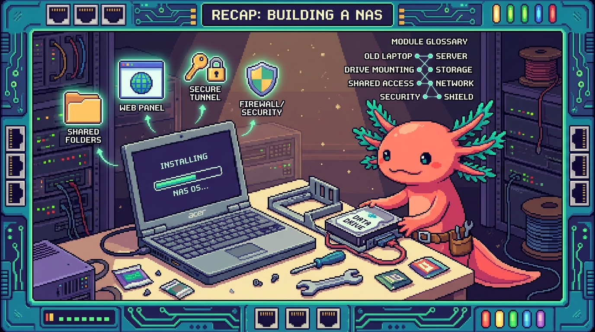

# Capitulo 15 — Montar tu NAS desde cero (guía completa) y glosario

<p align="center">
  
</p>


> Bit el ajolote se estira, sacude las branquias y se sienta frente a la pantalla. "Llegamos al gran final del módulo", dice. "Hasta ahora fuimos viendo las piezas por separado: discos, redes, Samba, VPN... Hoy las juntamos TODAS y montamos un NAS completo, desde el primer tornillo hasta la primera prueba. Vamos a usar tu equipo de verdad, `polypaw-nas`, como ejemplo de principio a fin. No te pido que memorices nada: te pido que entiendas *por qué* tomamos cada decisión. Y al final te dejo un glosario con todo el vocabulario del módulo, para que vuelvas cuando se te olvide una palabra. Olvidar palabras no tiene nada de malo. Quedarte con la duda, sí."

---

## 1. Antes de empezar: ¿qué estamos construyendo y por qué?

Un NAS no es magia ni un aparato carísimo de tienda. Es, sin más, una computadora encendida todo el tiempo que guarda tus archivos y los comparte por la red de tu casa. Y tú ya tienes una: un laptop Acer Nitro convertido en servidor.

> ### 🟦 ¿Que significa? — *Servidor*
> Un servidor es una computadora cuyo trabajo es **prestar un servicio a otras computadoras**: servir archivos, páginas web, bloquear anuncios... No es un tipo especial de hardware. Cualquier computadora encendida y disponible para otros es un servidor. En tu caso, `polypaw-nas` es un laptop normal y corriente que decidiste poner a "servir".

> ### 🟦 ¿Que significa? — *NAS*
> NAS son las siglas en inglés de *Network Attached Storage*: **almacenamiento conectado a la red**. Es un servidor especializado en guardar y compartir archivos. ¿Dónde aparece en tu NAS real? `polypaw-nas` es justo eso. Guarda tus respaldos de proyectos como `tunal-digital`, `PolyPaw`, `RachaSimple` y `Faro/Organizer`, y los comparte por tu red.

El plan del capítulo es montar `polypaw-nas` paso a paso:

1. Entender el hardware que ya tienes.
2. Instalar Ubuntu Server.
3. Configurar lo básico: usuario, SSH e IP fija.
4. Montar el disco de datos en `/srv/nas`.
5. Instalar Samba (compartir archivos), Cockpit (panel web), Tailscale (acceso remoto) y AdGuard (bloquear anuncios).
6. Hacer las primeras pruebas.

> ### 💡 Tip
> Aunque aquí hablemos de "tu Acer Nitro", todo esto sirve igual para **cualquier** servidor casero: una Raspberry Pi, un mini PC, otro laptop viejo. Cambia el hardware, las ideas son las mismas.

---

## 2. El hardware: por qué un laptop es un NAS perfecto para empezar

Tu `polypaw-nas` es un Acer Nitro AN515-54. Veamos qué tiene dentro y por qué importa cada pieza.

- **CPU Intel i5-9300H**: el "cerebro". Le sobra capacidad para servir archivos y correr unos cuantos servicios.
- **8 GB de RAM**: la memoria de trabajo. Aquí está el número que tienes que vigilar. La RAM es donde el servidor pone lo que está usando *ahora mismo*; si se llena, todo se arrastra.
- **SSD de 238 GB**: disco rápido. Lo usamos para el **sistema operativo** (Ubuntu y los programas).
- **HDD de 954 GB**: disco grande y lento. Lo usamos para los **datos** (tus archivos y respaldos). Se monta en `/srv/nas`.

> ### 🟦 ¿Que significa? — *CPU (procesador)*
> La CPU es el componente que hace los cálculos: el que ejecuta los programas. En `polypaw-nas` es un Intel i5 de portátil, de sobra potente para un NAS casero.

> ### 🟦 ¿Que significa? — *RAM (memoria)*
> La RAM es la memoria temporal donde el servidor guarda lo que está usando en el momento. Es rapidísima, pero se borra al apagar. Tus 8 GB son el recurso más justo de `polypaw-nas`, y por eso a lo largo del módulo insistimos tanto en no instalar mil cosas de golpe.

> ### ⚠️ Cuidado
> Con 8 GB de RAM, cada servicio que enciendes (Samba, Cockpit, AdGuard, contenedores Docker) se come un pedazo. Hoy no es un problema, pero sí es algo que **debes vigilar**: si el equipo empieza a ir lento, lo primero que reviso es cuánta RAM queda libre con `free -h`.

> ### 🔎 En tu servidor
> Tu Acer tiene una ventaja escondida frente a un PC de escritorio o una Raspberry Pi: **la batería**. Si se va la luz en casa, el laptop sigue encendido con su propia batería. Eso que en el mundo de los servidores se llama UPS, tú lo tienes gratis.

> ### 🟦 ¿Que significa? — *UPS (batería de respaldo)*
> UPS significa *Uninterruptible Power Supply* (fuente de alimentación ininterrumpida): una batería que mantiene encendido un equipo cuando se corta la luz, dándote tiempo de apagarlo como es debido. La batería de tu Acer Nitro hace de UPS "natural": si se va la luz, `polypaw-nas` no se apaga de golpe, cosa que podría corromper datos justo en mitad de una escritura.

---

## 3. Instalar Ubuntu Server

El sistema operativo es el programa base que hace funcionar todo lo demás. En `polypaw-nas` usamos **Ubuntu Server 26.04**.

> ### 🟦 ¿Que significa? — *Linux*
> Linux es un sistema operativo libre y gratuito, la base de la mayoría de los servidores del mundo. Es estable, ligero y no te cobra licencia. Ubuntu es una "distribución" de Linux: Linux empaquetado de forma fácil de instalar.

> ### 🟦 ¿Que significa? — *Servidor (versión Server vs. de escritorio)*
> "Ubuntu Server" es Ubuntu **sin escritorio gráfico**: nada de ventanas ni ratón, solo texto. Suena incómodo, pero para un NAS es ideal: gasta menos RAM (importante con tus 8 GB) y se administra por red. A `polypaw-nas` lo manejas desde otra computadora, no sentado frente a él.

Los pasos para instalarlo, resumidos:

1. Descarga la imagen de Ubuntu Server desde la web oficial.
2. Grábala en una memoria USB (con una herramienta como Balena Etcher).
3. Arranca el Acer desde el USB (tecla `F12` al encender, en estos Acer).
4. Sigue el instalador: elige idioma, teclado, y **cuando te pregunte dónde instalar, elige el SSD de 238 GB**, no el HDD.

> ### ⚠️ Cuidado
> En el instalador verás los dos discos. Instala el sistema **solo en el SSD**. Si tocas el HDD de 954 GB aquí, podrías borrar el espacio que reservaste para tus datos. El sistema en el SSD (rápido), los datos en el HDD (grande). Cada cosa en su sitio.

> ### 🟦 ¿Que significa? — *Disco*
> Un disco es donde se guardan los archivos de forma permanente: no se borran al apagar, a diferencia de la RAM. Tu NAS tiene dos: un SSD (rápido, para el sistema) y un HDD (grande, para los datos).

Durante la instalación, Ubuntu te ofrecerá instalar OpenSSH. **Acéptalo**: lo vas a necesitar en el siguiente paso.

> ### 🟦 ¿Que significa? — *OpenSSH*
> OpenSSH es el programa que pone a tu NAS a "escuchar" conexiones SSH para que puedas entrar desde otra computadora. Dicho fácil: SSH es la forma de conectarte; OpenSSH es la pieza que tiene que estar instalada en `polypaw-nas` para que esa conexión sea posible. Por eso lo aceptas durante la instalación.

> ### 🟦 ¿Que significa? — *Partición*
> Una partición es una "porción" en la que se divide un disco, como cuando separas un cuaderno en secciones. El instalador crea las particiones necesarias en el SSD por su cuenta. Si dejas la opción por defecto, no tienes que pelearte con esto.

> ### 🟦 ¿Que significa? — *LVM*
> LVM (*Logical Volume Manager*) es una capa que te deja agrupar y redimensionar particiones con flexibilidad, como si los discos fueran de plastilina. El instalador de Ubuntu lo usa por defecto. Para un NAS de una sola persona no necesitas entenderlo a fondo hoy; basta con saber que existe y que facilita agrandar el espacio el día de mañana.

---

## 4. Primeras configuraciones: usuario, SSH e IP fija

Ubuntu ya está instalado. Ahora lo dejamos listo para administrarlo con comodidad y con seguridad.

### 4.1 Tu usuario y el poder de administrador

Durante la instalación creaste un usuario (por ejemplo, `edwar`). Ese usuario no es todopoderoso, y eso es justo lo que queremos.

> ### 🟦 ¿Que significa? — *root*
> `root` es el usuario administrador total del sistema: puede hacer y deshacer cualquier cosa, incluso cargarse el servidor entero. Por seguridad, **no se usa root en el día a día**. En `polypaw-nas` no inicias sesión como root.

> ### 🟦 ¿Que significa? — *sudo*
> `sudo` es la palabra que pones delante de un comando para ejecutarlo "como administrador" solo por esa vez. Te pide tu contraseña. Es la forma segura de hacer tareas de administrador sin vivir metido como root. Lo verás por todos lados: `sudo apt install ...`.

> ### 🟦 ¿Que significa? — *Permiso*
> Los permisos son las reglas que dicen quién puede leer, escribir o ejecutar cada archivo. En Linux cada archivo tiene un dueño y unos permisos. Por eso a veces un comando "falla" hasta que le pones `sudo`: simplemente no tenías permiso.

### 4.2 SSH: administrar el NAS desde otra computadora

> ### 🟦 ¿Que significa? — *SSH*
> SSH (*Secure Shell*) es la forma de **controlar el servidor por la red desde otra computadora**, escribiendo comandos en una terminal, con la conexión cifrada (protegida). Es como sentarte frente a `polypaw-nas`, pero desde tu laptop de diario.

Desde tu computadora de siempre te conectas así (cambia `edwar` por tu usuario y la IP por la de tu NAS):

```bash
ssh edwar@192.168.1.50
```

La primera vez te preguntará si confías en el equipo (di que sí) y te pedirá la contraseña.

> ### 💡 Tip
> Más adelante puedes configurar "llaves SSH" para entrar sin escribir contraseña y de forma más segura. Por hoy, con una **contraseña fuerte** (larga, con números y símbolos) vas sobrado. Una contraseña débil en un servidor es una puerta abierta de par en par.

### 4.3 IP fija: que el NAS siempre tenga la misma dirección

> ### 🟦 ¿Que significa? — *IP*
> Una IP (dirección IP) es el "número de casa" de un equipo en la red, algo como `192.168.1.50`. Cada dispositivo de tu red tiene el suyo. Así es como tu laptop encuentra a `polypaw-nas`.

> ### 🟦 ¿Que significa? — *Gateway*
> El gateway (puerta de enlace) es la IP de tu **router**: el equipo por el que sale todo el tráfico hacia internet. Suele ser algo como `192.168.1.1`. El NAS necesita saberlo para conectarse hacia fuera.

Por defecto, el router reparte las IPs solo, y esas IPs pueden cambiar. Para un servidor eso es un problema: si hoy es `.50` y mañana `.73`, no hay manera de encontrarlo. Por eso le fijamos una IP que no se mueva.

Lo más sencillo es entrar a tu router y, en la sección de DHCP, "reservar" una IP para la dirección MAC de tu NAS. La otra opción es configurarlo dentro de Ubuntu con Netplan. Lo que importa es el concepto: **el NAS debe tener una dirección estable**.

> ### 🟦 ¿Que significa? — *DHCP*
> DHCP (*Dynamic Host Configuration Protocol*) es el servicio del router que **reparte direcciones IP automáticamente** a cada equipo que se conecta. Por eso, sin tocar nada, tu celular o tu laptop reciben una IP nada más entrar a la red. El problema es que esa IP puede cambiar con el tiempo; para un servidor como `polypaw-nas` eso no sirve, así que le pedimos al DHCP que siempre le dé la misma (una "reserva").

> ### 🟦 ¿Que significa? — *Dirección MAC*
> La dirección MAC es un **número único de fábrica** que tiene cada tarjeta de red: el carnet de identidad físico del equipo. A diferencia de la IP, no cambia nunca. Por eso, para reservar una IP fija en el router, identificas el equipo por su MAC: le dices "al equipo con esta MAC, dale siempre esta IP".

> ### 🟦 ¿Que significa? — *Netplan*
> Netplan es la herramienta de Ubuntu para **configurar la red por archivo de texto**: ahí defines la IP, el gateway y el DNS del equipo. Es la alternativa a la reserva por DHCP cuando prefieres fijar la dirección desde dentro del propio NAS en vez de desde el router.

> ### 🔎 En tu servidor
> Una vez fijada, anota la IP de `polypaw-nas` en un papel o una nota. Es la dirección que vas a usar para SSH, para abrir Cockpit en el navegador y para conectarte a la carpeta compartida.

---

## 5. Montar el disco de datos en /srv/nas

El sistema vive en el SSD. Ahora necesitamos que el HDD de 954 GB esté disponible y "montado" en una carpeta donde guardaremos los datos: `/srv/nas`.

> ### 🟦 ¿Que significa? — *Montar (un disco)*
> Montar un disco es **conectarlo a una carpeta** para poder usarlo. En Linux los discos no tienen "letra" (no hay C: ni D:); en su lugar, aparecen dentro de una carpeta. Cuando decimos "monté el HDD en `/srv/nas`", queremos decir que todo lo que pongas en `/srv/nas` se guarda físicamente en el disco grande.

Primero miramos qué discos hay:

```bash
lsblk
```

Verás algo como `sda` (probablemente el HDD) y `sdb` (el SSD), o parecido. Localiza el HDD de ~954 GB.

Si el HDD es nuevo y no tiene formato, le creamos un sistema de archivos (lo "formateamos", una sola vez):

```bash
sudo mkfs.ext4 /dev/sda1
```

> ### 🟦 ¿Que significa? — *Sistema de archivos / ext4*
> Un sistema de archivos es la **forma en que el disco organiza los datos** (cómo sabe dónde empieza y dónde acaba cada archivo), algo parecido al índice y los capítulos de un libro. Un disco sin sistema de archivos es como papel en blanco: no se puede usar. **ext4** es el sistema de archivos estándar de Linux, robusto y más que probado; es el que le ponemos al HDD de `polypaw-nas`. El comando `mkfs.ext4` significa "crea (make) un sistema de archivos (fs) de tipo ext4".

> ### ⚠️ Cuidado
> `mkfs` **borra todo** lo que haya en esa partición. Asegúrate mil veces de que `/dev/sda1` es el HDD vacío y no otra cosa. Equivocarte de disco aquí es perder datos. Si el disco ya tenía datos que quieres conservar, **no lo formatees**.

Creamos la carpeta y montamos:

```bash
sudo mkdir -p /srv/nas
sudo mount /dev/sda1 /srv/nas
```

Para que el disco se monte **solo** cada vez que enciende el NAS, se añade una línea al archivo `/etc/fstab`. Así no tienes que montarlo a mano después de cada reinicio.

> ### 🟦 ¿Que significa? — *fstab*
> `/etc/fstab` es la **lista de discos que el sistema monta automáticamente al arrancar**. Cada línea dice "este disco va en esta carpeta". Si no añades el HDD aquí, tras cada reinicio de `polypaw-nas` tendrías que volver a montarlo a mano. Apuntarlo en `fstab` lo deja permanente.

> ### 🟦 ¿Que significa? — *UUID*
> UUID (*Universally Unique Identifier*) es un **código largo y único que identifica a cada disco** de forma permanente, como su huella digital. A diferencia de `/dev/sda1` (que es solo "el primer disco que el sistema vio"), el UUID no cambia aunque conectes o quites otros discos.

> ### 💡 Tip
> Conviene montar el disco en `fstab` por su **UUID** y no por `/dev/sda1`. ¿Por qué? Porque `sda`/`sdb` pueden cambiar de orden si conectas otro disco, mientras que el UUID nunca cambia. Lo ves con `sudo blkid`. Así te ahorras que un día el NAS arranque montando el disco equivocado.

> ### 💡 Tip
> ¿Por qué `/srv/nas` y no el escritorio? En Linux, `/srv` es la carpeta pensada justamente para "datos que el servidor sirve a otros". Es la convención correcta y mantiene todo ordenado. Bit aprueba el orden.

---

## 6. Samba: compartir archivos por la red

Tenemos los datos en `/srv/nas`, pero por ahora solo los ve el NAS. Samba los hace visibles para el resto de la casa.

> ### 🟦 ¿Que significa? — *Samba / SMB*
> Samba es el programa que permite que **Windows, Mac y otros Linux vean carpetas compartidas** de tu NAS como si fueran una unidad de red. SMB es el "idioma" (protocolo) que usan para entenderse. En `polypaw-nas`, Samba comparte una carpeta llamada **PolyPawNAS**.

Se instala así:

```bash
sudo apt update
sudo apt install samba
```

La configuración vive en `/etc/samba/smb.conf`, donde defines el recurso compartido apuntando a `/srv/nas`. Después creas la contraseña de Samba para tu usuario y reinicias el servicio:

```bash
sudo smbpasswd -a edwar
sudo systemctl restart smbd
```

> ### 🟦 ¿Que significa? — *Servicio*
> Un servicio es un programa que corre **en segundo plano**, siempre disponible, sin que tengas que abrirlo a mano. Samba, Cockpit o AdGuard son servicios. Se encienden, se apagan y se reinician con comandos.

> ### 🟦 ¿Que significa? — *systemd*
> systemd es el "director de orquesta" de Linux: arranca y gestiona todos los servicios. El comando `systemctl` es la forma de hablarle. `sudo systemctl restart smbd` quiere decir "reinicia el servicio de Samba".

> ### 🟦 ¿Que significa? — *Puerto*
> Un puerto es como una "puerta numerada" del servidor: cada servicio escucha por un número de puerto. Samba usa el 445, Cockpit el 9090, y AdGuard usa el 53 para DNS y el 3000 para su panel. La IP dice *a qué equipo*; el puerto dice *a qué servicio dentro de ese equipo*.

Desde otra computadora entras a la carpeta poniendo `\\192.168.1.50\PolyPawNAS` (en Windows) o `smb://192.168.1.50` (en Mac/Linux).

> ### 🔎 En tu servidor
> Aquí es donde guardas los respaldos de tus proyectos. Una copia de `tunal-digital`, `PolyPaw`, `RachaSimple` y `Faro/Organizer` en `PolyPawNAS` es tu red de seguridad: si tu laptop principal muere, los datos siguen vivos en el NAS.

> ### ⚠️ Cuidado
> Samba es para tu **red local**, no para internet. Nunca abras el puerto de Samba (445) hacia internet en tu router: es uno de los blancos favoritos de los ataques. Para acceder desde fuera de casa usaremos Tailscale (sección 8), que es muchísimo más seguro.

---

## 7. Cockpit: el panel web de administración

Escribir comandos está muy bien, pero a veces quieres ver el estado del NAS de un solo vistazo. Para eso está Cockpit, un panel web.

> ### 🟦 ¿Que significa? — *Cockpit*
> Cockpit es un **panel de administración que abres en el navegador**. Te muestra el uso de CPU, de RAM y de disco, los servicios encendidos, y te deja administrar sin tener que memorizar comandos. En `polypaw-nas` vive en el **puerto 9090**.

```bash
sudo apt install cockpit
sudo systemctl enable --now cockpit.socket
```

Después abres en el navegador de tu laptop: `https://192.168.1.50:9090`. Inicias sesión con tu usuario de Ubuntu.

> ### 🔎 En tu servidor
> Cockpit es tu mejor aliado para vigilar la RAM. Como `polypaw-nas` solo tiene 8 GB, abre Cockpit de vez en cuando y mira la gráfica de memoria. Si siempre está al tope, sabrás que es hora de cerrar algún servicio o contenedor.

> ### 💡 Tip
> Cockpit también te deja apagar y reiniciar el NAS desde el navegador, ver los registros (logs) y administrar discos. Es una rampa suave: usas la interfaz mientras vas aprendiendo los comandos que corren por debajo.

---

## 8. Tailscale: acceso remoto seguro (la pieza clave de seguridad)

¿Y si quieres entrar a tu NAS desde la calle, desde el trabajo o desde el celular? La tentación es "abrir puertos" en el router. **No lo hagas.** Hay una forma mucho mejor.

> ### 🟦 ¿Que significa? — *VPN*
> Una VPN (*Virtual Private Network*, red privada virtual) crea un **túnel privado y cifrado** entre dos equipos a través de internet. Es como tender un cable secreto entre tu celular y tu NAS, sin que nadie más pueda asomarse.

> ### 🟦 ¿Que significa? — *Tailscale*
> Tailscale es una VPN facilísima de usar. Instalas su programa en el NAS y en tu celular o laptop, inicias sesión con la misma cuenta, y **todos tus dispositivos se ven entre sí como si estuvieran en la misma red**, estés donde estés. En `polypaw-nas` es lo que te permite entrar desde fuera de casa sin riesgos.

```bash
curl -fsSL https://tailscale.com/install.sh | sh
sudo tailscale up
```

El comando te dará un enlace para iniciar sesión en tu cuenta de Tailscale. Repite la instalación de la app en tu celular y tu laptop. Listo: a partir de ahí, `polypaw-nas` tiene una IP de Tailscale privada por la que lo alcanzas desde cualquier lado.

> ### ⚠️ Cuidado — la regla de oro de seguridad
> **No abras puertos de tu NAS hacia internet en el router salvo que sea estrictamente necesario.** Abrir un puerto es como dejar una ventana abierta a la calle: cualquiera puede intentar colarse. Tailscale se salta este problema por completo: nada queda expuesto al internet público y, aun así, puedes llegar a Samba, Cockpit y todo lo demás desde fuera. Es, de lejos, la decisión de seguridad más importante de todo el montaje.

> ### 💡 Tip
> Con Tailscale activo, desde tu celular en la calle puedes abrir Cockpit usando la IP de Tailscale del NAS, igual que si estuvieras en casa. Sin abrir un solo puerto. Bit hace una pequeña danza de victoria.

---

## 9. AdGuard Home: un DNS que bloquea anuncios

Última pieza. Ya que el NAS está siempre encendido, le damos un trabajo extra que beneficia a toda la casa: bloquear publicidad y rastreadores.

> ### 🟦 ¿Que significa? — *DNS*
> DNS (*Domain Name System*) es la "agenda de contactos" de internet: traduce nombres como `google.com` al número IP del servidor real. Cada vez que abres una página, tu dispositivo le pregunta a un DNS "¿dónde queda este nombre?".

> ### 🟦 ¿Que significa? — *AdGuard Home*
> AdGuard Home es un DNS que vive en tu NAS y que, cuando un dispositivo le pregunta por una dirección de publicidad o de rastreo, sencillamente responde "no existe". ¿Resultado? **Menos anuncios en todos los dispositivos de la casa**, sin instalar nada en cada uno. En `polypaw-nas` usa el puerto 53 (DNS) y un panel web en el 3000.

La forma más limpia de instalarlo es con Docker (lo vemos más abajo), aunque AdGuard también trae su propio instalador. Una vez funcionando, entras a su panel (`http://192.168.1.50:3000`) y, para que toda la casa lo use, configuras el router para que entregue la IP del NAS como servidor DNS.

> ### ⚠️ Cuidado
> AdGuard pasa a ser una pieza central: si lo apagas y el router lo tiene puesto como único DNS, **toda la casa se queda sin internet** hasta que vuelva. No es peligroso, pero tenlo en mente: cuando el NAS hace de DNS, mantenerlo encendido pesa más que nunca. Aquí la batería-UPS de tu Acer vuelve a darte tranquilidad.

---

## 10. Docker y contenedores: cómo conviven tantos servicios

Mencioné Docker. Vale la pena entender qué es, porque es la razón de que en `polypaw-nas` corran varias cosas sin pisarse unas a otras.

> ### 🟦 ¿Que significa? — *Docker / contenedor*
> Un contenedor es una **cajita aislada** que lleva dentro un programa con todo lo que necesita para funcionar, separado del resto del sistema. Docker (y Podman, su alternativa) es la herramienta que crea y maneja esas cajitas. La ventaja: instalas y borras servicios sin ensuciar el sistema. En `polypaw-nas` tienes Docker/Podman instalados para correr cosas como AdGuard de forma limpia.

> ### ⚠️ Cuidado
> Cada contenedor consume RAM. Con tus 8 GB, los contenedores son geniales, pero **no infinitos**. Levanta solo los que uses y vigila la memoria desde Cockpit. La regla de `polypaw-nas`: menos servicios bien cuidados, antes que muchos a medias.

---

## 11. Respaldos y tareas automáticas

Un NAS guarda lo importante, así que él mismo necesita estar respaldado y mantenido.

> ### 🟦 ¿Que significa? — *Respaldo (backup)*
> Un respaldo es una **copia de seguridad** de tus datos en otro lugar. La regla sana: lo que existe en un solo sitio, no existe. Tener tus proyectos en el laptop *y* en `PolyPawNAS` ya es un respaldo. Lo ideal es sumar una tercera copia fuera de casa.

> ### 🟦 ¿Que significa? — *cron*
> cron es el "despertador" de Linux: ejecuta tareas **automáticamente a una hora fija** (cada noche, cada domingo...). En un NAS sirve para que los respaldos se hagan solos, sin que tengas que acordarte.

> ### 🔎 En tu servidor
> Una tarea de cron clásica en `polypaw-nas`: cada madrugada, copiar una carpeta importante a otro disco o a la nube. La configuras una vez y se ejecuta para siempre. Tu yo del futuro te lo va a agradecer.

---

## 12. Primeras pruebas: ¿está todo vivo?

Hora de comprobar que el NAS respira. Desde tu laptop de siempre:

```bash
ssh edwar@192.168.1.50        # ¿entro por SSH?
```

Ya dentro del NAS:

```bash
df -h /srv/nas                # ¿el HDD está montado y con espacio?
free -h                       # ¿cuánta RAM libre tengo? (¡vigila esto!)
systemctl status smbd         # ¿Samba está activo (active running)?
systemctl status cockpit.socket
tailscale status              # ¿Tailscale conectado?
```

Y desde el navegador:

- `https://192.168.1.50:9090` → debe abrir Cockpit.
- `\\192.168.1.50\PolyPawNAS` → debe pedir usuario y mostrar la carpeta.

> ### 💡 Tip
> Si algo no responde, el orden de revisión es casi siempre el mismo: ¿está encendido el servicio (`systemctl status`)? ¿es la IP correcta? ¿es el puerto correcto? ¿hay permisos? Bit dice que el 90% de los problemas se reducen a una de esas cuatro.

> ### 🔎 En tu servidor
> Cuando las cinco comprobaciones de arriba salen todas en verde, felicidades: `polypaw-nas` es un NAS completo y funcional, montado por ti, entendiendo cada pieza. No compraste una caja: construiste un servidor.

---

## ✅ Checklist — ¿ya domino esto?

- [ ] Entiendo que un NAS es solo una computadora encendida que comparte archivos.
- [ ] Sé por qué el sistema va en el SSD y los datos en el HDD (`/srv/nas`).
- [ ] Puedo conectarme a `polypaw-nas` por SSH desde otra computadora.
- [ ] Sé qué es una IP fija y por qué un servidor la necesita.
- [ ] Entiendo qué significa "montar" un disco en una carpeta.
- [ ] Sé qué hace Samba y cómo accedo al recurso `PolyPawNAS`.
- [ ] Puedo abrir Cockpit en el puerto 9090 y vigilar la RAM (mi límite de 8 GB).
- [ ] Entiendo por qué uso Tailscale en lugar de abrir puertos al internet.
- [ ] Sé qué hace AdGuard Home y qué pasa si lo apago.
- [ ] Distingo entre un servicio, un contenedor y un puerto.
- [ ] Sé qué es un respaldo y por qué cron sirve para automatizarlo.
- [ ] Tengo contraseñas fuertes en el usuario y en Samba.

---

## 🔁 Repaso del montaje (recorrido completo)

Este capítulo no trae ejercicios nuevos: es el montaje guiado de todo el módulo junto, más el glosario. Así que, en lugar de mandarte tareas nuevas, hagamos un **repaso** rehaciendo mentalmente el camino completo. Si puedes contar cada paso con tus propias palabras, dominas el módulo. Bit te va guiando.

**Recorre el montaje de `polypaw-nas`, decisión por decisión:**

1. **Hardware.** Tu Acer Nitro AN515-54 tiene un i5-9300H, 8 GB de RAM, un SSD de 238 GB y un HDD de 954 GB. ¿Por qué los 8 GB de RAM son "el recurso a vigilar"? ¿Y por qué la batería del laptop te regala una UPS gratis?

2. **Sistema en el SSD.** Instalaste Ubuntu Server 26.04 **solo en el SSD**. Repasa por qué el sistema va en el disco rápido (238 GB) y los datos en el grande (954 GB), y por qué tocar el HDD en el instalador sería un error.

3. **Acceso y dirección.** Activaste OpenSSH para entrar por SSH desde tu laptop de diario, y le diste a `polypaw-nas` una **IP fija** (reserva por DHCP usando su MAC, o por Netplan). Repasa: ¿qué pasaría si la IP cambiara sola cada semana?

4. **Disco de datos.** Formateaste el HDD con ext4, lo montaste en `/srv/nas` y lo dejaste permanente en `/etc/fstab` (mejor por UUID que por `/dev/sda1`). Repasa qué significa "montar" un disco en una carpeta.

5. **Servicios.** Levantaste **Samba** (recurso `PolyPawNAS` sobre `/srv/nas`, puerto 445), **Cockpit** (panel web, puerto 9090) y **AdGuard Home** (DNS, puerto 53; panel 3000), gestionados por systemd y, donde conviene, dentro de contenedores Docker/Podman. Repasa la diferencia entre servicio, contenedor y puerto.

6. **Seguridad (lo más importante).** Instalaste **Tailscale** para llegar a `polypaw-nas` desde la calle **sin abrir un solo puerto** en el router. Repasa, con tus palabras y como si se lo explicaras a un amigo, por qué abrir el puerto 445 de Samba a internet sería un error grave y cómo Tailscale lo evita por completo. Esta es la decisión de seguridad que más importa de todo el montaje.

7. **Pruebas.** Cerraste comprobando que todo respira: `ssh`, `df -h /srv/nas`, `free -h`, `systemctl status smbd cockpit.socket`, `tailscale status`, y abriendo Cockpit y `PolyPawNAS` desde otra computadora.

> ### 💡 Tip
> Si en algún paso del repaso te quedaste en blanco, no sigas de largo: vuelve a la sección que corresponda y al **glosario** de abajo. Olvidar una palabra es normal; lo que no debes hacer es seguir como si la entendieras. Bit lo repite siempre: se aprende preguntando, no fingiendo.

---

## 📖 Glosario alfabético del módulo

- **AdGuard Home** — DNS que se ejecuta en tu NAS y bloquea publicidad y rastreadores para toda la casa. En `polypaw-nas`: puerto 53 (DNS) y panel en el 3000.
- **Backup (respaldo)** — Copia de seguridad de tus datos en otro lugar. Lo que existe en un solo sitio, no existe.
- **Cockpit** — Panel de administración web del servidor. En `polypaw-nas`: puerto 9090.
- **Contenedor** — Cajita aislada que lleva un programa con todo lo necesario, separado del resto del sistema. Lo gestiona Docker/Podman.
- **CPU (procesador)** — El "cerebro" que ejecuta los programas. En `polypaw-nas`: Intel i5-9300H.
- **cron** — Programador de tareas automáticas a horas fijas. Útil para respaldos.
- **DHCP** — Servicio del router que reparte IPs automáticamente. Le pedimos que "reserve" una fija para el NAS.
- **Dirección MAC** — Número único de fábrica de cada tarjeta de red. No cambia; sirve para reservar la IP fija.
- **Disco** — Donde se guardan los archivos de forma permanente. SSD (rápido, sistema) y HDD (grande, datos).
- **DNS** — La "agenda" que traduce nombres (`google.com`) a direcciones IP.
- **Docker** — Herramienta para crear y manejar contenedores. Instalado en `polypaw-nas` junto a Podman.
- **ext4** — Sistema de archivos estándar de Linux. Es el que lleva el HDD de `polypaw-nas`.
- **fstab** (`/etc/fstab`) — Lista de discos que el sistema monta solo al arrancar. Ahí queda fijo el HDD en `/srv/nas`.
- **Gateway (puerta de enlace)** — IP del router, por donde sale el tráfico hacia internet.
- **HDD** — Disco duro grande y lento. En `polypaw-nas`: 954 GB para datos, montado en `/srv/nas`.
- **IP** — Dirección numérica de un equipo en la red. El "número de casa".
- **Linux** — Sistema operativo libre, base de la mayoría de servidores. Ubuntu es una distribución de Linux.
- **LVM** — Gestor que permite agrupar y redimensionar particiones con flexibilidad.
- **Montar** — Conectar un disco a una carpeta para poder usarlo. El HDD se monta en `/srv/nas`.
- **NAS** — Almacenamiento conectado a la red: servidor especializado en compartir archivos. Tu `polypaw-nas`.
- **Netplan** — Herramienta de Ubuntu para configurar la red (IP, gateway, DNS) por archivo de texto. Alternativa a la reserva por DHCP.
- **OpenSSH** — Programa que pone al NAS a escuchar conexiones SSH. Se acepta durante la instalación de Ubuntu.
- **Partición** — Porción en la que se divide un disco.
- **Permiso** — Regla que dice quién puede leer, escribir o ejecutar un archivo.
- **Podman** — Alternativa a Docker para correr contenedores. Instalado en `polypaw-nas`.
- **Puerto** — "Puerta numerada" por la que escucha un servicio (Samba 445, Cockpit 9090, DNS 53).
- **RAM (memoria)** — Memoria temporal de trabajo. En `polypaw-nas`: 8 GB, el recurso a vigilar.
- **root** — Usuario administrador total. No se usa en el día a día por seguridad.
- **Samba / SMB** — Programa y protocolo para compartir carpetas por la red. Recurso `PolyPawNAS`.
- **Servicio** — Programa que corre en segundo plano, siempre disponible (Samba, Cockpit, AdGuard).
- **Servidor** — Computadora que presta un servicio a otras. `polypaw-nas` lo es.
- **Sistema de archivos** — Forma en que un disco organiza los datos. En el HDD del NAS usamos ext4.
- **SSD** — Disco rápido. En `polypaw-nas`: 238 GB para el sistema operativo.
- **SSH** — Forma cifrada de controlar el servidor por la red desde otra computadora.
- **sudo** — Ejecutar un comando como administrador solo por esa vez, con tu contraseña.
- **systemd / systemctl** — Director de servicios de Linux, y el comando para hablarle.
- **Tailscale** — VPN fácil que conecta tus dispositivos entre sí estés donde estés, sin abrir puertos.
- **Ubuntu Server** — Versión de Ubuntu sin escritorio gráfico, ideal para NAS. En `polypaw-nas`: 26.04.
- **UPS** — Batería de respaldo ante cortes de luz. La batería del Acer hace de UPS natural.
- **UUID** — Código único y permanente que identifica un disco. Mejor que `/dev/sda1` para montar en `fstab`.
- **VPN** — Túnel privado y cifrado entre equipos a través de internet.

---

## 🧠 Mapa mental del NAS

```
                          polypaw-nas (Acer Nitro)
                                   │
        ┌──────────────┬──────────┼───────────┬──────────────┐
        │              │          │           │              │
   HARDWARE        SISTEMA     RED        SERVICIOS      SEGURIDAD
   ────────        ───────     ───        ─────────      ─────────
   i5-9300H        Ubuntu      IP fija    Samba          Tailscale
   8GB RAM ⚠       Server      Gateway    (PolyPawNAS)   (no abrir
   SSD 238 → /     26.04       DNS         puerto 445     puertos)
   HDD 954 →       root/sudo   Puertos    Cockpit        Contraseñas
   /srv/nas        systemd     445/9090   (9090)         fuertes
   Batería=UPS     permisos    53/3000    AdGuard (53)   Respaldos
                                          Docker/Podman  (backup+cron)
        │              │          │           │              │
        └──────────────┴──────────┴───────────┴──────────────┘
                                   │
                    Guarda y comparte tus proyectos:
              tunal-digital · PolyPaw · RachaSimple · Faro
```

> Bit cierra la tapa del laptop a medias (nunca del todo, el NAS sigue trabajando) y sonríe. "Lo lograste. Empezaste el módulo sin saber siquiera qué era un servidor, y ahora montaste uno entero, decisión por decisión. No memorizaste: entendiste. Y si mañana se te olvida qué era un puerto o por qué no abrimos nada al internet... vuelves al glosario, sin pena. Para eso está justamente. Nos vemos en el próximo módulo, futuro administrador de servidores."
